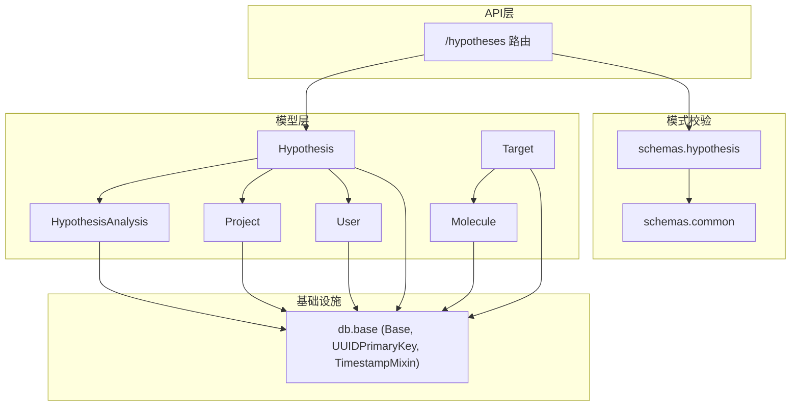
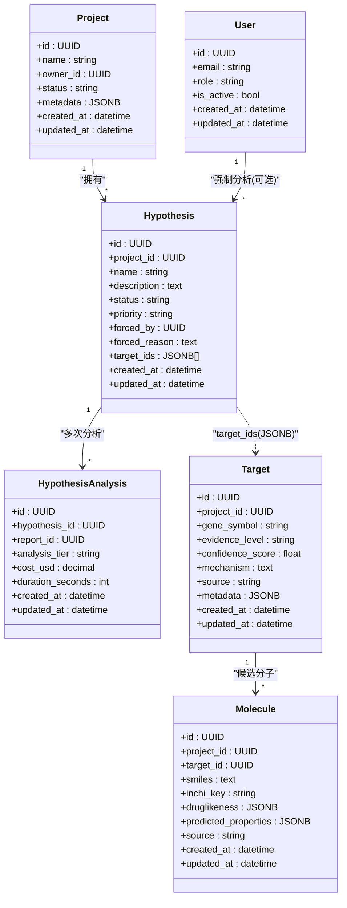
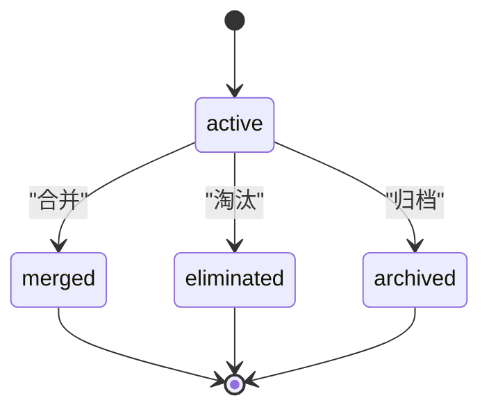
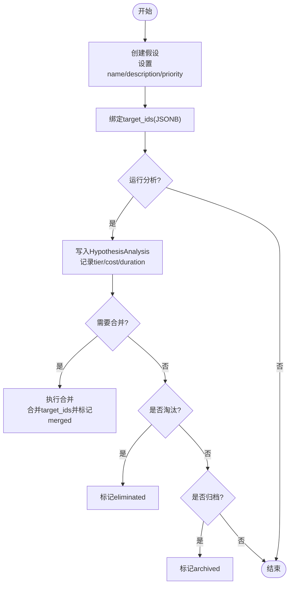
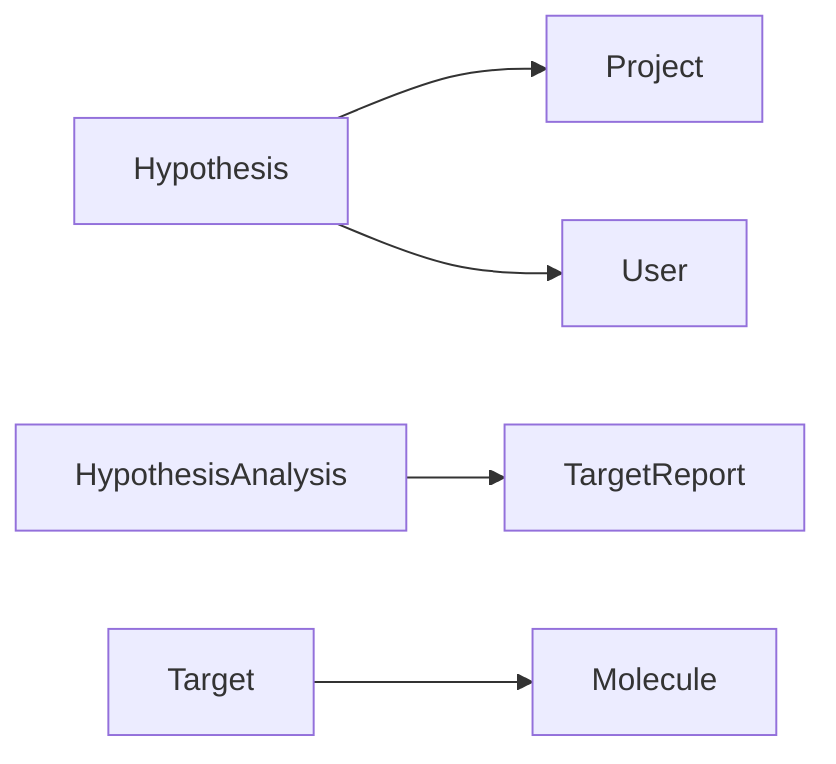

# 科学假设模型

<cite>
**本文引用的文件**   
- [hypothesis.py](file://backend/app/models/hypothesis.py)
- [hypothesis.py](file://backend/app/schemas/hypothesis.py)
- [hypotheses.py](file://backend/app/api/v1/hypotheses.py)
- [target.py](file://backend/app/models/target.py)
- [molecule.py](file://backend/app/models/molecule.py)
- [project.py](file://backend/app/models/project.py)
- [user.py](file://backend/app/models/user.py)
- [common.py](file://backend/app/schemas/common.py)
- [base.py](file://backend/app/db/base.py)
- [03-database.md](file://docs/design/03-database.md)
</cite>

## 目录
1. [引言](#引言)
2. [项目结构](#项目结构)
3. [核心组件](#核心组件)
4. [架构总览](#架构总览)
5. [详细组件分析](#详细组件分析)
6. [依赖关系分析](#依赖关系分析)
7. [性能考虑](#性能考虑)
8. [故障排查指南](#故障排查指南)
9. [结论](#结论)
10. [附录](#附录)

## 引言
本文件面向AI药物设计系统中的“科学假设”能力，提供完整的数据库Schema与数据模型文档。重点覆盖：
- Hypothesis 实体的字段定义、数据类型与业务规则（标题、描述、状态、优先级等）
- 假设生命周期管理（提出→验证→结论）的状态机设计与约束
- 假设与靶点、分子、实验数据的关联关系设计
- 证据链构建、版本控制机制、团队协作的数据模型支持
- 为科研团队提供可落地的数据库设计方案与实现指导

## 项目结构
围绕假设能力的核心代码位于后端模块：
- 数据模型：backend/app/models/hypothesis.py、target.py、molecule.py、project.py、user.py
- API 层：backend/app/api/v1/hypotheses.py
- 请求/响应校验：backend/app/schemas/hypothesis.py、backend/app/schemas/common.py
- 基础类型与混入：backend/app/db/base.py
- 数据库设计说明：docs/design/03-database.md

图表来源
- [hypothesis.py:1-66](file://backend/app/models/hypothesis.py#L1-L66)
- [target.py:1-52](file://backend/app/models/target.py#L1-L52)
- [molecule.py:1-61](file://backend/app/models/molecule.py#L1-L61)
- [project.py:1-42](file://backend/app/models/project.py#L1-L42)
- [user.py:1-36](file://backend/app/models/user.py#L1-L36)
- [hypotheses.py:1-273](file://backend/app/api/v1/hypotheses.py#L1-L273)
- [hypothesis.py:1-119](file://backend/app/schemas/hypothesis.py#L1-L119)
- [common.py:1-158](file://backend/app/schemas/common.py#L1-L158)
- [base.py:1-48](file://backend/app/db/base.py#L1-L48)

章节来源
- [hypothesis.py:1-66](file://backend/app/models/hypothesis.py#L1-L66)
- [hypotheses.py:1-273](file://backend/app/api/v1/hypotheses.py#L1-L273)
- [hypothesis.py:1-119](file://backend/app/schemas/hypothesis.py#L1-L119)
- [common.py:1-158](file://backend/app/schemas/common.py#L1-L158)
- [base.py:1-48](file://backend/app/db/base.py#L1-L48)
- [03-database.md:1-325](file://docs/design/03-database.md#L1-L325)

## 核心组件
- Hypothesis（假设）
  - 标识与归属：UUID主键；所属项目ID（外键）
  - 研究管理字段：名称、描述、状态、优先级、强制深度分析标记及原因
  - 关注靶点集合：JSONB数组存储目标靶点ID列表
  - 时间戳：创建/更新时间由基类混入提供
- HypothesisAnalysis（假设分析记录）
  - 一次分析对应一个报告ID与分析层级（quick/deep），并记录成本与耗时
  - 与Hypothesis一对多，与TargetReport一对一（通过report_id）
- Target（靶点）
  - 包含证据等级、置信度、机制、来源等，支撑证据链
- Molecule（分子）
  - 与靶点一对多，承载SMILES、属性、对接结果等
- Project（项目）
  - 假设的顶层容器，拥有多个假设
- User（用户）
  - 支持角色与权限，用于“创始人强制深度分析”等协作场景

章节来源
- [hypothesis.py:15-66](file://backend/app/models/hypothesis.py#L15-L66)
- [target.py:14-52](file://backend/app/models/target.py#L14-L52)
- [molecule.py:14-61](file://backend/app/models/molecule.py#L14-L61)
- [project.py:14-42](file://backend/app/models/project.py#L14-L42)
- [user.py:14-36](file://backend/app/models/user.py#L14-L36)
- [03-database.md:170-212](file://docs/design/03-database.md#L170-L212)

## 架构总览
下图展示假设在系统内的位置与关键交互：
- 假设隶属于项目，关联一组靶点
- 每次分析生成一条分析记录，并指向一份靶点报告
- 分子与靶点存在一对多关系，支撑后续分子筛选与对接评估
- 用户参与协作（如强制深度分析）

图表来源
- [project.py:14-42](file://backend/app/models/project.py#L14-L42)
- [user.py:14-36](file://backend/app/models/user.py#L14-L36)
- [hypothesis.py:15-66](file://backend/app/models/hypothesis.py#L15-L66)
- [target.py:14-52](file://backend/app/models/target.py#L14-L52)
- [molecule.py:14-61](file://backend/app/models/molecule.py#L14-L61)

## 详细组件分析

### Hypothesis 实体与字段定义
- 基本字段
  - id：UUID主键（分布式友好）
  - project_id：所属项目（外键，级联删除）
  - name：假设标题（非空，长度限制）
  - description：假设描述（可选）
  - status：状态（枚举：active/merged/archived/eliminated）
  - priority：优先级（枚举：low/normal/high/forced）
  - forced_by：强制深度分析的用户ID（可选）
  - forced_reason：强制理由（可选）
  - target_ids：关注的靶点ID集合（JSONB数组）
  - created_at/updated_at：时间戳（基类混入）
- 业务规则
  - 状态变更需遵循状态机约束（见下节）
  - 优先级为“forced”时建议记录forced_by与forced_reason
  - target_ids为空表示未锁定特定靶点，允许后续动态扩展

章节来源
- [hypothesis.py:15-47](file://backend/app/models/hypothesis.py#L15-L47)
- [common.py:153-157](file://backend/app/schemas/common.py#L153-L157)
- [03-database.md:170-186](file://docs/design/03-database.md#L170-L186)

### HypothesisAnalysis 分析记录
- 字段要点
  - hypothesis_id：关联假设
  - report_id：关联靶点报告（用于证据聚合）
  - analysis_tier：分析层级（quick/deep）
  - cost_usd/duration_seconds：成本与耗时追踪
- 用途
  - 作为假设的证据链节点，串联报告与指标，便于对比与审计

章节来源
- [hypothesis.py:49-66](file://backend/app/models/hypothesis.py#L49-L66)
- [03-database.md:188-199](file://docs/design/03-database.md#L188-L199)

### 假设生命周期与状态机
- 状态集合
  - active：活跃中，持续验证
  - merged：已合并到另一假设（保留历史）
  - archived：归档（暂停但不删除）
  - eliminated：淘汰（不再推进）
- 转换规则（建议）
  - active → merged：执行合并操作后，源假设置为merged
  - active → eliminated：经评审或证据不足后淘汰
  - active → archived：阶段性暂停
  - merged/archived/eliminated 均不可逆回 active（如需恢复应新建假设）
- 强制深度分析
  - 当priority=forced时，建议记录forced_by与forced_reason，体现决策溯源

图表来源
- [hypotheses.py:214-272](file://backend/app/api/v1/hypotheses.py#L214-L272)
- [common.py:153-157](file://backend/app/schemas/common.py#L153-L157)

章节来源
- [hypotheses.py:214-272](file://backend/app/api/v1/hypotheses.py#L214-L272)
- [common.py:153-157](file://backend/app/schemas/common.py#L153-L157)

### 假设与靶点、分子、实验数据的关联
- 假设与靶点
  - 通过Hypothesis.target_ids（JSONB数组）声明关注靶点集合
  - 建议在查询时结合索引与GIN表达式优化检索
- 假设与分子
  - 间接关联：Hypothesis → Target → Molecule（一对多）
  - 可在比较视图汇总top_targets/top_molecules
- 假设与实验/报告
  - HypothesisAnalysis.report_id 指向靶点报告，形成证据链节点
  - 支持按层级（quick/deep）、成本、耗时进行对比

图表来源
- [hypotheses.py:39-100](file://backend/app/api/v1/hypotheses.py#L39-L100)
- [hypotheses.py:185-212](file://backend/app/api/v1/hypotheses.py#L185-L212)
- [hypotheses.py:214-272](file://backend/app/api/v1/hypotheses.py#L214-L272)

章节来源
- [hypotheses.py:39-100](file://backend/app/api/v1/hypotheses.py#L39-L100)
- [hypotheses.py:185-212](file://backend/app/api/v1/hypotheses.py#L185-L212)
- [hypotheses.py:214-272](file://backend/app/api/v1/hypotheses.py#L214-L272)

### 证据链构建与版本控制
- 证据链
  - HypothesisAnalysis 作为证据节点，链接到具体报告（report_id）
  - 报告内可包含LLM摘要、结构化内容、CDISC导出路径等
- 版本控制
  - 当前采用“软状态+追加记录”的方式：不直接修改原假设，而是新增分析记录
  - 合并操作将target_ids去重合并，并将源假设标记为merged，保留历史轨迹
  - 建议未来引入显式版本号字段（如version_major/version_minor）以增强可读性与回溯

章节来源
- [hypothesis.py:49-66](file://backend/app/models/hypothesis.py#L49-L66)
- [hypotheses.py:214-247](file://backend/app/api/v1/hypotheses.py#L214-L247)
- [03-database.md:132-168](file://docs/design/03-database.md#L132-L168)

### 团队协作与权限支持
- 用户角色
  - founder/pi/researcher/doctor/engineer，影响访问与操作权限
- 强制深度分析
  - 通过forced_by与forced_reason记录决策者及原因，体现协作与治理
- 审计日志
  - 所有关键写操作建议落盘至audit_logs，满足合规与追溯

章节来源
- [user.py:14-36](file://backend/app/models/user.py#L14-L36)
- [hypothesis.py:34-37](file://backend/app/models/hypothesis.py#L34-L37)
- [03-database.md:213-229](file://docs/design/03-database.md#L213-L229)

## 依赖关系分析
- 模型耦合
  - Hypothesis 强依赖 Project（外键）与 User（可选）
  - HypothesisAnalysis 弱依赖 TargetReport（通过report_id）
  - Target 与 Molecule 解耦于假设，但可通过target_ids建立逻辑关联
- 外部依赖
  - PostgreSQL（JSONB、UUID、TIMESTAMPTZ）
  - Redis（会话/速率限制/任务状态缓存）
  - Chroma（向量检索）
  - 对象存储（大文件）

图表来源
- [hypothesis.py:15-66](file://backend/app/models/hypothesis.py#L15-L66)
- [project.py:14-42](file://backend/app/models/project.py#L14-L42)
- [user.py:14-36](file://backend/app/models/user.py#L14-L36)
- [target.py:14-52](file://backend/app/models/target.py#L14-L52)
- [molecule.py:14-61](file://backend/app/models/molecule.py#L14-L61)

章节来源
- [hypothesis.py:15-66](file://backend/app/models/hypothesis.py#L15-L66)
- [project.py:14-42](file://backend/app/models/project.py#L14-L42)
- [user.py:14-36](file://backend/app/models/user.py#L14-L36)
- [target.py:14-52](file://backend/app/models/target.py#L14-L52)
- [molecule.py:14-61](file://backend/app/models/molecule.py#L14-L61)

## 性能考虑
- 索引策略
  - hypotheses.project_id、hypotheses.status 复合索引提升列表过滤效率
  - targets.gene_symbol/evidence_level 索引加速靶点检索
  - molecules.inchi_key 唯一索引避免重复
- JSONB 使用
  - target_ids 使用JSONB数组，建议配合GIN索引与表达式索引优化查询
- 分页与加载
  - 列表接口统一分页，避免一次性拉取大量数据
- 异步任务
  - 分析任务返回queued状态，前端轮询或事件驱动更新

章节来源
- [03-database.md:170-212](file://docs/design/03-database.md#L170-L212)
- [hypotheses.py:62-100](file://backend/app/api/v1/hypotheses.py#L62-L100)

## 故障排查指南
- 常见错误
  - 无效状态/优先级：校验失败，检查ALLOWED_HYPOTHESIS_STATUS/ALLOWED_HYPOTHESIS_PRIORITY
  - 合并到自身：禁止自合并，需选择不同目标假设
  - 假设不存在：确保传入ID有效且未被删除
- 定位方法
  - 查看API层异常抛出与返回码
  - 核对数据库外键约束与级联行为
  - 通过审计日志追踪关键变更

章节来源
- [hypotheses.py:214-272](file://backend/app/api/v1/hypotheses.py#L214-L272)
- [common.py:153-157](file://backend/app/schemas/common.py#L153-L157)

## 结论
本方案以Hypothesis为核心，结合HypothesisAnalysis形成可追溯的证据链，并通过JSONB灵活表达靶点集合，兼顾了科研协作与可扩展性。状态机与优先级机制保障了流程可控与资源聚焦。建议后续引入显式版本字段与更完善的权限控制，进一步提升可维护性与合规性。

## 附录

### SQL DDL 示例（PostgreSQL）
以下为基于现有模型的DDL参考，供落地实施使用（字段名与类型与ORM一致）：

- users
  - id UUID PK
  - email VARCHAR(255) UNIQUE NOT NULL
  - hashed_password VARCHAR(255) NOT NULL
  - full_name VARCHAR(100) NOT NULL
  - role VARCHAR(20) NOT NULL DEFAULT 'researcher'
  - is_active BOOLEAN NOT NULL DEFAULT true
  - last_login_at TIMESTAMPTZ
  - created_at TIMESTAMPTZ DEFAULT now()
  - updated_at TIMESTAMPTZ DEFAULT now()

- projects
  - id UUID PK
  - name VARCHAR(200) NOT NULL
  - description TEXT
  - owner_id UUID NOT NULL REFERENCES users(id) ON DELETE RESTRICT
  - status VARCHAR(20) NOT NULL DEFAULT 'active'
  - cancer_type VARCHAR(100)
  - patient_pseudonym VARCHAR(100)
  - metadata JSONB NOT NULL DEFAULT '{}'
  - created_at TIMESTAMPTZ DEFAULT now()
  - updated_at TIMESTAMPTZ DEFAULT now()

- hypotheses
  - id UUID PK
  - project_id UUID NOT NULL REFERENCES projects(id) ON DELETE CASCADE
  - name VARCHAR(200) NOT NULL
  - description TEXT
  - status VARCHAR(20) NOT NULL DEFAULT 'active'
  - priority VARCHAR(10) NOT NULL DEFAULT 'normal'
  - forced_by UUID REFERENCES users(id) ON DELETE SET NULL
  - forced_reason TEXT
  - target_ids JSONB NOT NULL DEFAULT '[]'
  - created_at TIMESTAMPTZ DEFAULT now()
  - updated_at TIMESTAMPTZ DEFAULT now()

- hypothesis_analyses
  - id UUID PK
  - hypothesis_id UUID NOT NULL REFERENCES hypotheses(id) ON DELETE CASCADE
  - report_id UUID NOT NULL REFERENCES target_reports(id) ON DELETE CASCADE
  - analysis_tier VARCHAR(10) NOT NULL DEFAULT 'quick'
  - cost_usd DECIMAL(10,4)
  - duration_seconds INT
  - created_at TIMESTAMPTZ DEFAULT now()

- targets
  - id UUID PK
  - project_id UUID NOT NULL REFERENCES projects(id) ON DELETE CASCADE
  - dataset_id UUID REFERENCES datasets(id) ON DELETE SET NULL
  - gene_symbol VARCHAR(50) NOT NULL
  - gene_entrez_id VARCHAR(20)
  - evidence_level VARCHAR(5) NOT NULL DEFAULT 'IV'
  - confidence_score FLOAT
  - mechanism TEXT
  - source VARCHAR(30)
  - metadata JSONB NOT NULL DEFAULT '{}'
  - created_at TIMESTAMPTZ DEFAULT now()
  - updated_at TIMESTAMPTZ DEFAULT now()

- molecules
  - id UUID PK
  - project_id UUID NOT NULL REFERENCES projects(id) ON DELETE CASCADE
  - target_id UUID REFERENCES targets(id) ON DELETE SET NULL
  - smiles TEXT NOT NULL
  - inchi_key VARCHAR(27)
  - chembl_id VARCHAR(20)
  - is_approved BOOLEAN NOT NULL DEFAULT false
  - druglikeness JSONB NOT NULL DEFAULT '{}'
  - predicted_properties JSONB NOT NULL DEFAULT '{}'
  - source VARCHAR(30)
  - created_at TIMESTAMPTZ DEFAULT now()
  - updated_at TIMESTAMPTZ DEFAULT now()

- docking_results
  - id UUID PK
  - molecule_id UUID NOT NULL REFERENCES molecules(id) ON DELETE CASCADE
  - protein_pdb_id VARCHAR(10)
  - protein_pdb_path TEXT
  - poses JSONB NOT NULL DEFAULT '[]'
  - top_confidence FLOAT
  - docked_by VARCHAR(20) NOT NULL DEFAULT 'diffdock_nim'
  - created_at TIMESTAMPTZ DEFAULT now()

- audit_logs（append-only）
  - id BIGSERIAL PK
  - user_id UUID REFERENCES users(id)
  - action VARCHAR(50) NOT NULL
  - resource_type VARCHAR(30)
  - resource_id UUID
  - before_value JSONB
  - after_value JSONB
  - ip_address INET
  - user_agent TEXT
  - created_at TIMESTAMPTZ DEFAULT now()

- target_reports（补充，用于假设分析引用）
  - id UUID PK
  - project_id UUID NOT NULL REFERENCES projects(id) ON DELETE CASCADE
  - target_ids UUID[] NOT NULL
  - analysis_tier VARCHAR(10) NOT NULL
  - llm_model VARCHAR(50)
  - llm_cost_usd DECIMAL(10,4)
  - llm_tokens_in INT
  - llm_tokens_out INT
  - duration_seconds INT
  - summary TEXT
  - content_md TEXT
  - content_json JSONB
  - cdisc_sdtm_path TEXT
  - created_at TIMESTAMPTZ DEFAULT now()

章节来源
- [03-database.md:44-242](file://docs/design/03-database.md#L44-L242)
- [hypothesis.py:15-66](file://backend/app/models/hypothesis.py#L15-L66)
- [target.py:14-52](file://backend/app/models/target.py#L14-L52)
- [molecule.py:14-61](file://backend/app/models/molecule.py#L14-L61)
- [project.py:14-42](file://backend/app/models/project.py#L14-L42)
- [user.py:14-36](file://backend/app/models/user.py#L14-L36)