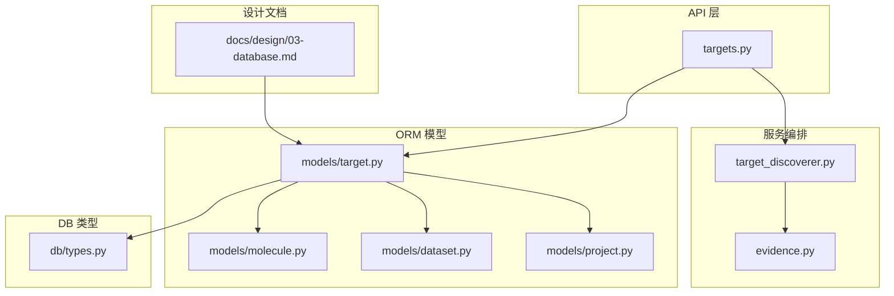
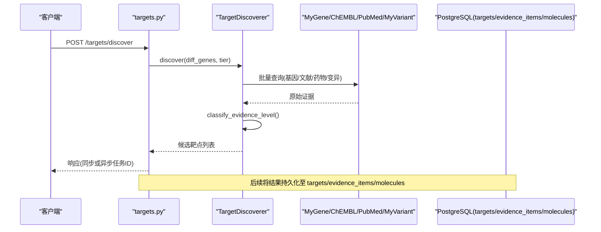
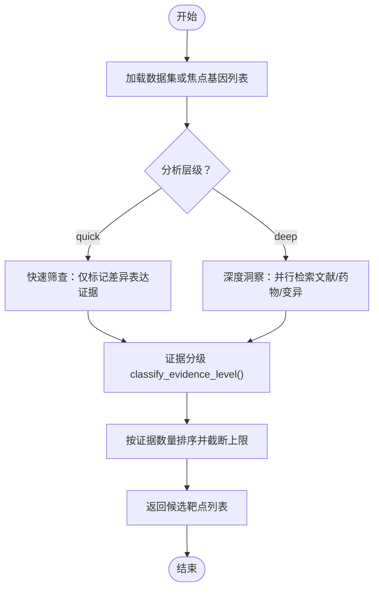
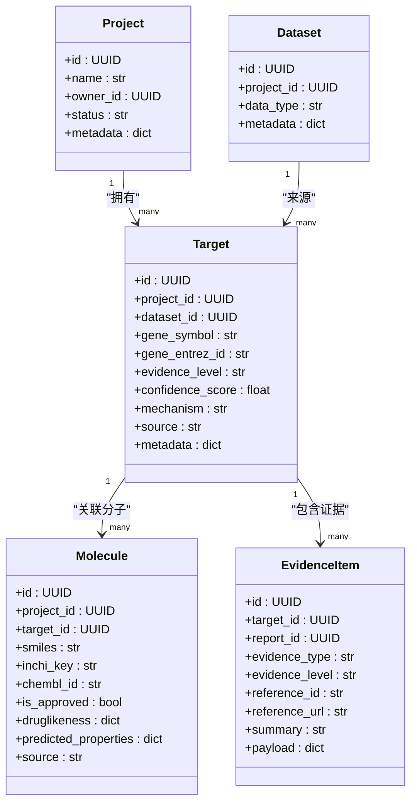
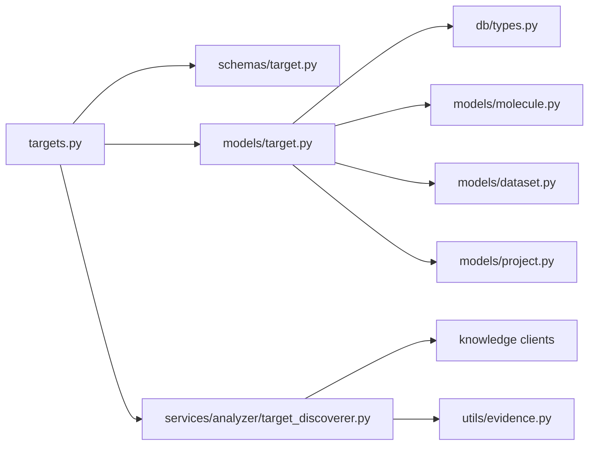

# 靶点发现模型

<cite>
**本文引用的文件**
- [backend/app/models/target.py](file://backend/app/models/target.py)
- [backend/app/schemas/target.py](file://backend/app/schemas/target.py)
- [backend/app/api/v1/targets.py](file://backend/app/api/v1/targets.py)
- [backend/app/services/analyzer/target_discoverer.py](file://backend/app/services/analyzer/target_discoverer.py)
- [backend/app/utils/evidence.py](file://backend/app/utils/evidence.py)
- [backend/app/db/types.py](file://backend/app/db/types.py)
- [backend/app/models/molecule.py](file://backend/app/models/molecule.py)
- [backend/app/models/dataset.py](file://backend/app/models/dataset.py)
- [backend/app/models/project.py](file://backend/app/models/project.py)
- [docs/design/03-database.md](file://docs/design/03-database.md)
</cite>

## 目录
1. [引言](#引言)
2. [项目结构](#项目结构)
3. [核心组件](#核心组件)
4. [架构总览](#架构总览)
5. [详细组件分析](#详细组件分析)
6. [依赖关系分析](#依赖关系分析)
7. [性能与索引策略](#性能与索引策略)
8. [故障排查指南](#故障排查指南)
9. [结论](#结论)
10. [附录：SQL DDL 示例](#附录sql-ddl-示例)

## 引言
本文件面向生物信息学研究人员，提供“靶点发现模型”的数据库 Schema 文档。重点覆盖 Target 实体的完整字段定义、证据等级系统（I–IV级）的设计原理与业务规则、不同来源（differential_expression、variant、drug_repurposing、pathway、network）的识别方法，以及 Target 与项目、数据集、分子结构的关联关系设计。同时给出完整的 SQL DDL 示例、索引策略和外键约束配置建议，帮助团队在 PostgreSQL 上实现可查询、可扩展、可审计的靶点数据建模。

## 项目结构
围绕靶点发现的数据与代码组织如下：
- ORM 模型层：Target、Molecule、Dataset、Project 等实体定义
- API 层：靶点发现、列表、详情、网络构建、协同预测等接口
- 服务编排层：TargetDiscoverer 整合多组学与知识库客户端
- 工具层：证据分级 classify_evidence_level
- 类型兼容层：JSONBCompat 跨方言 JSONB 支持
- 设计文档：数据库 ER 与表结构说明



图表来源
- [backend/app/api/v1/targets.py:1-344](file://backend/app/api/v1/targets.py#L1-L344)
- [backend/app/services/analyzer/target_discoverer.py:1-176](file://backend/app/services/analyzer/target_discoverer.py#L1-L176)
- [backend/app/utils/evidence.py:1-103](file://backend/app/utils/evidence.py#L1-L103)
- [backend/app/models/target.py:1-52](file://backend/app/models/target.py#L1-L52)
- [backend/app/models/molecule.py:1-61](file://backend/app/models/molecule.py#L1-L61)
- [backend/app/models/dataset.py:1-70](file://backend/app/models/dataset.py#L1-L70)
- [backend/app/models/project.py:1-42](file://backend/app/models/project.py#L1-L42)
- [backend/app/db/types.py:1-42](file://backend/app/db/types.py#L1-L42)
- [docs/design/03-database.md:1-325](file://docs/design/03-database.md#L1-L325)

章节来源
- [backend/app/api/v1/targets.py:1-344](file://backend/app/api/v1/targets.py#L1-L344)
- [backend/app/services/analyzer/target_discoverer.py:1-176](file://backend/app/services/analyzer/target_discoverer.py#L1-L176)
- [backend/app/utils/evidence.py:1-103](file://backend/app/utils/evidence.py#L1-L103)
- [backend/app/models/target.py:1-52](file://backend/app/models/target.py#L1-L52)
- [backend/app/models/molecule.py:1-61](file://backend/app/models/molecule.py#L1-L61)
- [backend/app/models/dataset.py:1-70](file://backend/app/models/dataset.py#L1-L70)
- [backend/app/models/project.py:1-42](file://backend/app/models/project.py#L1-L42)
- [backend/app/db/types.py:1-42](file://backend/app/db/types.py#L1-L42)
- [docs/design/03-database.md:1-325](file://docs/design/03-database.md#L1-L325)

## 核心组件
- Target 实体：记录发现的药物靶点，包含基因标识、证据等级、置信度、机制描述、来源、扩展元数据等
- EvidenceItem 实体：支撑 Target 的多源证据项，含证据类型、等级、参考信息与载荷
- Molecule 实体：候选分子，与 Target 双向关联
- Dataset 实体：多组学数据集，作为 Target 的来源之一
- Project 实体：项目维度，Target 归属项目
- JSONB 兼容类型：PostgreSQL 使用原生 JSONB，其他方言降级为通用 JSON

章节来源
- [backend/app/models/target.py:14-52](file://backend/app/models/target.py#L14-L52)
- [backend/app/schemas/target.py:20-65](file://backend/app/schemas/target.py#L20-L65)
- [backend/app/models/molecule.py:14-61](file://backend/app/models/molecule.py#L14-L61)
- [backend/app/models/dataset.py:15-70](file://backend/app/models/dataset.py#L15-L70)
- [backend/app/models/project.py:14-42](file://backend/app/models/project.py#L14-L42)
- [backend/app/db/types.py:13-27](file://backend/app/db/types.py#L13-L27)

## 架构总览
靶点发现端到端流程：
- API 接收请求（快速或深度）
- 服务编排器并行调用 MyGene、ChEMBL、PubMed、MyVariant 等外部知识源
- 依据证据类型与载荷进行证据分级
- 返回候选靶点列表或异步任务结果
- 持久化到 targets 表，并通过 evidence_items 与 molecules 建立关联



图表来源
- [backend/app/api/v1/targets.py:42-130](file://backend/app/api/v1/targets.py#L42-L130)
- [backend/app/services/analyzer/target_discoverer.py:52-139](file://backend/app/services/analyzer/target_discoverer.py#L52-L139)
- [backend/app/utils/evidence.py:39-75](file://backend/app/utils/evidence.py#L39-L75)

## 详细组件分析

### Target 实体字段定义与约束
- id: UUID，主键
- project_id: UUID，外键→projects.id，非空，级联删除
- dataset_id: UUID，外键→datasets.id，可为空，置空删除
- gene_symbol: VARCHAR(50)，非空，用于唯一标识基因符号（如 EGFR）
- gene_entrez_id: VARCHAR(20)，可为空，NCBI Entrez ID
- evidence_level: VARCHAR(5)，非空，默认 IV，取值 I/II/III/IV
- confidence_score: FLOAT，可为空，范围 0-1
- mechanism: TEXT，可为空，机制描述
- source: VARCHAR(30)，可为空，取值 differential_expression | variant | drug_repurposing | pathway | network
- metadata_: 列名映射为 metadata，JSONB 兼容类型，默认 {}，不可为空
- created_at / updated_at: 时间戳（由基类注入）

证据等级系统（I–IV级）设计原则与业务规则：
- I 级：已获批靶向药/标准治疗方案（如 fda_approved、nmpa_approved、chembl_approved_drug）
- II 级：指南推荐但未获批（如 nccn_guideline、esmo_guideline、cso_guideline）
- III 级：临床试验阶段（phase1/2/3 或 clinicaltrials_gov）
- IV 级：临床前研究/个案报道/理论推测（如 clinvar、cosmic、pubmed_case、pathway_analysis、network_inference、differential_expression）

证据分级逻辑：
- 优先读取 payload 中的显式 evidence_level
- 若 is_approved 为真则直接定为 I 级
- 对 clinical_trial 类型根据 phase 判定为 III 级
- 否则按 _SOURCE_LEVEL_MAP 默认映射，未知类型回退为 IV 级

证据项（EvidenceItem）字段：
- target_id: UUID，外键→targets.id
- report_id: UUID，外键→target_reports.id，可为空
- evidence_type: VARCHAR(30)，取值 clinvar | cosmic | chembl | pubmed | clinical_trial | pathway
- evidence_level: VARCHAR(5)，非空，I/II/III/IV
- reference_id: VARCHAR(100)，可为空
- reference_url: TEXT，可为空
- summary: TEXT，可为空
- payload: JSONB，存储原始数据
- created_at: 时间戳

分子（Molecule）与 Target 的关系：
- Molecule.target_id: UUID，外键→targets.id，可为空
- Target.molecules: 一对多关系，反向引用 Molecule

数据集（Dataset）与 Target 的关系：
- Target.dataset_id: UUID，外键→datasets.id，可为空
- Dataset.metadata_ 中可包含 marker_genes 等关键信息，供快速筛查使用

项目（Project）与 Target 的关系：
- Target.project_id: UUID，外键→projects.id，非空

章节来源
- [backend/app/models/target.py:14-52](file://backend/app/models/target.py#L14-L52)
- [backend/app/schemas/target.py:20-65](file://backend/app/schemas/target.py#L20-L65)
- [backend/app/utils/evidence.py:14-75](file://backend/app/utils/evidence.py#L14-L75)
- [backend/app/models/molecule.py:14-61](file://backend/app/models/molecule.py#L14-L61)
- [backend/app/models/dataset.py:15-70](file://backend/app/models/dataset.py#L15-L70)
- [backend/app/models/project.py:14-42](file://backend/app/models/project.py#L14-L42)
- [docs/design/03-database.md:96-168](file://docs/design/03-database.md#L96-L168)

### 靶点识别方法与来源
- differential_expression：基于差异表达筛选候选基因，证据等级默认为 IV；常用于快速筛查
- variant：通过 MyVariant 评估临床变异意义，结合 ClinVar/COSMIC 等来源，证据等级多为 IV
- drug_repurposing：利用 ChEMBL 检索已有药物与活性数据，若为已批准药物可提升为 I 级
- pathway：通路富集分析（如 KEGG/Reactome），证据等级多为 IV
- network：PPI 网络推断与模块识别，证据等级多为 IV

证据来源与等级映射见证据分级工具函数。

章节来源
- [backend/app/services/analyzer/target_discoverer.py:82-139](file://backend/app/services/analyzer/target_discoverer.py#L82-L139)
- [backend/app/utils/evidence.py:14-75](file://backend/app/utils/evidence.py#L14-L75)

### 数据流与处理逻辑


图表来源
- [backend/app/api/v1/targets.py:42-130](file://backend/app/api/v1/targets.py#L42-L130)
- [backend/app/services/analyzer/target_discoverer.py:52-139](file://backend/app/services/analyzer/target_discoverer.py#L52-L139)
- [backend/app/utils/evidence.py:39-75](file://backend/app/utils/evidence.py#L39-L75)

### 关联关系设计
- Target → Project：一个项目下多个靶点
- Target → Dataset：靶点来源于某个数据集（可为空）
- Target → Molecule：一个靶点对应多个候选分子
- Molecule → DockingResult：对接结果与分子一对一或多对一（此处为多对一）
- Target → EvidenceItem：一个靶点有多条证据项



图表来源
- [backend/app/models/project.py:14-42](file://backend/app/models/project.py#L14-L42)
- [backend/app/models/dataset.py:15-70](file://backend/app/models/dataset.py#L15-L70)
- [backend/app/models/target.py:14-52](file://backend/app/models/target.py#L14-L52)
- [backend/app/models/molecule.py:14-61](file://backend/app/models/molecule.py#L14-L61)
- [docs/design/03-database.md:96-168](file://docs/design/03-database.md#L96-L168)

## 依赖关系分析
- API 层依赖服务编排器与 Pydantic Schemas
- 服务编排器依赖外部知识客户端与证据分级工具
- ORM 模型依赖 JSONB 兼容类型与基础基类
- 设计文档提供 ER 与表结构规范，指导迁移与索引



图表来源
- [backend/app/api/v1/targets.py:1-344](file://backend/app/api/v1/targets.py#L1-L344)
- [backend/app/schemas/target.py:1-185](file://backend/app/schemas/target.py#L1-L185)
- [backend/app/services/analyzer/target_discoverer.py:1-176](file://backend/app/services/analyzer/target_discoverer.py#L1-L176)
- [backend/app/utils/evidence.py:1-103](file://backend/app/utils/evidence.py#L1-L103)
- [backend/app/models/target.py:1-52](file://backend/app/models/target.py#L1-L52)
- [backend/app/db/types.py:1-42](file://backend/app/db/types.py#L1-L42)
- [backend/app/models/molecule.py:1-61](file://backend/app/models/molecule.py#L1-L61)
- [backend/app/models/dataset.py:1-70](file://backend/app/models/dataset.py#L1-L70)
- [backend/app/models/project.py:1-42](file://backend/app/models/project.py#L1-L42)

## 性能与索引策略
- 复合索引
  - idx_targets_project_evidence(project_id, evidence_level)：加速按项目与证据等级过滤
  - idx_targets_gene_source(gene_symbol, source)：加速按基因符号与来源检索
  - idx_molecules_target_project(target_id, project_id)：加速分子查询
- GIN 索引
  - idx_targets_metadata(metadata)：针对 metadata JSONB 的高效查询（如 marker_genes、forced_analyses）
  - idx_evidence_payload(payload)：针对证据项载荷的结构化检索
- 唯一性约束
  - molecules.inchi_key 唯一索引，避免重复分子
- 外键约束
  - ondelete CASCADE/SET NULL 合理设置，保证数据一致性
- 分页与排序
  - 列表接口按 confidence_score DESC NULLS LAST 排序，配合 LIMIT/OFFSET 分页

章节来源
- [docs/design/03-database.md:94-131](file://docs/design/03-database.md#L94-L131)
- [backend/app/api/v1/targets.py:133-179](file://backend/app/api/v1/targets.py#L133-L179)

## 故障排查指南
- 靶点发现失败降级：当外部服务不可用时，API 返回空结果与错误信息，便于前端提示重试
- 强制深度分析权限控制：仅 founder 角色可触发，防止误操作
- 证据等级校验：Pydantic 校验 ALLOWED_EVIDENCE_LEVELS，确保 I/II/III/IV 合法值
- JSONB 兼容性：PostgreSQL 使用 JSONB，SQLite 降级为 JSON，避免本地开发报错

章节来源
- [backend/app/api/v1/targets.py:118-130](file://backend/app/api/v1/targets.py#L118-L130)
- [backend/app/api/v1/targets.py:244-271](file://backend/app/api/v1/targets.py#L244-L271)
- [backend/app/schemas/target.py:34-39](file://backend/app/schemas/target.py#L34-L39)
- [backend/app/db/types.py:13-27](file://backend/app/db/types.py#L13-L27)

## 结论
本模型以 Target 为核心，结合证据等级系统与多源证据项，构建了从差异表达、变异、老药新用、通路到网络的完整靶点发现链路。通过 JSONB 灵活存储与合理的索引策略，既保证了查询性能，又保留了扩展能力。建议在部署时严格遵循外键约束与索引设计，并在生产环境启用 GIN 索引以提升复杂查询效率。

## 附录：SQL DDL 示例
以下为 PostgreSQL 下的 DDL 示例，涵盖 targets、evidence_items、molecules、datasets、projects 等核心表及索引与外键约束。请根据实际迁移管理（Alembic）集成到版本库。

```sql
-- 项目表
CREATE TABLE projects (
    id UUID PRIMARY KEY DEFAULT gen_random_uuid(),
    name VARCHAR(200) NOT NULL,
    description TEXT,
    owner_id UUID NOT NULL REFERENCES users(id) ON DELETE RESTRICT,
    status VARCHAR(20) NOT NULL DEFAULT 'active',
    cancer_type VARCHAR(100),
    patient_pseudonym VARCHAR(100),
    metadata JSONB NOT NULL DEFAULT '{}',
    created_at TIMESTAMPTZ NOT NULL DEFAULT now(),
    updated_at TIMESTAMPTZ NOT NULL DEFAULT now()
);

-- 数据集表
CREATE TABLE datasets (
    id UUID PRIMARY KEY DEFAULT gen_random_uuid(),
    project_id UUID NOT NULL REFERENCES projects(id) ON DELETE CASCADE,
    name VARCHAR(200) NOT NULL,
    data_type VARCHAR(30) NOT NULL,
    file_path TEXT NOT NULL,
    file_size_bytes BIGINT,
    format VARCHAR(20),
    status VARCHAR(20) NOT NULL DEFAULT 'uploaded',
    checksum VARCHAR(64),
    metadata JSONB NOT NULL DEFAULT '{}',
    quality_score FLOAT,
    uploaded_by UUID NOT NULL REFERENCES users(id) ON DELETE RESTRICT,
    processed_at TIMESTAMPTZ,
    created_at TIMESTAMPTZ NOT NULL DEFAULT now(),
    updated_at TIMESTAMPTZ NOT NULL DEFAULT now()
);

-- 靶点表
CREATE TABLE targets (
    id UUID PRIMARY KEY DEFAULT gen_random_uuid(),
    project_id UUID NOT NULL REFERENCES projects(id) ON DELETE CASCADE,
    dataset_id UUID REFERENCES datasets(id) ON DELETE SET NULL,
    gene_symbol VARCHAR(50) NOT NULL,
    gene_entrez_id VARCHAR(20),
    evidence_level VARCHAR(5) NOT NULL DEFAULT 'IV',
    confidence_score FLOAT,
    mechanism TEXT,
    source VARCHAR(30),
    metadata JSONB NOT NULL DEFAULT '{}',
    created_at TIMESTAMPTZ NOT NULL DEFAULT now(),
    updated_at TIMESTAMPTZ NOT NULL DEFAULT now()
);

-- 证据项表
CREATE TABLE evidence_items (
    id UUID PRIMARY KEY DEFAULT gen_random_uuid(),
    target_id UUID NOT NULL REFERENCES targets(id) ON DELETE CASCADE,
    report_id UUID REFERENCES target_reports(id) ON DELETE SET NULL,
    evidence_type VARCHAR(30),
    evidence_level VARCHAR(5) NOT NULL,
    reference_id VARCHAR(100),
    reference_url TEXT,
    summary TEXT,
    payload JSONB NOT NULL DEFAULT '{}',
    created_at TIMESTAMPTZ NOT NULL DEFAULT now()
);

-- 分子表
CREATE TABLE molecules (
    id UUID PRIMARY KEY DEFAULT gen_random_uuid(),
    project_id UUID NOT NULL REFERENCES projects(id) ON DELETE CASCADE,
    target_id UUID REFERENCES targets(id) ON DELETE SET NULL,
    smiles TEXT NOT NULL,
    inchi_key VARCHAR(27),
    chembl_id VARCHAR(20),
    is_approved BOOLEAN NOT NULL DEFAULT false,
    druglikeness JSONB NOT NULL DEFAULT '{}',
    predicted_properties JSONB NOT NULL DEFAULT '{}',
    source VARCHAR(30),
    created_at TIMESTAMPTZ NOT NULL DEFAULT now(),
    updated_at TIMESTAMPTZ NOT NULL DEFAULT now()
);

-- 索引
CREATE INDEX idx_targets_project_evidence ON targets(project_id, evidence_level);
CREATE INDEX idx_targets_gene_source ON targets(gene_symbol, source);
CREATE INDEX idx_targets_metadata ON targets USING GIN(metadata);
CREATE INDEX idx_molecules_target_project ON molecules(target_id, project_id);
CREATE UNIQUE INDEX idx_molecules_inchi_key ON molecules(inchi_key);
CREATE INDEX idx_evidence_target ON evidence_items(target_id);
CREATE INDEX idx_evidence_type ON evidence_items(evidence_type);
CREATE INDEX idx_evidence_payload ON evidence_items USING GIN(payload);
```

[本节为概念性 DDL 示例，未直接映射具体源码行，故不附加图表来源]