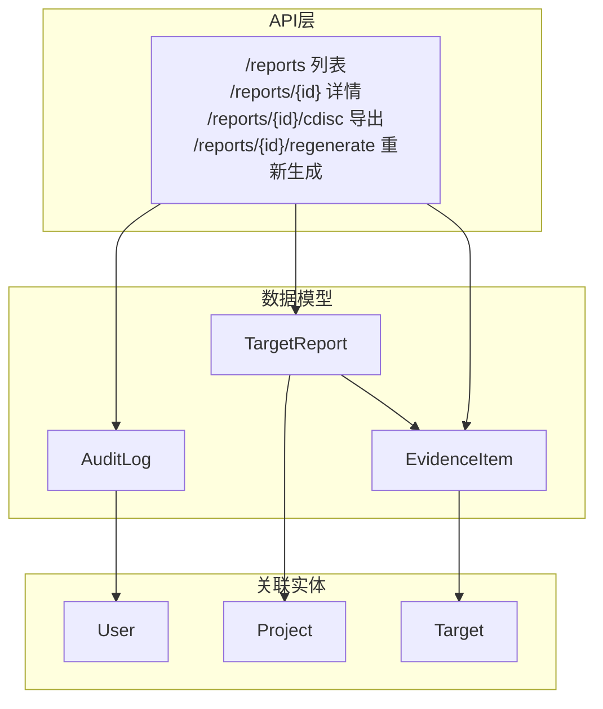
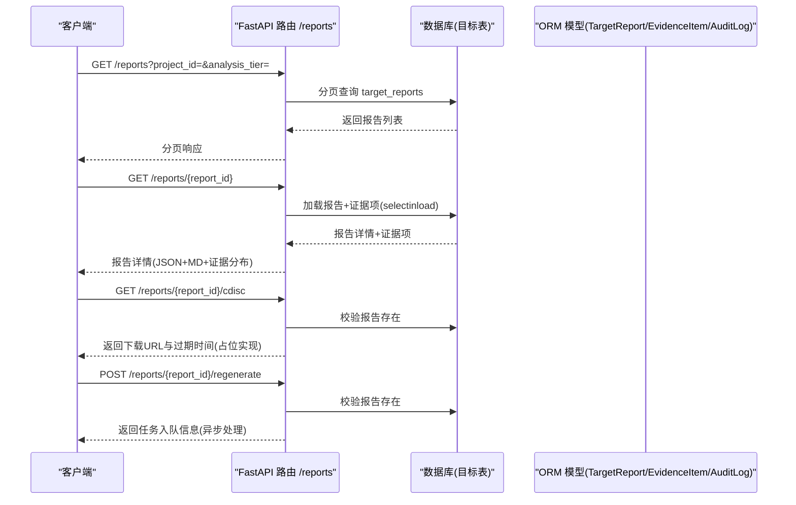
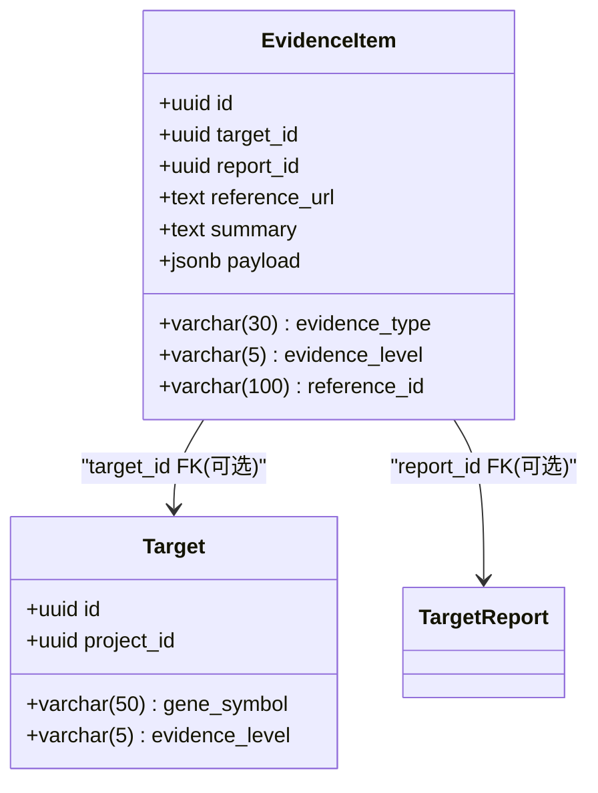
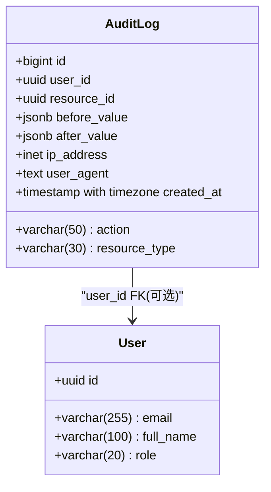
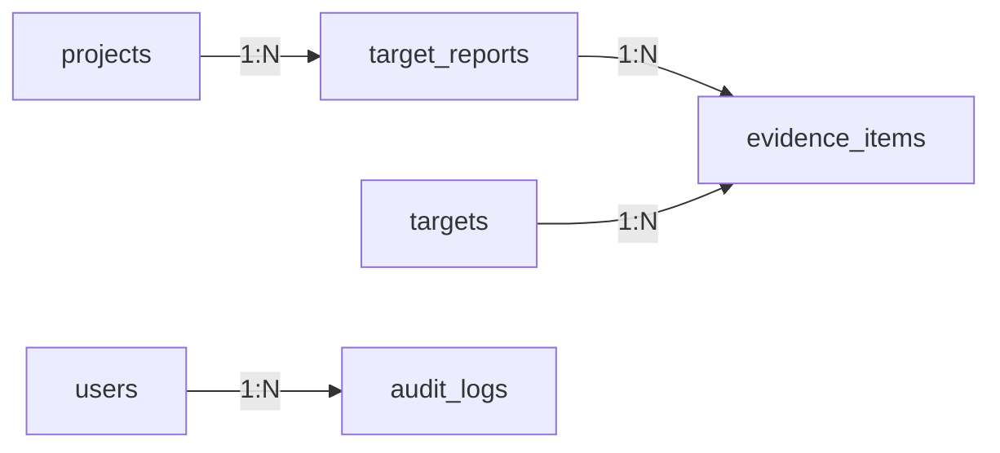

# 报告与审计模型

<cite>
**本文引用的文件**   
- [backend/app/models/report.py](file://backend/app/models/report.py)
- [backend/app/models/audit_log.py](file://backend/app/models/audit_log.py)
- [backend/app/schemas/report.py](file://backend/app/schemas/report.py)
- [backend/app/schemas/audit.py](file://backend/app/schemas/audit.py)
- [backend/app/api/v1/reports.py](file://backend/app/api/v1/reports.py)
- [backend/app/db/base.py](file://backend/app/db/base.py)
- [backend/app/db/types.py](file://backend/app/db/types.py)
- [backend/app/models/user.py](file://backend/app/models/user.py)
- [backend/app/models/project.py](file://backend/app/models/project.py)
- [backend/app/models/target.py](file://backend/app/models/target.py)
</cite>

## 目录
1. [简介](#简介)
2. [项目结构](#项目结构)
3. [核心组件](#核心组件)
4. [架构总览](#架构总览)
5. [详细组件分析](#详细组件分析)
6. [依赖关系分析](#依赖关系分析)
7. [性能考虑](#性能考虑)
8. [故障排查指南](#故障排查指南)
9. [结论](#结论)
10. [附录](#附录)

## 简介
本文件面向系统管理员与合规人员，提供AI药物设计系统中“报告”和“审计日志”相关实体的完整数据库Schema文档。内容覆盖：
- 实体字段定义、数据类型、约束条件与业务规则
- 报告生成模板、证据项、CDISC导出路径等数据模型设计
- 审计追踪记录（append-only）的完整性保证策略
- 版本控制建议、数据保留策略
- 完整的SQL DDL示例、表结构关系图、数据验证规则
- 与API层交互的关键流程说明

## 项目结构
围绕报告与审计的核心代码位于后端应用模块中：
- 数据模型：models/report.py、models/audit_log.py
- API接口：api/v1/reports.py
- Pydantic Schema：schemas/report.py、schemas/audit.py
- 公共ORM基类与类型兼容：db/base.py、db/types.py
- 关联实体：users、projects、targets（用于外键与业务上下文）



图表来源
- [backend/app/models/report.py:15-73](file://backend/app/models/report.py#L15-L73)
- [backend/app/models/audit_log.py:15-45](file://backend/app/models/audit_log.py#L15-L45)
- [backend/app/api/v1/reports.py:35-181](file://backend/app/api/v1/reports.py#L35-L181)

章节来源
- [backend/app/models/report.py:15-73](file://backend/app/models/report.py#L15-L73)
- [backend/app/models/audit_log.py:15-45](file://backend/app/models/audit_log.py#L15-L45)
- [backend/app/api/v1/reports.py:35-181](file://backend/app/api/v1/reports.py#L35-L181)

## 核心组件
- 靶点发现报告 TargetReport
  - 承载LLM生成的报告摘要、Markdown内容、结构化JSON内容、成本与Token统计、执行时长、CDISC SDTM导出路径等
  - 与证据项 EvidenceItem 一对多关联
  - 与项目 Project 通过 project_id 关联
- 证据项 EvidenceItem
  - 记录证据来源类型、证据等级、参考ID/URL、摘要与原始负载payload
  - 可关联到具体靶点 Target 或报告 TargetReport
- 审计日志 AuditLog
  - 不可变Append-only记录，包含操作主体、动作、资源类型与标识、变更前后快照、客户端IP与UA、时间戳
  - 使用BIGSERIAL主键便于按时间范围高效扫描

章节来源
- [backend/app/models/report.py:15-73](file://backend/app/models/report.py#L15-L73)
- [backend/app/models/audit_log.py:15-45](file://backend/app/models/audit_log.py#L15-L45)

## 架构总览
下图展示报告与审计在系统中的位置及关键交互：



图表来源
- [backend/app/api/v1/reports.py:35-181](file://backend/app/api/v1/reports.py#L35-L181)
- [backend/app/models/report.py:15-73](file://backend/app/models/report.py#L15-L73)

## 详细组件分析

### 报告模型 TargetReport
- 表名：target_reports
- 主键：UUID（由 UUIDPrimaryKey 混入）
- 关键字段
  - project_id：所属项目，外键至 projects.id，级联删除
  - target_ids：JSON数组，存储涉及的靶点ID集合
  - analysis_tier：分析层级（如 quick），字符串枚举
  - llm_model：使用的LLM模型名称
  - llm_cost_usd：美元成本（高精度小数）
  - llm_tokens_in/out：输入/输出Token计数
  - duration_seconds：生成耗时（秒）
  - summary：人类可读摘要
  - content_md：Markdown正文
  - content_json：结构化JSON内容
  - cdisc_sdtm_path：CDISC SDTM导出文件路径
- 关系
  - evidence_items：一对多关联到证据项
  - hypothesis_analyses：与假设分析关联（预留扩展）
- 时间戳
  - created_at、updated_at（由 TimestampMixin 提供）

```mermaid
classDiagram
class TargetReport {
+uuid id
+uuid project_id
+jsonb target_ids
+varchar(10) analysis_tier
+varchar(50) llm_model
+numeric(10,4) llm_cost_usd
+int llm_tokens_in
+int llm_tokens_out
+int duration_seconds
+text summary
+text content_md
+jsonb content_json
+text cdisc_sdtm_path
+datetime created_at
+datetime updated_at
}
class EvidenceItem {
+uuid id
+uuid report_id
+uuid target_id
+varchar(30) evidence_type
+varchar(5) evidence_level
+varchar(100) reference_id
+text reference_url
+text summary
+jsonb payload
+datetime created_at
+datetime updated_at
}
class Project {
+uuid id
+varchar(200) name
}
TargetReport --> Project : "project_id FK"
TargetReport --> EvidenceItem : "evidence_items 1 : N"
```

图表来源
- [backend/app/models/report.py:15-73](file://backend/app/models/report.py#L15-L73)
- [backend/app/models/project.py:14-42](file://backend/app/models/project.py#L14-L42)

章节来源
- [backend/app/models/report.py:15-73](file://backend/app/models/report.py#L15-L73)
- [backend/app/db/base.py:17-47](file://backend/app/db/base.py#L17-L47)
- [backend/app/db/types.py:13-26](file://backend/app/db/types.py#L13-26)

### 证据项模型 EvidenceItem
- 表名：evidence_items
- 主键：UUID
- 关键字段
  - target_id：可选，外键至 targets.id（置空删除）
  - report_id：可选，外键至 target_reports.id（置空删除）
  - evidence_type：证据来源类型（如 clinvar、cosmic、chembl、pubmed、clinical_trial、pathway、dbSNP、gnomAD）
  - evidence_level：证据等级（I/II/III/IV），默认 IV
  - reference_id/reference_url：外部引用标识与链接
  - summary：简要描述
  - payload：原始负载（JSONB）
- 关系
  - target：多对一（可选）
  - report：多对一（可选）



图表来源
- [backend/app/models/report.py:47-73](file://backend/app/models/report.py#L47-L73)
- [backend/app/models/target.py:14-52](file://backend/app/models/target.py#L14-L52)

章节来源
- [backend/app/models/report.py:47-73](file://backend/app/models/report.py#L47-L73)
- [backend/app/models/target.py:14-52](file://backend/app/models/target.py#L14-L52)

### 审计日志模型 AuditLog
- 表名：audit_logs
- 主键：BIGSERIAL（自增整数，便于时间范围扫描）
- 关键字段
  - user_id：可选，外键至 users.id（置空删除）
  - action：动作类型（create/read/update/delete/login 等）
  - resource_type：资源类型（project/dataset/target 等）
  - resource_id：资源UUID（可选）
  - before_value/after_value：变更前后快照（JSONB，可选）
  - ip_address：客户端IP（INET兼容类型）
  - user_agent：用户代理（文本）
  - created_at：创建时间（带时区，服务器默认 now()）
- 索引
  - (action, created_at) 复合索引，优化按动作和时间范围检索



图表来源
- [backend/app/models/audit_log.py:15-45](file://backend/app/models/audit_log.py#L15-L45)
- [backend/app/models/user.py:14-36](file://backend/app/models/user.py#L14-36)

章节来源
- [backend/app/models/audit_log.py:15-45](file://backend/app/models/audit_log.py#L15-L45)
- [backend/app/db/types.py:29-41](file://backend/app/db/types.py#L29-41)

### API与Schema映射
- 报告列表/详情/导出/重新生成端点
  - GET /reports：支持按 project_id、analysis_tier 过滤，分页返回 ReportResponse
  - GET /reports/{id}：返回 ReportDetail（含 Markdown、JSON、证据项与证据等级分布）
  - GET /reports/{id}/cdisc：返回 CDISC SDTM 导出下载URL与过期时间（第二阶段实现，当前为占位）
  - POST /reports/{id}/regenerate：将重新生成任务入队，返回任务状态
- 审计日志查询参数
  - 支持按 user_id、action、resource_type、resource_id、时间范围分页查询

```mermaid
flowchart TD
Start(["请求进入"]) --> CheckAuth["鉴权与权限检查"]
CheckAuth --> Route{"路由匹配"}
Route --> |/reports| List["列表查询(分页)"]
Route --> |/reports/{id}| Detail["详情查询(含证据项)"]
Route --> |/reports/{id}/cdisc| Export["CDISC导出(占位)"]
Route --> |/reports/{id}/regenerate| Regenerate["重新生成(入队)"]
List --> Resp["返回分页响应"]
Detail --> Resp
Export --> Resp
Regenerate --> Resp
```

图表来源
- [backend/app/api/v1/reports.py:35-181](file://backend/app/api/v1/reports.py#L35-L181)
- [backend/app/schemas/report.py:16-59](file://backend/app/schemas/report.py#L16-59)
- [backend/app/schemas/audit.py:14-39](file://backend/app/schemas/audit.py#L14-39)

章节来源
- [backend/app/api/v1/reports.py:35-181](file://backend/app/api/v1/reports.py#L35-L181)
- [backend/app/schemas/report.py:16-59](file://backend/app/schemas/report.py#L16-59)
- [backend/app/schemas/audit.py:14-39](file://backend/app/schemas/audit.py#L14-39)

## 依赖关系分析
- 外键关系
  - target_reports.project_id -> projects.id（级联删除）
  - evidence_items.target_id -> targets.id（置空删除）
  - evidence_items.report_id -> target_reports.id（置空删除）
  - audit_logs.user_id -> users.id（置空删除）
- 索引与查询优化
  - target_reports.project_id、evidence_items.evidence_type 建立索引以加速筛选
  - audit_logs.action、created_at 复合索引以优化审计检索
- 类型兼容
  - JSONBCompat：PostgreSQL使用JSONB，其他方言降级为JSON
  - INETCompat：PostgreSQL使用INET，其他方言降级为String(45)



图表来源
- [backend/app/models/report.py:15-73](file://backend/app/models/report.py#L15-L73)
- [backend/app/models/audit_log.py:15-45](file://backend/app/models/audit_log.py#L15-L45)
- [backend/app/models/project.py:14-42](file://backend/app/models/project.py#L14-L42)
- [backend/app/models/target.py:14-52](file://backend/app/models/target.py#L14-L52)
- [backend/app/models/user.py:14-36](file://backend/app/models/user.py#L14-36)

章节来源
- [backend/app/models/report.py:15-73](file://backend/app/models/report.py#L15-L73)
- [backend/app/models/audit_log.py:15-45](file://backend/app/models/audit_log.py#L15-L45)
- [backend/app/models/project.py:14-42](file://backend/app/models/project.py#L14-L42)
- [backend/app/models/target.py:14-52](file://backend/app/models/target.py#L14-52)
- [backend/app/models/user.py:14-36](file://backend/app/models/user.py#L14-36)

## 性能考虑
- 大对象存储
  - content_md、content_json、payload建议使用JSONB（PostgreSQL）并配合GIN索引进行高效检索
- 审计日志
  - 使用BIGSERIAL主键并按(action, created_at)索引，利于按时间与动作范围快速扫描
- 分页与过滤
  - 报告列表与审计日志均支持分页；建议在高频过滤字段上建立索引（如 project_id、analysis_tier、evidence_type）
- 连接池与懒加载
  - 详情接口使用selectinload预加载证据项，避免N+1查询

[本节为通用指导，不直接分析具体文件]

## 故障排查指南
- 常见错误
  - 报告不存在：GET /reports/{id} 与导出/重新生成会抛出未找到异常
  - 外键约束失败：删除项目或靶点时需确认级联行为是否符合预期
- 审计缺失
  - 若审计日志未写入，检查应用层是否调用审计记录逻辑以及数据库权限是否允许INSERT
- 类型不兼容
  - 非PostgreSQL环境需确保JSONBCompat/INETCompat正确降级

章节来源
- [backend/app/api/v1/reports.py:76-181](file://backend/app/api/v1/reports.py#L76-L181)
- [backend/app/db/types.py:13-41](file://backend/app/db/types.py#L13-41)

## 结论
本报告与审计模型围绕“可追溯、可审计、可扩展”的目标设计：
- 报告模型支持LLM生成内容与结构化数据并存，并提供CDISC导出能力
- 证据项模型提供灵活的来源与等级体系，支撑合规性审查
- 审计日志采用append-only与索引优化，保障完整性与可检索性
- 通过外键与索引策略，兼顾数据一致性与查询性能

[本节为总结性内容，不直接分析具体文件]

## 附录

### SQL DDL 示例（PostgreSQL）
以下为基于现有模型的DDL示例，供部署与迁移参考：

- 基础表
  - users
  - projects
  - targets
- 报告与证据
  - target_reports
  - evidence_items
- 审计日志
  - audit_logs

```sql
-- 用户
CREATE TABLE users (
  id UUID PRIMARY KEY DEFAULT gen_random_uuid(),
  email VARCHAR(255) NOT NULL UNIQUE,
  hashed_password VARCHAR(255) NOT NULL,
  full_name VARCHAR(100) NOT NULL,
  role VARCHAR(20) NOT NULL DEFAULT 'researcher',
  is_active BOOLEAN NOT NULL DEFAULT TRUE,
  last_login_at TIMESTAMPTZ,
  created_at TIMESTAMPTZ NOT NULL DEFAULT now(),
  updated_at TIMESTAMPTZ NOT NULL DEFAULT now()
);

-- 项目
CREATE TABLE projects (
  id UUID PRIMARY KEY DEFAULT gen_random_uuid(),
  name VARCHAR(200) NOT NULL,
  description TEXT,
  owner_id UUID NOT NULL REFERENCES users(id) ON DELETE RESTRICT,
  status VARCHAR(20) NOT NULL DEFAULT 'active',
  cancer_type VARCHAR(100),
  patient_pseudonym VARCHAR(100),
  metadata JSONB NOT NULL DEFAULT '{}',
  created_at TIMESTAMPTZ NOT NULL DEFAULT now(),
  updated_at TIMESTAMPTZ NOT NULL DEFAULT now()
);

-- 靶点
CREATE TABLE targets (
  id UUID PRIMARY KEY DEFAULT gen_random_uuid(),
  project_id UUID NOT NULL REFERENCES projects(id) ON DELETE CASCADE,
  dataset_id UUID,
  gene_symbol VARCHAR(50) NOT NULL,
  gene_entrez_id VARCHAR(20),
  evidence_level VARCHAR(5) NOT NULL DEFAULT 'IV',
  confidence_score FLOAT,
  mechanism TEXT,
  source VARCHAR(30),
  metadata JSONB NOT NULL DEFAULT '{}',
  created_at TIMESTAMPTZ NOT NULL DEFAULT now(),
  updated_at TIMESTAMPTZ NOT NULL DEFAULT now()
);

-- 报告
CREATE TABLE target_reports (
  id UUID PRIMARY KEY DEFAULT gen_random_uuid(),
  project_id UUID NOT NULL REFERENCES projects(id) ON DELETE CASCADE,
  target_ids JSONB NOT NULL DEFAULT '[]',
  analysis_tier VARCHAR(10) NOT NULL DEFAULT 'quick',
  llm_model VARCHAR(50),
  llm_cost_usd NUMERIC(10,4),
  llm_tokens_in INT,
  llm_tokens_out INT,
  duration_seconds INT,
  summary TEXT,
  content_md TEXT,
  content_json JSONB NOT NULL DEFAULT '{}',
  cdisc_sdtm_path TEXT,
  created_at TIMESTAMPTZ NOT NULL DEFAULT now(),
  updated_at TIMESTAMPTZ NOT NULL DEFAULT now()
);

-- 证据项
CREATE TABLE evidence_items (
  id UUID PRIMARY KEY DEFAULT gen_random_uuid(),
  target_id UUID REFERENCES targets(id) ON DELETE SET NULL,
  report_id UUID REFERENCES target_reports(id) ON DELETE SET NULL,
  evidence_type VARCHAR(30) NOT NULL,
  evidence_level VARCHAR(5) NOT NULL DEFAULT 'IV',
  reference_id VARCHAR(100),
  reference_url TEXT,
  summary TEXT,
  payload JSONB NOT NULL DEFAULT '{}',
  created_at TIMESTAMPTZ NOT NULL DEFAULT now(),
  updated_at TIMESTAMPTZ NOT NULL DEFAULT now()
);

-- 审计日志
CREATE TABLE audit_logs (
  id BIGSERIAL PRIMARY KEY,
  user_id UUID REFERENCES users(id) ON DELETE SET NULL,
  action VARCHAR(50) NOT NULL,
  resource_type VARCHAR(30),
  resource_id UUID,
  before_value JSONB,
  after_value JSONB,
  ip_address INET,
  user_agent TEXT,
  created_at TIMESTAMPTZ NOT NULL DEFAULT now()
);

-- 索引
CREATE INDEX idx_target_reports_project_id ON target_reports(project_id);
CREATE INDEX idx_evidence_items_type ON evidence_items(evidence_type);
CREATE INDEX idx_audit_action_time ON audit_logs(action, created_at);
```

[本节为概念性DDL示例，不直接映射到具体源码行号]

### 数据验证规则与业务约束
- 必填与长度
  - 报告：analysis_tier、content_json 必填；llm_cost_usd 使用高精度小数
  - 证据项：evidence_type、evidence_level 必填；evidence_level 取值 I/II/III/IV
  - 审计日志：action 必填；resource_type 建议限定为系统内资源类型
- 外键与级联
  - 删除项目时，其报告级联删除；证据项与靶点/报告的关系为置空删除
- 审计完整性
  - 应用层不提供UPDATE/DELETE审计记录接口；数据库层通过权限控制禁止修改历史审计记录
- 版本控制建议
  - 报告版本化：可在 target_reports 增加 version 字段与唯一约束 (project_id, version)，或使用独立版本表记录差异
  - 证据项版本化：在 evidence_items 增加 version 或 effective_from/effective_to 时间窗口
- 数据保留策略
  - 审计日志：按策略归档与清理（例如保留N年，超期归档至冷存储）
  - 报告与证据：结合项目生命周期与合规要求设定保留周期

[本节为通用指导，不直接分析具体文件]