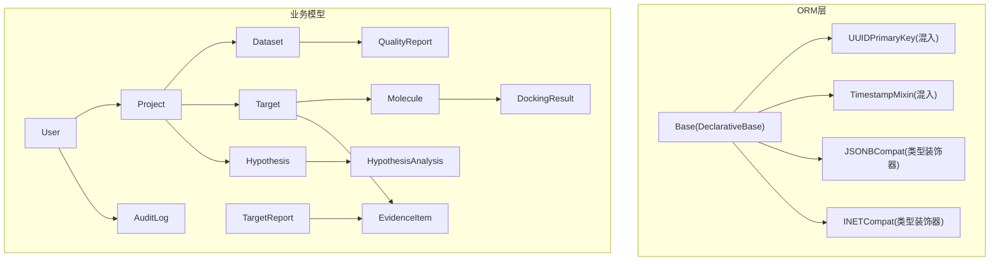
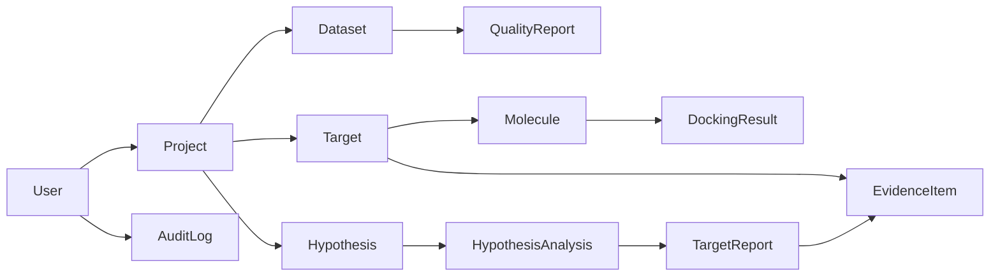

# 数据库Schema设计

<cite>
**本文引用的文件**   
- [base.py](file://backend/app/db/base.py)
- [types.py](file://backend/app/db/types.py)
- [user.py](file://backend/app/models/user.py)
- [project.py](file://backend/app/models/project.py)
- [dataset.py](file://backend/app/models/dataset.py)
- [target.py](file://backend/app/models/target.py)
- [molecule.py](file://backend/app/models/molecule.py)
- [hypothesis.py](file://backend/app/models/hypothesis.py)
- [report.py](file://backend/app/models/report.py)
- [audit_log.py](file://backend/app/models/audit_log.py)
- [init_db.py](file://backend/app/db/init_db.py)
- [03-database.md](file://docs/design/03-database.md)
</cite>

## 目录
1. [引言](#引言)
2. [项目结构](#项目结构)
3. [核心组件](#核心组件)
4. [架构总览](#架构总览)
5. [详细组件分析](#详细组件分析)
6. [依赖关系分析](#依赖关系分析)
7. [性能与索引策略](#性能与索引策略)
8. [数据完整性与约束](#数据完整性与约束)
9. [SQL DDL 示例](#sql-ddl-示例)
10. [查询优化建议](#查询优化建议)
11. [故障排查指南](#故障排查指南)
12. [结论](#结论)

## 引言
本文件为AI药物设计系统的数据库Schema设计文档，面向数据库管理员与后端开发者。内容覆盖用户、项目、数据集、靶点、分子、假设、报告等核心实体的字段定义、数据类型、约束条件；说明UUID主键策略、时间戳混入机制、外键关系设计；提供完整的SQL DDL语句示例、表结构关系图、数据验证规则；并给出索引设计策略、查询优化建议与数据完整性约束指导。

## 项目结构
系统采用PostgreSQL作为主存储，结合JSONB实现灵活扩展；使用SQLAlchemy ORM进行模型声明，并通过Base元类与混入类统一主键与时间戳策略。初始化脚本负责创建所有表与初始用户。



图表来源
- [base.py:13-48](file://backend/app/db/base.py#L13-L48)
- [types.py:13-42](file://backend/app/db/types.py#L13-L42)
- [user.py:14-36](file://backend/app/models/user.py#L14-L36)
- [project.py:14-42](file://backend/app/models/project.py#L14-L42)
- [dataset.py:15-70](file://backend/app/models/dataset.py#L15-L70)
- [target.py:14-52](file://backend/app/models/target.py#L14-L52)
- [molecule.py:14-61](file://backend/app/models/molecule.py#L14-L61)
- [hypothesis.py:15-66](file://backend/app/models/hypothesis.py#L15-L66)
- [report.py:15-73](file://backend/app/models/report.py#L15-L73)
- [audit_log.py:15-45](file://backend/app/models/audit_log.py#L15-L45)

章节来源
- [base.py:13-48](file://backend/app/db/base.py#L13-L48)
- [types.py:13-42](file://backend/app/db/types.py#L13-L42)
- [init_db.py:35-40](file://backend/app/db/init_db.py#L35-L40)

## 核心组件
- 基类与混入
  - Base：SQLAlchemy声明式基类，集中管理元数据与表映射。
  - UUIDPrimaryKey：为实体提供UUID主键（默认uuid.uuid4），便于分布式生成与迁移。
  - TimestampMixin：为实体提供created_at与updated_at时间戳，支持时区。
- 跨方言类型
  - JSONBCompat：在PostgreSQL上使用原生JSONB，其他方言降级为通用JSON，保证本地开发可用。
  - INETCompat：在PostgreSQL上使用原生INET，其他方言降级为String(45)。
- 核心实体
  - User：系统用户，含角色与活跃状态。
  - Project：研发项目，关联多组学数据集、靶点、报告与假设。
  - Dataset：上传的多组学数据集，包含质量评分与处理时间。
  - QualityReport：数据集质量报告，记录完整性/准确性/一致性及问题列表。
  - Target：发现的药物靶点，含证据等级、置信度与来源。
  - Molecule：候选分子，含SMILES、InChIKey、类药性评估与预测性质。
  - DockingResult：DiffDock对接结果，保存构象与置信度。
  - Hypothesis：假设沙盒，支持优先级与强制深度分析。
  - HypothesisAnalysis：假设下的一次分析记录，关联报告与成本耗时。
  - TargetReport：靶点发现报告，LLM综合生成，含结构化内容与CDISC导出路径。
  - EvidenceItem：证据项，支撑靶点与报告的证据链。
  - AuditLog：审计日志，append-only，不可篡改。

章节来源
- [base.py:17-48](file://backend/app/db/base.py#L17-L48)
- [types.py:13-42](file://backend/app/db/types.py#L13-L42)
- [user.py:14-36](file://backend/app/models/user.py#L14-L36)
- [project.py:14-42](file://backend/app/models/project.py#L14-L42)
- [dataset.py:15-70](file://backend/app/models/dataset.py#L15-L70)
- [target.py:14-52](file://backend/app/models/target.py#L14-L52)
- [molecule.py:14-61](file://backend/app/models/molecule.py#L14-L61)
- [hypothesis.py:15-66](file://backend/app/models/hypothesis.py#L15-L66)
- [report.py:15-73](file://backend/app/models/report.py#L15-L73)
- [audit_log.py:15-45](file://backend/app/models/audit_log.py#L15-L45)

## 架构总览
下图展示核心实体之间的关系与外键约束，体现“项目为中心”的数据组织方式。

```mermaid
erDiagram
USERS {
uuid id PK
string email UK
string hashed_password
string full_name
string role
boolean is_active
timestamptz created_at
timestamptz updated_at
}
PROJECTS {
uuid id PK
string name
text description
uuid owner_id FK
string status
string cancer_type
string patient_pseudonym
jsonb metadata
timestamptz created_at
}
DATASETS {
uuid id PK
uuid project_id FK
string name
string data_type
text file_path
bigint file_size_bytes
string format
string status
string checksum
jsonb metadata
float quality_score
uuid uploaded_by FK
timestamptz processed_at
timestamptz created_at
}
QUALITY_REPORTS {
uuid id PK
uuid dataset_id FK UK
float completeness
float accuracy
float consistency
jsonb issues
timestamptz created_at
}
TARGETS {
uuid id PK
uuid project_id FK
uuid dataset_id FK
string gene_symbol
string gene_entrez_id
string evidence_level
float confidence_score
text mechanism
string source
jsonb metadata
timestamptz created_at
}
MOLECULES {
uuid id PK
uuid project_id FK
uuid target_id FK
text smiles
string inchi_key
string chembl_id
boolean is_approved
jsonb druglikeness
jsonb predicted_properties
string source
timestamptz created_at
}
DOCKING_RESULTS {
uuid id PK
uuid molecule_id FK
string protein_pdb_id
text protein_pdb_path
jsonb poses
float top_confidence
string docked_by
timestamptz created_at
}
HYPOTHESES {
uuid id PK
uuid project_id FK
string name
text description
string status
string priority
uuid forced_by FK
text forced_reason
jsonb target_ids
timestamptz created_at
timestamptz updated_at
}
HYPOTHESIS_ANALYSES {
uuid id PK
uuid hypothesis_id FK
uuid report_id FK
string analysis_tier
decimal cost_usd
int duration_seconds
timestamptz created_at
}
TARGET_REPORTS {
uuid id PK
uuid project_id FK
jsonb target_ids
string analysis_tier
string llm_model
decimal llm_cost_usd
int llm_tokens_in
int llm_tokens_out
int duration_seconds
text summary
text content_md
jsonb content_json
text cdisc_sdtm_path
timestamptz created_at
}
EVIDENCE_ITEMS {
uuid id PK
uuid target_id FK
uuid report_id FK
string evidence_type
string evidence_level
string reference_id
text reference_url
text summary
jsonb payload
timestamptz created_at
}
AUDIT_LOGS {
bigserial id PK
uuid user_id FK
string action
string resource_type
uuid resource_id
jsonb before_value
jsonb after_value
inet ip_address
text user_agent
timestamptz created_at
}
USERS ||--o{ PROJECTS : "拥有"
PROJECTS ||--o{ DATASETS : "包含"
DATASETS ||--|| QUALITY_REPORTS : "质量报告"
PROJECTS ||--o{ TARGETS : "发现"
TARGETS ||--o{ EVIDENCE_ITEMS : "证据"
TARGETS ||--o{ MOLECULES : "关联分子"
MOLECULES ||--o{ DOCKING_RESULTS : "对接结果"
PROJECTS ||--o{ HYPOTHESES : "假设"
HYPOTHESES ||--o{ HYPOTHESIS_ANALYSES : "分析记录"
TARGET_REPORTS ||--o{ EVIDENCE_ITEMS : "证据"
USERS ||--o{ AUDIT_LOGS : "操作审计"
```

图表来源
- [user.py:14-36](file://backend/app/models/user.py#L14-L36)
- [project.py:14-42](file://backend/app/models/project.py#L14-L42)
- [dataset.py:15-70](file://backend/app/models/dataset.py#L15-L70)
- [target.py:14-52](file://backend/app/models/target.py#L14-L52)
- [molecule.py:14-61](file://backend/app/models/molecule.py#L14-L61)
- [hypothesis.py:15-66](file://backend/app/models/hypothesis.py#L15-L66)
- [report.py:15-73](file://backend/app/models/report.py#L15-L73)
- [audit_log.py:15-45](file://backend/app/models/audit_log.py#L15-L45)

## 详细组件分析

### 用户(User)
- 用途：系统用户，支持多角色权限控制。
- 关键字段：email唯一索引、hashed_password、full_name、role枚举、is_active、last_login_at。
- 关系：被Project.owner_id引用；被AuditLog.user_id引用。
- 约束与校验：email唯一且非空；role取值受控；密码哈希由安全模块生成。

章节来源
- [user.py:14-36](file://backend/app/models/user.py#L14-L36)
- [project.py:24-26](file://backend/app/models/project.py#L24-L26)
- [audit_log.py:25-27](file://backend/app/models/audit_log.py#L25-L27)

### 项目(Project)
- 用途：研发项目，聚合数据集、靶点、报告与假设。
- 关键字段：name、description、owner_id、status、cancer_type、patient_pseudonym、metadata(JSONB)。
- 关系：拥有多个Dataset与Hypothesis；被User.owner_id引用。
- 约束与校验：status受控；metadata用于灵活扩展。

章节来源
- [project.py:14-42](file://backend/app/models/project.py#L14-L42)

### 数据集(Dataset)与质量报告(QualityReport)
- 用途：记录上传的多组学数据集及其质量评估。
- 关键字段：project_id、data_type、file_path、file_size_bytes、format、status、checksum、metadata(JSONB)、quality_score、uploaded_by、processed_at。
- 关系：属于Project；一对一QualityReport；被Target.dataset_id可选引用。
- 约束与校验：data_type与status受控；checksum用于完整性校验。

章节来源
- [dataset.py:15-70](file://backend/app/models/dataset.py#L15-L70)

### 靶点(Target)
- 用途：发现的药物靶点，支撑后续分子设计与报告生成。
- 关键字段：project_id、dataset_id、gene_symbol、gene_entrez_id、evidence_level、confidence_score、mechanism、source、metadata(JSONB)。
- 关系：属于Project；可来源于Dataset；被Molecule.target_id可选引用；产出EvidenceItem。

章节来源
- [target.py:14-52](file://backend/app/models/target.py#L14-L52)

### 分子(Molecule)与对接结果(DockingResult)
- 用途：候选药物分子及其与蛋白的对接结果。
- 关键字段：project_id、target_id、smiles、inchi_key、chembl_id、is_approved、druglikeness(JSONB)、predicted_properties(JSONB)、source。
- 关系：属于Project；可选关联Target；一对多DockingResult。
- 约束与校验：inchi_key可用于去重；druglikeness与predicted_properties存储RDKit/DeepChem结果。

章节来源
- [molecule.py:14-61](file://backend/app/models/molecule.py#L14-L61)

### 假设(Hypothesis)与分析记录(HypothesisAnalysis)
- 用途：假设沙盒，支持优先级与强制深度分析；记录每次分析的成本与耗时。
- 关键字段：project_id、name、description、status、priority、forced_by、forced_reason、target_ids(JSONB)。
- 关系：属于Project；一对多HypothesisAnalysis；关联TargetReport。

章节来源
- [hypothesis.py:15-66](file://backend/app/models/hypothesis.py#L15-L66)

### 报告(TargetReport)与证据(EvidenceItem)
- 用途：靶点发现报告，LLM综合生成；证据项支撑报告可信度。
- 关键字段：project_id、target_ids(JSONB)、analysis_tier、llm_model、llm_cost_usd、llm_tokens_in/out、duration_seconds、summary、content_md、content_json(JSONB)、cdisc_sdtm_path。
- 关系：属于Project；一对多EvidenceItem；被HypothesisAnalysis.report_id引用。

章节来源
- [report.py:15-73](file://backend/app/models/report.py#L15-L73)

### 审计日志(AuditLog)
- 用途：不可篡改的操作审计，支持按动作与时间范围高效扫描。
- 关键字段：id(BIGSERIAL)、user_id、action、resource_type、resource_id、before_value(JSONB)、after_value(JSONB)、ip_address(INET)、user_agent、created_at。
- 约束：应用层不提供UPDATE/DELETE；数据库层通过权限保护。

章节来源
- [audit_log.py:15-45](file://backend/app/models/audit_log.py#L15-L45)

## 依赖关系分析
- 直接依赖
  - Project → Dataset、Hypothesis
  - Dataset → QualityReport
  - Target → Molecule、EvidenceItem
  - Molecule → DockingResult
  - Hypothesis → HypothesisAnalysis → TargetReport
  - TargetReport → EvidenceItem
  - User → Project(owner_id)、AuditLog(user_id)
- 间接依赖
  - TargetReport与HypothesisAnalysis形成“假设→分析→报告”的可追溯链路。
  - EvidenceItem同时关联Target与TargetReport，构建“靶点-证据-报告”的证据链。



图表来源
- [project.py:32-38](file://backend/app/models/project.py#L32-L38)
- [dataset.py:44-47](file://backend/app/models/dataset.py#L44-L47)
- [target.py:43-48](file://backend/app/models/target.py#L43-L48)
- [molecule.py:37-40](file://backend/app/models/molecule.py#L37-L40)
- [hypothesis.py:40-43](file://backend/app/models/hypothesis.py#L40-L43)
- [report.py:38-41](file://backend/app/models/report.py#L38-L41)
- [audit_log.py:25-27](file://backend/app/models/audit_log.py#L25-L27)

## 性能与索引策略
- 主键策略
  - 使用UUID作为主键，避免自增ID冲突，利于分布式与分库分表。
- 常用索引
  - users.email唯一索引
  - projects.owner_id、projects.status
  - datasets.project_id、datasets.data_type+status复合索引、datasets.metadata GIN索引
  - targets.project_id、targets.gene_symbol、targets.evidence_level
  - molecules.project_id、molecules.target_id、molecules.inchi_key唯一索引
  - target_reports.project_id、target_reports.created_at
  - evidence_items.target_id、evidence_items.evidence_type
  - audit_logs.action+created_at复合索引
- 查询优化建议
  - 对频繁过滤字段建立合适索引；对JSONB字段使用GIN索引以支持高效查询。
  - 大表分页查询建议使用基于游标的分页（如基于主键或时间戳）。
  - 针对LLM成本统计与耗时分析，可对target_reports与hypothesis_analyses的数值字段建立索引。

章节来源
- [03-database.md:57-229](file://docs/design/03-database.md#L57-L229)

## 数据完整性与约束
- 外键约束
  - ondelete行为：
    - Project删除级联到Dataset、Hypothesis；
    - Dataset删除级联到QualityReport；
    - Target删除不影响Molecule（SET NULL）；
    - Molecule删除级联到DockingResult；
    - Hypothesis删除级联到HypothesisAnalysis；
    - TargetReport删除级联到EvidenceItem（部分场景SET NULL）。
- 唯一性与非空
  - users.email唯一；
  - molecules.inchi_key唯一（建议）；
  - 各表主键非空。
- 审计保护
  - audit_logs禁止UPDATE/DELETE，确保不可篡改。

章节来源
- [project.py:24-26](file://backend/app/models/project.py#L24-L26)
- [dataset.py:27-29](file://backend/app/models/dataset.py#L27-L29)
- [target.py:29-34](file://backend/app/models/target.py#L29-L34)
- [molecule.py:23-28](file://backend/app/models/molecule.py#L23-L28)
- [hypothesis.py:27-36](file://backend/app/models/hypothesis.py#L27-L36)
- [report.py:58-63](file://backend/app/models/report.py#L58-L63)
- [audit_log.py:18-20](file://backend/app/models/audit_log.py#L18-L20)

## SQL DDL 示例
以下为PostgreSQL环境下的DDL参考，涵盖主要表结构与索引。请根据实际部署环境与命名规范调整。

- 用户表
  - 字段：id(UUID, PK), email(VARCHAR(255), UNIQUE NOT NULL), hashed_password(VARCHAR(255) NOT NULL), full_name(VARCHAR(100) NOT NULL), role(VARCHAR(20) NOT NULL DEFAULT 'researcher'), is_active(BOOLEAN DEFAULT true), last_login_at(TIMESTAMPTZ), created_at(TIMESTAMPTZ DEFAULT now()), updated_at(TIMESTAMPTZ DEFAULT now())
  - 索引：idx_users_email(email)

- 项目表
  - 字段：id(UUID, PK), name(VARCHAR(200) NOT NULL), description(TEXT), owner_id(UUID, FK→users.id), status(VARCHAR(20) DEFAULT 'active'), cancer_type(VARCHAR(100)), patient_pseudonym(VARCHAR(100)), metadata(JSONB DEFAULT '{}'), created_at(TIMESTAMPTZ DEFAULT now())
  - 索引：idx_projects_owner(owner_id), idx_projects_status(status)

- 数据集表
  - 字段：id(UUID, PK), project_id(UUID, FK→projects.id), name(VARCHAR(200) NOT NULL), data_type(VARCHAR(30) NOT NULL), file_path(TEXT NOT NULL), file_size_bytes(BIGINT), format(VARCHAR(20)), status(VARCHAR(20) DEFAULT 'uploaded'), checksum(VARCHAR(64)), metadata(JSONB DEFAULT '{}'), quality_score(FLOAT), uploaded_by(UUID, FK→users.id), processed_at(TIMESTAMPTZ), created_at(TIMESTAMPTZ DEFAULT now())
  - 索引：idx_datasets_project(project_id), idx_datasets_type_status(data_type, status), idx_datasets_metadata(metadata gin)

- 质量报告表
  - 字段：id(UUID, PK), dataset_id(UUID, FK→datasets.id, UNIQUE), completeness(FLOAT), accuracy(FLOAT), consistency(FLOAT), issues(JSONB DEFAULT '[]'), created_at(TIMESTAMPTZ DEFAULT now())

- 靶点表
  - 字段：id(UUID, PK), project_id(UUID, FK→projects.id), dataset_id(UUID, FK→datasets.id), gene_symbol(VARCHAR(50) NOT NULL), gene_entrez_id(VARCHAR(20)), evidence_level(VARCHAR(5) NOT NULL DEFAULT 'IV'), confidence_score(FLOAT), mechanism(TEXT), source(VARCHAR(30)), metadata(JSONB DEFAULT '{}'), created_at(TIMESTAMPTZ DEFAULT now())
  - 索引：idx_targets_project(project_id), idx_targets_gene(gene_symbol), idx_targets_evidence(evidence_level)

- 分子表
  - 字段：id(UUID, PK), project_id(UUID, FK→projects.id), target_id(UUID, FK→targets.id), smiles(TEXT NOT NULL), inchi_key(VARCHAR(27)), chembl_id(VARCHAR(20)), is_approved(BOOLEAN DEFAULT false), druglikeness(JSONB DEFAULT '{}'), predicted_properties(JSONB DEFAULT '{}'), source(VARCHAR(30)), created_at(TIMESTAMPTZ DEFAULT now())
  - 索引：idx_molecules_project(project_id), idx_molecules_target(target_id), idx_molecules_inchi(inchi_key unique)

- 对接结果表
  - 字段：id(UUID, PK), molecule_id(UUID, FK→molecules.id), protein_pdb_id(VARCHAR(10)), protein_pdb_path(TEXT), poses(JSONB DEFAULT '[]'), top_confidence(FLOAT), docked_by(VARCHAR(20) DEFAULT 'diffdock_nim'), created_at(TIMESTAMPTZ DEFAULT now())

- 假设表
  - 字段：id(UUID, PK), project_id(UUID, FK→projects.id), name(VARCHAR(200) NOT NULL), description(TEXT), status(VARCHAR(20) DEFAULT 'active'), priority(VARCHAR(10) DEFAULT 'normal'), forced_by(UUID, FK→users.id), forced_reason(TEXT), target_ids(JSONB DEFAULT '[]'), created_at(TIMESTAMPTZ DEFAULT now()), updated_at(TIMESTAMPTZ DEFAULT now())
  - 索引：idx_hypotheses_project_status(project_id, status)

- 假设分析记录表
  - 字段：id(UUID, PK), hypothesis_id(UUID, FK→hypotheses.id), report_id(UUID, FK→target_reports.id), analysis_tier(VARCHAR(10) DEFAULT 'quick'), cost_usd(DECIMAL(10,4)), duration_seconds(INT), created_at(TIMESTAMPTZ DEFAULT now())

- 靶点报告表
  - 字段：id(UUID, PK), project_id(UUID, FK→projects.id), target_ids(JSONB DEFAULT '[]'), analysis_tier(VARCHAR(10) DEFAULT 'quick'), llm_model(VARCHAR(50)), llm_cost_usd(DECIMAL(10,4)), llm_tokens_in(INT), llm_tokens_out(INT), duration_seconds(INT), summary(TEXT), content_md(TEXT), content_json(JSONB DEFAULT '{}'), cdisc_sdtm_path(TEXT), created_at(TIMESTAMPTZ DEFAULT now())
  - 索引：idx_reports_project(project_id), idx_reports_created(created_at)

- 证据项表
  - 字段：id(UUID, PK), target_id(UUID, FK→targets.id), report_id(UUID, FK→target_reports.id), evidence_type(VARCHAR(30)), evidence_level(VARCHAR(5) NOT NULL DEFAULT 'IV'), reference_id(VARCHAR(100)), reference_url(TEXT), summary(TEXT), payload(JSONB DEFAULT '{}'), created_at(TIMESTAMPTZ DEFAULT now())
  - 索引：idx_evidence_target(target_id), idx_evidence_type(evidence_type)

- 审计日志表
  - 字段：id(BIGSERIAL, PK), user_id(UUID, FK→users.id), action(VARCHAR(50) NOT NULL), resource_type(VARCHAR(30)), resource_id(UUID), before_value(JSONB), after_value(JSONB), ip_address(INET), user_agent(TEXT), created_at(TIMESTAMPTZ DEFAULT now())
  - 索引：idx_audit_action_time(action, created_at)

章节来源
- [03-database.md:44-242](file://docs/design/03-database.md#L44-L242)

## 查询优化建议
- 高频查询
  - 按项目筛选：优先使用project_id索引；结合status或data_type进行复合索引。
  - 按基因符号检索：使用targets.gene_symbol索引；必要时添加全文索引。
  - 按证据等级筛选：使用targets.evidence_level索引。
- JSONB查询
  - 对metadata、content_json、payload等字段使用GIN索引，提升复杂查询性能。
- 分页与排序
  - 使用基于主键或时间戳的游标分页，避免OFFSET在大表上的性能退化。
- 成本与耗时分析
  - 对target_reports.llm_cost_usd、hypothesis_analyses.cost_usd与duration_seconds建立索引，便于报表统计。

章节来源
- [03-database.md:94-151](file://docs/design/03-database.md#L94-L151)

## 故障排查指南
- 初始化失败
  - 检查数据库连接URL与权限；确认Base.metadata已注册全部模型；执行create_all前确保schema存在。
- 外键冲突
  - 删除顺序需遵循外键依赖；必要时先置空再删除（ondelete=SET NULL）。
- JSONB字段写入异常
  - 确认JSONBCompat在目标方言正确映射；调试时打印实际SQL类型。
- 审计日志不可写
  - 检查数据库权限是否REVOKE UPDATE/DELETE；确认应用层未尝试修改审计记录。

章节来源
- [init_db.py:35-40](file://backend/app/db/init_db.py#L35-L40)
- [audit_log.py:18-20](file://backend/app/models/audit_log.py#L18-L20)
- [types.py:13-42](file://backend/app/db/types.py#L13-L42)

## 结论
本Schema设计围绕“项目为中心”的组织方式，结合UUID主键与时间戳混入，提供了可扩展、可追踪、可审计的数据模型。通过合理的索引与约束，兼顾了查询性能与数据完整性。建议在上线前完成迁移脚本与权限配置，并对关键查询进行压测与调优。