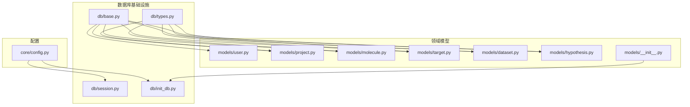
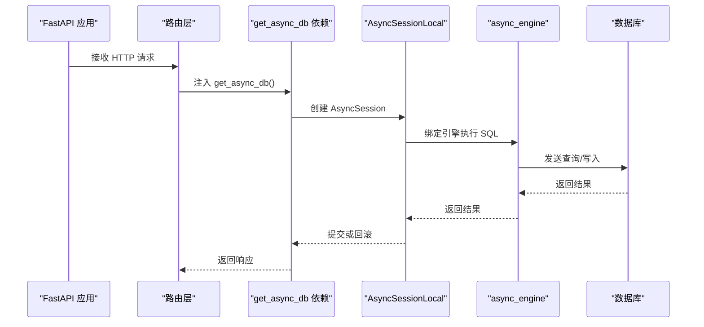
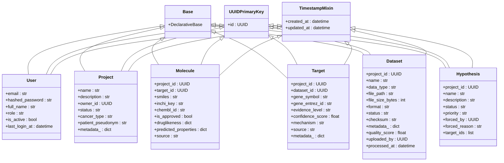
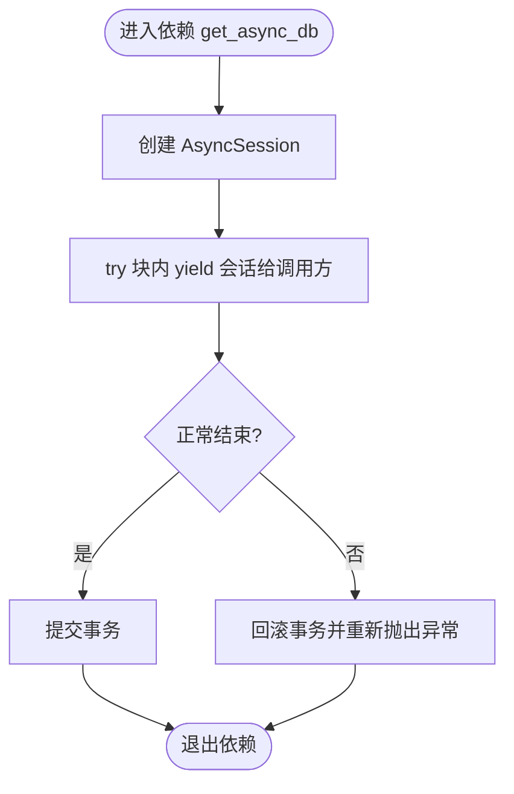
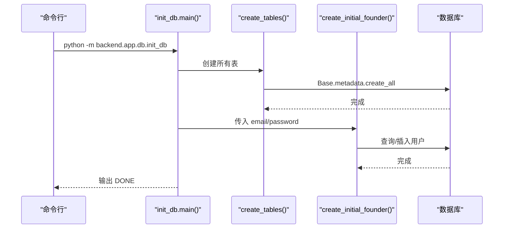
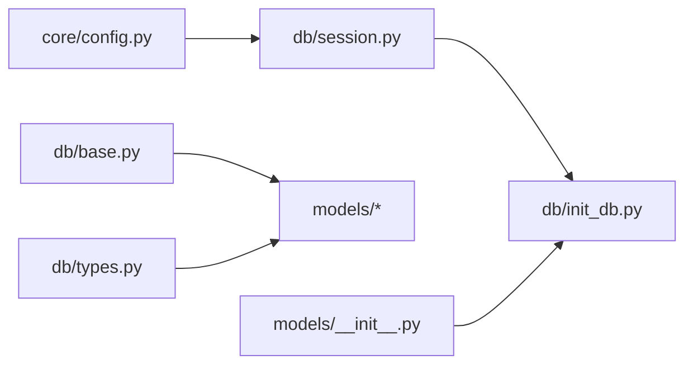

# 数据库基础设施

<cite>
**本文引用的文件**   
- [backend/app/db/base.py](file://backend/app/db/base.py)
- [backend/app/db/session.py](file://backend/app/db/session.py)
- [backend/app/db/init_db.py](file://backend/app/db/init_db.py)
- [backend/app/db/types.py](file://backend/app/db/types.py)
- [backend/app/core/config.py](file://backend/app/core/config.py)
- [backend/app/models/__init__.py](file://backend/app/models/__init__.py)
- [backend/app/models/user.py](file://backend/app/models/user.py)
- [backend/app/models/project.py](file://backend/app/models/project.py)
- [backend/app/models/molecule.py](file://backend/app/models/molecule.py)
- [backend/app/models/target.py](file://backend/app/models/target.py)
- [backend/app/models/dataset.py](file://backend/app/models/dataset.py)
- [backend/app/models/hypothesis.py](file://backend/app/models/hypothesis.py)
</cite>

## 目录
1. [简介](#简介)
2. [项目结构](#项目结构)
3. [核心组件](#核心组件)
4. [架构总览](#架构总览)
5. [详细组件分析](#详细组件分析)
6. [依赖关系分析](#依赖关系分析)
7. [性能考虑](#性能考虑)
8. [故障排查指南](#故障排查指南)
9. [结论](#结论)
10. [附录](#附录)

## 简介
本文件面向数据库管理员与后端架构师，系统化阐述 AI 药物设计系统的数据库基础设施设计与实现，涵盖：
- 连接配置与多环境管理
- 同步/异步会话管理与事务策略
- 基础模型类 Base、通用类型定义与跨方言兼容
- UUIDPrimaryKey 与 TimestampMixin 混入类的设计与使用
- 数据库初始化流程与初始数据创建
- 迁移管理、备份恢复策略与性能监控方案

## 项目结构
数据库相关代码集中在 backend/app/db 与 backend/app/models 两个目录中，配合 backend/app/core/config 提供统一配置。

图表来源
- [backend/app/core/config.py:1-144](file://backend/app/core/config.py#L1-L144)
- [backend/app/db/session.py:1-128](file://backend/app/db/session.py#L1-L128)
- [backend/app/db/base.py:1-48](file://backend/app/db/base.py#L1-L48)
- [backend/app/db/types.py:1-42](file://backend/app/db/types.py#L1-L42)
- [backend/app/db/init_db.py:1-88](file://backend/app/db/init_db.py#L1-L88)
- [backend/app/models/__init__.py:1-29](file://backend/app/models/__init__.py#L1-L29)

章节来源
- [backend/app/core/config.py:1-144](file://backend/app/core/config.py#L1-L144)
- [backend/app/db/base.py:1-48](file://backend/app/db/base.py#L1-L48)
- [backend/app/db/session.py:1-128](file://backend/app/db/session.py#L1-L128)
- [backend/app/db/types.py:1-42](file://backend/app/db/types.py#L1-L42)
- [backend/app/db/init_db.py:1-88](file://backend/app/db/init_db.py#L1-L88)
- [backend/app/models/__init__.py:1-29](file://backend/app/models/__init__.py#L1-L29)

## 核心组件
本节聚焦数据库基础设施的关键构件及其职责边界。

- 配置中心（Settings）
  - 通过 pydantic-settings 从环境变量或 .env 加载，集中管理数据库 URL、回显开关等。
  - 提供 get_settings() 单例，避免重复读取配置文件。

- 基础模型与混入
  - Base：SQLAlchemy 声明式基类，所有 ORM 模型继承它。
  - UUIDPrimaryKey：为模型注入 UUID 主键，默认值由 uuid.uuid4 生成，便于分布式场景。
  - TimestampMixin：为模型注入 created_at/updated_at 时间戳，支持时区感知。

- 会话与引擎
  - 同时暴露同步与异步 engine，适配 FastAPI 路由与脚本工具。
  - 根据是否 SQLite 动态调整连接池参数；非 SQLite 启用 pool_pre_ping、pool_size、max_overflow。
  - 提供 get_async_db/get_sync_db 依赖函数，自动 commit/rollback/close。

- 跨方言类型
  - JSONBCompat：PostgreSQL 使用 JSONB，其他方言降级为 JSON。
  - INETCompat：PostgreSQL 使用 INET，其他方言降级为 String(45)。

- 初始化脚本
  - 导入全部模型以注册到 Base.metadata，创建表并可选创建初始 founder 用户。

章节来源
- [backend/app/core/config.py:1-144](file://backend/app/core/config.py#L1-L144)
- [backend/app/db/base.py:1-48](file://backend/app/db/base.py#L1-L48)
- [backend/app/db/session.py:1-128](file://backend/app/db/session.py#L1-L128)
- [backend/app/db/types.py:1-42](file://backend/app/db/types.py#L1-L42)
- [backend/app/db/init_db.py:1-88](file://backend/app/db/init_db.py#L1-L88)

## 架构总览
下图展示应用启动到请求处理的数据库访问路径，以及配置、会话工厂与模型的协作关系。

图表来源
- [backend/app/db/session.py:94-128](file://backend/app/db/session.py#L94-L128)
- [backend/app/db/session.py:48-91](file://backend/app/db/session.py#L48-L91)
- [backend/app/core/config.py:37-40](file://backend/app/core/config.py#L37-L40)

## 详细组件分析

### 基础模型与混入类（Base、UUIDPrimaryKey、TimestampMixin）
- Base 作为 DeclarativeBase，是所有 ORM 模型的根。
- UUIDPrimaryKey 注入 id 字段，类型为 PostgreSQL UUID，默认值 uuid.uuid4，主键约束。
- TimestampMixin 注入 created_at/updated_at，均带时区；created_at 使用服务器默认 now()，updated_at 在更新时触发。

图表来源
- [backend/app/db/base.py:13-47](file://backend/app/db/base.py#L13-L47)
- [backend/app/models/user.py:14-36](file://backend/app/models/user.py#L14-L36)
- [backend/app/models/project.py:14-42](file://backend/app/models/project.py#L14-L42)
- [backend/app/models/molecule.py:14-61](file://backend/app/models/molecule.py#L14-L61)
- [backend/app/models/target.py:14-52](file://backend/app/models/target.py#L14-L52)
- [backend/app/models/dataset.py:15-70](file://backend/app/models/dataset.py#L15-L70)
- [backend/app/models/hypothesis.py:15-66](file://backend/app/models/hypothesis.py#L15-L66)

章节来源
- [backend/app/db/base.py:13-47](file://backend/app/db/base.py#L13-L47)
- [backend/app/models/user.py:14-36](file://backend/app/models/user.py#L14-L36)
- [backend/app/models/project.py:14-42](file://backend/app/models/project.py#L14-L42)
- [backend/app/models/molecule.py:14-61](file://backend/app/models/molecule.py#L14-L61)
- [backend/app/models/target.py:14-52](file://backend/app/models/target.py#L14-L52)
- [backend/app/models/dataset.py:15-70](file://backend/app/models/dataset.py#L15-L70)
- [backend/app/models/hypothesis.py:15-66](file://backend/app/models/hypothesis.py#L15-L66)

### 会话管理与事务策略（session.py）
- 引擎创建
  - 根据 database_url 判断是否为 SQLite；SQLite 不设置连接池参数，其余驱动启用 pool_pre_ping、pool_size=10、max_overflow=20。
  - 提供 async_engine 与 sync_engine，分别用于 FastAPI 与脚本/CLI。
- 会话工厂
  - AsyncSessionLocal：expire_on_commit=False、autoflush=False，减少不必要的刷新与延迟加载开销。
  - SyncSessionLocal：同样关闭 expire_on_commit。
- 依赖注入
  - get_async_db：异步上下文管理器，yield 会话后自动 commit；异常时 rollback 并重新抛出。
  - get_sync_db：同步上下文，commit/rollback/close 保证资源释放。
  - get_db 别名指向 get_async_db，便于路由中使用。

图表来源
- [backend/app/db/session.py:94-128](file://backend/app/db/session.py#L94-L128)
- [backend/app/db/session.py:48-91](file://backend/app/db/session.py#L48-L91)

章节来源
- [backend/app/db/session.py:25-91](file://backend/app/db/session.py#L25-L91)
- [backend/app/db/session.py:94-128](file://backend/app/db/session.py#L94-L128)

### 跨方言类型（types.py）
- JSONBCompat
  - PostgreSQL：使用 JSONB，支持索引与高效查询。
  - 其他方言：降级为 JSON，保持开发/测试可用。
- INETCompat
  - PostgreSQL：使用原生 INET。
  - 其他方言：String(45)，可容纳 IPv6。

章节来源
- [backend/app/db/types.py:13-42](file://backend/app/db/types.py#L13-L42)

### 数据库初始化流程（init_db.py）
- 入口 main()
  - 读取 Settings，打印数据库 URL。
  - 调用 create_tables() 基于 Base.metadata 创建所有表。
  - 解析命令行参数或默认值，调用 create_initial_founder() 创建创始人账号。
- create_tables()
  - 使用 async_engine.begin() 获取连接，run_sync(Base.metadata.create_all) 建表。
- create_initial_founder()
  - 使用 SyncSessionLocal 检查用户是否存在，不存在则插入 hashed_password 的 founder 用户。

图表来源
- [backend/app/db/init_db.py:35-88](file://backend/app/db/init_db.py#L35-L88)
- [backend/app/models/__init__.py:1-29](file://backend/app/models/__init__.py#L1-L29)

章节来源
- [backend/app/db/init_db.py:1-88](file://backend/app/db/init_db.py#L1-L88)
- [backend/app/models/__init__.py:1-29](file://backend/app/models/__init__.py#L1-L29)

### 配置与连接字符串（config.py）
- database_url：默认 PostgreSQL+psycopg2 连接串，可通过环境变量覆盖。
- database_echo：控制 SQLAlchemy 是否打印 SQL。
- get_settings()：lru_cache 缓存实例，避免重复读取 .env。

章节来源
- [backend/app/core/config.py:21-40](file://backend/app/core/config.py#L21-L40)
- [backend/app/core/config.py:136-144](file://backend/app/core/config.py#L136-L144)

## 依赖关系分析
- 模块耦合
  - session.py 依赖 config.py 获取 database_url 与 echo 开关。
  - init_db.py 依赖 models/__init__.py 确保所有模型被导入，从而让 Base.metadata 包含全部表定义。
  - 各模型依赖 base.py 与 types.py 提供的混入与类型。
- 外部依赖
  - SQLAlchemy 同步/异步引擎与会话工厂。
  - PostgreSQL 方言特性（UUID、JSONB、INET）。
  - pydantic-settings 负责配置加载。

图表来源
- [backend/app/core/config.py:1-144](file://backend/app/core/config.py#L1-L144)
- [backend/app/db/session.py:1-128](file://backend/app/db/session.py#L1-L128)
- [backend/app/db/init_db.py:1-88](file://backend/app/db/init_db.py#L1-L88)
- [backend/app/db/base.py:1-48](file://backend/app/db/base.py#L1-L48)
- [backend/app/db/types.py:1-42](file://backend/app/db/types.py#L1-L42)
- [backend/app/models/__init__.py:1-29](file://backend/app/models/__init__.py#L1-L29)

章节来源
- [backend/app/core/config.py:1-144](file://backend/app/core/config.py#L1-L144)
- [backend/app/db/session.py:1-128](file://backend/app/db/session.py#L1-L128)
- [backend/app/db/init_db.py:1-88](file://backend/app/db/init_db.py#L1-L88)
- [backend/app/db/base.py:1-48](file://backend/app/db/base.py#L1-L48)
- [backend/app/db/types.py:1-42](file://backend/app/db/types.py#L1-L42)
- [backend/app/models/__init__.py:1-29](file://backend/app/models/__init__.py#L1-L29)

## 性能考虑
- 连接池
  - 非 SQLite 驱动启用 pool_pre_ping 检测死连接，pool_size=10、max_overflow=20，适合中等并发。
  - SQLite 不使用连接池参数，避免不支持的参数导致错误。
- 会话行为
  - expire_on_commit=False 避免提交后再次访问属性时触发额外 SELECT。
  - autoflush=False 降低隐式刷新带来的开销，建议在需要时显式 flush。
- 类型优化
  - PostgreSQL 下 JSONB 支持 GIN 索引，建议对高频查询字段建立索引。
  - INET 类型便于 IP 范围查询与网络地址匹配。
- 日志与诊断
  - database_echo 可在开发环境开启，生产环境建议关闭以减少 I/O。

[本节为通用指导，无需列出具体文件来源]

## 故障排查指南
- 无法连接数据库
  - 检查 database_url 是否正确，确认端口、用户名、密码与数据库名。
  - 若使用 SQLite，确认路径存在且进程有写权限。
- 连接超时或连接泄漏
  - 确认 pool_pre_ping 已启用（非 SQLite），并检查是否有未关闭的会话。
  - 在 FastAPI 路由中确保使用依赖注入 get_async_db，避免手动管理会话生命周期。
- 表未创建或模型变更未生效
  - 运行初始化脚本以确保表存在；如引入新模型，需确保 models/__init__.py 已导入该模型。
- 事务未提交或回滚
  - 检查业务逻辑是否在 try/except 中正确处理异常，确保依赖注入能自动回滚。
- 调试 SQL
  - 临时开启 database_echo 观察生成的 SQL，定位慢查询或错误语句。

章节来源
- [backend/app/db/session.py:48-91](file://backend/app/db/session.py#L48-L91)
- [backend/app/db/session.py:94-128](file://backend/app/db/session.py#L94-L128)
- [backend/app/db/init_db.py:35-88](file://backend/app/db/init_db.py#L35-L88)
- [backend/app/core/config.py:37-40](file://backend/app/core/config.py#L37-L40)

## 结论
本基础设施以配置为中心、会话工厂为核心、混入类与通用类型为基础，提供了稳定可扩展的数据库访问能力。通过统一的 Base 与混入类，模型具备一致的标识与审计字段；通过跨方言类型，系统在开发与生产之间平滑切换；通过初始化脚本，快速完成库表与初始数据的准备。结合合理的连接池与事务策略，可满足高并发与复杂业务场景的需求。

[本节为总结性内容，无需列出具体文件来源]

## 附录

### 数据库迁移管理建议
- 推荐使用 Alembic 进行版本化迁移，将模型变更沉淀为迁移脚本。
- 在 CI/CD 中集成迁移步骤，确保部署前后数据库结构与代码一致。
- 对破坏性变更（删除列、修改类型）编写回滚脚本，保障可逆性。

[本节为通用指导，无需列出具体文件来源]

### 备份与恢复策略
- 定期全量备份与增量备份相结合，保留多份历史快照。
- 针对 JSONB 大对象与二进制附件，评估对象存储与数据库分离策略。
- 制定 RPO/RTO 目标，演练恢复流程，确保灾难恢复有效。

[本节为通用指导，无需列出具体文件来源]

### 性能监控方案
- 指标采集
  - 连接池使用率、活跃连接数、等待队列长度。
  - 慢查询统计、锁等待、事务时长分布。
- 观测手段
  - 利用数据库自带监控（如 pg_stat_statements）与 APM 工具。
  - 结合 application 日志与结构化追踪，关联请求与 SQL。
- 调优方向
  - 合理设置索引（包括 JSONB GIN 索引）。
  - 分页与投影优化，避免 N+1 查询。
  - 批量写入与合并操作，减少往返次数。

[本节为通用指导，无需列出具体文件来源]