# 核心业务实体

<cite>
**本文引用的文件**   
- [backend/app/db/base.py](file://backend/app/db/base.py)
- [backend/app/db/types.py](file://backend/app/db/types.py)
- [backend/app/models/user.py](file://backend/app/models/user.py)
- [backend/app/models/project.py](file://backend/app/models/project.py)
- [backend/app/models/dataset.py](file://backend/app/models/dataset.py)
- [backend/app/models/target.py](file://backend/app/models/target.py)
- [backend/app/models/molecule.py](file://backend/app/models/molecule.py)
- [backend/app/models/hypothesis.py](file://backend/app/models/hypothesis.py)
- [backend/app/models/report.py](file://backend/app/models/report.py)
- [backend/app/models/audit_log.py](file://backend/app/models/audit_log.py)
- [backend/app/core/security.py](file://backend/app/core/security.py)
- [backend/app/api/v1/auth.py](file://backend/app/api/v1/auth.py)
- [backend/app/schemas/project.py](file://backend/app/schemas/project.py)
- [docs/design/03-database.md](file://docs/design/03-database.md)
</cite>

## 目录
1. [引言](#引言)
2. [项目结构](#项目结构)
3. [核心组件](#核心组件)
4. [架构总览](#架构总览)
5. [详细组件分析](#详细组件分析)
6. [依赖关系分析](#依赖关系分析)
7. [性能与索引策略](#性能与索引策略)
8. [故障排查指南](#故障排查指南)
9. [结论](#结论)
10. [附录：SQL DDL 示例](#附录sql-ddl-示例)

## 引言
本文件面向数据库管理员与后端开发者，系统化梳理 AI 药物设计系统的核心业务实体 Schema，包括用户、项目、数据集、靶点、分子、假设与分析记录、报告与证据项、数据质量报告以及审计日志。文档覆盖字段定义、数据类型、约束条件、业务规则、UUID 主键策略、时间戳混入机制、角色权限体系，并提供表关系图、索引设计与查询优化建议，以及可直接落地的 SQL DDL 参考。

## 项目结构
系统采用分层架构：
- ORM 模型层：位于 backend/app/models，定义各业务实体的表结构与关系
- 基础类型与混入：backend/app/db/base.py 提供 Base、UUIDPrimaryKey、TimestampMixin；backend/app/db/types.py 提供 JSONBCompat、INETCompat
- 安全与鉴权：backend/app/core/security.py 实现密码哈希、JWT、角色守卫
- API 层：backend/app/api/v1 暴露认证等接口，auth.py 演示用户登录流程
- 设计文档：docs/design/03-database.md 给出 ER 概览与字段说明

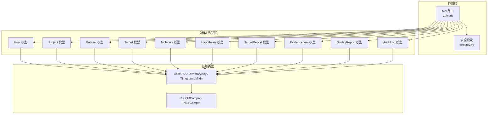

图表来源
- [backend/app/api/v1/auth.py:1-147](file://backend/app/api/v1/auth.py#L1-L147)
- [backend/app/core/security.py:1-211](file://backend/app/core/security.py#L1-L211)
- [backend/app/models/user.py:1-36](file://backend/app/models/user.py#L1-L36)
- [backend/app/models/project.py:1-42](file://backend/app/models/project.py#L1-L42)
- [backend/app/models/dataset.py:1-70](file://backend/app/models/dataset.py#L1-L70)
- [backend/app/models/target.py:1-52](file://backend/app/models/target.py#L1-L52)
- [backend/app/models/molecule.py:1-61](file://backend/app/models/molecule.py#L1-L61)
- [backend/app/models/hypothesis.py:1-66](file://backend/app/models/hypothesis.py#L1-L66)
- [backend/app/models/report.py:1-73](file://backend/app/models/report.py#L1-L73)
- [backend/app/models/audit_log.py:1-45](file://backend/app/models/audit_log.py#L1-L45)
- [backend/app/db/base.py:1-48](file://backend/app/db/base.py#L1-L48)
- [backend/app/db/types.py:1-42](file://backend/app/db/types.py#L1-L42)

章节来源
- [docs/design/03-database.md:1-325](file://docs/design/03-database.md#L1-L325)

## 核心组件
本节聚焦基础实体与通用机制：
- 用户（User）：身份与角色，支持 JWT 鉴权与角色守卫
- 项目（Project）：研究主题或患者单元，作为数据集、靶点、报告的容器
- 数据集（Dataset）：多组学数据上传与处理状态追踪，关联质量报告
- 靶点（Target）、分子（Molecule）、假设（Hypothesis）与分析记录、报告（TargetReport）与证据项（EvidenceItem）
- 审计日志（AuditLog）：不可篡改的 append-only 审计表

章节来源
- [backend/app/models/user.py:1-36](file://backend/app/models/user.py#L1-L36)
- [backend/app/models/project.py:1-42](file://backend/app/models/project.py#L1-L42)
- [backend/app/models/dataset.py:1-70](file://backend/app/models/dataset.py#L1-L70)
- [backend/app/models/target.py:1-52](file://backend/app/models/target.py#L1-L52)
- [backend/app/models/molecule.py:1-61](file://backend/app/models/molecule.py#L1-L61)
- [backend/app/models/hypothesis.py:1-66](file://backend/app/models/hypothesis.py#L1-L66)
- [backend/app/models/report.py:1-73](file://backend/app/models/report.py#L1-L73)
- [backend/app/models/audit_log.py:1-45](file://backend/app/models/audit_log.py#L1-L45)

## 架构总览
下图展示核心实体间的关系与关键外键约束，体现“项目为中心”的数据组织方式。

```mermaid
erDiagram
USERS {
uuid id PK
varchar email UK
varchar hashed_password
varchar full_name
varchar role
boolean is_active
timestamptz last_login_at
timestamptz created_at
timestamptz updated_at
}
PROJECTS {
uuid id PK
varchar name
text description
uuid owner_id FK
varchar status
varchar cancer_type
varchar patient_pseudonym
jsonb metadata
timestamptz created_at
timestamptz updated_at
}
DATASETS {
uuid id PK
uuid project_id FK
varchar name
varchar data_type
text file_path
bigint file_size_bytes
varchar format
varchar status
varchar checksum
jsonb metadata
float quality_score
uuid uploaded_by FK
timestamptz processed_at
timestamptz created_at
timestamptz updated_at
}
TARGETS {
uuid id PK
uuid project_id FK
uuid dataset_id FK
varchar gene_symbol
varchar gene_entrez_id
varchar evidence_level
float confidence_score
text mechanism
varchar source
jsonb metadata
timestamptz created_at
timestamptz updated_at
}
MOLECULES {
uuid id PK
uuid project_id FK
uuid target_id FK
text smiles
varchar inchi_key
varchar chembl_id
boolean is_approved
jsonb druglikeness
jsonb predicted_properties
varchar source
timestamptz created_at
timestamptz updated_at
}
DOCKING_RESULTS {
uuid id PK
uuid molecule_id FK
varchar protein_pdb_id
text protein_pdb_path
jsonb poses
float top_confidence
varchar docked_by
timestamptz created_at
timestamptz updated_at
}
HYPOTHESES {
uuid id PK
uuid project_id FK
varchar name
text description
varchar status
varchar priority
uuid forced_by FK
text forced_reason
jsonb target_ids
timestamptz created_at
timestamptz updated_at
}
HYPOTHESIS_ANALYSES {
uuid id PK
uuid hypothesis_id FK
uuid report_id FK
varchar analysis_tier
decimal cost_usd
int duration_seconds
timestamptz created_at
timestamptz updated_at
}
TARGET_REPORTS {
uuid id PK
uuid project_id FK
jsonb target_ids
varchar analysis_tier
varchar llm_model
decimal llm_cost_usd
int llm_tokens_in
int llm_tokens_out
int duration_seconds
text summary
text content_md
jsonb content_json
text cdisc_sdtm_path
timestamptz created_at
timestamptz updated_at
}
EVIDENCE_ITEMS {
uuid id PK
uuid target_id FK
uuid report_id FK
varchar evidence_type
varchar evidence_level
varchar reference_id
text reference_url
text summary
jsonb payload
timestamptz created_at
timestamptz updated_at
}
QUALITY_REPORTS {
uuid id PK
uuid dataset_id FK UK
float completeness
float accuracy
float consistency
jsonb issues
timestamptz created_at
timestamptz updated_at
}
AUDIT_LOGS {
bigserial id PK
uuid user_id FK
varchar action
varchar resource_type
uuid resource_id
jsonb before_value
jsonb after_value
inet ip_address
text user_agent
timestamptz created_at
}
USERS ||--o{ PROJECTS : "拥有者"
PROJECTS ||--o{ DATASETS : "包含"
PROJECTS ||--o{ TARGETS : "包含"
PROJECTS ||--o{ MOLECULES : "包含"
PROJECTS ||--o{ TARGET_REPORTS : "生成"
PROJECTS ||--o{ HYPOTHESES : "包含"
HYPOTHESES ||--o{ HYPOTHESIS_ANALYSES : "分析记录"
TARGETS ||--o{ EVIDENCE_ITEMS : "证据"
TARGETS ||--o{ MOLECULES : "关联分子"
DATASETS ||--o| QUALITY_REPORTS : "质量报告"
MOLECULES ||--o{ DOCKING_RESULTS : "对接结果"
TARGET_REPORTS ||--o{ EVIDENCE_ITEMS : "证据"
USERS ||--o{ AUDIT_LOGS : "操作审计"
```

图表来源
- [backend/app/models/user.py:1-36](file://backend/app/models/user.py#L1-L36)
- [backend/app/models/project.py:1-42](file://backend/app/models/project.py#L1-L42)
- [backend/app/models/dataset.py:1-70](file://backend/app/models/dataset.py#L1-L70)
- [backend/app/models/target.py:1-52](file://backend/app/models/target.py#L1-L52)
- [backend/app/models/molecule.py:1-61](file://backend/app/models/molecule.py#L1-L61)
- [backend/app/models/hypothesis.py:1-66](file://backend/app/models/hypothesis.py#L1-L66)
- [backend/app/models/report.py:1-73](file://backend/app/models/report.py#L1-L73)
- [backend/app/models/audit_log.py:1-45](file://backend/app/models/audit_log.py#L1-L45)
- [docs/design/03-database.md:22-243](file://docs/design/03-database.md#L22-L243)

## 详细组件分析

### 用户（User）
- 主键：UUID（由 UUIDPrimaryKey 混入）
- 关键字段：email（唯一、非空）、hashed_password（bcrypt 存储）、full_name、role（枚举：founder/pi/researcher/doctor/engineer）、is_active、last_login_at
- 时间戳：created_at、updated_at（由 TimestampMixin 注入）
- 业务规则：
  - 角色用于权限控制，结合 require_roles 守卫限制敏感操作
  - 登录成功后更新 last_login_at
- 索引：email 唯一索引

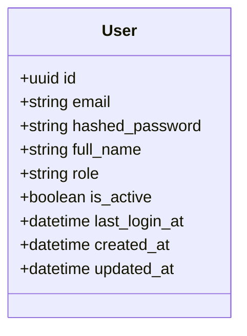

图表来源
- [backend/app/models/user.py:14-36](file://backend/app/models/user.py#L14-L36)
- [backend/app/db/base.py:17-47](file://backend/app/db/base.py#L17-L47)

章节来源
- [backend/app/models/user.py:1-36](file://backend/app/models/user.py#L1-L36)
- [backend/app/core/security.py:194-211](file://backend/app/core/security.py#L194-L211)
- [backend/app/api/v1/auth.py:70-101](file://backend/app/api/v1/auth.py#L70-L101)

### 项目（Project）
- 主键：UUID
- 关键字段：name、description、owner_id（FK→users.id）、status（默认 active）、cancer_type、patient_pseudonym、metadata（JSONB）
- 关系：一对多 datasets、hypotheses（级联删除孤儿）
- 索引：owner_id 索引；建议增加 status 复合索引以支持按状态筛选

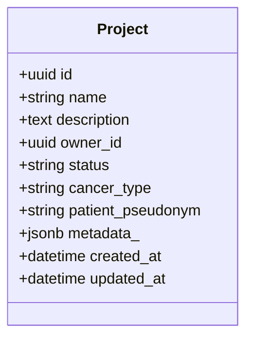

图表来源
- [backend/app/models/project.py:14-42](file://backend/app/models/project.py#L14-L42)
- [backend/app/db/base.py:17-47](file://backend/app/db/base.py#L17-L47)

章节来源
- [backend/app/models/project.py:1-42](file://backend/app/models/project.py#L1-L42)
- [backend/app/schemas/project.py:13-55](file://backend/app/schemas/project.py#L13-L55)

### 数据集（Dataset）与质量报告（QualityReport）
- Dataset 关键字段：project_id（FK→projects.id）、name、data_type、file_path、file_size_bytes、format、status（uploaded/processing/ready/failed）、checksum、metadata（JSONB）、quality_score、uploaded_by（FK→users.id）、processed_at
- 关系：一对一 QualityReport（级联删除孤儿）
- 索引：project_id 索引；建议 data_type+status 复合索引；metadata GIN 索引（PostgreSQL）

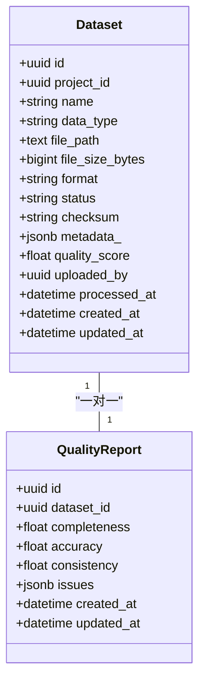

图表来源
- [backend/app/models/dataset.py:15-70](file://backend/app/models/dataset.py#L15-L70)
- [backend/app/db/base.py:17-47](file://backend/app/db/base.py#L17-L47)

章节来源
- [backend/app/models/dataset.py:1-70](file://backend/app/models/dataset.py#L1-L70)

### 靶点（Target）
- 关键字段：project_id、dataset_id（可空）、gene_symbol（索引）、gene_entrez_id、evidence_level（I/II/III/IV）、confidence_score、mechanism、source、metadata（JSONB）
- 关系：一对多 evidence_items、一对多 molecules

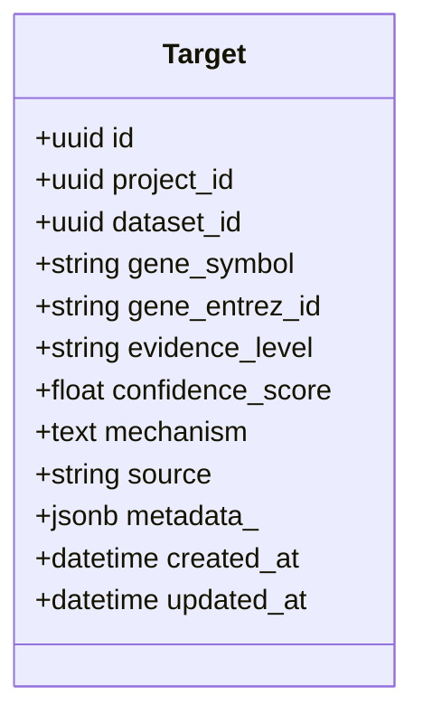

图表来源
- [backend/app/models/target.py:14-52](file://backend/app/models/target.py#L14-L52)
- [backend/app/db/base.py:17-47](file://backend/app/db/base.py#L17-L47)

章节来源
- [backend/app/models/target.py:1-52](file://backend/app/models/target.py#L1-L52)

### 分子（Molecule）与对接结果（DockingResult）
- Molecule 关键字段：project_id、target_id（可空）、smiles、inchi_key（索引）、chembl_id、is_approved、druglikeness（JSONB）、predicted_properties（JSONB）、source
- DockingResult：molecule_id（FK）、protein_pdb_id、protein_pdb_path、poses（JSONB）、top_confidence、docked_by

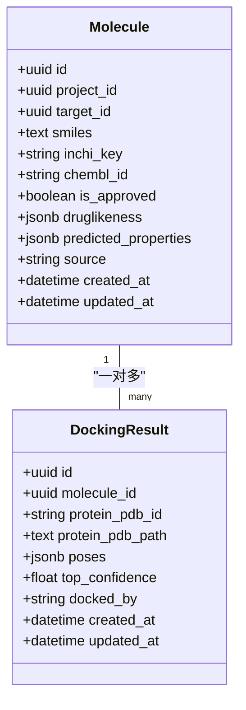

图表来源
- [backend/app/models/molecule.py:14-61](file://backend/app/models/molecule.py#L14-L61)
- [backend/app/db/base.py:17-47](file://backend/app/db/base.py#L17-L47)

章节来源
- [backend/app/models/molecule.py:1-61](file://backend/app/models/molecule.py#L1-L61)

### 假设（Hypothesis）与分析记录（HypothesisAnalysis）
- Hypothesis：project_id、name、description、status（active/merged/archived/eliminated）、priority（low/normal/high/forced）、forced_by（FK→users.id）、forced_reason、target_ids（JSONB）
- HypothesisAnalysis：hypothesis_id、report_id（FK→target_reports.id）、analysis_tier、cost_usd、duration_seconds

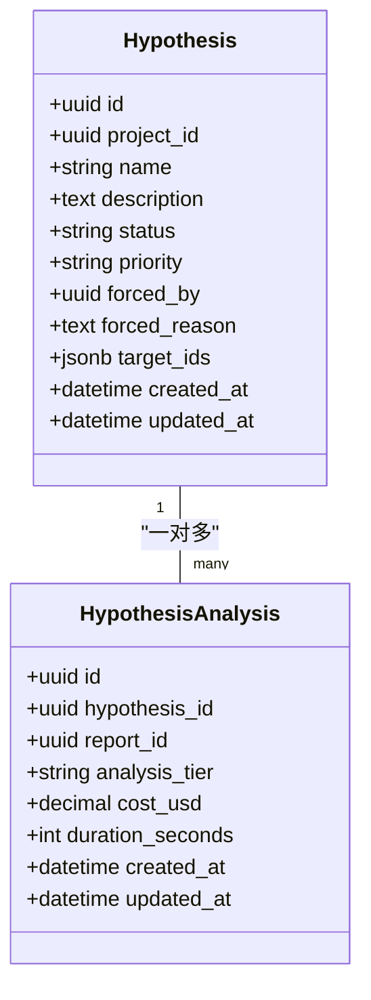

图表来源
- [backend/app/models/hypothesis.py:15-66](file://backend/app/models/hypothesis.py#L15-L66)
- [backend/app/db/base.py:17-47](file://backend/app/db/base.py#L17-L47)

章节来源
- [backend/app/models/hypothesis.py:1-66](file://backend/app/models/hypothesis.py#L1-L66)

### 报告（TargetReport）与证据项（EvidenceItem）
- TargetReport：project_id、target_ids（JSONB）、analysis_tier、llm_model、llm_cost_usd、llm_tokens_in/out、duration_seconds、summary、content_md、content_json（JSONB）、cdisc_sdtm_path
- EvidenceItem：target_id（可空）、report_id（可空）、evidence_type、evidence_level、reference_id/url、summary、payload（JSONB）

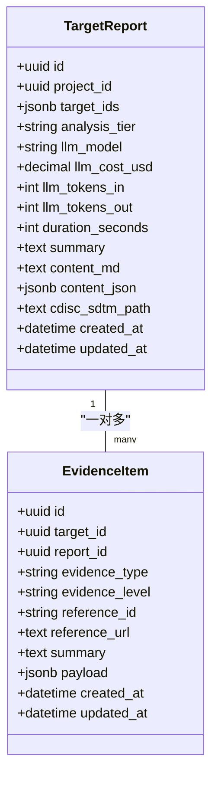

图表来源
- [backend/app/models/report.py:15-73](file://backend/app/models/report.py#L15-L73)
- [backend/app/db/base.py:17-47](file://backend/app/db/base.py#L17-L47)

章节来源
- [backend/app/models/report.py:1-73](file://backend/app/models/report.py#L1-L73)

### 审计日志（AuditLog）
- 不可变 append-only 表，BIGSERIAL 主键便于范围扫描
- 关键字段：user_id、action、resource_type、resource_id、before_value/after_value（JSONB）、ip_address（INET）、user_agent、created_at
- 索引：action+created_at 复合索引；user_id 索引

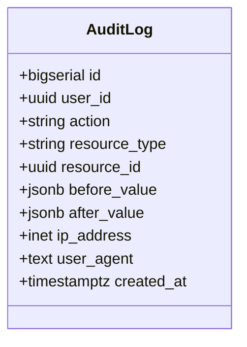

图表来源
- [backend/app/models/audit_log.py:15-45](file://backend/app/models/audit_log.py#L15-L45)

章节来源
- [backend/app/models/audit_log.py:1-45](file://backend/app/models/audit_log.py#L1-L45)

### 认证与角色权限流程（序列图）
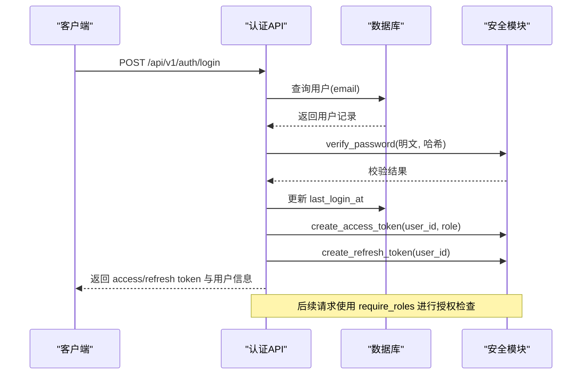

图表来源
- [backend/app/api/v1/auth.py:70-101](file://backend/app/api/v1/auth.py#L70-L101)
- [backend/app/core/security.py:96-122](file://backend/app/core/security.py#L96-L122)
- [backend/app/core/security.py:194-211](file://backend/app/core/security.py#L194-L211)

章节来源
- [backend/app/api/v1/auth.py:1-147](file://backend/app/api/v1/auth.py#L1-L147)
- [backend/app/core/security.py:1-211](file://backend/app/core/security.py#L1-L211)

## 依赖关系分析
- 模型依赖基础类型：所有业务模型继承 Base、UUIDPrimaryKey、TimestampMixin；部分模型使用 JSONBCompat/INETCompat
- 外键关系：
  - projects.owner_id → users.id（RESTRICT）
  - datasets.project_id → projects.id（CASCADE）
  - datasets.uploaded_by → users.id（RESTRICT）
  - targets.project_id → projects.id（CASCADE），targets.dataset_id → datasets.id（SET NULL）
  - molecules.project_id → projects.id（CASCADE），molecules.target_id → targets.id（SET NULL）
  - docking_results.molecule_id → molecules.id（CASCADE）
  - hypotheses.project_id → projects.id（CASCADE），hypotheses.forced_by → users.id（SET NULL）
  - hypothesis_analyses.hypothesis_id → hypotheses.id（CASCADE），hypothesis_analyses.report_id → target_reports.id（CASCADE）
  - target_reports.project_id → projects.id（CASCADE）
  - evidence_items.target_id → targets.id（SET NULL），evidence_items.report_id → target_reports.id（SET NULL）
  - audit_logs.user_id → users.id（SET NULL）

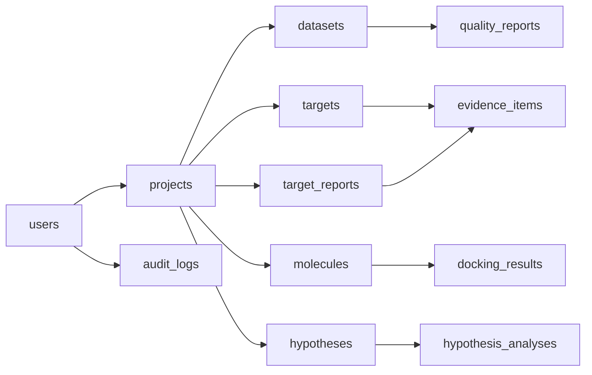

图表来源
- [backend/app/models/project.py:24-26](file://backend/app/models/project.py#L24-L26)
- [backend/app/models/dataset.py:27-41](file://backend/app/models/dataset.py#L27-L41)
- [backend/app/models/target.py:29-41](file://backend/app/models/target.py#L29-L41)
- [backend/app/models/molecule.py:23-40](file://backend/app/models/molecule.py#L23-L40)
- [backend/app/models/hypothesis.py:27-43](file://backend/app/models/hypothesis.py#L27-L43)
- [backend/app/models/report.py:23-41](file://backend/app/models/report.py#L23-L41)
- [backend/app/models/audit_log.py:25-27](file://backend/app/models/audit_log.py#L25-L27)

章节来源
- [backend/app/models/*.py:1-42](file://backend/app/models/project.py#L1-L42)

## 性能与索引策略
- 主键策略：统一使用 UUID4，避免自增冲突，利于分布式与迁移
- 时间戳混入：created_at/updated_at 使用 server_default 与应用层 onupdate 维护，保证一致性
- 推荐索引：
  - users.email（唯一）
  - projects.owner_id、projects.status
  - datasets.project_id、datasets.data_type+status（复合）、datasets.metadata（GIN）
  - targets.project_id、targets.gene_symbol、targets.evidence_level
  - molecules.project_id、molecules.target_id、molecules.inchi_key（唯一）
  - target_reports.project_id、target_reports.created_at
  - evidence_items.target_id、evidence_items.evidence_type
  - audit_logs.action+created_at（复合）、audit_logs.user_id
- 查询优化建议：
  - 使用 JSONB 时优先在 PostgreSQL 上启用 GIN 索引以支持高效检索
  - 对高频过滤字段建立复合索引（如 data_type+status）
  - 大对象路径与二进制内容仅存路径，避免将大文本直接入库
  - 审计日志按时间范围查询，利用 BIGSERIAL 与复合索引提升扫描效率

章节来源
- [backend/app/db/base.py:17-47](file://backend/app/db/base.py#L17-L47)
- [backend/app/db/types.py:13-27](file://backend/app/db/types.py#L13-L27)
- [docs/design/03-database.md:94-229](file://docs/design/03-database.md#L94-L229)

## 故障排查指南
- 认证失败：
  - 检查邮箱是否存在且未禁用，verify_password 是否返回 True
  - 确认 JWT 配置（secret、algorithm、过期时间）正确
- 权限不足：
  - 确认当前 token 中的 role 是否在 required_roles 列表中
  - 检查 require_roles 守卫是否正确挂载到端点
- 外键约束错误：
  - 删除父记录前确保子记录已清理或 ondelete 行为符合预期（RESTRICT/CASCADE/SET NULL）
- 审计日志写入失败：
  - 确认用户对 audit_logs 仅有 INSERT 权限，UPDATE/DELETE 被 REVOKE

章节来源
- [backend/app/core/security.py:155-211](file://backend/app/core/security.py#L155-L211)
- [backend/app/api/v1/auth.py:70-101](file://backend/app/api/v1/auth.py#L70-L101)
- [backend/app/models/audit_log.py:15-45](file://backend/app/models/audit_log.py#L15-L45)

## 结论
本 Schema 围绕“项目”构建，通过 UUID 主键与时间戳混入实现一致性与可移植性；借助 JSONB 与 INET 兼容类型兼顾灵活性与跨方言可用性；配合严格的角色守卫与审计日志，满足医疗与科研场景的安全合规需求。建议在部署阶段完善索引与约束，并基于 Alembic 管理迁移。

## 附录：SQL DDL 示例
以下为 PostgreSQL 风格的 DDL 参考，涵盖核心表、约束与索引。请根据实际环境调整连接参数与权限设置。

```sql
-- 用户表
CREATE TABLE users (
    id UUID PRIMARY KEY DEFAULT gen_random_uuid(),
    email VARCHAR(255) NOT NULL UNIQUE,
    hashed_password VARCHAR(255) NOT NULL,
    full_name VARCHAR(100) NOT NULL,
    role VARCHAR(20) NOT NULL DEFAULT 'researcher',
    is_active BOOLEAN NOT NULL DEFAULT TRUE,
    last_login_at TIMESTAMPTZ,
    created_at TIMESTAMPTZ NOT NULL DEFAULT now(),
    updated_at TIMESTAMPTZ NOT NULL DEFAULT now()
);
CREATE INDEX idx_users_email ON users(email);

-- 项目表
CREATE TABLE projects (
    id UUID PRIMARY KEY DEFAULT gen_random_uuid(),
    name VARCHAR(200) NOT NULL,
    description TEXT,
    owner_id UUID NOT NULL REFERENCES users(id) ON DELETE RESTRICT,
    status VARCHAR(20) NOT NULL DEFAULT 'active',
    cancer_type VARCHAR(100),
    patient_pseudonym VARCHAR(100),
    metadata JSONB NOT NULL DEFAULT '{}',
    created_at TIMESTAMPTZ NOT NULL DEFAULT now(),
    updated_at TIMESTAMPTZ NOT NULL DEFAULT now()
);
CREATE INDEX idx_projects_owner ON projects(owner_id);
CREATE INDEX idx_projects_status ON projects(status);

-- 数据集表
CREATE TABLE datasets (
    id UUID PRIMARY KEY DEFAULT gen_random_uuid(),
    project_id UUID NOT NULL REFERENCES projects(id) ON DELETE CASCADE,
    name VARCHAR(200) NOT NULL,
    data_type VARCHAR(30) NOT NULL,
    file_path TEXT NOT NULL,
    file_size_bytes BIGINT,
    format VARCHAR(20),
    status VARCHAR(20) NOT NULL DEFAULT 'uploaded',
    checksum VARCHAR(64),
    metadata JSONB NOT NULL DEFAULT '{}',
    quality_score FLOAT,
    uploaded_by UUID NOT NULL REFERENCES users(id) ON DELETE RESTRICT,
    processed_at TIMESTAMPTZ,
    created_at TIMESTAMPTZ NOT NULL DEFAULT now(),
    updated_at TIMESTAMPTZ NOT NULL DEFAULT now()
);
CREATE INDEX idx_datasets_project ON datasets(project_id);
CREATE INDEX idx_datasets_type_status ON datasets(data_type, status);
CREATE INDEX idx_datasets_metadata ON datasets USING GIN(metadata);

-- 质量报告表
CREATE TABLE quality_reports (
    id UUID PRIMARY KEY DEFAULT gen_random_uuid(),
    dataset_id UUID NOT NULL UNIQUE REFERENCES datasets(id) ON DELETE CASCADE,
    completeness FLOAT,
    accuracy FLOAT,
    consistency FLOAT,
    issues JSONB NOT NULL DEFAULT '[]',
    created_at TIMESTAMPTZ NOT NULL DEFAULT now(),
    updated_at TIMESTAMPTZ NOT NULL DEFAULT now()
);

-- 靶点表
CREATE TABLE targets (
    id UUID PRIMARY KEY DEFAULT gen_random_uuid(),
    project_id UUID NOT NULL REFERENCES projects(id) ON DELETE CASCADE,
    dataset_id UUID REFERENCES datasets(id) ON DELETE SET NULL,
    gene_symbol VARCHAR(50) NOT NULL,
    gene_entrez_id VARCHAR(20),
    evidence_level VARCHAR(5) NOT NULL DEFAULT 'IV',
    confidence_score FLOAT,
    mechanism TEXT,
    source VARCHAR(30),
    metadata JSONB NOT NULL DEFAULT '{}',
    created_at TIMESTAMPTZ NOT NULL DEFAULT now(),
    updated_at TIMESTAMPTZ NOT NULL DEFAULT now()
);
CREATE INDEX idx_targets_project ON targets(project_id);
CREATE INDEX idx_targets_gene ON targets(gene_symbol);
CREATE INDEX idx_targets_evidence ON targets(evidence_level);

-- 分子表
CREATE TABLE molecules (
    id UUID PRIMARY KEY DEFAULT gen_random_uuid(),
    project_id UUID NOT NULL REFERENCES projects(id) ON DELETE CASCADE,
    target_id UUID REFERENCES targets(id) ON DELETE SET NULL,
    smiles TEXT NOT NULL,
    inchi_key VARCHAR(27),
    chembl_id VARCHAR(20),
    is_approved BOOLEAN NOT NULL DEFAULT FALSE,
    druglikeness JSONB NOT NULL DEFAULT '{}',
    predicted_properties JSONB NOT NULL DEFAULT '{}',
    source VARCHAR(30),
    created_at TIMESTAMPTZ NOT NULL DEFAULT now(),
    updated_at TIMESTAMPTZ NOT NULL DEFAULT now()
);
CREATE INDEX idx_molecules_project ON molecules(project_id);
CREATE INDEX idx_molecules_target ON molecules(target_id);
CREATE UNIQUE INDEX idx_molecules_inchi ON molecules(inchi_key);

-- 对接结果表
CREATE TABLE docking_results (
    id UUID PRIMARY KEY DEFAULT gen_random_uuid(),
    molecule_id UUID NOT NULL REFERENCES molecules(id) ON DELETE CASCADE,
    protein_pdb_id VARCHAR(10),
    protein_pdb_path TEXT,
    poses JSONB NOT NULL DEFAULT '[]',
    top_confidence FLOAT,
    docked_by VARCHAR(20) NOT NULL DEFAULT 'diffdock_nim',
    created_at TIMESTAMPTZ NOT NULL DEFAULT now(),
    updated_at TIMESTAMPTZ NOT NULL DEFAULT now()
);

-- 假设表
CREATE TABLE hypotheses (
    id UUID PRIMARY KEY DEFAULT gen_random_uuid(),
    project_id UUID NOT NULL REFERENCES projects(id) ON DELETE CASCADE,
    name VARCHAR(200) NOT NULL,
    description TEXT,
    status VARCHAR(20) NOT NULL DEFAULT 'active',
    priority VARCHAR(10) NOT NULL DEFAULT 'normal',
    forced_by UUID REFERENCES users(id) ON DELETE SET NULL,
    forced_reason TEXT,
    target_ids JSONB NOT NULL DEFAULT '[]',
    created_at TIMESTAMPTZ NOT NULL DEFAULT now(),
    updated_at TIMESTAMPTZ NOT NULL DEFAULT now()
);
CREATE INDEX idx_hypotheses_project_status ON hypotheses(project_id, status);

-- 假设分析记录表
CREATE TABLE hypothesis_analyses (
    id UUID PRIMARY KEY DEFAULT gen_random_uuid(),
    hypothesis_id UUID NOT NULL REFERENCES hypotheses(id) ON DELETE CASCADE,
    report_id UUID NOT NULL REFERENCES target_reports(id) ON DELETE CASCADE,
    analysis_tier VARCHAR(10) NOT NULL DEFAULT 'quick',
    cost_usd DECIMAL(10,4),
    duration_seconds INT,
    created_at TIMESTAMPTZ NOT NULL DEFAULT now(),
    updated_at TIMESTAMPTZ NOT NULL DEFAULT now()
);

-- 靶点报告表
CREATE TABLE target_reports (
    id UUID PRIMARY KEY DEFAULT gen_random_uuid(),
    project_id UUID NOT NULL REFERENCES projects(id) ON DELETE CASCADE,
    target_ids JSONB NOT NULL DEFAULT '[]',
    analysis_tier VARCHAR(10) NOT NULL DEFAULT 'quick',
    llm_model VARCHAR(50),
    llm_cost_usd DECIMAL(10,4),
    llm_tokens_in INT,
    llm_tokens_out INT,
    duration_seconds INT,
    summary TEXT,
    content_md TEXT,
    content_json JSONB NOT NULL DEFAULT '{}',
    cdisc_sdtm_path TEXT,
    created_at TIMESTAMPTZ NOT NULL DEFAULT now(),
    updated_at TIMESTAMPTZ NOT NULL DEFAULT now()
);
CREATE INDEX idx_reports_project ON target_reports(project_id);
CREATE INDEX idx_reports_created ON target_reports(created_at);

-- 证据项表
CREATE TABLE evidence_items (
    id UUID PRIMARY KEY DEFAULT gen_random_uuid(),
    target_id UUID REFERENCES targets(id) ON DELETE SET NULL,
    report_id UUID REFERENCES target_reports(id) ON DELETE SET NULL,
    evidence_type VARCHAR(30) NOT NULL,
    evidence_level VARCHAR(5) NOT NULL DEFAULT 'IV',
    reference_id VARCHAR(100),
    reference_url TEXT,
    summary TEXT,
    payload JSONB NOT NULL DEFAULT '{}',
    created_at TIMESTAMPTZ NOT NULL DEFAULT now(),
    updated_at TIMESTAMPTZ NOT NULL DEFAULT now()
);
CREATE INDEX idx_evidence_target ON evidence_items(target_id);
CREATE INDEX idx_evidence_type ON evidence_items(evidence_type);

-- 审计日志表（append-only）
CREATE TABLE audit_logs (
    id BIGSERIAL PRIMARY KEY,
    user_id UUID REFERENCES users(id) ON DELETE SET NULL,
    action VARCHAR(50) NOT NULL,
    resource_type VARCHAR(30),
    resource_id UUID,
    before_value JSONB,
    after_value JSONB,
    ip_address INET,
    user_agent TEXT,
    created_at TIMESTAMPTZ NOT NULL DEFAULT now()
);
CREATE INDEX idx_audit_user ON audit_logs(user_id);
CREATE INDEX idx_audit_action_time ON audit_logs(action, created_at);
```

章节来源
- [docs/design/03-database.md:44-243](file://docs/design/03-database.md#L44-L243)