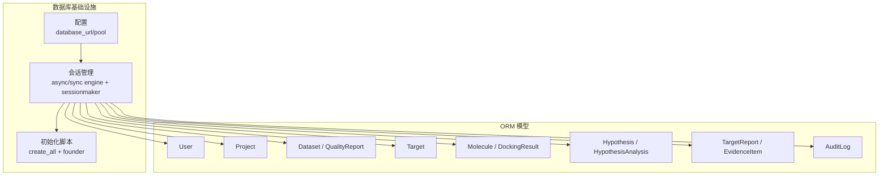
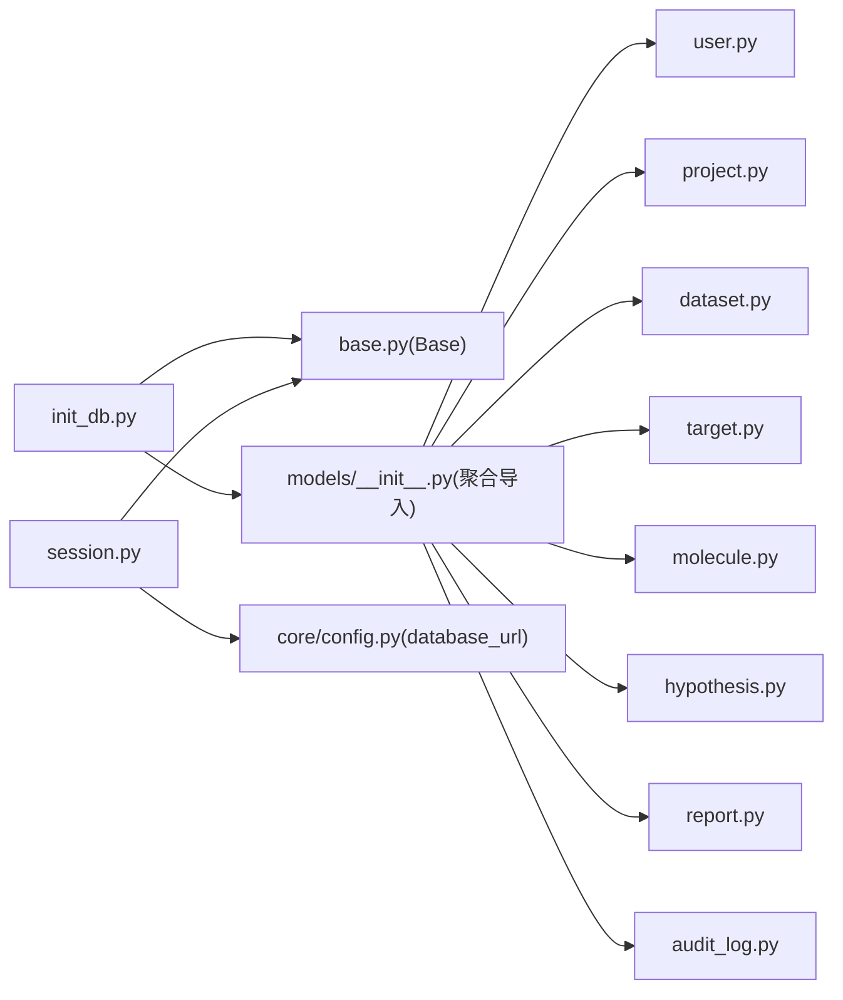

# 数据库设计

<cite>
**本文引用的文件**   
- [backend/app/db/base.py](file://backend/app/db/base.py)
- [backend/app/db/types.py](file://backend/app/db/types.py)
- [backend/app/db/session.py](file://backend/app/db/session.py)
- [backend/app/db/init_db.py](file://backend/app/db/init_db.py)
- [backend/app/models/__init__.py](file://backend/app/models/__init__.py)
- [backend/app/models/user.py](file://backend/app/models/user.py)
- [backend/app/models/project.py](file://backend/app/models/project.py)
- [backend/app/models/dataset.py](file://backend/app/models/dataset.py)
- [backend/app/models/target.py](file://backend/app/models/target.py)
- [backend/app/models/molecule.py](file://backend/app/models/molecule.py)
- [backend/app/models/hypothesis.py](file://backend/app/models/hypothesis.py)
- [backend/app/models/report.py](file://backend/app/models/report.py)
- [backend/app/models/audit_log.py](file://backend/app/models/audit_log.py)
- [backend/app/core/config.py](file://backend/app/core/config.py)
- [backend/app/api/v1/projects.py](file://backend/app/api/v1/projects.py)
</cite>

## 目录
1. [引言](#引言)
2. [项目结构](#项目结构)
3. [核心组件](#核心组件)
4. [架构总览](#架构总览)
5. [详细组件分析](#详细组件分析)
6. [依赖关系分析](#依赖关系分析)
7. [性能与索引策略](#性能与索引策略)
8. [查询示例](#查询示例)
9. [数据迁移方案](#数据迁移方案)
10. [备份与恢复策略](#备份与恢复策略)
11. [故障排查指南](#故障排查指南)
12. [结论](#结论)

## 引言
本文件为AI药物设计系统的数据库设计文档，面向数据库管理员与后端开发者。内容覆盖实体关系图、表结构与字段定义、主外键与约束、索引策略、查询优化、数据迁移、备份恢复与运维建议。系统采用SQLAlchemy ORM建模，默认使用PostgreSQL方言，并通过类型装饰器兼容SQLite等开发环境。

## 项目结构
数据库相关代码主要分布在以下模块：
- 基础与类型：声明基类、UUID主键混入、时间戳混入、跨方言JSONB/INET类型
- 会话与初始化：异步/同步引擎与会话工厂、FastAPI依赖注入、建表与初始用户脚本
- 模型层：用户、项目、数据集、靶点、分子、假设、报告、证据项、审计日志
- 配置：数据库URL、连接池参数、是否打印SQL等



图表来源
- [backend/app/core/config.py:37-39](file://backend/app/core/config.py#L37-L39)
- [backend/app/db/session.py:48-91](file://backend/app/db/session.py#L48-L91)
- [backend/app/db/init_db.py:35-40](file://backend/app/db/init_db.py#L35-L40)
- [backend/app/models/__init__.py:6-13](file://backend/app/models/__init__.py#L6-L13)

章节来源
- [backend/app/core/config.py:37-39](file://backend/app/core/config.py#L37-L39)
- [backend/app/db/session.py:48-91](file://backend/app/db/session.py#L48-L91)
- [backend/app/db/init_db.py:35-40](file://backend/app/db/init_db.py#L35-L40)
- [backend/app/models/__init__.py:6-13](file://backend/app/models/__init__.py#L6-L13)

## 核心组件
- 基础类型与混入
  - UUIDPrimaryKey：统一使用UUID作为主键，便于分布式生成与迁移
  - TimestampMixin：统一的created_at/updated_at时间戳
  - JSONBCompat/INETCompat：在PostgreSQL下使用原生JSONB/INET，其他方言降级为通用类型
- 会话与连接池
  - 根据数据库URL自动选择驱动（psycopg2/psycopg → asyncpg；sqlite → aiosqlite）
  - 非SQLite场景启用连接池参数（pool_size、max_overflow、pool_pre_ping）
- 初始化流程
  - 基于Base.metadata创建所有表
  - 可选创建初始创始人用户

章节来源
- [backend/app/db/base.py:17-47](file://backend/app/db/base.py#L17-L47)
- [backend/app/db/types.py:13-41](file://backend/app/db/types.py#L13-L41)
- [backend/app/db/session.py:25-80](file://backend/app/db/session.py#L25-L80)
- [backend/app/db/init_db.py:35-80](file://backend/app/db/init_db.py#L35-L80)

## 架构总览
下图展示核心实体之间的关系与关键外键约束。

```mermaid
erDiagram
USERS {
uuid id PK
string email UK
string hashed_password
string full_name
string role
boolean is_active
datetime last_login_at
timestamp created_at
timestamp updated_at
}
PROJECTS {
uuid id PK
string name
text description
uuid owner_id FK
string status
string cancer_type
string patient_pseudonym
jsonb metadata
timestamp created_at
timestamp updated_at
}
DATASETS {
uuid id PK
uuid project_id FK
string name
string data_type
text file_path
bigint file_size_bytes
string format
string status
string checksum
jsonb metadata
float quality_score
uuid uploaded_by FK
datetime processed_at
timestamp created_at
timestamp updated_at
}
QUALITY_REPORTS {
uuid id PK
uuid dataset_id FK UK
float completeness
float accuracy
float consistency
jsonb issues
timestamp created_at
timestamp updated_at
}
TARGETS {
uuid id PK
uuid project_id FK
uuid dataset_id FK
string gene_symbol
string gene_entrez_id
string evidence_level
float confidence_score
text mechanism
string source
jsonb metadata
timestamp created_at
timestamp updated_at
}
MOLECULES {
uuid id PK
uuid project_id FK
uuid target_id FK
text smiles
string inchi_key
string chembl_id
boolean is_approved
jsonb druglikeness
jsonb predicted_properties
string source
timestamp created_at
timestamp updated_at
}
DOCKING_RESULTS {
uuid id PK
uuid molecule_id FK
string protein_pdb_id
text protein_pdb_path
jsonb poses
float top_confidence
string docked_by
timestamp created_at
timestamp updated_at
}
HYPOTHESES {
uuid id PK
uuid project_id FK
string name
text description
string status
string priority
uuid forced_by FK
text forced_reason
jsonb target_ids
timestamp created_at
timestamp updated_at
}
HYPOTHESIS_ANALYSES {
uuid id PK
uuid hypothesis_id FK
uuid report_id FK
string analysis_tier
decimal cost_usd
int duration_seconds
timestamp created_at
timestamp updated_at
}
TARGET_REPORTS {
uuid id PK
uuid project_id FK
jsonb target_ids
string analysis_tier
string llm_model
numeric llm_cost_usd
int llm_tokens_in
int llm_tokens_out
int duration_seconds
text summary
text content_md
jsonb content_json
text cdisc_sdtm_path
timestamp created_at
timestamp updated_at
}
EVIDENCE_ITEMS {
uuid id PK
uuid target_id FK
uuid report_id FK
string evidence_type
string evidence_level
string reference_id
text reference_url
text summary
jsonb payload
timestamp created_at
timestamp updated_at
}
AUDIT_LOGS {
bigint id PK
uuid user_id FK
string action
string resource_type
uuid resource_id
jsonb before_value
jsonb after_value
inet ip_address
text user_agent
timestamp created_at
}
USERS ||--o{ PROJECTS : "拥有"
PROJECTS ||--o{ DATASETS : "包含"
PROJECTS ||--o{ TARGETS : "包含"
PROJECTS ||--o{ MOLECULES : "包含"
PROJECTS ||--o{ HYPOTHESES : "包含"
PROJECTS ||--o{ TARGET_REPORTS : "包含"
DATASETS ||--|| QUALITY_REPORTS : "质量报告"
DATASETS ||--o{ TARGETS : "来源"
TARGETS ||--o{ EVIDENCE_ITEMS : "证据"
TARGETS ||--o{ MOLECULES : "关联分子"
MOLECULES ||--o{ DOCKING_RESULTS : "对接结果"
HYPOTHESES ||--o{ HYPOTHESIS_ANALYSES : "分析记录"
TARGET_REPORTS ||--o{ EVIDENCE_ITEMS : "证据"
TARGET_REPORTS ||--o{ HYPOTHESIS_ANALYSES : "被引用"
USERS ||--o{ HYPOTHESES : "强制分析"
USERS ||--o{ AUDIT_LOGS : "操作者"
```

图表来源
- [backend/app/models/user.py:14-36](file://backend/app/models/user.py#L14-L36)
- [backend/app/models/project.py:14-42](file://backend/app/models/project.py#L14-L42)
- [backend/app/models/dataset.py:15-70](file://backend/app/models/dataset.py#L15-L70)
- [backend/app/models/target.py:14-52](file://backend/app/models/target.py#L14-L52)
- [backend/app/models/molecule.py:14-61](file://backend/app/models/molecule.py#L14-L61)
- [backend/app/models/hypothesis.py:15-66](file://backend/app/models/hypothesis.py#L15-L66)
- [backend/app/models/report.py:15-73](file://backend/app/models/report.py#L15-L73)
- [backend/app/models/audit_log.py:15-45](file://backend/app/models/audit_log.py#L15-L45)

## 详细组件分析

### 用户（users）
- 用途：系统用户与角色控制（founder/pi/researcher/doctor/engineer）
- 关键字段：email唯一索引、hashed_password、role、is_active、last_login_at
- 约束：email唯一、必填；role有默认值；时间戳由混入提供

章节来源
- [backend/app/models/user.py:14-36](file://backend/app/models/user.py#L14-L36)
- [backend/app/db/base.py:30-47](file://backend/app/db/base.py#L30-L47)

### 项目（projects）
- 用途：按患者/研究主题组织数据与分析产物
- 关键字段：name、description、owner_id（外键到users）、status、cancer_type、patient_pseudonym、metadata(JSONB)
- 关系：一对多datasets、hypotheses（级联删除孤儿）

章节来源
- [backend/app/models/project.py:14-42](file://backend/app/models/project.py#L14-L42)

### 数据集（datasets）与质量报告（quality_reports）
- datasets：上传的多组学数据元信息，含data_type、file_path、status、checksum、quality_score、uploaded_by、processed_at
- quality_reports：与dataset一对一，记录完整性/准确性/一致性评分及问题清单
- 关系：dataset→project（级联删除），dataset→quality_report（一对一，级联删除孤儿）

章节来源
- [backend/app/models/dataset.py:15-70](file://backend/app/models/dataset.py#L15-L70)

### 靶点（targets）
- 用途：发现的候选药物靶点，含evidence_level、confidence_score、mechanism、source、metadata
- 关系：属于project，可来源于dataset；一对多evidence_items与molecules

章节来源
- [backend/app/models/target.py:14-52](file://backend/app/models/target.py#L14-L52)

### 分子（molecules）与对接结果（docking_results）
- molecules：候选药物，含SMILES、InChIKey、chembl_id、is_approved、druglikeness/predicted_properties(JSONB)、source
- docking_results：DiffDock对接结果，poses(JSONB)、top_confidence、docked_by
- 关系：molecule→target（可选），molecule→docking_results（级联删除孤儿）

章节来源
- [backend/app/models/molecule.py:14-61](file://backend/app/models/molecule.py#L14-L61)

### 假设（hypotheses）与分析（hypothesis_analyses）
- hypotheses：假设沙盒，含status、priority、forced_by、forced_reason、target_ids(JSONB)
- hypothesis_analyses：一次分析记录，关联report_id、analysis_tier、cost_usd、duration_seconds
- 关系：hypothesis→analyses（级联删除孤儿），hypothesis_analysis→target_report

章节来源
- [backend/app/models/hypothesis.py:15-66](file://backend/app/models/hypothesis.py#L15-L66)

### 报告（target_reports）与证据（evidence_items）
- target_reports：LLM综合生成的靶点报告，含content_json(JSONB)、llm成本与token统计、CDISC路径等
- evidence_items：来自多源证据（clinvar/cosmic/chembl/pubmed等），含evidence_type、evidence_level、payload(JSONB)
- 关系：report→evidence_items；evidence_items也可归属target

章节来源
- [backend/app/models/report.py:15-73](file://backend/app/models/report.py#L15-L73)

### 审计日志（audit_logs）
- 用途：不可变审计记录，append-only，支持按action+时间范围扫描
- 特殊：自增BIGSERIAL主键，INET地址存储，复合索引(action, created_at)

章节来源
- [backend/app/models/audit_log.py:15-45](file://backend/app/models/audit_log.py#L15-L45)

## 依赖关系分析
- 模型导入聚合：models/__init__.py集中导入各模型，供Alembic/初始化发现
- 会话与引擎：session.py根据配置动态构建异步/同步引擎与会话工厂
- 初始化：init_db.py通过Base.metadata.create_all建表并插入初始用户



图表来源
- [backend/app/models/__init__.py:6-13](file://backend/app/models/__init__.py#L6-L13)
- [backend/app/db/init_db.py:21-31](file://backend/app/db/init_db.py#L21-L31)
- [backend/app/db/session.py:48-91](file://backend/app/db/session.py#L48-L91)
- [backend/app/core/config.py:37-39](file://backend/app/core/config.py#L37-L39)

章节来源
- [backend/app/models/__init__.py:6-13](file://backend/app/models/__init__.py#L6-L13)
- [backend/app/db/init_db.py:21-31](file://backend/app/db/init_db.py#L21-L31)
- [backend/app/db/session.py:48-91](file://backend/app/db/session.py#L48-L91)
- [backend/app/core/config.py:37-39](file://backend/app/core/config.py#L37-L39)

## 性能与索引策略
- 主键策略
  - 业务表统一使用UUID主键，利于分布式与分库分表扩展
  - 审计日志使用BIGSERIAL，便于按时间范围高效扫描
- 外键与级联
  - 删除项目时级联删除其数据集、假设等子资源（ondelete=CASCADE）
  - 删除数据集时级联删除质量报告
  - 删除分子时级联删除对接结果
  - 对部分弱关联使用SET NULL（如target.dataset_id、hypothesis.forced_by）
- 索引建议
  - users.email：唯一索引（已存在）
  - projects.owner_id、projects.status：常用过滤条件
  - datasets.project_id、datasets.status、datasets.data_type：高频筛选
  - targets.project_id、targets.gene_symbol、targets.evidence_level：检索与排序
  - molecules.project_id、molecules.target_id、molecules.inchi_key：关联与去重
  - hypothesis_analyses.hypothesis_id、report_id：分析链路追踪
  - evidence_items.target_id、report_id、evidence_type：证据聚合
  - audit_logs.action+created_at：复合索引（已存在）
- JSONB字段
  - 在PostgreSQL下使用JSONB，可对热点字段建立GIN索引（例如metadata.content_json、evidence_items.payload）
- 连接池与并发
  - 非SQLite场景启用pool_size=10、max_overflow=20、pool_pre_ping=True，避免僵尸连接
  - FastAPI路由使用异步会话，提升吞吐

章节来源
- [backend/app/db/session.py:64-80](file://backend/app/db/session.py#L64-L80)
- [backend/app/models/audit_log.py:39-41](file://backend/app/models/audit_log.py#L39-L41)
- [backend/app/models/project.py:24-26](file://backend/app/models/project.py#L24-L26)
- [backend/app/models/dataset.py:27-29](file://backend/app/models/dataset.py#L27-L29)
- [backend/app/models/target.py:29-31](file://backend/app/models/target.py#L29-L31)
- [backend/app/models/molecule.py:23-28](file://backend/app/models/molecule.py#L23-L28)
- [backend/app/models/hypothesis.py:54-56](file://backend/app/models/hypothesis.py#L54-L56)
- [backend/app/models/report.py:58-64](file://backend/app/models/report.py#L58-L64)

## 查询示例
以下为典型查询思路（以SQL为例，具体实现可在应用层使用SQLAlchemy或原生SQL）：
- 列出当前用户可访问的项目（分页、状态过滤）
  - 参考API逻辑：按owner_id过滤（非founder）、按status过滤、order by created_at desc、offset/limit分页
  - 参考路径：[backend/app/api/v1/projects.py:47-84](file://backend/app/api/v1/projects.py#L47-L84)
- 获取某项目的全部高质量数据集（quality_score>阈值）
  - 过滤：datasets.project_id = ? AND datasets.quality_score > ?
  - 排序：datasets.created_at desc
- 查找某靶点的证据项并按证据等级排序
  - 过滤：evidence_items.target_id = ?
  - 排序：CASE WHEN evidence_level='I' THEN 1 WHEN 'II' THEN 2 ... END
- 统计某假设的分析成本与耗时
  - 聚合：SUM(hypothesis_analyses.cost_usd), AVG(hypothesis_analyses.duration_seconds)
  - 分组：按analysis_tier
- 审计日志按动作与时间窗口检索
  - 过滤：audit_logs.action = ? AND audit_logs.created_at BETWEEN ? AND ?
  - 利用复合索引idx_audit_action_time

章节来源
- [backend/app/api/v1/projects.py:47-84](file://backend/app/api/v1/projects.py#L47-L84)
- [backend/app/models/audit_log.py:39-41](file://backend/app/models/audit_log.py#L39-L41)

## 数据迁移方案
- 现状说明
  - 当前使用Base.metadata.create_all进行全量建表，适合开发与快速迭代
  - 未引入Alembic版本化迁移脚本
- 推荐方案
  - 引入Alembic进行版本化管理，将每次DDL变更纳入迁移脚本
  - 将现有表结构导出为初始迁移，后续增量变更通过alembic revision生成
  - 生产环境执行前先在预发验证，回滚策略需准备
- 迁移步骤（概念性）
  - 安装Alembic并初始化仓库
  - 生成初始迁移（基于现有模型）
  - 编写后续增量迁移（新增列、索引、约束等）
  - 在CI中执行alembic upgrade head，失败则回滚
  - 数据回填与兼容性处理（如JSONB字段默认值）

章节来源
- [backend/app/db/init_db.py:35-40](file://backend/app/db/init_db.py#L35-L40)

## 备份与恢复策略
- 备份策略
  - 定期全量备份（如每日）与增量备份（如每小时）
  - 保留周期按合规要求设定（如90天）
  - 对象存储中的大文件（file_path指向）应单独归档并与数据库元数据关联
- 恢复演练
  - 定期进行恢复演练，确保RTO/RPO达标
  - 校验JSONB字段与枚举字段的完整性
- 安全与权限
  - 备份文件加密存储，限制访问权限
  - 审计日志独立备份，防止篡改

章节来源
- [backend/app/models/dataset.py:32](file://backend/app/models/dataset.py#L32)
- [backend/app/models/audit_log.py:18-20](file://backend/app/models/audit_log.py#L18-L20)

## 故障排查指南
- 连接问题
  - 检查database_url是否正确，驱动是否匹配（psycopg2/psycopg → asyncpg）
  - 确认连接池参数与网络可达性
  - 参考路径：[backend/app/db/session.py:25-40](file://backend/app/db/session.py#L25-L40)
- 建表失败
  - 确认Base.metadata已加载所有模型（models/__init__.py）
  - 检查方言差异（JSONB/INET在SQLite降级行为）
  - 参考路径：[backend/app/models/__init__.py:6-13](file://backend/app/models/__init__.py#L6-L13)，[backend/app/db/types.py:13-41](file://backend/app/db/types.py#L13-L41)
- 权限与软删除
  - 项目访问受owner_id与role控制，注意founder特例
  - 软删除通过status='archived'实现，查询时需过滤
  - 参考路径：[backend/app/api/v1/projects.py:32-44](file://backend/app/api/v1/projects.py#L32-44)，[backend/app/api/v1/projects.py:153-169](file://backend/app/api/v1/projects.py#L153-L169)
- 审计日志缺失
  - 确认写入审计的中间件/钩子是否生效
  - 使用复合索引检索最近动作

章节来源
- [backend/app/db/session.py:25-40](file://backend/app/db/session.py#L25-L40)
- [backend/app/db/types.py:13-41](file://backend/app/db/types.py#L13-L41)
- [backend/app/models/__init__.py:6-13](file://backend/app/models/__init__.py#L6-L13)
- [backend/app/api/v1/projects.py:32-44](file://backend/app/api/v1/projects.py#L32-44)
- [backend/app/api/v1/projects.py:153-169](file://backend/app/api/v1/projects.py#L153-L169)

## 结论
本设计以UUID主键、JSONB灵活扩展、严格的级联删除与完善的索引策略为基础，兼顾了高性能与可扩展性。配合会话池优化与审计日志，可满足AI药物研发在多租户、多阶段协作下的复杂需求。建议在生产环境引入Alembic版本化迁移与完善的备份恢复体系，持续监控索引命中率与慢查询，保障系统稳定运行。