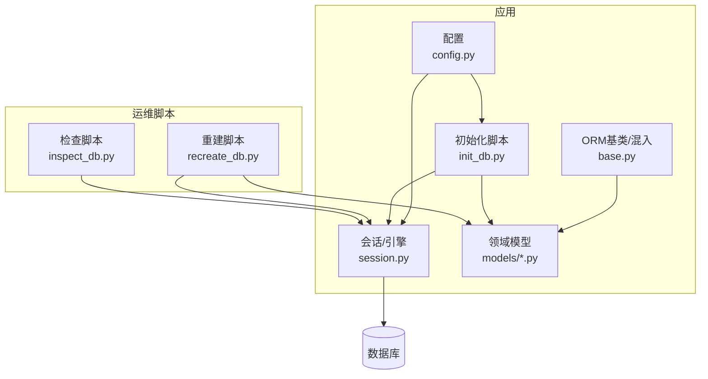
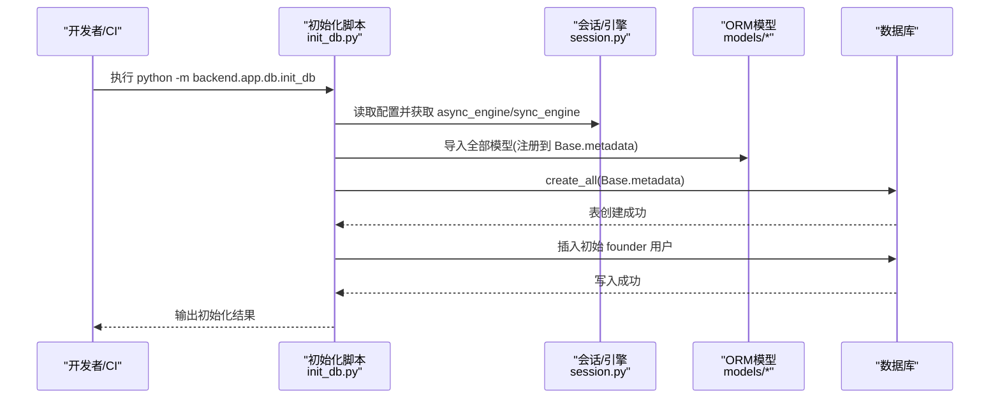
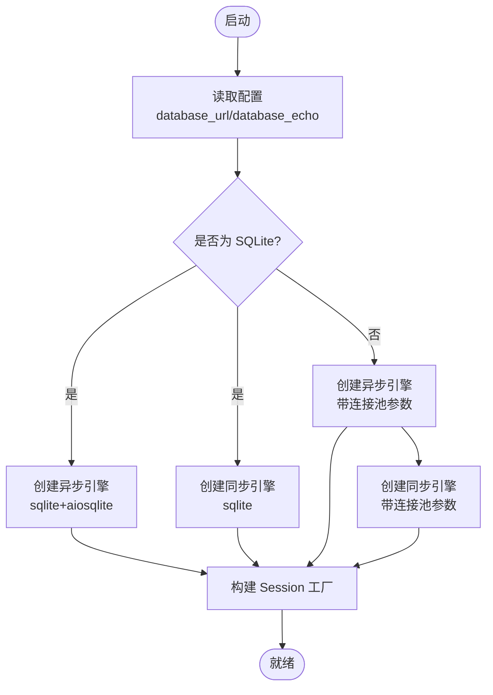
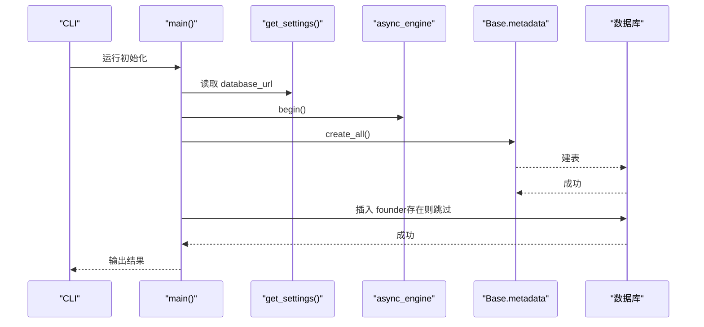
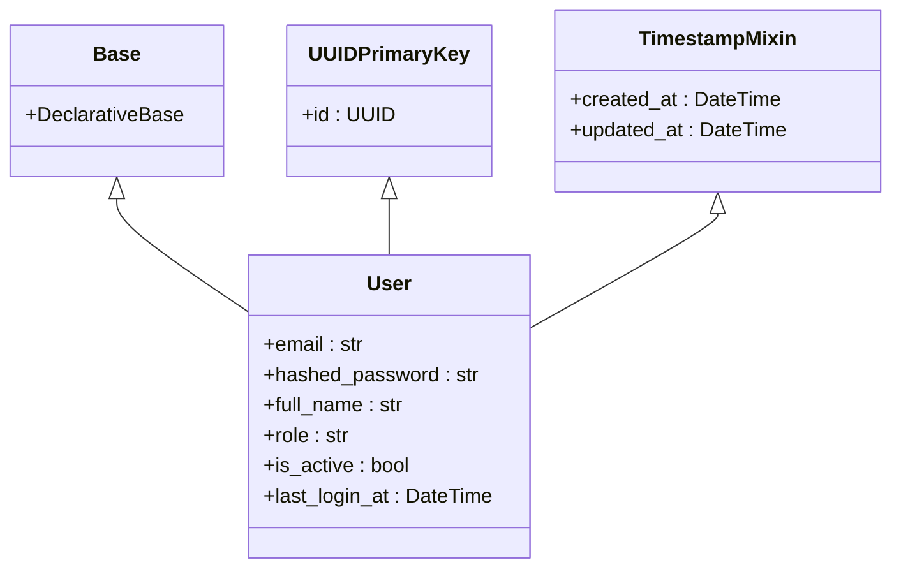
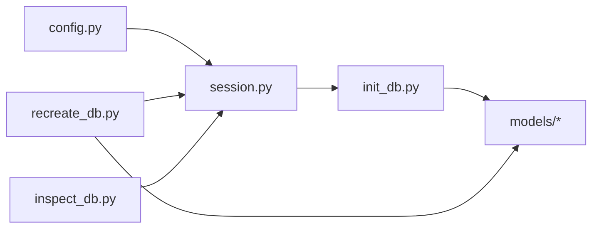

# 数据迁移管理

<cite>
**本文引用的文件**   
- [backend/app/db/base.py](file://backend/app/db/base.py)
- [backend/app/db/session.py](file://backend/app/db/session.py)
- [backend/app/db/init_db.py](file://backend/app/db/init_db.py)
- [backend/app/core/config.py](file://backend/app/core/config.py)
- [backend/app/models/user.py](file://backend/app/models/user.py)
- [backend/app/models/project.py](file://backend/app/models/project.py)
- [backend/app/models/molecule.py](file://backend/app/models/molecule.py)
- [scripts/recreate_db.py](file://scripts/recreate_db.py)
- [scripts/inspect_db.py](file://scripts/inspect_db.py)
</cite>

## 目录
1. [引言](#引言)
2. [项目结构](#项目结构)
3. [核心组件](#核心组件)
4. [架构总览](#架构总览)
5. [详细组件分析](#详细组件分析)
6. [依赖关系分析](#依赖关系分析)
7. [性能考虑](#性能考虑)
8. [故障排查指南](#故障排查指南)
9. [结论](#结论)
10. [附录](#附录)

## 引言
本文件为 AI 药物设计系统的数据迁移管理文档，面向 DevOps 工程师与数据库管理员。当前仓库未集成 Alembic 等迁移工具，采用“基于 SQLAlchemy ORM 的 create_all + 初始化脚本”的方式完成建表与种子数据注入。本文在尊重现有实现的基础上，给出：
- 数据库版本控制策略（以模型变更驱动、配合脚本化迁移）
- 迁移脚本编写规范（幂等、可回滚、可观测）
- 回滚机制实现建议（快照、反向脚本、事务边界）
- 增量迁移与批量更新的最佳实践
- 开发环境初始化、生产部署与灾难恢复流程
- 冲突解决、备份策略与性能监控指标

## 项目结构
与数据迁移相关的核心位置如下：
- 数据库基础类型与混入：backend/app/db/base.py
- 会话与引擎配置：backend/app/db/session.py
- 初始化入口（建表+种子）：backend/app/db/init_db.py
- 配置中心（含数据库 URL）：backend/app/core/config.py
- 领域模型（用户、项目、分子等）：backend/app/models/*.py
- 临时运维脚本（重建/检查）：scripts/recreate_db.py, scripts/inspect_db.py

图表来源
- [backend/app/core/config.py:37-40](file://backend/app/core/config.py#L37-L40)
- [backend/app/db/session.py:48-80](file://backend/app/db/session.py#L48-L80)
- [backend/app/db/init_db.py:35-87](file://backend/app/db/init_db.py#L35-L87)
- [backend/app/db/base.py:13-47](file://backend/app/db/base.py#L13-L47)
- [backend/app/models/user.py:14-36](file://backend/app/models/user.py#L14-L36)
- [backend/app/models/project.py:14-42](file://backend/app/models/project.py#L14-L42)
- [backend/app/models/molecule.py:14-61](file://backend/app/models/molecule.py#L14-L61)
- [scripts/recreate_db.py:33-68](file://scripts/recreate_db.py#L33-L68)
- [scripts/inspect_db.py:47-78](file://scripts/inspect_db.py#L47-L78)

章节来源
- [backend/app/db/base.py:13-47](file://backend/app/db/base.py#L13-L47)
- [backend/app/db/session.py:48-80](file://backend/app/db/session.py#L48-L80)
- [backend/app/db/init_db.py:35-87](file://backend/app/db/init_db.py#L35-L87)
- [backend/app/core/config.py:37-40](file://backend/app/core/config.py#L37-L40)
- [backend/app/models/user.py:14-36](file://backend/app/models/user.py#L14-L36)
- [backend/app/models/project.py:14-42](file://backend/app/models/project.py#L14-L42)
- [backend/app/models/molecule.py:14-61](file://backend/app/models/molecule.py#L14-L61)
- [scripts/recreate_db.py:33-68](file://scripts/recreate_db.py#L33-L68)
- [scripts/inspect_db.py:47-78](file://scripts/inspect_db.py#L47-L78)

## 核心组件
- 配置中心
  - 提供 database_url、database_echo 等关键项，决定连接字符串与 SQL 日志开关。
- 会话与引擎
  - 根据是否 SQLite 动态选择连接池参数；提供同步/异步 engine 与 sessionmaker；封装 get_async_db/get_sync_db 依赖注入。
- 初始化脚本
  - 导入所有模型，调用 Base.metadata.create_all 创建表；创建初始 founder 用户。
- ORM 基类与混入
  - 统一 UUID 主键与时间戳字段，保证跨表一致性与分布式友好。

章节来源
- [backend/app/core/config.py:37-40](file://backend/app/core/config.py#L37-L40)
- [backend/app/db/session.py:25-46](file://backend/app/db/session.py#L25-L46)
- [backend/app/db/session.py:48-80](file://backend/app/db/session.py#L48-L80)
- [backend/app/db/init_db.py:35-87](file://backend/app/db/init_db.py#L35-L87)
- [backend/app/db/base.py:17-47](file://backend/app/db/base.py#L17-L47)

## 架构总览
下图展示从配置到数据库的端到端路径，以及初始化脚本如何触发建表与种子数据写入。

图表来源
- [backend/app/db/init_db.py:35-87](file://backend/app/db/init_db.py#L35-L87)
- [backend/app/db/session.py:48-80](file://backend/app/db/session.py#L48-L80)
- [backend/app/core/config.py:37-40](file://backend/app/core/config.py#L37-L40)

## 详细组件分析

### 组件A：数据库会话与引擎（session.py）
- 功能要点
  - 自动将 psycopg2/psycopg/sqlite 转为对应异步驱动（asyncpg/aiosqlite）。
  - 非 SQLite 场景启用连接池参数（pool_pre_ping、pool_size、max_overflow）。
  - 暴露 AsyncSessionLocal/SyncSessionLocal 及 FastAPI 依赖 get_async_db/get_sync_db。
- 复杂度与性能
  - 连接池大小与溢出参数影响并发吞吐与资源占用；SQLite 下禁用连接池相关参数以避免不兼容。
- 错误处理
  - 依赖注入中异常时自动 rollback，避免脏读与锁残留。

图表来源
- [backend/app/db/session.py:25-46](file://backend/app/db/session.py#L25-L46)
- [backend/app/db/session.py:48-80](file://backend/app/db/session.py#L48-L80)

章节来源
- [backend/app/db/session.py:25-46](file://backend/app/db/session.py#L25-L46)
- [backend/app/db/session.py:48-80](file://backend/app/db/session.py#L48-L80)
- [backend/app/db/session.py:94-128](file://backend/app/db/session.py#L94-L128)

### 组件B：初始化脚本（init_db.py）
- 功能要点
  - 导入所有模型，确保 Base.metadata 包含全部表定义。
  - 使用 async_engine.begin() 调用 create_all 建表。
  - 通过 SyncSessionLocal 插入初始 founder 用户，支持命令行覆盖默认凭据。
- 幂等性
  - 建表使用 create_all（幂等）；用户插入前查询是否存在，避免重复。
- 扩展点
  - 可在同一脚本内追加更多种子数据或校验逻辑。

图表来源
- [backend/app/db/init_db.py:35-87](file://backend/app/db/init_db.py#L35-L87)
- [backend/app/core/config.py:37-40](file://backend/app/core/config.py#L37-L40)

章节来源
- [backend/app/db/init_db.py:35-87](file://backend/app/db/init_db.py#L35-L87)

### 组件C：ORM 基类与混入（base.py）
- 功能要点
  - Base：DeclarativeBase 根类。
  - UUIDPrimaryKey：统一 UUID 主键，便于分布式生成与迁移。
  - TimestampMixin：统一的 created_at/updated_at 时间戳。
- 对迁移的影响
  - 新增模型需继承这些混入，以保证字段一致性，降低迁移复杂度。

图表来源
- [backend/app/db/base.py:13-47](file://backend/app/db/base.py#L13-L47)
- [backend/app/models/user.py:14-36](file://backend/app/models/user.py#L14-L36)

章节来源
- [backend/app/db/base.py:13-47](file://backend/app/db/base.py#L13-L47)
- [backend/app/models/user.py:14-36](file://backend/app/models/user.py#L14-L36)

### 组件D：领域模型示例（project.py、molecule.py）
- 设计要点
  - 使用 JSONBCompat 在 PostgreSQL 上获得 JSONB 能力，在其他方言降级为 JSON。
  - 外键约束与级联删除策略明确，利于数据一致性。
- 迁移关注点
  - 新增列/索引/JSONB 字段时需评估 DDL 成本与在线变更可行性。

章节来源
- [backend/app/models/project.py:14-42](file://backend/app/models/project.py#L14-L42)
- [backend/app/models/molecule.py:14-61](file://backend/app/models/molecule.py#L14-L61)

## 依赖关系分析
- 配置到会话
  - config.py 提供 database_url，session.py 据此创建引擎与会话工厂。
- 初始化到模型
  - init_db.py 显式导入 models 包，确保 Base.metadata 完整。
- 运维脚本复用
  - recreate_db.py 与 inspect_db.py 复用 session.py 的引擎与会话，用于本地重建与诊断。

图表来源
- [backend/app/core/config.py:37-40](file://backend/app/core/config.py#L37-L40)
- [backend/app/db/session.py:48-80](file://backend/app/db/session.py#L48-L80)
- [backend/app/db/init_db.py:35-87](file://backend/app/db/init_db.py#L35-L87)
- [scripts/recreate_db.py:33-68](file://scripts/recreate_db.py#L33-L68)
- [scripts/inspect_db.py:47-78](file://scripts/inspect_db.py#L47-L78)

章节来源
- [backend/app/core/config.py:37-40](file://backend/app/core/config.py#L37-L40)
- [backend/app/db/session.py:48-80](file://backend/app/db/session.py#L48-L80)
- [backend/app/db/init_db.py:35-87](file://backend/app/db/init_db.py#L35-L87)
- [scripts/recreate_db.py:33-68](file://scripts/recreate_db.py#L33-L68)
- [scripts/inspect_db.py:47-78](file://scripts/inspect_db.py#L47-L78)

## 性能考虑
- 连接池参数
  - 非 SQLite 场景已设置 pool_pre_ping、pool_size、max_overflow，可根据 QPS 与延迟目标调优。
- 慢查询与 SQL 日志
  - 通过 database_echo 开启 SQL 日志，定位热点语句；生产环境建议关闭或仅开启警告级别。
- 大表变更
  - 增加索引/列/转换数据类型时，优先使用在线 DDL 与分批策略，避免长时间锁表。
- JSONB 使用
  - 在 PostgreSQL 上使用 JSONB 可获得索引与高效查询，但需注意写入放大与序列化开销。

章节来源
- [backend/app/db/session.py:64-80](file://backend/app/db/session.py#L64-L80)
- [backend/app/core/config.py:37-40](file://backend/app/core/config.py#L37-L40)

## 故障排查指南
- 常见问题
  - 端口/认证失败：检查 database_url 是否正确，确认网络可达与凭据有效。
  - 表不存在：确认初始化脚本已执行且模型导入完整。
  - 重复用户：初始化脚本已做存在性判断，若仍报错请检查并发写入与事务隔离。
- 快速自检
  - 使用 inspect_db.py 查看表结构与用户记录。
  - 使用 recreate_db.py 重建 schema 与种子数据（注意会清空已有数据）。
- 回滚建议
  - 变更前先导出全量/增量备份；DDL 尽量可逆，准备反向脚本；复杂数据转换建议在事务中分批执行并记录进度。

章节来源
- [scripts/inspect_db.py:11-23](file://scripts/inspect_db.py#L11-L23)
- [scripts/recreate_db.py:33-68](file://scripts/recreate_db.py#L33-L68)
- [backend/app/db/init_db.py:42-61](file://backend/app/db/init_db.py#L42-L61)

## 结论
当前系统通过 SQLAlchemy 的 create_all 与初始化脚本实现“模型即 Schema”的轻量迁移方式，适合开发与测试环境快速迭代。在生产环境中，建议引入 Alembic 或等效迁移工具，结合备份与灰度发布策略，提升变更的可控性与可回滚性。

## 附录

### 数据库版本控制策略（推荐）
- 以模型变更为源，维护迁移历史；每个变更一个迁移脚本，命名清晰、描述准确。
- 保持迁移幂等：允许重复执行而不改变最终状态。
- 禁止直接修改已合入的迁移；如需修正，应新增迁移修复。

### 迁移脚本编写规范
- 结构：up（向前）、down（回滚）成对出现；必要时提供中间态。
- 数据变更：分批更新，记录进度，支持中断续跑。
- 索引与约束：优先添加索引再改数据，减少锁等待。
- 兼容性：同时考虑多方言差异（如 JSONB vs JSON）。

### 回滚机制实现
- 数据库快照：迁移前创建快照或逻辑备份，失败即恢复。
- 反向脚本：每个 up 必须配套 down；复杂业务逻辑用存储过程封装。
- 事务边界：尽可能在单事务内完成 DDL+DML，失败整体回滚。

### Alembic 配置与使用（建议）
- 安装与初始化：安装 alembic，初始化 alembic.ini 与 env.py。
- 环境适配：env.py 中加载 Settings，解析 database_url，传入给 create_engine。
- 自动/手动生成：首次可用 autogenerate 生成骨架，随后手工完善 up/down。
- 版本分支：长分支合并前进行 rebase，解决冲突后提交。

### 增量迁移与批量更新最佳实践
- 小步快跑：每次只改少量对象，降低风险。
- 分批处理：按主键范围或时间窗口分批更新，避免长事务。
- 监控告警：对耗时、锁等待、行锁冲突设置阈值告警。

### 开发环境初始化流程
- 设置 .env 中的 database_url 指向本地库。
- 运行初始化脚本创建表与 founder。
- 使用 inspect_db.py 验证表与用户。

章节来源
- [backend/app/db/init_db.py:64-87](file://backend/app/db/init_db.py#L64-L87)
- [scripts/inspect_db.py:47-78](file://scripts/inspect_db.py#L47-L78)

### 生产环境部署流程
- 预检：备份数据库，核对迁移脚本与依赖。
- 灰度：先在只读副本或影子库验证迁移。
- 发布：低峰期执行迁移，观察慢查询与锁等待。
- 回滚：若失败，立即回滚至最近稳定版本并恢复备份。

### 灾难恢复流程
- 全量恢复：从最近全量备份恢复到时间点 T。
- 增量恢复：回放 T 之后的 WAL/二进制日志至目标时间点。
- 校验：比对关键表行数与 checksum，确保一致性。

### 迁移冲突解决
- 识别冲突：比较迁移历史与目标库版本。
- 重放顺序：按依赖关系排序，必要时拆分迁移。
- 人工介入：对不可自动解决的冲突，编写修复迁移并评审。

### 数据备份策略
- 周期：每日全量 + 每小时增量（或按业务 SLA）。
- 保留：至少保留 N 个周期，异地容灾。
- 演练：定期演练恢复流程，验证 RTO/RPO。

### 性能监控指标
- 连接池：活跃连接数、等待队列长度、超时次数。
- 事务：平均时长、长事务数量、回滚率。
- 锁：锁等待时长、死锁次数。
- I/O：磁盘读写延迟、缓存命中率。
- SQL：慢查询数量、Top-N 语句。