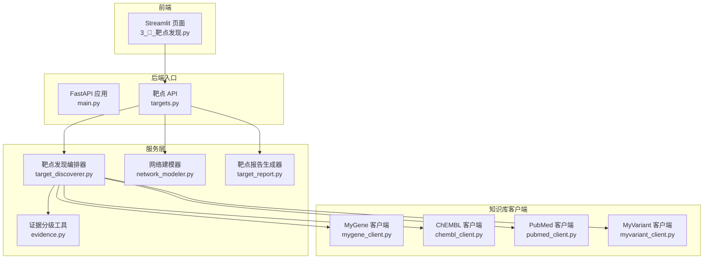
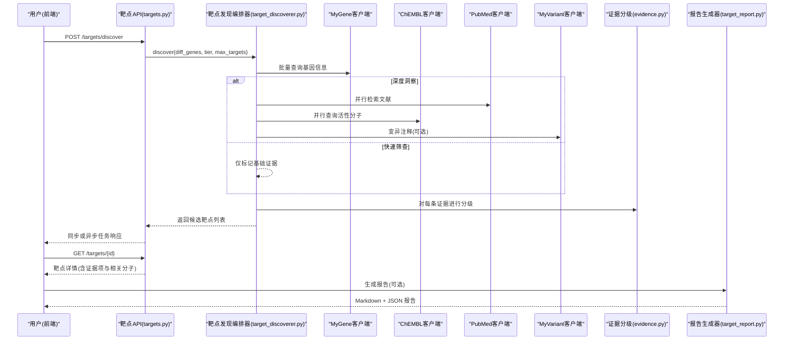
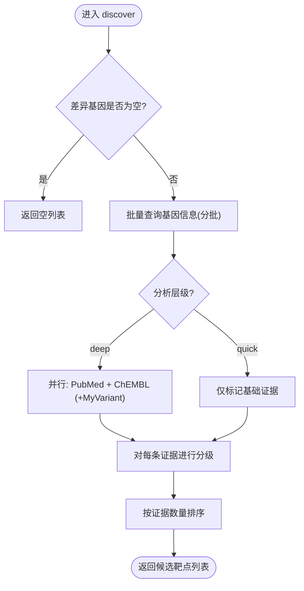
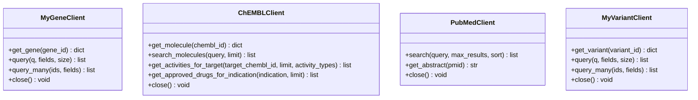
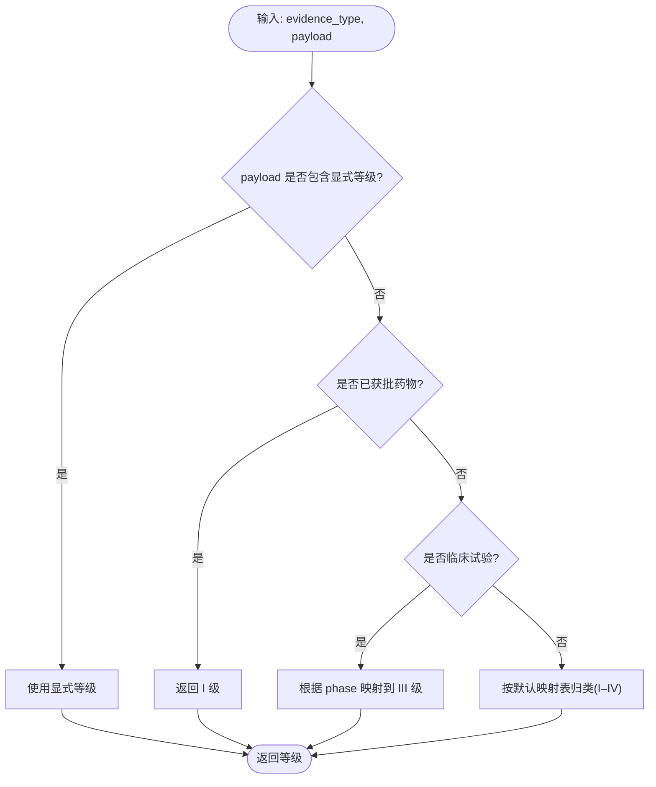
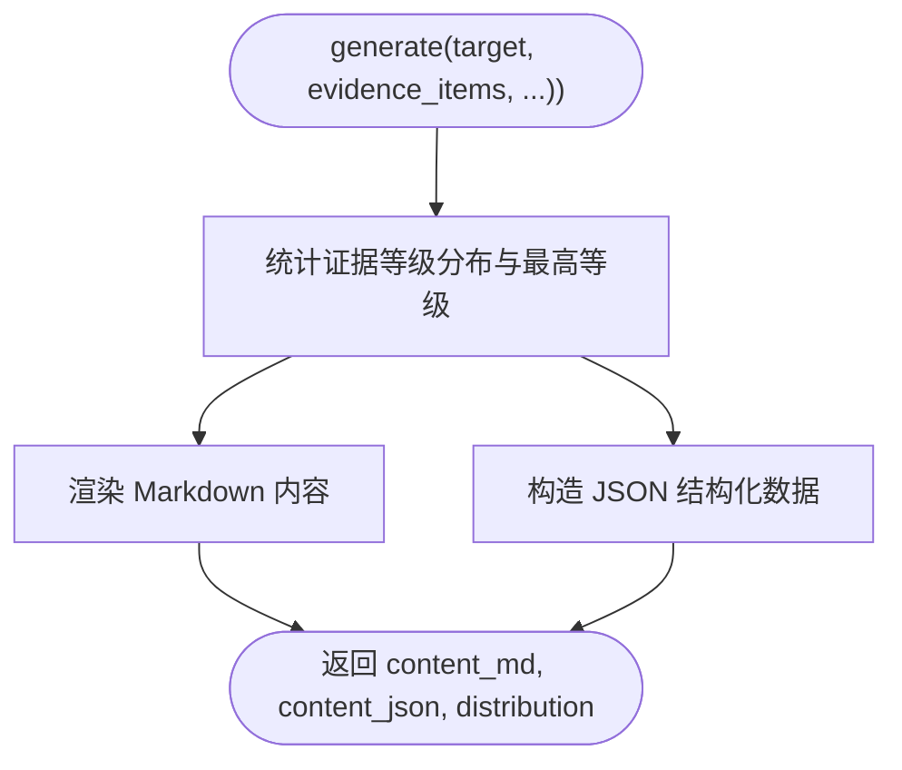
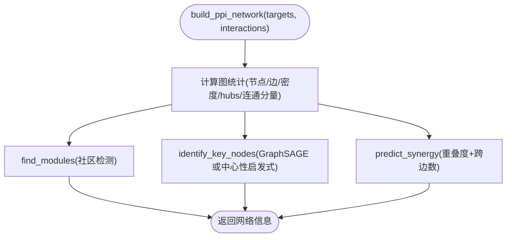
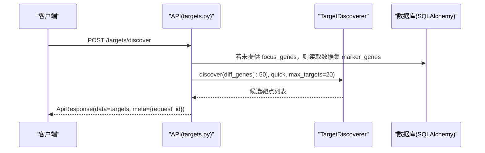
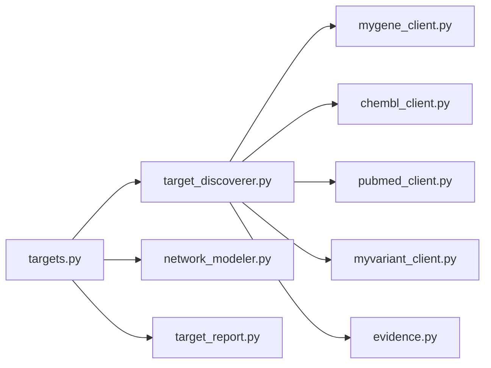

# AI靶点发现引擎

<cite>
**本文引用的文件**   
- [README.md](file://README.md)
- [main.py](file://backend/app/main.py)
- [targets.py](file://backend/app/api/v1/targets.py)
- [target_discoverer.py](file://backend/app/services/analyzer/target_discoverer.py)
- [mygene_client.py](file://backend/app/services/knowledge/mygene_client.py)
- [chembl_client.py](file://backend/app/services/knowledge/chembl_client.py)
- [pubmed_client.py](file://backend/app/services/knowledge/pubmed_client.py)
- [myvariant_client.py](file://backend/app/services/knowledge/myvariant_client.py)
- [evidence.py](file://backend/app/utils/evidence.py)
- [target_report.py](file://backend/app/services/report/target_report.py)
- [network_modeler.py](file://backend/app/services/analyzer/network_modeler.py)
- [config.py](file://backend/app/core/config.py)
- [3_🎯_靶点发现.py](file://frontend/pages/3_🎯_靶点发现.py)
</cite>

## 目录
1. [简介](#简介)
2. [项目结构](#项目结构)
3. [核心组件](#核心组件)
4. [架构总览](#架构总览)
5. [详细组件分析](#详细组件分析)
6. [依赖关系分析](#依赖关系分析)
7. [性能与扩展性](#性能与扩展性)
8. [故障排查指南](#故障排查指南)
9. [结论](#结论)
10. [附录](#附录)

## 简介
本文件为“AI靶点发现引擎”的技术文档，聚焦于差异表达分析到候选靶点筛选的完整链路，覆盖知识库检索集成（MyGene.info、ChEMBL、PubMed、MyVariant）、证据分级排序、靶点评分与置信度计算、结果可视化与报告生成机制。同时提供工作流说明、参数调优建议、性能优化策略与扩展开发指南，帮助研发人员快速理解并高效使用该系统。

## 项目结构
后端采用 FastAPI + SQLAlchemy 异步 ORM，服务层按能力分层组织：分析器（analyzer）、知识库客户端（knowledge）、报告生成（report）、网络建模（network_modeler）等；前端通过 Streamlit 页面驱动用户交互。

图表来源
- [main.py:187-248](file://backend/app/main.py#L187-L248)
- [targets.py:42-131](file://backend/app/api/v1/targets.py#L42-L131)
- [target_discoverer.py:26-176](file://backend/app/services/analyzer/target_discoverer.py#L26-L176)
- [mygene_client.py:19-97](file://backend/app/services/knowledge/mygene_client.py#L19-L97)
- [chembl_client.py:20-127](file://backend/app/services/knowledge/chembl_client.py#L20-L127)
- [pubmed_client.py:16-125](file://backend/app/services/knowledge/pubmed_client.py#L16-L125)
- [myvariant_client.py:19-85](file://backend/app/services/knowledge/myvariant_client.py#L19-L85)
- [network_modeler.py:14-370](file://backend/app/services/analyzer/network_modeler.py#L14-L370)
- [target_report.py:15-215](file://backend/app/services/report/target_report.py#L15-L215)
- [evidence.py:39-103](file://backend/app/utils/evidence.py#L39-L103)
- [3_🎯_靶点发现.py:34-157](file://frontend/pages/3_🎯_靶点发现.py#L34-L157)

章节来源
- [README.md:29-80](file://README.md#L29-L80)
- [README.md:190-235](file://README.md#L190-L235)

## 核心组件
- 靶点发现编排器：协调多源知识库查询，整合证据并输出候选靶点列表。
- 知识库客户端：封装 MyGene.info、ChEMBL、PubMed、MyVariant 的 HTTP 调用与重试/超时策略。
- 证据分级工具：依据证据类型与载荷推断 I–IV 级证据等级，并提供统计与最高等级提取。
- 靶点报告生成器：将靶点信息、证据项、相关分子、文献与临床试验汇总为 Markdown 与 JSON 结构化报告。
- 网络建模器：构建 PPI 网络、识别关键节点与模块，评估多靶点协同效应（支持 PyG 与 NetworkX 降级）。
- API 层：暴露靶点发现、列表、详情、强制深度分析、网络构建与协同预测等端点。
- 前端页面：提供差异基因输入、分析层级选择、结果概览与操作入口。

章节来源
- [target_discoverer.py:26-176](file://backend/app/services/analyzer/target_discoverer.py#L26-L176)
- [mygene_client.py:19-97](file://backend/app/services/knowledge/mygene_client.py#L19-L97)
- [chembl_client.py:20-127](file://backend/app/services/knowledge/chembl_client.py#L20-L127)
- [pubmed_client.py:16-125](file://backend/app/services/knowledge/pubmed_client.py#L16-L125)
- [myvariant_client.py:19-85](file://backend/app/services/knowledge/myvariant_client.py#L19-L85)
- [evidence.py:39-103](file://backend/app/utils/evidence.py#L39-L103)
- [target_report.py:15-215](file://backend/app/services/report/target_report.py#L15-L215)
- [network_modeler.py:14-370](file://backend/app/services/analyzer/network_modeler.py#L14-L370)
- [targets.py:42-344](file://backend/app/api/v1/targets.py#L42-L344)
- [3_🎯_靶点发现.py:34-157](file://frontend/pages/3_🎯_靶点发现.py#L34-L157)

## 架构总览
系统以“数据→分析→证据→报告→可视化”为主线，前后端分离，外部知识库通过统一 HTTP 客户端访问，中间件负责请求追踪与响应信封注入。

图表来源
- [targets.py:42-131](file://backend/app/api/v1/targets.py#L42-L131)
- [target_discoverer.py:52-139](file://backend/app/services/analyzer/target_discoverer.py#L52-L139)
- [mygene_client.py:74-92](file://backend/app/services/knowledge/mygene_client.py#L74-L92)
- [pubmed_client.py:33-98](file://backend/app/services/knowledge/pubmed_client.py#L33-L98)
- [chembl_client.py:48-70](file://backend/app/services/knowledge/chembl_client.py#L48-L70)
- [myvariant_client.py:47-80](file://backend/app/services/knowledge/myvariant_client.py#L47-L80)
- [evidence.py:39-75](file://backend/app/utils/evidence.py#L39-L75)
- [target_report.py:21-76](file://backend/app/services/report/target_report.py#L21-L76)

## 详细组件分析

### 靶点发现编排器（TargetDiscoverer）
- 职责：接收差异基因列表，按分析层级（quick/deep）并行调用知识库，聚合证据并输出候选靶点。
- 关键流程：
  - 批量查询基因信息（分批处理，避免单次过大）。
  - deep 模式并行检索 PubMed 与 ChEMBL，必要时调用 MyVariant。
  - 对每条证据调用证据分级工具，得到 I–IV 等级。
  - 按证据数量排序，返回 top-K 候选。
- 错误处理：外部调用异常被捕获并记录日志，保证整体流程健壮性。

图表来源
- [target_discoverer.py:52-139](file://backend/app/services/analyzer/target_discoverer.py#L52-L139)
- [target_discoverer.py:141-165](file://backend/app/services/analyzer/target_discoverer.py#L141-L165)
- [evidence.py:39-75](file://backend/app/utils/evidence.py#L39-L75)

章节来源
- [target_discoverer.py:26-176](file://backend/app/services/analyzer/target_discoverer.py#L26-L176)

### 知识库客户端（MyGene / ChEMBL / PubMed / MyVariant）
- 设计要点：
  - 统一基于 HttpClient 封装，配置超时与最大重试次数。
  - 提供批量查询接口（如 MyGene.query_many、MyVariant.query_many），限制单次大小以避免超限。
  - PubMed 遵循 NCBI 限速策略，在 esearch 与 esummary 之间插入延时。
- 典型方法：
  - MyGene：get_gene、query、query_many。
  - ChEMBL：search_molecules、get_activities_for_target、get_approved_drugs_for_indication。
  - PubMed：search、get_abstract。
  - MyVariant：get_variant、query、query_many。

图表来源
- [mygene_client.py:19-97](file://backend/app/services/knowledge/mygene_client.py#L19-L97)
- [chembl_client.py:20-127](file://backend/app/services/knowledge/chembl_client.py#L20-L127)
- [pubmed_client.py:16-125](file://backend/app/services/knowledge/pubmed_client.py#L16-L125)
- [myvariant_client.py:19-85](file://backend/app/services/knowledge/myvariant_client.py#L19-L85)

章节来源
- [mygene_client.py:19-97](file://backend/app/services/knowledge/mygene_client.py#L19-L97)
- [chembl_client.py:20-127](file://backend/app/services/knowledge/chembl_client.py#L20-L127)
- [pubmed_client.py:16-125](file://backend/app/services/knowledge/pubmed_client.py#L16-L125)
- [myvariant_client.py:19-85](file://backend/app/services/knowledge/myvariant_client.py#L19-L85)

### 证据分级与统计（Evidence）
- 规则：
  - 优先从 payload 显式读取等级。
  - 已获批药物直接判定为 I 级。
  - 临床试验根据 phase 映射至 III 级。
  - 其余按默认映射表归类（I–IV）。
- 工具函数：
  - classify_evidence_level：单条证据分级。
  - aggregate_evidence_levels：统计各等级数量分布。
  - highest_evidence_level：返回最高等级。

图表来源
- [evidence.py:39-75](file://backend/app/utils/evidence.py#L39-L75)
- [evidence.py:78-103](file://backend/app/utils/evidence.py#L78-L103)

章节来源
- [evidence.py:39-103](file://backend/app/utils/evidence.py#L39-L103)

### 靶点报告生成器（TargetReportGenerator）
- 功能：
  - 综合靶点基本信息、证据项、相关分子、临床试验与文献，生成 Markdown 与 JSON 报告。
  - 输出证据等级分布与最高等级。
- 渲染逻辑：
  - 标题与元信息（基因全名、ID、最高等级、时间戳）。
  - 证据等级分布表格。
  - 证据列表、相关分子表格、临床试验表格、参考文献列表。
  - 免责声明。

图表来源
- [target_report.py:21-76](file://backend/app/services/report/target_report.py#L21-L76)
- [target_report.py:78-215](file://backend/app/services/report/target_report.py#L78-L215)

章节来源
- [target_report.py:15-215](file://backend/app/services/report/target_report.py#L15-L215)

### 网络建模器（NetworkModeler）
- 能力：
  - 构建 PPI 网络（NetworkX），识别 hub 节点、连通分量、密度与平均度。
  - 社区检测（模块划分）。
  - 关键节点识别：优先 GraphSAGE（PyG），不可用时降级为中心性启发式（度+介数+接近中心性）。
  - 协同效应预测：基于网络重叠度与跨组合连接数估算协同分数与机制。
- 降级策略：
  - PyG 未安装时自动回退到启发式算法，确保可用性。

图表来源
- [network_modeler.py:66-104](file://backend/app/services/analyzer/network_modeler.py#L66-L104)
- [network_modeler.py:106-137](file://backend/app/services/analyzer/network_modeler.py#L106-L137)
- [network_modeler.py:139-269](file://backend/app/services/analyzer/network_modeler.py#L139-L269)
- [network_modeler.py:271-333](file://backend/app/services/analyzer/network_modeler.py#L271-L333)

章节来源
- [network_modeler.py:14-370](file://backend/app/services/analyzer/network_modeler.py#L14-L370)

### API 层（靶点端点）
- 主要端点：
  - POST /targets/discover：触发靶点发现（quick 同步返回；deep 返回 task_id 供轮询）。
  - GET /targets：分页列出靶点，支持按项目、证据等级、基因符号过滤。
  - GET /targets/{id}：获取靶点详情（含证据项与相关分子）。
  - POST /targets/{id}/force-deep-analysis：创始人强制深度分析（权限控制）。
  - POST /targets/network：构建 PPI 网络与关键节点识别。
  - POST /targets/synergy：多靶点协同效应预测。
- 响应格式：统一信封 {success, data, meta}，中间件注入 duration_ms 与请求 ID。

图表来源
- [targets.py:42-131](file://backend/app/api/v1/targets.py#L42-L131)
- [main.py:187-248](file://backend/app/main.py#L187-L248)

章节来源
- [targets.py:42-344](file://backend/app/api/v1/targets.py#L42-L344)
- [main.py:187-248](file://backend/app/main.py#L187-L248)

### 前端页面（Streamlit）
- 功能：
  - 输入差异基因列表（文本区），选择分析层级（quick/deep）、最大靶点数。
  - 调用后端 /targets/discover，展示概览指标与靶点卡片，支持生成报告等操作。
- 交互流程：表单提交 → 会话状态保存 → 调用 API → 渲染结果。

章节来源
- [3_🎯_靶点发现.py:34-157](file://frontend/pages/3_🎯_靶点发现.py#L34-L157)

## 依赖关系分析
- 外部依赖：
  - MyGene.info：基因信息与批量查询。
  - ChEMBL：分子与活性数据、已批准药物。
  - PubMed：文献检索与摘要。
  - MyVariant：临床变异注释。
- 内部依赖：
  - API 层依赖编排器与服务层。
  - 编排器依赖各知识库客户端与证据分级工具。
  - 报告生成器依赖证据统计与目标数据结构。
  - 网络建模器依赖 NetworkX（必需）与 PyG（可选）。

图表来源
- [targets.py:42-344](file://backend/app/api/v1/targets.py#L42-L344)
- [target_discoverer.py:26-176](file://backend/app/services/analyzer/target_discoverer.py#L26-L176)
- [mygene_client.py:19-97](file://backend/app/services/knowledge/mygene_client.py#L19-L97)
- [chembl_client.py:20-127](file://backend/app/services/knowledge/chembl_client.py#L20-L127)
- [pubmed_client.py:16-125](file://backend/app/services/knowledge/pubmed_client.py#L16-L125)
- [myvariant_client.py:19-85](file://backend/app/services/knowledge/myvariant_client.py#L19-L85)
- [evidence.py:39-103](file://backend/app/utils/evidence.py#L39-L103)
- [network_modeler.py:14-370](file://backend/app/services/analyzer/network_modeler.py#L14-L370)
- [target_report.py:15-215](file://backend/app/services/report/target_report.py#L15-L215)

章节来源
- [config.py:68-76](file://backend/app/core/config.py#L68-L76)

## 性能与扩展性
- 并发与批处理：
  - 编排器对 PubMed 与 ChEMBL 并行调用，缩短端到端延迟。
  - 批量查询分片（每批 50 个基因），降低单次请求压力。
- 超时与重试：
  - 各客户端设置合理超时与最大重试次数，增强鲁棒性。
- 降级策略：
  - 网络建模在 PyG 缺失时回退到中心性启发式，保障可用性。
- 可观测性：
  - 中间件注入 X-Request-ID 与 X-Response-Time-ms，便于追踪与性能分析。
- 扩展建议：
  - 新增知识库：实现对应 Client 类，复用 HttpClient 配置与重试策略。
  - 新增证据类型：在证据分级映射表中添加新类型与默认等级。
  - 报告模板：扩展 TargetReportGenerator 的 Markdown 渲染逻辑。
  - 网络分析：接入 STRING API 或预训练 GNN 模型提升关键节点与协同预测精度。

[本节为通用指导，不直接分析具体文件]

## 故障排查指南
- 常见问题：
  - 外部 API 失败：检查超时与重试配置，确认网络可达性与速率限制（如 NCBI 3 req/s）。
  - 无差异基因：快速筛查模式下若无 diff_genes 且 dataset 不存在，将返回错误提示。
  - PyG 未安装：关键节点识别与协同预测将降级为启发式，不影响基本功能。
- 定位手段：
  - 查看中间件注入的请求 ID 与响应耗时，结合日志定位慢请求。
  - 使用 API 文档页（/docs）验证端点行为与错误码。
- 恢复策略：
  - 调整 max_targets 与 analysis_tier 以降低负载。
  - 分批提交基因列表，避免一次性过大请求。

章节来源
- [targets.py:71-131](file://backend/app/api/v1/targets.py#L71-L131)
- [pubmed_client.py:67-75](file://backend/app/services/knowledge/pubmed_client.py#L67-L75)
- [network_modeler.py:59-64](file://backend/app/services/analyzer/network_modeler.py#L59-L64)
- [main.py:187-248](file://backend/app/main.py#L187-L248)

## 结论
AI 靶点发现引擎以编排器为核心，整合多源知识库与证据分级体系，形成从差异基因到候选靶点的自动化流水线。通过并行查询、批处理与降级策略，系统在可用性与性能间取得平衡；配合报告生成与可视化，为研发决策提供结构化支撑。后续可通过扩展知识库、优化网络分析与引入预训练模型进一步提升准确性与效率。

[本节为总结，不直接分析具体文件]

## 附录
- 配置与环境变量：
  - 外部知识库 URL 与 NCBI 邮箱等配置位于 Settings，支持 .env 与环境变量覆盖。
- 前端入口：
  - Streamlit 页面提供易用交互，适合快速验证与演示。

章节来源
- [config.py:21-144](file://backend/app/core/config.py#L21-L144)
- [3_🎯_靶点发现.py:34-157](file://frontend/pages/3_🎯_靶点发现.py#L34-L157)