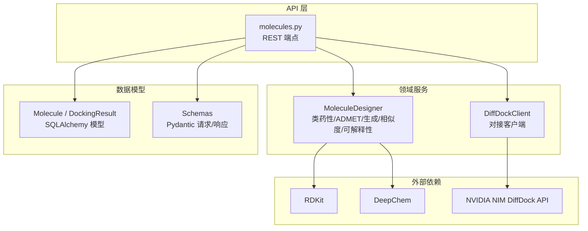
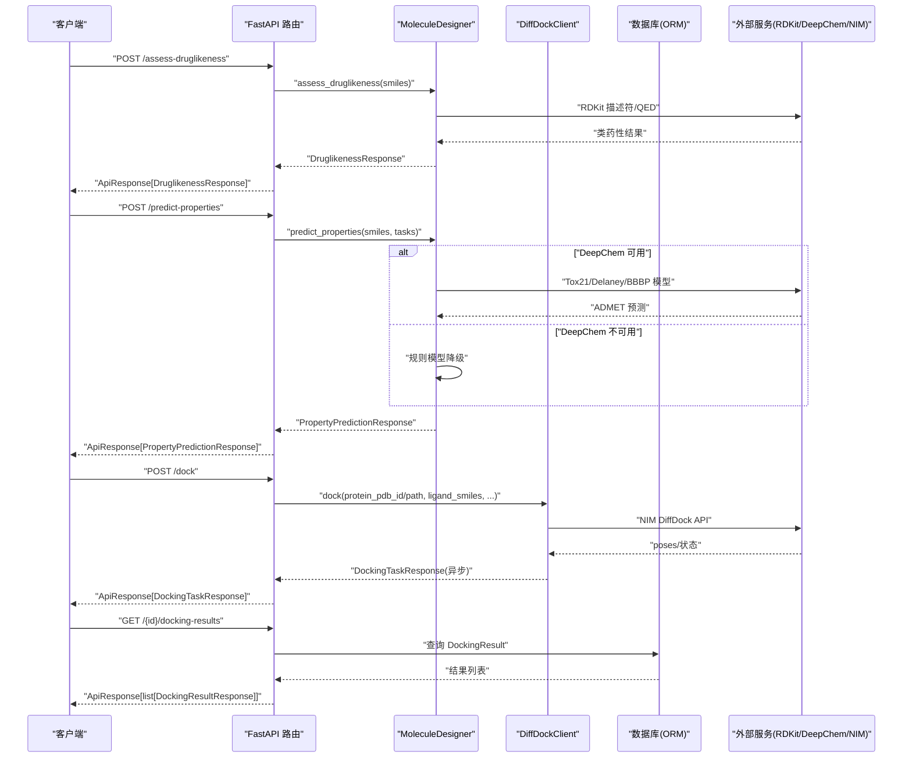
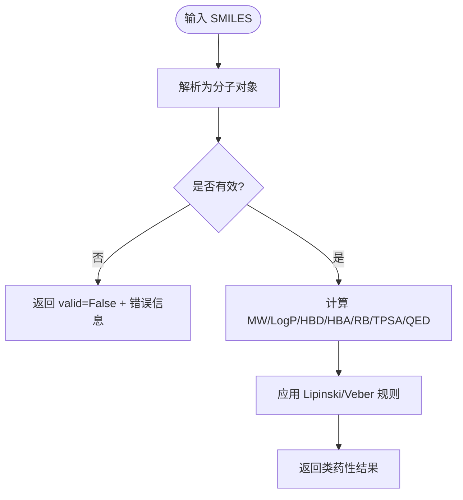
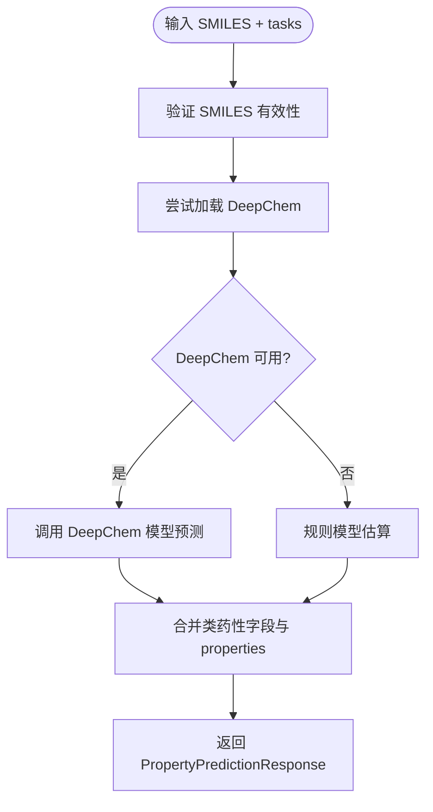
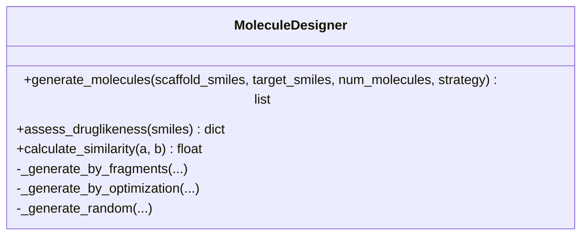
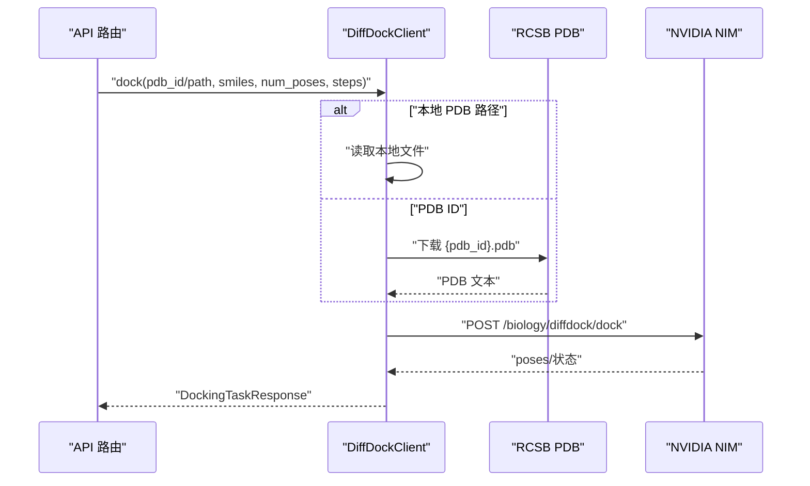
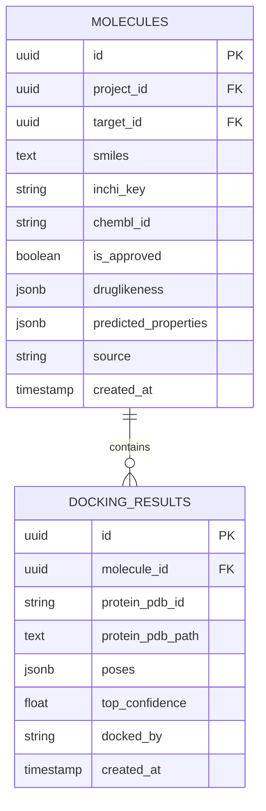
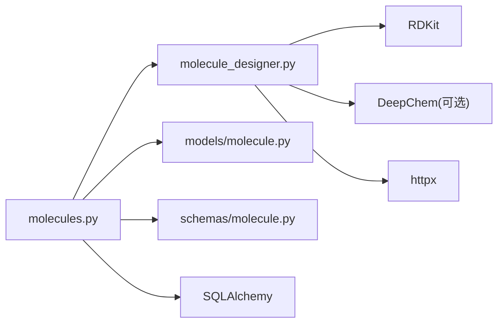
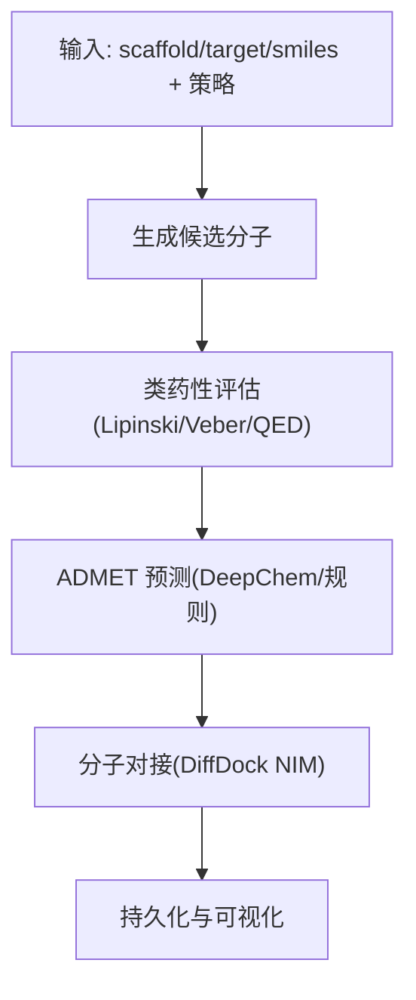

# 分子设计与评估

<cite>
**本文引用的文件**   
- [molecule_designer.py](file://backend/app/services/analyzer/molecule_designer.py)
- [molecules.py](file://backend/app/api/v1/molecules.py)
- [molecule.py](file://backend/app/models/molecule.py)
- [molecule.py](file://backend/app/schemas/molecule.py)
- [03-database.md](file://docs/design/03-database.md)
</cite>

## 目录
1. [引言](#引言)
2. [项目结构](#项目结构)
3. [核心组件](#核心组件)
4. [架构总览](#架构总览)
5. [详细组件分析](#详细组件分析)
6. [依赖关系分析](#依赖关系分析)
7. [性能与可扩展性](#性能与可扩展性)
8. [故障排查指南](#故障排查指南)
9. [结论](#结论)
10. [附录：工作流与配置](#附录工作流与配置)

## 引言
本模块聚焦于“分子设计与评估”，覆盖以下关键能力：
- 分子结构生成（片段组装、相似性优化、随机生成）
- ADMET 性质预测（优先 DeepChem，不可用时降级为规则模型）
- 类药性评估（Lipinski 五规则、Veber 规则、QED）
- 分子对接模拟（DiffDock NIM API，不可用时返回占位结果）
- 可解释性分析（基于规则的 SHAP 风格特征贡献）
- 分子数据库管理（持久化与查询）
- 虚拟筛选与工作流编排（API 层串联各服务）
- 结果可视化（前端页面集成）

该文档从系统架构、数据流、处理逻辑、错误处理、性能特性等维度进行系统化说明，并提供参数配置、性能调优与自定义评估指标的开发指南。

## 项目结构
围绕分子设计与评估的核心代码分布在后端服务的 API 层、领域服务层、数据模型与模式定义中：
- API 路由：提供 RESTful 接口，统一鉴权、分页、异常包装
- 领域服务：封装 RDKit、DeepChem、DiffDock 调用与规则模型
- 数据模型：持久化分子与对接结果
- 模式定义：请求/响应数据结构校验与文档化
- 数据库设计：表结构与索引策略

图表来源
- [molecules.py:1-403](file://backend/app/api/v1/molecules.py#L1-L403)
- [molecule_designer.py:1-689](file://backend/app/services/analyzer/molecule_designer.py#L1-L689)
- [molecule.py:1-61](file://backend/app/models/molecule.py#L1-L61)
- [molecule.py:1-178](file://backend/app/schemas/molecule.py#L1-L178)

章节来源
- [molecules.py:1-403](file://backend/app/api/v1/molecules.py#L1-L403)
- [molecule_designer.py:1-689](file://backend/app/services/analyzer/molecule_designer.py#L1-L689)
- [molecule.py:1-61](file://backend/app/models/molecule.py#L1-L61)
- [molecule.py:1-178](file://backend/app/schemas/molecule.py#L1-L178)

## 核心组件
- MoleculeDesigner：封装 RDKit 与 DeepChem，提供类药性评估、ADMET 预测、分子生成、相似度计算、可解释性分析；支持依赖延迟加载与降级策略。
- DiffDockClient：对接 NVIDIA NIM DiffDock API，自动获取 PDB 或读取本地文件；API 不可用时返回降级占位响应。
- API 路由（molecules.py）：暴露类药性评估、性质预测、分子生成、对接任务提交、结果查询、可解释性分析与模型注册表查询等端点。
- 数据模型（Molecule/DockingResult）：持久化分子信息、类药性与预测性质、对接构象与置信度。
- Schemas：统一的请求/响应结构，便于前端展示与自动化测试。

章节来源
- [molecule_designer.py:1-689](file://backend/app/services/analyzer/molecule_designer.py#L1-L689)
- [molecules.py:1-403](file://backend/app/api/v1/molecules.py#L1-L403)
- [molecule.py:1-61](file://backend/app/models/molecule.py#L1-L61)
- [molecule.py:1-178](file://backend/app/schemas/molecule.py#L1-L178)

## 架构总览
下图展示了从用户请求到最终结果的端到端流程，包括鉴权、参数校验、服务调用、降级策略与结果持久化。

图表来源
- [molecules.py:95-143](file://backend/app/api/v1/molecules.py#L95-L143)
- [molecules.py:219-298](file://backend/app/api/v1/molecules.py#L219-L298)
- [molecules.py:194-216](file://backend/app/api/v1/molecules.py#L194-L216)
- [molecule_designer.py:136-256](file://backend/app/services/analyzer/molecule_designer.py#L136-L256)
- [molecule_designer.py:522-660](file://backend/app/services/analyzer/molecule_designer.py#L522-L660)
- [molecule.py:14-61](file://backend/app/models/molecule.py#L14-L61)

## 详细组件分析

### 类药性评估（Lipinski/Veber/QED）
- 功能要点
  - 解析 SMILES，计算分子量、LogP、氢键供体/受体数、可旋转键数、TPSA
  - Lipinski 五规则判定（MW≤500、LogP≤5、HBD≤5、HBA≤10）
  - Veber 规则（可旋转键≤10、TPSA≤140）
  - QED 药物相似性评分（可选）
- 实现路径
  - API 层直接调用 RDKit 计算并返回结构化响应
  - 领域服务亦提供相同能力，便于内部复用
- 复杂度与性能
  - 单次评估时间主要取决于 RDKit 描述符计算，通常为毫秒级
  - 批量评估建议并行化与缓存无效 SMILES

图表来源
- [molecules.py:47-92](file://backend/app/api/v1/molecules.py#L47-L92)
- [molecule_designer.py:71-134](file://backend/app/services/analyzer/molecule_designer.py#L71-L134)

章节来源
- [molecules.py:47-92](file://backend/app/api/v1/molecules.py#L47-L92)
- [molecule_designer.py:71-134](file://backend/app/services/analyzer/molecule_designer.py#L71-L134)

### ADMET 性质预测（DeepChem 与规则降级）
- 功能要点
  - 支持任务：毒性、溶解度、口服生物利用度、血脑屏障通透性、hERG 毒性风险
  - 优先使用 DeepChem 预训练模型（如 Tox21、Delaney），失败时回退至规则模型
  - 输出包含 model_used 标识实际使用的模型路径
- 实现路径
  - 领域服务惰性加载 DeepChem，捕获导入异常并记录日志
  - 规则模型基于 LogP、TPSA、MW、RB 等特征估算
- 复杂度与性能
  - DeepChem 首次加载可能耗时较长（下载/初始化），后续预测较快
  - 规则模型几乎无额外依赖，适合快速评估

图表来源
- [molecule_designer.py:136-256](file://backend/app/services/analyzer/molecule_designer.py#L136-L256)
- [molecules.py:219-298](file://backend/app/api/v1/molecules.py#L219-L298)

章节来源
- [molecule_designer.py:136-256](file://backend/app/services/analyzer/molecule_designer.py#L136-L256)
- [molecules.py:219-298](file://backend/app/api/v1/molecules.py#L219-L298)

### 分子生成（片段组装/相似性优化/随机）
- 功能要点
  - 三种策略：fragment（骨架+片段）、optimization（参考分子修饰）、random（片段库随机组合）
  - 生成后即时进行类药性过滤，避免无效分子进入下游
- 实现路径
  - 通过 RDKit 构建分子并进行基本合法性检查
  - 简化版拼接与修饰，生产环境应替换为更高级的生成模型（SMILES LSTM/GAN）
- 复杂度与性能
  - 生成数量受 num_molecules 控制，默认上限 100
  - 类药性评估作为内联过滤，整体开销可控

图表来源
- [molecule_designer.py:360-519](file://backend/app/services/analyzer/molecule_designer.py#L360-L519)

章节来源
- [molecule_designer.py:360-519](file://backend/app/services/analyzer/molecule_designer.py#L360-L519)
- [molecules.py:301-354](file://backend/app/api/v1/molecules.py#L301-L354)

### 分子对接（DiffDock NIM API）
- 功能要点
  - 支持通过 PDB ID 自动下载或本地 PDB 文件路径
  - 调用 NVIDIA NIM DiffDock API，返回多构象 poses 及置信度
  - API 不可用时返回降级占位响应，保证流程不中断
- 实现路径
  - API 层创建异步任务并返回 task_id，结果通过 GET 查询
  - 客户端负责获取 PDB 内容并构造请求负载
- 复杂度与性能
  - 网络 I/O 为主，超时设置合理以避免长时间阻塞
  - 降级策略确保可用性

图表来源
- [molecules.py:109-143](file://backend/app/api/v1/molecules.py#L109-L143)
- [molecule_designer.py:522-660](file://backend/app/services/analyzer/molecule_designer.py#L522-L660)

章节来源
- [molecules.py:109-143](file://backend/app/api/v1/molecules.py#L109-L143)
- [molecule_designer.py:522-660](file://backend/app/services/analyzer/molecule_designer.py#L522-L660)

### 可解释性分析（SHAP 风格）
- 功能要点
  - 基于特征的线性贡献估计，输出 base_value 与各特征贡献方向
  - 用于解释类药性或 ADMET 预测的主要影响因素
- 实现路径
  - 领域服务根据 MW、LogP、TPSA、HBD、HBA 计算贡献值
  - API 层将结果封装为 ExplainResponse

章节来源
- [molecule_designer.py:295-331](file://backend/app/services/analyzer/molecule_designer.py#L295-L331)
- [molecules.py:357-390](file://backend/app/api/v1/molecules.py#L357-L390)

### 分子数据库管理与查询
- 功能要点
  - 分子表存储 SMILES、InChIKey、ChEMBL ID、类药性、预测性质、来源等
  - 对接结果表存储蛋白来源、poses、最高置信度、执行器标识
  - 提供分页查询与条件过滤（项目、靶点、是否获批）
- 实现路径
  - SQLAlchemy ORM 模型定义 JSONB 兼容字段
  - API 层使用 select/count 分页查询并转换为 Pydantic 响应

图表来源
- [molecule.py:14-61](file://backend/app/models/molecule.py#L14-L61)
- [03-database.md:114-131](file://docs/design/03-database.md#L114-L131)

章节来源
- [molecule.py:14-61](file://backend/app/models/molecule.py#L14-L61)
- [03-database.md:114-131](file://docs/design/03-database.md#L114-L131)
- [molecules.py:146-191](file://backend/app/api/v1/molecules.py#L146-L191)

## 依赖关系分析
- 直接依赖
  - RDKit：分子解析、描述符计算、指纹与相似度
  - DeepChem：ADMET 预测（可选）
  - httpx：异步 HTTP 客户端（DiffDock/PDB 下载）
  - SQLAlchemy/Pydantic：数据持久化与请求/响应校验
- 间接依赖
  - loguru：结构化日志
  - FastAPI：路由、依赖注入、异常处理
- 潜在循环依赖
  - 当前模块间耦合清晰，未见循环导入
- 外部集成点
  - NVIDIA NIM DiffDock API
  - RCSB PDB 下载

图表来源
- [molecules.py:1-403](file://backend/app/api/v1/molecules.py#L1-L403)
- [molecule_designer.py:1-689](file://backend/app/services/analyzer/molecule_designer.py#L1-L689)
- [molecule.py:1-61](file://backend/app/models/molecule.py#L1-L61)
- [molecule.py:1-178](file://backend/app/schemas/molecule.py#L1-L178)

章节来源
- [molecules.py:1-403](file://backend/app/api/v1/molecules.py#L1-L403)
- [molecule_designer.py:1-689](file://backend/app/services/analyzer/molecule_designer.py#L1-L689)
- [molecule.py:1-61](file://backend/app/models/molecule.py#L1-L61)
- [molecule.py:1-178](file://backend/app/schemas/molecule.py#L1-L178)

## 性能与可扩展性
- 依赖延迟加载
  - RDKit/DeepChem 按需导入，避免启动失败与冷启动开销
- 降级策略
  - DeepChem 不可用时回退规则模型；DiffDock API 不可用时返回占位结果
- 并发与异步
  - DiffDock 调用使用异步客户端，避免阻塞请求线程
- 缓存建议
  - 对频繁计算的描述符与无效 SMILES 做缓存（内存/Redis）
- 批处理
  - 批量生成与预测建议分片并行，结合速率限制与重试机制
- 资源监控
  - 记录模型加载耗时、API 调用耗时与错误率，便于容量规划

## 故障排查指南
- RDKit 未安装
  - 现象：类药性评估抛出运行时异常
  - 处理：安装 rdkit 或使用降级响应（API 层已捕获并返回 degraded 标记）
- DeepChem 未安装或加载失败
  - 现象：ADMET 预测降级为规则模型，日志警告
  - 处理：安装 deepchem 或确认网络可达以下载模型
- DiffDock NIM API 不可用
  - 现象：返回 status=degraded 与占位 poses
  - 处理：检查环境变量 NVIDIA_API_KEY/DIFFDOCK_NIM_URL，或改用本地部署
- PDB 下载失败
  - 现象：无法获取蛋白结构，返回错误
  - 处理：检查网络连接与 PDB ID 正确性，或提供本地 PDB 路径
- 数据库查询异常
  - 现象：分页查询返回空或报错
  - 处理：检查连接串、权限与索引是否存在

章节来源
- [molecules.py:268-298](file://backend/app/api/v1/molecules.py#L268-L298)
- [molecule_designer.py:52-69](file://backend/app/services/analyzer/molecule_designer.py#L52-L69)
- [molecule_designer.py:563-611](file://backend/app/services/analyzer/molecule_designer.py#L563-L611)
- [molecule_designer.py:613-638](file://backend/app/services/analyzer/molecule_designer.py#L613-L638)

## 结论
本模块以清晰的层次划分与稳健的降级策略，实现了从分子生成、类药性评估、ADMET 预测到分子对接的全链路能力。通过 API 层统一封装与数据模型持久化，既保证了易用性，也为后续扩展（引入更先进的生成模型、深度学习预测与可视化）预留了空间。

## 附录：工作流与配置

### 分子设计工作流
- 输入：目标骨架或参考分子、生成策略与数量
- 步骤：
  1) 生成候选分子（片段/优化/随机）
  2) 类药性过滤（Lipinski/Veber/QED）
  3) ADMET 预测（DeepChem 或规则）
  4) 分子对接（DiffDock NIM）
  5) 结果持久化与可视化
- 输出：带评估与对接结果的分子清单

### 参数配置与环境变量
- 对接客户端
  - NVIDIA_API_KEY / NIM_API_KEY：认证密钥
  - DIFFDOCK_NIM_URL：NIM 服务地址
- 其他
  - 日志级别、超时时间、分页大小等可通过配置中心或环境变量管理

### 自定义评估指标开发指南
- 新增属性
  - 在领域服务中添加计算方法（如新规则或模型封装）
  - 在 Schemas 中扩展请求/响应结构
  - 在 API 路由中增加端点或扩展现有端点
- 模型接入
  - 遵循惰性加载与异常捕获模式
  - 提供降级策略与日志记录
- 基准与回归测试
  - 为新增指标编写单元测试与集成测试
  - 建立性能基线，监控回归

章节来源
- [molecule_designer.py:529-541](file://backend/app/services/analyzer/molecule_designer.py#L529-L541)
- [molecule.py:95-148](file://backend/app/schemas/molecule.py#L95-L148)
- [molecules.py:219-298](file://backend/app/api/v1/molecules.py#L219-L298)