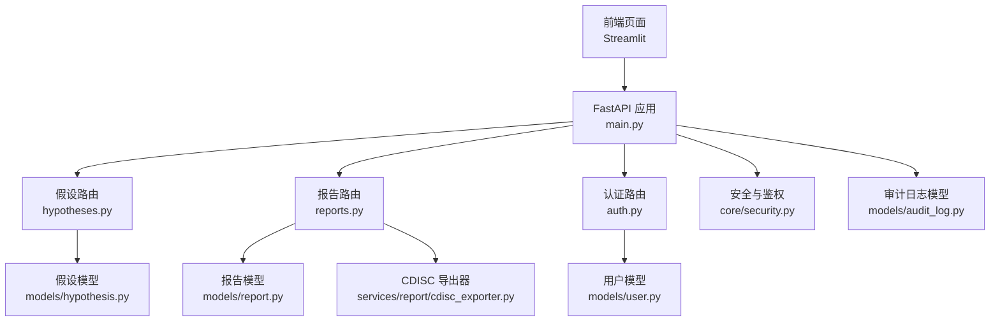
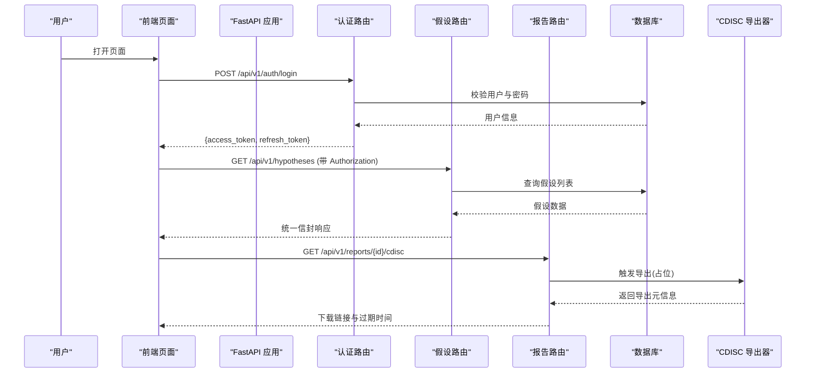
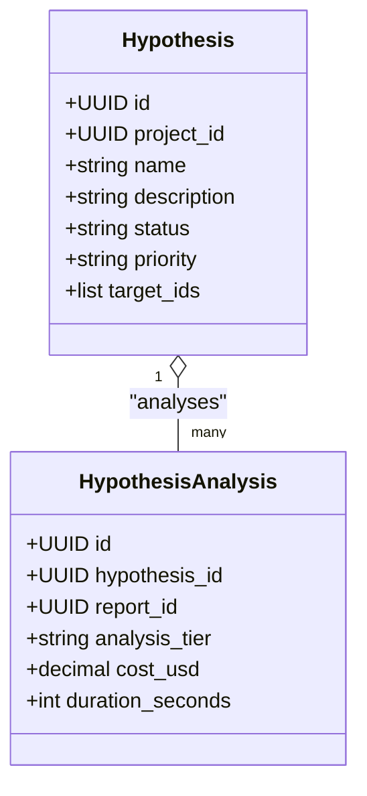
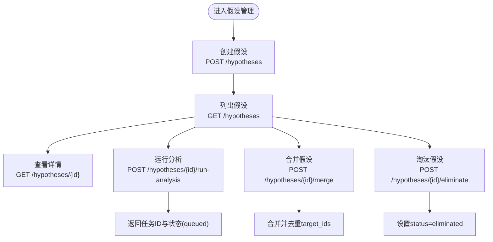
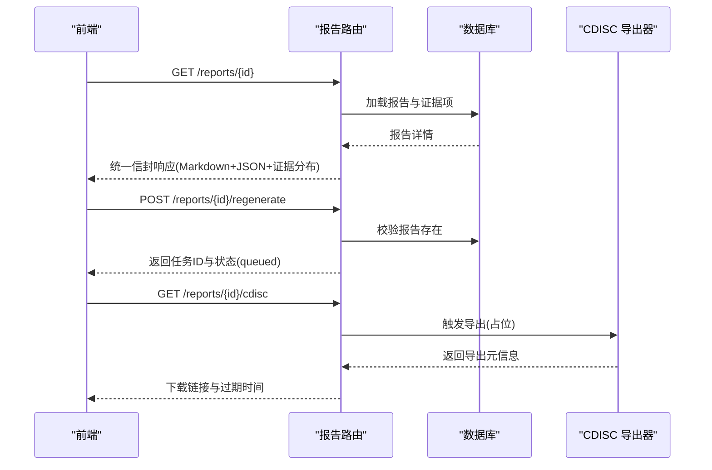
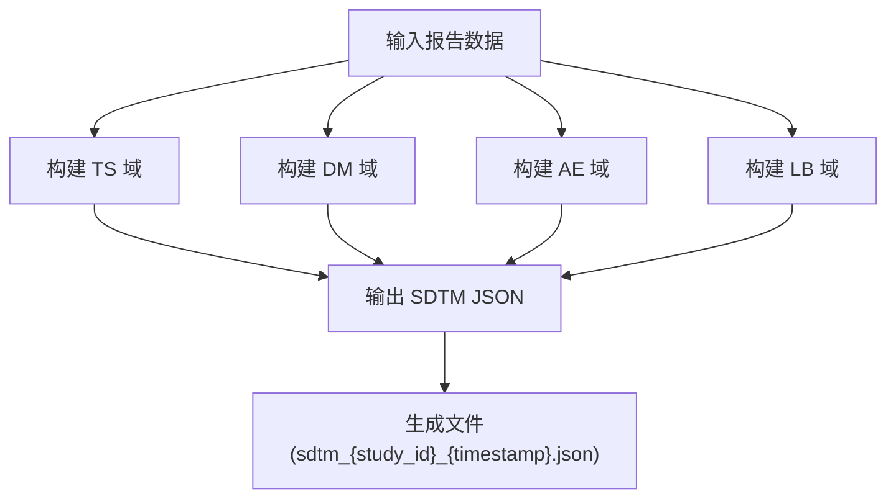
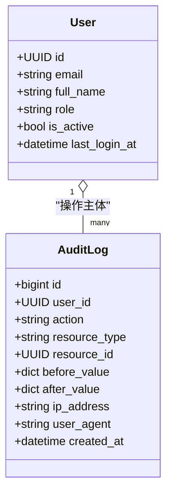
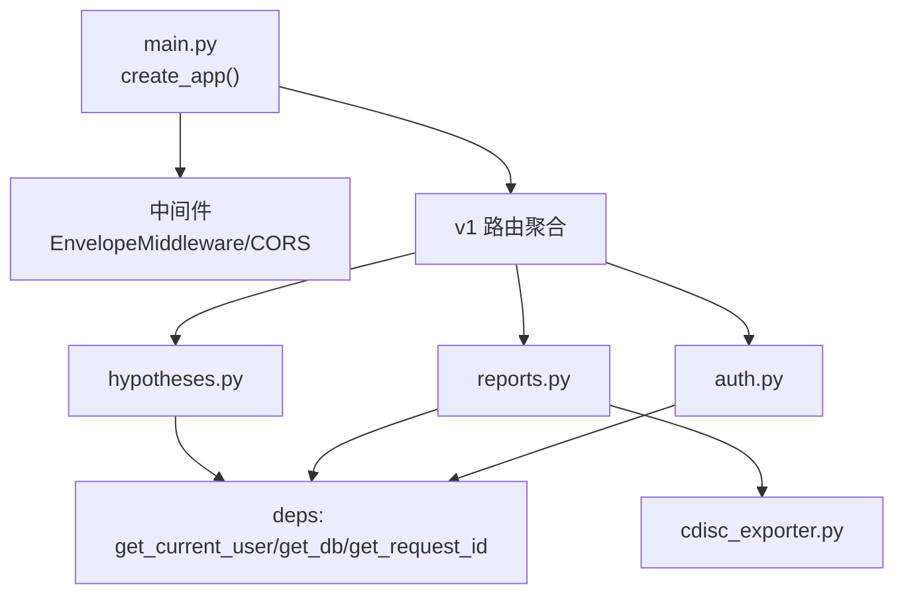

# 协作平台功能

<cite>
**本文引用的文件**
- [backend/app/main.py](file://backend/app/main.py)
- [backend/app/api/v1/hypotheses.py](file://backend/app/api/v1/hypotheses.py)
- [backend/app/api/v1/reports.py](file://backend/app/api/v1/reports.py)
- [backend/app/api/v1/auth.py](file://backend/app/api/v1/auth.py)
- [backend/app/models/hypothesis.py](file://backend/app/models/hypothesis.py)
- [backend/app/models/report.py](file://backend/app/models/report.py)
- [backend/app/models/audit_log.py](file://backend/app/models/audit_log.py)
- [backend/app/models/user.py](file://backend/app/models/user.py)
- [backend/app/services/report/cdisc_exporter.py](file://backend/app/services/report/cdisc_exporter.py)
- [backend/app/core/security.py](file://backend/app/core/security.py)
- [frontend/pages/6_💡_假设管理.py](file://frontend/pages/6_💡_假设管理.py)
- [frontend/pages/5_📊_报告查看.py](file://frontend/pages/5_📊_报告查看.py)
</cite>

## 目录
1. [简介](#简介)
2. [项目结构](#项目结构)
3. [核心组件](#核心组件)
4. [架构总览](#架构总览)
5. [详细组件分析](#详细组件分析)
6. [依赖关系分析](#依赖关系分析)
7. [性能考虑](#性能考虑)
8. [故障排查指南](#故障排查指南)
9. [结论](#结论)
10. [附录](#附录)

## 简介
本文件面向“协作平台”的功能模块，聚焦以下能力：
- 科学假设的创建、评审、验证、归档全生命周期管理
- 标准化报告模板与多格式输出（含 CDISC SDTM 导出）
- 自动化报告生成机制（异步任务占位）
- 团队协作工作流、权限控制与审计追踪
- 数据共享与下载（CDISC ZIP 下载链接占位）

系统采用 FastAPI 后端 + Streamlit 前端的双端架构。后端提供统一信封响应、CORS、请求追踪中间件；前端提供假设管理与报告查看页面，支持登录认证与基本交互。

## 项目结构
- 后端入口与应用装配：FastAPI 应用工厂、全局中间件、路由挂载、异常处理器注册
- API 层：v1 版本下的假设、报告、认证等路由
- 模型层：假设、报告、证据项、用户、审计日志等 ORM 模型
- 服务层：CDISC SDTM 导出器（JSON/XPT 目标）
- 安全与鉴权：JWT、密码哈希、角色守卫
- 前端页面：假设管理、报告查看

图表来源
- [backend/app/main.py:187-248](file://backend/app/main.py#L187-L248)
- [backend/app/api/v1/hypotheses.py:1-273](file://backend/app/api/v1/hypotheses.py#L1-L273)
- [backend/app/api/v1/reports.py:1-181](file://backend/app/api/v1/reports.py#L1-L181)
- [backend/app/api/v1/auth.py:1-147](file://backend/app/api/v1/auth.py#L1-L147)
- [backend/app/models/hypothesis.py:1-66](file://backend/app/models/hypothesis.py#L1-L66)
- [backend/app/models/report.py:1-73](file://backend/app/models/report.py#L1-L73)
- [backend/app/models/user.py:1-36](file://backend/app/models/user.py#L1-L36)
- [backend/app/models/audit_log.py:1-45](file://backend/app/models/audit_log.py#L1-L45)
- [backend/app/services/report/cdisc_exporter.py:1-187](file://backend/app/services/report/cdisc_exporter.py#L1-L187)
- [backend/app/core/security.py:1-211](file://backend/app/core/security.py#L1-L211)

章节来源
- [backend/app/main.py:187-248](file://backend/app/main.py#L187-L248)

## 核心组件
- 假设管理
  - 假设实体与状态机：active/merged/archived/eliminated，优先级 low/normal/high/forced
  - 假设分析记录：关联报告、分析层级、成本与耗时
  - 对比接口：并排比较多个假设的分析结果与靶点集合
- 报告管理
  - 报告实体：包含摘要、Markdown 内容、结构化 JSON、CDISC 路径
  - 证据项：类型与证据等级分布统计
  - 导出：CDISC SDTM JSON 导出（XPT 目标），ZIP 下载链接占位
- 认证与权限
  - JWT access/refresh token、bcrypt 密码哈希
  - 角色守卫 require_roles，用户角色 founder/pi/researcher/doctor/engineer
- 审计追踪
  - 不可变审计日志表，按 action+时间索引，便于合规审计

章节来源
- [backend/app/models/hypothesis.py:1-66](file://backend/app/models/hypothesis.py#L1-L66)
- [backend/app/models/report.py:1-73](file://backend/app/models/report.py#L1-L73)
- [backend/app/models/user.py:1-36](file://backend/app/models/user.py#L1-L36)
- [backend/app/models/audit_log.py:1-45](file://backend/app/models/audit_log.py#L1-L45)
- [backend/app/core/security.py:1-211](file://backend/app/core/security.py#L1-L211)

## 架构总览
系统以 FastAPI 为 API 网关，统一信封响应中间件注入请求 ID 与耗时，CORS 暴露跨域头。业务路由通过依赖注入获取数据库会话与当前用户，调用模型与服务完成业务逻辑。前端通过 HTTP 客户端访问 API，实现假设管理与报告查看。

图表来源
- [backend/app/api/v1/auth.py:70-101](file://backend/app/api/v1/auth.py#L70-L101)
- [backend/app/api/v1/hypotheses.py:62-100](file://backend/app/api/v1/hypotheses.py#L62-L100)
- [backend/app/api/v1/reports.py:123-153](file://backend/app/api/v1/reports.py#L123-L153)
- [backend/app/services/report/cdisc_exporter.py:28-88](file://backend/app/services/report/cdisc_exporter.py#L28-L88)

## 详细组件分析

### 假设管理（创建、评审、验证、归档）
- 生命周期
  - 创建：POST /hypotheses，写入假设与初始 target_ids
  - 列表与筛选：GET /hypotheses，支持 project_id、status 过滤与分页
  - 详情：GET /hypotheses/{id}
  - 运行分析：POST /hypotheses/{id}/run-analysis，返回任务队列状态（异步占位）
  - 合并：POST /hypotheses/{id}/merge，将源假设并入目标假设，去重合并 target_ids
  - 淘汰：POST /hypotheses/{id}/eliminate，标记 eliminated 保留历史
- 数据结构
  - Hypothesis：项目归属、名称、描述、状态、优先级、强制分析标记、target_ids
  - HypothesisAnalysis：关联报告、分析层级、成本与耗时
- 前端交互
  - 假设管理页面支持创建、运行分析、标记验证、淘汰等操作，并提供对比分析界面

图表来源
- [backend/app/models/hypothesis.py:15-66](file://backend/app/models/hypothesis.py#L15-L66)

图表来源
- [backend/app/api/v1/hypotheses.py:39-273](file://backend/app/api/v1/hypotheses.py#L39-L273)

章节来源
- [backend/app/api/v1/hypotheses.py:39-273](file://backend/app/api/v1/hypotheses.py#L39-L273)
- [backend/app/models/hypothesis.py:15-66](file://backend/app/models/hypothesis.py#L15-L66)
- [frontend/pages/6_💡_假设管理.py:29-197](file://frontend/pages/6_💡_假设管理.py#L29-L197)

### 报告生成与标准化模板
- 报告实体
  - TargetReport：项目归属、target_ids、分析层级、LLM 元信息（模型、成本、token）、时长、摘要、Markdown 与结构化 JSON、CDISC 路径
  - EvidenceItem：证据类型与等级、引用信息与载荷
- 报告详情
  - 返回 Markdown 内容与结构化 JSON，同时统计证据等级分布
- 标准化模板
  - 通过 content_md 与 content_json 承载标准模板内容，便于下游消费与展示
- 自动化生成
  - 重新生成接口返回任务队列状态（异步占位），后续可由后台任务执行实际生成流程

图表来源
- [backend/app/api/v1/reports.py:76-181](file://backend/app/api/v1/reports.py#L76-L181)
- [backend/app/services/report/cdisc_exporter.py:28-88](file://backend/app/services/report/cdisc_exporter.py#L28-L88)

章节来源
- [backend/app/models/report.py:15-73](file://backend/app/models/report.py#L15-L73)
- [backend/app/api/v1/reports.py:76-181](file://backend/app/api/v1/reports.py#L76-L181)
- [frontend/pages/5_📊_报告查看.py:60-112](file://frontend/pages/5_📊_报告查看.py#L60-L112)

### CDISC 标准导出与多格式输出
- 导出器职责
  - 构建 SDTM 核心域：TS（试验摘要）、DM（人口学）、AE（不良事件）、LB（实验室检查）
  - 输出 JSON（当前实现），目标支持 XPT（SAS Transport）
- 字段映射
  - TS：研究标题、适应症、分子靶点
  - DM：每个分子作为一条受试者记录
  - AE：基于毒性证据条目
  - LB：基于活性实验数据
- 导出流程
  - 根据报告中的 target、evidence_items、related_molecules 构建数据集
  - 写入指定输出目录，返回导出结果与文件路径

图表来源
- [backend/app/services/report/cdisc_exporter.py:28-187](file://backend/app/services/report/cdisc_exporter.py#L28-L187)

章节来源
- [backend/app/services/report/cdisc_exporter.py:28-187](file://backend/app/services/report/cdisc_exporter.py#L28-L187)

### 团队协作、权限控制与审计追踪
- 协作工作流
  - 假设并行推进：多假设对比、合并与淘汰，支持优先级与强制深度分析
  - 报告共享：详情中包含 Markdown 与结构化 JSON，便于团队审阅与复用
- 权限控制
  - 认证：邮箱密码登录，返回 access/refresh token
  - 授权：require_roles 工厂函数限制特定角色访问
  - 用户角色：founder/pi/researcher/doctor/engineer
- 审计追踪
  - 审计日志表设计为 append-only，按 action+created_at 建立索引，便于合规审计

图表来源
- [backend/app/models/user.py:14-36](file://backend/app/models/user.py#L14-L36)
- [backend/app/models/audit_log.py:15-45](file://backend/app/models/audit_log.py#L15-L45)
- [backend/app/core/security.py:194-211](file://backend/app/core/security.py#L194-L211)

章节来源
- [backend/app/api/v1/auth.py:70-101](file://backend/app/api/v1/auth.py#L70-L101)
- [backend/app/core/security.py:194-211](file://backend/app/core/security.py#L194-L211)
- [backend/app/models/audit_log.py:15-45](file://backend/app/models/audit_log.py#L15-L45)

## 依赖关系分析
- 应用装配
  - 中间件：EnvelopeMiddleware 注入请求 ID、响应时间与信封增强；CORS 暴露跨域头
  - 路由：统一前缀 /api/v1，挂载 v1 子路由
- 依赖注入
  - get_current_user、get_db、get_request_id 等依赖在路由中声明式使用
- 外部集成
  - LLM 成本与 token 统计（报告模型字段）
  - CDISC 导出器（JSON 已实现，XPT 目标）

图表来源
- [backend/app/main.py:187-248](file://backend/app/main.py#L187-L248)
- [backend/app/api/v1/hypotheses.py:1-36](file://backend/app/api/v1/hypotheses.py#L1-L36)
- [backend/app/api/v1/reports.py:1-32](file://backend/app/api/v1/reports.py#L1-L32)
- [backend/app/api/v1/auth.py:1-38](file://backend/app/api/v1/auth.py#L1-L38)
- [backend/app/services/report/cdisc_exporter.py:1-27](file://backend/app/services/report/cdisc_exporter.py#L1-L27)

章节来源
- [backend/app/main.py:187-248](file://backend/app/main.py#L187-L248)

## 性能考虑
- 统一信封中间件对 200 且 application/json 的响应进行 meta.duration_ms 注入，避免额外开销
- 分页查询在列表接口中使用 offset/limit，建议结合索引优化（如 project_id、status、analysis_tier）
- 报告详情使用 selectinload 预加载证据项，减少 N+1 查询
- 导出器写入磁盘时捕获 IO 异常并记录日志，避免阻塞主流程

[本节为通用指导，不直接分析具体文件]

## 故障排查指南
- 认证失败
  - 检查 Authorization header 是否携带有效 access token
  - 确认用户未被禁用且密码正确
- 资源不存在
  - 假设或报告 ID 无效会抛出未找到错误，需核对 ID 与权限
- 导出失败
  - 检查输出目录权限与可用空间
  - 确认报告存在且包含必要字段（target、evidence_items、related_molecules）
- 审计追踪
  - 通过 action 与时间范围检索审计日志，定位变更前后值

章节来源
- [backend/app/api/v1/auth.py:70-101](file://backend/app/api/v1/auth.py#L70-L101)
- [backend/app/api/v1/hypotheses.py:167-182](file://backend/app/api/v1/hypotheses.py#L167-L182)
- [backend/app/api/v1/reports.py:123-153](file://backend/app/api/v1/reports.py#L123-L153)
- [backend/app/models/audit_log.py:15-45](file://backend/app/models/audit_log.py#L15-L45)

## 结论
该协作平台围绕“假设—报告—导出—协作”的主线构建了完整的数据与工作流闭环：
- 假设管理支持并行推进、对比与合并，满足多方案探索需求
- 报告模板标准化，提供 Markdown 与结构化 JSON，便于审阅与二次加工
- CDISC SDTM 导出器已实现 JSON 输出，XPT 目标就绪，配合下载链接形成数据共享链路
- 认证与权限控制完善，审计日志保障可追溯性
- 前端页面提供直观的操作入口，提升团队协作效率

[本节为总结性内容，不直接分析具体文件]

## 附录
- 关键 API 概览
  - 假设
    - POST /api/v1/hypotheses：创建假设
    - GET /api/v1/hypotheses：列表（支持 project_id、status 过滤）
    - GET /api/v1/hypotheses/{id}：详情
    - POST /api/v1/hypotheses/{id}/run-analysis：运行分析（异步占位）
    - POST /api/v1/hypotheses/{id}/merge：合并假设
    - POST /api/v1/hypotheses/{id}/eliminate：淘汰假设
  - 报告
    - GET /api/v1/reports：列表（支持 project_id、analysis_tier 过滤）
    - GET /api/v1/reports/{id}：详情（Markdown+JSON+证据分布）
    - GET /api/v1/reports/{id}/cdisc：CDISC 导出（返回下载链接与过期时间）
    - POST /api/v1/reports/{id}/regenerate：重新生成（异步占位）
  - 认证
    - POST /api/v1/auth/register：注册（首位 founder 开放）
    - POST /api/v1/auth/login：登录
    - POST /api/v1/auth/refresh：刷新 token
    - GET /api/v1/auth/me：当前用户信息

章节来源
- [backend/app/api/v1/hypotheses.py:39-273](file://backend/app/api/v1/hypotheses.py#L39-L273)
- [backend/app/api/v1/reports.py:35-181](file://backend/app/api/v1/reports.py#L35-L181)
- [backend/app/api/v1/auth.py:41-147](file://backend/app/api/v1/auth.py#L41-L147)