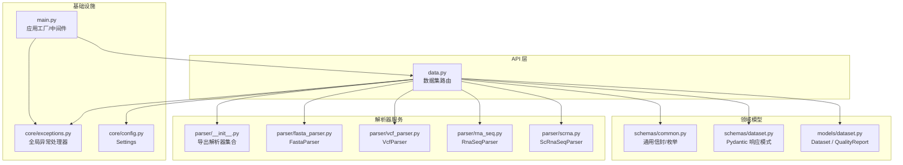
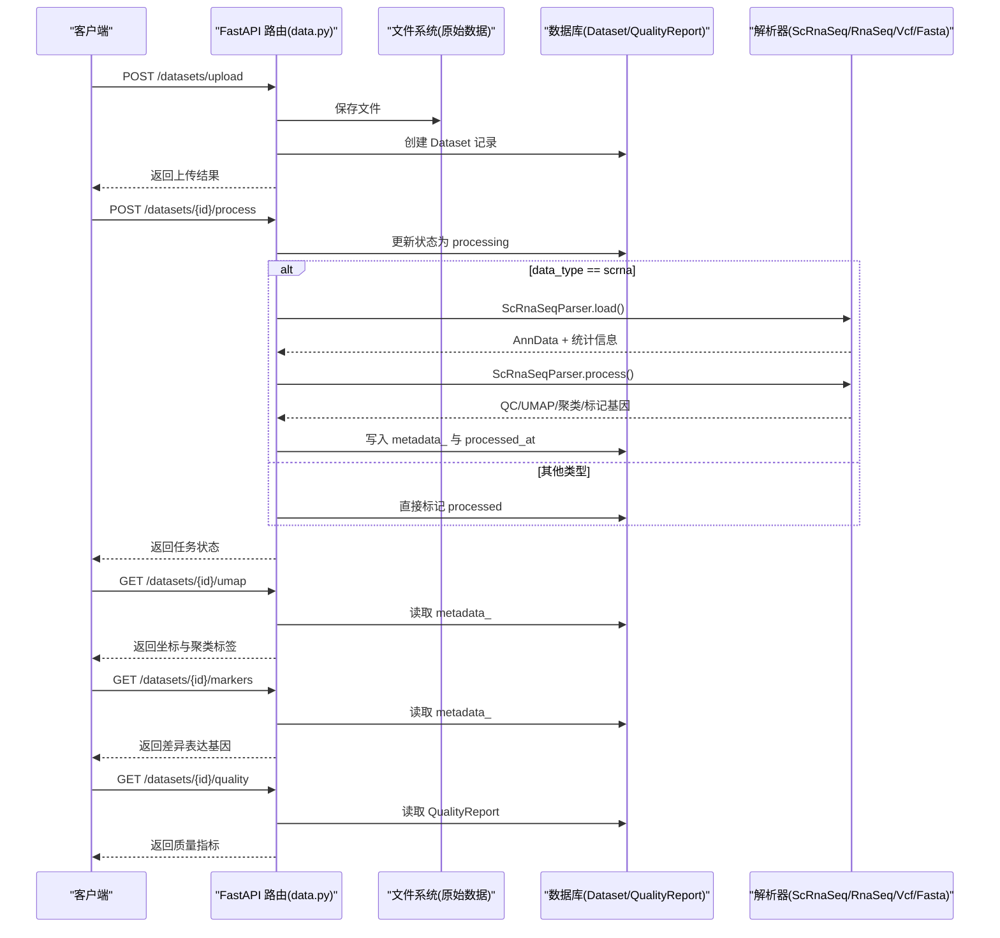
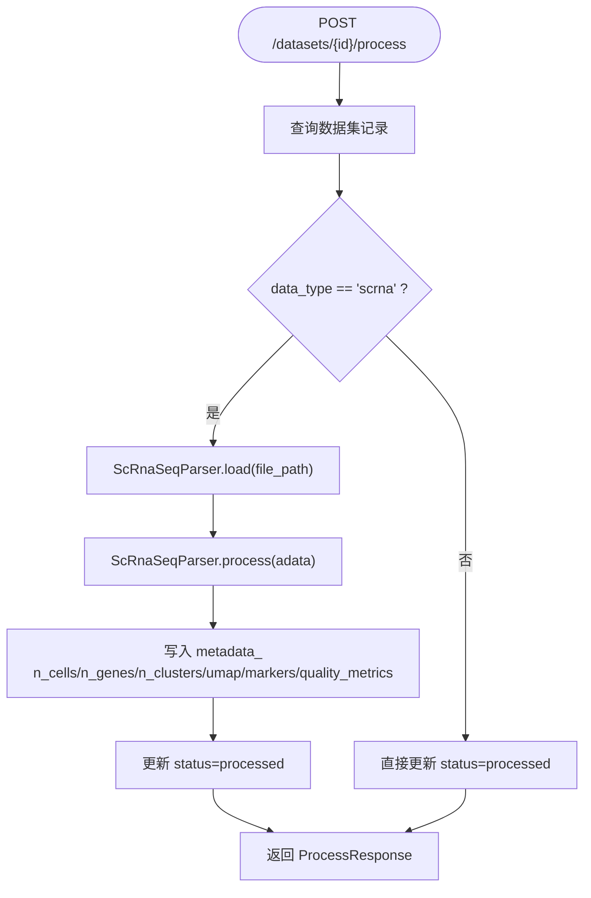
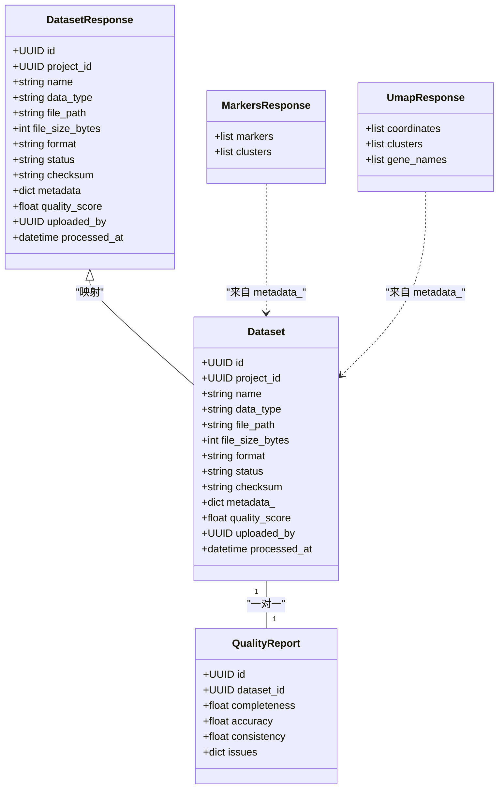
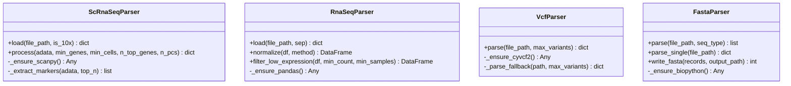
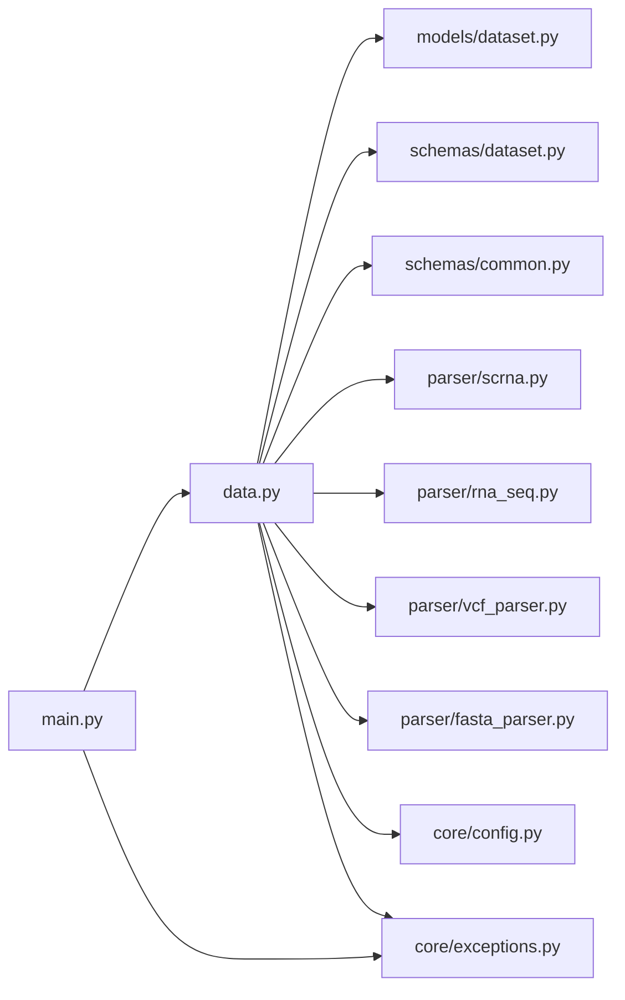

# 数据管理平台

<cite>
**本文引用的文件**   
- [backend/app/api/v1/data.py](file://precision-drug-design/backend/app/api/v1/data.py)
- [backend/app/services/parser/__init__.py](file://precision-drug-design/backend/app/services/parser/__init__.py)
- [backend/app/services/parser/scrna.py](file://precision-drug-design/backend/app/services/parser/scrna.py)
- [backend/app/services/parser/rna_seq.py](file://precision-drug-design/backend/app/services/parser/rna_seq.py)
- [backend/app/services/parser/vcf_parser.py](file://precision-drug-design/backend/app/services/parser/vcf_parser.py)
- [backend/app/services/parser/fasta_parser.py](file://precision-drug-design/backend/app/services/parser/fasta_parser.py)
- [backend/app/models/dataset.py](file://precision-drug-design/backend/app/models/dataset.py)
- [backend/app/schemas/dataset.py](file://precision-drug-design/backend/app/schemas/dataset.py)
- [backend/app/schemas/common.py](file://precision-drug-design/backend/app/schemas/common.py)
- [backend/app/core/config.py](file://precision-drug-design/backend/app/core/config.py)
- [backend/app/core/exceptions.py](file://precision-drug-design/backend/app/core/exceptions.py)
- [backend/app/main.py](file://precision-drug-design/backend/app/main.py)
</cite>

## 目录
1. [简介](#简介)
2. [项目结构](#项目结构)
3. [核心组件](#核心组件)
4. [架构总览](#架构总览)
5. [详细组件分析](#详细组件分析)
6. [依赖关系分析](#依赖关系分析)
7. [性能与可扩展性](#性能与可扩展性)
8. [故障排查指南](#故障排查指南)
9. [结论](#结论)
10. [附录：API 使用指南](#附录api-使用指南)

## 简介
本模块为多组学数据管理平台的数据管理子系统，提供多格式生物医学数据的上传、校验、预处理流水线、质量控制、预览与导出能力。支持 RNA-seq、scRNA-seq、VCF、FASTA 等常见格式，并通过统一 API 暴露数据导入导出、批量处理与进度跟踪能力。系统采用 FastAPI 构建 RESTful 接口，结合 SQLAlchemy ORM 持久化数据集元数据，解析器层封装第三方库（Scanpy、pandas、cyvcf2、BioPython）实现格式解析与基础分析流程。

## 项目结构
数据管理相关代码主要分布在以下位置：
- API 路由：后端 v1 路由中定义数据集上传、列表、详情、处理、UMAP、标记基因、质量报告、删除等端点
- 模型与模式：数据集与质量报告的数据库模型与 Pydantic 响应模式
- 解析器服务：针对 scRNA-seq、RNA-seq、VCF、FASTA 的专用解析器
- 配置与异常：应用配置、全局异常处理器、统一信封中间件

图表来源
- [backend/app/api/v1/data.py:1-369](file://precision-drug-design/backend/app/api/v1/data.py#L1-L369)
- [backend/app/models/dataset.py:1-70](file://precision-drug-design/backend/app/models/dataset.py#L1-L70)
- [backend/app/schemas/dataset.py:1-147](file://precision-drug-design/backend/app/schemas/dataset.py#L1-L147)
- [backend/app/schemas/common.py:1-158](file://precision-drug-design/backend/app/schemas/common.py#L1-L158)
- [backend/app/services/parser/scrna.py:1-160](file://precision-drug-design/backend/app/services/parser/scrna.py#L1-L160)
- [backend/app/services/parser/rna_seq.py:1-106](file://precision-drug-design/backend/app/services/parser/rna_seq.py#L1-L106)
- [backend/app/services/parser/vcf_parser.py:1-136](file://precision-drug-design/backend/app/services/parser/vcf_parser.py#L1-L136)
- [backend/app/services/parser/fasta_parser.py:1-100](file://precision-drug-design/backend/app/services/parser/fasta_parser.py#L1-L100)
- [backend/app/services/parser/__init__.py:1-9](file://precision-drug-design/backend/app/services/parser/__init__.py#L1-L9)
- [backend/app/core/config.py:1-144](file://precision-drug-design/backend/app/core/config.py#L1-L144)
- [backend/app/core/exceptions.py:1-179](file://precision-drug-design/backend/app/core/exceptions.py#L1-L179)
- [backend/app/main.py:1-248](file://precision-drug-design/backend/app/main.py#L1-L248)

章节来源
- [backend/app/api/v1/data.py:1-369](file://precision-drug-design/backend/app/api/v1/data.py#L1-L369)
- [backend/app/models/dataset.py:1-70](file://precision-drug-design/backend/app/models/dataset.py#L1-L70)
- [backend/app/schemas/dataset.py:1-147](file://precision-drug-design/backend/app/schemas/dataset.py#L1-L147)
- [backend/app/schemas/common.py:1-158](file://precision-drug-design/backend/app/schemas/common.py#L1-L158)
- [backend/app/services/parser/__init__.py:1-9](file://precision-drug-design/backend/app/services/parser/__init__.py#L1-L9)
- [backend/app/core/config.py:1-144](file://precision-drug-design/backend/app/core/config.py#L1-L144)
- [backend/app/core/exceptions.py:1-179](file://precision-drug-design/backend/app/core/exceptions.py#L1-L179)
- [backend/app/main.py:1-248](file://precision-drug-design/backend/app/main.py#L1-L248)

## 核心组件
- 数据集 API 路由：负责上传、列表、详情、触发处理、获取 UMAP/标记基因/质量报告、删除等操作
- 数据模型与模式：定义数据集与质量报告的存储结构与 API 响应契约
- 解析器服务：按数据类型加载并执行标准化预处理流程（如 scRNA-seq 的 QC、归一化、降维、聚类、差异表达）
- 配置与异常：集中式环境变量配置、统一错误码与响应信封、请求追踪与耗时注入

章节来源
- [backend/app/api/v1/data.py:1-369](file://precision-drug-design/backend/app/api/v1/data.py#L1-L369)
- [backend/app/models/dataset.py:1-70](file://precision-drug-design/backend/app/models/dataset.py#L1-L70)
- [backend/app/schemas/dataset.py:1-147](file://precision-drug-design/backend/app/schemas/dataset.py#L1-L147)
- [backend/app/schemas/common.py:1-158](file://precision-drug-design/backend/app/schemas/common.py#L1-L158)
- [backend/app/services/parser/scrna.py:1-160](file://precision-drug-design/backend/app/services/parser/scrna.py#L1-L160)
- [backend/app/services/parser/rna_seq.py:1-106](file://precision-drug-design/backend/app/services/parser/rna_seq.py#L1-L106)
- [backend/app/services/parser/vcf_parser.py:1-136](file://precision-drug-design/backend/app/services/parser/vcf_parser.py#L1-L136)
- [backend/app/services/parser/fasta_parser.py:1-100](file://precision-drug-design/backend/app/services/parser/fasta_parser.py#L1-L100)

## 架构总览
数据从客户端通过 HTTP 进入 FastAPI 应用，经统一信封中间件注入请求 ID 与耗时后，路由到数据集 API。上传时写入本地文件系统并落库；处理时根据 data_type 选择对应解析器执行预处理，结果缓存至数据集 metadata_ 字段，供后续 UMAP/标记基因/质量报告查询。

图表来源
- [backend/app/api/v1/data.py:54-121](file://precision-drug-design/backend/app/api/v1/data.py#L54-L121)
- [backend/app/api/v1/data.py:191-254](file://precision-drug-design/backend/app/api/v1/data.py#L191-L254)
- [backend/app/api/v1/data.py:257-306](file://precision-drug-design/backend/app/api/v1/data.py#L257-L306)
- [backend/app/api/v1/data.py:309-340](file://precision-drug-design/backend/app/api/v1/data.py#L309-L340)
- [backend/app/services/parser/scrna.py:38-134](file://precision-drug-design/backend/app/services/parser/scrna.py#L38-L134)

## 详细组件分析

### 数据集 API 路由
- 上传端点：校验 data_type 与扩展名，计算文件大小与 SHA-256 校验和，创建数据库记录并保存文件，返回上传结果
- 列表端点：支持按 project_id、data_type、status 过滤，分页返回
- 详情端点：返回数据集元数据与 metadata_ 映射
- 处理端点：对 scrna 调用 ScRnaSeqParser 进行 QC、归一化、高变基因、PCA/UMAP、Leiden 聚类与标记基因提取，结果缓存至 metadata_；其他类型直接标记已处理
- UMAP/标记基因/质量报告端点：从 metadata_ 或 QualityReport 表读取结果
- 删除端点：物理删除文件并移除数据库记录

图表来源
- [backend/app/api/v1/data.py:191-254](file://precision-drug-design/backend/app/api/v1/data.py#L191-L254)
- [backend/app/services/parser/scrna.py:75-134](file://precision-drug-design/backend/app/services/parser/scrna.py#L75-L134)

章节来源
- [backend/app/api/v1/data.py:54-121](file://precision-drug-design/backend/app/api/v1/data.py#L54-L121)
- [backend/app/api/v1/data.py:124-171](file://precision-drug-design/backend/app/api/v1/data.py#L124-L171)
- [backend/app/api/v1/data.py:174-188](file://precision-drug-design/backend/app/api/v1/data.py#L174-L188)
- [backend/app/api/v1/data.py:191-254](file://precision-drug-design/backend/app/api/v1/data.py#L191-L254)
- [backend/app/api/v1/data.py:257-306](file://precision-drug-design/backend/app/api/v1/data.py#L257-L306)
- [backend/app/api/v1/data.py:309-340](file://precision-drug-design/backend/app/api/v1/data.py#L309-L340)
- [backend/app/api/v1/data.py:343-368](file://precision-drug-design/backend/app/api/v1/data.py#L343-L368)

### 数据模型与模式
- Dataset：包含项目关联、名称、数据类型、文件路径、大小、格式、状态、校验和、metadata_、质量分数、上传者、处理时间等字段
- QualityReport：完整性、准确性、一致性评分与问题项列表
- Pydantic 模式：DatasetResponse、DatasetUploadResponse、ProcessRequest/Response、UmapResponse、MarkersResponse、QualityReportResponse、DatasetQuery 等，统一 camelCase/snake_case 兼容

图表来源
- [backend/app/models/dataset.py:15-70](file://precision-drug-design/backend/app/models/dataset.py#L15-L70)
- [backend/app/schemas/dataset.py:36-147](file://precision-drug-design/backend/app/schemas/dataset.py#L36-L147)

章节来源
- [backend/app/models/dataset.py:1-70](file://precision-drug-design/backend/app/models/dataset.py#L1-L70)
- [backend/app/schemas/dataset.py:1-147](file://precision-drug-design/backend/app/schemas/dataset.py#L1-L147)
- [backend/app/schemas/common.py:1-158](file://precision-drug-design/backend/app/schemas/common.py#L1-L158)

### 解析器服务
- ScRnaSeqParser：基于 Scanpy，支持 10x MTX/HDF5/CSV 加载，执行 QC、归一化、高变基因、PCA/UMAP、Leiden 聚类与标记基因提取，返回预览坐标与聚类标签
- RnaSeqParser：基于 pandas，支持 CSV/TSV/GCT 加载，提供 CPM/TPM 归一化与低表达过滤
- VcfParser：基于 cyvcf2（未安装则降级纯文本解析），提取变异位点、样本信息与统计摘要
- FastaParser：基于 BioPython SeqIO，支持序列解析与 FASTA 写入

图表来源
- [backend/app/services/parser/scrna.py:13-160](file://precision-drug-design/backend/app/services/parser/scrna.py#L13-L160)
- [backend/app/services/parser/rna_seq.py:15-106](file://precision-drug-design/backend/app/services/parser/rna_seq.py#L15-L106)
- [backend/app/services/parser/vcf_parser.py:14-136](file://precision-drug-design/backend/app/services/parser/vcf_parser.py#L14-L136)
- [backend/app/services/parser/fasta_parser.py:12-100](file://precision-drug-design/backend/app/services/parser/fasta_parser.py#L12-L100)

章节来源
- [backend/app/services/parser/scrna.py:1-160](file://precision-drug-design/backend/app/services/parser/scrna.py#L1-L160)
- [backend/app/services/parser/rna_seq.py:1-106](file://precision-drug-design/backend/app/services/parser/rna_seq.py#L1-L106)
- [backend/app/services/parser/vcf_parser.py:1-136](file://precision-drug-design/backend/app/services/parser/vcf_parser.py#L1-L136)
- [backend/app/services/parser/fasta_parser.py:1-100](file://precision-drug-design/backend/app/services/parser/fasta_parser.py#L1-L100)
- [backend/app/services/parser/__init__.py:1-9](file://precision-drug-design/backend/app/services/parser/__init__.py#L1-L9)

### 配置与异常
- Settings：集中式环境变量配置，包括数据目录、扫描作业数、外部知识库 URL、认证、CORS、联邦学习等
- 全局异常处理器：将业务异常转换为统一信封响应，记录日志并附加 request_id
- 统一信封中间件：注入 X-Request-ID、X-Response-Time-ms，计算 duration_ms 并回写响应头

章节来源
- [backend/app/core/config.py:1-144](file://precision-drug-design/backend/app/core/config.py#L1-L144)
- [backend/app/core/exceptions.py:1-179](file://precision-drug-design/backend/app/core/exceptions.py#L1-L179)
- [backend/app/main.py:29-185](file://precision-drug-design/backend/app/main.py#L29-L185)

## 依赖关系分析
- API 路由依赖模型与模式、解析器、配置与异常处理器
- 解析器依赖第三方库（Scanpy、pandas、cyvcf2、BioPython），采用惰性加载避免启动开销
- 配置通过 get_settings 单例注入，确保全局一致
- 异常处理器在应用工厂中注册，保证所有路由共享统一错误响应

图表来源
- [backend/app/api/v1/data.py:1-369](file://precision-drug-design/backend/app/api/v1/data.py#L1-L369)
- [backend/app/models/dataset.py:1-70](file://precision-drug-design/backend/app/models/dataset.py#L1-L70)
- [backend/app/schemas/dataset.py:1-147](file://precision-drug-design/backend/app/schemas/dataset.py#L1-L147)
- [backend/app/schemas/common.py:1-158](file://precision-drug-design/backend/app/schemas/common.py#L1-L158)
- [backend/app/services/parser/scrna.py:1-160](file://precision-drug-design/backend/app/services/parser/scrna.py#L1-L160)
- [backend/app/services/parser/rna_seq.py:1-106](file://precision-drug-design/backend/app/services/parser/rna_seq.py#L1-L106)
- [backend/app/services/parser/vcf_parser.py:1-136](file://precision-drug-design/backend/app/services/parser/vcf_parser.py#L1-L136)
- [backend/app/services/parser/fasta_parser.py:1-100](file://precision-drug-design/backend/app/services/parser/fasta_parser.py#L1-L100)
- [backend/app/core/config.py:1-144](file://precision-drug-design/backend/app/core/config.py#L1-L144)
- [backend/app/core/exceptions.py:1-179](file://precision-drug-design/backend/app/core/exceptions.py#L1-L179)
- [backend/app/main.py:1-248](file://precision-drug-design/backend/app/main.py#L1-L248)

章节来源
- [backend/app/api/v1/data.py:1-369](file://precision-drug-design/backend/app/api/v1/data.py#L1-L369)
- [backend/app/main.py:1-248](file://precision-drug-design/backend/app/main.py#L1-L248)

## 性能与可扩展性
- 惰性加载：解析器按需导入重型依赖（Scanpy、pandas、cyvcf2、BioPython），降低启动时间与内存占用
- 预处理裁剪：scRNA-seq 仅返回前 100 条 UMAP 坐标与聚类用于预览，避免大对象传输
- 异步与队列：当前处理为同步调用，可引入 Celery/Redis 队列实现真正的异步任务与进度跟踪
- 并行度：Settings 提供 scanpy_n_jobs 与 dask 开关，便于在多核环境下加速
- 存储：原始数据保存在 data_raw_dir，未来可迁移至对象存储（S3/MinIO）以支持横向扩展

[本节为通用指导，不直接分析具体文件]

## 故障排查指南
- 上传失败
  - 检查 data_type 是否在允许集合内，扩展名是否受支持
  - 确认 data_raw_dir 存在且可写
  - 查看校验和与文件大小是否匹配
- 处理失败
  - scrna 处理依赖 Scanpy，若未安装会抛出运行时异常；日志会记录警告并降级为“uploaded”
  - 检查输入文件格式（MTX/HDF5/CSV）与路径是否存在
- 解析器缺失依赖
  - VcfParser 未安装 cyvcf2 时会降级为纯文本解析，功能受限
  - FastaParser 需要 BioPython，否则抛出运行时异常
- 统一错误响应
  - 所有业务异常均返回信封格式，包含 code、message、details 与 request_id，便于前端定位问题

章节来源
- [backend/app/api/v1/data.py:72-102](file://precision-drug-design/backend/app/api/v1/data.py#L72-L102)
- [backend/app/api/v1/data.py:216-247](file://precision-drug-design/backend/app/api/v1/data.py#L216-L247)
- [backend/app/services/parser/vcf_parser.py:21-30](file://precision-drug-design/backend/app/services/parser/vcf_parser.py#L21-L30)
- [backend/app/services/parser/fasta_parser.py:19-27](file://precision-drug-design/backend/app/services/parser/fasta_parser.py#L19-L27)
- [backend/app/core/exceptions.py:131-179](file://precision-drug-design/backend/app/core/exceptions.py#L131-L179)

## 结论
数据管理平台模块围绕“上传—验证—预处理—质量—预览/导出”的主线构建了清晰的分层架构。API 路由负责编排与持久化，解析器服务封装复杂生物信息学流程，模型与模式保障数据结构与契约一致性，配置与异常机制提升可观测性与健壮性。建议在后续迭代中引入异步任务队列、完善质量报告生成逻辑、增强进度跟踪与批处理能力，以满足大规模多组学数据处理需求。

[本节为总结，不直接分析具体文件]

## 附录：API 使用指南

### 数据上传
- 方法：POST
- 路径：/api/v1/datasets/upload
- 表单字段：
  - file：二进制文件
  - project_id：UUID
  - name：字符串
  - data_type：枚举值之一（rna_seq、scrna、vcf、fasta、wes、wgs、ihc、proteomics、metabolomics）
  - metadata：可选 JSON 字符串
- 成功响应：返回数据集 id、状态、文件大小与校验和
- 错误：不支持的 data_type 或扩展名将返回 400 校验错误

章节来源
- [backend/app/api/v1/data.py:54-121](file://precision-drug-design/backend/app/api/v1/data.py#L54-L121)
- [backend/app/schemas/common.py:142-148](file://precision-drug-design/backend/app/schemas/common.py#L142-L148)

### 数据集列表
- 方法：GET
- 路径：/api/v1/datasets
- 查询参数：project_id、data_type、status、page、page_size
- 响应：分页数据与元信息（页码、总数、总页数、request_id）

章节来源
- [backend/app/api/v1/data.py:124-171](file://precision-drug-design/backend/app/api/v1/data.py#L124-L171)
- [backend/app/schemas/common.py:35-54](file://precision-drug-design/backend/app/schemas/common.py#L35-L54)

### 数据集详情
- 方法：GET
- 路径：/api/v1/datasets/{dataset_id}
- 响应：数据集元数据与 metadata_ 映射

章节来源
- [backend/app/api/v1/data.py:174-188](file://precision-drug-design/backend/app/api/v1/data.py#L174-L188)

### 触发数据处理
- 方法：POST
- 路径：/api/v1/datasets/{dataset_id}/process
- 请求体：ProcessRequest（pipeline、params）
- 行为：scrna 走 Scanpy 流水线；其他类型直接标记 processed
- 响应：task_id 与状态（completed/failed）

章节来源
- [backend/app/api/v1/data.py:191-254](file://precision-drug-design/backend/app/api/v1/data.py#L191-L254)
- [backend/app/schemas/dataset.py:66-80](file://precision-drug-design/backend/app/schemas/dataset.py#L66-L80)

### 获取 UMAP 坐标与聚类
- 方法：GET
- 路径：/api/v1/datasets/{dataset_id}/umap
- 响应：coordinates、clusters、gene_names（默认空）

章节来源
- [backend/app/api/v1/data.py:257-281](file://precision-drug-design/backend/app/api/v1/data.py#L257-L281)
- [backend/app/schemas/dataset.py:82-88](file://precision-drug-design/backend/app/schemas/dataset.py#L82-88)

### 获取标记基因
- 方法：GET
- 路径：/api/v1/datasets/{dataset_id}/markers
- 响应：markers（含 cluster、logfoldchange、pval_adj、pct_expr）、clusters

章节来源
- [backend/app/api/v1/data.py:284-306](file://precision-drug-design/backend/app/api/v1/data.py#L284-L306)
- [backend/app/schemas/dataset.py:90-105](file://precision-drug-design/backend/app/schemas/dataset.py#L90-105)

### 获取质量报告
- 方法：GET
- 路径：/api/v1/datasets/{dataset_id}/quality
- 响应：completeness、accuracy、consistency、issues

章节来源
- [backend/app/api/v1/data.py:309-340](file://precision-drug-design/backend/app/api/v1/data.py#L309-L340)
- [backend/app/schemas/dataset.py:115-123](file://precision-drug-design/backend/app/schemas/dataset.py#L115-L123)

### 删除数据集
- 方法：DELETE
- 路径：/api/v1/datasets/{dataset_id}
- 行为：删除物理文件与数据库记录

章节来源
- [backend/app/api/v1/data.py:343-368](file://precision-drug-design/backend/app/api/v1/data.py#L343-L368)

### 解析器使用要点
- ScRnaSeqParser
  - load：支持 .h5/.mtx/.csv，返回 AnnData 与基本统计
  - process：QC、归一化、高变基因、PCA/UMAP、Leiden 聚类、标记基因提取
- RnaSeqParser
  - load：支持 CSV/TSV/GCT，自动推断分隔符
  - normalize：CPM/TPM（简化为 CPM）
  - filter_low_expression：按最小计数与样本数过滤
- VcfParser
  - parse：优先 cyvcf2，未安装则纯文本解析，返回变异预览与统计
- FastaParser
  - parse/parse_single：读取序列与注释
  - write_fasta：批量写入标准 FASTA

章节来源
- [backend/app/services/parser/scrna.py:38-134](file://precision-drug-design/backend/app/services/parser/scrna.py#L38-L134)
- [backend/app/services/parser/rna_seq.py:32-106](file://precision-drug-design/backend/app/services/parser/rna_seq.py#L32-L106)
- [backend/app/services/parser/vcf_parser.py:32-135](file://precision-drug-design/backend/app/services/parser/vcf_parser.py#L32-L135)
- [backend/app/services/parser/fasta_parser.py:29-100](file://precision-drug-design/backend/app/services/parser/fasta_parser.py#L29-L100)