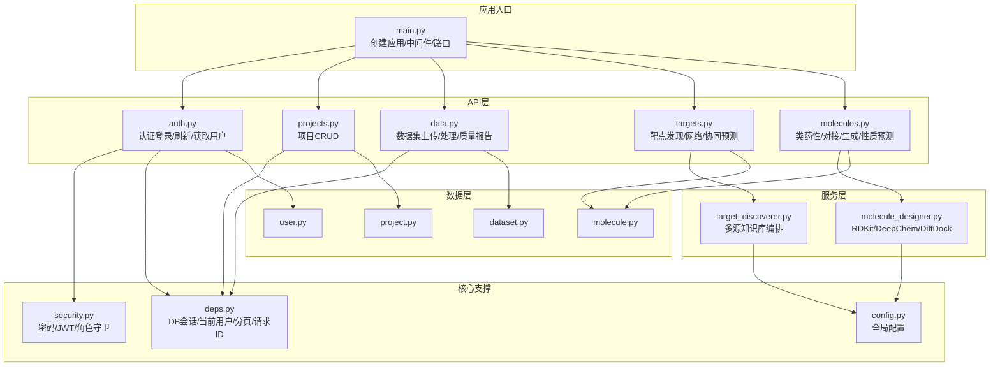
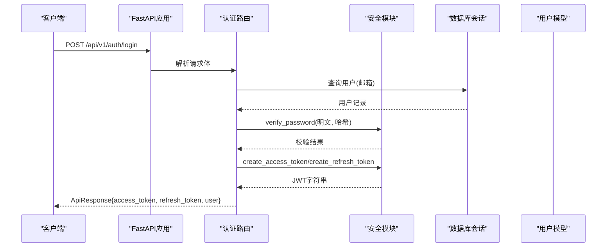
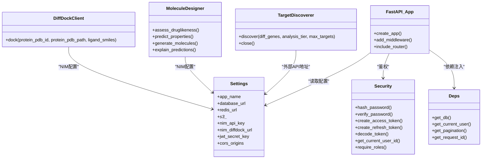

# 核心功能模块

<cite>
**本文引用的文件**   
- [backend/app/main.py](file://backend/app/main.py)
- [backend/app/core/config.py](file://backend/app/core/config.py)
- [backend/app/core/security.py](file://backend/app/core/security.py)
- [backend/app/core/deps.py](file://backend/app/core/deps.py)
- [backend/app/api/v1/auth.py](file://backend/app/api/v1/auth.py)
- [backend/app/models/user.py](file://backend/app/models/user.py)
- [backend/app/models/project.py](file://backend/app/models/project.py)
- [backend/app/api/v1/projects.py](file://backend/app/api/v1/projects.py)
- [backend/app/models/dataset.py](file://backend/app/models/dataset.py)
- [backend/app/api/v1/data.py](file://backend/app/api/v1/data.py)
- [backend/app/services/analyzer/target_discoverer.py](file://backend/app/services/analyzer/target_discoverer.py)
- [backend/app/api/v1/targets.py](file://backend/app/api/v1/targets.py)
- [backend/app/models/molecule.py](file://backend/app/models/molecule.py)
- [backend/app/api/v1/molecules.py](file://backend/app/api/v1/molecules.py)
- [backend/app/services/analyzer/molecule_designer.py](file://backend/app/services/analyzer/molecule_designer.py)
</cite>

## 目录
1. [简介](#简介)
2. [项目结构](#项目结构)
3. [核心组件](#核心组件)
4. [架构总览](#架构总览)
5. [详细组件分析](#详细组件分析)
6. [依赖关系分析](#依赖关系分析)
7. [性能考虑](#性能考虑)
8. [故障排查指南](#故障排查指南)
9. [结论](#结论)
10. [附录](#附录)

## 简介
本文件面向AI药物设计系统的核心功能模块，覆盖用户认证与权限管理、项目管理、数据管理平台、AI靶点发现引擎、分子设计与评估等关键子系统。文档从职责边界、接口设计、业务流程、数据模型、模块间依赖与通信机制、错误处理策略等方面展开，并提供API调用示例、配置选项与性能调优建议，帮助开发者快速上手与扩展。

## 项目结构
系统采用分层架构：
- API层（FastAPI路由）：定义REST端点，负责请求校验、鉴权、编排服务调用、统一响应封装。
- 服务层（services）：业务编排与算法实现，如靶点发现、分子设计、网络建模等。
- 数据层（models + db）：SQLAlchemy ORM模型与数据库会话管理。
- 核心支撑（core）：配置、安全、异常、日志、通用依赖注入。
- 前端（Streamlit页面）：可视化交互入口，通过HTTP调用后端API。

图表来源
- [backend/app/main.py:187-248](file://backend/app/main.py#L187-L248)
- [backend/app/core/config.py:21-144](file://backend/app/core/config.py#L21-L144)
- [backend/app/core/security.py:1-211](file://backend/app/core/security.py#L1-L211)
- [backend/app/core/deps.py:1-129](file://backend/app/core/deps.py#L1-L129)
- [backend/app/api/v1/auth.py:1-147](file://backend/app/api/v1/auth.py#L1-L147)
- [backend/app/api/v1/projects.py:1-169](file://backend/app/api/v1/projects.py#L1-L169)
- [backend/app/api/v1/data.py:1-369](file://backend/app/api/v1/data.py#L1-L369)
- [backend/app/api/v1/targets.py:1-344](file://backend/app/api/v1/targets.py#L1-L344)
- [backend/app/api/v1/molecules.py:1-403](file://backend/app/api/v1/molecules.py#L1-L403)
- [backend/app/services/analyzer/target_discoverer.py:1-176](file://backend/app/services/analyzer/target_discoverer.py#L1-L176)
- [backend/app/services/analyzer/molecule_designer.py:1-689](file://backend/app/services/analyzer/molecule_designer.py#L1-L689)
- [backend/app/models/user.py:1-36](file://backend/app/models/user.py#L1-L36)
- [backend/app/models/project.py:1-42](file://backend/app/models/project.py#L1-L42)
- [backend/app/models/dataset.py:1-70](file://backend/app/models/dataset.py#L1-L70)
- [backend/app/models/molecule.py:1-61](file://backend/app/models/molecule.py#L1-L61)

章节来源
- [backend/app/main.py:187-248](file://backend/app/main.py#L187-L248)
- [backend/app/core/config.py:21-144](file://backend/app/core/config.py#L21-L144)

## 核心组件
- 应用工厂与中间件：统一信封响应、CORS、异常处理器、健康检查与OpenAPI文档挂载。
- 配置中心：基于pydantic-settings的环境变量加载，提供全局单例。
- 安全与鉴权：bcrypt密码哈希、JWT签发与校验、角色守卫、当前用户依赖注入。
- 通用依赖：异步数据库会话、当前用户对象（含短TTL内存缓存）、分页参数、请求追踪ID。
- 领域API：认证、项目、数据、靶点、分子五大模块。
- AI服务：靶点发现编排器、分子设计与评估服务。

章节来源
- [backend/app/main.py:187-248](file://backend/app/main.py#L187-L248)
- [backend/app/core/config.py:21-144](file://backend/app/core/config.py#L21-L144)
- [backend/app/core/security.py:1-211](file://backend/app/core/security.py#L1-L211)
- [backend/app/core/deps.py:1-129](file://backend/app/core/deps.py#L1-L129)

## 架构总览
系统以FastAPI为Web框架，所有请求经统一信封中间件处理，返回{success, data, meta}格式；鉴权通过OAuth2 Bearer Token，结合角色守卫进行访问控制；业务逻辑由服务层编排外部知识库与AI模型；数据持久化使用PostgreSQL，对象存储用于原始数据文件。

图表来源
- [backend/app/api/v1/auth.py:70-101](file://backend/app/api/v1/auth.py#L70-L101)
- [backend/app/core/security.py:96-149](file://backend/app/core/security.py#L96-L149)
- [backend/app/models/user.py:14-36](file://backend/app/models/user.py#L14-L36)

## 详细组件分析

### 用户认证与权限管理
- 职责边界
  - 提供注册、登录、刷新token、获取当前用户信息。
  - 维护用户角色与活跃状态，配合角色守卫实现细粒度授权。
- 接口设计
  - POST /api/v1/auth/register：注册新用户（首位创始人可开放）。
  - POST /api/v1/auth/login：邮箱+密码登录，返回access与refresh token。
  - POST /api/v1/auth/refresh：用refresh token换取新的access token。
  - GET /api/v1/auth/me：返回当前用户信息。
- 业务流程
  - 登录流程：校验邮箱与密码→更新最后登录时间→签发短期access与长期refresh token→返回统一响应。
  - 刷新流程：校验refresh token类型→验证用户存在且活跃→签发新access与refresh token。
  - 当前用户：从Authorization头提取Bearer token→解码payload→校验type=access→返回用户ID或完整User对象。
- 数据模型
  - 用户表包含邮箱、密码哈希、姓名、角色、活跃状态、最后登录时间等字段。
- 错误处理
  - 未找到用户或密码错误：返回未授权错误。
  - 用户被禁用：返回未授权错误。
  - token缺失或类型错误：返回未授权错误。
- 配置与安全
  - JWT密钥、算法、过期时间来自配置中心。
  - bcrypt哈希与恒定时间比较防止时序攻击。
- 扩展指导
  - 新增第三方登录：在认证路由中增加对应端点，复用安全模块的token签发能力。
  - 扩展角色：在角色守卫工厂中允许更多角色组合。

章节来源
- [backend/app/api/v1/auth.py:1-147](file://backend/app/api/v1/auth.py#L1-L147)
- [backend/app/core/security.py:1-211](file://backend/app/core/security.py#L1-L211)
- [backend/app/models/user.py:1-36](file://backend/app/models/user.py#L1-L36)
- [backend/app/core/deps.py:101-124](file://backend/app/core/deps.py#L101-L124)

### 项目管理
- 职责边界
  - 项目的创建、查询、更新、软删除（status='archived'）。
  - 基于角色的访问控制：founder可访问全部，其他仅访问自己拥有的项目。
- 接口设计
  - GET /api/v1/projects：分页列出项目，支持按状态过滤。
  - POST /api/v1/projects：创建新项目。
  - GET /api/v1/projects/{id}：获取项目详情。
  - PATCH /api/v1/projects/{id}：更新项目。
  - DELETE /api/v1/projects/{id}：软删除项目。
- 业务流程
  - 列表：根据当前用户角色决定查询范围→构建count与分页查询→返回PagedResponse。
  - 详情/更新/删除：先校验项目存在与权限→执行操作→返回ApiResponse。
- 数据模型
  - 项目表包含名称、描述、所有者、状态、癌种、患者伪名、JSONB元数据等。
  - 与数据集、假设存在一对多关系。
- 错误处理
  - 不存在：返回未找到错误。
  - 无权访问：返回禁止访问错误。
- 扩展指导
  - 扩展项目生命周期：新增状态值并在列表与详情中适配。
  - 审计日志：在变更处追加审计记录。

章节来源
- [backend/app/api/v1/projects.py:1-169](file://backend/app/api/v1/projects.py#L1-L169)
- [backend/app/models/project.py:1-42](file://backend/app/models/project.py#L1-L42)

### 数据管理平台
- 职责边界
  - 数据集上传、列表、详情、触发处理、UMAP坐标与标志基因查询、质量报告、删除。
  - 支持多种数据类型（rna_seq、scrna、vcf、fasta、wes、wgs、ihc、proteomics、metabolomics）。
- 接口设计
  - POST /api/v1/datasets/upload：上传文件并落盘，计算大小与校验和。
  - GET /api/v1/datasets：分页列表，支持按项目、类型、状态过滤。
  - GET /api/v1/datasets/{id}：详情。
  - POST /api/v1/datasets/{id}/process：触发数据处理（scRNA-seq走Scanpy预处理，其他标记已处理）。
  - GET /api/v1/datasets/{id}/umap：返回UMAP坐标与聚类标签。
  - GET /api/v1/datasets/{id}/markers：返回差异表达基因。
  - GET /api/v1/datasets/{id}/quality：返回质量报告。
  - DELETE /api/v1/datasets/{id}：删除记录与物理文件。
- 业务流程
  - 上传：校验data_type与扩展名→读取内容→写入data_raw_dir/datasets/{project_id}/{id}.{ext}→更新file_path→返回响应。
  - 处理：将状态置processing→若类型为scrna则调用ScRnaSeqParser.load/process→缓存n_cells/n_genes/clusters/umap_coords/marker_genes到metadata_→状态置processed或失败回退。
  - UMAP/Markers：从metadata_读取缓存结果。
- 数据模型
  - 数据集表包含项目关联、名称、类型、路径、大小、格式、状态、校验和、元数据、质量分、上传者、处理时间等。
  - 质量报告表包含完整性、准确性、一致性、问题清单。
- 错误处理
  - 不支持的数据类型或扩展名：返回验证错误。
  - 找不到数据集：返回未找到错误。
  - 处理异常：降级为uploaded并返回失败任务。
- 配置与环境
  - 原始数据目录data_raw_dir由配置中心提供。
- 扩展指导
  - 新增数据类型：在允许的data_type集合与处理分支中添加逻辑。
  - 引入消息队列：将处理流程异步化，提升吞吐。

章节来源
- [backend/app/api/v1/data.py:1-369](file://backend/app/api/v1/data.py#L1-L369)
- [backend/app/models/dataset.py:1-70](file://backend/app/models/dataset.py#L1-L70)
- [backend/app/core/config.py:108-111](file://backend/app/core/config.py#L108-L111)

### AI靶点发现引擎
- 职责边界
  - 接收组学数据（差异基因），整合MyGene、ChEMBL、PubMed、MyVariant等多源知识库，输出候选靶点及证据项。
  - 支持快速筛查（同步）与深度洞察（异步）。
- 接口设计
  - POST /api/v1/targets/discover：触发靶点发现（quick/sync或deep/async）。
  - GET /api/v1/targets：分页列表，支持按项目、证据等级、基因符号过滤。
  - GET /api/v1/targets/{id}：详情（含证据项与相关分子）。
  - POST /api/v1/targets/{id}/force-deep-analysis：创始人强制深度分析（记录原因）。
  - POST /api/v1/targets/network：构建PPI网络与关键节点识别。
  - POST /api/v1/targets/synergy：多靶点组合协同效应预测。
- 业务流程
  - 快速筛查：若无focus_genes则从数据集metadata_读取marker_genes→调用TargetDiscoverer.discover(diff_genes[:50], tier="quick", max_targets=20)→返回候选靶点。
  - 深度洞察：直接返回task_id与预估成本/时长，供后续轮询。
  - 强制深度分析：仅founder可调用，记录forced_analyses历史。
  - 网络与协同：调用NetworkModeler构建网络、识别关键节点与模块、预测协同分数。
- 数据模型
  - 靶点实体包含项目关联、数据集关联、基因符号、Entrez ID、证据等级、置信度、机制、来源、元数据、证据项、相关分子等。
- 错误处理
  - 无差异基因：返回空结果与提示。
  - 服务异常：降级返回空结果与错误说明。
- 扩展指导
  - 接入更多知识库：在TargetDiscoverer中新增客户端与并行检索。
  - 强化异步任务：结合消息队列与任务状态表，完善进度查询。

章节来源
- [backend/app/api/v1/targets.py:1-344](file://backend/app/api/v1/targets.py#L1-L344)
- [backend/app/services/analyzer/target_discoverer.py:1-176](file://backend/app/services/analyzer/target_discoverer.py#L1-L176)

### 分子设计与评估
- 职责边界
  - 类药性评估（Lipinski/Veber/QED）、ADMET性质预测（DeepChem或规则降级）、DiffDock分子对接、生成式分子设计、可解释性分析、模型注册表查询。
- 接口设计
  - POST /api/v1/molecules/assess-druglikeness：类药性评估。
  - POST /api/v1/molecules/dock：提交对接任务（NIM API）。
  - GET /api/v1/molecules：分页列表，支持按项目、靶点、是否获批过滤。
  - GET /api/v1/molecules/{id}/docking-results：查询对接结果。
  - POST /api/v1/molecules/predict-properties：性质预测（优先DeepChem，不可用时降级）。
  - POST /api/v1/molecules/generate：生成式分子设计（fragment/optimization/random）。
  - POST /api/v1/molecules/explain：SHAP风格可解释性分析。
  - GET /api/v1/molecules/models：列出可用模型。
- 业务流程
  - 类药性：解析SMILES→计算MW/LogP/HBD/HBA/Rotatable/TPSA→判定Lipinski/Veber/QED→返回结果。
  - 性质预测：优先DeepChem模型（Tox21/Delaney/BBBP），失败时回退到规则模型（ESOL近似、启发式生物利用度与BBB通透性）。
  - 对接：尝试调用DiffDock NIM API，未配置key或网络异常时返回降级占位响应。
  - 生成：基于片段组装或参考分子相似性优化，返回候选分子与类药性。
  - 可解释性：基于特征贡献给出线性权重与总结。
- 数据模型
  - 分子表包含项目关联、靶点关联、SMILES、InChI Key、ChEMBL ID、是否获批、类药性、预测属性、来源等。
  - 对接结果表包含分子关联、蛋白PDB ID/路径、构象poses、最高置信度、对接工具标识。
- 错误处理
  - RDKit未安装：返回验证错误或降级响应。
  - DeepChem不可用：降级为规则模型并标注model_used。
  - NIM API不可用：返回degraded状态与占位pose。
- 配置与环境
  - NVIDIA NIM API key与base_url可从环境变量或配置中心读取。
- 扩展指导
  - 替换生成模型：将简化版片段组装替换为SMILES LSTM/GAN。
  - 增强对接：集成本地DiffDock或GPU加速推理。

章节来源
- [backend/app/api/v1/molecules.py:1-403](file://backend/app/api/v1/molecules.py#L1-L403)
- [backend/app/services/analyzer/molecule_designer.py:1-689](file://backend/app/services/analyzer/molecule_designer.py#L1-L689)
- [backend/app/models/molecule.py:1-61](file://backend/app/models/molecule.py#L1-L61)

## 依赖关系分析
- 模块耦合
  - API层依赖core（配置、安全、依赖注入）与db（会话、模型）。
  - 服务层依赖外部知识库与AI库（RDKit、DeepChem、httpx），并通过配置中心获取URL与密钥。
- 直接依赖
  - auth → security、deps、models.user。
  - projects → deps、models.project。
  - data → deps、models.dataset、配置中心。
  - targets → services.target_discoverer、models.target。
  - molecules → services.molecule_designer、models.molecule。
- 间接依赖
  - target_discoverer → mygene/myvariant/chembl/pubmed客户端。
  - molecule_designer → rdkit/deepchem/httpx。
- 潜在循环
  - 当前未发现循环导入；服务层与API层解耦良好。
- 外部依赖
  - PostgreSQL、MinIO/S3、NVIDIA NIM、NCBI/EBI公共API。

图表来源
- [backend/app/main.py:187-248](file://backend/app/main.py#L187-L248)
- [backend/app/core/config.py:21-144](file://backend/app/core/config.py#L21-L144)
- [backend/app/core/security.py:1-211](file://backend/app/core/security.py#L1-L211)
- [backend/app/core/deps.py:1-129](file://backend/app/core/deps.py#L1-L129)
- [backend/app/services/analyzer/target_discoverer.py:1-176](file://backend/app/services/analyzer/target_discoverer.py#L1-L176)
- [backend/app/services/analyzer/molecule_designer.py:1-689](file://backend/app/services/analyzer/molecule_designer.py#L1-L689)

章节来源
- [backend/app/core/config.py:21-144](file://backend/app/core/config.py#L21-L144)
- [backend/app/core/security.py:1-211](file://backend/app/core/security.py#L1-L211)
- [backend/app/core/deps.py:1-129](file://backend/app/core/deps.py#L1-L129)

## 性能考虑
- 中间件开销
  - 统一信封中间件会缓冲响应体并注入耗时与请求ID，对大响应有额外CPU与内存开销。建议对流式响应保持透传，避免重写。
- 数据库查询
  - 列表接口使用独立count语句与offset/limit分页，注意大数据量下的分页性能，可考虑游标分页或索引优化。
- 用户缓存
  - 当前用户对象采用短TTL内存缓存，减少频繁查询；需确保缓存失效策略与并发安全。
- 外部API调用
  - 靶点发现与分子对接涉及大量外部HTTP请求，应设置合理超时与重试策略，必要时引入限流与熔断。
- 依赖惰性加载
  - RDKit与DeepChem采用惰性加载，避免启动失败；生产环境建议预加载与预热模型。
- I/O与存储
  - 数据集上传与删除涉及磁盘I/O，建议使用对象存储（S3/MinIO）并启用分片上传与断点续传。

[本节为通用性能建议，不直接分析具体文件]

## 故障排查指南
- 认证失败
  - 检查Authorization头是否正确携带Bearer token。
  - 确认JWT密钥与算法配置一致。
  - 查看用户是否被禁用或token类型是否为access。
- 权限不足
  - 确认当前用户角色是否在required_roles列表中。
  - 项目访问限制：非founder只能访问own项目。
- 数据上传失败
  - 检查data_type与文件扩展名是否在允许集合内。
  - 确认data_raw_dir存在且有写权限。
- 靶点发现异常
  - 确认是否存在差异基因或focus_genes。
  - 检查外部知识库可达性与配额。
- 分子性质预测降级
  - 查看model_used字段与degraded标记，确认RDKit/DeepChem是否安装。
- 对接任务不可用
  - 检查NVIDIA_API_KEY与DIFFDOCK_NIM_URL配置。
  - 查看返回的degraded状态与错误原因。

章节来源
- [backend/app/api/v1/auth.py:70-101](file://backend/app/api/v1/auth.py#L70-L101)
- [backend/app/api/v1/projects.py:32-44](file://backend/app/api/v1/projects.py#L32-L44)
- [backend/app/api/v1/data.py:54-121](file://backend/app/api/v1/data.py#L54-L121)
- [backend/app/api/v1/targets.py:42-130](file://backend/app/api/v1/targets.py#L42-L130)
- [backend/app/api/v1/molecules.py:95-106](file://backend/app/api/v1/molecules.py#L95-L106)
- [backend/app/api/v1/molecules.py:109-143](file://backend/app/api/v1/molecules.py#L109-L143)

## 结论
本系统围绕“数据—知识—模型—决策”的主线，构建了完整的AI药物设计闭环。通过清晰的模块划分、统一的响应封装与完善的鉴权体系，系统在可扩展性与可维护性方面具备良好基础。未来可在异步任务编排、外部服务容错、模型热插拔与监控告警方面持续优化。

[本节为总结性内容，不直接分析具体文件]

## 附录

### API调用示例（路径引用）
- 登录
  - POST /api/v1/auth/login
  - 参考实现路径：[backend/app/api/v1/auth.py:70-101](file://backend/app/api/v1/auth.py#L70-L101)
- 刷新Token
  - POST /api/v1/auth/refresh
  - 参考实现路径：[backend/app/api/v1/auth.py:104-134](file://backend/app/api/v1/auth.py#L104-L134)
- 获取当前用户
  - GET /api/v1/auth/me
  - 参考实现路径：[backend/app/api/v1/auth.py:137-147](file://backend/app/api/v1/auth.py#L137-L147)
- 创建项目
  - POST /api/v1/projects
  - 参考实现路径：[backend/app/api/v1/projects.py:87-110](file://backend/app/api/v1/projects.py#L87-L110)
- 上传数据集
  - POST /api/v1/datasets/upload
  - 参考实现路径：[backend/app/api/v1/data.py:54-121](file://backend/app/api/v1/data.py#L54-L121)
- 触发数据处理
  - POST /api/v1/datasets/{id}/process
  - 参考实现路径：[backend/app/api/v1/data.py:191-254](file://backend/app/api/v1/data.py#L191-L254)
- 靶点发现（快速）
  - POST /api/v1/targets/discover
  - 参考实现路径：[backend/app/api/v1/targets.py:42-130](file://backend/app/api/v1/targets.py#L42-L130)
- 类药性评估
  - POST /api/v1/molecules/assess-druglikeness
  - 参考实现路径：[backend/app/api/v1/molecules.py:95-106](file://backend/app/api/v1/molecules.py#L95-L106)
- 分子对接
  - POST /api/v1/molecules/dock
  - 参考实现路径：[backend/app/api/v1/molecules.py:109-143](file://backend/app/api/v1/molecules.py#L109-L143)
- 性质预测
  - POST /api/v1/molecules/predict-properties
  - 参考实现路径：[backend/app/api/v1/molecules.py:219-298](file://backend/app/api/v1/molecules.py#L219-L298)
- 生成式分子设计
  - POST /api/v1/molecules/generate
  - 参考实现路径：[backend/app/api/v1/molecules.py:301-354](file://backend/app/api/v1/molecules.py#L301-L354)

### 配置选项（节选）
- 应用
  - app_name、app_version、app_env、app_debug、app_host、app_port、app_log_level
- 数据库
  - database_url、database_echo
- Redis
  - redis_url
- 对象存储
  - s3_endpoint、s3_access_key、s3_secret_key、s3_bucket、s3_region
- 向量库
  - chroma_persist_dir
- LLM
  - openai_api_key、anthropic_api_key、llm_default_model、llm_deep_model、llm_max_budget_usd、llm_quick_budget_usd
- NVIDIA NIM
  - nim_api_key、nim_diffdock_url
- 外部知识库
  - mygene_base_url、myvariant_base_url、chembl_base_url、pubmed_base_url、clinical_trials_url
- NCBI
  - ncbi_email
- 认证
  - jwt_secret_key、jwt_algorithm、jwt_access_token_expire_minutes、jwt_refresh_token_expire_days
- CORS
  - cors_origins
- 联邦学习
  - flower_server_address、flower_num_rounds
- PySyft
  - pysyft_domain_port、pysyft_domain_name
- CDISC
  - cdisc_sdtm_output_dir、pinnacle21_jar_path
- 干湿闭环
  - lims_api_url、lims_api_token
- 数据处理
  - scanpy_n_jobs、scanpy_use_dask、dask_dashboard_address
- 数据目录
  - data_raw_dir、data_processed_dir

章节来源
- [backend/app/core/config.py:21-144](file://backend/app/core/config.py#L21-L144)