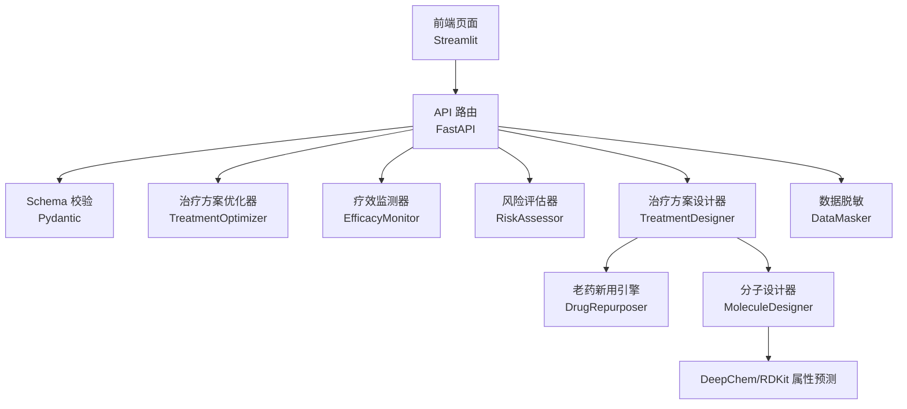
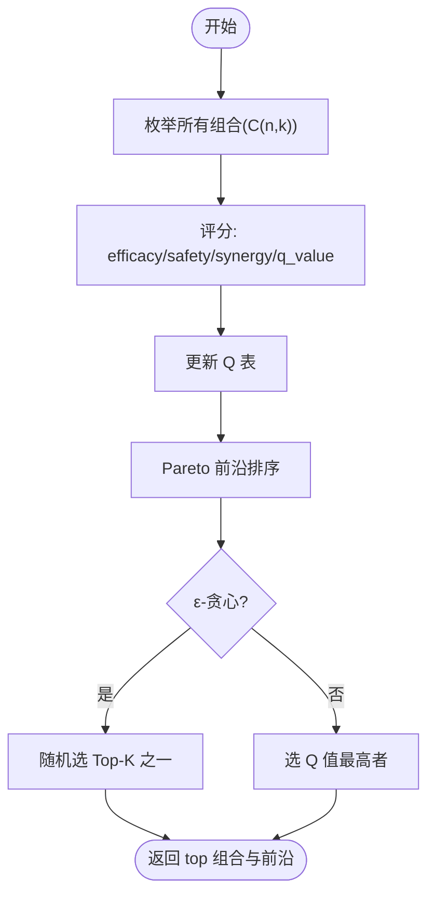
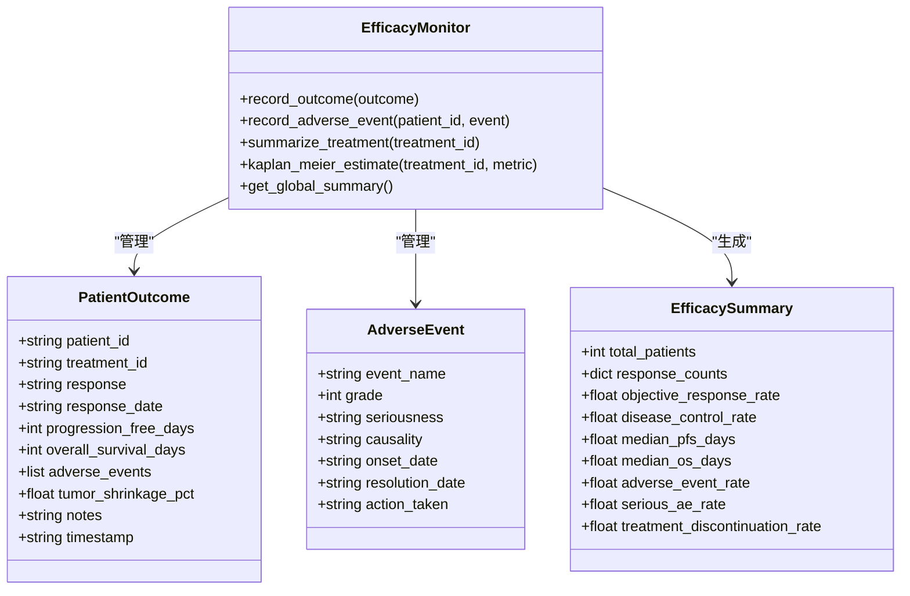
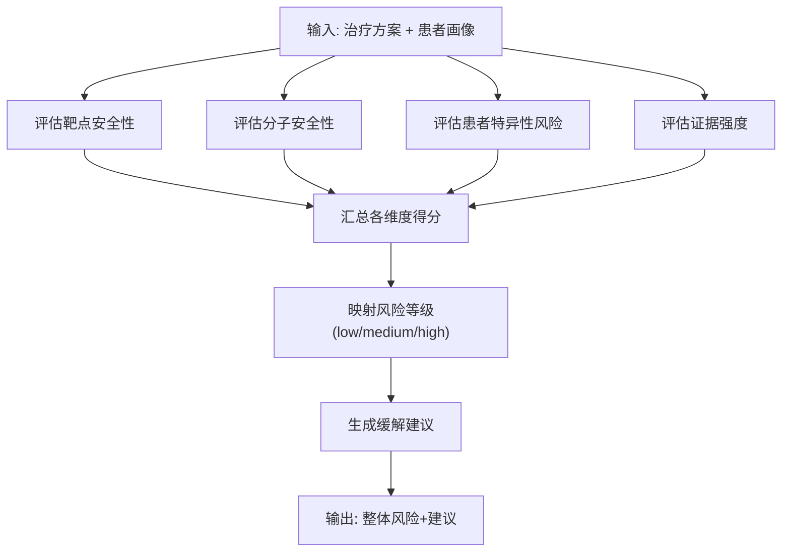
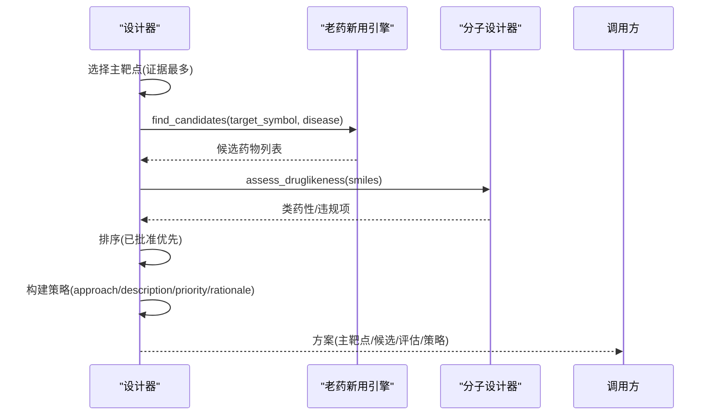
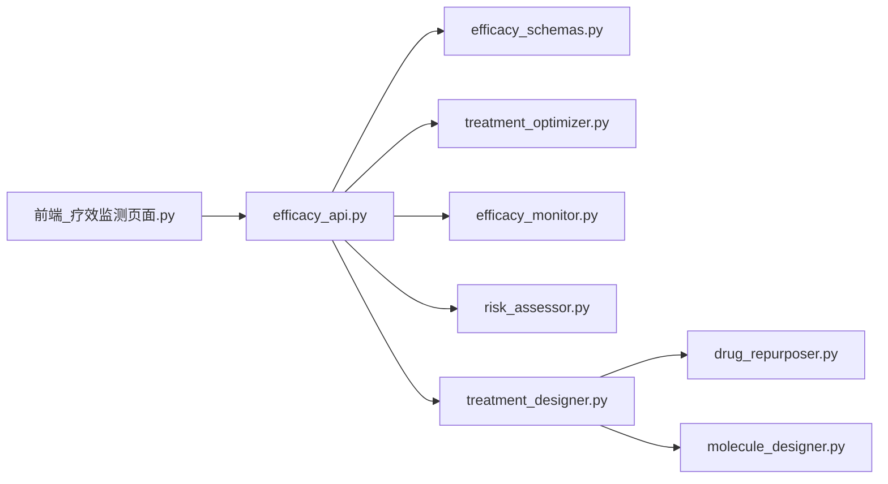

# 治疗方案优化

<cite>
**本文引用的文件**   
- [treatment_designer.py](file://precision-drug-design/backend/app/services/optimizer/treatment_designer.py)
- [treatment_optimizer.py](file://precision-drug-design/backend/app/services/optimizer/treatment_optimizer.py)
- [risk_assessor.py](file://precision-drug-design/backend/app/services/optimizer/risk_assessor.py)
- [efficacy_monitor.py](file://precision-drug-design/backend/app/services/optimizer/efficacy_monitor.py)
- [drug_repurposer.py](file://precision-drug-design/backend/app/services/analyzer/drug_repurposer.py)
- [molecule_designer.py](file://precision-drug-design/backend/app/services/analyzer/molecule_designer.py)
- [efficacy_api.py](file://precision-drug-design/backend/app/api/v1/efficacy.py)
- [efficacy_schemas.py](file://precision-drug-design/backend/app/schemas/efficacy.py)
- [molecules_api.py](file://precision-drug-design/backend/app/api/v1/molecules.py)
- [前端_疗效监测页面.py](file://precision-drug-design/frontend/pages/12_📊_疗效监测.py)
</cite>

## 目录
1. [引言](#引言)
2. [项目结构](#项目结构)
3. [核心组件](#核心组件)
4. [架构总览](#架构总览)
5. [详细组件分析](#详细组件分析)
6. [依赖关系分析](#依赖关系分析)
7. [性能与可扩展性](#性能与可扩展性)
8. [故障排查指南](#故障排查指南)
9. [结论](#结论)
10. [附录：API 与数据模型](#附录api-与数据模型)

## 引言
本模块聚焦“治疗方案优化”，围绕个性化治疗策略设计、老药新用推荐、联合用药优化、疗效监测与动态调整等临床决策支持能力，提供从候选靶点到组合方案生成、风险评估、剂量与不良反应提示、以及基于真实世界数据的疗效追踪与生存分析的完整闭环。系统采用启发式 Q-learning 与 Pareto 前沿选择进行多靶点组合优化，结合分子类药性与 ADMET 预测、老药新用检索、患者特异性风险因素评估，形成可解释、可验证、可迭代的临床辅助决策体系。

## 项目结构
后端服务按“API 层 → Schema 校验 → 业务服务”分层组织；前端通过 Streamlit 页面提供交互界面。关键路径如下：
- API 层：FastAPI 路由暴露疗效监测与治疗方案优化接口
- Schema 层：Pydantic 模型定义请求/响应结构
- 服务层：治疗方案设计器、组合优化器、风险评估器、疗效监测器、老药新用引擎、分子设计与性质预测
- 前端：Streamlit 页面承载录入、汇总、KM 曲线与优化交互



图表来源
- [efficacy_api.py:1-120](file://precision-drug-design/backend/app/api/v1/efficacy.py#L1-L120)
- [efficacy_schemas.py:1-170](file://precision-drug-design/backend/app/schemas/efficacy.py#L1-L170)
- [treatment_optimizer.py:1-120](file://precision-drug-design/backend/app/services/optimizer/treatment_optimizer.py#L1-L120)
- [efficacy_monitor.py:1-120](file://precision-drug-design/backend/app/services/optimizer/efficacy_monitor.py#L1-L120)
- [risk_assessor.py:1-60](file://precision-drug-design/backend/app/services/optimizer/risk_assessor.py#L1-L60)
- [treatment_designer.py:1-60](file://precision-drug-design/backend/app/services/optimizer/treatment_designer.py#L1-L60)
- [drug_repurposer.py:1-60](file://precision-drug-design/backend/app/services/analyzer/drug_repurposer.py#L1-L60)
- [molecule_designer.py:1-80](file://precision-drug-design/backend/app/services/analyzer/molecule_designer.py#L1-L80)

章节来源
- [efficacy_api.py:1-120](file://precision-drug-design/backend/app/api/v1/efficacy.py#L1-L120)
- [efficacy_schemas.py:1-170](file://precision-drug-design/backend/app/schemas/efficacy.py#L1-L170)
- [前端_疗效监测页面.py:1-120](file://precision-drug-design/frontend/pages/12_📊_疗效监测.py#L1-L120)

## 核心组件
- 治疗方案设计器：整合患者画像、候选靶点与已有分子，输出个性化方案（主靶点、老药新用候选、分子评估、策略建议）
- 治疗方案组合优化器：基于 Q-learning 启发式的多靶点组合搜索，Pareto 前沿排序与 ε-贪心探索
- 风险评估器：从靶点安全性、分子类药性、患者特异性、证据强度四个维度综合评分并给出缓解建议
- 疗效监测器：RECIST 1.1 响应录入、CTCAE v5.0 AE 上报、ORR/DCR/PFS/OS 统计、异常结局检测、Kaplan-Meier 估计
- 老药新用引擎：基于 ChEMBL 的靶点匹配与适应症匹配，返回已批准或接近批准的候选药物
- 分子设计器：RDKit 类药性评估、DeepChem 或规则模型 ADMET 预测、相似性计算、生成式分子设计、可解释性分析

章节来源
- [treatment_designer.py:1-146](file://precision-drug-design/backend/app/services/optimizer/treatment_designer.py#L1-L146)
- [treatment_optimizer.py:1-363](file://precision-drug-design/backend/app/services/optimizer/treatment_optimizer.py#L1-L363)
- [risk_assessor.py:1-155](file://precision-drug-design/backend/app/services/optimizer/risk_assessor.py#L1-L155)
- [efficacy_monitor.py:1-407](file://precision-drug-design/backend/app/services/optimizer/efficacy_monitor.py#L1-L407)
- [drug_repurposer.py:1-124](file://precision-drug-design/backend/app/services/analyzer/drug_repurposer.py#L1-L124)
- [molecule_designer.py:1-689](file://precision-drug-design/backend/app/services/analyzer/molecule_designer.py#L1-L689)

## 架构总览
下图展示从用户输入到算法处理再到结果输出的端到端流程，涵盖疗效监测、方案优化、风险评估与老药新用、分子性质预测等关键节点。

```mermaid
sequenceDiagram
participant U as "用户"
participant FE as "前端页面"
participant API as "API 路由"
participant OPT as "组合优化器"
participant MON as "疗效监测器"
participant RISK as "风险评估器"
participant DES as "方案设计器"
participant REP as "老药新用引擎"
participant MOL as "分子设计器"
U->>FE : 配置候选靶点/参数
FE->>API : POST /efficacy/treatment-optimization/optimize
API->>OPT : optimize(candidates, synergy_matrix)
OPT-->>API : pareto_front/top_combination/Q表
API-->>FE : 返回优化结果
U->>FE : 录入患者结局/AE
FE->>API : POST /efficacy/outcomes / adverse-events
API->>MON : record_outcome / record_adverse_event
MON-->>API : 汇总/异常告警
API-->>FE : 返回记录结果
U->>FE : 生成个性化方案
FE->>API : 调用设计方案(示例 : /hypotheses/run-analysis 或内部编排)
API->>DES : design(patient_profile, targets, molecules)
DES->>REP : find_candidates(target_symbol, disease)
DES->>MOL : assess_druglikeness(smiles)
REP-->>DES : 候选药物列表
MOL-->>DES : 类药性/ADMET
DES-->>API : 方案(主靶点/候选/策略/理由)
API->>RISK : assess(treatment, patient_profile)
RISK-->>API : 风险等级与建议
API-->>FE : 返回最终方案与风险提示
```

图表来源
- [efficacy_api.py:229-310](file://precision-drug-design/backend/app/api/v1/efficacy.py#L229-L310)
- [efficacy_monitor.py:123-208](file://precision-drug-design/backend/app/services/optimizer/efficacy_monitor.py#L123-L208)
- [treatment_designer.py:34-101](file://precision-drug-design/backend/app/services/optimizer/treatment_designer.py#L34-L101)
- [drug_repurposer.py:30-94](file://precision-drug-design/backend/app/services/analyzer/drug_repurposer.py#L30-L94)
- [molecule_designer.py:71-134](file://precision-drug-design/backend/app/services/analyzer/molecule_designer.py#L71-L134)
- [risk_assessor.py:18-64](file://precision-drug-design/backend/app/services/optimizer/risk_assessor.py#L18-L64)

## 详细组件分析

### 治疗方案组合优化器（Q-learning + Pareto 前沿）
- 目标：在有效性、安全性、协同效应与复杂度之间权衡，寻找 Pareto 最优前沿，并以 ε-贪心策略避免局部最优
- 关键方法：
  - optimize：枚举组合、评分、更新 Q 表、Pareto 排序、ε-贪心选择
  - _score_combination：有效性=平均证据×可成药性；安全性=平均安全分-复杂度惩罚；协同=矩阵或新颖性互补；Q值加权聚合
  - _pareto_sort：二维非支配解分层排序
  - update_q_value：基于观测奖励更新 Q(s,a)
  - recommend_next_exploration：UCB 启发推荐下一个探索组合



图表来源
- [treatment_optimizer.py:102-165](file://precision-drug-design/backend/app/services/optimizer/treatment_optimizer.py#L102-L165)
- [treatment_optimizer.py:167-230](file://precision-drug-design/backend/app/services/optimizer/treatment_optimizer.py#L167-L230)
- [treatment_optimizer.py:232-266](file://precision-drug-design/backend/app/services/optimizer/treatment_optimizer.py#L232-L266)
- [treatment_optimizer.py:285-309](file://precision-drug-design/backend/app/services/optimizer/treatment_optimizer.py#L285-L309)
- [treatment_optimizer.py:311-362](file://precision-drug-design/backend/app/services/optimizer/treatment_optimizer.py#L311-L362)

章节来源
- [treatment_optimizer.py:1-363](file://precision-drug-design/backend/app/services/optimizer/treatment_optimizer.py#L1-L363)

### 疗效监测器（RECIST/CTCAE/Kaplan-Meier）
- 功能：
  - 患者结局录入：CR/PR/SD/PD/Unknown，自动异常检测（低 ORR、高严重 AE 率、高停药率）
  - 不良事件上报：CTCAE v5.0 分级，≥3 级自动标记为严重
  - 汇总指标：ORR、DCR、中位 PFS/OS、AE 率、严重 AE 率、停药率
  - Kaplan-Meier 估计：PFS/OS 生存曲线与中位生存时间
- 数据结构：PatientOutcome、AdverseEvent、EfficacySummary



图表来源
- [efficacy_monitor.py:35-112](file://precision-drug-design/backend/app/services/optimizer/efficacy_monitor.py#L35-L112)
- [efficacy_monitor.py:114-208](file://precision-drug-design/backend/app/services/optimizer/efficacy_monitor.py#L114-L208)
- [efficacy_monitor.py:210-268](file://precision-drug-design/backend/app/services/optimizer/efficacy_monitor.py#L210-L268)
- [efficacy_monitor.py:339-406](file://precision-drug-design/backend/app/services/optimizer/efficacy_monitor.py#L339-L406)

章节来源
- [efficacy_monitor.py:1-407](file://precision-drug-design/backend/app/services/optimizer/efficacy_monitor.py#L1-L407)

### 风险评估器（多维度风险评分与建议）
- 维度：
  - 靶点安全性：基于证据数量
  - 分子安全性：是否含已批准药物/类药性良好
  - 患者特异性：合并症、合并用药、高龄、肾功能不全
  - 证据强度：高质量证据数量
- 输出：整体风险分数与等级，各维度明细与缓解建议



图表来源
- [risk_assessor.py:18-64](file://precision-drug-design/backend/app/services/optimizer/risk_assessor.py#L18-L64)
- [risk_assessor.py:66-130](file://precision-drug-design/backend/app/services/optimizer/risk_assessor.py#L66-L130)
- [risk_assessor.py:141-155](file://precision-drug-design/backend/app/services/optimizer/risk_assessor.py#L141-L155)

章节来源
- [risk_assessor.py:1-155](file://precision-drug-design/backend/app/services/optimizer/risk_assessor.py#L1-L155)

### 治疗方案设计器（个性化方案生成）
- 输入：患者画像、候选靶点、已有分子
- 流程：
  - 选择主靶点（证据最强）
  - 老药新用候选（ChEMBL 靶点/适应症匹配）
  - 评估现有分子（类药性筛选）
  - 构建策略（优先已批准药物，其次类药性好的新分子，否则探索性发现）
- 输出：主靶点、候选药物、分子评估、策略描述与理由



图表来源
- [treatment_designer.py:34-101](file://precision-drug-design/backend/app/services/optimizer/treatment_designer.py#L34-L101)
- [treatment_designer.py:103-141](file://precision-drug-design/backend/app/services/optimizer/treatment_designer.py#L103-L141)
- [drug_repurposer.py:30-94](file://precision-drug-design/backend/app/services/analyzer/drug_repurposer.py#L30-L94)
- [molecule_designer.py:71-134](file://precision-drug-design/backend/app/services/analyzer/molecule_designer.py#L71-L134)

章节来源
- [treatment_designer.py:1-146](file://precision-drug-design/backend/app/services/optimizer/treatment_designer.py#L1-L146)

### 老药新用引擎（ChEMBL 驱动）
- 策略：
  - 靶点匹配：根据 target_symbol 查询已知药物
  - 适应症匹配：根据 disease 关键词获取已批准药物
  - 去重与排序：按 chembl_id 去重，按 score 降序
- 输出：候选药物（名称、首次获批年份、开发状态、来源、分数）

章节来源
- [drug_repurposer.py:1-124](file://precision-drug-design/backend/app/services/analyzer/drug_repurposer.py#L1-L124)

### 分子设计器（类药性与 ADMET 预测）
- 能力：
  - 类药性评估：Lipinski 五规则、Veber 规则、QED
  - ADMET 预测：DeepChem 预训练模型（不可用时降级为规则模型）
  - 相似性计算：Tanimoto 相似度
  - 生成式分子设计：片段组装/参考优化/随机生成
  - 可解释性：SHAP 风格特征贡献
- 降级策略：DeepChem 未安装时回退至规则模型；RDKit 缺失时返回无效标识

章节来源
- [molecule_designer.py:1-689](file://precision-drug-design/backend/app/services/analyzer/molecule_designer.py#L1-L689)

## 依赖关系分析
- API 层依赖 Schema 校验与服务层实现
- 疗效监测与方案优化共享单例实例（进程内缓存），便于快速演示
- 分子设计与老药新用作为外部工具被设计器调用
- 前端页面通过 HTTP 调用 API，渲染可视化结果



图表来源
- [efficacy_api.py:1-120](file://precision-drug-design/backend/app/api/v1/efficacy.py#L1-L120)
- [efficacy_schemas.py:1-170](file://precision-drug-design/backend/app/schemas/efficacy.py#L1-L170)
- [前端_疗效监测页面.py:1-120](file://precision-drug-design/frontend/pages/12_📊_疗效监测.py#L1-L120)

章节来源
- [efficacy_api.py:1-347](file://precision-drug-design/backend/app/api/v1/efficacy.py#L1-L347)
- [efficacy_schemas.py:1-170](file://precision-drug-design/backend/app/schemas/efficacy.py#L1-L170)
- [前端_疗效监测页面.py:1-583](file://precision-drug-design/frontend/pages/12_📊_疗效监测.py#L1-L583)

## 性能与可扩展性
- 组合优化：C(n,k) 枚举复杂度随候选数增长较快，建议限制 combo_sizes 与 max_results；生产环境可引入采样或 RL 策略网络替代启发式
- 疗效汇总：内存中字典索引，适合中小规模数据；大规模需持久化存储与增量统计
- 分子性质预测：DeepChem 首次加载耗时，应缓存模型与结果；RDKit 操作为 CPU 密集，可考虑异步队列与批处理
- 老药新用：ChEMBL 远程调用可能超时，需重试与熔断机制
- 前端：流式/分页加载大表格与图表，避免阻塞 UI

[本节为通用指导，不直接分析具体文件]

## 故障排查指南
- RDKit/DeepChem 未安装：
  - 现象：类药性评估失败、性质预测降级
  - 处理：安装 rdkit/deepchem，或接受规则模型降级
  - 参考：[molecule_designer.py:34-69](file://precision-drug-design/backend/app/services/analyzer/molecule_designer.py#L34-L69)、[molecules_api.py:268-298](file://precision-drug-design/backend/app/api/v1/molecules.py#L268-L298)
- ChEMBL 查询失败：
  - 现象：老药新用候选为空或分数偏低
  - 处理：检查网络与 API 限流，增加重试与日志
  - 参考：[drug_repurposer.py:48-79](file://precision-drug-design/backend/app/services/analyzer/drug_repurposer.py#L48-L79)
- DiffDock NIM API 不可用：
  - 现象：对接任务返回占位响应
  - 处理：配置 NVIDIA_API_KEY/DIFFDOCK_NIM_URL，或启用本地对接服务
  - 参考：[molecule_designer.py:529-660](file://precision-drug-design/backend/app/services/analyzer/molecule_designer.py#L529-L660)
- 疗效异常告警：
  - 现象：ORR<20%、严重 AE 率>30%、停药率>20%
  - 处理：暂停入组、复核方案安全性与有效性
  - 参考：[efficacy_monitor.py:270-307](file://precision-drug-design/backend/app/services/optimizer/efficacy_monitor.py#L270-L307)

章节来源
- [molecule_designer.py:34-69](file://precision-drug-design/backend/app/services/analyzer/molecule_designer.py#L34-L69)
- [molecules_api.py:268-298](file://precision-drug-design/backend/app/api/v1/molecules.py#L268-L298)
- [drug_repurposer.py:48-79](file://precision-drug-design/backend/app/services/analyzer/drug_repurposer.py#L48-L79)
- [molecule_designer.py:529-660](file://precision-drug-design/backend/app/services/analyzer/molecule_designer.py#L529-L660)
- [efficacy_monitor.py:270-307](file://precision-drug-design/backend/app/services/optimizer/efficacy_monitor.py#L270-L307)

## 结论
本模块以“数据驱动 + 算法优化 + 临床可解释”为核心，构建了从候选靶点到联合用药、从风险评估到疗效追踪的完整闭环。通过 Q-learning 启发式与 Pareto 前沿选择，系统在有限算力下实现了高效的多靶点组合优化；结合老药新用与分子性质预测，显著缩短研发周期；疗效监测与异常告警保障安全性与有效性。后续可在 RL 策略网络、联邦学习、隐私保护与大规模数据工程方面持续演进。

[本节为总结，不直接分析具体文件]

## 附录：API 与数据模型

### 疗效监测与方案优化 API
- 患者结局录入：POST /efficacy/outcomes
- 不良事件上报：POST /efficacy/adverse-events
- 疗效汇总：GET /efficacy/summary?treatment_id=...
- 全局汇总：GET /efficacy/global-summary
- Kaplan-Meier 估计：POST /efficacy/kaplan-meier
- 方案优化：POST /efficacy/treatment-optimization/optimize
- Q 值更新：POST /efficacy/treatment-optimization/q-update
- 数据脱敏：POST /privacy/mask-data

章节来源
- [efficacy_api.py:62-347](file://precision-drug-design/backend/app/api/v1/efficacy.py#L62-L347)

### 分子相关 API
- 类药性评估：POST /molecules/assess-druglikeness
- 分子对接：POST /molecules/dock
- 性质预测：POST /molecules/predict-properties
- 生成式分子设计：POST /molecules/generate
- 可解释性分析：POST /molecules/explain
- 模型注册表：GET /molecules/models

章节来源
- [molecules_api.py:95-403](file://precision-drug-design/backend/app/api/v1/molecules.py#L95-L403)

### 前端交互要点
- 患者结局录入表单：RECIST 1.1 响应、PFS/OS、肿瘤缩小百分比
- 不良事件上报：CTCAE v5.0 等级、因果关系、采取措施
- 疗效汇总：ORR/DCR/中位 PFS/OS、AE 率、严重 AE 率
- KM 曲线：PFS/OS 生存曲线与中位生存时间
- 方案优化：候选靶点配置、权重与 ε-贪心、Pareto 前沿可视化、Q 值更新

章节来源
- [前端_疗效监测页面.py:54-583](file://precision-drug-design/frontend/pages/12_📊_疗效监测.py#L54-L583)