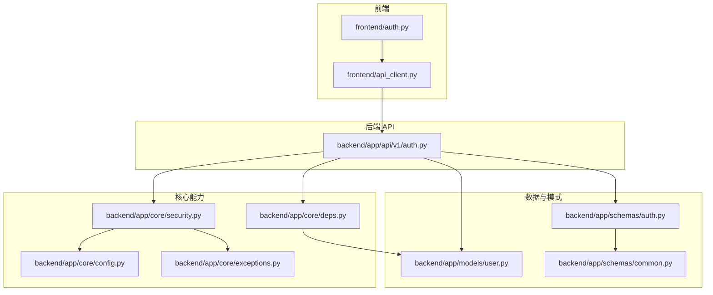
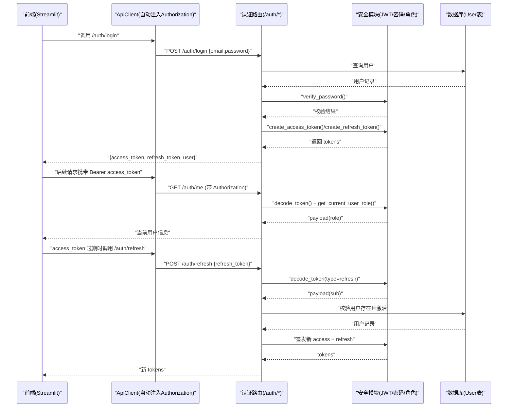
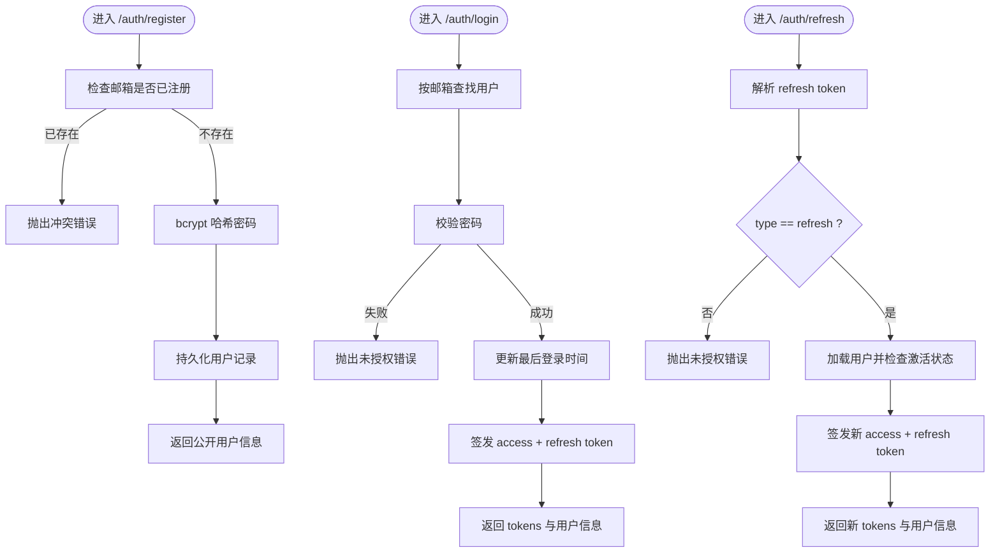
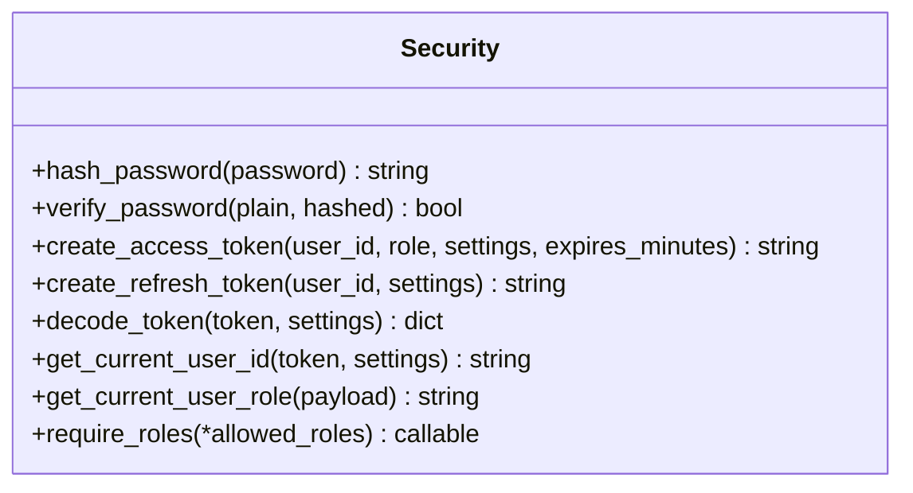
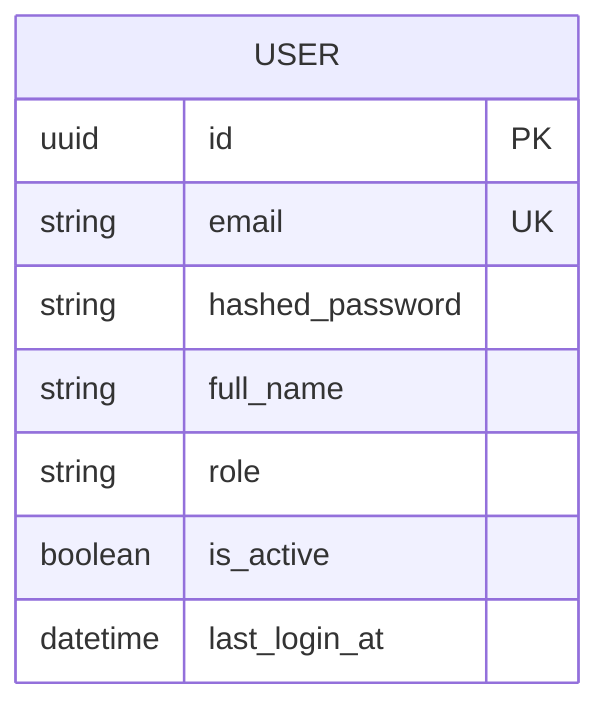
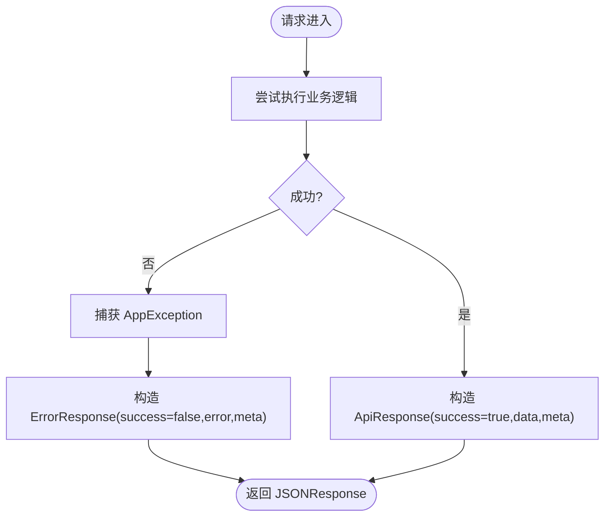
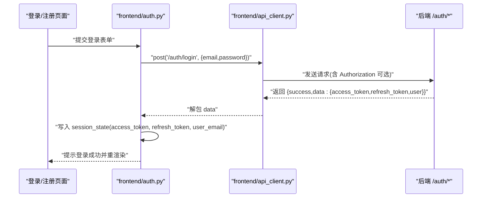
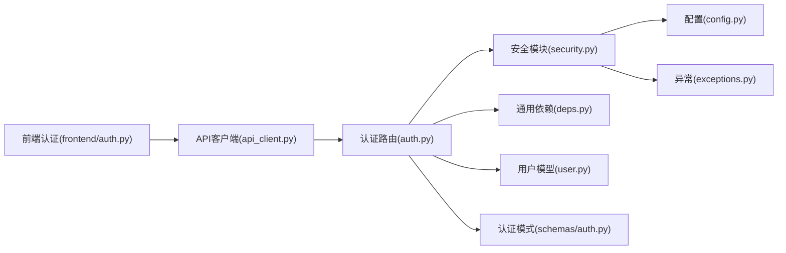

# 用户认证与权限管理

<cite>
**本文引用的文件**   
- [backend/app/api/v1/auth.py](file://backend/app/api/v1/auth.py)
- [backend/app/core/security.py](file://backend/app/core/security.py)
- [backend/app/models/user.py](file://backend/app/models/user.py)
- [backend/app/schemas/auth.py](file://backend/app/schemas/auth.py)
- [backend/app/schemas/common.py](file://backend/app/schemas/common.py)
- [backend/app/core/config.py](file://backend/app/core/config.py)
- [backend/app/core/deps.py](file://backend/app/core/deps.py)
- [backend/app/core/exceptions.py](file://backend/app/core/exceptions.py)
- [frontend/auth.py](file://frontend/auth.py)
- [frontend/api_client.py](file://frontend/api_client.py)
</cite>

## 目录
1. [简介](#简介)
2. [项目结构](#项目结构)
3. [核心组件](#核心组件)
4. [架构总览](#架构总览)
5. [详细组件分析](#详细组件分析)
6. [依赖关系分析](#依赖关系分析)
7. [性能考虑](#性能考虑)
8. [故障排查指南](#故障排查指南)
9. [结论](#结论)
10. [附录：API 参考与安全最佳实践](#附录api-参考与安全最佳实践)

## 简介
本模块提供完整的用户认证与权限管理能力，涵盖以下关键能力：
- JWT 令牌机制（access token、refresh token）的生成、校验与刷新
- 用户角色体系（founder、admin、member、viewer）及基于角色的访问控制（RBAC）
- 密码加密存储（bcrypt）
- 会话管理与前端集成（Streamlit）
- 注册、登录、令牌刷新、获取当前用户等 API
- 中间件鉴权（FastAPI 依赖注入）、统一错误处理与响应信封

## 项目结构
认证与权限相关代码主要分布在后端 core、api、models、schemas 以及前端 auth 与 api_client 中。整体组织遵循分层与职责分离原则：
- API 层：定义认证路由与请求/响应模型
- 安全层：JWT、密码哈希、角色守卫、当前用户解析
- 数据层：用户模型与数据库交互
- 配置层：JWT 密钥、过期时间、算法等
- 异常层：统一错误码与全局处理器
- 前端层：登录/注册 UI、自动注入 Authorization 头、统一解包响应

图表来源
- [backend/app/api/v1/auth.py:1-147](file://backend/app/api/v1/auth.py#L1-L147)
- [backend/app/core/security.py:1-211](file://backend/app/core/security.py#L1-L211)
- [backend/app/core/deps.py:1-129](file://backend/app/core/deps.py#L1-L129)
- [backend/app/core/config.py:1-144](file://backend/app/core/config.py#L1-L144)
- [backend/app/core/exceptions.py:1-179](file://backend/app/core/exceptions.py#L1-L179)
- [backend/app/models/user.py:1-36](file://backend/app/models/user.py#L1-L36)
- [backend/app/schemas/auth.py:1-61](file://backend/app/schemas/auth.py#L1-L61)
- [backend/app/schemas/common.py:1-158](file://backend/app/schemas/common.py#L1-L158)
- [frontend/auth.py:1-137](file://frontend/auth.py#L1-L137)
- [frontend/api_client.py:1-251](file://frontend/api_client.py#L1-L251)

章节来源
- [backend/app/api/v1/auth.py:1-147](file://backend/app/api/v1/auth.py#L1-L147)
- [backend/app/core/security.py:1-211](file://backend/app/core/security.py#L1-L211)
- [backend/app/core/deps.py:1-129](file://backend/app/core/deps.py#L1-L129)
- [backend/app/core/config.py:1-144](file://backend/app/core/config.py#L1-L144)
- [backend/app/core/exceptions.py:1-179](file://backend/app/core/exceptions.py#L1-L179)
- [backend/app/models/user.py:1-36](file://backend/app/models/user.py#L1-L36)
- [backend/app/schemas/auth.py:1-61](file://backend/app/schemas/auth.py#L1-L61)
- [backend/app/schemas/common.py:1-158](file://backend/app/schemas/common.py#L1-L158)
- [frontend/auth.py:1-137](file://frontend/auth.py#L1-L137)
- [frontend/api_client.py:1-251](file://frontend/api_client.py#L1-L251)

## 核心组件
- 认证端点（注册、登录、刷新、当前用户）
- 安全工具（密码哈希、JWT 编解码、当前用户提取、角色守卫）
- 用户模型与角色枚举
- 统一响应信封与错误封装
- 前端认证集成与自动鉴权头注入

章节来源
- [backend/app/api/v1/auth.py:1-147](file://backend/app/api/v1/auth.py#L1-L147)
- [backend/app/core/security.py:1-211](file://backend/app/core/security.py#L1-L211)
- [backend/app/models/user.py:1-36](file://backend/app/models/user.py#L1-L36)
- [backend/app/schemas/auth.py:1-61](file://backend/app/schemas/auth.py#L1-L61)
- [backend/app/schemas/common.py:1-158](file://backend/app/schemas/common.py#L1-L158)
- [frontend/auth.py:1-137](file://frontend/auth.py#L1-L137)
- [frontend/api_client.py:1-251](file://frontend/api_client.py#L1-L251)

## 架构总览
下图展示了从前端到后端的完整认证流程，包括登录、令牌刷新与受保护资源访问。

图表来源
- [backend/app/api/v1/auth.py:70-134](file://backend/app/api/v1/auth.py#L70-L134)
- [backend/app/core/security.py:96-149](file://backend/app/core/security.py#L96-L149)
- [backend/app/core/deps.py:101-124](file://backend/app/core/deps.py#L101-L124)
- [frontend/api_client.py:61-66](file://frontend/api_client.py#L61-L66)

## 详细组件分析

### 认证端点（注册、登录、刷新、当前用户）
- 注册：仅允许 founder 角色创建新用户；检查邮箱唯一性；使用 bcrypt 哈希密码；返回公开用户信息
- 登录：校验邮箱与密码；更新最后登录时间；签发 access 与 refresh token；返回用户信息
- 刷新：校验 refresh token 类型与有效性；验证用户状态；签发新的 access 与 refresh token
- 当前用户：通过依赖注入解析当前用户并返回公开信息

图表来源
- [backend/app/api/v1/auth.py:41-134](file://backend/app/api/v1/auth.py#L41-L134)
- [backend/app/core/security.py:32-58](file://backend/app/core/security.py#L32-L58)
- [backend/app/core/security.py:96-149](file://backend/app/core/security.py#L96-L149)

章节来源
- [backend/app/api/v1/auth.py:41-147](file://backend/app/api/v1/auth.py#L41-L147)

### 安全模块（JWT、密码、角色守卫）
- 密码哈希与校验：使用 bcrypt，恒定时间比较，避免时序攻击
- JWT 编解码：支持 HS256 算法；access token 短期有效，refresh token 长期有效；包含 sub、iat、exp、type、jti 等声明
- 当前用户解析：从 Authorization header 提取 bearer token，校验类型与签名，返回用户 ID
- 角色守卫：工厂函数 require_roles 用于限制特定角色访问

图表来源
- [backend/app/core/security.py:32-211](file://backend/app/core/security.py#L32-L211)

章节来源
- [backend/app/core/security.py:1-211](file://backend/app/core/security.py#L1-L211)

### 用户模型与角色体系
- 用户字段：邮箱（唯一）、哈希密码、姓名、角色、激活状态、最后登录时间
- 角色取值：founder、pi、researcher、doctor、engineer（系统内定义）
- 注意：文档目标中的 admin、member、viewer 不在当前实现的角色集合中，如需扩展需在 schema 与模型处同步调整

图表来源
- [backend/app/models/user.py:14-36](file://backend/app/models/user.py#L14-L36)
- [backend/app/schemas/common.py:132-133](file://backend/app/schemas/common.py#L132-L133)

章节来源
- [backend/app/models/user.py:1-36](file://backend/app/models/user.py#L1-L36)
- [backend/app/schemas/common.py:132-133](file://backend/app/schemas/common.py#L132-L133)

### 统一响应与错误处理
- 成功响应信封：{success, data, meta}
- 错误响应信封：{success: false, error: {code, message, details}, meta}
- 全局异常处理器将业务异常转换为统一信封，并附带 request_id

图表来源
- [backend/app/schemas/common.py:63-88](file://backend/app/schemas/common.py#L63-L88)
- [backend/app/core/exceptions.py:131-179](file://backend/app/core/exceptions.py#L131-L179)

章节来源
- [backend/app/schemas/common.py:1-158](file://backend/app/schemas/common.py#L1-L158)
- [backend/app/core/exceptions.py:1-179](file://backend/app/core/exceptions.py#L1-L179)

### 前端认证集成
- 登录/注册表单：收集邮箱、密码、姓名、角色；调用后端 /auth/login 与 /auth/register
- 会话管理：将 access_token、refresh_token、user_email 存入 session_state
- 自动鉴权头：ApiClient 在 _headers 中自动注入 Authorization: Bearer <token>
- 响应解包：统一解包 {success, data, meta}，失败时抛出运行时错误供 UI 展示

图表来源
- [frontend/auth.py:10-113](file://frontend/auth.py#L10-L113)
- [frontend/api_client.py:61-94](file://frontend/api_client.py#L61-L94)

章节来源
- [frontend/auth.py:1-137](file://frontend/auth.py#L1-L137)
- [frontend/api_client.py:1-251](file://frontend/api_client.py#L1-L251)

## 依赖关系分析
- API 层依赖安全模块进行密码校验与 JWT 操作，依赖 deps 获取当前用户与数据库会话
- 安全模块依赖配置模块读取 JWT 密钥与算法，依赖异常模块抛出标准化错误
- 前端 ApiClient 依赖 Streamlit session_state 维护令牌与会话

图表来源
- [backend/app/api/v1/auth.py:1-147](file://backend/app/api/v1/auth.py#L1-L147)
- [backend/app/core/security.py:1-211](file://backend/app/core/security.py#L1-L211)
- [backend/app/core/deps.py:1-129](file://backend/app/core/deps.py#L1-L129)
- [backend/app/core/config.py:1-144](file://backend/app/core/config.py#L1-L144)
- [backend/app/core/exceptions.py:1-179](file://backend/app/core/exceptions.py#L1-L179)
- [frontend/auth.py:1-137](file://frontend/auth.py#L1-L137)
- [frontend/api_client.py:1-251](file://frontend/api_client.py#L1-L251)

章节来源
- [backend/app/api/v1/auth.py:1-147](file://backend/app/api/v1/auth.py#L1-L147)
- [backend/app/core/security.py:1-211](file://backend/app/core/security.py#L1-L211)
- [backend/app/core/deps.py:1-129](file://backend/app/core/deps.py#L1-L129)
- [backend/app/core/config.py:1-144](file://backend/app/core/config.py#L1-L144)
- [backend/app/core/exceptions.py:1-179](file://backend/app/core/exceptions.py#L1-L179)
- [frontend/auth.py:1-137](file://frontend/auth.py#L1-L137)
- [frontend/api_client.py:1-251](file://frontend/api_client.py#L1-L251)

## 性能考虑
- 用户对象短 TTL 内存缓存：减少频繁的用户查询，TTL 默认较短以避免不一致
- 连接池复用：前端 httpx.Client 使用连接池，降低握手开销
- 响应信封解包在前端集中处理，减少重复逻辑
- 建议：生产环境适当缩短 access token 有效期，结合 refresh token 轮转策略提升安全性

[本节为通用指导，不直接分析具体文件]

## 故障排查指南
- 登录失败
  - 检查邮箱与密码是否正确；确认用户未被禁用
  - 查看后端日志中的“JWT 解析失败”或“未授权”警告
- 令牌无效或过期
  - 使用 /auth/refresh 刷新令牌；确保传入的是 refresh token
  - 检查 jwt_secret_key 与 jwt_algorithm 配置一致性
- 权限不足
  - 确认当前用户角色是否在允许列表中；必要时扩展角色集合
- 注册冲突
  - 邮箱已存在时返回冲突错误；请更换邮箱或先登录修改

章节来源
- [backend/app/core/security.py:125-149](file://backend/app/core/security.py#L125-L149)
- [backend/app/core/exceptions.py:131-179](file://backend/app/core/exceptions.py#L131-L179)
- [backend/app/api/v1/auth.py:41-134](file://backend/app/api/v1/auth.py#L41-L134)

## 结论
该认证与权限模块以 FastAPI 为核心，采用 JWT 无状态鉴权与 bcrypt 密码存储，配合统一响应与错误处理，实现了清晰的注册、登录、刷新与鉴权流程。前端通过 ApiClient 自动注入 Authorization 头并统一解包响应，提升了开发效率与可维护性。建议在部署时严格配置 JWT 密钥与过期策略，并结合角色守卫实现细粒度权限控制。

[本节为总结，不直接分析具体文件]

## 附录：API 参考与安全最佳实践

### API 参考
- POST /api/v1/auth/register
  - 功能：注册用户（需具备 founder 角色）
  - 请求体：email、password、full_name、role
  - 响应：ApiResponse<UserPublic>
- POST /api/v1/auth/login
  - 功能：登录获取 access 与 refresh token
  - 请求体：email、password
  - 响应：ApiResponse<TokenResponse>
- POST /api/v1/auth/refresh
  - 功能：使用 refresh token 换取新的 access 与 refresh token
  - 请求体：refresh_token
  - 响应：ApiResponse<TokenResponse>
- GET /api/v1/auth/me
  - 功能：获取当前用户信息（需携带有效的 access token）
  - 响应：ApiResponse<UserPublic>

章节来源
- [backend/app/api/v1/auth.py:41-147](file://backend/app/api/v1/auth.py#L41-L147)
- [backend/app/schemas/auth.py:13-61](file://backend/app/schemas/auth.py#L13-L61)
- [backend/app/schemas/common.py:63-88](file://backend/app/schemas/common.py#L63-L88)

### 配置选项（JWT 相关）
- jwt_secret_key：JWT 签名密钥（必须强随机）
- jwt_algorithm：算法（如 HS256）
- jwt_access_token_expire_minutes：access token 有效期（分钟）
- jwt_refresh_token_expire_days：refresh token 有效期（天）

章节来源
- [backend/app/core/config.py:78-82](file://backend/app/core/config.py#L78-L82)

### 安全最佳实践
- 使用强随机密钥与合适的算法（HS256），定期轮换密钥
- 设置较短的 access token 有效期，结合 refresh token 轮转
- 对敏感接口启用 require_roles 守卫，最小权限原则
- 在生产环境关闭调试模式，限制 CORS 源
- 前端仅在 HTTPS 下传输令牌，避免本地明文持久化

章节来源
- [backend/app/core/security.py:96-149](file://backend/app/core/security.py#L96-L149)
- [backend/app/core/config.py:78-82](file://backend/app/core/config.py#L78-L82)
- [backend/app/core/config.py:84-86](file://backend/app/core/config.py#L84-L86)