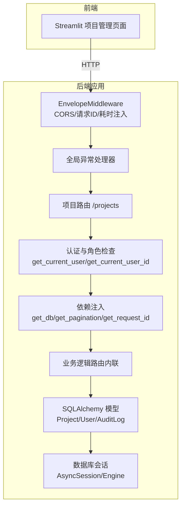
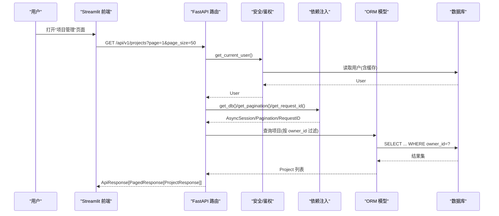
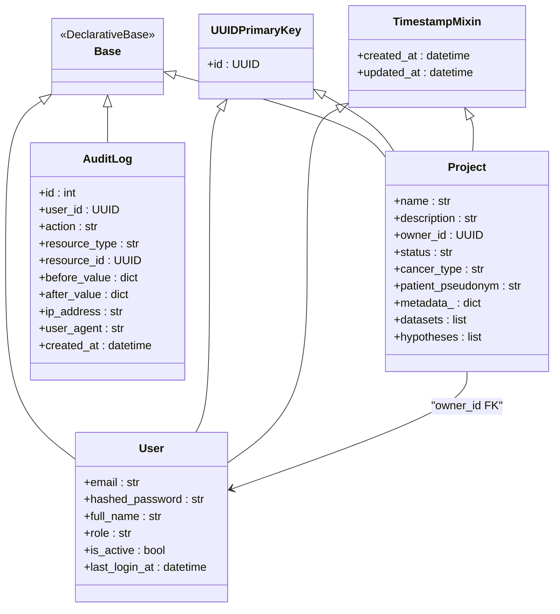
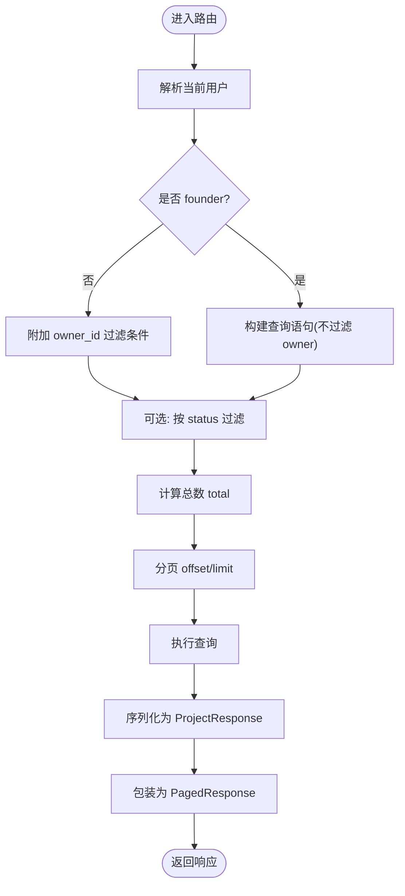
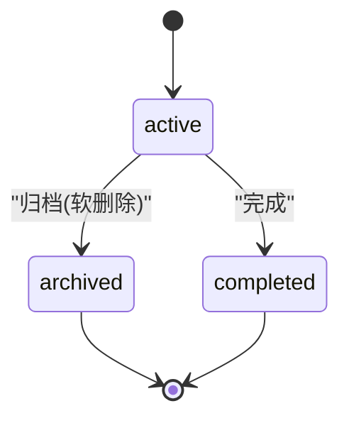
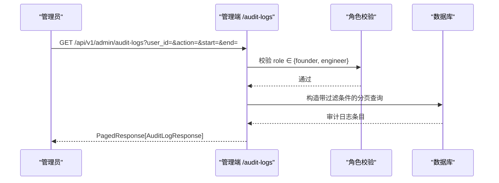
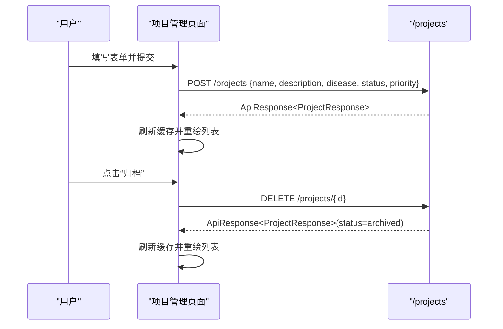
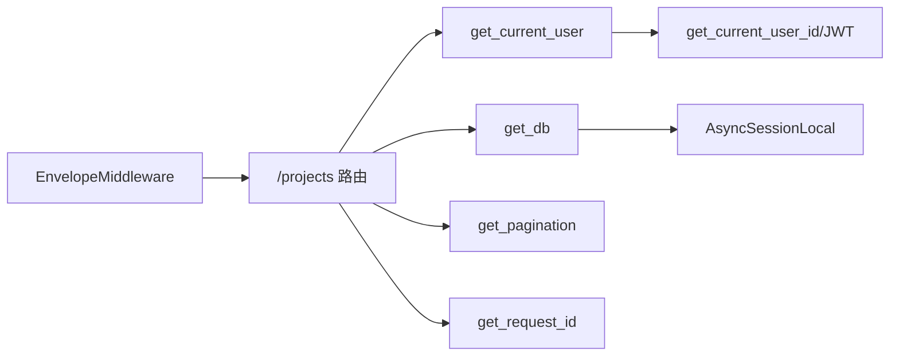

# 项目管理

<cite>
**本文引用的文件**   
- [backend/app/api/v1/projects.py](file://backend/app/api/v1/projects.py)
- [backend/app/models/project.py](file://backend/app/models/project.py)
- [backend/app/schemas/project.py](file://backend/app/schemas/project.py)
- [backend/app/schemas/common.py](file://backend/app/schemas/common.py)
- [backend/app/models/user.py](file://backend/app/models/user.py)
- [backend/app/models/audit_log.py](file://backend/app/models/audit_log.py)
- [backend/app/core/deps.py](file://backend/app/core/deps.py)
- [backend/app/core/security.py](file://backend/app/core/security.py)
- [backend/app/db/base.py](file://backend/app/db/base.py)
- [backend/app/db/session.py](file://backend/app/db/session.py)
- [backend/app/core/exceptions.py](file://backend/app/core/exceptions.py)
- [backend/app/main.py](file://backend/app/main.py)
- [frontend/pages/1_📁_项目管理.py](file://frontend/pages/1_📁_项目管理.py)
</cite>

## 目录
1. [简介](#简介)
2. [项目结构](#项目结构)
3. [核心组件](#核心组件)
4. [架构总览](#架构总览)
5. [详细组件分析](#详细组件分析)
6. [依赖关系分析](#依赖关系分析)
7. [性能与可扩展性](#性能与可扩展性)
8. [故障排查指南](#故障排查指南)
9. [结论](#结论)
10. [附录：API 接口文档](#附录api-接口文档)

## 简介
本模块聚焦“项目管理”能力，覆盖项目的创建、编辑、删除（软删除）、查询、权限控制与数据隔离、生命周期状态流转、审计日志记录，以及前端交互流程。后端采用 FastAPI + SQLAlchemy 异步会话，统一响应信封与分页规范；前端基于 Streamlit 提供可视化操作入口。

## 项目结构
围绕项目管理的代码主要分布在以下层次：
- API 层：路由定义、参数校验、权限与数据访问编排
- 领域模型层：ORM 实体定义与关系映射
- 模式层：Pydantic 请求/响应模型与通用枚举
- 安全与依赖注入：认证、角色、用户缓存、分页、请求 ID
- 数据库层：引擎与会话管理、基础混入
- 异常处理与中间件：统一错误信封、请求追踪与耗时注入
- 前端页面：项目创建、列表展示与基本操作

图表来源
- [backend/app/main.py:187-248](file://backend/app/main.py#L187-L248)
- [backend/app/api/v1/projects.py:1-169](file://backend/app/api/v1/projects.py#L1-L169)
- [backend/app/core/deps.py:1-129](file://backend/app/core/deps.py#L1-L129)
- [backend/app/core/security.py:1-211](file://backend/app/core/security.py#L1-L211)
- [backend/app/db/session.py:1-128](file://backend/app/db/session.py#L1-L128)

章节来源
- [backend/app/main.py:187-248](file://backend/app/main.py#L187-L248)
- [backend/app/api/v1/projects.py:1-169](file://backend/app/api/v1/projects.py#L1-L169)
- [backend/app/core/deps.py:1-129](file://backend/app/core/deps.py#L1-L129)
- [backend/app/core/security.py:1-211](file://backend/app/core/security.py#L1-L211)
- [backend/app/db/session.py:1-128](file://backend/app/db/session.py#L1-L128)

## 核心组件
- 项目模型与关系
  - 项目实体包含名称、描述、拥有者、状态、疾病类型、患者伪名及扩展元数据，并关联数据集与假设（级联删除）。
- 项目 Schema
  - 统一的创建/更新/响应模型，支持 snake_case/camelCase 双向兼容，状态字段受白名单约束。
- 项目路由
  - 提供分页列表、创建、详情、更新、归档（软删除）等端点；非创始人仅能访问自己拥有的项目。
- 用户与角色
  - 内置角色体系，founder 拥有最高权限；其他角色按资源归属进行数据隔离。
- 审计日志
  - append-only 设计，记录关键动作、资源标识、前后值快照、客户端 IP 与 UA，便于合规与排障。
- 依赖注入与安全
  - 用户对象短 TTL 内存缓存；JWT access token 校验；统一分页与请求 ID 注入。
- 数据库与会话
  - 异步会话工厂，自动提交/回滚；PostgreSQL/SQLite 驱动适配。

章节来源
- [backend/app/models/project.py:1-42](file://backend/app/models/project.py#L1-L42)
- [backend/app/schemas/project.py:1-55](file://backend/app/schemas/project.py#L1-L55)
- [backend/app/api/v1/projects.py:1-169](file://backend/app/api/v1/projects.py#L1-L169)
- [backend/app/models/user.py:1-36](file://backend/app/models/user.py#L1-L36)
- [backend/app/models/audit_log.py:1-45](file://backend/app/models/audit_log.py#L1-L45)
- [backend/app/core/deps.py:1-129](file://backend/app/core/deps.py#L1-L129)
- [backend/app/core/security.py:1-211](file://backend/app/core/security.py#L1-L211)
- [backend/app/db/session.py:1-128](file://backend/app/db/session.py#L1-L128)

## 架构总览
下图展示了从前端到数据库的完整调用链，包括认证、权限校验、数据隔离与响应封装。

图表来源
- [backend/app/api/v1/projects.py:47-84](file://backend/app/api/v1/projects.py#L47-L84)
- [backend/app/core/deps.py:101-124](file://backend/app/core/deps.py#L101-L124)
- [backend/app/core/security.py:155-174](file://backend/app/core/security.py#L155-L174)
- [backend/app/db/session.py:94-111](file://backend/app/db/session.py#L94-L111)

## 详细组件分析

### 数据模型与关系

图表来源
- [backend/app/db/base.py:13-48](file://backend/app/db/base.py#L13-L48)
- [backend/app/models/user.py:14-36](file://backend/app/models/user.py#L14-L36)
- [backend/app/models/project.py:14-42](file://backend/app/models/project.py#L14-L42)
- [backend/app/models/audit_log.py:15-45](file://backend/app/models/audit_log.py#L15-L45)

章节来源
- [backend/app/db/base.py:13-48](file://backend/app/db/base.py#L13-L48)
- [backend/app/models/user.py:14-36](file://backend/app/models/user.py#L14-L36)
- [backend/app/models/project.py:14-42](file://backend/app/models/project.py#L14-L42)
- [backend/app/models/audit_log.py:15-45](file://backend/app/models/audit_log.py#L15-L45)

### 项目 CRUD 与权限控制
- 列表查询
  - 支持按 status 过滤；非 founder 仅返回 own 项目；分页返回 PagedResponse。
- 创建项目
  - 使用当前登录用户作为 owner；写入后返回 ProjectResponse。
- 获取详情
  - 通过 _get_owned_project 校验存在性与访问权限。
- 更新项目
  - 仅更新传入字段；metadata 特殊处理；返回最新 ProjectResponse。
- 归档（软删除）
  - 将 status 置为 archived；不物理删除。

图表来源
- [backend/app/api/v1/projects.py:47-84](file://backend/app/api/v1/projects.py#L47-L84)
- [backend/app/api/v1/projects.py:87-110](file://backend/app/api/v1/projects.py#L87-L110)
- [backend/app/api/v1/projects.py:113-125](file://backend/app/api/v1/projects.py#L113-L125)
- [backend/app/api/v1/projects.py:128-150](file://backend/app/api/v1/projects.py#L128-L150)
- [backend/app/api/v1/projects.py:153-168](file://backend/app/api/v1/projects.py#L153-L168)

章节来源
- [backend/app/api/v1/projects.py:32-44](file://backend/app/api/v1/projects.py#L32-L44)
- [backend/app/api/v1/projects.py:47-84](file://backend/app/api/v1/projects.py#L47-L84)
- [backend/app/api/v1/projects.py:87-110](file://backend/app/api/v1/projects.py#L87-L110)
- [backend/app/api/v1/projects.py:113-125](file://backend/app/api/v1/projects.py#L113-L125)
- [backend/app/api/v1/projects.py:128-150](file://backend/app/api/v1/projects.py#L128-L150)
- [backend/app/api/v1/projects.py:153-168](file://backend/app/api/v1/projects.py#L153-L168)

### 状态管理与生命周期
- 允许状态集合：active、archived、completed。
- 默认状态：active。
- 软删除：通过 DELETE 将 status 设为 archived，保留历史数据与关联。
- 前端交互：页面提供激活/暂停/归档按钮，但后端状态白名单不包含 paused，需以实际后端为准。

图表来源
- [backend/app/schemas/common.py:150-151](file://backend/app/schemas/common.py#L150-L151)
- [backend/app/models/project.py:27](file://backend/app/models/project.py#L27)
- [backend/app/api/v1/projects.py:153-168](file://backend/app/api/v1/projects.py#L153-L168)

章节来源
- [backend/app/schemas/common.py:150-151](file://backend/app/schemas/common.py#L150-L151)
- [backend/app/models/project.py:27](file://backend/app/models/project.py#L27)
- [backend/app/api/v1/projects.py:153-168](file://backend/app/api/v1/projects.py#L153-L168)

### 审计日志与合规
- 审计日志为 append-only，记录 action、resource_type/resource_id、前后值快照、IP、UA 与时间戳。
- 管理端提供审计日志查询（受限 founder/engineer），支持按用户、动作、资源类型与时间范围过滤。
- 建议对敏感操作（如归档、更新 metadata）在路由中追加审计落库逻辑。

图表来源
- [backend/app/models/audit_log.py:15-45](file://backend/app/models/audit_log.py#L15-L45)
- [backend/app/api/v1/admin.py:53-123](file://backend/app/api/v1/admin.py#L53-L123)

章节来源
- [backend/app/models/audit_log.py:15-45](file://backend/app/models/audit_log.py#L15-L45)
- [backend/app/api/v1/admin.py:53-123](file://backend/app/api/v1/admin.py#L53-L123)

### 前端交互与使用示例
- 页面功能
  - 表单创建项目（名称、描述、疾病、状态、优先级）
  - 列表展示（折叠卡片显示详情与指标）
  - 操作按钮：激活、暂停、归档
- 注意事项
  - 前端状态选项包含 paused，但后端白名单未包含该值；若需支持，应同步扩展后端状态枚举并在更新时校验。

图表来源
- [frontend/pages/1_📁_项目管理.py:27-62](file://frontend/pages/1_📁_项目管理.py#L27-L62)
- [frontend/pages/1_📁_项目管理.py:64-136](file://frontend/pages/1_📁_项目管理.py#L64-L136)
- [backend/app/api/v1/projects.py:87-110](file://backend/app/api/v1/projects.py#L87-L110)
- [backend/app/api/v1/projects.py:153-168](file://backend/app/api/v1/projects.py#L153-L168)

章节来源
- [frontend/pages/1_📁_项目管理.py:27-62](file://frontend/pages/1_📁_项目管理.py#L27-L62)
- [frontend/pages/1_📁_项目管理.py:64-136](file://frontend/pages/1_📁_项目管理.py#L64-L136)

## 依赖关系分析
- 路由依赖
  - get_current_user：从 JWT 提取 user_id，加载 User 并做短 TTL 缓存，禁用用户直接拒绝。
  - get_db：异步会话工厂，自动 commit/rollback。
  - get_pagination：页码与每页大小校验与转换。
  - get_request_id：优先使用 X-Request-ID，否则生成。
- 安全依赖
  - get_current_user_id：OAuth2 Bearer 校验，拒绝非 access token。
  - require_roles：可复用的角色守卫工厂（当前路由未直接使用，但可作为扩展点）。
- 中间件
  - EnvelopeMiddleware：注入 request_id、response-time-ms、content-length，并对 JSON 信封注入 duration_ms。
  - CORS：跨域配置，暴露追踪头。

图表来源
- [backend/app/api/v1/projects.py:10-27](file://backend/app/api/v1/projects.py#L10-L27)
- [backend/app/core/deps.py:83-129](file://backend/app/core/deps.py#L83-L129)
- [backend/app/core/security.py:155-174](file://backend/app/core/security.py#L155-L174)
- [backend/app/db/session.py:82-111](file://backend/app/db/session.py#L82-L111)
- [backend/app/main.py:215-227](file://backend/app/main.py#L215-L227)

章节来源
- [backend/app/api/v1/projects.py:10-27](file://backend/app/api/v1/projects.py#L10-L27)
- [backend/app/core/deps.py:83-129](file://backend/app/core/deps.py#L83-L129)
- [backend/app/core/security.py:155-174](file://backend/app/core/security.py#L155-L174)
- [backend/app/db/session.py:82-111](file://backend/app/db/session.py#L82-L111)
- [backend/app/main.py:215-227](file://backend/app/main.py#L215-L227)

## 性能与可扩展性
- 用户缓存
  - 短 TTL 内存缓存减少频繁查库，注意在用户信息变更或登出时失效。
- 分页与计数
  - 列表查询先 count 再分页，避免大表全量扫描；可按需增加索引优化。
- 中间件开销
  - 统一信封中间件会缓冲响应体并注入耗时，对超大响应可能带来额外内存占用；流式响应已做透传处理。
- 可扩展点
  - 批量操作：可在路由层增加批量创建/更新/归档接口，结合事务与幂等键保证一致性。
  - 搜索过滤：可在列表查询中扩展 name/disease/patient_pseudonym 模糊匹配与全文检索。
  - 模板化：引入项目模板（预置元数据/默认成员/初始数据集），通过专用端点快速初始化。

[本节为通用指导，无需源码引用]

## 故障排查指南
- 常见错误与定位
  - 401 未授权：检查 Authorization header 是否携带有效 access token。
  - 403 禁止访问：确认当前用户是否为 founder 或项目拥有者。
  - 404 不存在：确认 project_id 是否存在且未被归档。
  - 400 参数校验失败：检查 Pydantic 校验规则（如状态白名单、长度限制）。
  - 500 内部错误：查看服务端日志，关注中间件记录的 method/path/status/duration。
- 追踪与诊断
  - 使用 X-Request-ID 贯穿请求链路，配合服务端日志定位问题。
  - 审计日志用于回溯关键操作的前后值变化与来源信息。

章节来源
- [backend/app/core/exceptions.py:131-179](file://backend/app/core/exceptions.py#L131-L179)
- [backend/app/main.py:172-184](file://backend/app/main.py#L172-L184)
- [backend/app/api/v1/admin.py:53-123](file://backend/app/api/v1/admin.py#L53-L123)

## 结论
本项目管理模块在后端实现了清晰的权限与数据隔离、统一响应与分页、软删除与状态管理，并具备审计日志能力。前端提供了直观的操作界面。建议在后续迭代中补充批量操作、更丰富的搜索过滤、项目模板与完整的审计落库策略，以提升效率与合规性。

[本节为总结，无需源码引用]

## 附录：API 接口文档

### 通用约定
- 统一成功响应信封：{ success, data, meta }
- 分页响应信封：{ success, data[], meta: { page, page_size, total, total_pages, request_id } }
- 错误响应信封：{ success: false, error: { code, message, details }, meta: { request_id } }
- 所有路径前缀：/api/v1

### 项目相关端点
- 列出项目
  - 方法：GET
  - 路径：/api/v1/projects
  - 查询参数：
    - status: 可选，按状态过滤
    - page: 页码，默认 1
    - page_size: 每页条数，默认 20，最大 100
  - 权限：所有已认证用户；非 founder 仅返回 own 项目
  - 响应：PagedResponse[ProjectResponse]
- 创建项目
  - 方法：POST
  - 路径：/api/v1/projects
  - 请求体：ProjectCreate
  - 权限：已认证用户
  - 响应：ApiResponse[ProjectResponse]
- 获取项目详情
  - 方法：GET
  - 路径：/api/v1/projects/{project_id}
  - 权限：founder 或项目拥有者
  - 响应：ApiResponse[ProjectResponse]
- 更新项目
  - 方法：PATCH
  - 路径：/api/v1/projects/{project_id}
  - 请求体：ProjectUpdate（字段可选）
  - 权限：founder 或项目拥有者
  - 响应：ApiResponse[ProjectResponse]
- 归档项目（软删除）
  - 方法：DELETE
  - 路径：/api/v1/projects/{project_id}
  - 权限：founder 或项目拥有者
  - 响应：ApiResponse[ProjectResponse]

章节来源
- [backend/app/api/v1/projects.py:47-84](file://backend/app/api/v1/projects.py#L47-L84)
- [backend/app/api/v1/projects.py:87-110](file://backend/app/api/v1/projects.py#L87-L110)
- [backend/app/api/v1/projects.py:113-125](file://backend/app/api/v1/projects.py#L113-L125)
- [backend/app/api/v1/projects.py:128-150](file://backend/app/api/v1/projects.py#L128-L150)
- [backend/app/api/v1/projects.py:153-168](file://backend/app/api/v1/projects.py#L153-L168)
- [backend/app/schemas/common.py:63-89](file://backend/app/schemas/common.py#L63-L89)

### 数据模型定义

- Project（项目）
  - 字段：
    - id: UUID（主键）
    - name: 字符串（必填）
    - description: 文本（可选）
    - owner_id: UUID（外键，指向 users.id）
    - status: 字符串（默认 active）
    - cancer_type: 字符串（可选）
    - patient_pseudonym: 字符串（可选）
    - metadata_: 字典（JSONB，默认空）
    - created_at/updated_at: 时间戳
  - 关系：
    - datasets: 一对多（级联删除）
    - hypotheses: 一对多（级联删除）

- User（用户）
  - 字段：
    - id: UUID（主键）
    - email: 唯一索引
    - hashed_password: 哈希密码
    - full_name: 姓名
    - role: 角色（founder/pi/researcher/doctor/engineer）
    - is_active: 是否启用
    - last_login_at: 最后登录时间
    - created_at/updated_at: 时间戳

- AuditLog（审计日志）
  - 字段：
    - id: BIGSERIAL（自增主键）
    - user_id: UUID（外键，可空）
    - action: 动作类型
    - resource_type: 资源类型
    - resource_id: 资源 ID
    - before_value/after_value: JSON 快照
    - ip_address: 客户端 IP
    - user_agent: 客户端 UA
    - created_at: 时间戳

章节来源
- [backend/app/models/project.py:14-42](file://backend/app/models/project.py#L14-L42)
- [backend/app/models/user.py:14-36](file://backend/app/models/user.py#L14-L36)
- [backend/app/models/audit_log.py:15-45](file://backend/app/models/audit_log.py#L15-L45)
- [backend/app/db/base.py:17-48](file://backend/app/db/base.py#L17-L48)

### 业务规则说明
- 数据隔离
  - 非 founder 只能访问 own 项目；列表与详情均强制 owner_id 校验。
- 状态约束
  - 状态取值受白名单约束；更新时需校验。
- 软删除
  - 删除即归档，保持数据可追溯。
- 审计要求
  - 建议对所有写操作记录审计日志（当前管理端提供审计查询能力）。

章节来源
- [backend/app/api/v1/projects.py:32-44](file://backend/app/api/v1/projects.py#L32-L44)
- [backend/app/schemas/project.py:33-38](file://backend/app/schemas/project.py#L33-L38)
- [backend/app/schemas/common.py:150-151](file://backend/app/schemas/common.py#L150-L151)
- [backend/app/api/v1/projects.py:153-168](file://backend/app/api/v1/projects.py#L153-L168)

### 使用示例（前端）
- 创建项目
  - 在“项目管理”页面填写表单并提交，成功后刷新列表。
- 归档项目
  - 在项目卡片点击“归档”，后端将 status 置为 archived，前端刷新列表。

章节来源
- [frontend/pages/1_📁_项目管理.py:27-62](file://frontend/pages/1_📁_项目管理.py#L27-L62)
- [frontend/pages/1_📁_项目管理.py:120-129](file://frontend/pages/1_📁_项目管理.py#L120-L129)