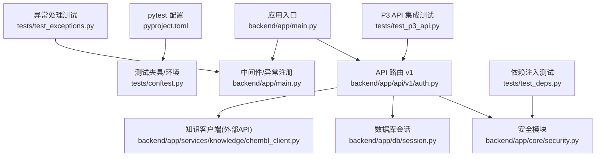
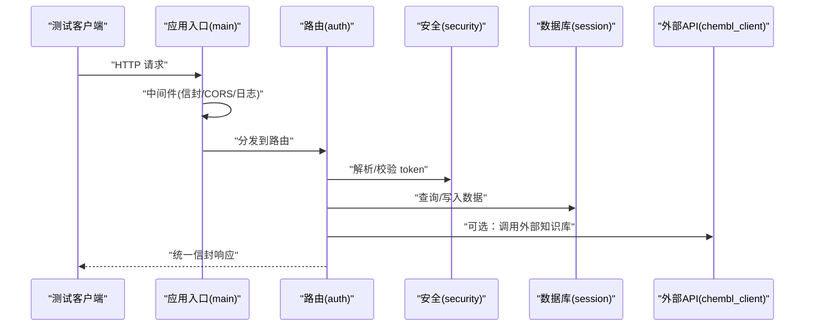
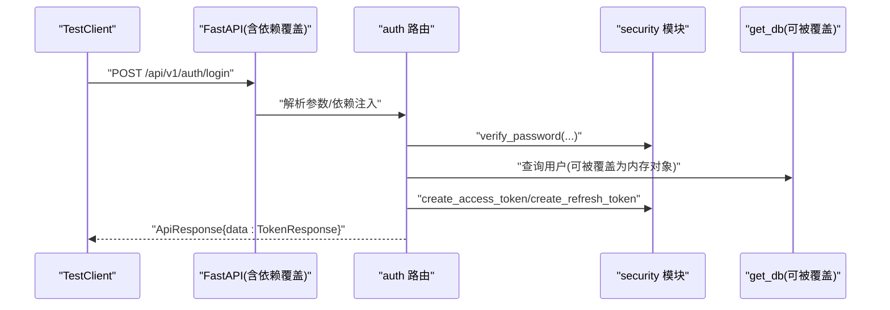
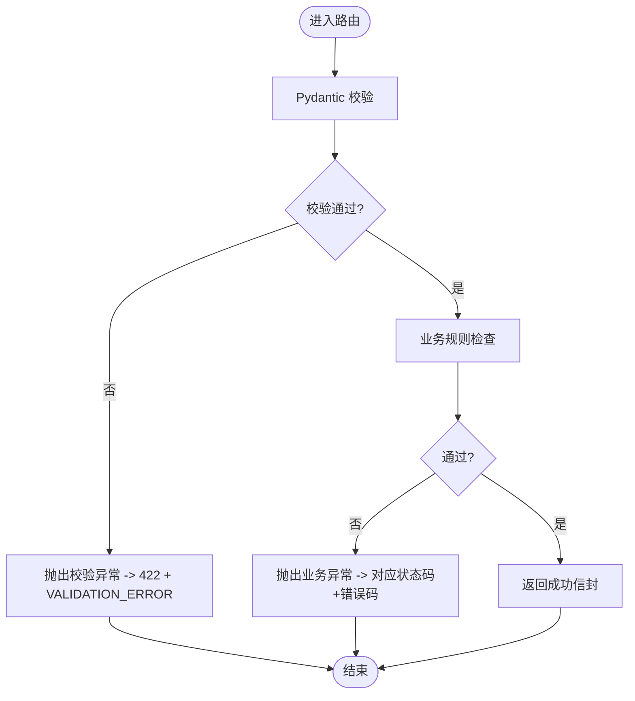
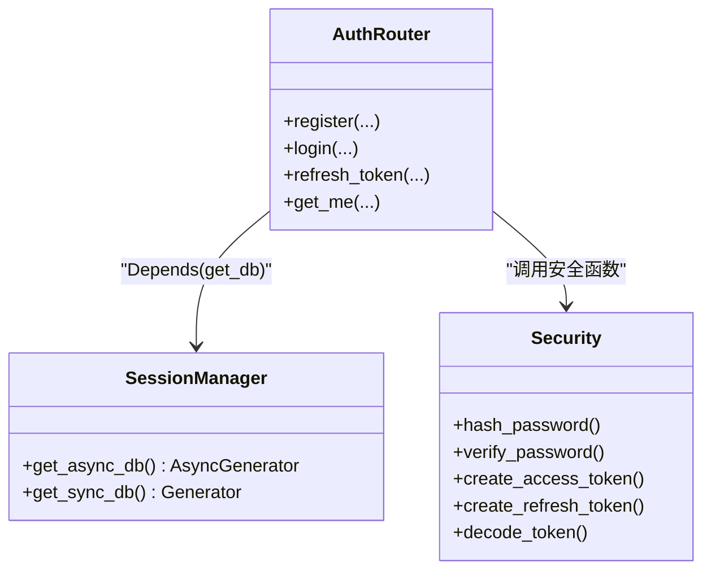
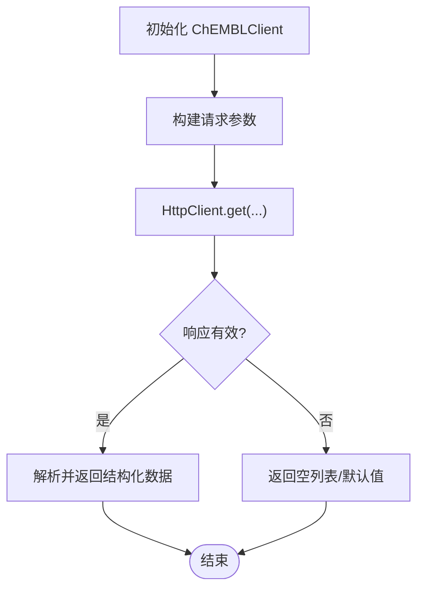
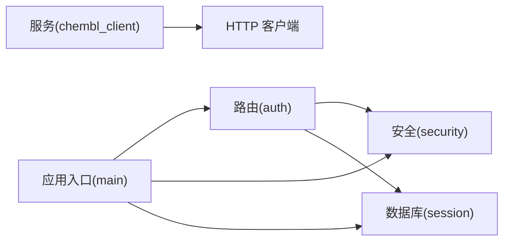

# 单元测试

<cite>
**本文引用的文件**
- [pyproject.toml](file://pyproject.toml)
- [conftest.py](file://tests/conftest.py)
- [main.py](file://backend/app/main.py)
- [auth.py](file://backend/app/api/v1/auth.py)
- [security.py](file://backend/app/core/security.py)
- [session.py](file://backend/app/db/session.py)
- [chembl_client.py](file://backend/app/services/knowledge/chembl_client.py)
- [test_exceptions.py](file://tests/test_exceptions.py)
- [test_p3_api.py](file://tests/test_p3_api.py)
- [test_deps.py](file://tests/test_deps.py)
</cite>

## 目录
1. [简介](#简介)
2. [项目结构](#项目结构)
3. [核心组件](#核心组件)
4. [架构总览](#架构总览)
5. [详细组件分析](#详细组件分析)
6. [依赖关系分析](#依赖关系分析)
7. [性能与可测性考量](#性能与可测性考量)
8. [故障排查指南](#故障排查指南)
9. [结论](#结论)
10. [附录](#附录)

## 简介
本指南面向 AI 药物设计系统的后端测试，聚焦 pytest 框架配置、测试夹具（fixtures）使用、Mock 策略与依赖注入测试。文档覆盖如何测试 FastAPI 路由、服务层逻辑、数据库操作与外部 API 调用，并提供用户认证、数据验证、业务逻辑与异常处理的测试示例路径。同时给出覆盖率要求、命名规范与最佳实践建议，帮助团队建立稳定、高效且可维护的测试体系。

## 项目结构
仓库采用分层组织：应用入口、API 路由、核心能力（安全、配置、异常）、数据库会话、领域服务与工具等。测试位于顶层 tests 目录，包含通用夹具与多类测试用例。

图表来源
- [main.py:187-248](file://backend/app/main.py#L187-L248)
- [auth.py:1-147](file://backend/app/api/v1/auth.py#L1-L147)
- [security.py:1-211](file://backend/app/core/security.py#L1-L211)
- [session.py:1-128](file://backend/app/db/session.py#L1-L128)
- [chembl_client.py:1-127](file://backend/app/services/knowledge/chembl_client.py#L1-L127)
- [pyproject.toml:63-83](file://pyproject.toml#L63-L83)
- [conftest.py:1-85](file://tests/conftest.py#L1-L85)
- [test_exceptions.py:169-222](file://tests/test_exceptions.py#L169-L222)
- [test_p3_api.py:1-87](file://tests/test_p3_api.py#L1-L87)
- [test_deps.py:51-93](file://tests/test_deps.py#L51-L93)

章节来源
- [pyproject.toml:63-83](file://pyproject.toml#L63-L83)
- [conftest.py:1-85](file://tests/conftest.py#L1-L85)

## 核心组件
- 应用工厂与中间件：创建 FastAPI 实例、注册统一信封响应中间件、CORS、异常处理器与路由挂载。
- 认证与安全：密码哈希、JWT 生成与校验、FastAPI 依赖注入获取当前用户与角色守卫。
- 数据库会话：异步/同步引擎与会话工厂，提供 get_db 依赖用于请求级事务管理。
- 外部服务客户端：ChEMBL 客户端封装 HTTP 调用，便于 Mock 与隔离测试。
- 测试基础设施：pytest 配置、环境变量与示例夹具；针对异常处理、依赖注入与 API 端点的测试样例。

章节来源
- [main.py:187-248](file://backend/app/main.py#L187-L248)
- [security.py:1-211](file://backend/app/core/security.py#L1-L211)
- [session.py:1-128](file://backend/app/db/session.py#L1-L128)
- [chembl_client.py:1-127](file://backend/app/services/knowledge/chembl_client.py#L1-L127)
- [pyproject.toml:63-83](file://pyproject.toml#L63-L83)
- [conftest.py:1-85](file://tests/conftest.py#L1-L85)

## 架构总览
下图展示从请求进入应用到返回响应的关键路径，以及测试中常用的依赖替换点。

图表来源
- [main.py:187-248](file://backend/app/main.py#L187-L248)
- [auth.py:1-147](file://backend/app/api/v1/auth.py#L1-L147)
- [security.py:1-211](file://backend/app/core/security.py#L1-L211)
- [session.py:1-128](file://backend/app/db/session.py#L1-L128)
- [chembl_client.py:1-127](file://backend/app/services/knowledge/chembl_client.py#L1-L127)

## 详细组件分析

### 认证与授权测试（路由 + 安全 + 依赖注入）
- 目标
  - 验证登录、刷新令牌、获取当前用户等端点的正确行为与错误分支。
  - 通过依赖覆盖绕过真实 JWT 校验与数据库访问，快速断言业务逻辑。
- 关键依赖
  - 路由依赖：get_request_id、get_db、get_current_user、get_settings。
  - 安全函数：create_access_token、create_refresh_token、decode_token、hash_password、verify_password。
- 测试要点
  - 成功路径：注册后登录返回 access/refresh token；刷新 token 返回新令牌；/me 返回当前用户。
  - 失败路径：邮箱已存在、密码错误、用户禁用、token 类型或签名错误。
  - 依赖覆盖：在测试应用中覆盖 get_current_user 返回构造的 User 对象，避免真实鉴权。
- 参考实现路径
  - 路由定义与依赖：[auth.py:1-147](file://backend/app/api/v1/auth.py#L1-L147)
  - 安全函数与依赖注入：[security.py:1-211](file://backend/app/core/security.py#L1-L211)
  - 依赖覆盖示例（P3 API 测试）：[test_p3_api.py:42-53](file://tests/test_p3_api.py#L42-L53)

图表来源
- [auth.py:70-101](file://backend/app/api/v1/auth.py#L70-L101)
- [security.py:96-122](file://backend/app/core/security.py#L96-L122)
- [test_p3_api.py:42-53](file://tests/test_p3_api.py#L42-L53)

章节来源
- [auth.py:1-147](file://backend/app/api/v1/auth.py#L1-L147)
- [security.py:1-211](file://backend/app/core/security.py#L1-L211)
- [test_p3_api.py:1-87](file://tests/test_p3_api.py#L1-L87)

### 数据验证与异常处理测试
- 目标
  - 验证 Pydantic 模型校验失败时返回统一信封格式的错误响应。
  - 验证自定义业务异常（如未找到资源、内部错误）映射到正确的状态码与错误码。
- 关键机制
  - 全局异常处理器注册：register_exception_handlers(app)。
  - 统一信封响应：所有错误均返回 {success: false, error: {...}}。
- 测试要点
  - 校验失败：缺少必填字段或类型不匹配，应返回 422 与 VALIDATION_ERROR。
  - 业务异常：NotFoundError 返回 404 与 NOT_FOUND；未捕获异常返回 500 与 INTERNAL_ERROR。
- 参考实现路径
  - 异常处理测试样例：[test_exceptions.py:169-222](file://tests/test_exceptions.py#L169-L222)
  - 应用入口注册异常处理器：[main.py:229-230](file://backend/app/main.py#L229-L230)

图表来源
- [test_exceptions.py:184-222](file://tests/test_exceptions.py#L184-L222)
- [main.py:229-230](file://backend/app/main.py#L229-L230)

章节来源
- [test_exceptions.py:169-222](file://tests/test_exceptions.py#L169-L222)
- [main.py:187-248](file://backend/app/main.py#L187-L248)

### 数据库操作测试（会话与事务）
- 目标
  - 验证路由对数据库的读写行为，包括提交与回滚。
  - 在单元测试中避免真实数据库连接，使用内存对象或轻量替代。
- 关键机制
  - 会话工厂与依赖：AsyncSessionLocal、get_async_db/get_db。
  - 请求级事务：成功提交，异常回滚。
- 测试要点
  - 使用依赖覆盖将 get_db 替换为返回内存对象的生成器，模拟增删改查。
  - 断言提交/回滚分支：正常路径 commit，异常路径 rollback。
- 参考实现路径
  - 会话与依赖：[session.py:94-128](file://backend/app/db/session.py#L94-L128)
  - 路由中使用 get_db：[auth.py:41-67](file://backend/app/api/v1/auth.py#L41-L67)

图表来源
- [session.py:94-128](file://backend/app/db/session.py#L94-L128)
- [auth.py:41-101](file://backend/app/api/v1/auth.py#L41-L101)
- [security.py:32-122](file://backend/app/core/security.py#L32-L122)

章节来源
- [session.py:1-128](file://backend/app/db/session.py#L1-L128)
- [auth.py:1-147](file://backend/app/api/v1/auth.py#L1-L147)

### 外部 API 调用测试（ChEMBL 客户端）
- 目标
  - 验证 ChEMBL 客户端的请求构建、参数传递与响应解析。
  - 通过 Mock HttpClient 或整个客户端，隔离网络与第三方服务。
- 关键机制
  - 客户端初始化：读取配置 base_url、超时与重试。
  - 方法：get_molecule、search_molecules、get_activities_for_target、get_approved_drugs_for_indication。
- 测试要点
  - 成功路径：返回期望的数据结构（空列表或字典键）。
  - 失败路径：网络异常、超时、非 JSON 响应时的容错处理。
- 参考实现路径
  - 客户端实现：[chembl_client.py:20-127](file://backend/app/services/knowledge/chembl_client.py#L20-L127)

图表来源
- [chembl_client.py:20-127](file://backend/app/services/knowledge/chembl_client.py#L20-L127)

章节来源
- [chembl_client.py:1-127](file://backend/app/services/knowledge/chembl_client.py#L1-L127)

### 依赖注入与分页测试
- 目标
  - 验证 FastAPI 依赖注入（如分页参数）的校验与默认值。
  - 确保非法输入触发 422 校验错误。
- 关键机制
  - 自定义依赖：get_pagination 等。
  - TestClient 直接调用路由以验证依赖解析。
- 测试要点
  - 合法参数：page、page_size 计算 offset 正确。
  - 非法参数：page < 1 或 page_size > 100 触发 422。
- 参考实现路径
  - 依赖测试样例：[test_deps.py:51-93](file://tests/test_deps.py#L51-L93)

章节来源
- [test_deps.py:51-93](file://tests/test_deps.py#L51-L93)

## 依赖关系分析
- 组件耦合
  - 路由层依赖安全与数据库会话，服务层依赖配置与 HTTP 客户端。
  - 测试通过依赖覆盖与夹具降低耦合，提高可测性。
- 外部依赖
  - 数据库驱动（asyncpg/sqlite+aiosqlite）、Redis、OpenAI/Anthropic（配置项）。
  - 外部 API（ChEMBL），可通过 Mock 隔离。
- 潜在循环依赖
  - 当前结构清晰分层，未见明显循环导入；建议在新增模块时保持单向依赖。

图表来源
- [auth.py:1-147](file://backend/app/api/v1/auth.py#L1-L147)
- [security.py:1-211](file://backend/app/core/security.py#L1-L211)
- [session.py:1-128](file://backend/app/db/session.py#L1-L128)
- [chembl_client.py:1-127](file://backend/app/services/knowledge/chembl_client.py#L1-L127)
- [main.py:187-248](file://backend/app/main.py#L187-L248)

章节来源
- [auth.py:1-147](file://backend/app/api/v1/auth.py#L1-L147)
- [security.py:1-211](file://backend/app/core/security.py#L1-L211)
- [session.py:1-128](file://backend/app/db/session.py#L1-L128)
- [chembl_client.py:1-127](file://backend/app/services/knowledge/chembl_client.py#L1-L127)
- [main.py:187-248](file://backend/app/main.py#L187-L248)

## 性能与可测性考量
- 中间件开销
  - 统一信封中间件会累积响应体并注入耗时信息，测试时应关注大响应体的性能影响。
- 数据库连接池
  - 非 SQLite 场景启用连接池与预检，测试中建议使用内存对象或轻量替代以避免真实连接。
- 外部 API 超时与重试
  - 客户端设置超时与重试，测试需覆盖超时与重试失败路径，确保健壮性。

## 故障排查指南
- 常见问题
  - 环境变量缺失导致配置加载失败：确认 conftest 设置的 APP_ENV、DATABASE_URL、REDIS_URL、OPENAI_API_KEY 等。
  - 依赖覆盖未生效：检查 application.dependency_overrides 是否正确注册。
  - 异常处理器未注册：确保在测试应用中调用 register_exception_handlers。
- 定位步骤
  - 使用 TestClient 最小化复现问题。
  - 打印或记录请求 ID 与响应头，结合中间件日志定位。
  - 逐步覆盖依赖，缩小问题范围至具体模块。

章节来源
- [conftest.py:14-22](file://tests/conftest.py#L14-L22)
- [test_p3_api.py:42-53](file://tests/test_p3_api.py#L42-L53)
- [test_exceptions.py:169-183](file://tests/test_exceptions.py#L169-L183)
- [main.py:229-230](file://backend/app/main.py#L229-L230)

## 结论
通过 pytest 配置、夹具与依赖注入，结合 Mock 策略，可以高效地测试 FastAPI 路由、服务层逻辑、数据库操作与外部 API 调用。遵循统一的异常处理与信封响应规范，能够保证测试的一致性与可维护性。建议持续完善覆盖率与测试命名规范，形成稳定的质量保障体系。

## 附录

### pytest 配置与覆盖率要求
- 运行与报告
  - 最小版本、测试路径、异步模式、覆盖率阈值与报告输出。
- 标记与忽略
  - slow/integration/gpu 标记；ruff 与 coverage 的忽略规则。
- 参考实现路径
  - [pyproject.toml:63-83](file://pyproject.toml#L63-L83)
  - [pyproject.toml:85-105](file://pyproject.toml#L85-L105)

章节来源
- [pyproject.toml:63-83](file://pyproject.toml#L63-L83)
- [pyproject.toml:85-105](file://pyproject.toml#L85-L105)

### 测试夹具与环境变量
- 作用
  - 设置测试环境变量，提供示例靶点、证据项与分子数据。
- 参考实现路径
  - [conftest.py:14-22](file://tests/conftest.py#L14-L22)
  - [conftest.py:26-85](file://tests/conftest.py#L26-L85)

章节来源
- [conftest.py:1-85](file://tests/conftest.py#L1-L85)

### 测试命名规范与最佳实践
- 命名规范
  - 测试文件：test_*.py；测试类：Test*；测试函数：test_*。
- 最佳实践
  - 使用依赖覆盖隔离外部依赖；优先断言响应信封结构与关键字段；对异常路径进行显式断言；使用 fixtures 复用数据与上下文。
- 参考实现路径
  - [pyproject.toml:66-68](file://pyproject.toml#L66-L68)
  - [test_p3_api.py:65-87](file://tests/test_p3_api.py#L65-L87)
  - [test_exceptions.py:169-222](file://tests/test_exceptions.py#L169-L222)

章节来源
- [pyproject.toml:66-68](file://pyproject.toml#L66-L68)
- [test_p3_api.py:65-87](file://tests/test_p3_api.py#L65-L87)
- [test_exceptions.py:169-222](file://tests/test_exceptions.py#L169-L222)