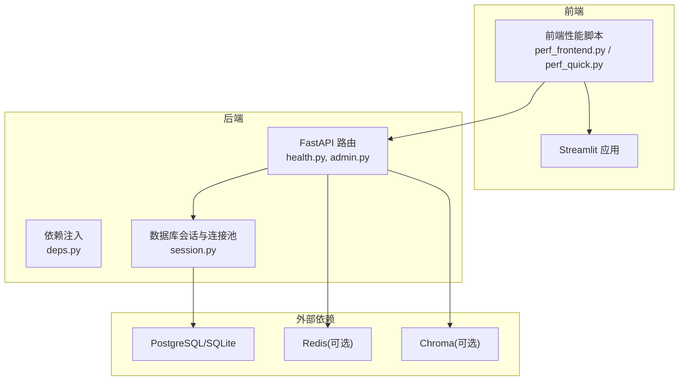
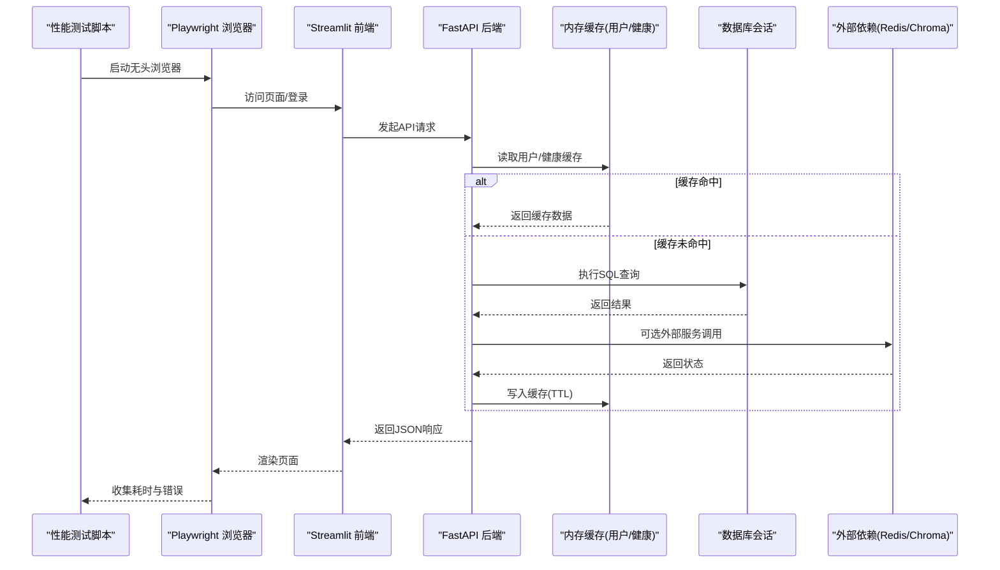
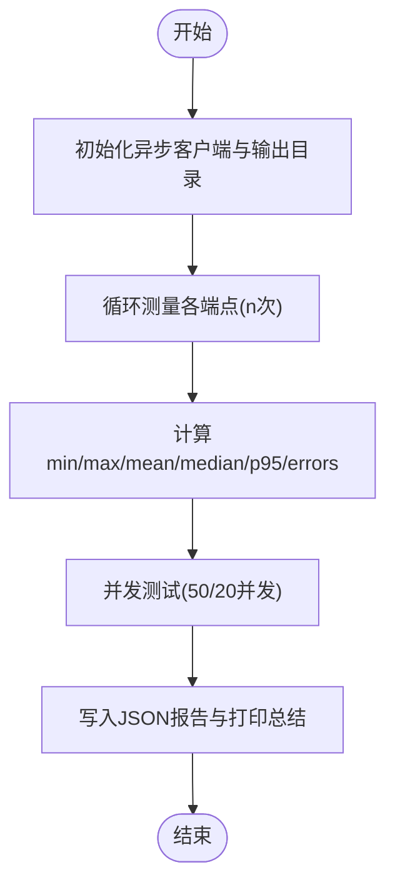
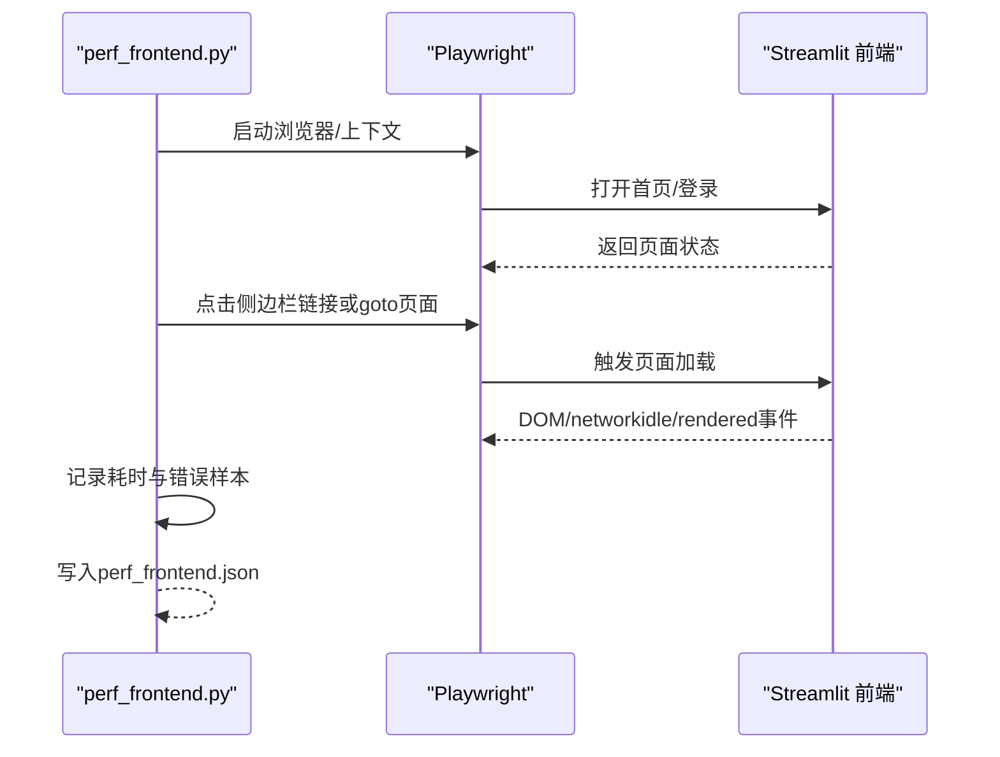
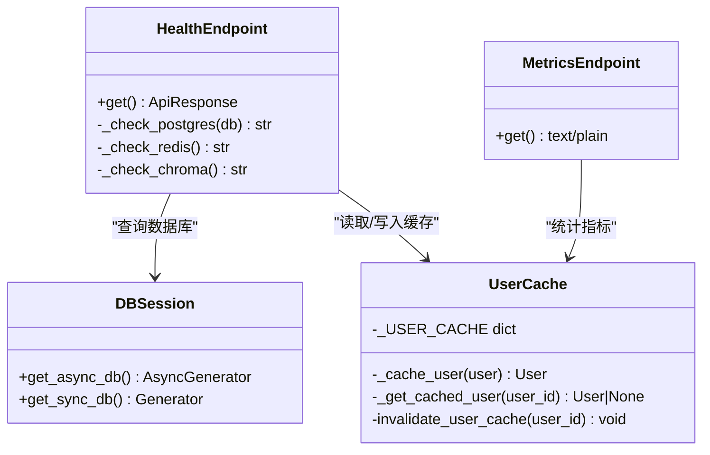
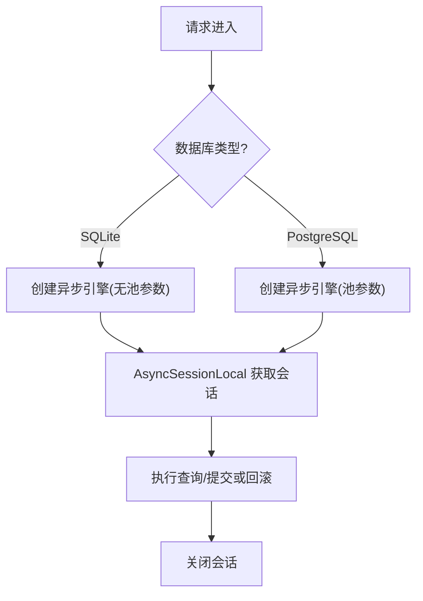
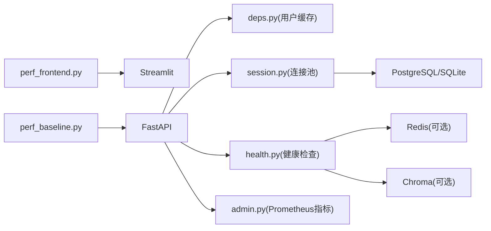

# 性能测试

<cite>
**本文引用的文件**
- [README.md](file://precision-drug-design/README.md)
- [perf_baseline.py](file://precision-drug-design/tests/perf_baseline.py)
- [perf_frontend.py](file://precision-drug-design/tests/perf_frontend.py)
- [perf_quick.py](file://precision-drug-design/tests/perf_quick.py)
- [PERFORMANCE_REPORT.md](file://precision-drug-design/tests/perf_output/PERFORMANCE_REPORT.md)
- [perf_baseline.json](file://precision-drug-design/tests/perf_output/perf_baseline.json)
- [admin.py](file://precision-drug-design/backend/app/api/v1/admin.py)
- [health.py](file://precision-drug-design/backend/app/api/v1/health.py)
- [deps.py](file://precision-drug-design/backend/app/core/deps.py)
- [session.py](file://precision-drug-design/backend/app/db/session.py)
</cite>

## 目录
1. [简介](#简介)
2. [项目结构](#项目结构)
3. [核心组件](#核心组件)
4. [架构总览](#架构总览)
5. [详细组件分析](#详细组件分析)
6. [依赖关系分析](#依赖关系分析)
7. [性能考量与优化建议](#性能考量与优化建议)
8. [故障排查指南](#故障排查指南)
9. [结论](#结论)
10. [附录](#附录)

## 简介
本指南面向AI药物设计系统的性能测试，覆盖前端性能基准、后端API性能、数据库查询性能分析与内存使用监控。文档基于仓库中已有的性能脚本与监控端点，提供：
- 工具链说明（Playwright、httpx、pytest）
- 基准测试编写规范与指标定义
- 并发请求、大数据集处理、AI模型推理的性能测试方法
- 性能回归检测流程与报告生成
- 资源消耗分析与优化建议

## 项目结构
与性能相关的代码主要分布在以下位置：
- 后端API与监控：backend/app/api/v1/*（健康检查、Prometheus指标等）
- 数据库会话与连接池：backend/app/db/session.py
- 通用依赖注入与用户缓存：backend/app/core/deps.py
- 性能基准与前端测试：tests/perf_*.py
- 性能输出与报告：tests/perf_output/*

图表来源
- [health.py:1-102](file://precision-drug-design/backend/app/api/v1/health.py#L1-L102)
- [admin.py:1-50](file://precision-drug-design/backend/app/api/v1/admin.py#L1-L50)
- [deps.py:1-129](file://precision-drug-design/backend/app/core/deps.py#L1-L129)
- [session.py:1-128](file://precision-drug-design/backend/app/db/session.py#L1-L128)

章节来源
- [README.md:1-421](file://precision-drug-design/README.md#L1-L421)

## 核心组件
- 后端API性能基准
  - 通过异步HTTP客户端对关键端点进行多次测量，统计均值、中位数、P95、错误率等指标，并支持并发场景。
  - 参考路径：[perf_baseline.py](file://precision-drug-design/tests/perf_baseline.py)
- 前端页面加载性能
  - 使用Playwright模拟浏览器行为，测量DOM加载、网络空闲、渲染完成时间，以及Tab切换响应。
  - 参考路径：[perf_frontend.py](file://precision-drug-design/tests/perf_frontend.py)、[perf_quick.py](file://precision-drug-design/tests/perf_quick.py)
- 监控与可观测性
  - 健康检查端点包含短TTL内存缓存，降低高频探测对数据库的压力。
  - Prometheus格式指标端点用于采集QPS、延迟、错误率等。
  - 参考路径：[health.py](file://precision-drug-design/backend/app/api/v1/health.py)、[admin.py](file://precision-drug-design/backend/app/api/v1/admin.py)
- 数据库会话与连接池
  - 根据数据库类型选择同步/异步引擎与连接池参数，避免SQLite不支持池参数的异常。
  - 参考路径：[session.py](file://precision-drug-design/backend/app/db/session.py)
- 依赖注入与缓存
  - 用户对象短TTL内存缓存减少重复查询；分页依赖统一参数校验。
  - 参考路径：[deps.py](file://precision-drug-design/backend/app/core/deps.py)

章节来源
- [perf_baseline.py:1-352](file://precision-drug-design/tests/perf_baseline.py#L1-L352)
- [perf_frontend.py:1-251](file://precision-drug-design/tests/perf_frontend.py#L1-L251)
- [perf_quick.py:1-118](file://precision-drug-design/tests/perf_quick.py#L1-L118)
- [health.py:1-102](file://precision-drug-design/backend/app/api/v1/health.py#L1-L102)
- [admin.py:1-50](file://precision-drug-design/backend/app/api/v1/admin.py#L1-L50)
- [session.py:1-128](file://precision-drug-design/backend/app/db/session.py#L1-L128)
- [deps.py:1-129](file://precision-drug-design/backend/app/core/deps.py#L1-L129)

## 架构总览
下图展示性能测试在系统中的调用链路，包括前端自动化、后端API、数据库与会话管理。

图表来源
- [perf_frontend.py:1-251](file://precision-drug-design/tests/perf_frontend.py#L1-L251)
- [perf_baseline.py:1-352](file://precision-drug-design/tests/perf_baseline.py#L1-L352)
- [health.py:1-102](file://precision-drug-design/backend/app/api/v1/health.py#L1-L102)
- [deps.py:1-129](file://precision-drug-design/backend/app/core/deps.py#L1-L129)
- [session.py:1-128](file://precision-drug-design/backend/app/db/session.py#L1-L128)

## 详细组件分析

### 后端API性能基准测试
- 目标
  - 测量关键端点的平均响应时间、P95、错误率，评估并发能力。
- 方法
  - 使用异步HTTP客户端批量发送请求，记录每次耗时与状态码，计算统计量。
  - 并发测试通过任务聚合实现，统计总耗时与成功率。
- 指标定义
  - mean_ms：平均响应时间
  - median_ms：中位响应时间
  - p95_ms：95分位响应时间
  - errors：失败次数
  - last_status：最近一次状态码
  - total_ms/avg_per_request_ms：并发场景的总耗时与均摊耗时
- 阈值参考
  - health/auth/list/detail/compute/create 等类别阈值（毫秒）
- 输出
  - JSON报告与控制台摘要表

图表来源
- [perf_baseline.py:1-352](file://precision-drug-design/tests/perf_baseline.py#L1-L352)

章节来源
- [perf_baseline.py:1-352](file://precision-drug-design/tests/perf_baseline.py#L1-L352)
- [perf_baseline.json:96-146](file://precision-drug-design/tests/perf_output/perf_baseline.json#L96-L146)

### 前端Streamlit页面性能测试
- 目标
  - 测量首次加载、登录后导航、Tab切换、二次访问缓存命中率。
- 方法
  - Playwright驱动无头浏览器，监听console错误，等待domcontentloaded与networkidle，定位主容器元素判定渲染完成。
- 指标定义
  - dom_loaded_ms：DOM加载完成时间
  - networkidle_ms：网络空闲时间
  - rendered_ms：主内容渲染完成时间
  - nav_ms：侧边栏导航耗时
  - switch_times_ms：Tab切换耗时序列
- 输出
  - JSON报告与控制台总结

图表来源
- [perf_frontend.py:1-251](file://precision-drug-design/tests/perf_frontend.py#L1-L251)

章节来源
- [perf_frontend.py:1-251](file://precision-drug-design/tests/perf_frontend.py#L1-L251)
- [perf_quick.py:1-118](file://precision-drug-design/tests/perf_quick.py#L1-L118)

### 监控与可观测性
- 健康检查端点
  - 内置短TTL内存缓存，避免频繁探测导致数据库压力。
  - 返回整体状态与各依赖组件状态。
- Prometheus指标端点
  - 暴露HTTP请求总数、请求耗时直方图、LLM成本累计、错误总数等指标（文本格式）。
- 建议
  - 生产环境接入prometheus_client或OpenTelemetry导出器，完善指标采集与告警。

图表来源
- [health.py:1-102](file://precision-drug-design/backend/app/api/v1/health.py#L1-L102)
- [admin.py:1-50](file://precision-drug-design/backend/app/api/v1/admin.py#L1-L50)
- [deps.py:1-129](file://precision-drug-design/backend/app/core/deps.py#L1-L129)
- [session.py:1-128](file://precision-drug-design/backend/app/db/session.py#L1-L128)

章节来源
- [health.py:1-102](file://precision-drug-design/backend/app/api/v1/health.py#L1-L102)
- [admin.py:1-50](file://precision-drug-design/backend/app/api/v1/admin.py#L1-L50)
- [deps.py:1-129](file://precision-drug-design/backend/app/core/deps.py#L1-L129)
- [session.py:1-128](file://precision-drug-design/backend/app/db/session.py#L1-L128)

### 数据库查询性能分析
- 连接池与引擎选择
  - SQLite：不使用连接池参数，避免不支持的错误。
  - PostgreSQL：配置pool_pre_ping、pool_size、max_overflow提升并发稳定性。
- 会话生命周期
  - 异步会话在请求结束时自动提交或回滚，确保事务一致性。
- 建议
  - 针对热点查询建立索引，限制page_size上限，避免全表扫描。
  - 对大结果集采用分页与流式处理。

图表来源
- [session.py:1-128](file://precision-drug-design/backend/app/db/session.py#L1-L128)

章节来源
- [session.py:1-128](file://precision-drug-design/backend/app/db/session.py#L1-L128)

### AI模型推理性能测试（方法论）
- 目标
  - 评估LLM路由、RAG检索、分子设计/靶点发现等服务的端到端延迟与吞吐。
- 方法
  - 构造典型输入（如多组学特征向量、查询语句），以不同并发度调用相关API或服务函数。
  - 记录首字节延迟、完整响应时间、GPU/CPU利用率、显存占用。
- 指标
  - P50/P95/P99延迟、吞吐量（req/s）、错误率、资源峰值。
- 回归检测
  - 将本次结果与基线对比，超过阈值则标记为回归。

[本节为概念性指导，不直接分析具体文件]

### 大数据集处理测试（方法论）
- 目标
  - 验证上传、解析、预处理（如Scanpy）与导出的性能与稳定性。
- 方法
  - 准备不同规模的数据集（例如10万行CSV、单细胞h5/mtx），分批导入并触发处理流水线。
  - 监控CPU/内存/IO瓶颈，评估批大小与并行度。
- 指标
  - 处理时长、内存峰值、I/O吞吐、失败重试率。

[本节为概念性指导，不直接分析具体文件]

## 依赖关系分析
- 组件耦合
  - 前端性能脚本依赖浏览器与页面结构；后端API依赖数据库与会话；健康检查与用户缓存降低热点查询压力。
- 外部依赖
  - Redis/Chroma为可选组件，健康检查会返回not_configured状态。
- 潜在风险
  - 高并发下用户缓存失效频率增加可能导致数据库压力上升；需结合Redis进行分布式缓存扩展。

图表来源
- [perf_frontend.py:1-251](file://precision-drug-design/tests/perf_frontend.py#L1-L251)
- [perf_baseline.py:1-352](file://precision-drug-design/tests/perf_baseline.py#L1-L352)
- [deps.py:1-129](file://precision-drug-design/backend/app/core/deps.py#L1-L129)
- [session.py:1-128](file://precision-drug-design/backend/app/db/session.py#L1-L128)
- [health.py:1-102](file://precision-drug-design/backend/app/api/v1/health.py#L1-L102)
- [admin.py:1-50](file://precision-drug-design/backend/app/api/v1/admin.py#L1-L50)

章节来源
- [deps.py:1-129](file://precision-drug-design/backend/app/core/deps.py#L1-L129)
- [session.py:1-128](file://precision-drug-design/backend/app/db/session.py#L1-L128)
- [health.py:1-102](file://precision-drug-design/backend/app/api/v1/health.py#L1-L102)
- [admin.py:1-50](file://precision-drug-design/backend/app/api/v1/admin.py#L1-L50)

## 性能考量与优化建议
- 前端优化
  - 减少首屏渲染阻塞，按需加载模块；利用浏览器缓存与CDN。
  - 控制Tab切换时的重渲染范围，避免全量刷新。
- 后端优化
  - 热点接口启用短TTL内存缓存（用户/健康检查已实现）。
  - 合理设置分页大小与索引，避免深分页与全表扫描。
  - 引入Redis作为分布式缓存，缓解单机内存缓存失效带来的抖动。
- 数据库优化
  - 调整连接池参数（PostgreSQL）；对高频查询字段建立复合索引。
  - 使用异步会话与批量操作减少往返开销。
- 监控与告警
  - 接入Prometheus/Grafana，对延迟、错误率、资源使用设置阈值告警。
  - 定期运行基准脚本，自动生成报告并与历史对比。

[本节为通用指导，不直接分析具体文件]

## 故障排查指南
- 常见问题
  - 健康检查返回degraded：检查PostgreSQL/Redis/Chroma连通性与配置。
  - 并发测试错误率高：检查认证令牌有效性、限流策略与后端日志。
  - 前端页面渲染缓慢：查看console错误样本与networkidle超时原因。
- 定位步骤
  - 使用健康检查端点快速判断依赖状态。
  - 查看Prometheus指标端点，确认QPS与延迟分布。
  - 在性能脚本中开启更详细的错误样本收集，定位失败端点。

章节来源
- [health.py:1-102](file://precision-drug-design/backend/app/api/v1/health.py#L1-L102)
- [admin.py:1-50](file://precision-drug-design/backend/app/api/v1/admin.py#L1-L50)
- [perf_frontend.py:1-251](file://precision-drug-design/tests/perf_frontend.py#L1-L251)
- [perf_baseline.py:1-352](file://precision-drug-design/tests/perf_baseline.py#L1-L352)

## 结论
本项目已具备完善的性能测试基础：后端API基准、前端页面加载与交互测试、监控端点与数据库会话管理。通过持续运行基准脚本、建立回归阈值与可视化报告，可有效保障系统在高并发与大数据场景下的稳定性与性能。

[本节为总结，不直接分析具体文件]

## 附录
- 性能优化报告示例
  - 对比优化前后各端点响应时间与并发表现，给出提升百分比与改进建议。
  - 参考路径：[PERFORMANCE_REPORT.md](file://precision-drug-design/tests/perf_output/PERFORMANCE_REPORT.md)

章节来源
- [PERFORMANCE_REPORT.md:1-33](file://precision-drug-design/tests/perf_output/PERFORMANCE_REPORT.md#L1-L33)