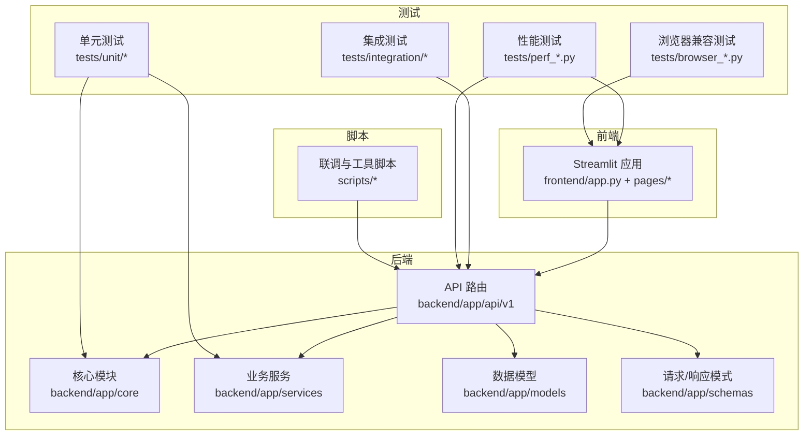
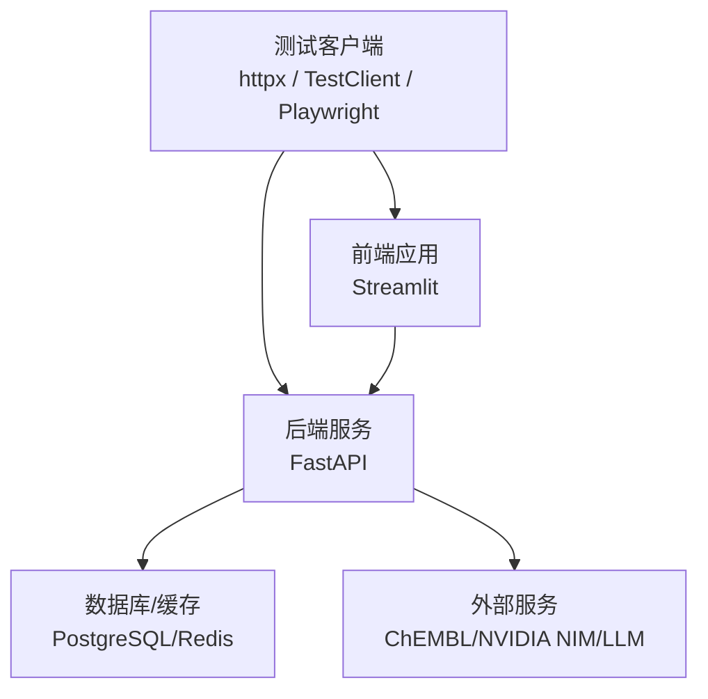
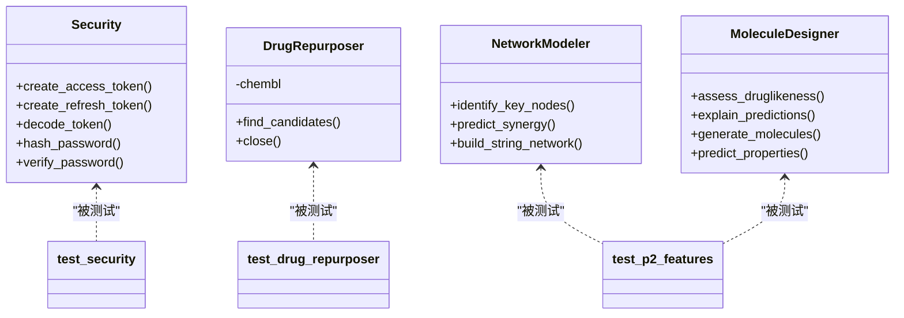
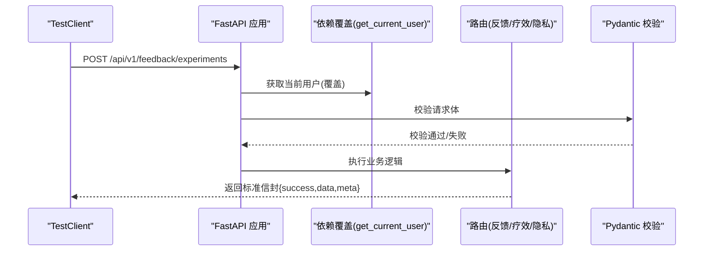
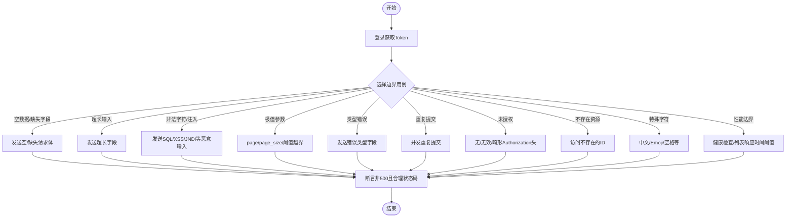
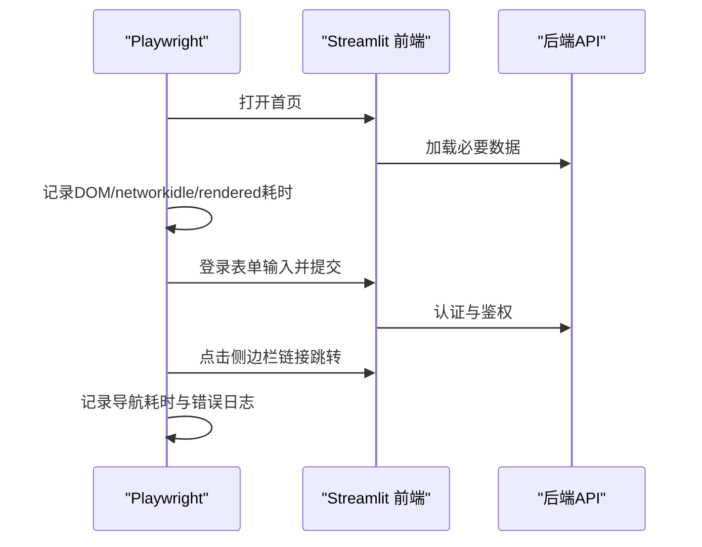
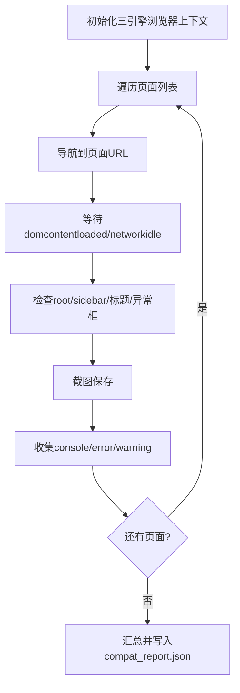
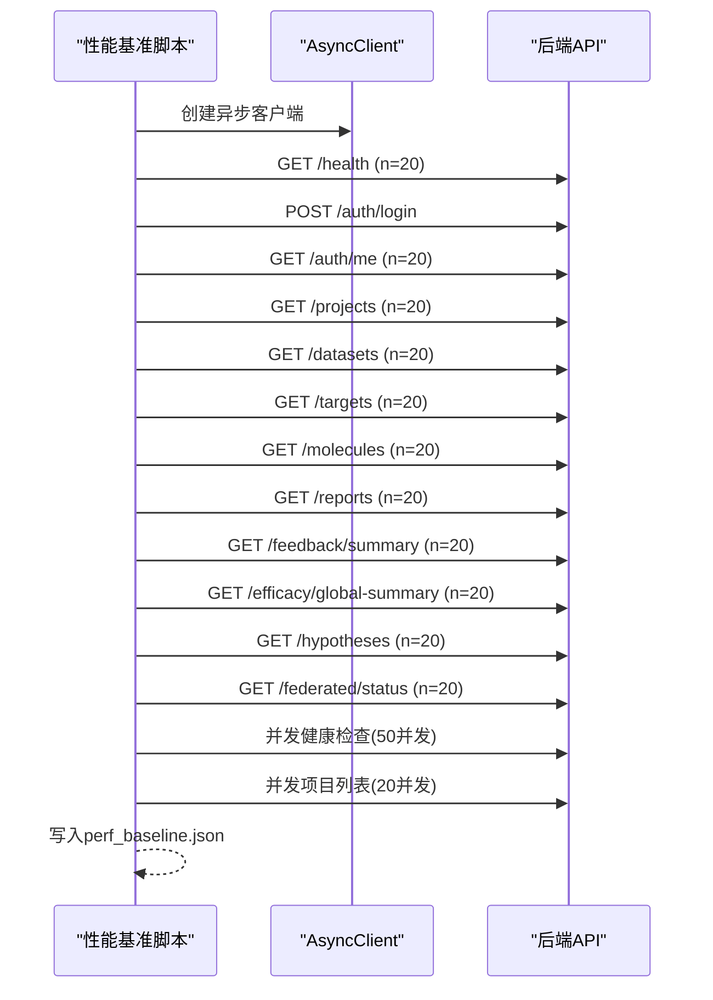
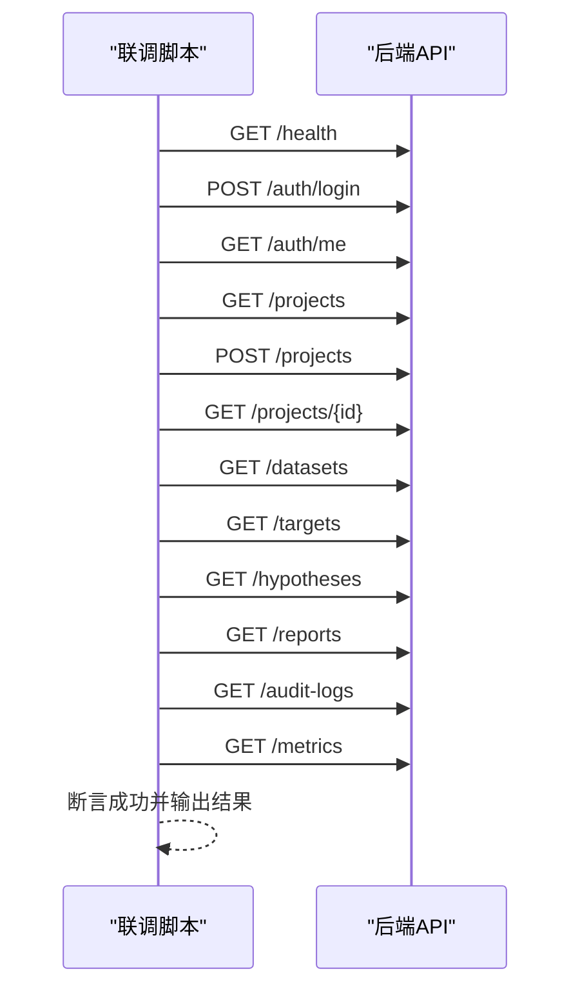
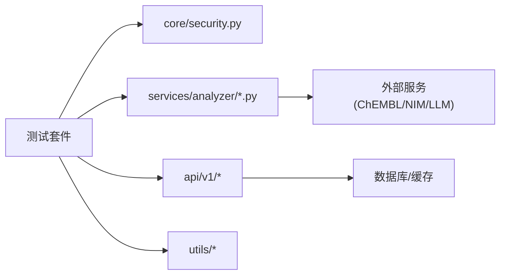

# 测试指南

<cite>
**本文引用的文件**
- [pyproject.toml](file://precision-drug-design/pyproject.toml)
- [conftest.py](file://precision-drug-design/tests/conftest.py)
- [test_api_boundary.py](file://precision-drug-design/tests/test_api_boundary.py)
- [perf_baseline.py](file://precision-drug-design/tests/perf_baseline.py)
- [browser_compat_test.py](file://precision-drug-design/tests/browser_compat_test.py)
- [test_integration.py](file://precision-drug-design/scripts/test_integration.py)
- [test_security.py](file://precision-drug-design/tests/test_security.py)
- [test_drug_repurposer.py](file://precision-drug-design/tests/test_drug_repurposer.py)
- [perf_frontend.py](file://precision-drug-design/tests/perf_frontend.py)
- [test_p2_features.py](file://precision-drug-design/tests/test_p2_features.py)
- [test_p3_api.py](file://precision-drug-design/tests/test_p3_api.py)
</cite>

## 目录
1. [简介](#简介)
2. [项目结构](#项目结构)
3. [核心组件](#核心组件)
4. [架构总览](#架构总览)
5. [详细组件分析](#详细组件分析)
6. [依赖关系分析](#依赖关系分析)
7. [性能考量](#性能考量)
8. [故障排查指南](#故障排查指南)
9. [结论](#结论)
10. [附录](#附录)

## 简介
本指南面向AI药物设计系统的测试工程师与开发者，系统化说明单元测试、集成测试、性能测试与浏览器兼容性测试的实现与使用。内容覆盖pytest配置、测试夹具、Mock策略、覆盖率要求、API边界测试、前端功能测试、性能基准测试、跨浏览器测试的具体实现，并提供编写规范、自动化流程与持续集成建议，帮助团队建立稳定高效的测试体系。

## 项目结构
仓库采用前后端分离的模块化组织：后端基于FastAPI，前端基于Streamlit；测试集中于tests目录，包含单元、集成、性能与浏览器兼容等类型；脚本工具位于scripts目录，提供联调验证与辅助任务。

[无图表来源：该图为概念性结构示意]

**章节来源**
- [README.md:190-235](file://precision-drug-design/README.md#L190-L235)

## 核心组件
本节聚焦测试体系的核心能力与关键实现要点。

- pytest 配置与运行
  - 测试路径、命名约定、异步模式、标记（slow/integration/gpu）与默认选项在配置中集中管理。
  - 覆盖率采集范围与报告输出路径已定义，并设置最低覆盖率阈值。
- 测试夹具与环境
  - conftest 统一注入环境变量与示例数据夹具，确保测试可重复与隔离。
- Mock 策略
  - 对第三方外部依赖（如知识库客户端、NIM/DiffDock 服务）采用 unittest.mock 或 FastAPI TestClient 依赖覆盖进行隔离。
- 覆盖率要求
  - 通过 coverage 插件统计 backend/app/services、core、utils 等核心代码，排除 API、models、schemas 等薄封装层，避免虚高。
- 端到端与联调
  - 提供独立联调脚本，模拟真实用户流程，校验认证、权限、响应信封格式与指标暴露。

**章节来源**
- [pyproject.toml:63-105](file://precision-drug-design/pyproject.toml#L63-L105)
- [conftest.py:1-85](file://precision-drug-design/tests/conftest.py#L1-L85)

## 架构总览
下图展示测试套件如何围绕后端API与前端页面展开，涵盖单元、集成、性能与浏览器兼容四类测试。

[无图表来源：该图为概念性架构示意]

## 详细组件分析

### 单元测试框架与最佳实践
- 目标
  - 以最小依赖验证核心逻辑正确性，保证快速反馈与高稳定性。
- 关键实践
  - 使用 conftest 提供的示例数据夹具减少样板代码。
  - 对异步服务方法使用 @pytest.mark.asyncio 与 AsyncMock。
  - 对安全相关逻辑（JWT、密码哈希）进行正向与异常路径全覆盖。
  - 对可选依赖（如 RDKit）使用条件跳过，保障在无RDKit环境仍可运行基础用例。
- 典型用例
  - 安全模块：令牌签发/解析、密码哈希与校验。
  - 分子重定位器：对外部知识库调用进行Mock，验证候选去重、排序与上限控制。
  - 网络建模与规则评估：在无图神经网络依赖时回退到启发式算法，验证结果结构与约束。

**图表来源**
- [test_security.py:1-94](file://precision-drug-design/tests/test_security.py#L1-L94)
- [test_drug_repurposer.py:1-180](file://precision-drug-design/tests/test_drug_repurposer.py#L1-L180)
- [test_p2_features.py:1-430](file://precision-drug-design/tests/test_p2_features.py#L1-L430)

**章节来源**
- [test_security.py:1-94](file://precision-drug-design/tests/test_security.py#L1-L94)
- [test_drug_repurposer.py:1-180](file://precision-drug-design/tests/test_drug_repurposer.py#L1-L180)
- [test_p2_features.py:1-430](file://precision-drug-design/tests/test_p2_features.py#L1-L430)

### 集成测试方案（FastAPI TestClient）
- 目标
  - 在不启动真实服务器的情况下，验证路由、依赖注入、异常处理与响应信封格式。
- 关键实践
  - 使用 TestClient 构造应用实例，覆盖 get_current_user 依赖以绕过认证。
  - 注册全局异常处理器，确保错误码与响应体一致。
  - 针对 P3 特性（反馈闭环、疗效监测、隐私脱敏）进行端到端场景验证。
- 典型用例
  - 反馈提交与置信度更新、偏差检测、LIMS导入去重、实验追踪状态机。
  - 疗效录入、不良事件上报、Kaplan-Meier估计、多目标优化与Q值更新。
  - 隐私脱敏：直接标识符掩码、敏感字段遮蔽、k-匿名校验。

**图表来源**
- [test_p3_api.py:1-578](file://precision-drug-design/tests/test_p3_api.py#L1-L578)

**章节来源**
- [test_p3_api.py:1-578](file://precision-drug-design/tests/test_p3_api.py#L1-L578)

### API 边界测试（HTTP 客户端）
- 目标
  - 验证系统在异常输入、越权访问、并发与极端参数下的健壮性与安全性。
- 关键实践
  - 使用 httpx 发起真实HTTP请求，先登录获取token，再对受保护端点进行测试。
  - 覆盖空数据、超长输入、非法字符/注入、极值分页、类型错误、重复提交、未授权访问、不存在资源、特殊字符与Unicode、性能边界等。
  - 断言不应出现服务器内部错误（500），且应返回合理的业务错误码。
- 并发与性能
  - 使用线程池并发提交相同靶点反馈，验证幂等与一致性。
  - 对健康检查与列表接口设定响应时间阈值，作为回归基线。

**图表来源**
- [test_api_boundary.py:1-483](file://precision-drug-design/tests/test_api_boundary.py#L1-L483)

**章节来源**
- [test_api_boundary.py:1-483](file://precision-drug-design/tests/test_api_boundary.py#L1-L483)

### 前端功能与性能测试（Playwright）
- 目标
  - 验证各页面加载、渲染、交互与性能表现，捕获控制台错误与网络失败。
- 关键实践
  - 首次加载测量DOM就绪、networkidle与主内容渲染耗时。
  - 登录后侧边栏导航与Tab切换性能测量。
  - 重复访问缓存命中率与首屏体验评估。
- 输出
  - 生成 perf_frontend.json 与可视化报告，便于趋势对比与回归告警。

**图表来源**
- [perf_frontend.py:1-251](file://precision-drug-design/tests/perf_frontend.py#L1-L251)

**章节来源**
- [perf_frontend.py:1-251](file://precision-drug-design/tests/perf_frontend.py#L1-L251)

### 跨浏览器兼容性测试（Playwright）
- 目标
  - 在 Chromium、Firefox、WebKit 三种引擎下验证页面可达性、渲染正确性与JS错误检测。
- 关键实践
  - 遍历所有页面URL，监听 console、pageerror、requestfailed 事件。
  - 截图保存为证据，记录标题、是否包含Streamlit根元素与侧边栏。
  - 汇总每个浏览器的成功/超时/错误数量与有错误的页面数。
- 输出
  - 生成 compat_report.json 与各浏览器子目录截图。

**图表来源**
- [browser_compat_test.py:1-308](file://precision-drug-design/tests/browser_compat_test.py#L1-L308)

**章节来源**
- [browser_compat_test.py:1-308](file://precision-drug-design/tests/browser_compat_test.py#L1-L308)

### 性能基准测试（后端API）
- 目标
  - 测量关键端点的响应时间与并发吞吐，建立性能基线与回归阈值。
- 关键实践
  - 异步并发测量，计算min/max/mean/median/p95等统计量。
  - 登录获取token后批量测量项目、数据集、靶点、分子、报告、反馈、疗效、假设、联邦学习等端点。
  - 并发压力测试：健康检查与项目列表在不同并发度下的成功率与平均耗时。
- 输出
  - 生成 perf_baseline.json 与控制台总结表，便于CI中比较历史基线。

**图表来源**
- [perf_baseline.py:1-353](file://precision-drug-design/tests/perf_baseline.py#L1-L353)

**章节来源**
- [perf_baseline.py:1-353](file://precision-drug-design/tests/perf_baseline.py#L1-L353)

### 前后端联调验证脚本
- 目标
  - 模拟真实用户流程，验证认证、鉴权、响应信封格式与指标暴露。
- 关键实践
  - 健康检查 → 登录 → 获取用户信息 → 项目CRUD → 列表查询 → 审计日志 → Prometheus 指标。
  - 断言无认证访问返回401，响应体包含 success/data/meta 字段。
- 适用场景
  - 本地开发快速验证、部署前冒烟测试、CI中的端到端健康检查。

**图表来源**
- [test_integration.py:1-165](file://precision-drug-design/scripts/test_integration.py#L1-L165)

**章节来源**
- [test_integration.py:1-165](file://precision-drug-design/scripts/test_integration.py#L1-L165)

## 依赖关系分析
- 测试与源码耦合
  - 单元测试直接依赖 services/core/utils 等核心模块，避免耦合API层，提高稳定性。
  - 集成测试通过 TestClient 覆盖依赖，降低对数据库与外部服务的强依赖。
  - 性能与浏览器测试通过HTTP/浏览器协议与系统交互，属于黑盒验证。
- 外部依赖与隔离
  - 使用 Mock 与依赖覆盖隔离 ChEMBL、NVIDIA NIM、LLM 等外部服务。
  - 条件跳过 RDKit 相关用例，保证在无RDKit环境下仍可运行。
- 潜在循环依赖
  - 测试文件仅引用被测模块，不反向引入，避免循环依赖。

**图表来源**
- [test_security.py:1-94](file://precision-drug-design/tests/test_security.py#L1-L94)
- [test_drug_repurposer.py:1-180](file://precision-drug-design/tests/test_drug_repurposer.py#L1-L180)
- [test_p2_features.py:1-430](file://precision-drug-design/tests/test_p2_features.py#L1-L430)
- [test_p3_api.py:1-578](file://precision-drug-design/tests/test_p3_api.py#L1-L578)

**章节来源**
- [pyproject.toml:63-105](file://precision-drug-design/pyproject.toml#L63-L105)
- [conftest.py:1-85](file://precision-drug-design/tests/conftest.py#L1-L85)

## 性能考量
- 基准与阈值
  - 为健康检查、认证、列表、详情、计算、创建等类别定义毫秒级阈值，用于回归判定。
- 并发与吞吐
  - 使用异步并发与gather聚合请求，评估不同并发度下的成功率与平均耗时。
- 前端体验
  - 关注FCP、networkidle与渲染完成时间，结合侧边栏导航与Tab切换耗时综合评估。
- 监控与告警
  - 将性能报告纳入CI，当p95或均值超过阈值时触发告警，推动优化。

[无章节来源：本节为通用指导]

## 故障排查指南
- 常见问题
  - 端口冲突：后端8000、前端8501被占用导致连接失败。
  - 认证失败：JWT密钥不一致或过期，需检查环境变量与登录流程。
  - 外部服务不可用：ChEMBL/NIM/LLM限流或宕机，需Mock或降级处理。
  - 浏览器驱动缺失：Playwright未安装浏览器内核，需执行安装命令。
- 定位步骤
  - 查看控制台错误与网络失败日志（浏览器兼容测试已自动收集）。
  - 检查响应信封格式与错误码是否符合规范。
  - 使用联调脚本逐步验证关键路径，缩小问题范围。
  - 对比性能基线，识别回归点。

**章节来源**
- [browser_compat_test.py:1-308](file://precision-drug-design/tests/browser_compat_test.py#L1-L308)
- [test_integration.py:1-165](file://precision-drug-design/scripts/test_integration.py#L1-L165)

## 结论
本指南构建了从单元到集成、从性能到跨浏览器的完整测试体系。通过pytest集中配置、conftest统一夹具、Mock与依赖覆盖隔离外部依赖、覆盖率门槛保障质量，辅以性能基线与浏览器兼容性报告，形成可回归、可观测、可演进的测试工程化实践。建议在CI中串联全部测试类型，并建立阈值告警与报告归档机制，持续提升系统质量与交付效率。

[无章节来源：本节为总结性内容]

## 附录

### 测试编写规范
- 命名与组织
  - 文件名以 test_ 开头，类名以 Test 开头，函数以 test_ 开头。
  - 按功能域划分测试文件，保持单一职责与高内聚。
- 断言风格
  - 明确断言状态码、响应体字段与业务语义，避免模糊断言。
- 异步测试
  - 使用 @pytest.mark.asyncio 与 AsyncMock，避免阻塞。
- 条件跳过
  - 对可选依赖（如RDKit）使用 skipif，保证跨环境可运行。
- 文档与注释
  - 为复杂用例添加简要注释，说明测试目的与预期行为。

**章节来源**
- [pyproject.toml:63-83](file://precision-drug-design/pyproject.toml#L63-L83)
- [test_p2_features.py:350-430](file://precision-drug-design/tests/test_p2_features.py#L350-L430)

### 自动化测试流程与持续集成建议
- 本地运行
  - 全量测试：pytest
  - 带覆盖率：pytest --cov=backend/app --cov-report=html
  - 跳过慢测：pytest -m "not slow"
- CI流水线建议
  - 阶段一：lint/mypy + 单元测试 + 覆盖率门槛
  - 阶段二：集成测试（TestClient）+ 联调脚本
  - 阶段三：性能基准（后端/前端）+ 浏览器兼容
  - 阶段四：报告归档与告警（覆盖率HTML、性能JSON、兼容报告）
- 环境与依赖
  - 预装Python、Playwright浏览器内核、后端/前端服务。
  - 使用固定版本与缓存加速构建。

**章节来源**
- [pyproject.toml:63-105](file://precision-drug-design/pyproject.toml#L63-L105)
- [test_integration.py:1-165](file://precision-drug-design/scripts/test_integration.py#L1-L165)
- [perf_baseline.py:1-353](file://precision-drug-design/tests/perf_baseline.py#L1-L353)
- [perf_frontend.py:1-251](file://precision-drug-design/tests/perf_frontend.py#L1-L251)
- [browser_compat_test.py:1-308](file://precision-drug-design/tests/browser_compat_test.py#L1-L308)