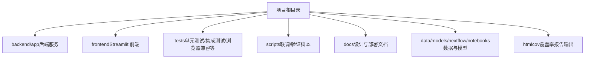
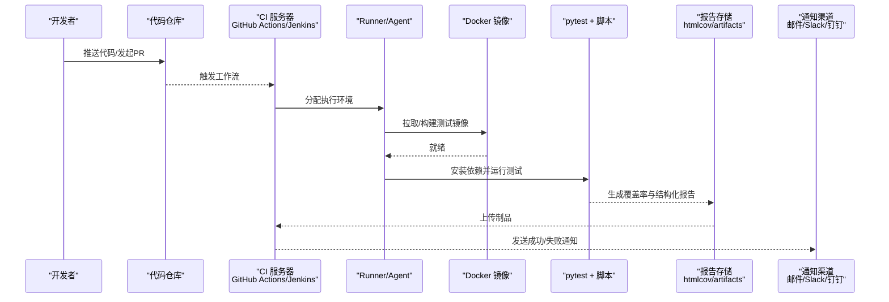
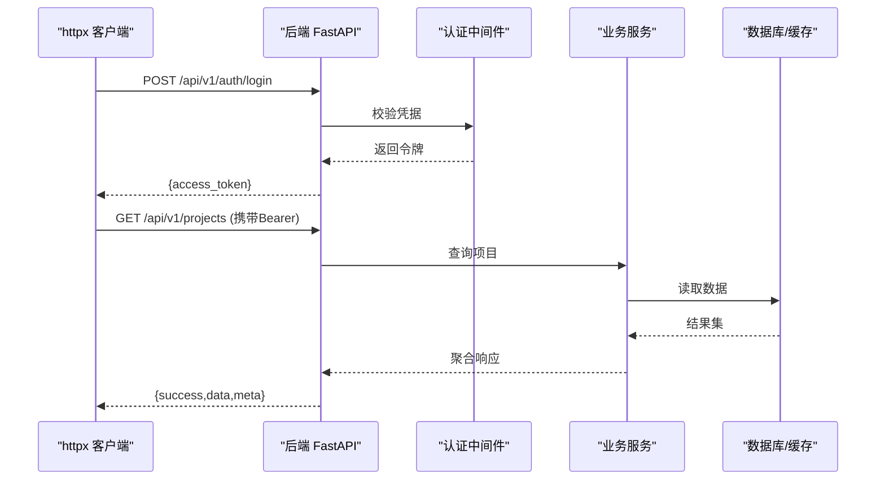
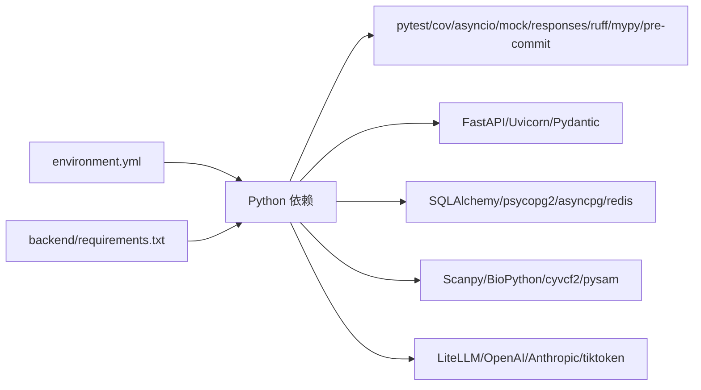

# 测试自动化

<cite>
**本文引用的文件**   
- [README.md](file://precision-drug-design/README.md)
- [pyproject.toml](file://precision-drug-design/pyproject.toml)
- [environment.yml](file://precision-drug-design/environment.yml)
- [backend/requirements.txt](file://precision-drug-design/backend/requirements.txt)
- [tests/conftest.py](file://precision-drug-design/tests/conftest.py)
- [scripts/test_integration.py](file://precision-drug-design/scripts/test_integration.py)
- [scripts/test_p0_endpoints.py](file://precision-drug-design/scripts/test_p0_endpoints.py)
- [scripts/test_p2_endpoints.py](file://precision-drug-design/scripts/test_p2_endpoints.py)
- [scripts/verify_env.py](file://precision-drug-design/scripts/verify_env.py)
- [.gitignore](file://precision-drug-design/.gitignore)
</cite>

## 目录
1. [简介](#简介)
2. [项目结构](#项目结构)
3. [核心组件](#核心组件)
4. [架构总览](#架构总览)
5. [详细组件分析](#详细组件分析)
6. [依赖关系分析](#依赖关系分析)
7. [性能与并行执行](#性能与并行执行)
8. [故障排查指南](#故障排查指南)
9. [结论](#结论)
10. [附录](#附录)

## 简介
本指南面向AI药物设计系统的测试自动化，覆盖持续集成配置、自动化测试流水线、测试报告生成与通知机制。重点说明：
- GitHub Actions/Jenkins 的CI配置思路与步骤
- Docker 容器化测试环境构建与运行
- 并行测试执行策略与结果收集
- 测试套件组织、优先级管理、失败重试与数据清理
- CI/CD 最佳实践与常见故障诊断方法

## 项目结构
仓库采用前后端分离与多子系统架构，测试集中在 tests 目录，脚本工具位于 scripts 目录，测试配置集中于 pyproject.toml 与 conftest.py。

**章节来源**
- [README.md:190-235](file://precision-drug-design/README.md#L190-L235)

## 核心组件
- 测试框架与配置
  - pytest 主配置与标记：在 pyproject.toml 中定义测试路径、异步模式、覆盖率阈值与 markers（slow/integration/gpu）。
  - 全局夹具与环境变量：conftest.py 设置 APP_ENV、JWT_SECRET_KEY、DATABASE_URL、REDIS_URL、LLM API Key 等，确保测试可独立运行。
- 集成与API级验证脚本
  - 前后端联调脚本：test_integration.py 验证健康检查、登录、资源CRUD、审计日志与指标。
  - P0/P2 深化端点脚本：分别覆盖聊天问答、靶点发现、分子性质预测、网络建模、协同效应评估、Dock任务创建等关键能力。
- 环境校验脚本
  - verify_env.py 用于本地或CI环境一致性检查（Python版本、依赖、外部API可达性等）。

**章节来源**
- [pyproject.toml:63-83](file://precision-drug-design/pyproject.toml#L63-L83)
- [tests/conftest.py:1-22](file://precision-drug-design/tests/conftest.py#L1-L22)
- [scripts/test_integration.py:1-165](file://precision-drug-design/scripts/test_integration.py#L1-L165)
- [scripts/test_p0_endpoints.py:1-234](file://precision-drug-design/scripts/test_p0_endpoints.py#L1-L234)
- [scripts/test_p2_endpoints.py:1-291](file://precision-drug-design/scripts/test_p2_endpoints.py#L1-L291)
- [scripts/verify_env.py:204-232](file://precision-drug-design/scripts/verify_env.py#L204-L232)

## 架构总览
下图展示从代码提交到测试执行、报告产出与通知的整体流程，涵盖GitHub Actions/Jenkins两种实现思路。

[此图为概念性流程图，不直接映射具体源码文件]

## 详细组件分析

### 测试套件组织与优先级
- 测试路径与命名
  - 通过 pyproject.toml 指定 testpaths=tests，匹配 test_*.py 文件与 Test* 类。
- 标记与筛选
  - slow：慢测试（CI 可按需跳过）
  - integration：需要外部服务的集成测试
  - gpu：需要 GPU 的测试
- 建议分层
  - 单元层：快速、无IO、纯逻辑断言
  - 集成层：数据库/缓存/外部API（可用 mock 或轻量服务）
  - 端到端层：启动后端服务，调用真实API（使用 httpx）
  - 浏览器兼容层：基于现有 browser_* 脚本进行跨引擎兼容性验证

**章节来源**
- [pyproject.toml:63-83](file://precision-drug-design/pyproject.toml#L63-L83)

### 环境变量与测试数据准备
- 全局环境变量
  - conftest.py 预设 APP_ENV、APP_DEBUG、JWT_SECRET_KEY、DATABASE_URL、REDIS_URL、OPENAI_API_KEY、ANTHROPIC_API_KEY，避免导入应用模块时因缺失配置而失败。
- 示例夹具
  - sample_target、sample_evidence_items、sample_molecules 提供常用测试数据，便于构造请求体与断言响应结构。
- 数据清理策略
  - 建议使用事务回滚或临时数据库（SQLite/内存DB），或在集成测试前初始化、结束后清理；对外部服务使用隔离账号与命名空间。

**章节来源**
- [tests/conftest.py:14-22](file://precision-drug-design/tests/conftest.py#L14-L22)
- [tests/conftest.py:26-85](file://precision-drug-design/tests/conftest.py#L26-L85)

### 集成与API级验证脚本
- 前后端联调脚本（test_integration.py）
  - 顺序：健康检查 → 登录 → 用户信息 → 项目CRUD → 数据集/靶点/假设/报告列表 → 审计日志 → Prometheus 指标 → 认证拦截与响应信封格式校验。
- P0 深化端点（test_p0_endpoints.py）
  - 覆盖 /chat（含安全护栏）、/targets/discover（quick/deep 模式），支持降级路径与错误码断言。
- P2 深化端点（test_p2_endpoints.py）
  - 覆盖分子性质预测、生成式分子设计、可解释性、模型注册表、PPI 网络建模、协同效应评估、类药性评估、DiffDock 任务创建等。

**图示来源**
- [scripts/test_integration.py:23-148](file://precision-drug-design/scripts/test_integration.py#L23-L148)

**章节来源**
- [scripts/test_integration.py:1-165](file://precision-drug-design/scripts/test_integration.py#L1-L165)
- [scripts/test_p0_endpoints.py:1-234](file://precision-drug-design/scripts/test_p0_endpoints.py#L1-L234)
- [scripts/test_p2_endpoints.py:1-291](file://precision-drug-design/scripts/test_p2_endpoints.py#L1-L291)

### 覆盖率与报告
- 覆盖率范围与阈值
  - source 限定 services/core/utils，忽略 api/models/schemas/main.py 等，fail_under=75（可在CI提升为更高阈值）。
- 报告输出
  - 终端缺失行报告与 htmlcov 静态站点，便于归档与对比。
- 产物归档
  - 将 htmlcov 目录作为制品上传，供后续查看与发布。

**章节来源**
- [pyproject.toml:70-78](file://precision-drug-design/pyproject.toml#L70-L78)
- [pyproject.toml:85-95](file://precision-drug-design/pyproject.toml#L85-L95)
- [pyproject.toml:97-105](file://precision-drug-design/pyproject.toml#L97-L105)

### 失败重试与稳定性
- 建议策略
  - 对网络抖动的外部API调用增加指数退避重试（如 tenacity）
  - 对非确定性用例（并发/随机种子）固定随机种子
  - 针对不稳定测试单独标记 flaky 并在CI中启用有限次重试
- 注意
  - 重试不应掩盖真正的缺陷，需配合日志与截图/抓包定位问题

[本节为通用指导，不直接分析具体文件]

### 测试数据清理策略
- 数据库
  - 优先使用内存数据库或事务回滚；若必须用真实库，则在 fixture 中创建/删除对象，或使用唯一前缀命名避免冲突。
- 文件系统与对象存储
  - 使用临时目录（如 tempfile）与命名空间隔离；测试结束统一清理。
- 外部服务
  - 使用沙箱/测试账号；必要时在测试后调用清理接口。

[本节为通用指导，不直接分析具体文件]

## 依赖关系分析
- Python 环境与依赖
  - environment.yml 定义了系统级依赖（OpenJDK、Node.js、Graphviz、Pandoc）与生物信息学核心库（Scanpy、Anndata、BioPython、cyvcf2、pysam）。
  - backend/requirements.txt 汇总了Web框架、ORM、数据库驱动、向量检索、LLM网关、可视化与测试工具链。
- 测试相关依赖
  - pytest、pytest-cov、pytest-asyncio、pytest-mock、responses、ruff、mypy、pre-commit 等。

**图示来源**
- [environment.yml:1-103](file://precision-drug-design/environment.yml#L1-L103)
- [backend/requirements.txt:1-100](file://precision-drug-design/backend/requirements.txt#L1-L100)

**章节来源**
- [environment.yml:1-103](file://precision-drug-design/environment.yml#L1-L103)
- [backend/requirements.txt:1-100](file://precision-drug-design/backend/requirements.txt#L1-L100)

## 性能与并行执行
- 并行策略
  - 使用 pytest-xdist 按模块/文件并行，结合 markers 将 slow/integration/gpu 分流至不同队列。
- 资源隔离
  - 每个并行进程使用独立的数据库实例/端口与Redis DB号，避免竞争。
- 超时与限流
  - 对外部API调用设置合理超时；对长耗时任务采用异步+轮询或消息队列。
- 覆盖率合并
  - 并行完成后合并 .coverage 数据再生成最终报告。

[本节为通用指导，不直接分析具体文件]

## 故障排查指南
- 常见问题
  - 环境变量缺失：确认 conftest.py 已注入必要键值，或CI Secret 已正确挂载。
  - 数据库连接失败：检查 DATABASE_URL、端口、权限与防火墙。
  - Redis不可达：确认 REDIS_URL 与端口连通性。
  - LLM未配置：走降级路径，应返回明确错误提示而非崩溃。
  - RDKit/生信库缺失：在CI镜像中预装或通过conda安装对应二进制。
- 定位手段
  - 开启详细日志（Loguru），捕获请求ID与堆栈
  - 保存失败时的响应体与上下文快照
  - 使用 verify_env.py 进行环境自检
- 参考脚本
  - 联调与端点验证脚本可直接复用在CI中，辅助快速定位问题域

**章节来源**
- [tests/conftest.py:14-22](file://precision-drug-design/tests/conftest.py#L14-L22)
- [scripts/verify_env.py:204-232](file://precision-drug-design/scripts/verify_env.py#L204-L232)
- [scripts/test_integration.py:1-165](file://precision-drug-design/scripts/test_integration.py#L1-L165)

## 结论
通过明确的测试分层、严格的标记与筛选、稳定的环境变量与数据清理策略，以及完善的覆盖率与报告体系，本项目的测试自动化具备高可维护性与可扩展性。建议在CI中引入并行执行与制品归档，并结合通知机制形成闭环反馈，持续提升交付质量与效率。

[本节为总结性内容，不直接分析具体文件]

## 附录

### CI/CD 集成最佳实践（GitHub Actions 与 Jenkins）
- GitHub Actions
  - 触发条件：push/PR 到 main/develop/feature/*
  - 矩阵策略：Python 3.11/3.13、PostgreSQL/Redis 服务容器
  - 步骤：构建镜像→安装依赖→运行单元/集成/端到端→生成覆盖率→上传制品→通知
- Jenkins
  - Pipeline 阶段：Checkout→Build Image→Install Deps→Run Tests→Publish Reports→Archive Artifacts→Notify
  - 使用共享库封装通用步骤（环境准备、报告上传、通知）
- 制品与报告
  - 归档 htmlcov、e2e 报告 JSON、测试日志
  - 可选：将覆盖率趋势接入 SonarQube 或自定义看板
- 通知机制
  - 成功/失败均发送通知（邮件/Slack/钉钉/企业微信），附带报告链接与失败用例摘要

[本节为通用指导，不直接分析具体文件]

### Docker 容器化测试环境
- 基础镜像
  - 选择 python:3.11-slim 或官方镜像，安装 OpenJDK/Node.js/Graphviz/Pandoc 等系统依赖
- 依赖安装
  - 优先使用 conda 安装生物信息学库，再 pip 安装其余依赖
- 运行测试
  - 以只读方式挂载代码，使用独立数据卷存放 SQLite/Chroma 等状态
  - 暴露必要端口（如需访问被测服务）
- 缓存优化
  - 缓存 conda/pip 下载与构建产物，缩短CI时间

[本节为通用指导，不直接分析具体文件]

### 测试清单与命令速查
- 运行全部测试（含覆盖率）
  - 参考 README 中的 pytest 命令
- 仅运行特定标记
  - 跳过慢测试：pytest -m "not slow"
  - 仅运行集成测试：pytest -m "integration"
- 生成HTML覆盖率
  - 参考 pyproject.toml 的 addopts 配置

**章节来源**
- [README.md:342-373](file://precision-drug-design/README.md#L342-L373)
- [pyproject.toml:70-78](file://precision-drug-design/pyproject.toml#L70-L78)

### 忽略规则与产物清理
- .gitignore 已排除测试缓存、覆盖率产物、日志与大文件，避免污染仓库
- CI 中按需保留 artifacts，定期清理历史制品

**章节来源**
- [.gitignore:51-120](file://precision-drug-design/.gitignore#L51-L120)