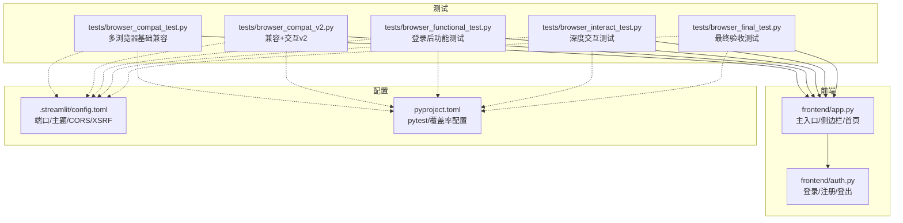
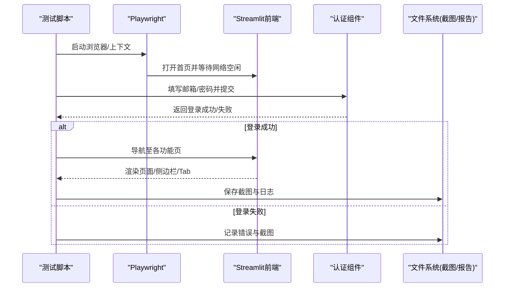
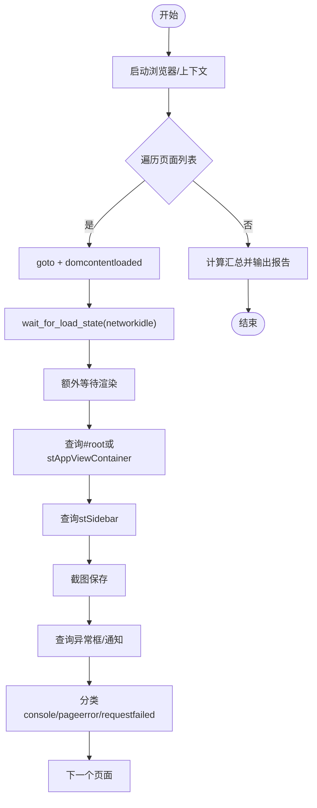
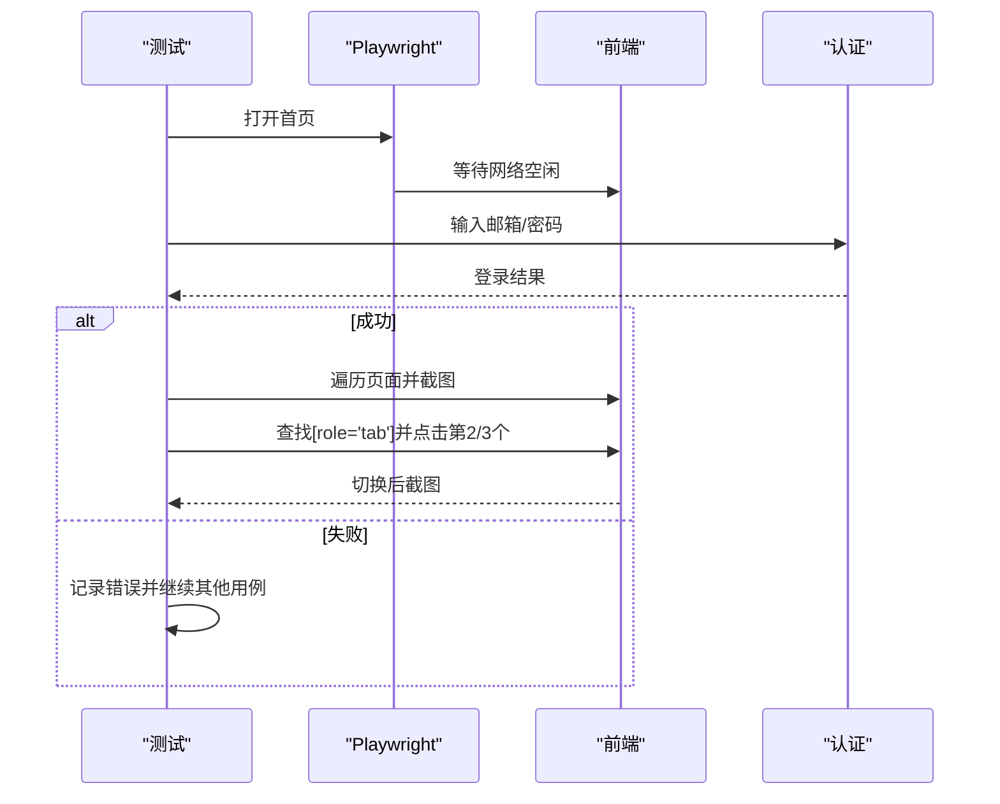
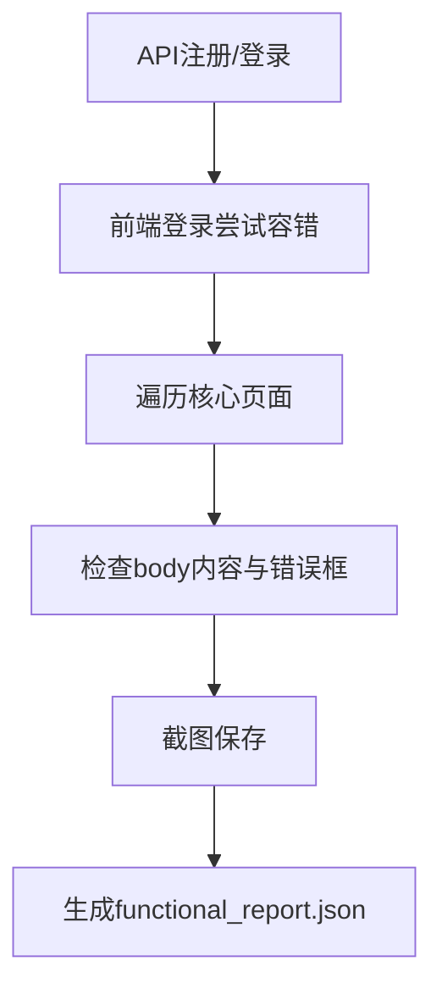
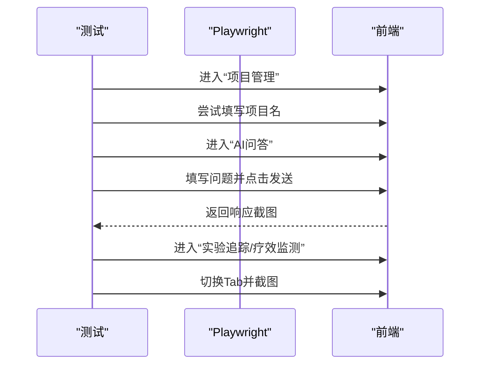
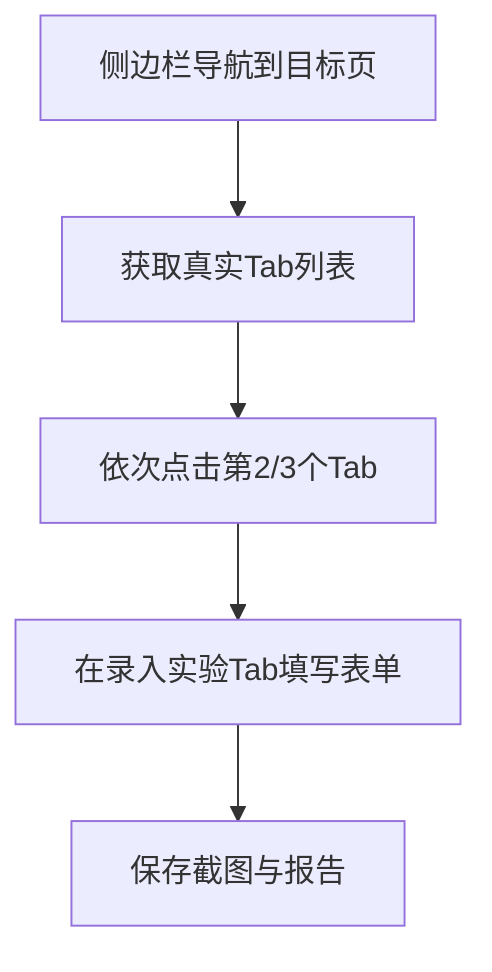
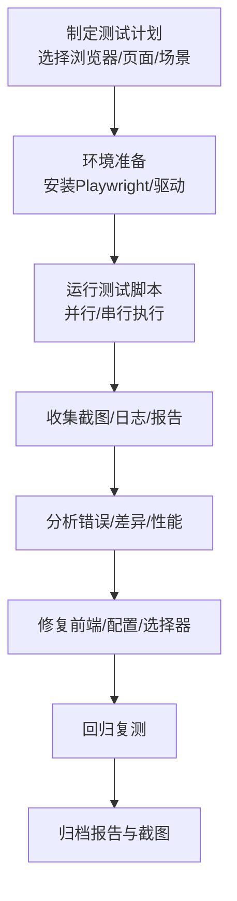
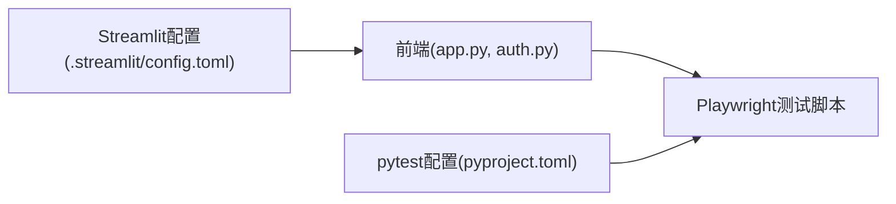

# 浏览器兼容性测试

<cite>
**本文引用的文件**   
- [tests/browser_compat_test.py](file://precision-drug-design/tests/browser_compat_test.py)
- [tests/browser_compat_v2.py](file://precision-drug-design/tests/browser_compat_v2.py)
- [tests/browser_functional_test.py](file://precision-drug-design/tests/browser_functional_test.py)
- [tests/browser_interact_test.py](file://precision-drug-design/tests/browser_interact_test.py)
- [tests/browser_final_test.py](file://precision-drug-design/tests/browser_final_test.py)
- [frontend/app.py](file://precision-drug-design/frontend/app.py)
- [frontend/auth.py](file://precision-drug-design/frontend/auth.py)
- [.streamlit/config.toml](file://precision-drug-design/.streamlit/config.toml)
- [pyproject.toml](file://precision-drug-design/pyproject.toml)
</cite>

## 目录
1. [简介](#简介)
2. [项目结构](#项目结构)
3. [核心组件](#核心组件)
4. [架构总览](#架构总览)
5. [详细组件分析](#详细组件分析)
6. [依赖关系分析](#依赖关系分析)
7. [性能与稳定性考量](#性能与稳定性考量)
8. [故障排查指南](#故障排查指南)
9. [结论](#结论)
10. [附录：自动化流程与截图对比](#附录自动化流程与截图对比)

## 简介
本指南面向AI药物设计系统的浏览器兼容性测试，聚焦于使用Playwright对Streamlit前端进行跨浏览器（Chromium、Firefox、WebKit）验证。内容涵盖：
- Playwright框架配置与环境准备
- 跨浏览器页面可达性与渲染一致性
- 响应式布局与侧边栏导航
- 用户交互（登录、表单提交、Tab切换、动态内容）
- 自动化测试流程、截图证据与报告汇总
- 常见问题定位与优化建议

## 项目结构
本项目采用前后端分离的Streamlit前端+FastAPI后端架构。前端入口位于frontend/app.py，认证逻辑在frontend/auth.py；浏览器兼容性测试脚本集中于tests目录下，分别覆盖基础兼容、增强交互、功能闭环与最终验收等维度。

图表来源
- [frontend/app.py:1-157](file://precision-drug-design/frontend/app.py#L1-L157)
- [frontend/auth.py:1-137](file://precision-drug-design/frontend/auth.py#L1-L137)
- [tests/browser_compat_test.py:1-308](file://precision-drug-design/tests/browser_compat_test.py#L1-L308)
- [tests/browser_compat_v2.py:1-297](file://precision-drug-design/tests/browser_compat_v2.py#L1-L297)
- [tests/browser_functional_test.py:1-315](file://precision-drug-design/tests/browser_functional_test.py#L1-L315)
- [tests/browser_interact_test.py:1-347](file://precision-drug-design/tests/browser_interact_test.py#L1-L347)
- [tests/browser_final_test.py:1-304](file://precision-drug-design/tests/browser_final_test.py#L1-L304)
- [.streamlit/config.toml:1-16](file://precision-drug-design/.streamlit/config.toml#L1-L16)
- [pyproject.toml:63-83](file://precision-drug-design/pyproject.toml#L63-L83)

章节来源
- [frontend/app.py:1-157](file://precision-drug-design/frontend/app.py#L1-L157)
- [frontend/auth.py:1-137](file://precision-drug-design/frontend/auth.py#L1-L137)
- [.streamlit/config.toml:1-16](file://precision-drug-design/.streamlit/config.toml#L1-L16)
- [pyproject.toml:63-83](file://precision-drug-design/pyproject.toml#L63-L83)

## 核心组件
- 前端主入口与侧边栏导航：负责页面路由、侧边栏菜单、登录态展示与快速入口。
- 认证组件：提供登录/注册表单、错误提示、会话状态管理。
- 测试套件：
  - 基础兼容：遍历12个页面，检查加载状态、控制台错误、截图与关键UI元素。
  - 兼容v2：增加登录、Tab切换与更多截图断点。
  - 功能测试：通过API预注册/登录，再在前端执行核心页面访问与截图。
  - 深度交互：模拟创建项目、AI问答输入与发送、实验追踪/疗效监测Tab切换。
  - 最终验收：侧边栏展开、导航到指定页面、Tab切换与表单填写断点。

章节来源
- [frontend/app.py:43-65](file://precision-drug-design/frontend/app.py#L43-L65)
- [frontend/auth.py:10-137](file://precision-drug-design/frontend/auth.py#L10-L137)
- [tests/browser_compat_test.py:34-48](file://precision-drug-design/tests/browser_compat_test.py#L34-L48)
- [tests/browser_compat_v2.py:34-48](file://precision-drug-design/tests/browser_compat_v2.py#L34-L48)
- [tests/browser_functional_test.py:45-81](file://precision-drug-design/tests/browser_functional_test.py#L45-L81)
- [tests/browser_interact_test.py:100-202](file://precision-drug-design/tests/browser_interact_test.py#L100-L202)
- [tests/browser_final_test.py:65-153](file://precision-drug-design/tests/browser_final_test.py#L65-L153)

## 架构总览
下图展示了从测试脚本到前端页面的调用链与数据流，包括登录、页面导航、交互与截图保存。

图表来源
- [tests/browser_compat_v2.py:51-84](file://precision-drug-design/tests/browser_compat_v2.py#L51-L84)
- [tests/browser_final_test.py:37-62](file://precision-drug-design/tests/browser_final_test.py#L37-L62)
- [frontend/auth.py:10-66](file://precision-drug-design/frontend/auth.py#L10-L66)
- [frontend/app.py:43-65](file://precision-drug-design/frontend/app.py#L43-L65)

## 详细组件分析

### 组件A：多浏览器基础兼容测试
- 目标：在Chromium/Firefox/WebKit中遍历12个页面，检测加载状态、控制台错误、请求失败、截图与关键UI元素（根容器、侧边栏）。
- 关键点：
  - 监听console/pageerror/requestfailed事件，过滤favicon等无害错误。
  - 使用domcontentloaded+networkidle双重等待，兼顾Streamlit重客户端特性。
  - 输出JSON报告与按浏览器分目录的截图。

图表来源
- [tests/browser_compat_test.py:85-175](file://precision-drug-design/tests/browser_compat_test.py#L85-L175)
- [tests/browser_compat_test.py:178-222](file://precision-drug-design/tests/browser_compat_test.py#L178-L222)
- [tests/browser_compat_test.py:225-308](file://precision-drug-design/tests/browser_compat_test.py#L225-L308)

章节来源
- [tests/browser_compat_test.py:1-308](file://precision-drug-design/tests/browser_compat_test.py#L1-L308)

### 组件B：兼容+交互v2（含登录与Tab切换）
- 新增能力：
  - 自动登录（支持Enter提交），校验登录成功标志。
  - 页面渲染断言（body文本长度、错误框检测）。
  - Tab切换测试（排除登录/注册Tab），截图初始/第二/第三Tab。
- 适用场景：需要端到端体验验证与更丰富的交互断点。

图表来源
- [tests/browser_compat_v2.py:51-84](file://precision-drug-design/tests/browser_compat_v2.py#L51-L84)
- [tests/browser_compat_v2.py:132-189](file://precision-drug-design/tests/browser_compat_v2.py#L132-L189)

章节来源
- [tests/browser_compat_v2.py:1-297](file://precision-drug-design/tests/browser_compat_v2.py#L1-L297)

### 组件C：登录后功能测试（API预置账号）
- 特点：
  - 通过后端API先注册/登录获取token，避免前端登录不稳定。
  - 重点验证核心页面（项目管理、数据集、靶点发现、AI问答、联邦学习、实验追踪、疗效监测）的加载与错误框。
- 优势：提高稳定性与可重复性，适合CI环境。

图表来源
- [tests/browser_functional_test.py:45-81](file://precision-drug-design/tests/browser_functional_test.py#L45-L81)
- [tests/browser_functional_test.py:84-172](file://precision-drug-design/tests/browser_functional_test.py#L84-L172)
- [tests/browser_functional_test.py:175-213](file://precision-drug-design/tests/browser_functional_test.py#L175-L213)

章节来源
- [tests/browser_functional_test.py:1-315](file://precision-drug-design/tests/browser_functional_test.py#L1-L315)

### 组件D：深度交互测试（表单/问答/Tab）
- 场景：
  - 项目管理：尝试填写项目名（若存在表单）。
  - AI问答：填写问题并点击发送按钮，等待响应。
  - 实验追踪/疗效监测：Tab切换与截图。
- 价值：覆盖真实用户操作路径，验证动态内容渲染与交互可用性。

图表来源
- [tests/browser_interact_test.py:100-202](file://precision-drug-design/tests/browser_interact_test.py#L100-L202)
- [tests/browser_interact_test.py:205-241](file://precision-drug-design/tests/browser_interact_test.py#L205-L241)

章节来源
- [tests/browser_interact_test.py:1-347](file://precision-drug-design/tests/browser_interact_test.py#L1-L347)

### 组件E：最终验收测试（侧边栏导航+Tab+表单）
- 能力：
  - 展开侧边栏“View more”，通过链接导航到目标页面。
  - 筛选真实Tab（排除登录/注册），多次切换并截图。
  - 在“录入实验”Tab尝试填写靶点Symbol字段。
- 用途：回归验收与发布前质量门禁。

图表来源
- [tests/browser_final_test.py:65-91](file://precision-drug-design/tests/browser_final_test.py#L65-L91)
- [tests/browser_final_test.py:94-153](file://precision-drug-design/tests/browser_final_test.py#L94-L153)
- [tests/browser_final_test.py:156-208](file://precision-drug-design/tests/browser_final_test.py#L156-L208)

章节来源
- [tests/browser_final_test.py:1-304](file://precision-drug-design/tests/browser_final_test.py#L1-L304)

### 概念总览（非代码映射）
以下流程图概括了浏览器兼容性测试的整体工作流，便于理解整体步骤与产出物。

## 依赖关系分析
- 前端依赖：
  - Streamlit配置：端口、主题、CORS与XSRF开关影响跨域与安全性。
  - 认证组件：登录/注册表单、错误提示与会话状态。
- 测试依赖：
  - Playwright同步API用于页面控制、事件监听与截图。
  - pytest配置定义了测试路径与覆盖率规则（虽未直接用于Playwright脚本，但统一了测试生态）。

图表来源
- [.streamlit/config.toml:1-16](file://precision-drug-design/.streamlit/config.toml#L1-L16)
- [frontend/app.py:1-157](file://precision-drug-design/frontend/app.py#L1-L157)
- [frontend/auth.py:1-137](file://precision-drug-design/frontend/auth.py#L1-L137)
- [pyproject.toml:63-83](file://precision-drug-design/pyproject.toml#L63-L83)

章节来源
- [.streamlit/config.toml:1-16](file://precision-drug-design/.streamlit/config.toml#L1-L16)
- [pyproject.toml:63-83](file://precision-drug-design/pyproject.toml#L63-L83)

## 性能与稳定性考量
- 等待策略：优先使用domcontentloaded+networkidle组合，必要时追加固定sleep以适配Streamlit渲染节奏。
- 超时设置：为navigation与networkidle设置合理超时，避免长时间阻塞。
- 资源拦截：可在context层屏蔽无关资源（如字体、统计脚本）以提升速度（按需扩展）。
- 并发与隔离：每个浏览器独立BrowserContext，避免状态污染；截图按浏览器与页面分目录组织。
- 断言粒度：结合body文本长度、错误框检测与关键UI元素存在性，平衡稳定性与准确性。

## 故障排查指南
- 登录失败
  - 现象：无法找到邮箱/密码输入框或登录按钮。
  - 排查：确认前端是否处于演示模式或未登录；检查选择器优先级与页面结构变化；查看after_login.png截图。
  - 参考实现：
    - [tests/browser_compat_v2.py:51-84](file://precision-drug-design/tests/browser_compat_v2.py#L51-L84)
    - [tests/browser_functional_test.py:84-172](file://precision-drug-design/tests/browser_functional_test.py#L84-L172)
    - [frontend/auth.py:10-66](file://precision-drug-design/frontend/auth.py#L10-L66)
- 页面加载超时
  - 现象：networkidle超时或domcontentloaded后仍无内容。
  - 排查：检查后端服务是否可用；适当增大超时；查看控制台错误与requestfailed日志。
  - 参考实现：
    - [tests/browser_compat_test.py:105-115](file://precision-drug-design/tests/browser_compat_test.py#L105-L115)
    - [tests/browser_compat_v2.py:100-105](file://precision-drug-design/tests/browser_compat_v2.py#L100-L105)
- Tab切换无效
  - 现象：找不到[role='tab']或点击无响应。
  - 排查：确认页面确实包含多个Tab；排除登录/注册Tab；使用force点击与更长等待。
  - 参考实现：
    - [tests/browser_compat_v2.py:132-189](file://precision-drug-design/tests/browser_compat_v2.py#L132-L189)
    - [tests/browser_final_test.py:94-153](file://precision-drug-design/tests/browser_final_test.py#L94-L153)
- 表单填写失败
  - 现象：无法定位输入框或提交按钮。
  - 排查：使用多种选择器回退；查看available inputs信息；确认当前Tab已激活。
  - 参考实现：
    - [tests/browser_final_test.py:156-208](file://precision-drug-design/tests/browser_final_test.py#L156-L208)
    - [tests/browser_interact_test.py:100-202](file://precision-drug-design/tests/browser_interact_test.py#L100-L202)

章节来源
- [tests/browser_compat_v2.py:51-84](file://precision-drug-design/tests/browser_compat_v2.py#L51-L84)
- [tests/browser_functional_test.py:84-172](file://precision-drug-design/tests/browser_functional_test.py#L84-L172)
- [tests/browser_final_test.py:94-208](file://precision-drug-design/tests/browser_final_test.py#L94-L208)
- [tests/browser_interact_test.py:100-202](file://precision-drug-design/tests/browser_interact_test.py#L100-L202)
- [frontend/auth.py:10-66](file://precision-drug-design/frontend/auth.py#L10-L66)

## 结论
通过分层测试（基础兼容、交互增强、功能闭环、最终验收），配合截图与结构化报告，能够系统性地保障AI药物设计系统在主流浏览器上的可用性与一致性。建议在CI中集成这些脚本，形成持续的质量门禁。

## 附录：自动化流程与截图对比
- 本地运行
  - 启动后端与Streamlit服务（默认端口见配置）。
  - 执行对应测试脚本，观察控制台输出与生成的报告/截图。
- CI集成建议
  - 安装Python与Playwright驱动。
  - 启动后端与前端服务。
  - 运行测试脚本并上传artifact（报告与截图）。
- 截图对比思路
  - 将不同浏览器的同页面截图保存到同名文件，借助图像比对工具（如像素级diff或感知哈希）识别视觉差异。
  - 针对关键区域（标题、表格、图表）裁剪后再比对，降低误报。
  - 将差异截图纳入报告，辅助定位渲染不一致问题。

章节来源
- [.streamlit/config.toml:8-12](file://precision-drug-design/.streamlit/config.toml#L8-L12)
- [tests/browser_compat_test.py:252-256](file://precision-drug-design/tests/browser_compat_test.py#L252-L256)
- [tests/browser_compat_v2.py:266-270](file://precision-drug-design/tests/browser_compat_v2.py#L266-L270)
- [tests/browser_functional_test.py:293-297](file://precision-drug-design/tests/browser_functional_test.py#L293-L297)
- [tests/browser_interact_test.py:327-331](file://precision-drug-design/tests/browser_interact_test.py#L327-L331)
- [tests/browser_final_test.py:283-285](file://precision-drug-design/tests/browser_final_test.py#L283-L285)