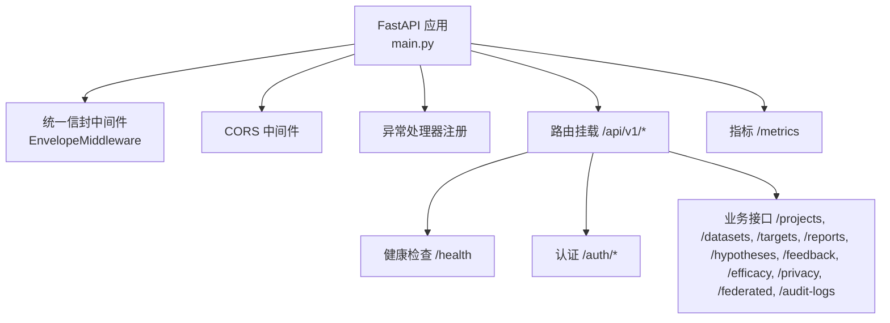
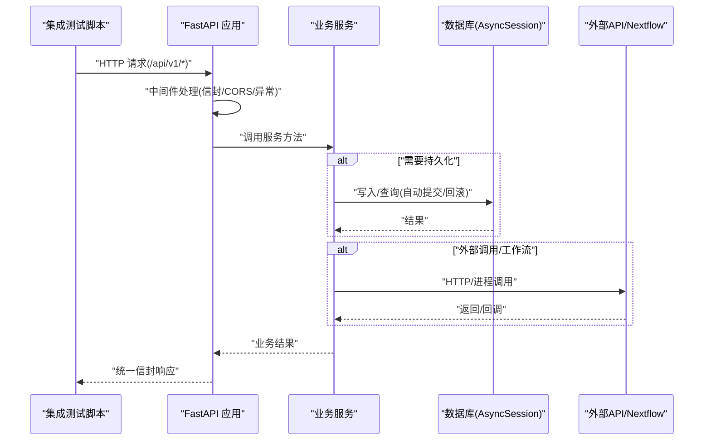
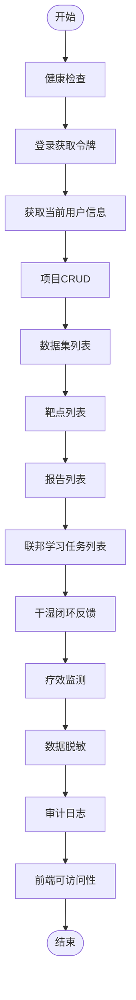
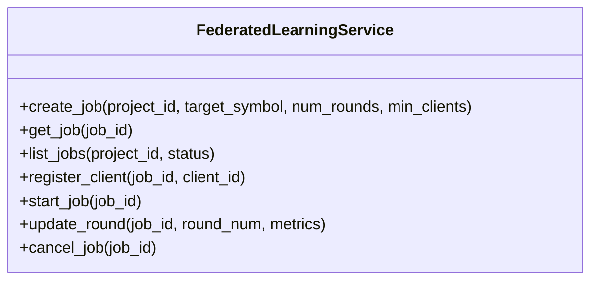
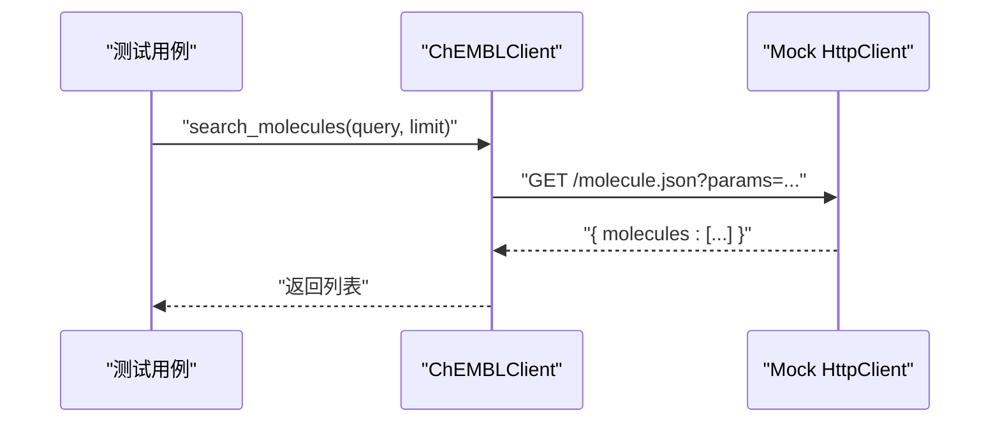
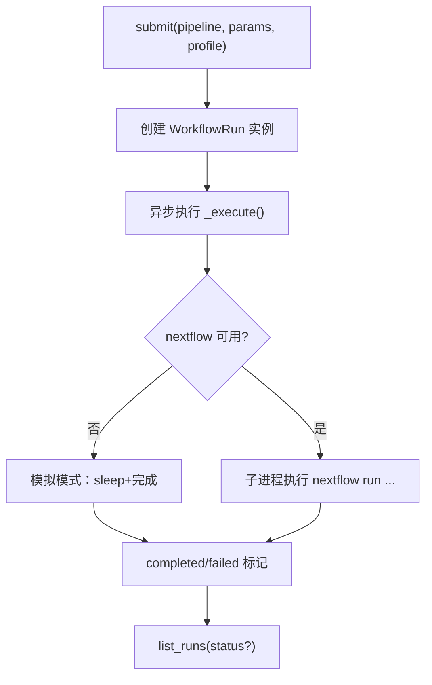
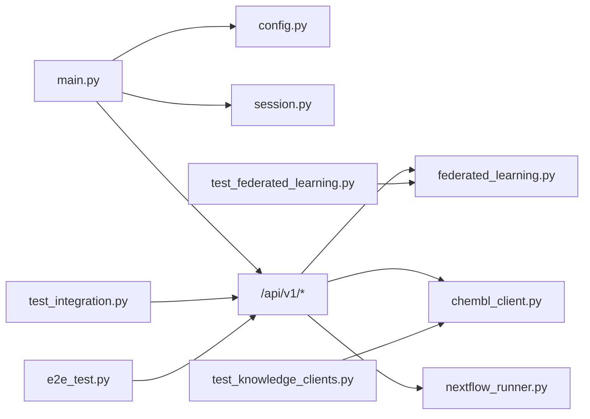

# 集成测试

<cite>
**本文引用的文件**   
- [README.md](file://precision-drug-design/README.md)
- [main.py](file://precision-drug-design/backend/app/main.py)
- [config.py](file://precision-drug-design/backend/app/core/config.py)
- [session.py](file://precision-drug-design/backend/app/db/session.py)
- [test_integration.py](file://precision-drug-design/scripts/test_integration.py)
- [e2e_test.py](file://precision-drug-design/tests/e2e_test.py)
- [test_api_boundary.py](file://precision-drug-design/tests/test_api_boundary.py)
- [conftest.py](file://precision-drug-design/tests/conftest.py)
- [federated_learning.py](file://precision-drug-design/backend/app/services/optimizer/federated_learning.py)
- [test_federated_learning.py](file://precision-drug-design/tests/test_federated_learning.py)
- [chembl_client.py](file://precision-drug-design/backend/app/services/knowledge/chembl_client.py)
- [test_knowledge_clients.py](file://precision-drug-design/tests/test_knowledge_clients.py)
- [nextflow_runner.py](file://precision-drug-design/backend/app/services/workflow/nextflow_runner.py)
</cite>

## 目录
1. [简介](#简介)
2. [项目结构](#项目结构)
3. [核心组件](#核心组件)
4. [架构总览](#架构总览)
5. [详细组件分析](#详细组件分析)
6. [依赖关系分析](#依赖关系分析)
7. [性能考虑](#性能考虑)
8. [故障排查指南](#故障排查指南)
9. [结论](#结论)
10. [附录](#附录)

## 简介
本指南面向AI药物设计系统的集成测试，覆盖模块间交互、数据库集成、外部API调用与服务间通信。重点包括：
- 测试数据库设置与事务回滚策略
- 异步任务与工作流（Nextflow）集成测试
- 联邦学习流程的端到端验证
- 知识库客户端（ChEMBL/MyGene/MyVariant/PubMed）集成测试
- 工作流管道（Nextflow Runner）集成测试
- 集成测试环境配置、测试数据管理与性能优化建议

## 项目结构
后端采用 FastAPI + SQLAlchemy 异步会话管理；前端为 Streamlit。测试体系包含：
- 脚本级联调：scripts/test_integration.py
- 端到端流程：tests/e2e_test.py
- API边界与健壮性：tests/test_api_boundary.py
- 服务层单元测试：tests/test_federated_learning.py、tests/test_knowledge_clients.py
- 应用入口与中间件：backend/app/main.py
- 配置与环境变量：backend/app/core/config.py
- 数据库会话与事务：backend/app/db/session.py
- 联邦学习服务：backend/app/services/optimizer/federated_learning.py
- 知识库客户端：backend/app/services/knowledge/chembl_client.py
- 工作流运行器：backend/app/services/workflow/nextflow_runner.py

图示来源
- [main.py:187-248](file://precision-drug-design/backend/app/main.py#L187-L248)

章节来源
- [README.md:190-235](file://precision-drug-design/README.md#L190-L235)
- [main.py:187-248](file://precision-drug-design/backend/app/main.py#L187-L248)

## 核心组件
- 应用工厂与中间件：创建 FastAPI 实例，注入统一信封响应中间件、CORS、异常处理器，并挂载 v1 路由与健康/指标端点。
- 配置中心：基于 pydantic-settings 的环境变量加载，提供数据库、Redis、对象存储、LLM、外部知识库、联邦学习等配置项。
- 数据库会话：提供同步/异步引擎与会话工厂，请求级自动提交/回滚。
- 集成测试脚本：前后端联调与端到端业务流程验证。
- 联邦学习服务：任务生命周期管理（创建、注册客户端、启动、轮次更新、完成/取消）。
- 知识库客户端：对外部生物医学数据库的封装与错误容错。
- 工作流运行器：Nextflow 任务提交、状态追踪与日志聚合（支持模拟模式）。

章节来源
- [main.py:187-248](file://precision-drug-design/backend/app/main.py#L187-L248)
- [config.py:21-144](file://precision-drug-design/backend/app/core/config.py#L21-L144)
- [session.py:94-128](file://precision-drug-design/backend/app/db/session.py#L94-L128)
- [test_integration.py:1-165](file://precision-drug-design/scripts/test_integration.py#L1-L165)
- [e2e_test.py:1-428](file://precision-drug-design/tests/e2e_test.py#L1-L428)
- [federated_learning.py:135-167](file://precision-drug-design/backend/app/services/optimizer/federated_learning.py#L135-L167)
- [chembl_client.py:20-127](file://precision-drug-design/backend/app/services/knowledge/chembl_client.py#L20-L127)
- [nextflow_runner.py:54-173](file://precision-drug-design/backend/app/services/workflow/nextflow_runner.py#L54-L173)

## 架构总览
下图展示集成测试在系统中的位置与关键交互路径：测试脚本通过 HTTP 访问 FastAPI 路由，路由进入业务服务，服务访问数据库或外部API，必要时触发异步工作流。

图示来源
- [main.py:187-248](file://precision-drug-design/backend/app/main.py#L187-L248)
- [session.py:94-128](file://precision-drug-design/backend/app/db/session.py#L94-L128)
- [test_integration.py:1-165](file://precision-drug-design/scripts/test_integration.py#L1-L165)
- [e2e_test.py:1-428](file://precision-drug-design/tests/e2e_test.py#L1-L428)

## 详细组件分析

### 集成测试环境与配置
- 环境变量与配置
  - 使用 pydantic-settings 集中管理配置，测试可通过覆盖环境变量快速切换数据库、缓存、外部API地址等。
  - 建议在测试前清理配置缓存，确保新配置生效。
- 测试数据库与连接
  - 通过 DATABASE_URL 指定测试库（PostgreSQL/SQLite），会话工厂根据驱动类型选择异步/同步引擎。
  - SQLite 场景下避免连接池参数，生产场景启用连接池与预检。
- 会话与事务
  - 请求级异步会话在成功时提交，异常时回滚，保证测试隔离性与幂等性。
- 测试夹具与样例数据
  - conftest.py 提供靶点、证据、分子等样例数据，便于构造稳定输入。

章节来源
- [config.py:21-144](file://precision-drug-design/backend/app/core/config.py#L21-L144)
- [session.py:48-91](file://precision-drug-design/backend/app/db/session.py#L48-L91)
- [session.py:94-128](file://precision-drug-design/backend/app/db/session.py#L94-L128)
- [conftest.py:26-85](file://precision-drug-design/tests/conftest.py#L26-L85)

### 前后端联调与端到端流程
- 联调脚本
  - 覆盖健康检查、登录鉴权、资源CRUD、审计日志、指标获取、无认证拒绝、响应信封格式校验等。
- 端到端流程
  - 模拟真实用户场景：注册→登录→项目管理→数据集→靶点发现→假设→联邦学习→干湿闭环反馈→疗效监测→脱敏→审计→前后端可访问性。
  - 输出结构化报告，便于CI归档与回溯。

图示来源
- [test_integration.py:1-165](file://precision-drug-design/scripts/test_integration.py#L1-L165)
- [e2e_test.py:1-428](file://precision-drug-design/tests/e2e_test.py#L1-L428)

章节来源
- [test_integration.py:1-165](file://precision-drug-design/scripts/test_integration.py#L1-L165)
- [e2e_test.py:1-428](file://precision-drug-design/tests/e2e_test.py#L1-L428)

### 联邦学习集成测试
- 能力范围
  - 任务创建、按项目/状态筛选、客户端注册、最小客户端数校验、启动训练、轮次更新、完成/取消。
- 测试要点
  - 状态机正确性：pending → ready → running → completed/cancelled。
  - 并发与重复注册：同一客户端多次注册不增加计数。
  - 条件前置：未满足最小客户端数应阻止启动。
- 与前端页面联动
  - 前端页面通过 API 创建任务、注册客户端、启动训练，可在 e2e 中串联验证。

图示来源
- [federated_learning.py:135-167](file://precision-drug-design/backend/app/services/optimizer/federated_learning.py#L135-L167)

章节来源
- [test_federated_learning.py:1-134](file://precision-drug-design/tests/test_federated_learning.py#L1-L134)
- [federated_learning.py:135-167](file://precision-drug-design/backend/app/services/optimizer/federated_learning.py#L135-L167)

### 知识库客户端集成测试（ChEMBL/MyGene/MyVariant/PubMed）
- 测试策略
  - 使用 Mock HttpClient 替代真实网络调用，断言请求路径、参数与返回值解析逻辑。
  - 覆盖非字典/空结果/缺失键等异常分支，确保鲁棒性。
- ChEMBL 示例
  - 分子详情、分子搜索、靶点活性、适应症已批准药物。
- MyGene/MyVariant/PubMed
  - 批量查询上限校验、esearch/esummary 双阶段检索、作者字段提取、摘要字符串清洗。

图示来源
- [chembl_client.py:48-70](file://precision-drug-design/backend/app/services/knowledge/chembl_client.py#L48-L70)
- [test_knowledge_clients.py:58-87](file://precision-drug-design/tests/test_knowledge_clients.py#L58-L87)

章节来源
- [test_knowledge_clients.py:1-401](file://precision-drug-design/tests/test_knowledge_clients.py#L1-L401)
- [chembl_client.py:20-127](file://precision-drug-design/backend/app/services/knowledge/chembl_client.py#L20-L127)

### 工作流管道集成测试（Nextflow Runner）
- 能力范围
  - 提交工作流、异步执行、状态追踪、日志收集、输出清单。
  - 当系统未安装 nextflow 时，自动进入模拟模式，仍可用于集成验证。
- 测试要点
  - 提交后状态从 pending 到 running，最终 completed/failed。
  - 日志与退出码记录完整。
  - 列表过滤按状态有效。

图示来源
- [nextflow_runner.py:76-173](file://precision-drug-design/backend/app/services/workflow/nextflow_runner.py#L76-L173)

章节来源
- [nextflow_runner.py:54-173](file://precision-drug-design/backend/app/services/workflow/nextflow_runner.py#L54-L173)

### API 边界与健壮性测试
- 覆盖维度
  - 空数据/缺失字段、超长输入、非法字符/SQL注入/XSS、极值参数、类型错误、重复提交、未授权访问、不存在资源、特殊字符与Unicode、性能边界。
- 目的
  - 确保系统在异常输入与高负载边界下不会崩溃，返回一致的错误码与信封格式。

章节来源
- [test_api_boundary.py:1-483](file://precision-drug-design/tests/test_api_boundary.py#L1-L483)

## 依赖关系分析
- 应用层依赖
  - main.py 依赖 config.py 读取配置，依赖 session.py 提供数据库会话，挂载 api_router 暴露接口。
- 服务层依赖
  - federated_learning.py 实现任务状态机，供 API 层调用。
  - chembl_client.py 依赖 http_client 进行外部API调用。
  - nextflow_runner.py 依赖系统命令 nextflow（或模拟模式）。
- 测试层依赖
  - test_integration.py 与 e2e_test.py 通过 httpx 直接调用 API。
  - test_knowledge_clients.py 使用 unittest.mock 替换底层网络。
  - test_federated_learning.py 直接操作服务类。

图示来源
- [main.py:187-248](file://precision-drug-design/backend/app/main.py#L187-L248)
- [config.py:21-144](file://precision-drug-design/backend/app/core/config.py#L21-L144)
- [session.py:94-128](file://precision-drug-design/backend/app/db/session.py#L94-L128)
- [federated_learning.py:135-167](file://precision-drug-design/backend/app/services/optimizer/federated_learning.py#L135-L167)
- [chembl_client.py:20-127](file://precision-drug-design/backend/app/services/knowledge/chembl_client.py#L20-L127)
- [nextflow_runner.py:54-173](file://precision-drug-design/backend/app/services/workflow/nextflow_runner.py#L54-L173)
- [test_integration.py:1-165](file://precision-drug-design/scripts/test_integration.py#L1-L165)
- [e2e_test.py:1-428](file://precision-drug-design/tests/e2e_test.py#L1-L428)
- [test_knowledge_clients.py:1-401](file://precision-drug-design/tests/test_knowledge_clients.py#L1-L401)
- [test_federated_learning.py:1-134](file://precision-drug-design/tests/test_federated_learning.py#L1-L134)

## 性能考虑
- 健康检查与基础接口应在数百毫秒内返回，避免阻塞主循环。
- 分页与列表接口需限制 page_size，防止大结果集拖慢响应。
- 异步会话与连接池参数在生产环境开启，测试环境可按需调整。
- 外部API调用应设置超时与重试上限，避免测试长时间挂起。
- Nextflow 模拟模式用于快速回归，真实执行仅在具备环境的机器上运行。

## 故障排查指南
- 常见问题
  - 数据库连接失败：检查 DATABASE_URL 与驱动类型（psycopg2/asyncpg/sqlite+aiosqlite）。
  - 配置未生效：确认 get_settings 缓存是否清理，环境变量是否正确设置。
  - 外部API不可达：在测试中使用 Mock 或本地代理，避免网络不稳定影响。
  - Nextflow 未安装：确认系统命令存在，否则将进入模拟模式。
- 定位手段
  - 查看统一信封响应中的 meta.duration_ms 与 X-Response-Time-ms。
  - 检查审计日志与中间件日志，结合 request_id 追踪链路。
  - 对失败步骤输出详细状态码与响应体，便于比对预期。

章节来源
- [main.py:29-185](file://precision-drug-design/backend/app/main.py#L29-L185)
- [session.py:48-91](file://precision-drug-design/backend/app/db/session.py#L48-L91)
- [config.py:136-144](file://precision-drug-design/backend/app/core/config.py#L136-L144)

## 结论
本指南提供了AI药物设计系统的集成测试全景方案，涵盖环境配置、数据库事务、外部API与消息/工作流集成、联邦学习与知识库客户端、以及端到端流程验证。通过统一的中间件与响应信封、严格的边界测试与稳健的Mock策略，能够在不同环境中高效回归与定位问题。

## 附录
- 运行方式参考
  - 联调脚本：scripts/test_integration.py
  - 端到端流程：tests/e2e_test.py
  - 单元/服务测试：tests/test_federated_learning.py、tests/test_knowledge_clients.py
- 相关文档
  - README 中的“测试”与“部署”章节提供总体说明与运行指引。

章节来源
- [README.md:342-373](file://precision-drug-design/README.md#L342-L373)