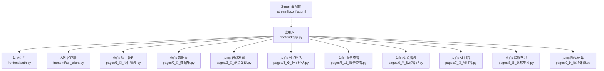
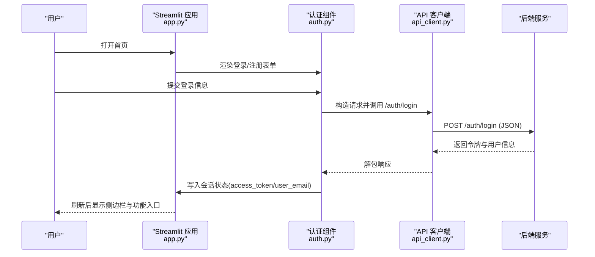
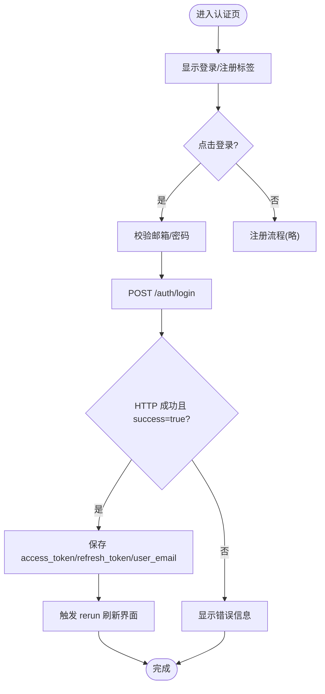
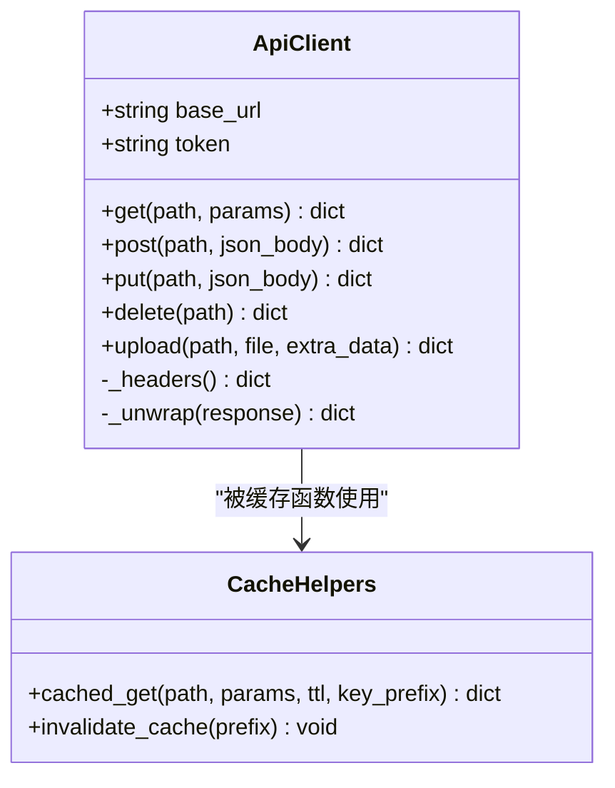
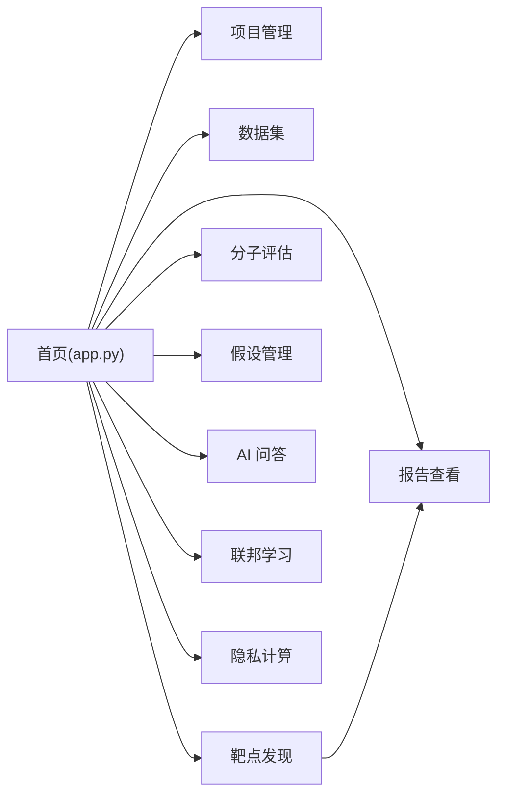
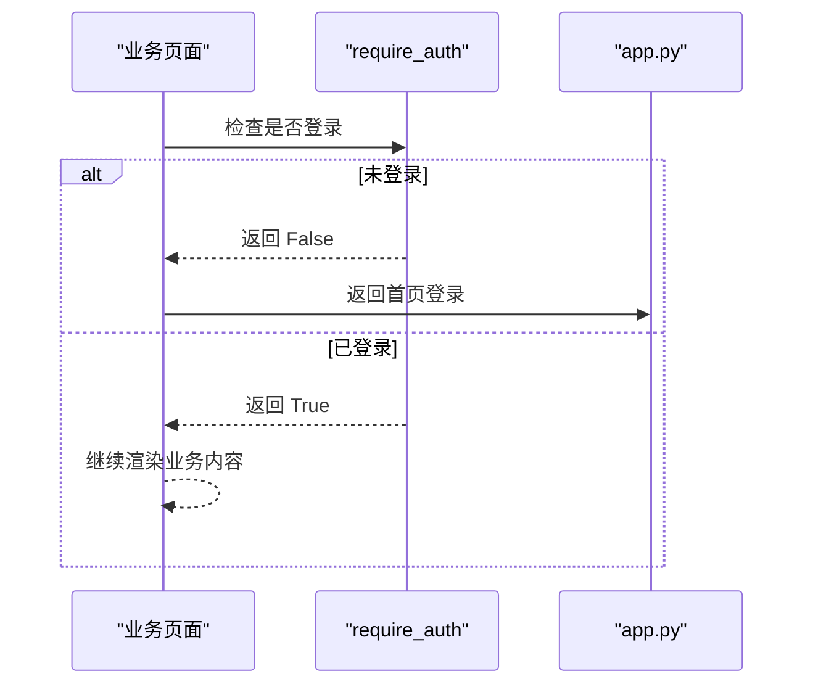
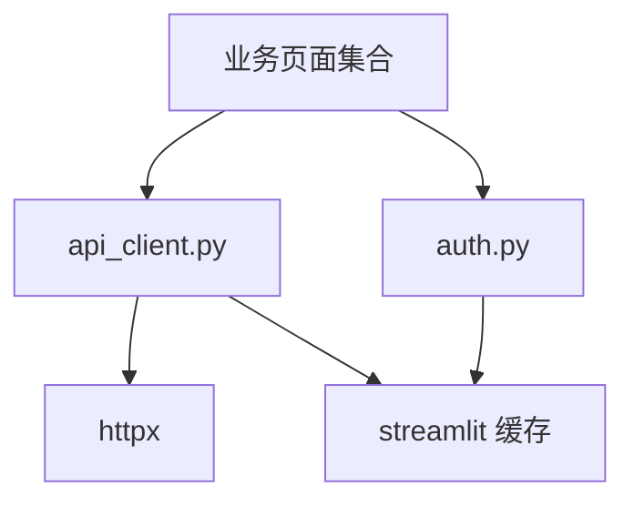

# 前端架构设计

<cite>
**本文引用的文件**
- [app.py](file://frontend/app.py)
- [auth.py](file://frontend/auth.py)
- [api_client.py](file://frontend/api_client.py)
- [config.toml](file://.streamlit/config.toml)
- [1_📁_项目管理.py](file://frontend/pages/1_📁_项目管理.py)
- [2_🧬_数据集.py](file://frontend/pages/2_🧬_数据集.py)
- [3_🎯_靶点发现.py](file://frontend/pages/3_🎯_靶点发现.py)
- [4_⚙️_分子评估.py](file://frontend/pages/4_⚙️_分子评估.py)
- [5_📊_报告查看.py](file://frontend/pages/5_📊_报告查看.py)
- [6_💡_假设管理.py](file://frontend/pages/6_💡_假设管理.py)
- [7_🤖_AI问答.py](file://frontend/pages/7_🤖_AI问答.py)
- [8_🌐_联邦学习.py](file://frontend/pages/8_🌐_联邦学习.py)
- [9_🔒_隐私计算.py](file://frontend/pages/9_🔒_隐私计算.py)
</cite>

## 目录
1. [引言](#引言)
2. [项目结构](#项目结构)
3. [核心组件](#核心组件)
4. [架构总览](#架构总览)
5. [详细组件分析](#详细组件分析)
6. [依赖关系分析](#依赖关系分析)
7. [性能考虑](#性能考虑)
8. [故障排查指南](#故障排查指南)
9. [结论](#结论)
10. [附录](#附录)

## 引言
本文件面向 AI 药物设计系统的前端（基于 Streamlit）提供一份完整的架构文档。内容覆盖应用入口与页面组织、状态管理与认证流程、API 客户端封装、页面导航与组件复用策略、用户体验优化、前后端通信协议与数据格式约定，以及错误处理与性能优化建议。读者无需深入后端即可理解前端整体设计与实现要点。

## 项目结构
前端采用“单入口 + 多页面”的 Streamlit 组织方式：
- 应用入口 app.py 负责全局配置、侧边栏导航与首页渲染。
- pages 目录下按功能模块划分页面，命名以数字前缀控制顺序。
- auth.py 提供登录/注册/登出等认证 UI 与交互逻辑。
- api_client.py 统一封装 HTTP 请求、JWT 注入、响应信封解包、缓存与上传能力。
- .streamlit/config.toml 定义主题、端口与运行参数。

图表来源
- [app.py:35-64](file://frontend/app.py#L35-L64)
- [config.toml:1-16](file://.streamlit/config.toml#L1-L16)

章节来源
- [app.py:35-64](file://frontend/app.py#L35-L64)
- [config.toml:1-16](file://.streamlit/config.toml#L1-L16)

## 核心组件
- 应用入口与导航
  - 设置页面标题、图标、布局与侧边栏；根据会话状态切换未登录/已登录视图；在首页展示系统健康状态与快速入口。
- 认证组件
  - 提供登录/注册表单、用户菜单与演示模式提示；将 access_token、refresh_token、user_email 写入会话状态。
- API 客户端
  - 统一封装 GET/POST/PUT/DELETE/Upload；自动注入 Authorization；对响应信封 {success, data} 进行解包；提供连接池复用与请求级缓存；提供 require_auth 权限检查与缓存失效工具。
- 页面模块
  - 各业务页面遵循统一的认证前置、UI 布局、表单提交、列表展示与操作按钮模式，并通过 get_client/cached_get/invalidate_cache 与后端交互。

章节来源
- [app.py:43-146](file://frontend/app.py#L43-L146)
- [auth.py:10-137](file://frontend/auth.py#L10-L137)
- [api_client.py:42-167](file://frontend/api_client.py#L42-L167)
- [1_📁_项目管理.py:17-137](file://frontend/pages/1_📁_项目管理.py#L17-L137)
- [2_🧬_数据集.py:17-127](file://frontend/pages/2_🧬_数据集.py#L17-L127)
- [3_🎯_靶点发现.py:17-157](file://frontend/pages/3_🎯_靶点发现.py#L17-L157)
- [4_⚙️_分子评估.py:17-159](file://frontend/pages/4_⚙️_分子评估.py#L17-L159)
- [5_📊_报告查看.py:17-112](file://frontend/pages/5_📊_报告查看.py#L17-L112)
- [6_💡_假设管理.py:17-197](file://frontend/pages/6_💡_假设管理.py#L17-L197)
- [7_🤖_AI问答.py:17-139](file://frontend/pages/7_🤖_AI问答.py#L17-L139)
- [8_🌐_联邦学习.py:17-142](file://frontend/pages/8_🌐_联邦学习.py#L17-L142)
- [9_🔒_隐私计算.py:17-177](file://frontend/pages/9_🔒_隐私计算.py#L17-L177)

## 架构总览
前端通过 Streamlit 路由到不同页面，所有页面共享同一套认证与会话机制，并通过 ApiClient 访问后端 REST API。认证成功后，页面侧边栏显示功能导航；未登录时仅展示首页与登录入口。

图表来源
- [app.py:43-64](file://frontend/app.py#L43-L64)
- [auth.py:10-66](file://frontend/auth.py#L10-L66)
- [api_client.py:42-94](file://frontend/api_client.py#L42-L94)

## 详细组件分析

### 应用入口与侧边栏导航
- 职责
  - 设置全局页面配置与侧边栏；在未登录时展示登录与系统简介；在已登录时展示系统健康状态与快速入口。
- 关键行为
  - 使用 st.session_state["access_token"] 判断登录态。
  - 使用 cached_get("/health", ttl=10) 获取后端健康信息并展示。
  - 侧边栏通过 page_link 链接到各功能页面。
- 用户体验优化
  - 宽布局、图标与分组标题提升可读性。
  - 健康状态以指标卡片直观呈现。

章节来源
- [app.py:35-64](file://frontend/app.py#L35-L64)
- [app.py:67-146](file://frontend/app.py#L67-L146)

### 认证组件（登录/注册/登出）
- 职责
  - 提供登录/注册表单、用户菜单与演示模式提示。
- 关键行为
  - 登录：直接调用 httpx 向 /auth/login 发送 JSON，成功则写入 access_token、refresh_token、user_email 并触发 rerun。
  - 注册：校验密码长度与一致性，调用 /auth/register。
  - 登出：清除会话中的 token 与用户信息并 rerun。
- 安全与健壮性
  - 失败时解析后端 detail/message 字段并友好提示。
  - 超时与网络异常捕获并提示。

图表来源
- [auth.py:10-66](file://frontend/auth.py#L10-L66)

章节来源
- [auth.py:10-137](file://frontend/auth.py#L10-L137)

### API 客户端封装
- 职责
  - 统一 HTTP 调用、JWT 注入、响应信封解包、连接池复用、请求级缓存、文件上传。
- 关键特性
  - _get_http_client 使用 @st.cache_resource 创建共享 httpx.Client，复用连接池。
  - _headers 自动附加 Authorization。
  - _unwrap 统一处理错误与 {success,data} 信封。
  - get/post/put/delete/upload 方法简化调用。
  - cached_get/_cached_get_impl 基于时间桶 TTL 的缓存机制。
  - invalidate_cache 支持清空缓存。
- 复杂度与性能
  - 连接池复用降低握手开销；TTL 缓存减少重复请求；上传使用独立 Client 避免影响主连接池。

图表来源
- [api_client.py:42-167](file://frontend/api_client.py#L42-L167)
- [api_client.py:186-251](file://frontend/api_client.py#L186-L251)

章节来源
- [api_client.py:24-39](file://frontend/api_client.py#L24-L39)
- [api_client.py:42-167](file://frontend/api_client.py#L42-L167)
- [api_client.py:186-251](file://frontend/api_client.py#L186-L251)

### 页面模块与导航逻辑
- 项目管理
  - 表单创建项目，列表展示并支持激活/暂停/归档操作；使用 cached_get 与 invalidate_cache 保证数据一致性与性能。
- 数据集
  - 支持上传多种组学数据格式，并提供处理与质控查询。
- 靶点发现
  - 输入差异基因，选择分析层级与最大靶点数，提交后展示统计与证据详情，支持跳转到报告查看。
- 分子评估
  - 类药性评估、分子对接、ADMET 预测三大子功能，分别对应不同后端接口。
- 报告查看
  - 列表与详情展示，支持 CDISC SDTM 导出。
- 假设管理
  - 创建/编辑/删除假设，支持对比分析与批量操作。
- AI 问答
  - 聊天历史保存在会话状态，支持引用源与证据等级展示。
- 联邦学习
  - 创建任务、注册客户端、启动训练、进度与指标展示。
- 隐私计算
  - 隐私域管理、计算请求提交、差分隐私预算监控。

图表来源
- [app.py:52-63](file://frontend/app.py#L52-L63)
- [3_🎯_靶点发现.py:143-145](file://frontend/pages/3_🎯_靶点发现.py#L143-L145)

章节来源
- [1_📁_项目管理.py:17-137](file://frontend/pages/1_📁_项目管理.py#L17-L137)
- [2_🧬_数据集.py:17-127](file://frontend/pages/2_🧬_数据集.py#L17-L127)
- [3_🎯_靶点发现.py:17-157](file://frontend/pages/3_🎯_靶点发现.py#L17-L157)
- [4_⚙️_分子评估.py:17-159](file://frontend/pages/4_⚙️_分子评估.py#L17-L159)
- [5_📊_报告查看.py:17-112](file://frontend/pages/5_📊_报告查看.py#L17-L112)
- [6_💡_假设管理.py:17-197](file://frontend/pages/6_💡_假设管理.py#L17-L197)
- [7_🤖_AI问答.py:17-139](file://frontend/pages/7_🤖_AI问答.py#L17-L139)
- [8_🌐_联邦学习.py:17-142](file://frontend/pages/8_🌐_联邦学习.py#L17-L142)
- [9_🔒_隐私计算.py:17-177](file://frontend/pages/9_🔒_隐私计算.py#L17-L177)

### 用户认证流程与权限控制
- 流程
  - 未登录：首页展示登录/注册；登录后写入会话状态并刷新。
  - 已登录：侧边栏显示用户菜单与功能导航；页面顶部显示当前用户。
- 权限控制
  - 各页面通过 require_auth 检查 access_token，未登录则提示并跳转回首页。
- 会话管理
  - 使用 st.session_state 存储 access_token、refresh_token、user_email、api_base_url 等。

图表来源
- [api_client.py:170-180](file://frontend/api_client.py#L170-L180)
- [app.py:48-64](file://frontend/app.py#L48-L64)

章节来源
- [auth.py:116-128](file://frontend/auth.py#L116-L128)
- [api_client.py:170-180](file://frontend/api_client.py#L170-L180)
- [app.py:48-64](file://frontend/app.py#L48-L64)

### 组件复用策略与用户体验优化
- 复用策略
  - 统一认证检查 require_auth。
  - 统一 API 调用 get_client/cached_get/invalidate_cache。
  - 统一错误提示与重试引导。
- 体验优化
  - 使用 st.spinner 与 st.progress 反馈长耗时操作。
  - 使用 st.expander 折叠详细信息，保持界面简洁。
  - 使用 st.tabs 与 st.columns 组织复杂表单与结果展示。
  - 使用 st.page_link 与 st.switch_page 实现页面间导航。

章节来源
- [3_🎯_靶点发现.py:84-100](file://frontend/pages/3_🎯_靶点发现.py#L84-L100)
- [8_🌐_联邦学习.py:100-108](file://frontend/pages/8_🌐_联邦学习.py#L100-L108)
- [5_📊_报告查看.py:42-57](file://frontend/pages/5_📊_报告查看.py#L42-L57)

### 前后端通信协议与数据格式约定
- 协议
  - RESTful API，基础路径为 /api/v1。
  - 认证：Authorization: Bearer <access_token>。
  - 请求体：application/json。
- 响应信封
  - 统一格式 {success: bool, data: any, meta?: object}；失败时包含 error.detail 或 message。
- 典型接口
  - 认证：/auth/login、/auth/register。
  - 项目：/projects、/projects/{id}。
  - 数据集：/datasets、/datasets/upload、/datasets/{id}/process、/datasets/{id}/quality。
  - 靶点：/targets/discover。
  - 分子：/molecules/assess-druglikeness、/molecules/dock、/molecules/predict-properties。
  - 报告：/reports、/reports/{id}、/reports/{id}/cdisc。
  - 假设：/hypotheses、/hypotheses/{id}、/hypotheses/compare。
  - 聊天：/chat。
  - 联邦：/federated、/federated/{id}/start、/federated/{id}/clients。
  - 隐私：/privacy/domains、/privacy/domains/{id}/datasets、/privacy/domains/{id}/compute、/privacy/dp-budget。
  - 健康：/health。

章节来源
- [api_client.py:21-39](file://frontend/api_client.py#L21-L39)
- [api_client.py:61-94](file://frontend/api_client.py#L61-L94)
- [1_📁_项目管理.py:46-61](file://frontend/pages/1_📁_项目管理.py#L46-L61)
- [2_🧬_数据集.py:54-67](file://frontend/pages/2_🧬_数据集.py#L54-L67)
- [3_🎯_靶点发现.py:86-95](file://frontend/pages/3_🎯_靶点发现.py#L86-L95)
- [4_⚙️_分子评估.py:43-73](file://frontend/pages/4_⚙️_分子评估.py#L43-L73)
- [5_📊_报告查看.py:29-35](file://frontend/pages/5_📊_报告查看.py#L29-L35)
- [6_💡_假设管理.py:48-65](file://frontend/pages/6_💡_假设管理.py#L48-L65)
- [7_🤖_AI问答.py:82-110](file://frontend/pages/7_🤖_AI问答.py#L82-L110)
- [8_🌐_联邦学习.py:50-65](file://frontend/pages/8_🌐_联邦学习.py#L50-L65)
- [9_🔒_隐私计算.py:47-56](file://frontend/pages/9_🔒_隐私计算.py#L47-L56)
- [app.py:121-134](file://frontend/app.py#L121-L134)

### 实时功能实现说明
- 当前实现以轮询与缓存为主：
  - 使用 cached_get 配合 TTL 定期刷新（如联邦学习任务列表）。
  - 使用 st.rerun 在操作完成后主动刷新。
- 未来可扩展方向
  - 引入 SSE/WebSocket 实现任务进度推送与聊天流式输出。
  - 结合后端异步任务队列，前端定时拉取任务状态。

章节来源
- [8_🌐_联邦学习.py:68-84](file://frontend/pages/8_🌐_联邦学习.py#L68-L84)
- [app.py:121-134](file://frontend/app.py#L121-L134)

## 依赖关系分析
- 组件耦合
  - 页面模块强依赖 api_client 与 auth；弱依赖彼此（通过 session_state 传递上下文）。
- 外部依赖
  - httpx 用于 HTTP 通信；Streamlit 提供 UI 与缓存机制。
- 潜在循环依赖
  - 当前未发现循环导入；页面之间通过导航而非直接 import 耦合。

图表来源
- [api_client.py:18-39](file://frontend/api_client.py#L18-L39)
- [auth.py:5-8](file://frontend/auth.py#L5-L8)

章节来源
- [api_client.py:18-39](file://frontend/api_client.py#L18-L39)
- [auth.py:5-8](file://frontend/auth.py#L5-L8)

## 性能考虑
- 连接池复用
  - 通过 @st.cache_resource 共享 httpx.Client，减少 TCP 握手与 TLS 协商成本。
- 请求级缓存
  - 使用 cached_get 与时间桶 TTL 避免频繁请求不常变的数据（如健康状态、列表页）。
- 上传隔离
  - 上传使用独立 Client，避免大文件传输阻塞共享连接池。
- UI 渲染优化
  - 使用 expander/tabs/columns 减少首屏渲染压力；对长耗时操作使用 spinner/progress 提升感知性能。
- 缓存失效策略
  - 写操作后调用 invalidate_cache 确保后续读取命中最新数据。

章节来源
- [api_client.py:24-39](file://frontend/api_client.py#L24-L39)
- [api_client.py:186-251](file://frontend/api_client.py#L186-L251)
- [1_📁_项目管理.py:58-61](file://frontend/pages/1_📁_项目管理.py#L58-L61)

## 故障排查指南
- 常见错误定位
  - 登录失败：检查后端 /auth/login 返回的 detail/message；确认网络连通与 CORS/XSRF 配置。
  - 鉴权失败：确认 access_token 存在且有效；检查 Authorization 头是否正确注入。
  - 接口报错：查看 _unwrap 抛出的 RuntimeError 消息，定位后端错误码与字段。
  - 缓存不一致：在写操作后调用 invalidate_cache；必要时清空全部缓存。
  - 上传失败：检查文件大小与类型限制；确认上传端点与额外表单数据。
- 调试建议
  - 在页面中打印请求参数与响应结构；使用 st.json 展示原始响应。
  - 调整 Streamlit 配置（端口、headless、CORS、XSRF）以匹配部署环境。

章节来源
- [api_client.py:68-94](file://frontend/api_client.py#L68-L94)
- [auth.py:42-66](file://frontend/auth.py#L42-L66)
- [2_🧬_数据集.py:54-67](file://frontend/pages/2_🧬_数据集.py#L54-L67)
- [config.toml:8-12](file://.streamlit/config.toml#L8-L12)

## 结论
该前端采用清晰的模块化组织与统一的 API 客户端封装，实现了良好的可维护性与扩展性。通过会话状态管理、认证前置与缓存策略，系统在用户体验与性能方面具备良好表现。建议在后续迭代中引入更完善的权限模型、实时推送与更细粒度的缓存失效策略，以支撑更大规模的多中心协作场景。

## 附录
- 开发规范建议
  - 每个页面开头统一执行 require_auth 检查。
  - 列表页优先使用 cached_get 并设置合理 TTL；写操作后调用 invalidate_cache。
  - 表单提交需进行前端校验，并在异常分支给出明确提示。
  - 长耗时操作使用 spinner/progress，避免用户无感等待。
  - 页面间导航优先使用 st.page_link/st.switch_page，避免硬编码 URL。
- 错误处理策略
  - 统一通过 ApiClient._unwrap 抛出 RuntimeError，页面层捕获并展示 detail/message。
  - 对网络超时、JSON 解析失败等异常进行兜底处理。
- 性能优化技巧
  - 合理使用 st.cache_data 与 TTL；避免在高频刷新区域执行重计算。
  - 上传与大文件处理使用独立 Client，避免阻塞主连接池。
  - 使用 columns/tabs/expander 控制首屏渲染体积。