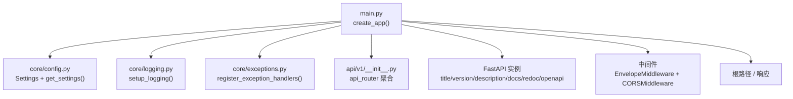
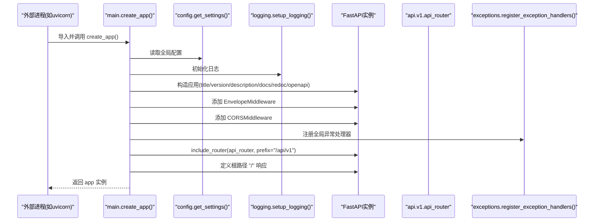
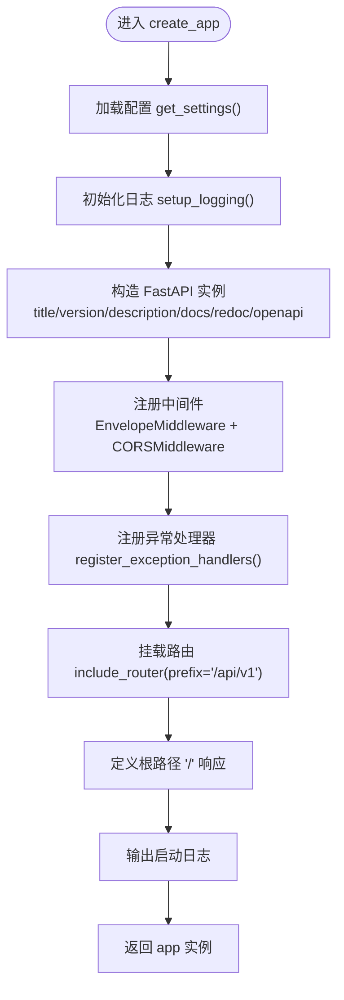
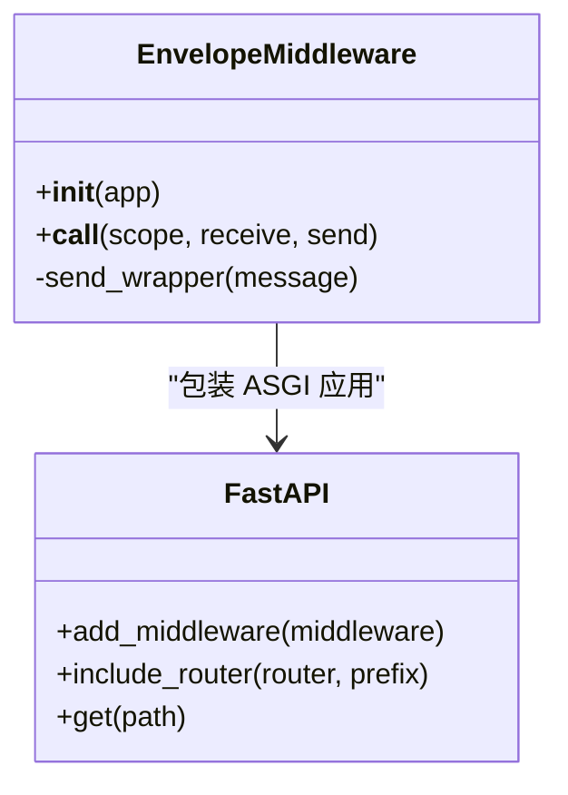
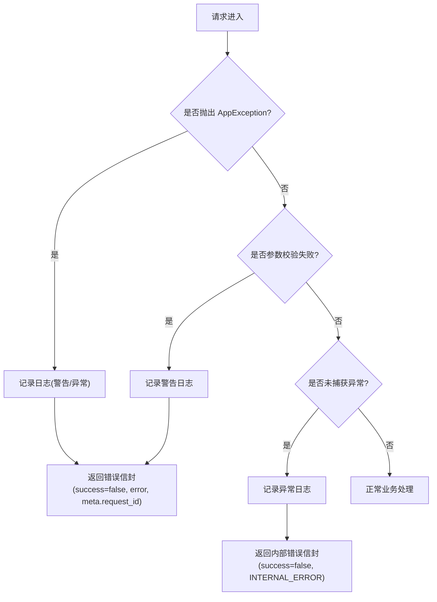
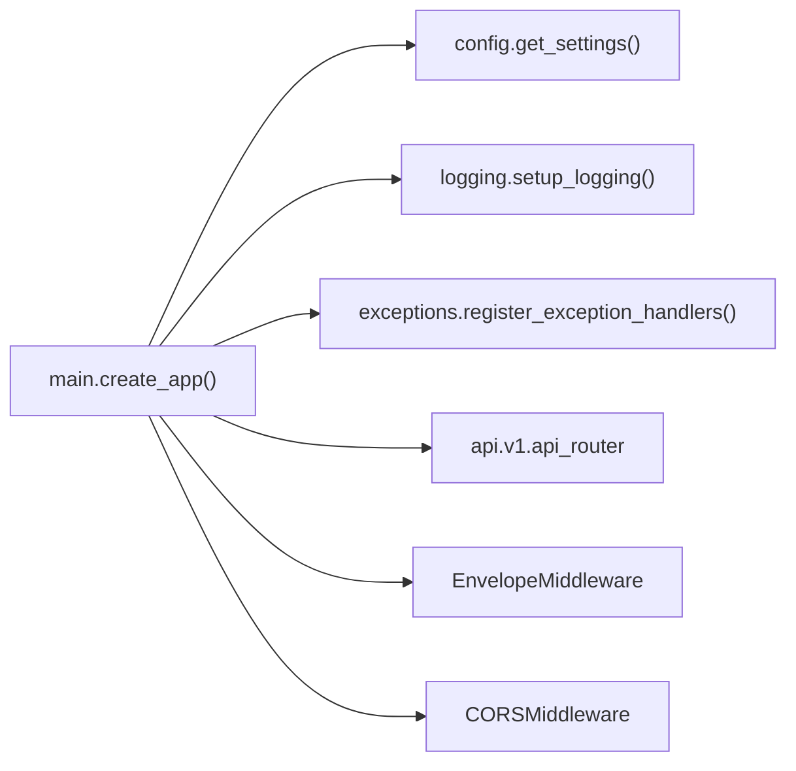

# FastAPI应用工厂

<cite>
**本文引用的文件**
- [backend/app/main.py](file://backend/app/main.py)
- [backend/app/core/config.py](file://backend/app/core/config.py)
- [backend/app/core/logging.py](file://backend/app/core/logging.py)
- [backend/app/core/exceptions.py](file://backend/app/core/exceptions.py)
- [backend/app/api/v1/__init__.py](file://backend/app/api/v1/__init__.py)
</cite>

## 目录
1. [简介](#简介)
2. [项目结构](#项目结构)
3. [核心组件](#核心组件)
4. [架构总览](#架构总览)
5. [详细组件分析](#详细组件分析)
6. [依赖关系分析](#依赖关系分析)
7. [性能考量](#性能考量)
8. [故障排查指南](#故障排查指南)
9. [结论](#结论)
10. [附录：扩展与最佳实践](#附录扩展与最佳实践)

## 简介
本文件聚焦于 FastAPI 应用工厂 create_app() 的实现原理与使用方式，系统阐述应用实例初始化、配置加载、中间件注册流程、应用元数据设置（标题、版本、描述）、文档端点配置（/docs、/redoc、/openapi.json）、根路径响应逻辑与启动日志记录。同时提供扩展配置的示例思路、生命周期管理要点以及工程化最佳实践，帮助读者快速理解并安全地扩展该应用。

## 项目结构
FastAPI 应用入口位于 backend/app/main.py，负责创建应用实例、注册中间件、挂载路由、暴露健康检查与指标信息；配置通过 pydantic-settings 从环境变量或 .env 文件加载；日志由 loguru 统一配置；异常处理器集中注册；v1 API 路由聚合在 backend/app/api/v1/__init__.py 中完成。

图表来源
- [backend/app/main.py:187-243](file://backend/app/main.py#L187-L243)
- [backend/app/core/config.py:136-144](file://backend/app/core/config.py#L136-L144)
- [backend/app/core/logging.py:20-74](file://backend/app/core/logging.py#L20-L74)
- [backend/app/core/exceptions.py:131-179](file://backend/app/core/exceptions.py#L131-L179)
- [backend/app/api/v1/__init__.py:24-38](file://backend/app/api/v1/__init__.py#L24-L38)

章节来源
- [backend/app/main.py:1-248](file://backend/app/main.py#L1-L248)
- [backend/app/core/config.py:1-144](file://backend/app/core/config.py#L1-L144)
- [backend/app/core/logging.py:1-93](file://backend/app/core/logging.py#L1-L93)
- [backend/app/core/exceptions.py:1-179](file://backend/app/core/exceptions.py#L1-L179)
- [backend/app/api/v1/__init__.py:1-41](file://backend/app/api/v1/__init__.py#L1-L41)

## 核心组件
- 应用工厂 create_app(): 负责获取配置、初始化日志、构建 FastAPI 实例、注册中间件与异常处理器、挂载 v1 路由、定义根路径响应、输出启动日志并返回应用实例。
- 配置中心 Settings: 基于 pydantic-settings 的环境变量模型，提供 cors_origin_list、is_production 等便捷属性与方法，并通过 lru_cache 缓存单例。
- 日志模块 setup_logging(): 根据环境选择控制台彩色或 JSON 输出，并配置按大小/时间轮转的文件日志与错误独立归档。
- 异常处理 register_exception_handlers(): 将业务异常、参数校验异常与未捕获异常统一转换为信封格式响应，并附带 request_id。
- 路由聚合 api_router: 将各子模块路由以统一前缀 /api/v1 挂载到主应用。

章节来源
- [backend/app/main.py:187-243](file://backend/app/main.py#L187-L243)
- [backend/app/core/config.py:21-144](file://backend/app/core/config.py#L21-L144)
- [backend/app/core/logging.py:20-74](file://backend/app/core/logging.py#L20-L74)
- [backend/app/core/exceptions.py:131-179](file://backend/app/core/exceptions.py#L131-L179)
- [backend/app/api/v1/__init__.py:24-38](file://backend/app/api/v1/__init__.py#L24-L38)

## 架构总览
下图展示了 create_app() 的调用链路与关键交互：配置加载、日志初始化、中间件注册、异常处理器注册、路由挂载、根路径响应与启动日志。

图表来源
- [backend/app/main.py:187-243](file://backend/app/main.py#L187-L243)
- [backend/app/core/config.py:136-144](file://backend/app/core/config.py#L136-L144)
- [backend/app/core/logging.py:20-74](file://backend/app/core/logging.py#L20-L74)
- [backend/app/core/exceptions.py:131-179](file://backend/app/core/exceptions.py#L131-L179)
- [backend/app/api/v1/__init__.py:24-38](file://backend/app/api/v1/__init__.py#L24-L38)

## 详细组件分析

### 应用工厂 create_app() 实现原理
- 配置加载
  - 通过 get_settings() 获取 Settings 单例，所有字段来自环境变量或 .env，具备类型校验与默认值。
- 日志初始化
  - 在创建 FastAPI 实例之前调用 setup_logging()，确保后续所有模块均可用结构化日志。
- 应用实例初始化
  - 设置 title、version、description 等元数据，用于 OpenAPI/Swagger UI 展示。
  - 显式开启 docs_url="/docs"、redoc_url="/redoc"、openapi_url="/openapi.json"，便于调试与集成。
- 中间件注册
  - EnvelopeMiddleware：统一请求追踪（X-Request-ID）、耗时统计（X-Response-Time-ms）、对 200 且 application/json 且包含 meta 的响应注入 duration_ms，并在最后一片 body 时重写 content-length。
  - CORSMiddleware：允许跨域源、方法、头，并暴露追踪相关响应头。
- 异常处理器注册
  - 将 AppException、RequestValidationError、通用 Exception 映射为统一信封格式响应，自动附加 request_id。
- 路由挂载
  - 将 api_router 以 /api/v1 前缀挂载，聚合了 health、auth、projects、datasets、targets、molecules、reports、hypotheses、chat、federated、privacy、feedback、efficacy、admin 等子路由。
- 根路径响应
  - 定义 GET "/" 返回应用名称、版本与文档地址，便于快速定位文档。
- 启动日志
  - 在返回 app 之前输出应用已初始化的日志，包含名称与版本。

图表来源
- [backend/app/main.py:187-243](file://backend/app/main.py#L187-L243)
- [backend/app/api/v1/__init__.py:24-38](file://backend/app/api/v1/__init__.py#L24-L38)

章节来源
- [backend/app/main.py:187-243](file://backend/app/main.py#L187-L243)
- [backend/app/api/v1/__init__.py:24-38](file://backend/app/api/v1/__init__.py#L24-L38)

### 应用元数据与文档端点
- 元数据设置
  - title、version、description 来源于 Settings，便于在不同环境切换应用标识与说明。
- 文档端点
  - /docs：Swagger UI
  - /redoc：ReDoc
  - /openapi.json：OpenAPI 规范
  - 这些端点在 FastAPI 构造时启用，无需额外路由定义。

章节来源
- [backend/app/main.py:198-213](file://backend/app/main.py#L198-L213)
- [backend/app/core/config.py:28-35](file://backend/app/core/config.py#L28-L35)

### 根路径重定向逻辑与启动日志
- 根路径响应
  - GET "/" 返回包含 name、version、docs 的 JSON，方便用户快速访问文档。
- 启动日志
  - 在返回 app 之前记录应用初始化完成，包含名称与版本，便于运维确认。

章节来源
- [backend/app/main.py:235-243](file://backend/app/main.py#L235-L243)

### 中间件与信封响应机制
- EnvelopeMiddleware
  - 解析或生成 X-Request-ID，写入 scope headers，供下游依赖读取。
  - 计算请求耗时，写入响应头 X-Response-Time-ms。
  - 对 200 且 application/json 且包含 meta 的响应体注入 duration_ms。
  - 采用完全缓冲模式，在最后一片 body 时重写 start 消息与 content-length，避免截断。
  - 流式响应中间分片直接透传，不重写。
- CORSMiddleware
  - 允许跨域源、方法与头，并暴露追踪相关响应头。

图表来源
- [backend/app/main.py:29-185](file://backend/app/main.py#L29-L185)

章节来源
- [backend/app/main.py:29-185](file://backend/app/main.py#L29-L185)

### 异常处理与统一信封响应
- 全局异常处理器
  - AppException：业务异常基类，携带 code、message、details、status_code。
  - RequestValidationError：参数校验失败，返回 400 与错误详情。
  - 通用 Exception：兜底 500，记录未捕获异常。
- 统一信封
  - 成功响应：{success, data, meta}
  - 错误响应：{success, error: {code, message, details}, meta: {request_id}}

图表来源
- [backend/app/core/exceptions.py:131-179](file://backend/app/core/exceptions.py#L131-L179)

章节来源
- [backend/app/core/exceptions.py:19-179](file://backend/app/core/exceptions.py#L19-L179)

### 路由聚合与挂载
- api_router 聚合多个子模块路由，统一前缀 /api/v1，并按功能划分 tags，便于文档分组。
- 包含 health、auth、projects、datasets、targets、molecules、reports、hypotheses、chat、federated、privacy、feedback、efficacy、admin 等。

章节来源
- [backend/app/api/v1/__init__.py:24-38](file://backend/app/api/v1/__init__.py#L24-L38)

## 依赖关系分析
- main.create_app() 依赖：
  - config.get_settings()：提供应用元数据与运行参数。
  - logging.setup_logging()：初始化结构化日志。
  - exceptions.register_exception_handlers()：注册全局异常处理器。
  - api.v1.api_router：聚合业务路由。
- 中间件依赖：
  - EnvelopeMiddleware 依赖 loguru.logger 进行请求日志记录。
  - CORSMiddleware 依赖 settings.cors_origin_list 动态配置允许源。

图表来源
- [backend/app/main.py:187-243](file://backend/app/main.py#L187-L243)
- [backend/app/core/config.py:136-144](file://backend/app/core/config.py#L136-L144)
- [backend/app/core/logging.py:20-74](file://backend/app/core/logging.py#L20-L74)
- [backend/app/core/exceptions.py:131-179](file://backend/app/core/exceptions.py#L131-L179)
- [backend/app/api/v1/__init__.py:24-38](file://backend/app/api/v1/__init__.py#L24-L38)

章节来源
- [backend/app/main.py:187-243](file://backend/app/main.py#L187-L243)
- [backend/app/core/config.py:136-144](file://backend/app/core/config.py#L136-L144)
- [backend/app/core/logging.py:20-74](file://backend/app/core/logging.py#L20-L74)
- [backend/app/core/exceptions.py:131-179](file://backend/app/core/exceptions.py#L131-L179)
- [backend/app/api/v1/__init__.py:24-38](file://backend/app/api/v1/__init__.py#L24-L38)

## 性能考量
- 中间件开销
  - EnvelopeMiddleware 对非流式响应进行完整缓冲与重写，可能增加内存占用与延迟，适用于需要统一信封与追踪的场景。对于大体积响应或流式传输需谨慎评估。
- CORS 配置
  - allow_origins 列表过大可能导致预检请求增多，建议仅允许必要域名。
- 日志级别与轮转
  - 生产环境建议使用 JSON 序列化输出，减少磁盘 IO 压力；合理设置 rotation 与 retention，避免日志膨胀。
- 路由与中间件顺序
  - 中间件注册顺序影响处理链路，应确保 EnvelopeMiddleware 在 CORSMiddleware 之后或根据需求调整，以避免重复处理或头部覆盖。

[本节为通用指导，不直接分析具体文件]

## 故障排查指南
- 文档无法访问
  - 检查 docs_url、redoc_url、openapi_url 是否被自定义路由覆盖或禁用。
- 跨域失败
  - 核对 cors_origins 配置与实际前端域名一致，注意逗号分隔与空白去除逻辑。
- 缺少 X-Request-ID 或耗时头
  - 确认 EnvelopeMiddleware 已注册且未被其他中间件提前拦截。
- 异常未返回统一信封
  - 检查是否抛出自定义 AppException 子类，或是否被未捕获异常兜底处理。
- 日志缺失或格式不正确
  - 确认 setup_logging() 在应用启动早期调用，并根据 is_production 判断输出格式。

章节来源
- [backend/app/main.py:215-243](file://backend/app/main.py#L215-L243)
- [backend/app/core/config.py:112-127](file://backend/app/core/config.py#L112-L127)
- [backend/app/core/logging.py:20-74](file://backend/app/core/logging.py#L20-L74)
- [backend/app/core/exceptions.py:131-179](file://backend/app/core/exceptions.py#L131-L179)

## 结论
create_app() 作为应用工厂，将配置加载、日志初始化、中间件注册、异常处理、路由挂载与文档端点配置集中在一个可复用的函数中，既保证了启动流程的可控性，也提升了扩展与维护效率。结合 EnvelopeMiddleware 的统一信封与追踪能力，以及集中式的异常处理策略，整体架构清晰、健壮且易于观测。

[本节为总结性内容，不直接分析具体文件]

## 附录：扩展与最佳实践

- 扩展应用配置
  - 在 Settings 中添加新字段，并在 create_app() 中使用对应字段进行行为控制（例如开关特性、限流阈值）。
  - 利用 cors_origin_list 与 is_production 等便捷属性简化条件分支。
- 扩展中间件
  - 新增中间件应在合适位置注册，考虑与 EnvelopeMiddleware 的顺序与交互，避免重复修改响应头或破坏信封结构。
- 扩展路由
  - 在 api/v1 下新增模块并在 __init__.py 中 include_router，保持前缀与 tags 的一致性。
- 生命周期管理
  - 如需在应用启动/关闭时执行资源初始化/释放，可在 create_app() 中注册 lifespan 事件或使用 on_event 钩子。
- 测试与隔离
  - 使用 get_settings().cache_clear() 重置配置单例，保证单元测试间的环境隔离。
- 部署建议
  - 生产环境设置 app_env=production，启用 JSON 日志输出；合理配置日志轮转与保留策略；限制 CORS 源；监控 X-Response-Time-ms 与错误率。

章节来源
- [backend/app/core/config.py:21-144](file://backend/app/core/config.py#L21-L144)
- [backend/app/main.py:187-243](file://backend/app/main.py#L187-L243)
- [backend/app/api/v1/__init__.py:24-38](file://backend/app/api/v1/__init__.py#L24-L38)