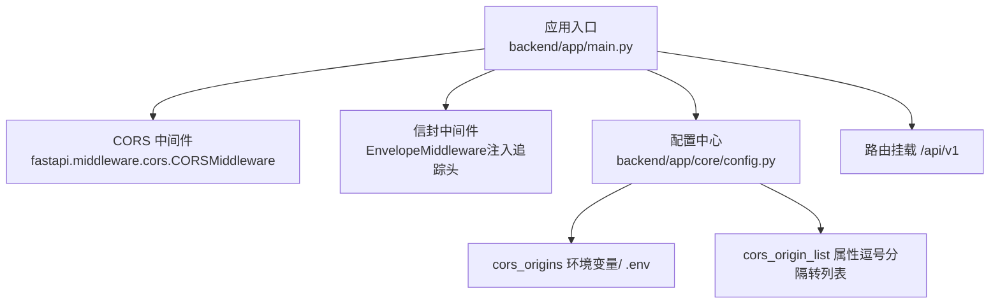
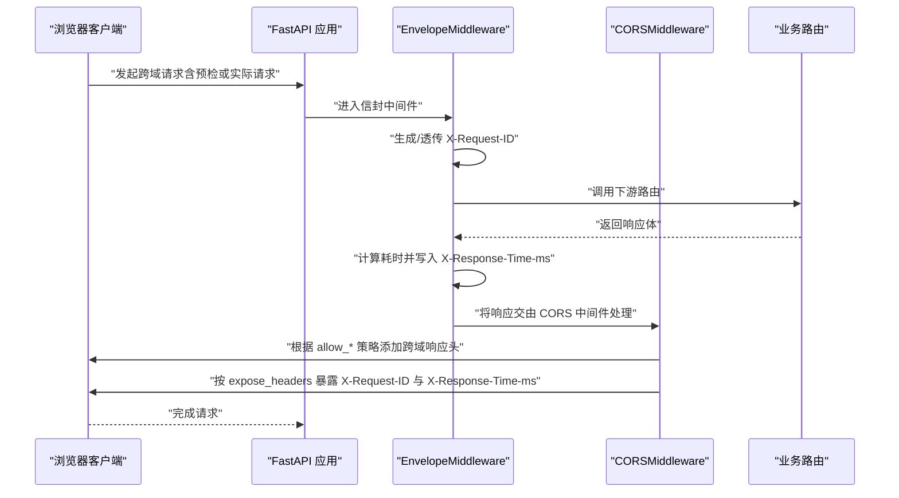
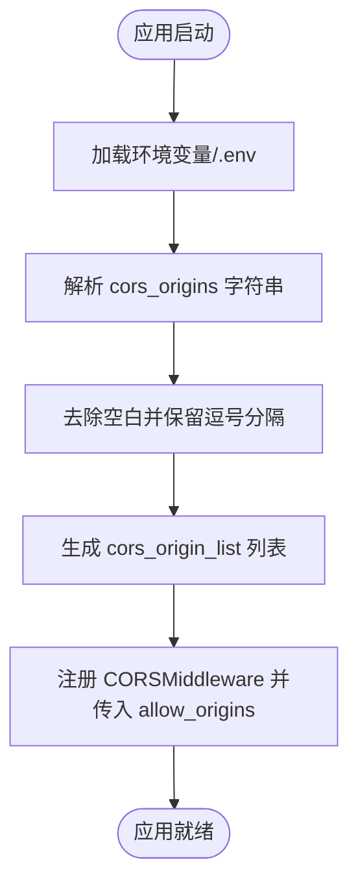
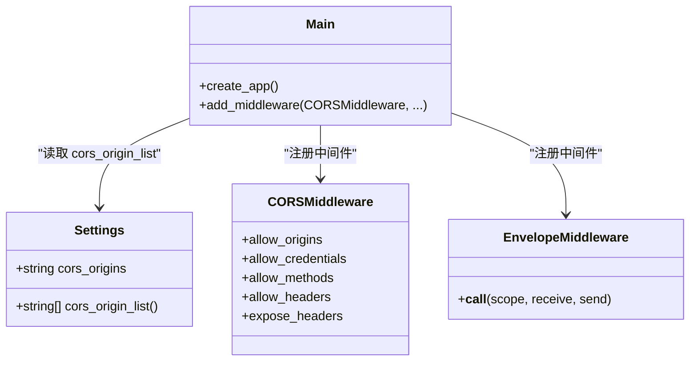

# CORS跨域中间件

<cite>
**本文引用的文件**   
- [backend/app/main.py](file://backend/app/main.py)
- [backend/app/core/config.py](file://backend/app/core/config.py)
</cite>

## 目录
1. [简介](#简介)
2. [项目结构](#项目结构)
3. [核心组件](#核心组件)
4. [架构总览](#架构总览)
5. [详细组件分析](#详细组件分析)
6. [依赖关系分析](#依赖关系分析)
7. [性能考量](#性能考量)
8. [故障排查指南](#故障排查指南)
9. [结论](#结论)
10. [附录](#附录)

## 简介
本文件聚焦于 FastAPI 内置的 CORSMiddleware 在本项目中的配置与使用，重点说明以下方面：
- 跨域源列表 allow_origins 的来源与解析
- 凭据处理 allow_credentials 的影响与限制
- 允许方法与请求头策略 allow_methods、allow_headers
- 安全响应头的暴露配置 expose_headers，特别是 X-Request-ID 与 X-Response-Time-ms
- 跨域安全最佳实践与常见问题解决方案

## 项目结构
本项目在应用入口中注册全局中间件，其中包含 CORS 中间件。CORS 相关配置来源于集中式 Settings 配置类，通过环境变量或 .env 文件注入。

图表来源
- [backend/app/main.py:219-227](file://backend/app/main.py#L219-L227)
- [backend/app/core/config.py:112-121](file://backend/app/core/config.py#L112-L121)

章节来源
- [backend/app/main.py:187-248](file://backend/app/main.py#L187-L248)
- [backend/app/core/config.py:21-144](file://backend/app/core/config.py#L21-L144)

## 核心组件
- CORSMiddleware 注册位置与参数：在应用工厂中统一注册，参数包括 allow_origins、allow_credentials、allow_methods、allow_headers、expose_headers。
- 配置来源：Settings.cors_origins 为逗号分隔字符串，提供 cors_origin_list 属性将其转换为列表供 CORSMiddleware 使用。
- 安全头暴露：expose_headers 显式暴露 X-Request-ID 与 X-Response-Time-ms，使浏览器端可读取这些自定义响应头。

章节来源
- [backend/app/main.py:219-227](file://backend/app/main.py#L219-L227)
- [backend/app/core/config.py:112-121](file://backend/app/core/config.py#L112-L121)

## 架构总览
下图展示了请求进入后，CORS 中间件与其他中间件的协作关系以及关键响应头的生成与暴露路径。

图表来源
- [backend/app/main.py:219-227](file://backend/app/main.py#L219-L227)
- [backend/app/main.py:187-248](file://backend/app/main.py#L187-L248)

## 详细组件分析

### CORSMiddleware 配置项详解
- allow_origins
  - 作用：指定允许的跨域源列表。
  - 本项目来源：settings.cors_origin_list，由 settings.cors_origins 经逗号分隔转换而来。
  - 建议：生产环境严格限定域名，避免使用通配符；开发环境可使用 localhost 端口集合。
- allow_credentials
  - 作用：是否允许携带凭据（如 Cookie、Authorization）。
  - 影响：当为 True 时，allow_origins 不能为 "*"，必须显式列出具体源。
- allow_methods
  - 作用：允许的 HTTP 方法集合。
  - 本项目策略：使用 ["*"] 允许所有方法。
  - 建议：生产环境按需收敛到必要方法（如 GET、POST、PUT、DELETE）。
- allow_headers
  - 作用：允许的自定义请求头集合。
  - 本项目策略：使用 ["*"] 允许所有头部。
  - 建议：生产环境仅暴露必要的头部，减少攻击面。
- expose_headers
  - 作用：允许浏览器 JavaScript 读取的响应头白名单。
  - 本项目策略：显式暴露 X-Request-ID 与 X-Response-Time-ms，便于前端调试与监控。
  - 注意：未在此列表中暴露的响应头，浏览器默认不可被脚本访问。

章节来源
- [backend/app/main.py:219-227](file://backend/app/main.py#L219-L227)
- [backend/app/core/config.py:112-121](file://backend/app/core/config.py#L112-L121)

### 安全头 X-Request-ID 与 X-Response-Time-ms 的暴露
- 生成位置：信封中间件在响应阶段注入 X-Request-ID 与 X-Response-Time-ms。
- 暴露位置：CORS 中间件通过 expose_headers 明确允许浏览器端读取这两个自定义响应头。
- 前端使用：可在浏览器侧通过 response.headers.get("X-Request-ID") 等方式获取，用于链路追踪与性能观测。

章节来源
- [backend/app/main.py:219-227](file://backend/app/main.py#L219-L227)
- [backend/app/main.py:187-248](file://backend/app/main.py#L187-L248)

### 配置来源与解析流程
- 环境变量优先级：真实环境变量 > .env 文件 > 代码默认值。
- cors_origins 字段：以逗号分隔的字符串形式存储，支持去除空白字符。
- cors_origin_list 属性：将字符串分割为列表，供 CORSMiddleware 使用。

图表来源
- [backend/app/core/config.py:112-121](file://backend/app/core/config.py#L112-L121)
- [backend/app/main.py:219-227](file://backend/app/main.py#L219-L227)

章节来源
- [backend/app/core/config.py:21-144](file://backend/app/core/config.py#L21-L144)

## 依赖关系分析
- main.py 依赖 core.config.Settings 提供的 cors_origin_list。
- CORSMiddleware 作为 Starlette/FastAPI 内置中间件，负责在响应中添加跨域相关头（Access-Control-*）。
- EnvelopeMiddleware 负责注入追踪头并在最后统一重写响应头，确保 content-length 正确。

图表来源
- [backend/app/main.py:219-227](file://backend/app/main.py#L219-L227)
- [backend/app/core/config.py:112-121](file://backend/app/core/config.py#L112-L121)

章节来源
- [backend/app/main.py:187-248](file://backend/app/main.py#L187-L248)
- [backend/app/core/config.py:21-144](file://backend/app/core/config.py#L21-L144)

## 性能考量
- 预检请求：对于非简单请求，浏览器会先发送 OPTIONS 预检请求。CORS 中间件会在预检阶段快速返回，不触发业务逻辑。
- 响应头开销：expose_headers 仅控制浏览器可读性，对服务器端性能无显著影响。
- 中间件顺序：当前 EnvelopeMiddleware 位于 CORS 之前，确保在 CORS 处理前已注入追踪头与耗时信息。

[本节为通用指导，无需源码引用]

## 故障排查指南
- 现象：浏览器控制台报“跨域错误”或“预检失败”。
  - 检查 allow_origins 是否包含前端实际域名与端口。
  - 若 allow_credentials=True，确认 allow_origins 不为 "*"，需显式列出具体源。
- 现象：前端无法读取 X-Request-ID 或 X-Response-Time-ms。
  - 确认 expose_headers 中包含对应响应头名称。
  - 检查网络面板的“响应头”是否确实存在该字段。
- 现象：生产环境跨域受限。
  - 收紧 allow_methods 与 allow_headers，仅开放必要方法与头部。
  - 使用反向代理或网关进行同源转发，避免直接暴露后端服务。

章节来源
- [backend/app/main.py:219-227](file://backend/app/main.py#L219-L227)
- [backend/app/core/config.py:112-121](file://backend/app/core/config.py#L112-L121)

## 结论
本项目通过集中式配置与中间件组合，实现了灵活且安全的跨域策略：
- 使用 Settings 管理跨域源，便于多环境切换与审计。
- 显式暴露追踪与性能头，提升可观测性与排障效率。
- 在生产环境中应遵循最小权限原则，收敛 allow_origins、allow_methods、allow_headers，并结合反向代理增强安全性。

[本节为总结性内容，无需源码引用]

## 附录
- 配置示例（概念性说明）
  - cors_origins：逗号分隔的源列表，例如 http://localhost:8501,http://localhost:3000
  - allow_credentials：True 表示允许携带凭据
  - allow_methods：["*"] 表示允许所有方法（生产环境建议收敛）
  - allow_headers：["*"] 表示允许所有头部（生产环境建议收敛）
  - expose_headers：["X-Request-ID", "X-Response-Time-ms"] 表示允许浏览器读取这些响应头

[本节为概念性补充，无需源码引用]