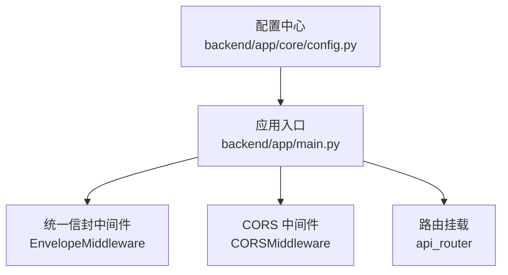
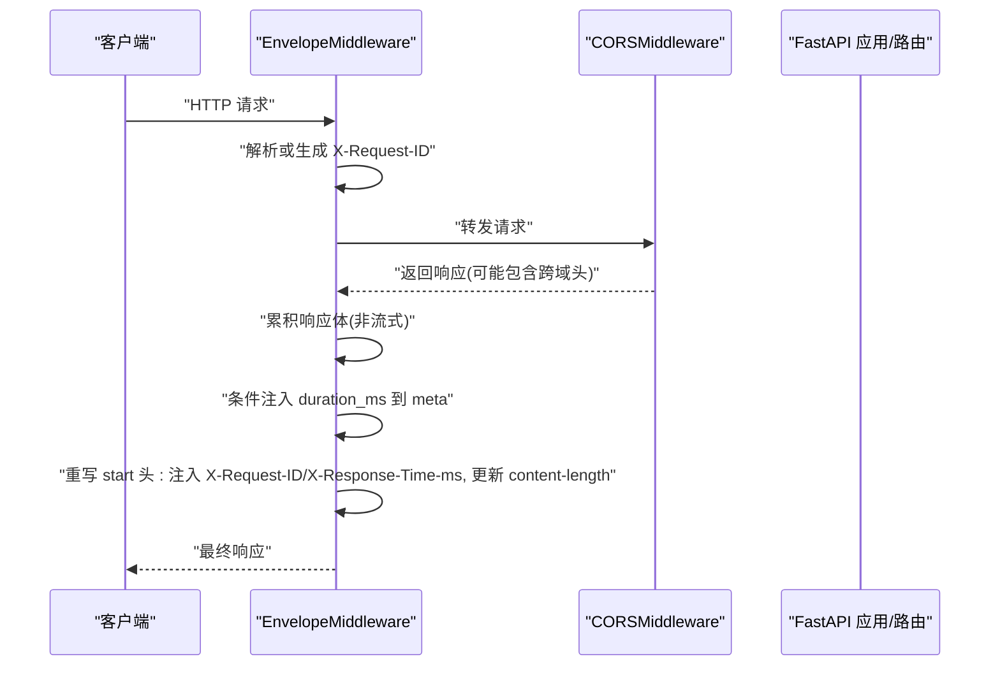
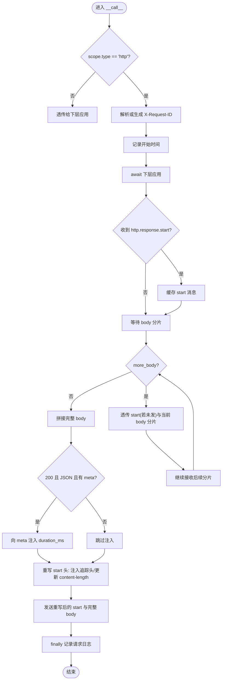
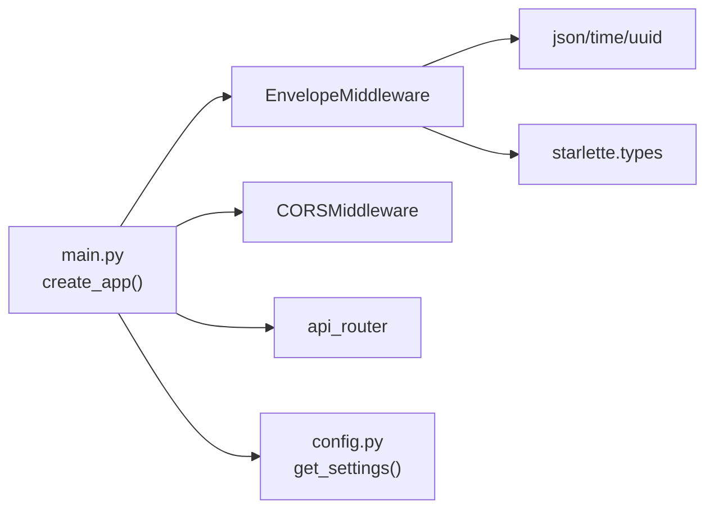

# 中间件执行顺序

<cite>
**本文引用的文件**
- [backend/app/main.py](file://backend/app/main.py)
- [backend/app/core/config.py](file://backend/app/core/config.py)
</cite>

## 目录
1. [简介](#简介)
2. [项目结构](#项目结构)
3. [核心组件](#核心组件)
4. [架构总览](#架构总览)
5. [详细组件分析](#详细组件分析)
6. [依赖关系分析](#依赖关系分析)
7. [性能考虑](#性能考虑)
8. [故障排查指南](#故障排查指南)
9. [结论](#结论)
10. [附录](#附录)

## 简介
本文聚焦于 FastAPI 应用的中间件注册顺序与执行流程，结合仓库中的实际实现，解释请求处理的“洋葱模型”，并重点说明 EnvelopeMiddleware 与 CORS 中间件的优先级、处理时机与交互。文末提供自定义中间件添加的最佳实践与性能注意事项。

## 项目结构
本项目的中间件注册与应用初始化集中在应用入口文件中，配置项通过集中式配置模块加载。

图表来源
- [backend/app/main.py:187-247](file://backend/app/main.py#L187-L247)
- [backend/app/core/config.py:118-121](file://backend/app/core/config.py#L118-L121)

章节来源
- [backend/app/main.py:187-247](file://backend/app/main.py#L187-L247)
- [backend/app/core/config.py:118-121](file://backend/app/core/config.py#L118-L121)

## 核心组件
- EnvelopeMiddleware：负责请求 ID 注入/透传、响应耗时统计、统一信封响应体增强（在 meta 中注入 duration_ms）、重写 content-length 以及请求日志记录。采用完全缓冲模式，对非流式响应进行最终重写；对已流式发送的响应保持透传。
- CORSMiddleware：FastAPI 内置跨域中间件，根据配置允许源、方法、头与暴露头。

章节来源
- [backend/app/main.py:29-184](file://backend/app/main.py#L29-L184)
- [backend/app/main.py:219-227](file://backend/app/main.py#L219-L227)
- [backend/app/core/config.py:118-121](file://backend/app/core/config.py#L118-L121)

## 架构总览
下图展示了请求进入应用后，经过中间件链的顺序与关键处理点。

图表来源
- [backend/app/main.py:29-184](file://backend/app/main.py#L29-L184)
- [backend/app/main.py:219-227](file://backend/app/main.py#L219-L227)

## 详细组件分析

### 中间件注册顺序与执行优先级
- 注册顺序（按代码调用顺序）：
  1) EnvelopeMiddleware
  2) CORSMiddleware
- 执行顺序（洋葱模型）：
  - 入站方向：先经过 EnvelopeMiddleware，再进入 CORSMiddleware，最后到达路由处理器。
  - 出站方向：从路由处理器返回后，先经 CORSMiddleware，再回到 EnvelopeMiddleware 完成响应增强与头部重写。

这意味着：
- EnvelopeMiddleware 能观察到由 CORSMiddleware 设置的跨域相关响应头，并可将其暴露给客户端（通过 expose_headers）。
- 若需要读取或修改跨域响应头，应在 EnvelopeMiddleware 中进行（因为它位于外层）。

章节来源
- [backend/app/main.py:216-227](file://backend/app/main.py#L216-L227)

### EnvelopeMiddleware 处理时机与行为
- 请求阶段：
  - 解析或生成 X-Request-ID，写入 scope headers，确保下游依赖可读取一致 ID。
  - 记录开始时间戳，准备响应缓冲。
- 响应阶段：
  - 缓存 http.response.start，等待所有 body 片段。
  - 对于 more_body=True 的分片，直接透传（避免无法重写的 start）。
  - 在最后一片时：
    - 若为 200 且 application/json 且存在 meta 字段，则向 meta 注入 duration_ms。
    - 重写 start 头：注入 X-Request-ID、X-Response-Time-ms，并重新计算 content-length。
  - finally 块中记录请求日志（方法、路径、状态码、耗时）。

图表来源
- [backend/app/main.py:29-184](file://backend/app/main.py#L29-L184)

章节来源
- [backend/app/main.py:29-184](file://backend/app/main.py#L29-L184)

### CORS 中间件配置与影响
- 允许源列表来自配置模块的 cors_origin_list，默认包含本地开发地址。
- 允许凭据、方法与头均开放，暴露 X-Request-ID 与 X-Response-Time-ms 以便前端读取。
- 由于 CORS 位于 EnvelopeMiddleware 之后，EnvelopeMiddleware 可在最终响应阶段看到并携带这些头。

章节来源
- [backend/app/main.py:219-227](file://backend/app/main.py#L219-L227)
- [backend/app/core/config.py:118-121](file://backend/app/core/config.py#L118-L121)

### 自定义中间件最佳实践
- 明确职责边界：
  - 将跨域策略放在最外层（如 CORSMiddleware），保证所有端点均可被正确预检与放行。
  - 将通用横切关注点（请求 ID、耗时、日志、统一信封）放在更靠近业务逻辑的位置，便于捕获真实处理耗时与结果。
- 注册顺序建议：
  - 最外层：CORS、安全/限流等基础设施中间件。
  - 中间层：请求 ID、日志、统一信封、审计等。
  - 内层：业务相关中间件（如权限校验、租户隔离）。
- 响应体处理：
  - 如需修改响应体或 content-length，应避免在流式响应场景下重写 start 头；参考 EnvelopeMiddleware 的缓冲与流式分支处理。
- 头信息一致性：
  - 使用统一的请求 ID 贯穿链路，便于追踪与排障。
- 性能考量：
  - 避免不必要的 JSON 解析与序列化；仅在满足条件时进行。
  - 谨慎使用完全缓冲模式，大响应体会增加内存占用与延迟。
  - 合理设置暴露头，减少不必要的数据传输。

[本节为通用指导，不直接分析具体文件]

## 依赖关系分析
- main.py 依赖配置模块获取 CORS 允许源列表。
- EnvelopeMiddleware 依赖 Starlette ASGI 类型与标准库 json/time/uuid。
- CORSMiddleware 由 FastAPI 提供，遵循其内部实现契约。

图表来源
- [backend/app/main.py:187-247](file://backend/app/main.py#L187-L247)
- [backend/app/core/config.py:136-143](file://backend/app/core/config.py#L136-L143)

章节来源
- [backend/app/main.py:187-247](file://backend/app/main.py#L187-L247)
- [backend/app/core/config.py:136-143](file://backend/app/core/config.py#L136-L143)

## 性能考虑
- 缓冲与内存：
  - EnvelopeMiddleware 对非流式响应进行完全缓冲，适合中小响应体；超大响应体应考虑限制大小或改用流式友好策略。
- JSON 处理开销：
  - 仅当状态码 200、content-type 为 application/json 且存在 meta 时才解析与重写，降低无关响应的额外开销。
- 头重写成本：
  - 仅在最后一片响应时重写 start 头与 content-length，避免重复计算。
- 日志与计时：
  - 使用高精度计时器 perf_counter，并在 finally 中记录日志，确保异常路径也能输出耗时。
- CORS 预检：
  - 合理配置 allow_methods/allow_headers/expose_headers，减少浏览器预检次数。

[本节为通用指导，不直接分析具体文件]

## 故障排查指南
- 客户端无法读取 X-Request-ID 或 X-Response-Time-ms：
  - 检查 CORS 是否已将对应头加入 expose_headers。
  - 确认 EnvelopeMiddleware 确实注入了这两个头（见重写 start 头逻辑）。
- 响应体被截断或 content-length 不一致：
  - 确认 EnvelopeMiddleware 是否在最后一片响应时更新了 content-length。
  - 若使用了流式响应，注意 start 头一旦发送不可再修改，EnvelopeMiddleware 会透传而非重写。
- 跨域失败：
  - 核对 cors_origins 配置是否包含前端域名，且 allow_credentials 与 expose_headers 设置正确。
- 日志缺失或耗时不准：
  - 检查 finally 块是否执行；确认没有提前 return 导致未进入 finally。

章节来源
- [backend/app/main.py:219-227](file://backend/app/main.py#L219-L227)
- [backend/app/main.py:29-184](file://backend/app/main.py#L29-L184)

## 结论
- 在本项目中，EnvelopeMiddleware 注册在 CORSMiddleware 之前，因此它在洋葱模型的最外层，能够观察并增强由内层产生的响应，包括 CORS 相关的头。
- EnvelopeMiddleware 采用缓冲与流式兼容的策略，在保证内容长度正确的同时，尽可能减少对流式响应的干扰。
- 自定义中间件应遵循清晰的职责划分与合理的注册顺序，兼顾功能正确性与性能表现。

[本节为总结性内容，不直接分析具体文件]

## 附录
- 关键实现位置：
  - 应用工厂与中间件注册：[backend/app/main.py:187-247](file://backend/app/main.py#L187-L247)
  - 统一信封中间件实现：[backend/app/main.py:29-184](file://backend/app/main.py#L29-L184)
  - CORS 配置来源：[backend/app/core/config.py:118-121](file://backend/app/core/config.py#L118-L121)