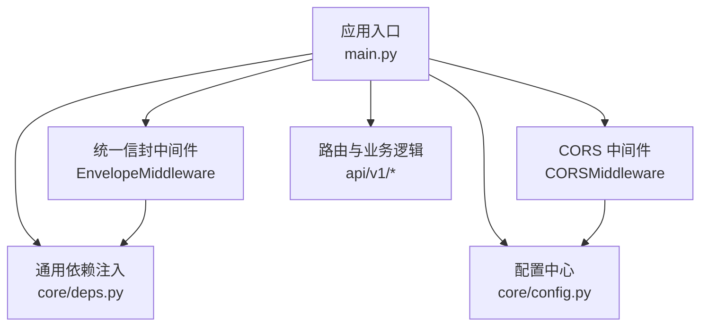
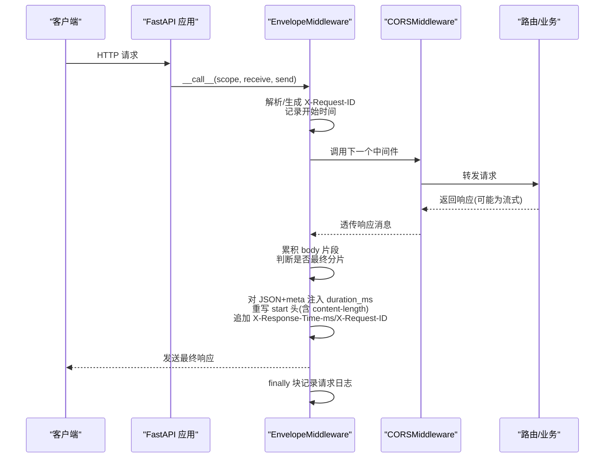
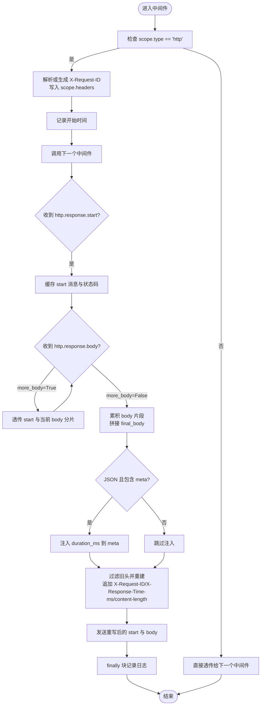
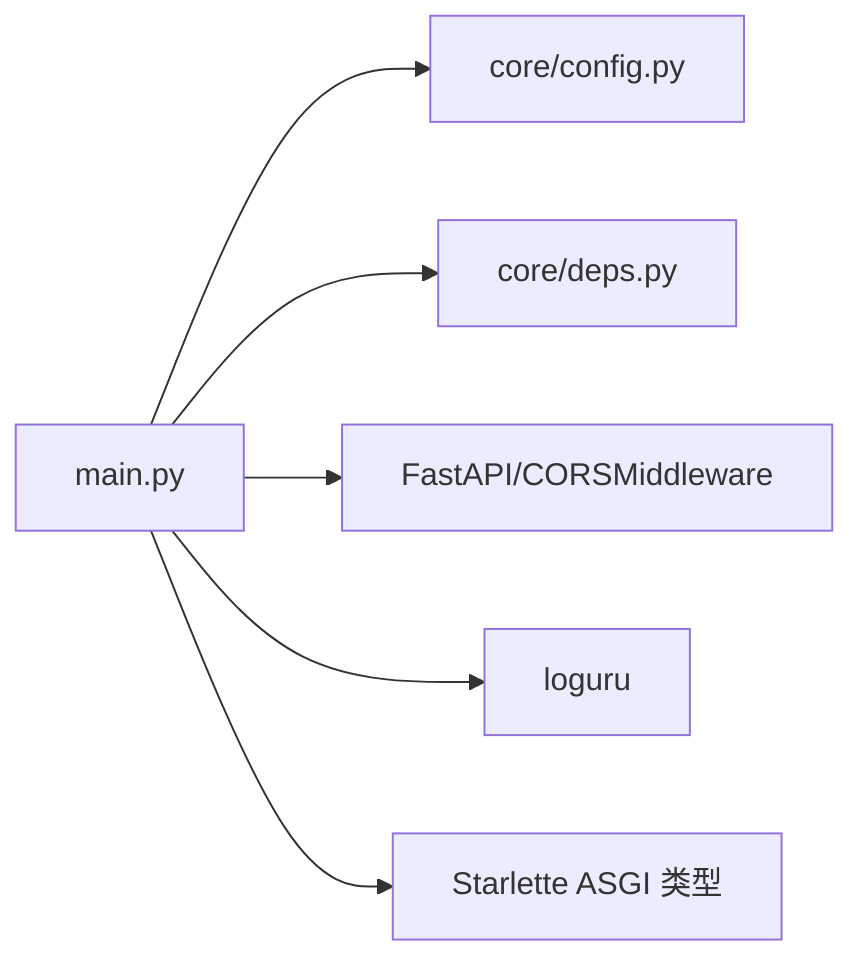

# 中间件系统

<cite>
**本文引用的文件**
- [backend/app/main.py](file://backend/app/main.py)
- [backend/app/core/config.py](file://backend/app/core/config.py)
- [backend/app/core/deps.py](file://backend/app/core/deps.py)
</cite>

## 目录
1. [简介](#简介)
2. [项目结构](#项目结构)
3. [核心组件](#核心组件)
4. [架构总览](#架构总览)
5. [详细组件分析](#详细组件分析)
6. [依赖关系分析](#依赖关系分析)
7. [性能考量](#性能考量)
8. [故障排查指南](#故障排查指南)
9. [结论](#结论)
10. [附录：自定义中间件开发指南](#附录自定义中间件开发指南)

## 简介
本文件聚焦于后端中间件系统的实现与使用，重点覆盖以下方面：
- EnvelopeMiddleware 统一信封响应机制：请求 ID 生成与追踪、响应时间计算、内容长度更新。
- CORS 中间件配置：跨域策略与安全头设置。
- 中间件执行顺序、ASGI 协议处理、流式响应支持。
- 自定义中间件开发指南：最佳实践、性能优化技巧与调试方法。

## 项目结构
中间件相关代码集中在应用入口与配置模块中：
- 应用入口负责创建 FastAPI 实例、注册中间件、挂载路由与异常处理器。
- 配置模块提供 CORS 源列表等运行时参数。
- 依赖注入模块提供请求 ID 获取能力，供业务层使用。

图表来源
- [backend/app/main.py:187-248](file://backend/app/main.py#L187-L248)
- [backend/app/core/config.py:118-122](file://backend/app/core/config.py#L118-L122)
- [backend/app/core/deps.py:91-98](file://backend/app/core/deps.py#L91-L98)

章节来源
- [backend/app/main.py:187-248](file://backend/app/main.py#L187-L248)
- [backend/app/core/config.py:118-122](file://backend/app/core/config.py#L118-L122)
- [backend/app/core/deps.py:91-98](file://backend/app/core/deps.py#L91-L98)

## 核心组件
- EnvelopeMiddleware：统一信封响应中间件，负责请求 ID 解析/生成、耗时统计、响应体元数据注入、content-length 同步更新与日志记录。
- CORSMiddleware：基于 FastAPI 的 CORS 中间件，按配置允许跨域并暴露必要响应头。
- get_request_id：依赖注入函数，优先使用客户端传入的请求 ID，否则生成新的 UUID。

章节来源
- [backend/app/main.py:29-184](file://backend/app/main.py#L29-L184)
- [backend/app/main.py:215-227](file://backend/app/main.py#L215-L227)
- [backend/app/core/deps.py:91-98](file://backend/app/core/deps.py#L91-L98)

## 架构总览
中间件在 ASGI 管线中的位置与职责如下：
- 请求进入后先经过 EnvelopeMiddleware（最早注册），随后进入 CORS 中间件，再到达路由与业务逻辑。
- 响应返回时，先由业务逻辑产出，再经 CORS 中间件处理跨域头，最后回到 EnvelopeMiddleware 完成统一信封增强与日志记录。

图表来源
- [backend/app/main.py:29-184](file://backend/app/main.py#L29-L184)
- [backend/app/main.py:215-227](file://backend/app/main.py#L215-L227)

## 详细组件分析

### EnvelopeMiddleware 统一信封响应机制
- 请求 ID 生成与追踪
  - 若请求携带 X-Request-ID，则复用；否则生成新 UUID 并回写到 scope headers，确保下游依赖能读取到同一 ID。
  - 在响应头中回写 X-Request-ID，便于客户端与链路追踪系统关联。
- 响应时间计算
  - 使用高精度计时器记录请求开始时间，在 finally 块与重写 start 头时分别计算耗时，写入响应头 X-Response-Time-ms。
- 内容长度更新
  - 由于 ASGI 的 http.response.start 已发送，无法在 body 阶段修改头部，因此采用完全缓冲模式：累积所有 body 片段，在最后一片到达时统一重写 start 头，并同步更新 content-length，避免客户端解析截断。
- 统一信封增强
  - 当状态码为 200、Content-Type 包含 application/json、且响应体存在 meta 字段时，将 duration_ms 注入到 meta 中，保持统一信封格式一致。
- 流式响应支持
  - 对于 more_body=True 的中间分片，直接透传 start 与 body，不进行重写；仅在 final 分片进行统一处理。这保证了 SSE/Server-Sent Events 等流式场景不被阻塞。
- 日志记录
  - 在 finally 块中记录方法、路径、状态码与总耗时，便于监控与排障。

图表来源
- [backend/app/main.py:29-184](file://backend/app/main.py#L29-L184)

章节来源
- [backend/app/main.py:29-184](file://backend/app/main.py#L29-L184)

### CORS 中间件配置
- 跨域策略
  - allow_origins 来自配置项 cors_origin_list，默认包含本地前端地址。
  - allow_credentials 开启，允许携带凭据。
  - allow_methods 与 allow_headers 均设置为通配符，简化开发环境配置。
- 安全头设置
  - expose_headers 显式暴露 X-Request-ID 与 X-Response-Time-ms，使浏览器端可读取这些响应头。
- 配置来源
  - cors_origins 通过环境变量或 .env 文件加载，支持逗号分隔与空白清理。

章节来源
- [backend/app/main.py:219-227](file://backend/app/main.py#L219-L227)
- [backend/app/core/config.py:84-122](file://backend/app/core/config.py#L84-L122)

### 中间件执行顺序与 ASGI 协议处理
- 执行顺序
  - 在 create_app 中，首先注册 EnvelopeMiddleware，然后注册 CORSMiddleware。根据 FastAPI 的中间件栈规则，请求进入时从最外层到内层依次执行，返回时反向。
  - 因此，请求流程为：EnvelopeMiddleware → CORSMiddleware → 路由/业务；响应流程为：路由/业务 → CORSMiddleware → EnvelopeMiddleware。
- ASGI 协议处理
  - EnvelopeMiddleware 直接操作 ASGI 的 Scope、Receive、Send，拦截 http.response.start 与 http.response.body 消息，符合 ASGI 规范。
  - 对非 HTTP 类型（如 websocket）直接透传，不影响其他协议。

章节来源
- [backend/app/main.py:215-227](file://backend/app/main.py#L215-L227)
- [backend/app/main.py:47-50](file://backend/app/main.py#L47-L50)

### 依赖注入与请求 ID 一致性
- get_request_id 依赖
  - 优先使用客户端传入的 X-Request-ID，否则生成新的 UUID。
  - 该依赖被多个 API 控制器使用，用于在响应 meta 中回传 request_id，便于前端与日志关联。
- 与中间件的协同
  - EnvelopeMiddleware 在 scope.headers 中写入 X-Request-ID，保证后续依赖注入能读到一致的请求 ID。

章节来源
- [backend/app/core/deps.py:91-98](file://backend/app/core/deps.py#L91-L98)
- [backend/app/main.py:52-63](file://backend/app/main.py#L52-L63)

## 依赖关系分析
- 模块耦合
  - main.py 依赖 core/config.py 获取 CORS 配置，依赖 core/deps.py 提供的依赖注入函数。
  - EnvelopeMiddleware 仅依赖标准库与 ASGI 类型，不引入额外第三方包，具备高内聚低耦合特性。
- 外部依赖
  - FastAPI 与 Starlette 提供中间件框架与 ASGI 协议支持。
  - loguru 用于结构化日志输出。

图表来源
- [backend/app/main.py:17-26](file://backend/app/main.py#L17-L26)
- [backend/app/core/config.py:118-122](file://backend/app/core/config.py#L118-L122)
- [backend/app/core/deps.py:91-98](file://backend/app/core/deps.py#L91-L98)

章节来源
- [backend/app/main.py:17-26](file://backend/app/main.py#L17-L26)
- [backend/app/core/config.py:118-122](file://backend/app/core/config.py#L118-L122)
- [backend/app/core/deps.py:91-98](file://backend/app/core/deps.py#L91-L98)

## 性能考量
- 内存占用
  - EnvelopeMiddleware 采用完全缓冲模式，会将整个响应体累积到内存后再重写。对于大响应体（例如文件下载、大数据导出）可能造成内存峰值上升。建议：
    - 对大响应体使用流式传输，并在业务层避免触发统一信封增强条件（如非 JSON 或非 200）。
    - 或将大响应体拆分为小分片，减少单次累积大小。
- CPU 开销
  - 对 JSON 响应体进行解析与序列化以注入 duration_ms，会增加 CPU 消耗。建议：
    - 仅在需要时启用统一信封增强（例如通过开关控制）。
    - 对高频接口考虑缓存或预计算耗时。
- I/O 与延迟
  - 流式响应中间分片直接透传，不会增加额外等待；但首次 start 消息会在第一个 body 分片到来时发送，可能略微影响首字节延迟。可通过调整上游中间件行为优化。
- 日志开销
  - finally 块记录每条请求的日志，生产环境建议合理设置日志级别与采样率，避免 I/O 瓶颈。

[本节为通用指导，无需具体文件引用]

## 故障排查指南
- 问题：客户端无法读取 X-Request-ID 或 X-Response-Time-ms
  - 检查 CORS 的 expose_headers 是否包含这两个响应头。
  - 确认浏览器同源策略与凭据设置是否正确。
- 问题：响应体被截断或解析失败
  - 检查 content-length 是否与实际 body 长度一致。EnvelopeMiddleware 会在重写 start 头时更新 content-length，若业务层手动设置不一致会导致问题。
- 问题：流式响应异常
  - 确认上游服务正确发送 more_body=True 的分片，并在最后一个分片设置 more_body=False。
  - 注意 EnvelopeMiddleware 对流式响应的透传行为，避免在中间分片中尝试修改头部。
- 问题：请求 ID 不一致
  - 确认客户端是否在请求头中传递 X-Request-ID，以及 EnvelopeMiddleware 是否正确回写到 scope.headers。
  - 检查 get_request_id 依赖是否被正确使用。

章节来源
- [backend/app/main.py:219-227](file://backend/app/main.py#L219-L227)
- [backend/app/main.py:52-63](file://backend/app/main.py#L52-L63)
- [backend/app/main.py:130-156](file://backend/app/main.py#L130-L156)
- [backend/app/core/deps.py:91-98](file://backend/app/core/deps.py#L91-L98)

## 结论
EnvelopeMiddleware 实现了统一的信封响应机制，结合 CORS 中间件提供了完善的跨域支持与可观测性。其 ASGI 级别的实现确保了与流式响应的兼容性与高性能。通过合理的配置与优化，可在保障一致性的同时兼顾扩展性与稳定性。

[本节为总结性内容，无需具体文件引用]

## 附录：自定义中间件开发指南
- 基本步骤
  - 定义一个类，实现 __init__(self, app: ASGIApp) 与 async __call__(self, scope: Scope, receive: Receive, send: Send)。
  - 在 __call__ 中判断 scope["type"]，仅处理 http 类型，其他类型直接透传。
  - 使用 original_send 包装 send，拦截 http.response.start 与 http.response.body 消息，按需修改或增强。
- 最佳实践
  - 尽量在 start 阶段收集必要信息，在 body 阶段最小化处理，避免阻塞流式响应。
  - 对大响应体谨慎使用完全缓冲模式，必要时提供开关或阈值控制。
  - 使用 try/finally 确保资源释放与日志记录。
- 性能优化技巧
  - 避免不必要的字符串编解码与 JSON 解析，仅在满足条件时执行。
  - 使用高效的数据结构与算法，减少内存分配与拷贝。
  - 合理使用异步 I/O，避免阻塞事件循环。
- 调试方法
  - 在关键路径添加结构化日志，记录输入输出摘要与耗时。
  - 使用请求 ID 贯穿全链路，便于定位问题。
  - 针对流式响应，记录每个分片的 more_body 标志与大小，帮助诊断分片问题。

[本节为通用指导，无需具体文件引用]