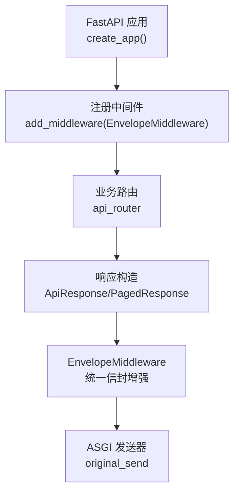
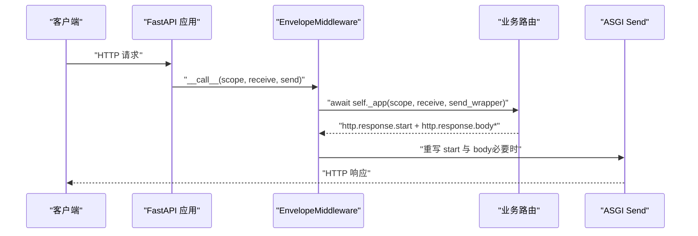
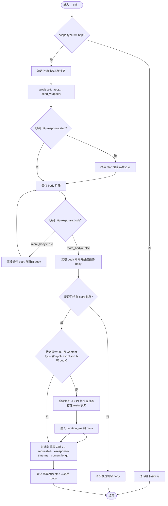
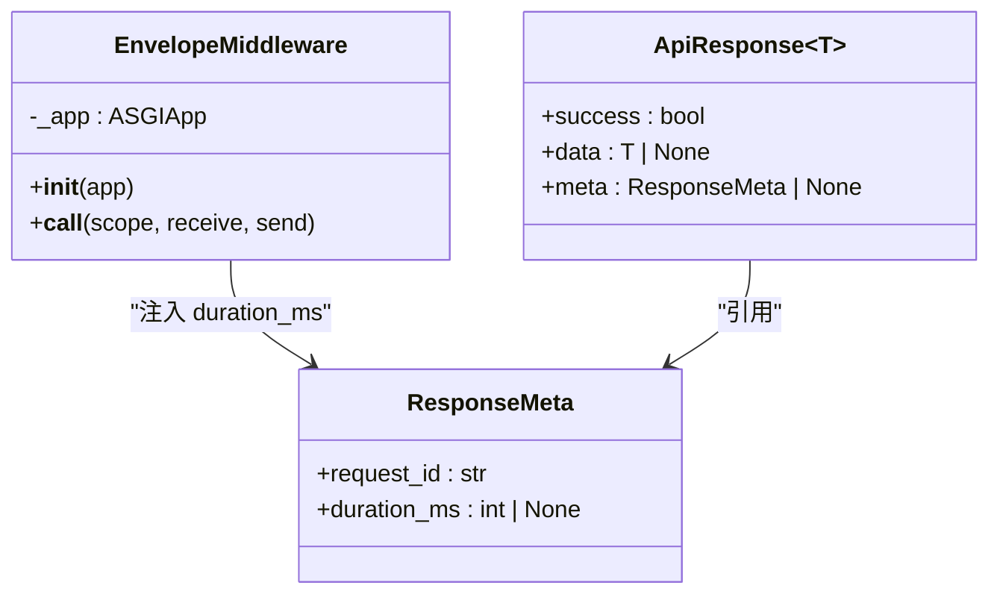

# 统一信封响应中间件

<cite>
**本文引用的文件**   
- [backend/app/main.py](file://backend/app/main.py)
- [backend/app/schemas/common.py](file://backend/app/schemas/common.py)
</cite>

## 目录
1. [简介](#简介)
2. [项目结构](#项目结构)
3. [核心组件](#核心组件)
4. [架构总览](#架构总览)
5. [详细组件分析](#详细组件分析)
6. [依赖关系分析](#依赖关系分析)
7. [性能考量](#性能考量)
8. [故障排查指南](#故障排查指南)
9. [结论](#结论)
10. [附录](#附录)

## 简介
本文件围绕“统一信封响应中间件”展开，聚焦 EnvelopeMiddleware 类的实现原理与行为。内容涵盖：
- 请求 ID 生成与追踪机制
- 响应时间计算逻辑
- 内容长度更新策略
- ASGI 协议处理流程（start 消息缓存、body 分片累积、流式响应支持）
- JSON 响应体 meta 字段注入 duration_ms 的实现细节
- 自定义中间件开发指南（含性能优化技巧与调试方法）

该中间件位于应用入口模块中，作为全局中间件注册，对 HTTP 请求/响应进行统一增强，确保所有 API 返回一致的结构化信封格式，并附带可观测性信息。

## 项目结构
与本文直接相关的代码集中在应用入口与通用响应模型定义两处：
- 应用入口与中间件实现：backend/app/main.py
- 统一响应信封与元数据模型：backend/app/schemas/common.py

图表来源
- [backend/app/main.py:187-248](file://backend/app/main.py#L187-L248)
- [backend/app/schemas/common.py:63-81](file://backend/app/schemas/common.py#L63-L81)

章节来源
- [backend/app/main.py:187-248](file://backend/app/main.py#L187-L248)
- [backend/app/schemas/common.py:63-81](file://backend/app/schemas/common.py#L63-L81)

## 核心组件
- EnvelopeMiddleware：统一信封响应中间件，负责请求 ID 管理、耗时统计、响应头注入、JSON 响应体 meta 注入、content-length 修正以及日志记录。
- ResponseMeta：响应元数据模型，包含 request_id 与 duration_ms 字段，用于在成功响应信封中携带可观测性信息。

章节来源
- [backend/app/main.py:29-185](file://backend/app/main.py#L29-L185)
- [backend/app/schemas/common.py:44-49](file://backend/app/schemas/common.py#L44-L49)

## 架构总览
从调用链看，客户端请求进入 FastAPI 后，先经过 EnvelopeMiddleware，再进入路由处理器；响应由路由层构造为 ApiResponse/PagedResponse 等信封结构，随后再次流经 EnvelopeMiddleware，完成头部与响应体的增强与修正。

图表来源
- [backend/app/main.py:47-185](file://backend/app/main.py#L47-L185)

## 详细组件分析

### EnvelopeMiddleware 类分析
该类实现了完整的 ASGI 中间件协议，核心职责如下：
- 解析或生成 X-Request-ID，并回写到 scope headers，保证下游依赖能读取到同一 ID
- 使用高精度计时器计算请求耗时，写入响应头 X-Response-Time-ms
- 对 200 状态且 application/json 的响应体，若存在 meta 字段，则注入 duration_ms
- 同步更新 content-length，避免客户端因长度不一致导致解析截断
- 记录请求日志（方法、路径、状态码、耗时）

#### 关键实现要点
- 非 HTTP 类型请求直接透传
- 通过 send_wrapper 拦截 ASGI 消息，缓存 start 消息并在最后一片 body 到达时统一处理
- 对于 more_body=True 的中间分片，直接透传，不重写 start，以兼容流式响应
- 仅在最后一片 body 到达时，才可能重写 start 并注入头部与修正 content-length
- 对 JSON 响应体进行安全解析与修改，异常情况下保留原 body

图表来源
- [backend/app/main.py:47-185](file://backend/app/main.py#L47-L185)

章节来源
- [backend/app/main.py:29-185](file://backend/app/main.py#L29-L185)

### 请求 ID 生成与追踪机制
- 优先从请求头 x-request-id 解析；若缺失，则生成 UUID hex 字符串
- 将生成的 ID 回写到 scope.headers，使下游依赖（如 get_request_id）可读取
- 在响应阶段，将 x-request-id 写入响应头，便于客户端与链路追踪系统关联

章节来源
- [backend/app/main.py:52-63](file://backend/app/main.py#L52-L63)
- [backend/app/main.py:142-144](file://backend/app/main.py#L142-L144)

### 响应时间计算逻辑
- 使用高精度计时器 perf_counter 在请求开始时记录起点
- 在 finally 块中计算总耗时毫秒数，并写入响应头 x-response-time-ms
- 同时记录结构化日志，包含方法、路径、状态码与耗时

章节来源
- [backend/app/main.py:65-66](file://backend/app/main.py#L65-L66)
- [backend/app/main.py:131-149](file://backend/app/main.py#L131-L149)
- [backend/app/main.py:172-184](file://backend/app/main.py#L172-L184)

### 内容长度更新策略
- 在重写 start 时，根据最终 body 字节长度重新设置 content-length
- 过滤掉原有的 x-request-id、x-response-time-ms、content-length，避免重复或冲突
- 确保客户端不会因长度不一致而提前终止或解析失败

章节来源
- [backend/app/main.py:132-156](file://backend/app/main.py#L132-L156)

### ASGI 协议处理流程
- start 消息缓存：收到 http.response.start 时暂存，以便在最后一片 body 到达时统一重写
- body 分片累积：收集所有 body 片段，在 more_body=False 时拼接成最终 body
- 流式响应支持：当 more_body=True 时，立即透传 start 与当前 body，不进行重写，保持流式特性

章节来源
- [backend/app/main.py:73-97](file://backend/app/main.py#L73-L97)
- [backend/app/main.py:80-92](file://backend/app/main.py#L80-L92)

### JSON 响应体 meta 字段注入 duration_ms
- 条件判断：仅当状态码为 200、Content-Type 包含 application/json、且存在非空 body 时执行
- 安全解析：尝试将 final_body 解析为 JSON，若失败则保留原 body
- 结构校验：要求顶层为字典且存在 meta 字段且 meta 为字典
- 注入逻辑：计算当前耗时毫秒数并写入 data["meta"]["duration_ms"]
- 重建响应体：将修改后的对象序列化为 UTF-8 字节串，替换 final_body

章节来源
- [backend/app/main.py:107-128](file://backend/app/main.py#L107-L128)

### 统一响应信封与元数据模型
- ResponseMeta：定义 request_id 与 duration_ms 字段，供成功响应信封使用
- ApiResponse/PagedResponse：统一的成功响应信封结构，前端可据此编写通用解析器

章节来源
- [backend/app/schemas/common.py:44-49](file://backend/app/schemas/common.py#L44-L49)
- [backend/app/schemas/common.py:63-81](file://backend/app/schemas/common.py#L63-L81)

## 依赖关系分析
- EnvelopeMiddleware 依赖 Starlette ASGI 类型（Scope、Message、Receive、Send）
- 通过 add_middleware 注册为全局中间件，位于 CORS 之前，确保所有响应均被增强
- 与日志系统集成，在 finally 块中输出请求日志

图表来源
- [backend/app/main.py:29-185](file://backend/app/main.py#L29-L185)
- [backend/app/schemas/common.py:44-81](file://backend/app/schemas/common.py#L44-L81)

章节来源
- [backend/app/main.py:215-227](file://backend/app/main.py#L215-L227)
- [backend/app/schemas/common.py:44-81](file://backend/app/schemas/common.py#L44-L81)

## 性能考量
- 完全缓冲模式：为保证 content-length 正确性与 meta 注入，中间件会累积所有 body 片段，适用于中小体积响应；超大响应需评估内存占用
- 流式响应：对 more_body=True 的分片直接透传，避免不必要的缓冲，但无法在此路径上重写 start 与注入 meta
- 序列化开销：对 JSON 响应体进行解析与重序列化，会增加 CPU 开销；建议仅在必要接口启用或限制范围
- 计时精度：使用 perf_counter 提供高精度耗时统计，适合性能监控与告警

[本节为通用指导，无需具体文件分析]

## 故障排查指南
- 现象：响应头缺少 x-request-id 或 x-response-time-ms
  - 检查是否为非 HTTP 类型请求（会被直接透传）
  - 确认中间件已注册且顺序正确
- 现象：客户端提示 content-length 不匹配
  - 确认中间件是否在最后一片 body 到达时重写 start 并更新 content-length
- 现象：meta.duration_ms 未注入
  - 检查状态码是否为 200、Content-Type 是否包含 application/json、响应体是否为有效 JSON 且存在 meta 字典
- 现象：流式响应未按预期工作
  - 确认上游是否正确发送 more_body=True 的分片；中间件在流式路径下不重写 start，属于设计行为

章节来源
- [backend/app/main.py:47-50](file://backend/app/main.py#L47-L50)
- [backend/app/main.py:80-97](file://backend/app/main.py#L80-L97)
- [backend/app/main.py:107-128](file://backend/app/main.py#L107-L128)
- [backend/app/main.py:132-156](file://backend/app/main.py#L132-L156)

## 结论
EnvelopeMiddleware 通过统一的信封增强与可观测性注入，显著提升了 API 的一致性与可维护性。其基于 ASGI 协议的完整缓冲与流式兼容策略，在保证功能性的同时兼顾了性能与扩展性。结合 ResponseMeta 与 ApiResponse/PagedResponse 的统一模型，前后端协作更加顺畅。

[本节为总结性内容，无需具体文件分析]

## 附录

### 自定义中间件开发指南
- 遵循 ASGI 协议：实现 __call__(scope, receive, send)，正确处理 http.response.start 与 http.response.body
- 请求上下文传递：如需跨层共享数据，可通过 scope 或请求状态传递（例如 request_id）
- 响应增强策略：
  - 若需要修改响应头或内容长度，建议在最后一片 body 到达时统一重写 start
  - 对大响应或流式响应，谨慎使用完全缓冲，避免内存压力
- 错误处理：
  - 对 JSON 解析等操作增加 try/except，确保异常不影响主流程
  - 在 finally 块中记录日志与资源清理
- 性能优化：
  - 减少不必要的序列化与反序列化
  - 对高频路径开启轻量级增强，对低频路径使用更全面的增强
- 调试方法：
  - 在中间件内部打印关键变量（如 status_code、content_type、final_body 长度）
  - 利用 x-request-id 与 x-response-time-ms 进行端到端追踪与性能分析

[本节为通用指导，无需具体文件分析]