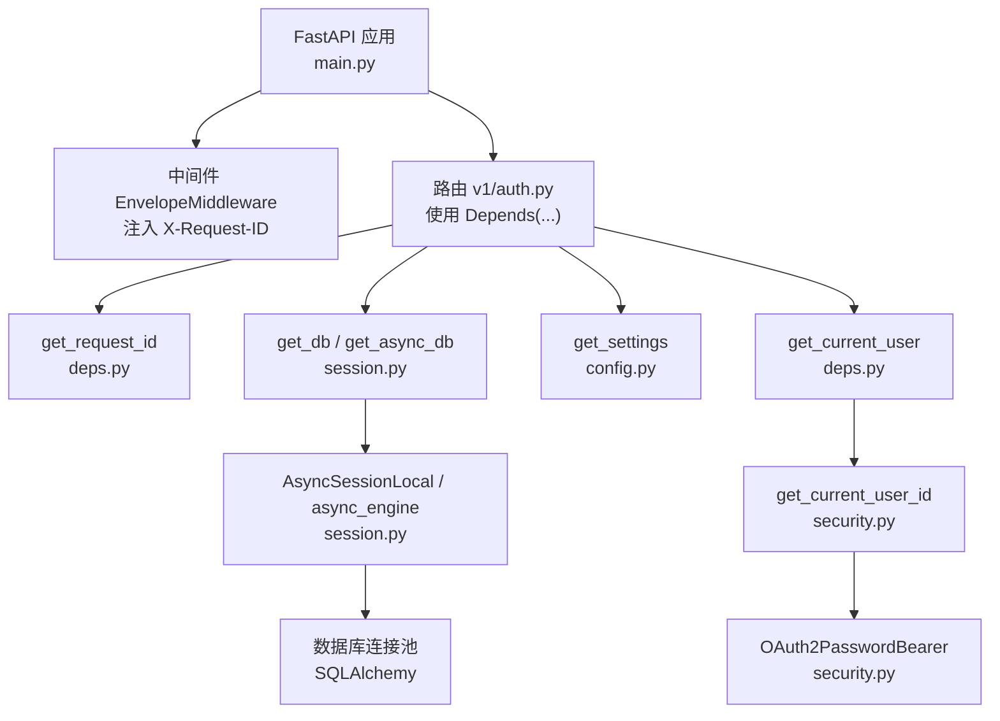
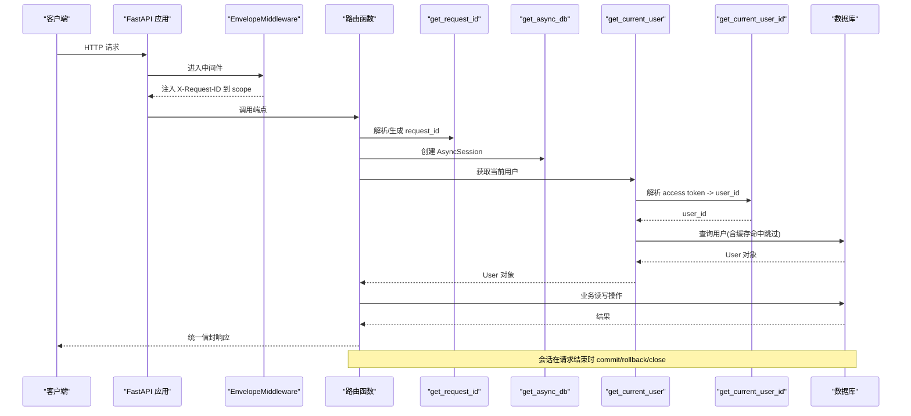
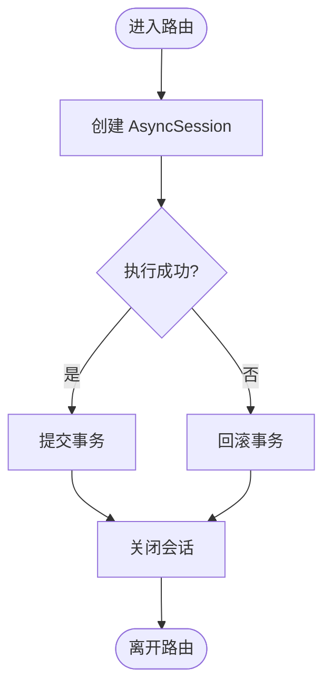
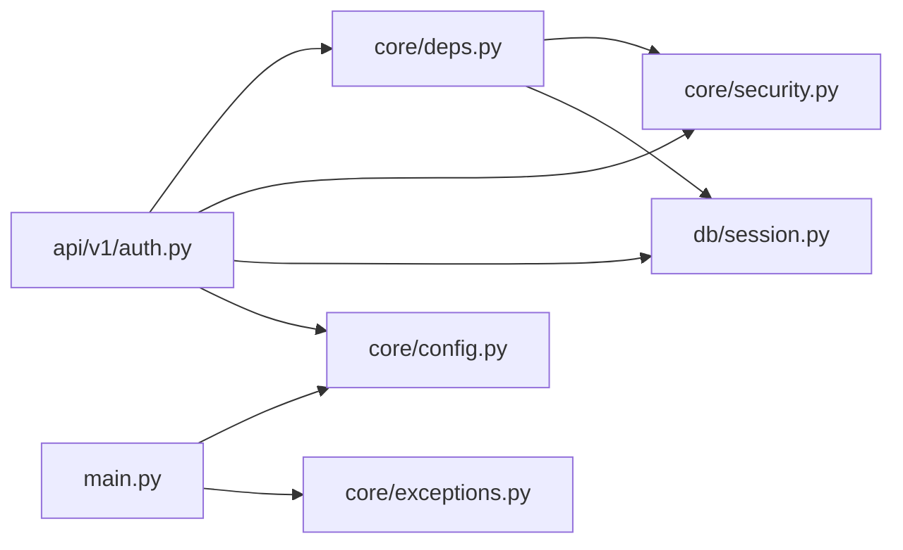
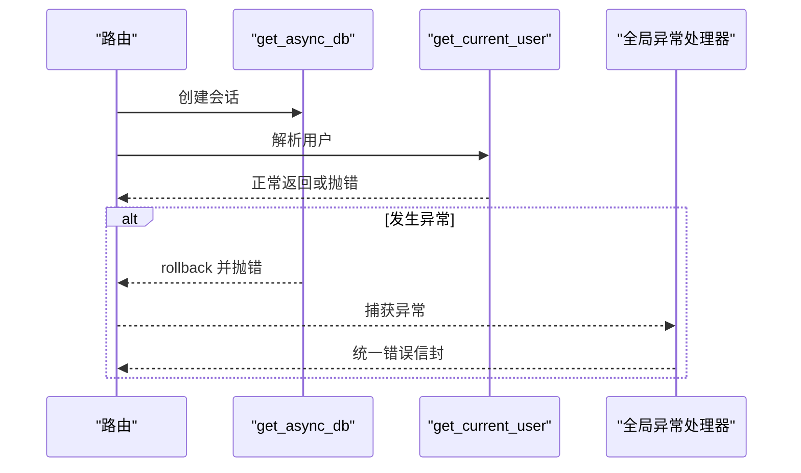

# 依赖注入系统

<cite>
**本文引用的文件**   
- [backend/app/core/deps.py](file://backend/app/core/deps.py)
- [backend/app/db/session.py](file://backend/app/db/session.py)
- [backend/app/core/config.py](file://backend/app/core/config.py)
- [backend/app/main.py](file://backend/app/main.py)
- [backend/app/api/v1/auth.py](file://backend/app/api/v1/auth.py)
- [backend/app/core/security.py](file://backend/app/core/security.py)
- [backend/app/core/exceptions.py](file://backend/app/core/exceptions.py)
- [tests/test_deps.py](file://tests/test_deps.py)
</cite>

## 目录
1. [简介](#简介)
2. [项目结构](#项目结构)
3. [核心组件](#核心组件)
4. [架构总览](#架构总览)
5. [详细组件分析](#详细组件分析)
6. [依赖关系分析](#依赖关系分析)
7. [性能与缓存策略](#性能与缓存策略)
8. [异步依赖与错误传播](#异步依赖与错误传播)
9. [测试中的依赖替换](#测试中的依赖替换)
10. [自定义依赖开发指南](#自定义依赖开发指南)
11. [故障排查](#故障排查)
12. [结论](#结论)

## 简介
本文件系统性梳理 FastAPI 依赖注入在该仓库中的实现与实践，覆盖数据库会话管理、配置对象获取、服务实例化、依赖缓存策略、生命周期管理、循环依赖避免、异步依赖处理、错误传播、测试替换以及自定义依赖开发与调试优化建议。目标是帮助读者快速理解并高效扩展该系统的依赖注入机制。

## 项目结构
依赖注入相关代码主要分布在以下模块：
- 通用依赖定义：backend/app/core/deps.py
- 数据库会话工厂与依赖：backend/app/db/session.py
- 全局配置单例：backend/app/core/config.py
- 应用入口与中间件（请求 ID 注入）：backend/app/main.py
- 认证与安全依赖：backend/app/core/security.py
- API 路由示例（使用依赖）：backend/app/api/v1/auth.py
- 统一异常与处理器：backend/app/core/exceptions.py
- 依赖单元测试：tests/test_deps.py



图表来源
- [backend/app/main.py:187-248](file://backend/app/main.py#L187-L248)
- [backend/app/api/v1/auth.py:41-147](file://backend/app/api/v1/auth.py#L41-L147)
- [backend/app/core/deps.py:101-129](file://backend/app/core/deps.py#L101-L129)
- [backend/app/db/session.py:94-128](file://backend/app/db/session.py#L94-L128)
- [backend/app/core/config.py:136-144](file://backend/app/core/config.py#L136-L144)
- [backend/app/core/security.py:155-175](file://backend/app/core/security.py#L155-L175)

章节来源
- [backend/app/main.py:187-248](file://backend/app/main.py#L187-L248)
- [backend/app/api/v1/auth.py:41-147](file://backend/app/api/v1/auth.py#L41-L147)
- [backend/app/core/deps.py:1-129](file://backend/app/core/deps.py#L1-129)
- [backend/app/db/session.py:1-128](file://backend/app/db/session.py#L1-L128)
- [backend/app/core/config.py:1-144](file://backend/app/core/config.py#L1-L144)
- [backend/app/core/security.py:1-211](file://backend/app/core/security.py#L1-L211)

## 核心组件
- 数据库会话依赖
  - 提供异步会话 get_async_db 与同步会话 get_sync_db；在请求结束时自动提交或回滚，确保资源释放。
  - 通过 AsyncSessionLocal 和 async_engine 管理连接池，SQLite 与非 SQLite 路径差异化配置。
- 配置对象依赖
  - Settings 基于 pydantic-settings 加载环境变量，get_settings 使用 lru_cache 保证单例。
- 用户与会话上下文依赖
  - get_current_user_id 从 Authorization header 解析 access token，返回用户 ID。
  - get_current_user 结合 get_current_user_id 与数据库查询，返回完整 User 对象，并带短 TTL 内存缓存。
- 通用依赖
  - get_pagination 将分页参数校验并封装为 Pagination dataclass。
  - get_request_id 优先使用客户端传入的 X-Request-ID，否则生成 UUID。

章节来源
- [backend/app/db/session.py:94-128](file://backend/app/db/session.py#L94-L128)
- [backend/app/core/config.py:136-144](file://backend/app/core/config.py#L136-L144)
- [backend/app/core/security.py:155-175](file://backend/app/core/security.py#L155-L175)
- [backend/app/core/deps.py:83-99](file://backend/app/core/deps.py#L83-L99)
- [backend/app/core/deps.py:101-129](file://backend/app/core/deps.py#L101-L129)

## 架构总览
下图展示了典型请求的生命周期与依赖注入顺序：中间件注入请求 ID，路由声明依赖，FastAPI 按依赖图解析并执行，最终返回响应。



图表来源
- [backend/app/main.py:29-185](file://backend/app/main.py#L29-L185)
- [backend/app/api/v1/auth.py:137-147](file://backend/app/api/v1/auth.py#L137-L147)
- [backend/app/core/deps.py:91-129](file://backend/app/core/deps.py#L91-L129)
- [backend/app/core/security.py:155-175](file://backend/app/core/security.py#L155-L175)
- [backend/app/db/session.py:94-128](file://backend/app/db/session.py#L94-L128)

## 详细组件分析

### 数据库会话管理（get_async_db / get_sync_db）
- 设计要点
  - 使用 async_sessionmaker 与 sessionmaker 分别创建异步/同步会话工厂。
  - 非 SQLite 场景启用连接池参数（pool_size、max_overflow、pool_pre_ping），SQLite 场景禁用连接池参数。
  - 异步依赖以生成器形式 yield 会话，请求结束自动 commit 或 rollback，并关闭会话。
- 数据流
  - 路由声明 db: AsyncSession = Depends(get_async_db)。
  - FastAPI 在进入路由前创建会话，退出时清理。
- 复杂度与性能
  - 会话创建/销毁开销由连接池承担；commit/rollback 在 try/except 中兜底，避免泄漏。
- 错误处理
  - 任何异常触发 rollback，再向上抛出，交由全局异常处理器统一包装。



图表来源
- [backend/app/db/session.py:94-128](file://backend/app/db/session.py#L94-L128)

章节来源
- [backend/app/db/session.py:1-128](file://backend/app/db/session.py#L1-L128)

### 配置对象获取（get_settings）
- 设计要点
  - Settings 类集中管理所有配置项，支持 .env 与环境变量覆盖。
  - get_settings 使用 lru_cache 缓存实例，避免重复读取配置文件。
- 使用方式
  - 在路由或服务层通过 settings: Settings = Depends(get_settings) 注入。
- 注意事项
  - 测试中可通过 get_settings.cache_clear() 重置缓存，以便切换不同环境配置。

章节来源
- [backend/app/core/config.py:1-144](file://backend/app/core/config.py#L1-L144)

### 用户与会话上下文（get_current_user_id / get_current_user）
- 设计要点
  - get_current_user_id 从 Authorization header 提取 access token，解码后返回用户 ID。
  - get_current_user 组合 get_current_user_id 与数据库查询，返回完整 User 对象。
  - 引入短 TTL 内存缓存，减少频繁的用户查询。
- 缓存策略
  - 使用进程内字典 _USER_CACHE 存储 (user, expire_at)，TTL 默认 10 秒。
  - 提供 invalidate_user_cache 用于主动失效。
- 安全与一致性
  - 仅接受 type=access 的 token，拒绝 refresh token。
  - 用户被禁用或未找到时抛出 UnauthorizedError。

```mermaid
classDiagram
class Security {
+get_current_user_id(token, settings) str
+create_access_token(user_id, role, settings) str
+create_refresh_token(user_id, settings) str
+decode_token(token, settings) dict
}
class Deps {
+get_request_id(x_request_id) str
+get_pagination(page, page_size) Pagination
+get_current_user(user_id, db) User
+invalidate_user_cache(user_id) void
}
class Session {
+get_async_db() AsyncGenerator[AsyncSession]
+get_sync_db() Generator[Session]
}
Security --> Deps : "被 deps.get_current_user 使用"
Deps --> Session : "db : AsyncSession"
```

图表来源
- [backend/app/core/security.py:155-175](file://backend/app/core/security.py#L155-L175)
- [backend/app/core/deps.py:101-129](file://backend/app/core/deps.py#L101-L129)
- [backend/app/db/session.py:94-128](file://backend/app/db/session.py#L94-L128)

章节来源
- [backend/app/core/security.py:155-175](file://backend/app/core/security.py#L155-L175)
- [backend/app/core/deps.py:26-65](file://backend/app/core/deps.py#L26-L65)
- [backend/app/core/deps.py:101-129](file://backend/app/core/deps.py#L101-L129)

### 通用依赖（get_request_id / get_pagination）
- get_request_id
  - 优先使用客户端传入的 X-Request-ID，否则生成 UUID hex。
  - 配合中间件写入 scope headers，使下游依赖可一致读取。
- get_pagination
  - 对 page/page_size 进行范围校验，返回 Pagination dataclass，提供 offset/limit 计算。

章节来源
- [backend/app/core/deps.py:83-99](file://backend/app/core/deps.py#L83-L99)
- [backend/app/main.py:29-185](file://backend/app/main.py#L29-L185)

### API 路由中的依赖使用示例（auth.py）
- 登录/刷新令牌
  - 使用 get_request_id、get_db、get_settings 完成鉴权与令牌签发。
- 获取当前用户
  - 使用 get_current_user 直接注入 User 对象，简化权限判断逻辑。

章节来源
- [backend/app/api/v1/auth.py:41-147](file://backend/app/api/v1/auth.py#L41-L147)

## 依赖关系分析
- 耦合与内聚
  - deps.py 聚合通用依赖，session.py 专注数据库会话，config.py 专注配置，security.py 专注认证，职责清晰，内聚度高。
- 直接依赖
  - auth.py 依赖 deps、security、session、config。
  - deps.py 依赖 security、session、models.user。
  - main.py 依赖 config、logging、exception handlers。
- 潜在循环依赖
  - 当前未发现循环导入；依赖方向自上而下：路由 -> 依赖 -> 基础设施。
- 外部集成点
  - SQLAlchemy 引擎与会话工厂、JWT 库、bcrypt、pydantic-settings。



图表来源
- [backend/app/api/v1/auth.py:41-147](file://backend/app/api/v1/auth.py#L41-L147)
- [backend/app/core/deps.py:1-129](file://backend/app/core/deps.py#L1-L129)
- [backend/app/core/security.py:1-211](file://backend/app/core/security.py#L1-L211)
- [backend/app/db/session.py:1-128](file://backend/app/db/session.py#L1-L128)
- [backend/app/core/config.py:1-144](file://backend/app/core/config.py#L1-L144)
- [backend/app/main.py:187-248](file://backend/app/main.py#L187-L248)
- [backend/app/core/exceptions.py:131-179](file://backend/app/core/exceptions.py#L131-L179)

章节来源
- [backend/app/api/v1/auth.py:41-147](file://backend/app/api/v1/auth.py#L41-L147)
- [backend/app/core/deps.py:1-129](file://backend/app/core/deps.py#L1-L129)
- [backend/app/core/security.py:1-211](file://backend/app/core/security.py#L1-L211)
- [backend/app/db/session.py:1-128](file://backend/app/db/session.py#L1-L128)
- [backend/app/core/config.py:1-144](file://backend/app/core/config.py#L1-L144)
- [backend/app/main.py:187-248](file://backend/app/main.py#L187-L248)
- [backend/app/core/exceptions.py:131-179](file://backend/app/core/exceptions.py#L131-L179)

## 性能与缓存策略
- 配置缓存
  - get_settings 使用 lru_cache，避免重复解析 .env 与类型校验。
- 用户缓存
  - 短 TTL 内存缓存降低高频用户查询压力；过期自动清理。
  - 提供主动失效接口，便于在用户状态变更时及时更新。
- 数据库连接池
  - 非 SQLite 场景开启 pool_size/max_overflow/pool_pre_ping，提升并发与健壮性。
- 中间件优化
  - EnvelopeMiddleware 仅在最后一片 body 到达时重写响应头，避免对流式响应造成额外开销。

章节来源
- [backend/app/core/config.py:136-144](file://backend/app/core/config.py#L136-L144)
- [backend/app/core/deps.py:26-65](file://backend/app/core/deps.py#L26-L65)
- [backend/app/db/session.py:51-80](file://backend/app/db/session.py#L51-L80)
- [backend/app/main.py:29-185](file://backend/app/main.py#L29-L185)

## 异步依赖与错误传播
- 异步依赖
  - get_async_db 与 get_current_user 均为异步依赖，FastAPI 自动调度协程。
- 错误传播
  - 会话层异常触发 rollback 并重新抛出，交由全局异常处理器转换为统一信封响应。
  - 认证失败抛出 UnauthorizedError，权限不足抛出 ForbiddenError，上游服务失败抛出 UpstreamError 等。
- 中间件与请求追踪
  - EnvelopeMiddleware 注入 X-Request-ID，并在响应头中附带耗时信息，便于链路追踪。



图表来源
- [backend/app/db/session.py:94-128](file://backend/app/db/session.py#L94-L128)
- [backend/app/core/deps.py:101-129](file://backend/app/core/deps.py#L101-L129)
- [backend/app/core/exceptions.py:131-179](file://backend/app/core/exceptions.py#L131-L179)

章节来源
- [backend/app/db/session.py:94-128](file://backend/app/db/session.py#L94-L128)
- [backend/app/core/deps.py:101-129](file://backend/app/core/deps.py#L101-L129)
- [backend/app/core/exceptions.py:131-179](file://backend/app/core/exceptions.py#L131-L179)

## 测试中的依赖替换
- 单元测试覆盖
  - tests/test_deps.py 验证 Pagination 与 get_request_id 的行为，包括默认值、边界条件与 FastAPI TestClient 集成。
- 替换策略建议
  - 使用 FastAPI 的 dependency_overrides 在测试中替换 get_db、get_settings、get_current_user 等依赖，注入 Mock 或内存实现。
  - 对于 get_settings，可在测试前后调用 cache_clear 重置配置缓存。
  - 对于数据库依赖，建议使用独立测试数据库或内存数据库（如 SQLite）。

章节来源
- [tests/test_deps.py:1-130](file://tests/test_deps.py#L1-L130)
- [backend/app/core/config.py:136-144](file://backend/app/core/config.py#L136-L144)

## 自定义依赖开发指南
- 基本模式
  - 普通依赖：纯函数，接收 Query/Header/Path 参数，返回任意 Python 对象。
  - 异步依赖：async def 函数，适合 IO 密集型任务（如数据库、网络请求）。
  - 生成器依赖：yield 资源，在请求结束后执行清理逻辑（如会话关闭）。
- 最佳实践
  - 单一职责：每个依赖只负责一项资源的获取与生命周期管理。
  - 显式类型标注：明确参数来源与返回类型，便于文档生成与静态检查。
  - 错误语义化：抛出领域异常（UnauthorizedError、ForbiddenError 等），由全局处理器统一转换。
  - 可测试性：尽量无副作用或使用可替换的外部依赖（如 ChEMBLClient）。
- 性能优化
  - 合理设置缓存 TTL，避免过短导致抖动、过长导致不一致。
  - 大对象缓存需考虑序列化与内存占用。
  - 避免在依赖中进行昂贵初始化，必要时延迟初始化或懒加载。
- 调试技巧
  - 利用 EnvelopeMiddleware 提供的 X-Request-ID 与 X-Response-Time-ms 定位慢请求。
  - 在依赖内部增加结构化日志，记录关键输入输出与耗时。
  - 使用 TestClient 编写端到端用例，覆盖依赖替换与异常路径。

章节来源
- [backend/app/core/deps.py:83-99](file://backend/app/core/deps.py#L83-L99)
- [backend/app/core/deps.py:101-129](file://backend/app/core/deps.py#L101-L129)
- [backend/app/db/session.py:94-128](file://backend/app/db/session.py#L94-L128)
- [backend/app/main.py:29-185](file://backend/app/main.py#L29-L185)
- [backend/app/core/exceptions.py:131-179](file://backend/app/core/exceptions.py#L131-L179)

## 故障排查
- 常见问题
  - 未携带 Authorization header：get_current_user_id 抛出 UnauthorizedError。
  - Token 类型错误或过期：decode_token 抛出 UnauthorizedError。
  - 用户不存在或被禁用：get_current_user 抛出 UnauthorizedError。
  - 数据库异常：会话层 rollback 并抛错，全局处理器返回 INTERNAL_ERROR 或具体业务错误。
- 定位方法
  - 查看响应头 X-Request-ID 与 X-Response-Time-ms，结合服务端日志定位。
  - 检查依赖链路的异常类型与消息，确认是否来自认证、权限或数据库层。
  - 针对缓存问题，尝试调用 invalidate_user_cache 或重启服务观察行为变化。

章节来源
- [backend/app/core/security.py:155-175](file://backend/app/core/security.py#L155-L175)
- [backend/app/core/deps.py:101-129](file://backend/app/core/deps.py#L101-L129)
- [backend/app/db/session.py:94-128](file://backend/app/db/session.py#L94-L128)
- [backend/app/core/exceptions.py:131-179](file://backend/app/core/exceptions.py#L131-L179)
- [backend/app/main.py:29-185](file://backend/app/main.py#L29-L185)

## 结论
该项目的依赖注入体系围绕“资源即依赖”的理念构建：数据库会话、配置对象、用户上下文与通用参数均通过 Depends 声明式注入，配合中间件与全局异常处理器形成一致的请求处理流水线。通过合理的缓存策略与生命周期管理，系统在性能与可维护性之间取得良好平衡。遵循本文的开发指南与调试技巧，可进一步扩展更多领域依赖，保持代码清晰与高内聚。