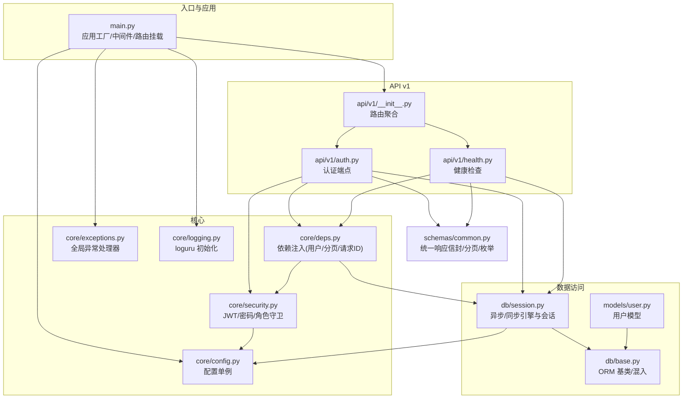
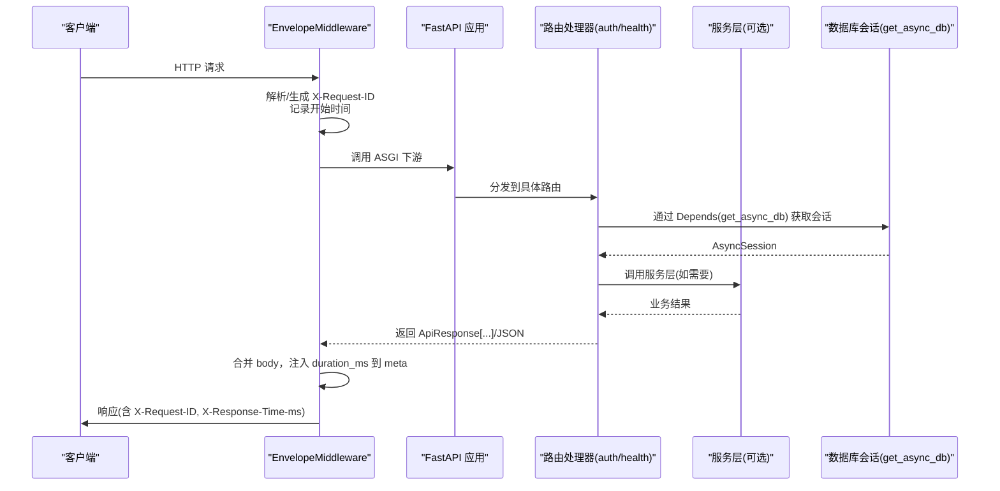
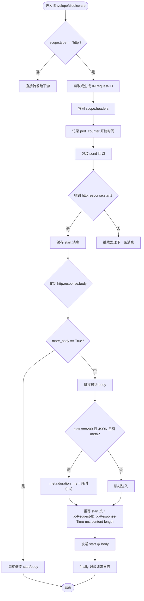
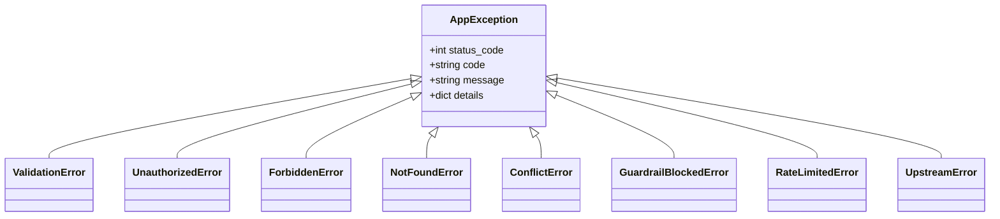
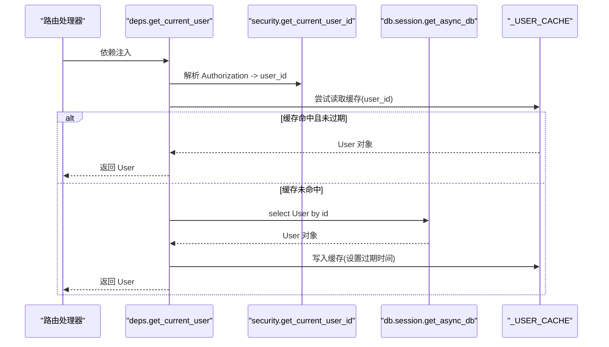
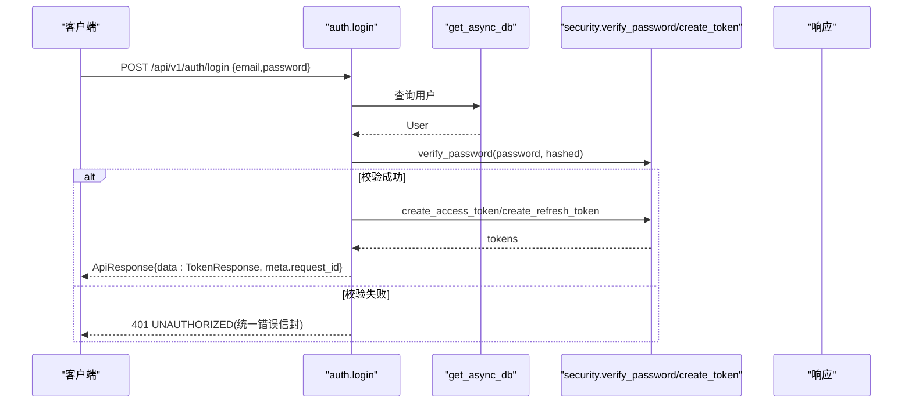
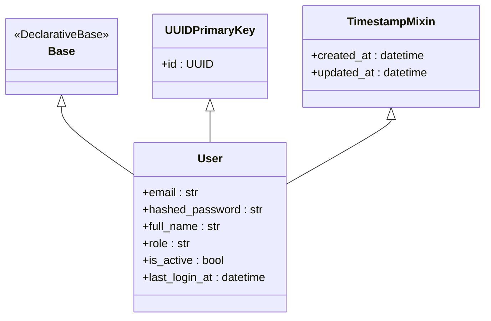
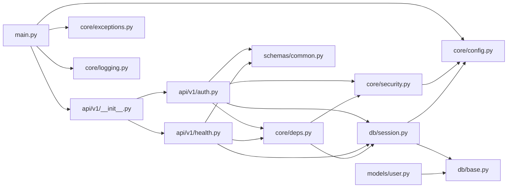

# 后端架构设计

<cite>
**本文引用的文件列表**
- [backend/app/main.py](file://backend/app/main.py)
- [backend/app/core/config.py](file://backend/app/core/config.py)
- [backend/app/core/deps.py](file://backend/app/core/deps.py)
- [backend/app/core/exceptions.py](file://backend/app/core/exceptions.py)
- [backend/app/core/logging.py](file://backend/app/core/logging.py)
- [backend/app/core/security.py](file://backend/app/core/security.py)
- [backend/app/db/session.py](file://backend/app/db/session.py)
- [backend/app/db/base.py](file://backend/app/db/base.py)
- [backend/app/api/v1/__init__.py](file://backend/app/api/v1/__init__.py)
- [backend/app/api/v1/auth.py](file://backend/app/api/v1/auth.py)
- [backend/app/api/v1/health.py](file://backend/app/api/v1/health.py)
- [backend/app/models/user.py](file://backend/app/models/user.py)
- [backend/app/schemas/common.py](file://backend/app/schemas/common.py)
</cite>

## 目录
1. [简介](#简介)
2. [项目结构](#项目结构)
3. [核心组件](#核心组件)
4. [架构总览](#架构总览)
5. [详细组件分析](#详细组件分析)
6. [依赖关系分析](#依赖关系分析)
7. [性能考虑](#性能考虑)
8. [故障排查指南](#故障排查指南)
9. [结论](#结论)
10. [附录](#附录)

## 简介
本文件为 AI 药物设计系统后端的架构文档，聚焦于 FastAPI 应用工厂模式、中间件机制（CORS、请求 ID 追踪、统一信封响应）、异常处理体系、依赖注入系统；并解释分层架构（API 层、服务层、数据访问层）、模块化路由组织与配置管理策略。同时给出中间件执行流程、异常传播机制、日志记录策略的可视化说明，并提供最佳实践、性能优化技巧与调试方法。

## 项目结构
后端采用按功能域划分的模块化结构：
- API 层：v1 路由聚合与各业务子模块（认证、健康检查、项目、分子、靶点等）
- 核心能力：配置、依赖注入、安全、异常、日志
- 数据访问层：数据库会话、ORM 基类与模型
- 服务层：业务编排与分析（解析器、知识库客户端、LLM 路由、隐私计算、报告生成、工作流等）
- 通用 Schema：统一响应信封、分页、枚举常量

图表来源
- [backend/app/main.py:187-248](file://backend/app/main.py#L187-L248)
- [backend/app/core/config.py:136-144](file://backend/app/core/config.py#L136-L144)
- [backend/app/core/deps.py:91-129](file://backend/app/core/deps.py#L91-L129)
- [backend/app/core/exceptions.py:131-179](file://backend/app/core/exceptions.py#L131-L179)
- [backend/app/core/logging.py:20-75](file://backend/app/core/logging.py#L20-L75)
- [backend/app/db/session.py:94-128](file://backend/app/db/session.py#L94-L128)
- [backend/app/db/base.py:13-48](file://backend/app/db/base.py#L13-L48)
- [backend/app/api/v1/__init__.py:24-41](file://backend/app/api/v1/__init__.py#L24-L41)
- [backend/app/api/v1/auth.py:38-147](file://backend/app/api/v1/auth.py#L38-L147)
- [backend/app/api/v1/health.py:53-102](file://backend/app/api/v1/health.py#L53-L102)
- [backend/app/models/user.py:14-36](file://backend/app/models/user.py#L14-L36)
- [backend/app/schemas/common.py:63-100](file://backend/app/schemas/common.py#L63-L100)

章节来源
- [backend/app/main.py:187-248](file://backend/app/main.py#L187-L248)
- [backend/app/api/v1/__init__.py:24-41](file://backend/app/api/v1/__init__.py#L24-L41)

## 核心组件
- 应用工厂 create_app：集中创建 FastAPI 实例、注册中间件、异常处理器、挂载路由、暴露根路径与健康文档。
- 中间件 EnvelopeMiddleware：统一请求 ID、耗时统计、统一信封响应增强（在 meta.duration_ms 注入），并记录结构化日志。
- CORS 中间件：允许跨域，暴露 X-Request-ID 与 X-Response-Time-ms 头。
- 异常处理体系：AppException 及其子类，全局处理器将业务异常与校验异常转换为统一错误信封。
- 依赖注入：get_db（异步会话）、get_current_user（带短 TTL 内存缓存的用户对象）、get_request_id（请求追踪 ID）、get_pagination（分页参数）。
- 配置管理：基于 pydantic-settings 的单例 Settings，支持 .env 与环境变量覆盖，提供 cors_origin_list 等便捷属性。
- 安全：bcrypt 密码哈希/校验、JWT access/refresh token 生成与解码、OAuth2 Bearer 提取、角色守卫 require_roles。
- 数据访问：SQLAlchemy 异步/同步引擎与会话工厂，自动提交/回滚，SQLite/PostgreSQL 差异化连接池配置。
- ORM 基类：Base、UUIDPrimaryKey、TimestampMixin 提供通用主键与时间戳字段。
- 统一响应信封：ApiResponse[T]、PagedResponse[T]、ResponseMeta、ErrorDetail 等，确保前后端一致的数据契约。

章节来源
- [backend/app/main.py:29-185](file://backend/app/main.py#L29-L185)
- [backend/app/core/exceptions.py:19-126](file://backend/app/core/exceptions.py#L19-L126)
- [backend/app/core/deps.py:67-129](file://backend/app/core/deps.py#L67-L129)
- [backend/app/core/config.py:21-144](file://backend/app/core/config.py#L21-L144)
- [backend/app/core/security.py:32-211](file://backend/app/core/security.py#L32-L211)
- [backend/app/db/session.py:48-128](file://backend/app/db/session.py#L48-L128)
- [backend/app/db/base.py:13-48](file://backend/app/db/base.py#L13-L48)
- [backend/app/schemas/common.py:63-100](file://backend/app/schemas/common.py#L63-L100)

## 架构总览
整体遵循“API 层 -> 服务层 -> 数据访问层”的分层设计，配合中间件与依赖注入实现横切关注点解耦。

图表来源
- [backend/app/main.py:29-185](file://backend/app/main.py#L29-L185)
- [backend/app/db/session.py:94-128](file://backend/app/db/session.py#L94-L128)
- [backend/app/api/v1/auth.py:70-101](file://backend/app/api/v1/auth.py#L70-L101)
- [backend/app/api/v1/health.py:53-102](file://backend/app/api/v1/health.py#L53-L102)

## 详细组件分析

### 应用工厂与中间件执行流程
- 应用工厂 create_app：
  - 初始化日志（setup_logging）
  - 创建 FastAPI 实例（标题、版本、描述、OpenAPI 文档地址）
  - 注册中间件顺序：EnvelopeMiddleware → CORSMiddleware
  - 注册全局异常处理器 register_exception_handlers
  - 挂载 v1 路由前缀 /api/v1
  - 定义根路径重定向到文档
- 中间件 EnvelopeMiddleware：
  - 解析或生成 X-Request-ID，写入 scope headers，供 get_request_id 读取
  - 缓冲响应体，仅在最后一片时重写 start 消息，注入 X-Request-ID、X-Response-Time-ms、content-length
  - 对 200 + application/json 且包含 meta 的响应，向 meta.duration_ms 注入耗时
  - 流式响应（more_body=True）直接透传，不重写
  - finally 中记录结构化请求日志（方法、路径、状态码、耗时）

图表来源
- [backend/app/main.py:29-185](file://backend/app/main.py#L29-L185)

章节来源
- [backend/app/main.py:187-248](file://backend/app/main.py#L187-L248)
- [backend/app/main.py:29-185](file://backend/app/main.py#L29-L185)

### 异常处理体系与传播机制
- AppException 基类：携带 code、message、status_code、details，默认 INTERNAL_ERROR
- 具体异常：ValidationError、UnauthorizedError、ForbiddenError、NotFoundError、ConflictError、GuardrailBlockedError、RateLimitedError、UpstreamError
- 全局处理器：
  - AppException：根据状态码选择 warning 或 exception 级别日志，返回 _error_envelope
  - RequestValidationError：参数校验失败，返回 VALIDATION_ERROR 信封
  - Exception：兜底 500 INTERNAL_ERROR，附带 request_id
- 传播路径：路由或服务层抛出 AppException → FastAPI 捕获 → 全局处理器构造错误信封 → 中间件可能再次改写头部/元数据

图表来源
- [backend/app/core/exceptions.py:19-94](file://backend/app/core/exceptions.py#L19-L94)

章节来源
- [backend/app/core/exceptions.py:131-179](file://backend/app/core/exceptions.py#L131-L179)
- [backend/app/core/exceptions.py:19-94](file://backend/app/core/exceptions.py#L19-L94)

### 依赖注入系统
- get_db：异步会话依赖，自动 commit/rollback，别名 get_async_db
- get_current_user：从 JWT 解析 user_id，优先使用短 TTL 内存缓存，未命中则查询数据库，禁用用户抛 UnauthorizedError
- get_request_id：优先使用 X-Request-ID，否则生成 UUID hex
- get_pagination：Query 参数 page/page_size 校验与封装
- 用户缓存：_USER_CACHE 以 user_id 为键，存储 (User, expire_at)，TTL 默认 10 秒，过期清理

图表来源
- [backend/app/core/deps.py:101-129](file://backend/app/core/deps.py#L101-L129)
- [backend/app/core/security.py:155-175](file://backend/app/core/security.py#L155-L175)
- [backend/app/db/session.py:94-128](file://backend/app/db/session.py#L94-L128)

章节来源
- [backend/app/core/deps.py:67-129](file://backend/app/core/deps.py#L67-L129)
- [backend/app/core/security.py:155-175](file://backend/app/core/security.py#L155-L175)

### 认证与安全
- 密码：bcrypt 哈希与验证，恒定时间比较
- JWT：access/refresh token 生成与解码，包含 sub、exp、iat、type、jti 等声明
- OAuth2 Bearer：从 Authorization header 提取 token，auto_error=False 便于自定义错误
- 角色守卫：require_roles 工厂函数，用于路由级权限控制

图表来源
- [backend/app/api/v1/auth.py:70-101](file://backend/app/api/v1/auth.py#L70-L101)
- [backend/app/core/security.py:96-123](file://backend/app/core/security.py#L96-L123)
- [backend/app/core/security.py:155-175](file://backend/app/core/security.py#L155-L175)

章节来源
- [backend/app/core/security.py:32-211](file://backend/app/core/security.py#L32-L211)
- [backend/app/api/v1/auth.py:38-147](file://backend/app/api/v1/auth.py#L38-L147)

### 数据访问层与 ORM
- 引擎与会话：
  - 根据 database_url 判断 SQLite 与非 SQLite，分别配置 asyncpg/sqlite+aiosqlite 驱动与连接池参数
  - AsyncSessionLocal/SyncSessionLocal 工厂，expire_on_commit=False，autoflush=False
  - get_async_db 作为 FastAPI 依赖，自动 commit/rollback
- ORM 基类：
  - Base：DeclarativeBase
  - UUIDPrimaryKey：UUID 主键，分布式友好
  - TimestampMixin：created_at/updated_at 时间戳

图表来源
- [backend/app/db/base.py:13-48](file://backend/app/db/base.py#L13-L48)
- [backend/app/models/user.py:14-36](file://backend/app/models/user.py#L14-L36)
- [backend/app/db/session.py:48-128](file://backend/app/db/session.py#L48-L128)

章节来源
- [backend/app/db/session.py:48-128](file://backend/app/db/session.py#L48-L128)
- [backend/app/db/base.py:13-48](file://backend/app/db/base.py#L13-L48)
- [backend/app/models/user.py:14-36](file://backend/app/models/user.py#L14-L36)

### 统一响应信封与 API 契约
- ApiResponse[T]：success/data/meta
- PagedResponse[T]：分页数据与 PageMeta
- ResponseMeta：request_id/duration_ms
- ErrorDetail：code/message/details
- HealthStatus：服务健康度与依赖状态

章节来源
- [backend/app/schemas/common.py:63-100](file://backend/app/schemas/common.py#L63-L100)
- [backend/app/schemas/common.py:91-100](file://backend/app/schemas/common.py#L91-L100)

### 模块化路由组织
- api_router 聚合各子路由，统一前缀与标签：
  - /health、/auth、/projects、/datasets、/targets、/molecules、/reports、/hypotheses、/chat、/federated、/privacy、/feedback、/efficacy、/admin
- 每个子路由模块独立维护其端点与依赖，保持高内聚低耦合

章节来源
- [backend/app/api/v1/__init__.py:24-41](file://backend/app/api/v1/__init__.py#L24-L41)

## 依赖关系分析
- main.py 依赖 core/config、core/exceptions、core/logging、api/v1 路由聚合
- 路由依赖 deps、security、db/session、schemas/common
- deps 依赖 security、db/session、models/user
- session 依赖 config、db/base
- security 依赖 config、core/exceptions
- health 与 auth 均使用 get_db、get_request_id、Settings、统一响应信封

图表来源
- [backend/app/main.py:187-248](file://backend/app/main.py#L187-L248)
- [backend/app/api/v1/__init__.py:24-41](file://backend/app/api/v1/__init__.py#L24-L41)
- [backend/app/api/v1/auth.py:38-147](file://backend/app/api/v1/auth.py#L38-L147)
- [backend/app/api/v1/health.py:53-102](file://backend/app/api/v1/health.py#L53-L102)
- [backend/app/core/deps.py:91-129](file://backend/app/core/deps.py#L91-L129)
- [backend/app/core/security.py:155-175](file://backend/app/core/security.py#L155-L175)
- [backend/app/db/session.py:94-128](file://backend/app/db/session.py#L94-L128)
- [backend/app/db/base.py:13-48](file://backend/app/db/base.py#L13-L48)
- [backend/app/models/user.py:14-36](file://backend/app/models/user.py#L14-L36)
- [backend/app/schemas/common.py:63-100](file://backend/app/schemas/common.py#L63-L100)

章节来源
- [backend/app/main.py:187-248](file://backend/app/main.py#L187-L248)
- [backend/app/api/v1/__init__.py:24-41](file://backend/app/api/v1/__init__.py#L24-L41)

## 性能考虑
- 中间件缓冲策略：仅对非流式响应进行 body 累积与重写，避免额外开销；流式响应直接透传
- 用户对象短 TTL 缓存：减少高频鉴权时的数据库查询，TTL 可依据业务调整
- 健康检查缓存：5 秒 TTL 降低探针压力
- 数据库连接池：PostgreSQL 场景启用 pool_pre_ping、pool_size、max_overflow；SQLite 场景避免不支持的参数
- 日志输出：生产环境 JSON 序列化，开发环境彩色控制台，文件轮转与归档控制磁盘占用

章节来源
- [backend/app/main.py:29-185](file://backend/app/main.py#L29-L185)
- [backend/app/core/deps.py:26-53](file://backend/app/core/deps.py#L26-L53)
- [backend/app/api/v1/health.py:22-25](file://backend/app/api/v1/health.py#L22-L25)
- [backend/app/db/session.py:51-80](file://backend/app/db/session.py#L51-L80)
- [backend/app/core/logging.py:31-75](file://backend/app/core/logging.py#L31-L75)

## 故障排查指南
- 定位问题：
  - 查看响应头 X-Request-ID 与 X-Response-Time-ms，结合日志中的相同 ID 快速关联请求
  - 统一错误信封包含 error.code、error.message、error.details 与 meta.request_id
- 常见错误：
  - 401 UNAUTHORIZED：token 缺失/类型错误或用户被禁用
  - 400 VALIDATION_ERROR：Pydantic 校验失败，errors 详情在 details.errors
  - 500 INTERNAL_ERROR：未捕获异常，查看服务器日志堆栈
- 日志策略：
  - 生产环境 stdout JSON 输出，便于日志采集平台解析
  - 文件按大小/时间轮转，错误单独归档，保留期可控
- 调试建议：
  - 本地开启 app_debug 与彩色日志，观察详细 trace
  - 使用 OpenAPI 文档 /docs 与 /redoc 快速验证接口
  - 健康检查 /api/v1/health 确认依赖可用性

章节来源
- [backend/app/core/exceptions.py:131-179](file://backend/app/core/exceptions.py#L131-L179)
- [backend/app/core/logging.py:20-75](file://backend/app/core/logging.py#L20-L75)
- [backend/app/api/v1/health.py:53-102](file://backend/app/api/v1/health.py#L53-L102)

## 结论
该后端采用清晰的工厂模式与中间件机制，结合统一的异常处理与响应信封，实现了高内聚、低耦合的可扩展架构。依赖注入与短 TTL 缓存提升了鉴权与查询性能，配置管理与日志策略兼顾开发与生产需求。分层设计与模块化路由使业务演进与维护更加稳健。

## 附录
- 最佳实践示例（以路径引用代替代码片段）：
  - 应用工厂与中间件注册：参考 [backend/app/main.py:187-248](file://backend/app/main.py#L187-L248)、[backend/app/main.py:29-185](file://backend/app/main.py#L29-L185)
  - 统一响应信封使用：参考 [backend/app/schemas/common.py:63-100](file://backend/app/schemas/common.py#L63-L100)
  - 认证登录流程：参考 [backend/app/api/v1/auth.py:70-101](file://backend/app/api/v1/auth.py#L70-L101)
  - 健康检查与缓存：参考 [backend/app/api/v1/health.py:53-102](file://backend/app/api/v1/health.py#L53-L102)
  - 依赖注入与用户缓存：参考 [backend/app/core/deps.py:101-129](file://backend/app/core/deps.py#L101-L129)
  - 安全与 JWT：参考 [backend/app/core/security.py:96-123](file://backend/app/core/security.py#L96-L123)、[backend/app/core/security.py:155-175](file://backend/app/core/security.py#L155-L175)
  - 数据库会话与连接池：参考 [backend/app/db/session.py:48-128](file://backend/app/db/session.py#L48-L128)
  - ORM 基类与模型：参考 [backend/app/db/base.py:13-48](file://backend/app/db/base.py#L13-L48)、[backend/app/models/user.py:14-36](file://backend/app/models/user.py#L14-L36)
  - 路由聚合：参考 [backend/app/api/v1/__init__.py:24-41](file://backend/app/api/v1/__init__.py#L24-L41)
  - 配置单例与 CORS：参考 [backend/app/core/config.py:112-144](file://backend/app/core/config.py#L112-L144)
  - 日志初始化：参考 [backend/app/core/logging.py:20-75](file://backend/app/core/logging.py#L20-L75)