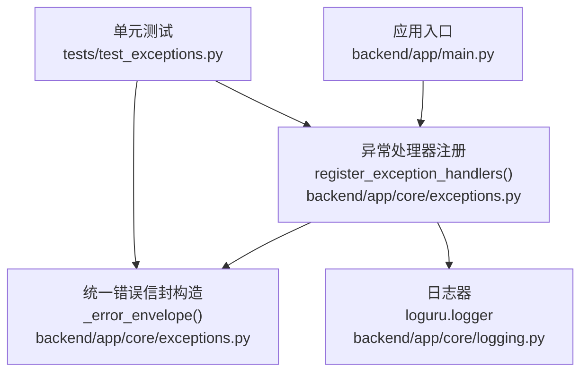
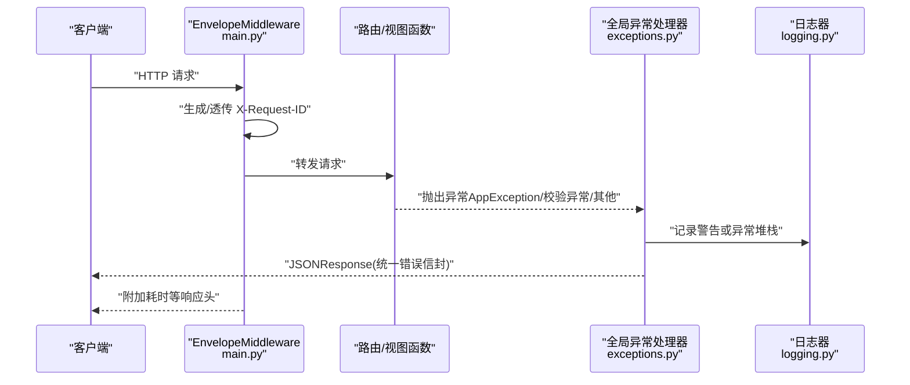
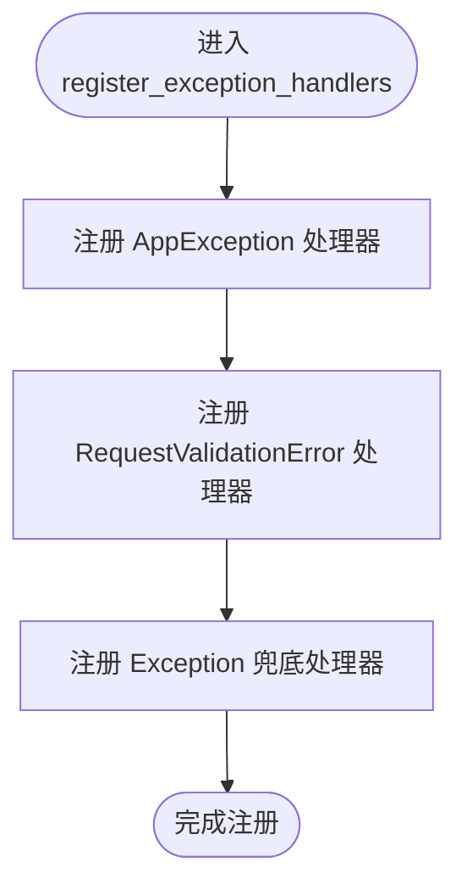
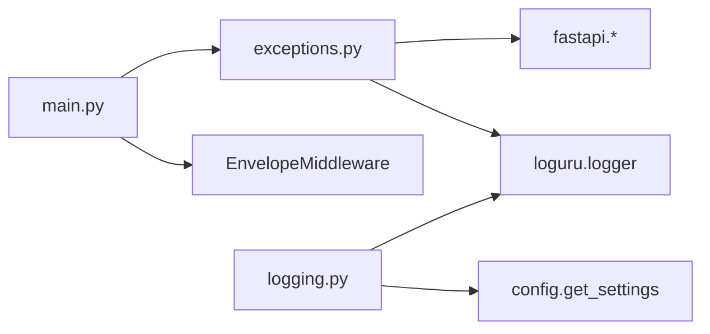

# 异常处理体系

<cite>
**本文引用的文件**   
- [backend/app/core/exceptions.py](file://backend/app/core/exceptions.py)
- [backend/app/main.py](file://backend/app/main.py)
- [backend/app/core/logging.py](file://backend/app/core/logging.py)
- [tests/test_exceptions.py](file://tests/test_exceptions.py)
</cite>

## 目录
1. [简介](#简介)
2. [项目结构](#项目结构)
3. [核心组件](#核心组件)
4. [架构总览](#架构总览)
5. [详细组件分析](#详细组件分析)
6. [依赖关系分析](#依赖关系分析)
7. [性能与可观测性](#性能与可观测性)
8. [故障排查指南](#故障排查指南)
9. [结论](#结论)
10. [附录：错误码规范与最佳实践](#附录错误码规范与最佳实践)

## 简介
本文件围绕异常处理体系展开，重点解析 register_exception_handlers() 的实现细节，包括自定义异常类定义、全局异常处理器注册、统一错误响应信封格式。文档同时说明业务异常与系统异常的区分策略、错误码规范、日志记录策略、异常传播机制、调试信息控制以及生产环境安全考虑，并提供最佳实践与常见错误模式解决方案。

## 项目结构
异常处理相关代码集中在后端核心模块中，应用入口负责初始化并注册全局异常处理器；日志子系统提供结构化输出与环境差异化配置；测试覆盖异常行为与响应信封。

图表来源
- [backend/app/main.py:187-233](file://backend/app/main.py#L187-L233)
- [backend/app/core/exceptions.py:131-178](file://backend/app/core/exceptions.py#L131-L178)
- [backend/app/core/logging.py:20-74](file://backend/app/core/logging.py#L20-L74)
- [tests/test_exceptions.py:154-223](file://tests/test_exceptions.py#L154-L223)

章节来源
- [backend/app/main.py:187-233](file://backend/app/main.py#L187-L233)
- [backend/app/core/exceptions.py:131-178](file://backend/app/core/exceptions.py#L131-L178)
- [backend/app/core/logging.py:20-74](file://backend/app/core/logging.py#L20-L74)
- [tests/test_exceptions.py:154-223](file://tests/test_exceptions.py#L154-L223)

## 核心组件
- 自定义异常基类与具体异常族：用于表达业务语义与 HTTP 状态映射。
- 统一响应信封：success/data/error/meta 四段式结构，错误场景下 error.code/message/details 与 meta.request_id 固定字段。
- 全局异常处理器：针对 AppException、请求校验异常、未捕获异常三类进行统一处理与日志记录。
- 应用入口集成：在应用创建后调用 register_exception_handlers(app) 完成注册。

章节来源
- [backend/app/core/exceptions.py:19-94](file://backend/app/core/exceptions.py#L19-L94)
- [backend/app/core/exceptions.py:99-126](file://backend/app/core/exceptions.py#L99-L126)
- [backend/app/core/exceptions.py:131-178](file://backend/app/core/exceptions.py#L131-L178)
- [backend/app/main.py:229-230](file://backend/app/main.py#L229-L230)

## 架构总览
下图展示从请求进入 FastAPI 到异常被捕获、格式化并返回的完整流程，包含中间件注入的请求 ID 与异常处理器对日志与响应的处理。

图表来源
- [backend/app/main.py:29-184](file://backend/app/main.py#L29-L184)
- [backend/app/core/exceptions.py:131-178](file://backend/app/core/exceptions.py#L131-L178)
- [backend/app/core/logging.py:20-74](file://backend/app/core/logging.py#L20-L74)

## 详细组件分析

### 自定义异常类设计
- 基类 AppException
  - 属性：status_code、code、message、details
  - 默认值：内部错误 500 与 INTERNAL_ERROR
  - 构造参数支持覆盖 message/code/status_code/details
- 具体异常族
  - ValidationError：400，VALIDATION_ERROR
  - UnauthorizedError：401，UNAUTHORIZED
  - ForbiddenError：403，FORBIDDEN
  - NotFoundError：404，NOT_FOUND
  - ConflictError：409，CONFLICT
  - GuardrailBlockedError：422，GUARDRAIL_BLOCKED
  - RateLimitedError：429，RATE_LIMITED
  - UpstreamError：502，UPSTREAM_ERROR

这些异常均继承自 AppException，通过 class 级 default_status_code 与 default_code 声明 HTTP 状态码与错误码，便于在业务层以领域语义抛错，并由全局处理器统一转换为标准 JSON 响应。

章节来源
- [backend/app/core/exceptions.py:19-94](file://backend/app/core/exceptions.py#L19-L94)

### 统一错误响应信封
- _envelope(success, data, error, meta)：构建成功/失败通用信封
- _error_envelope(code, message, details, request_id)：错误专用封装，将 code/message/details 放入 error，并将 request_id 放入 meta

该信封确保所有错误响应具有一致的结构与字段，便于前端与监控侧统一处理。

章节来源
- [backend/app/core/exceptions.py:99-126](file://backend/app/core/exceptions.py#L99-L126)

### register_exception_handlers() 实现要点
- 注册三个处理器：
  - AppException：根据 status_code 决定日志级别（>=500 使用 exception，否则 warning），返回对应状态码与错误信封
  - RequestValidationError：参数校验失败，返回 400 与 VALIDATION_ERROR 信封，附带 errors 详情
  - Exception：兜底未捕获异常，返回 500 与 INTERNAL_ERROR 信封，不暴露内部细节
- 请求追踪：
  - 从 request.state.request_id 读取当前请求 ID，写入错误信封 meta.request_id，便于链路追踪
- 日志策略：
  - 业务异常（非 5xx）：warning 级别，附带 code、message、details
  - 服务器异常（5xx）：exception 级别，附带 code、message
  - 未捕获异常：exception 级别，附带原始异常对象

图表来源
- [backend/app/core/exceptions.py:131-178](file://backend/app/core/exceptions.py#L131-L178)

章节来源
- [backend/app/core/exceptions.py:131-178](file://backend/app/core/exceptions.py#L131-L178)

### 应用入口集成
- create_app() 中先初始化日志，再创建 FastAPI 实例，随后注册全局异常处理器，最后挂载路由与健康检查端点。
- 中间件 EnvelopeMiddleware 负责请求 ID 注入、响应头与耗时统计，并在统一信封响应中注入 duration_ms。

章节来源
- [backend/app/main.py:187-233](file://backend/app/main.py#L187-L233)
- [backend/app/main.py:29-184](file://backend/app/main.py#L29-L184)

### 日志记录策略
- 开发环境：彩色控制台输出，开启 backtrace 与诊断信息
- 生产环境：JSON 序列化输出，关闭 backtrace 与诊断以减少敏感信息泄露
- 文件输出：按天轮转，错误单独归档，保留期与大小限制可控

章节来源
- [backend/app/core/logging.py:20-74](file://backend/app/core/logging.py#L20-L74)

### 异常传播机制与调试信息控制
- 传播路径：业务层抛出 AppException -> FastAPI 路由捕获 -> 全局处理器拦截 -> 构造 JSONResponse 返回
- 调试信息控制：
  - 开发环境：backtrace=True，diagnose=True，便于定位问题
  - 生产环境：serialize=True，backtrace=False，diagnose=False，避免堆栈与诊断信息外泄
- 请求追踪：X-Request-ID 由中间件注入，错误信封 meta.request_id 携带同一 ID，便于跨层关联

章节来源
- [backend/app/main.py:29-184](file://backend/app/main.py#L29-L184)
- [backend/app/core/logging.py:20-74](file://backend/app/core/logging.py#L20-L74)
- [backend/app/core/exceptions.py:131-178](file://backend/app/core/exceptions.py#L131-L178)

### 生产环境安全考虑
- 不向客户端暴露内部堆栈与诊断信息
- 仅返回标准化错误信封中的 code/message/details，details 应谨慎填充，避免敏感数据
- 使用统一的 INTERNAL_ERROR 作为兜底，隐藏真实异常类型与消息

章节来源
- [backend/app/core/exceptions.py:166-178](file://backend/app/core/exceptions.py#L166-L178)
- [backend/app/core/logging.py:31-38](file://backend/app/core/logging.py#L31-L38)

## 依赖关系分析
- exceptions.py 依赖：
  - FastAPI：FastAPI、Request、status、JSONResponse、RequestValidationError
  - loguru：logger
- main.py 依赖：
  - 导入 register_exception_handlers 并在 create_app 中调用
  - 引入 EnvelopeMiddleware 与 CORS 中间件
- logging.py 依赖：
  - loguru：全局 logger
  - config：get_settings 获取运行环境与日志级别

图表来源
- [backend/app/core/exceptions.py:1-17](file://backend/app/core/exceptions.py#L1-L17)
- [backend/app/main.py:17-26](file://backend/app/main.py#L17-L26)
- [backend/app/core/logging.py:10-18](file://backend/app/core/logging.py#L10-L18)

章节来源
- [backend/app/core/exceptions.py:1-17](file://backend/app/core/exceptions.py#L1-L17)
- [backend/app/main.py:17-26](file://backend/app/main.py#L17-L26)
- [backend/app/core/logging.py:10-18](file://backend/app/core/logging.py#L10-L18)

## 性能与可观测性
- 中间件 EnvelopeMiddleware 采用缓冲模式，仅在最终响应片时重写 start 消息与 body，避免多次 I/O
- 对 200 且 application/json 的统一信封响应注入 duration_ms，便于前端与监控观察
- 日志异步安全，生产环境 JSON 输出利于集中采集与分析

章节来源
- [backend/app/main.py:29-184](file://backend/app/main.py#L29-L184)

## 故障排查指南
- 快速定位
  - 查看错误信封中的 error.code 与 meta.request_id，结合日志检索同一 request_id 的上下文
  - 对于 4xx 业务异常，关注 warning 日志中的 code、message、details
  - 对于 5xx 内部错误，关注 exception 日志中的堆栈与上下文
- 常见问题
  - 重复注册异常处理器：测试已验证多次调用 register_exception_handlers(app) 不会报错
  - 校验失败：RequestValidationError 会返回 400 与 VALIDATION_ERROR，errors 字段包含具体校验错误
  - 未捕获异常：兜底处理器返回 500 与 INTERNAL_ERROR，不暴露内部细节

章节来源
- [tests/test_exceptions.py:154-223](file://tests/test_exceptions.py#L154-L223)
- [backend/app/core/exceptions.py:150-178](file://backend/app/core/exceptions.py#L150-L178)

## 结论
本异常处理体系通过统一的异常基类、明确的状态码与错误码映射、全局处理器与统一信封响应，实现了清晰、一致、安全的错误处理机制。配合中间件的请求追踪与日志的环境差异化配置，既满足开发调试需求，又保障生产安全与可观测性。

## 附录：错误码规范与最佳实践

### 错误码规范
- 命名约定：大写下划线，如 VALIDATION_ERROR、INTERNAL_ERROR
- 分类建议：
  - 客户端错误：VALIDATION_ERROR、UNAUTHORIZED、FORBIDDEN、NOT_FOUND、CONFLICT、RATE_LIMITED、GUARDRAIL_BLOCKED
  - 服务端错误：INTERNAL_ERROR、UPSTREAM_ERROR
- 状态码映射：
  - 400：VALIDATION_ERROR
  - 401：UNAUTHORIZED
  - 403：FORBIDDEN
  - 404：NOT_FOUND
  - 409：CONFLICT
  - 422：GUARDRAIL_BLOCKED
  - 429：RATE_LIMITED
  - 500：INTERNAL_ERROR
  - 502：UPSTREAM_ERROR

章节来源
- [backend/app/core/exceptions.py:52-94](file://backend/app/core/exceptions.py#L52-L94)

### 最佳实践
- 业务层优先抛出 AppException 子类，避免直接抛出 Python 内置异常
- 为每个异常设置清晰的 message 与必要的 details，但避免敏感信息
- 在需要外部依赖失败的场景使用 UpstreamError，便于监控与降级策略
- 使用 request_id 贯穿全链路，便于问题复现与根因分析
- 生产环境禁用 backtrace 与 diagnose，减少敏感信息泄露风险

### 常见错误模式与解决方案
- 忘记注册全局异常处理器：在 create_app 中显式调用 register_exception_handlers(app)
- 校验失败未返回统一信封：确保使用 RequestValidationError 或由 Pydantic 自动触发，处理器会返回 VALIDATION_ERROR
- 未捕获异常导致 500：检查业务逻辑是否遗漏 try/except 或是否应抛出 AppException 子类
- 日志缺失或无法关联：确认中间件是否正确注入 X-Request-ID，并在错误信封 meta.request_id 中携带

章节来源
- [backend/app/main.py:229-230](file://backend/app/main.py#L229-L230)
- [backend/app/core/exceptions.py:131-178](file://backend/app/core/exceptions.py#L131-L178)
- [backend/app/core/logging.py:20-74](file://backend/app/core/logging.py#L20-L74)