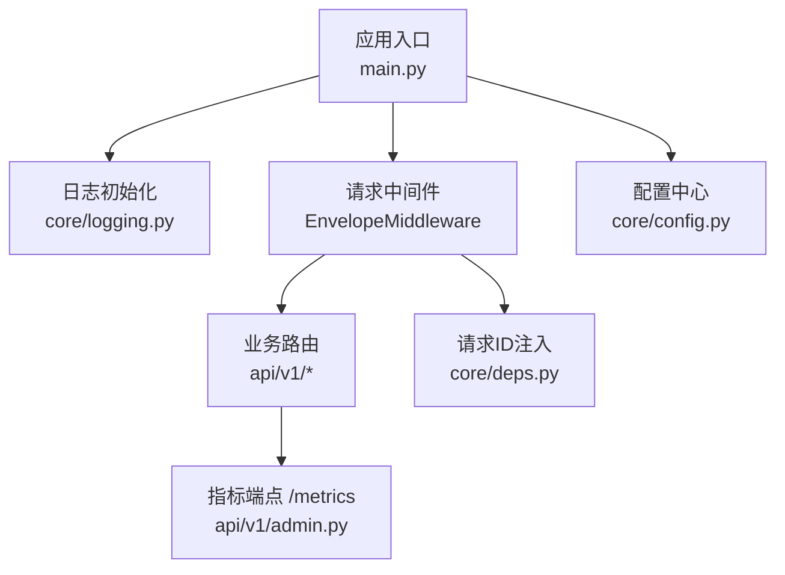
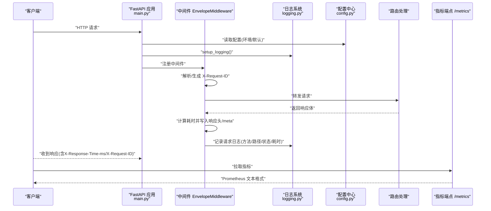
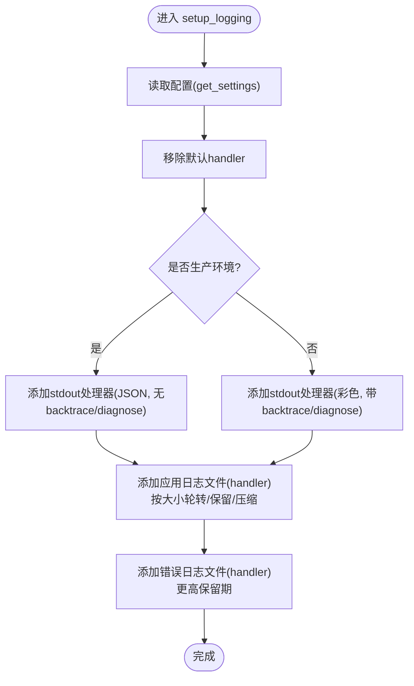
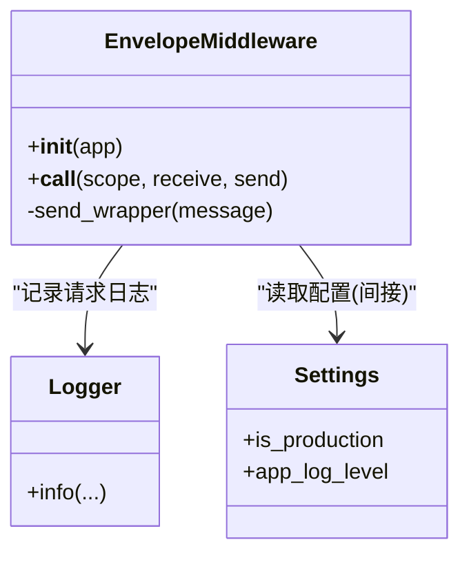
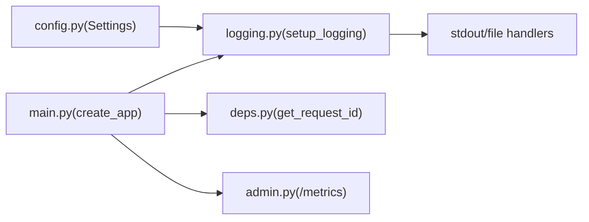

# 日志系统

<cite>
**本文引用的文件**   
- [backend/app/core/logging.py](file://backend/app/core/logging.py)
- [backend/app/main.py](file://backend/app/main.py)
- [backend/app/core/config.py](file://backend/app/core/config.py)
- [backend/app/core/deps.py](file://backend/app/core/deps.py)
- [backend/app/api/v1/admin.py](file://backend/app/api/v1/admin.py)
- [tests/test_logging.py](file://tests/test_logging.py)
</cite>

## 目录
1. [简介](#简介)
2. [项目结构](#项目结构)
3. [核心组件](#核心组件)
4. [架构总览](#架构总览)
5. [详细组件分析](#详细组件分析)
6. [依赖关系分析](#依赖关系分析)
7. [性能考量](#性能考量)
8. [故障排查指南](#故障排查指南)
9. [结论](#结论)
10. [附录](#附录)

## 简介
本文件面向“精准药物设计”后端项目的日志子系统，聚焦以下目标：
- 深入解释 setup_logging() 的配置与行为（Loguru 集成、输出格式、轮转策略）
- 结构化日志设计与请求上下文追踪机制
- 性能监控指标与查询方法
- 日志级别管理、文件轮转与归档策略
- 远程日志收集建议与落地方案
- 日志查询与分析方法、故障排查与性能调优实践

## 项目结构
日志相关代码集中在 core 层与应用入口中，并通过中间件在请求链路中注入追踪信息。关键位置如下：
- 日志初始化与配置：backend/app/core/logging.py
- 应用启动与中间件注册：backend/app/main.py
- 配置项来源（环境/默认值）：backend/app/core/config.py
- 请求 ID 注入与依赖：backend/app/core/deps.py
- 指标端点（Prometheus 文本格式）：backend/app/api/v1/admin.py

图表来源
- [backend/app/main.py:187-243](file://backend/app/main.py#L187-L243)
- [backend/app/core/logging.py:20-74](file://backend/app/core/logging.py#L20-L74)
- [backend/app/core/config.py:21-144](file://backend/app/core/config.py#L21-L144)
- [backend/app/core/deps.py:91-98](file://backend/app/core/deps.py#L91-L98)
- [backend/app/api/v1/admin.py:28-50](file://backend/app/api/v1/admin.py#L28-L50)

章节来源
- [backend/app/main.py:187-243](file://backend/app/main.py#L187-L243)
- [backend/app/core/logging.py:20-74](file://backend/app/core/logging.py#L20-L74)
- [backend/app/core/config.py:21-144](file://backend/app/core/config.py#L21-L144)
- [backend/app/core/deps.py:91-98](file://backend/app/core/deps.py#L91-L98)
- [backend/app/api/v1/admin.py:28-50](file://backend/app/api/v1/admin.py#L28-L50)

## 核心组件
- 日志初始化器 setup_logging()
  - 根据运行环境选择控制台输出格式（开发彩色 vs 生产 JSON）
  - 统一添加文件输出 handler，按大小轮转并压缩归档
  - 错误日志单独归档，保留期更长
- 全局 logger 获取 get_logger(name)
  - 通过 bind(module=name) 绑定模块名，便于定位来源
- 应用入口 create_app()
  - 在创建 FastAPI 实例前调用 setup_logging()
  - 注册 EnvelopeMiddleware 中间件，负责请求耗时、响应头与信封 meta 注入
- 配置中心 Settings
  - app_env、app_log_level、is_production 等字段驱动日志行为
- 请求 ID 注入 get_request_id()
  - 优先使用客户端 X-Request-ID，否则生成 UUID
- 指标端点 /metrics
  - 返回 Prometheus 文本格式指标（当前为占位实现）

章节来源
- [backend/app/core/logging.py:20-88](file://backend/app/core/logging.py#L20-L88)
- [backend/app/main.py:187-243](file://backend/app/main.py#L187-L243)
- [backend/app/core/config.py:21-144](file://backend/app/core/config.py#L21-L144)
- [backend/app/core/deps.py:91-98](file://backend/app/core/deps.py#L91-L98)
- [backend/app/api/v1/admin.py:28-50](file://backend/app/api/v1/admin.py#L28-L50)

## 架构总览
下图展示了从应用启动到请求处理的日志与追踪链路：

图表来源
- [backend/app/main.py:187-243](file://backend/app/main.py#L187-L243)
- [backend/app/core/logging.py:20-74](file://backend/app/core/logging.py#L20-L74)
- [backend/app/core/config.py:21-144](file://backend/app/core/config.py#L21-L144)
- [backend/app/api/v1/admin.py:28-50](file://backend/app/api/v1/admin.py#L28-L50)

## 详细组件分析

### 组件一：日志初始化器 setup_logging()
- 功能要点
  - 移除默认 handler，避免重复输出
  - 根据 is_production 切换输出格式：
    - 生产：JSON 序列化输出至 stdout，关闭 backtrace/diagnose
    - 非生产：彩色控制台输出，开启 backtrace/diagnose
  - 文件输出：
    - 应用日志：按大小轮转、保留期、zip 压缩、UTF-8 编码
    - 错误日志：独立文件、更长的保留期
- 可观测性
  - 通过 serialize=True 输出结构化 JSON，便于集中采集与检索
  - 通过 rotation/retention/compression 控制磁盘占用与归档

图表来源
- [backend/app/core/logging.py:20-74](file://backend/app/core/logging.py#L20-L74)
- [backend/app/core/config.py:118-126](file://backend/app/core/config.py#L118-L126)

章节来源
- [backend/app/core/logging.py:20-74](file://backend/app/core/logging.py#L20-L74)
- [backend/app/core/config.py:118-126](file://backend/app/core/config.py#L118-L126)

### 组件二：应用入口与中间件（请求追踪与性能指标）
- 应用工厂 create_app()
  - 在创建 FastAPI 实例之前调用 setup_logging()，确保所有后续日志可用
  - 注册 EnvelopeMiddleware、CORS、异常处理器、路由
- 中间件 EnvelopeMiddleware
  - 解析或生成 X-Request-ID，回写 scope headers，保证下游依赖一致
  - 计算请求耗时，写入响应头 X-Response-Time-ms 与 X-Request-ID
  - 对 200 且 application/json 且包含 meta 的响应，将 duration_ms 注入 meta
  - 同步更新 content-length，避免截断；流式响应保持透传
  - 在 finally 块中记录请求日志（方法、路径、状态码、耗时）

图表来源
- [backend/app/main.py:29-185](file://backend/app/main.py#L29-L185)
- [backend/app/core/logging.py:20-74](file://backend/app/core/logging.py#L20-L74)
- [backend/app/core/config.py:21-144](file://backend/app/core/config.py#L21-L144)

章节来源
- [backend/app/main.py:187-243](file://backend/app/main.py#L187-L243)
- [backend/app/main.py:29-185](file://backend/app/main.py#L29-L185)

### 组件三：配置中心（Settings）
- 关键字段
  - app_env：development/staging/production
  - app_log_level：DEBUG/INFO/WARNING/ERROR
  - is_production：由 app_env 派生
- 作用
  - 决定日志输出格式与级别
  - 影响中间件暴露的响应头（如 CORS expose_headers）

章节来源
- [backend/app/core/config.py:21-144](file://backend/app/core/config.py#L21-L144)

### 组件四：请求 ID 注入（get_request_id）
- 行为
  - 优先使用客户端传入的 X-Request-ID
  - 未提供则生成新的 UUID hex
- 用途
  - 贯穿请求链路，用于日志关联与问题追踪

章节来源
- [backend/app/core/deps.py:91-98](file://backend/app/core/deps.py#L91-L98)

### 组件五：指标端点（/metrics）
- 当前实现
  - 返回 Prometheus 文本格式的占位指标（请求总数、耗时直方图、LLM 成本、错误计数）
- 扩展建议
  - 接入 prometheus_client 或 OpenTelemetry exporter，实现真实指标采集

章节来源
- [backend/app/api/v1/admin.py:28-50](file://backend/app/api/v1/admin.py#L28-L50)

## 依赖关系分析
- 耦合与内聚
  - logging.py 仅依赖 config.py 与 loguru，职责单一、内聚度高
  - main.py 作为装配层，组合中间件、路由与日志初始化
  - deps.py 提供通用依赖（请求ID、分页、用户），被多个路由复用
- 外部依赖
  - loguru：结构化日志、轮转、压缩
  - FastAPI/Starlette：ASGI 中间件、请求/响应生命周期
  - pydantic-settings：配置加载与校验

图表来源
- [backend/app/core/config.py:21-144](file://backend/app/core/config.py#L21-L144)
- [backend/app/core/logging.py:20-74](file://backend/app/core/logging.py#L20-L74)
- [backend/app/main.py:187-243](file://backend/app/main.py#L187-L243)
- [backend/app/core/deps.py:91-98](file://backend/app/core/deps.py#L91-L98)
- [backend/app/api/v1/admin.py:28-50](file://backend/app/api/v1/admin.py#L28-L50)

章节来源
- [backend/app/core/config.py:21-144](file://backend/app/core/config.py#L21-L144)
- [backend/app/core/logging.py:20-74](file://backend/app/core/logging.py#L20-L74)
- [backend/app/main.py:187-243](file://backend/app/main.py#L187-L243)
- [backend/app/core/deps.py:91-98](file://backend/app/core/deps.py#L91-L98)
- [backend/app/api/v1/admin.py:28-50](file://backend/app/api/v1/admin.py#L28-L50)

## 性能考量
- 输出格式
  - 生产环境使用 JSON 序列化输出，减少人类可读开销，利于集中采集
  - 开发环境启用 backtrace/diagnose，便于调试但有一定性能开销
- 文件 I/O
  - 按大小轮转与 zip 压缩降低磁盘压力与备份体积
  - 错误日志独立归档，保留期更长，便于审计与回溯
- 中间件开销
  - 中间件会累积响应体以重写头部与 meta，对大响应体有额外内存与 CPU 消耗
  - 流式响应直接透传，避免阻塞
- 指标采集
  - 当前 /metrics 为占位实现，建议引入标准库以减少手工维护成本

[本节为通用指导，不直接分析具体文件]

## 故障排查指南
- 常见问题
  - 日志未输出：确认 create_app() 已调用 setup_logging()，且应用进程具有 logs 目录写入权限
  - 日志级别过高：检查 Settings.app_log_level 与运行环境 app_env
  - 无法定位请求：确认客户端是否传递 X-Request-ID，或在服务端生成后回写响应头
  - 磁盘空间不足：调整 rotation/retention 参数，或清理历史归档
- 快速定位步骤
  - 通过 X-Request-ID 在应用日志与错误日志中过滤同一请求
  - 查看响应头 X-Response-Time-ms 与响应体 meta.duration_ms，定位慢请求
  - 访问 /metrics 获取基础指标（待完善）
- 测试覆盖
  - 单元测试验证 setup_logging() 不会抛错、在不同环境下安全执行
  - get_logger() 返回有效对象，支持绑定模块名

章节来源
- [backend/app/main.py:187-243](file://backend/app/main.py#L187-L243)
- [backend/app/core/logging.py:20-88](file://backend/app/core/logging.py#L20-L88)
- [tests/test_logging.py:1-49](file://tests/test_logging.py#L1-L49)

## 结论
本项目日志系统基于 Loguru 构建，具备结构化输出、自动轮转与错误归档能力；结合中间件实现了统一的请求追踪与性能指标注入。通过配置中心灵活控制日志级别与环境差异，满足开发与生产的不同需求。建议在生产环境中进一步接入集中式日志平台与标准指标采集方案，以提升可观测性与运维效率。

[本节为总结性内容，不直接分析具体文件]

## 附录

### 日志级别与环境映射
- app_env=development：彩色控制台输出，开启 backtrace/diagnose
- app_env=staging/production：JSON 输出，关闭 backtrace/diagnose
- app_log_level：控制最小输出级别（DEBUG/INFO/WARNING/ERROR）

章节来源
- [backend/app/core/config.py:21-144](file://backend/app/core/config.py#L21-L144)
- [backend/app/core/logging.py:30-52](file://backend/app/core/logging.py#L30-L52)

### 文件轮转与归档策略
- 应用日志：按大小轮转、保留期、zip 压缩、UTF-8 编码
- 错误日志：独立文件、更大保留期、zip 压缩、UTF-8 编码

章节来源
- [backend/app/core/logging.py:54-74](file://backend/app/core/logging.py#L54-L74)

### 请求上下文与追踪
- X-Request-ID：请求唯一标识，优先使用客户端传入，否则服务端生成
- X-Response-Time-ms：响应头中的耗时（毫秒）
- meta.duration_ms：响应体信封中的耗时（毫秒）

章节来源
- [backend/app/core/deps.py:91-98](file://backend/app/core/deps.py#L91-L98)
- [backend/app/main.py:130-185](file://backend/app/main.py#L130-L185)

### 远程日志收集建议
- 推荐方案
  - 将 stdout JSON 日志接入容器编排平台的日志采集器（如 Filebeat/Fluent Bit）
  - 或使用云厂商提供的日志服务（如阿里云 SLS、腾讯云 CLS、AWS CloudWatch Logs）
- 注意事项
  - 确保 JSON 字段稳定、敏感信息脱敏
  - 合理设置采样率与批处理大小，平衡吞吐与延迟
  - 结合 X-Request-ID 进行跨服务链路追踪

[本节为通用指导，不直接分析具体文件]

### 指标采集与可视化
- 当前实现：/metrics 返回 Prometheus 文本格式占位指标
- 建议改进
  - 接入 prometheus_client 或 OpenTelemetry，实现真实计数器与直方图
  - 通过 Grafana 展示 QPS、P95/P99 延迟、错误率、LLM 成本等关键指标

章节来源
- [backend/app/api/v1/admin.py:28-50](file://backend/app/api/v1/admin.py#L28-L50)