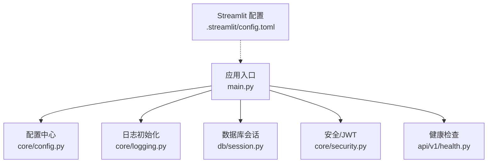
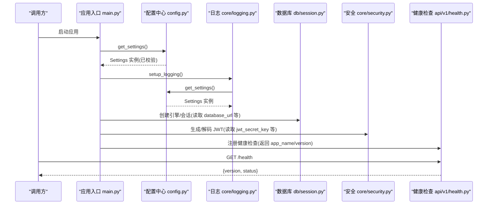
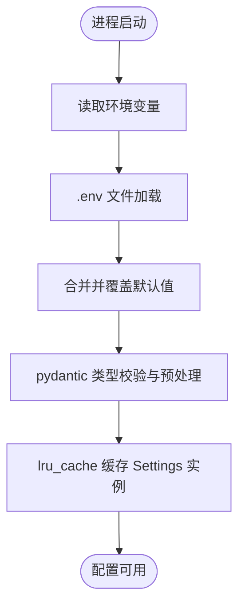
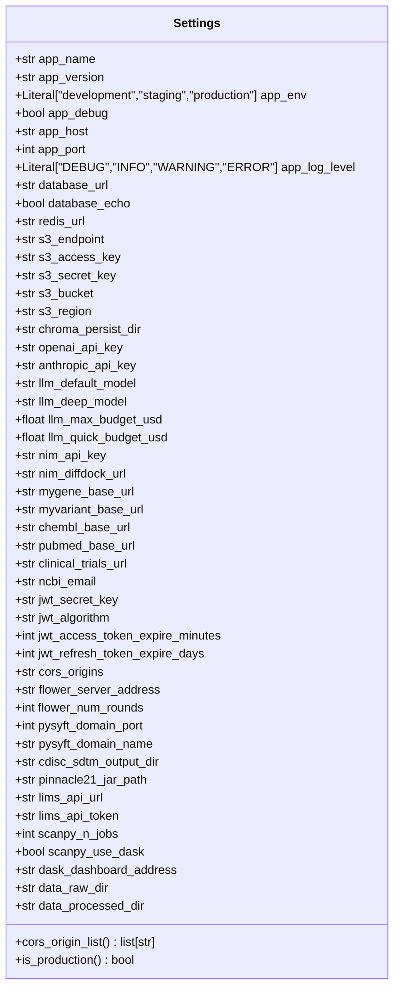
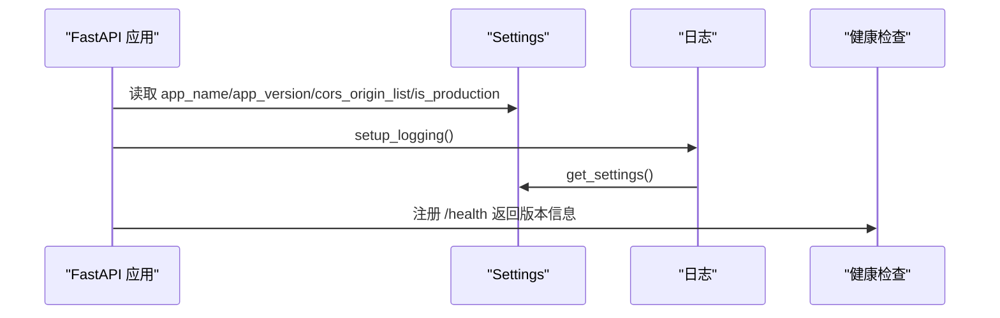
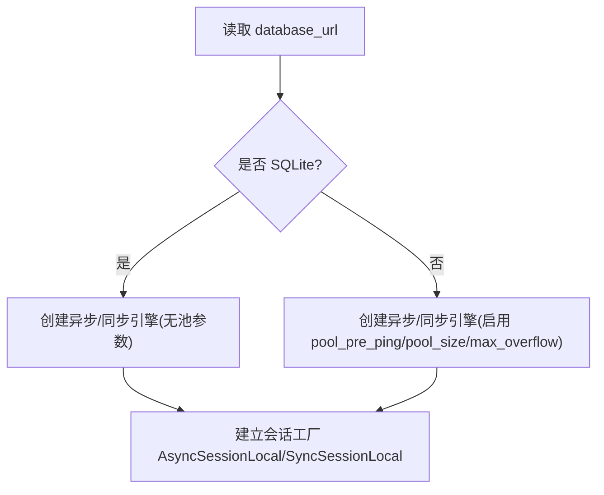
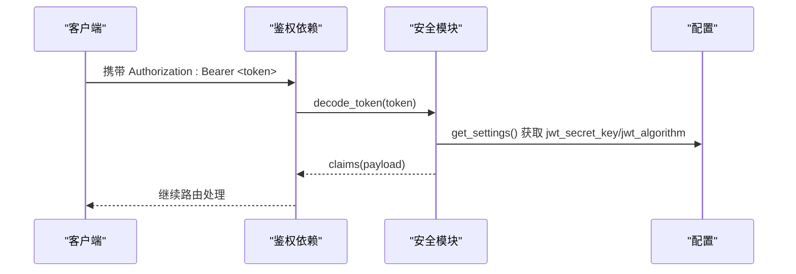
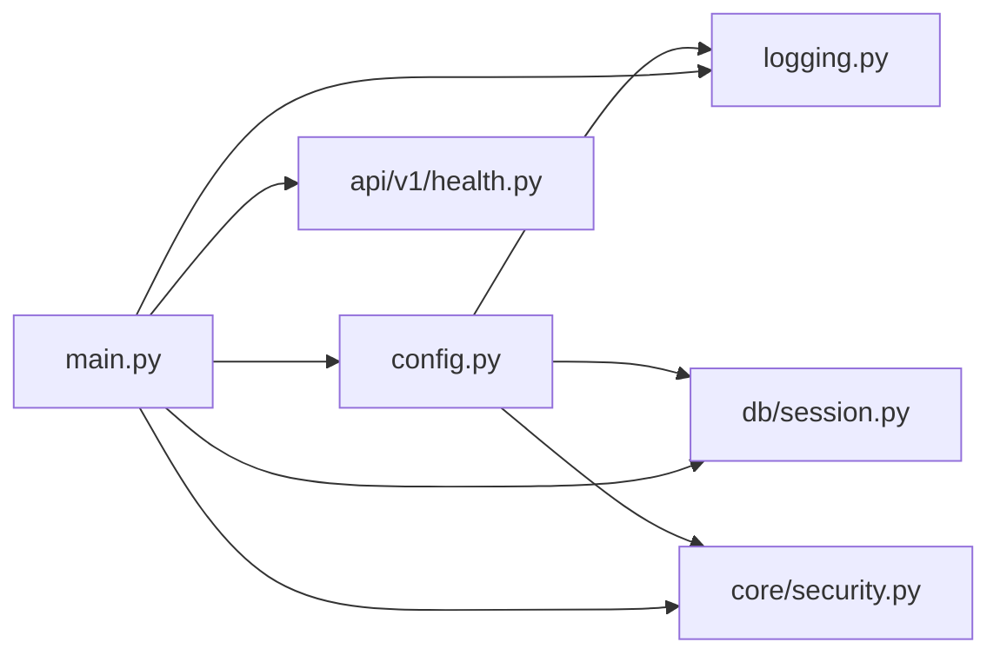

# 配置管理

<cite>
**本文引用的文件**   
- [backend/app/core/config.py](file://backend/app/core/config.py)
- [backend/app/main.py](file://backend/app/main.py)
- [backend/app/core/logging.py](file://backend/app/core/logging.py)
- [backend/app/db/session.py](file://backend/app/db/session.py)
- [backend/app/core/security.py](file://backend/app/core/security.py)
- [backend/app/api/v1/health.py](file://backend/app/api/v1/health.py)
- [.streamlit/config.toml](file://.streamlit/config.toml)
</cite>

## 目录
1. [简介](#简介)
2. [项目结构](#项目结构)
3. [核心组件](#核心组件)
4. [架构总览](#架构总览)
5. [详细组件分析](#详细组件分析)
6. [依赖关系分析](#依赖关系分析)
7. [性能与可扩展性](#性能与可扩展性)
8. [故障排查指南](#故障排查指南)
9. [结论](#结论)
10. [附录：最佳实践与部署清单](#附录最佳实践与部署清单)

## 简介
本文件面向“配置管理系统”，围绕以下目标展开：
- 配置加载优先级与环境变量映射
- 配置文件解析与校验机制
- 不同环境的配置策略与敏感信息管理
- 动态配置更新、热重载与默认值处理
- 配置最佳实践（安全性与部署）

本项目采用基于 pydantic-settings 的配置模型，集中定义所有配置项，统一从 .env 或环境变量加载，并在应用启动时完成类型校验与默认值填充。

## 项目结构
与配置相关的核心位置如下：
- 后端配置模型与单例获取：backend/app/core/config.py
- 应用入口与中间件注册（使用配置）：backend/app/main.py
- 日志初始化（读取配置决定输出格式）：backend/app/core/logging.py
- 数据库连接参数（读取配置构建引擎与会话）：backend/app/db/session.py
- 认证与安全（JWT 密钥等来自配置）：backend/app/core/security.py
- 健康检查端点（暴露版本等信息）：backend/app/api/v1/health.py
- 前端 Streamlit 配置：.streamlit/config.toml

图示来源
- [backend/app/main.py:187-243](file://backend/app/main.py#L187-L243)
- [backend/app/core/config.py:21-143](file://backend/app/core/config.py#L21-L143)
- [backend/app/core/logging.py:20-74](file://backend/app/core/logging.py#L20-L74)
- [backend/app/db/session.py:48-91](file://backend/app/db/session.py#L48-L91)
- [backend/app/core/security.py:96-122](file://backend/app/core/security.py#L96-L122)
- [backend/app/api/v1/health.py:56-96](file://backend/app/api/v1/health.py#L56-L96)
- [.streamlit/config.toml:1-16](file://.streamlit/config.toml#L1-L16)

章节来源
- [backend/app/main.py:187-243](file://backend/app/main.py#L187-L243)
- [backend/app/core/config.py:21-143](file://backend/app/core/config.py#L21-L143)
- [backend/app/core/logging.py:20-74](file://backend/app/core/logging.py#L20-L74)
- [backend/app/db/session.py:48-91](file://backend/app/db/session.py#L48-L91)
- [backend/app/core/security.py:96-122](file://backend/app/core/security.py#L96-L122)
- [backend/app/api/v1/health.py:56-96](file://backend/app/api/v1/health.py#L56-L96)
- [.streamlit/config.toml:1-16](file://.streamlit/config.toml#L1-L16)

## 核心组件
- Settings 配置模型：集中声明所有配置字段、默认值、校验器与属性；通过 SettingsConfigDict 指定 .env 文件路径、编码、大小写不敏感与忽略多余键。
- get_settings 单例：使用 lru_cache 缓存实例，避免重复读取 .env。
- 应用装配：在 create_app 中读取配置并注入到 CORS、文档标题、版本等。
- 日志初始化：根据 is_production 切换 JSON 控制台输出或彩色文本输出，同时按大小/时间轮转写入文件。
- 数据库会话：根据 database_url 自动选择驱动并创建异步/同步引擎与会话工厂。
- 安全模块：JWT 的密钥、算法与过期时间均来源于配置。
- 健康检查：返回 app_name、app_version 等配置信息用于服务发现与健康探测。

章节来源
- [backend/app/core/config.py:21-143](file://backend/app/core/config.py#L21-L143)
- [backend/app/main.py:187-243](file://backend/app/main.py#L187-L243)
- [backend/app/core/logging.py:20-74](file://backend/app/core/logging.py#L20-L74)
- [backend/app/db/session.py:48-91](file://backend/app/db/session.py#L48-L91)
- [backend/app/core/security.py:96-122](file://backend/app/core/security.py#L96-L122)
- [backend/app/api/v1/health.py:56-96](file://backend/app/api/v1/health.py#L56-L96)

## 架构总览
配置在系统内的流转与使用方式如下：

图示来源
- [backend/app/main.py:187-243](file://backend/app/main.py#L187-L243)
- [backend/app/core/config.py:136-143](file://backend/app/core/config.py#L136-L143)
- [backend/app/core/logging.py:20-74](file://backend/app/core/logging.py#L20-L74)
- [backend/app/db/session.py:48-91](file://backend/app/db/session.py#L48-L91)
- [backend/app/core/security.py:96-122](file://backend/app/core/security.py#L96-L122)
- [backend/app/api/v1/health.py:56-96](file://backend/app/api/v1/health.py#L56-L96)

## 详细组件分析

### 配置模型与加载优先级
- 加载源与优先级（高到低）：
  - 真实环境变量
  - .env 文件（由 model_config.env_file 指定）
  - 代码默认值（字段默认值）
- 解析规则：
  - 大小写不敏感（case_sensitive=False）
  - 忽略未知键（extra="ignore"），避免外部注入导致崩溃
  - UTF-8 编码读取 .env
- 类型校验与默认值：
  - 基于 pydantic 的类型注解与 field_validator 进行强类型校验与预处理
  - 未提供的环境变量将回退到默认值
- 单例与缓存：
  - get_settings 使用 lru_cache 保证进程内唯一实例，测试时可 cache_clear 重置

图示来源
- [backend/app/core/config.py:128-133](file://backend/app/core/config.py#L128-L133)
- [backend/app/core/config.py:136-143](file://backend/app/core/config.py#L136-L143)
- [backend/app/core/config.py:112-126](file://backend/app/core/config.py#L112-L126)

章节来源
- [backend/app/core/config.py:21-143](file://backend/app/core/config.py#L21-L143)

### 环境变量映射与分类
- 应用基础：名称、版本、环境、调试开关、主机端口、日志级别
- 数据层：数据库 URL、是否打印 SQL、Redis URL
- 存储与向量库：对象存储端点/凭据/桶/区域、Chroma 持久化目录
- LLM 与外部 API：OpenAI/Anthropic/NVIDIA NIM 密钥与模型、知识库基地址、NCBI 邮箱
- 认证：JWT 密钥、算法、访问令牌与刷新令牌过期时间
- 跨域：CORS 允许源列表（支持逗号分隔字符串，内部规范化为列表）
- 联邦学习与 PySyft：服务器地址、轮次、域名端口
- CDISC 与干湿闭环：输出目录、工具路径、LIMS 接口与令牌
- 数据处理：Scanpy 并行数、Dask 开关与仪表盘地址
- 数据目录：原始与处理后数据目录

说明：以上字段均在 Settings 中声明，并通过同名环境变量映射。

章节来源
- [backend/app/core/config.py:28-111](file://backend/app/core/config.py#L28-L111)

### 配置验证与预处理
- 字段级校验：
  - 使用 Literal 限制枚举取值（如 app_env、日志级别）
  - 自定义 field_validator 对 CORS 源字符串进行空白去除与规范化
- 派生属性：
  - cors_origin_list：将逗号分隔字符串转为列表
  - is_production：判断是否为生产环境

图示来源
- [backend/app/core/config.py:21-126](file://backend/app/core/config.py#L21-L126)

章节来源
- [backend/app/core/config.py:112-126](file://backend/app/core/config.py#L112-L126)

### 应用装配与中间件中的配置使用
- 应用元信息：title、version、描述取自配置
- CORS：allow_origins 使用 cors_origin_list
- 健康检查：返回 app_name、app_version
- 日志：setup_logging 在应用启动前执行，依据 is_production 切换输出格式

图示来源
- [backend/app/main.py:187-243](file://backend/app/main.py#L187-L243)
- [backend/app/core/logging.py:20-74](file://backend/app/core/logging.py#L20-L74)
- [backend/app/api/v1/health.py:56-96](file://backend/app/api/v1/health.py#L56-L96)

章节来源
- [backend/app/main.py:187-243](file://backend/app/main.py#L187-L243)
- [backend/app/core/logging.py:20-74](file://backend/app/core/logging.py#L20-L74)
- [backend/app/api/v1/health.py:56-96](file://backend/app/api/v1/health.py#L56-L96)

### 数据库连接与配置
- 根据 database_url 自动转换为异步驱动（psycopg2/psycopg → asyncpg；sqlite → sqlite+aiosqlite）
- SQLite 与非 SQLite 分别设置连接池参数
- echo 控制 SQL 日志输出，便于开发调试

图示来源
- [backend/app/db/session.py:25-40](file://backend/app/db/session.py#L25-L40)
- [backend/app/db/session.py:48-91](file://backend/app/db/session.py#L48-L91)

章节来源
- [backend/app/db/session.py:25-91](file://backend/app/db/session.py#L25-L91)

### 安全与敏感信息
- JWT 相关：密钥、算法、过期时间均来自配置
- 密码哈希与校验：bcrypt 实现，与配置解耦
- 角色守卫：基于 token 中的 role 进行权限判定

图示来源
- [backend/app/core/security.py:125-149](file://backend/app/core/security.py#L125-L149)
- [backend/app/core/security.py:96-122](file://backend/app/core/security.py#L96-L122)
- [backend/app/core/config.py:78-82](file://backend/app/core/config.py#L78-L82)

章节来源
- [backend/app/core/security.py:96-149](file://backend/app/core/security.py#L96-L149)
- [backend/app/core/config.py:78-82](file://backend/app/core/config.py#L78-L82)

### 前端 Streamlit 配置
- 主题、端口、CORS、XSRF 保护、遥测等通过 .streamlit/config.toml 管理
- 该配置独立于后端配置体系，但可通过环境变量或容器编排注入

章节来源
- [.streamlit/config.toml:1-16](file://.streamlit/config.toml#L1-L16)

## 依赖关系分析
- 耦合关系：
  - main.py 依赖 config、logging、security、session、health
  - logging、session、security 均依赖 config
- 潜在循环：
  - 当前未发现循环依赖；config 作为纯数据模型被其他模块单向引用
- 外部依赖：
  - pydantic-settings 负责 .env 与环境变量加载
  - SQLAlchemy 异步/同步引擎与会话工厂
  - loguru 日志框架
  - jose/bcrypt 用于 JWT 与密码安全

图示来源
- [backend/app/main.py:187-243](file://backend/app/main.py#L187-L243)
- [backend/app/core/config.py:136-143](file://backend/app/core/config.py#L136-L143)
- [backend/app/core/logging.py:20-74](file://backend/app/core/logging.py#L20-L74)
- [backend/app/db/session.py:48-91](file://backend/app/db/session.py#L48-L91)
- [backend/app/core/security.py:96-122](file://backend/app/core/security.py#L96-L122)
- [backend/app/api/v1/health.py:56-96](file://backend/app/api/v1/health.py#L56-L96)

章节来源
- [backend/app/main.py:187-243](file://backend/app/main.py#L187-L243)
- [backend/app/core/config.py:136-143](file://backend/app/core/config.py#L136-L143)
- [backend/app/core/logging.py:20-74](file://backend/app/core/logging.py#L20-L74)
- [backend/app/db/session.py:48-91](file://backend/app/db/session.py#L48-L91)
- [backend/app/core/security.py:96-122](file://backend/app/core/security.py#L96-L122)
- [backend/app/api/v1/health.py:56-96](file://backend/app/api/v1/health.py#L56-L96)

## 性能与可扩展性
- 配置加载开销极低：仅进程启动时一次读取与校验，且通过 lru_cache 缓存
- 运行时不可变：当前实现不支持热重载；如需动态更新，建议引入可观察配置源（如 etcd/Consul）并结合事件总线触发局部刷新
- 日志 I/O：生产环境 JSON 序列化与文件轮转需关注磁盘 IO，建议结合日志采集与远端存储

[本节为通用指导，无需源码引用]

## 故障排查指南
- 配置缺失或类型错误：
  - 现象：启动时报错或字段校验失败
  - 排查：确认 .env 存在且包含必要字段；或使用环境变量覆盖
- CORS 不生效：
  - 现象：浏览器跨域报错
  - 排查：检查 cors_origins 是否正确，注意逗号分隔与空格
- 数据库连接失败：
  - 现象：无法连接数据库或驱动不匹配
  - 排查：核对 database_url 与驱动后缀；SQLite 与非 SQLite 的连接池参数差异
- JWT 签名失败：
  - 现象：token 无效或过期
  - 排查：确认 jwt_secret_key 与 jwt_algorithm 一致；检查过期时间配置
- 日志未输出或格式异常：
  - 现象：控制台无彩色输出或 JSON 格式不符合预期
  - 排查：确认 is_production 分支逻辑与 app_log_level 设置

章节来源
- [backend/app/core/config.py:128-133](file://backend/app/core/config.py#L128-L133)
- [backend/app/core/config.py:112-126](file://backend/app/core/config.py#L112-L126)
- [backend/app/db/session.py:25-40](file://backend/app/db/session.py#L25-L40)
- [backend/app/core/security.py:125-149](file://backend/app/core/security.py#L125-L149)
- [backend/app/core/logging.py:20-74](file://backend/app/core/logging.py#L20-L74)

## 结论
本项目通过集中式配置模型与严格的类型校验，实现了稳定可靠的配置加载与使用。配置在应用启动阶段完成解析与缓存，后续各子系统按需读取，保证了运行期的一致性与性能。对于敏感信息与多环境差异，推荐通过环境变量与外部密钥管理服务进行注入，避免将敏感信息硬编码进仓库。

[本节为总结，无需源码引用]

## 附录：最佳实践与部署清单

- 配置加载与优先级
  - 优先使用环境变量注入，其次使用 .env 本地开发，最后依赖代码默认值
  - 保持 .env 不被提交至版本库，使用模板文件（如 .env.example）记录必填项

- 敏感信息管理
  - 将密钥类字段（jwt_secret_key、openai_api_key、nim_api_key、s3_*、lims_api_token 等）通过环境变量或密钥管理服务注入
  - 禁止在生产环境开启 debug 模式

- 多环境策略
  - 使用 app_env 区分 development/staging/production
  - 针对不同环境调整日志级别、CORS、数据库连接、外部服务地址等

- 配置验证与健壮性
  - 新增字段时务必提供合理默认值与类型约束
  - 使用 field_validator 做输入清洗与归一化（如 CORS 源）

- 动态配置与热重载
  - 当前实现为进程内单例，不支持热重载
  - 若需要运行时更新，建议引入外部配置中心与事件通知机制，并在关键模块中实现局部刷新

- 部署清单（示例）
  - 必需环境变量：database_url、redis_url、jwt_secret_key、jwt_algorithm、jwt_access_token_expire_minutes、jwt_refresh_token_expire_days、cors_origins、llm_*、nim_*、s3_*、ncbi_email、lims_* 等
  - 可选环境变量：app_env、app_debug、app_log_level、database_echo、scanpy_*、dask_* 等
  - 文件与目录：确保 logs、data/raw、data/processed、chroma 持久化目录存在并可写
  - 前端 Streamlit：根据部署需求调整 .streamlit/config.toml 中的端口与 CORS/XSRF 设置

[本节为通用指导，无需源码引用]