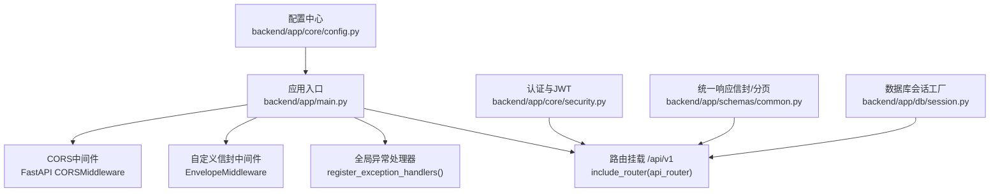
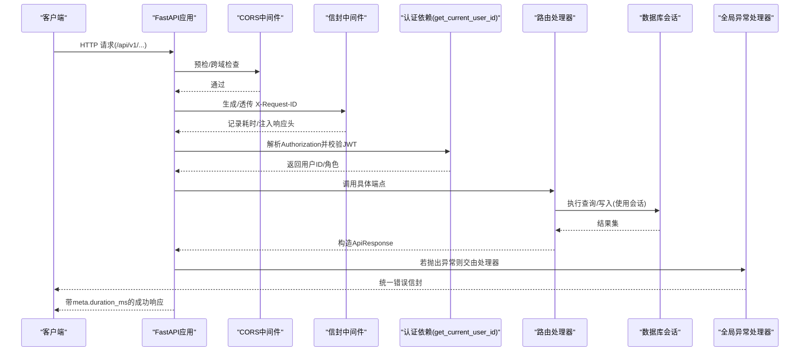
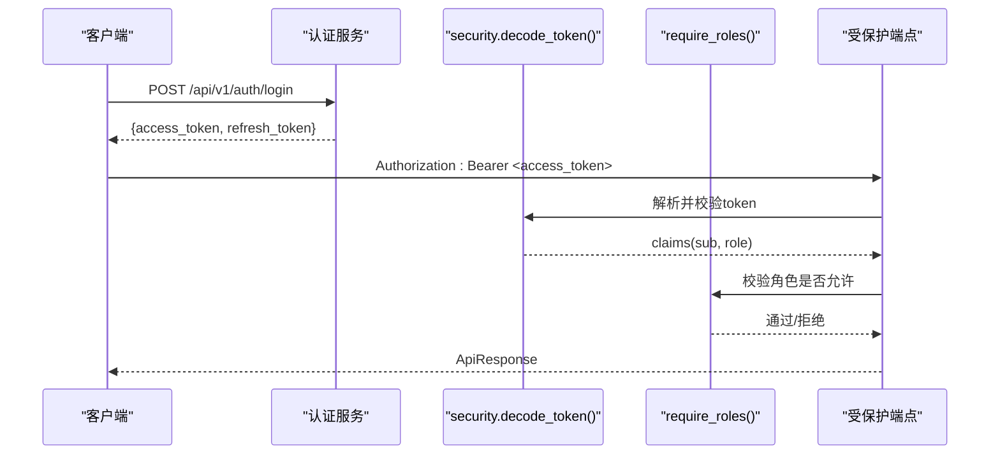
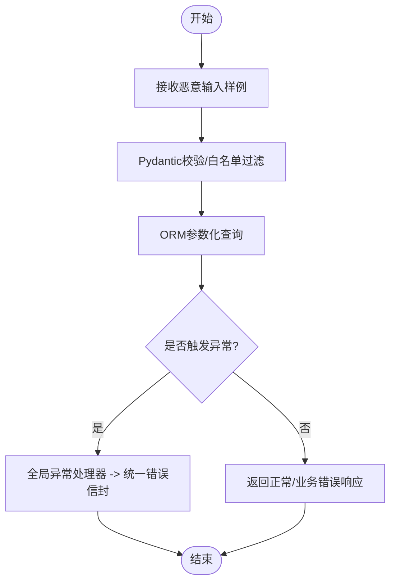
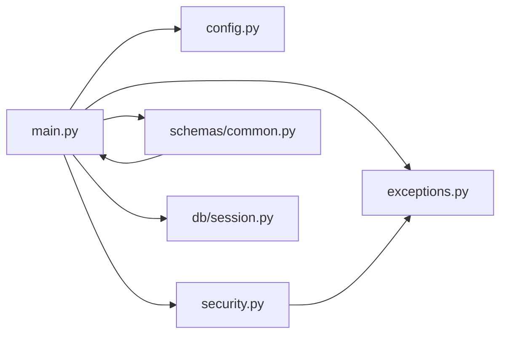

# API安全防护

<cite>
**本文引用的文件**
- [backend/app/main.py](file://backend/app/main.py)
- [backend/app/core/config.py](file://backend/app/core/config.py)
- [backend/app/core/exceptions.py](file://backend/app/core/exceptions.py)
- [backend/app/core/security.py](file://backend/app/core/security.py)
- [backend/app/schemas/common.py](file://backend/app/schemas/common.py)
- [backend/app/schemas/auth.py](file://backend/app/schemas/auth.py)
- [backend/app/db/session.py](file://backend/app/db/session.py)
- [tests/test_api_boundary.py](file://tests/test_api_boundary.py)
</cite>

## 目录
1. [简介](#简介)
2. [项目结构](#项目结构)
3. [核心组件](#核心组件)
4. [架构总览](#架构总览)
5. [详细组件分析](#详细组件分析)
6. [依赖关系分析](#依赖关系分析)
7. [性能与可用性考虑](#性能与可用性考虑)
8. [故障排查指南](#故障排查指南)
9. [结论](#结论)
10. [附录](#附录)

## 简介
本文件面向AI药物设计系统的API安全，聚焦输入验证与清洗、SQL注入与XSS防护、速率限制与配额控制、异常处理与安全错误响应、API版本与向后兼容、请求签名与访问控制（IP白名单、User-Agent校验）、监控告警与事件响应、CORS/CSRF与安全头配置等关键主题。文档基于仓库现有实现进行梳理，并给出可落地的增强建议与图示说明。

## 项目结构
后端采用FastAPI应用，入口在main中完成中间件注册、CORS配置、全局异常处理器挂载以及v1路由前缀；配置通过pydantic-settings集中管理；认证与鉴权集中在core模块；统一响应信封与分页模型位于schemas；数据库会话由db.session提供异步/同步双引擎支持。

图表来源
- [backend/app/main.py:187-248](file://backend/app/main.py#L187-L248)
- [backend/app/core/config.py:112-122](file://backend/app/core/config.py#L112-L122)
- [backend/app/core/exceptions.py:131-179](file://backend/app/core/exceptions.py#L131-L179)
- [backend/app/core/security.py:155-191](file://backend/app/core/security.py#L155-L191)
- [backend/app/schemas/common.py:63-89](file://backend/app/schemas/common.py#L63-L89)
- [backend/app/db/session.py:94-128](file://backend/app/db/session.py#L94-L128)

章节来源
- [backend/app/main.py:187-248](file://backend/app/main.py#L187-L248)
- [backend/app/core/config.py:112-122](file://backend/app/core/config.py#L112-L122)

## 核心组件
- 统一信封与元数据：所有成功响应遵循{success, data, meta}格式，meta包含request_id与duration_ms，便于追踪与观测。
- 全局异常处理：业务异常与参数校验异常均被捕获，返回统一错误信封，避免堆栈与内部细节泄露。
- 认证与授权：基于OAuth2 Bearer + JWT的短期access token与长期refresh token机制，并提供角色守卫依赖。
- CORS与跨域：允许源列表来自配置，暴露追踪相关响应头。
- 数据库会话：异步/同步双引擎，自动提交/回滚，降低事务泄漏风险。

章节来源
- [backend/app/schemas/common.py:63-89](file://backend/app/schemas/common.py#L63-L89)
- [backend/app/core/exceptions.py:131-179](file://backend/app/core/exceptions.py#L131-L179)
- [backend/app/core/security.py:155-191](file://backend/app/core/security.py#L155-L191)
- [backend/app/main.py:219-227](file://backend/app/main.py#L219-L227)
- [backend/app/db/session.py:94-128](file://backend/app/db/session.py#L94-L128)

## 架构总览
下图展示一次受保护的API请求从进入应用到返回响应的关键路径，包括中间件、认证、路由与异常处理。

图表来源
- [backend/app/main.py:215-233](file://backend/app/main.py#L215-L233)
- [backend/app/core/security.py:155-191](file://backend/app/core/security.py#L155-L191)
- [backend/app/core/exceptions.py:131-179](file://backend/app/core/exceptions.py#L131-L179)
- [backend/app/db/session.py:94-128](file://backend/app/db/session.py#L94-L128)

## 详细组件分析

### 输入验证与Sanitization（Pydantic模型）
- 使用Pydantic v2对请求体进行强类型校验，字段级约束（长度、范围、枚举）在序列化阶段即拦截非法输入。
- 认证相关Schema定义了邮箱、密码长度、角色白名单等约束，防止越权与畸形输入。
- 通用响应信封与分页元数据确保输出结构稳定，减少前端解析歧义。

建议与现状
- 现状：通过Pydantic模型与field_validator进行基础校验与白名单过滤。
- 建议：对自由文本字段增加长度上限与字符集白名单；对富文本输出统一转义或HTML清理；结合LLM护栏做内容安全扫描。

章节来源
- [backend/app/schemas/auth.py:13-27](file://backend/app/schemas/auth.py#L13-L27)
- [backend/app/schemas/common.py:35-89](file://backend/app/schemas/common.py#L35-L89)

### SQL注入防护
- 数据访问层使用ORM（SQLAlchemy），默认以参数化方式构建查询，避免拼接SQL字符串，从而有效防御SQL注入。
- 会话工厂提供异步/同步双引擎，并在异常时自动回滚，降低不一致风险。

建议与现状
- 现状：未直接拼接SQL，主要依赖ORM参数化。
- 建议：严格限制动态排序/过滤字段的白名单；对复杂查询使用表达式对象而非字符串拼接；定期审计原生SQL片段。

章节来源
- [backend/app/db/session.py:94-128](file://backend/app/db/session.py#L94-L128)

### XSS攻击防护
- 当前系统为JSON API，默认不渲染HTML，天然降低XSS面。
- 若后续引入HTML/富文本输出，需在前端与服务端双重转义，并对允许的标签/属性做白名单过滤。

建议与现状
- 现状：无显式HTML输出逻辑。
- 建议：在服务端对可能输出的文本进行转义；对富文本使用安全的HTML清理库；前端启用Content-Security-Policy与DOMPurify。

章节来源
- [backend/app/schemas/common.py:63-89](file://backend/app/schemas/common.py#L63-L89)

### 速率限制与请求配额控制
- 异常体系已定义RateLimitedError（HTTP 429），可用于限流场景的错误响应。
- 当前未在中间件层实现令牌桶/滑动窗口等限流策略。

建议与现状
- 现状：具备限流错误类型，但未见全局限流中间件。
- 建议：在网关或应用层接入Redis令牌桶/漏桶；按用户/接口维度设置配额；对敏感接口（如登录、批量导出）单独降速；返回标准429并携带重试After-Retry头。

章节来源
- [backend/app/core/exceptions.py:84-87](file://backend/app/core/exceptions.py#L84-L87)

### 异常处理与安全错误响应
- 全局异常处理器将业务异常、参数校验异常与未捕获异常分别映射到统一错误信封，避免堆栈与内部信息泄露。
- 日志记录区分业务警告与内部错误，便于审计与排障。

建议与现状
- 现状：统一的错误信封与分级日志。
- 建议：生产环境关闭调试模式；对外仅返回最小必要信息；对5xx错误触发告警；对高频错误建立熔断与降级策略。

章节来源
- [backend/app/core/exceptions.py:131-179](file://backend/app/core/exceptions.py#L131-L179)

### API版本控制与向后兼容
- 路由统一挂载于/api/v1前缀，便于未来演进至v2并保持兼容。
- 响应信封结构稳定，新增字段应遵循向后兼容原则（可选字段）。

建议与现状
- 现状：固定v1前缀。
- 建议：在OpenAPI描述中标注版本；对破坏性变更发布新前缀；保留旧版一段时间并逐步弃用通知。

章节来源
- [backend/app/main.py:233-233](file://backend/app/main.py#L233-L233)

### 请求签名验证、IP白名单与User-Agent校验
- 当前未实现请求签名、IP白名单与User-Agent强制校验。
- 建议在网关层或前置中间件实现：
  - 请求签名：HMAC-SHA256，时间戳+随机数防重放。
  - IP白名单：仅允许可信来源访问敏感接口。
  - User-Agent校验：拒绝空UA或已知恶意UA。

建议与现状
- 现状：未实现上述三项。
- 建议：在反向代理或应用中间件统一落地；对违规请求直接403/401并记录审计日志。

章节来源
- [backend/app/core/security.py:155-191](file://backend/app/core/security.py#L155-L191)

### 监控告警、异常检测与安全事件响应
- 信封中间件注入X-Request-ID与X-Response-Time-ms，便于链路追踪与性能观测。
- 全局异常处理器记录结构化日志，可作为告警信号源。

建议与现状
- 现状：具备请求追踪与耗时统计。
- 建议：对接APM/日志平台；对429/401/403/5xx阈值告警；对异常模式（如大量失败）自动熔断；建立安全事件响应流程。

章节来源
- [backend/app/main.py:131-156](file://backend/app/main.py#L131-L156)
- [backend/app/core/exceptions.py:131-179](file://backend/app/core/exceptions.py#L131-L179)

### CORS、CSRF防护与安全头设置
- CORS：允许源列表来自配置，暴露追踪相关响应头。
- CSRF：由于主要为JSON API且使用Bearer Token，传统CSRF风险较低；若存在表单页面，需启用CSRF保护。
- 安全头：建议添加Strict-Transport-Security、X-Content-Type-Options、X-Frame-Options、Referrer-Policy等。

建议与现状
- 现状：CORS已配置，未显式设置其他安全头。
- 建议：在生产开启HSTS；禁用缓存敏感接口；限制点击劫持；细化CORS方法与头部白名单。

章节来源
- [backend/app/main.py:219-227](file://backend/app/main.py#L219-L227)
- [backend/app/core/config.py:112-122](file://backend/app/core/config.py#L112-L122)

### 认证与授权流程（JWT）
- 登录成功后签发短期access token与长期refresh token。
- 受保护端点通过依赖注入获取当前用户ID与角色，配合角色守卫实现细粒度权限控制。

图表来源
- [backend/app/core/security.py:96-122](file://backend/app/core/security.py#L96-L122)
- [backend/app/core/security.py:125-149](file://backend/app/core/security.py#L125-L149)
- [backend/app/core/security.py:194-210](file://backend/app/core/security.py#L194-L210)

章节来源
- [backend/app/core/security.py:96-122](file://backend/app/core/security.py#L96-L122)
- [backend/app/core/security.py:125-149](file://backend/app/core/security.py#L125-L149)
- [backend/app/core/security.py:194-210](file://backend/app/core/security.py#L194-L210)

### 恶意输入测试与边界用例
- 测试覆盖多种恶意输入（SQL注入、XSS、模板注入、JNDI等），确保不会导致服务器崩溃，并返回合理状态码。

图表来源
- [tests/test_api_boundary.py:157-191](file://tests/test_api_boundary.py#L157-L191)
- [backend/app/core/exceptions.py:131-179](file://backend/app/core/exceptions.py#L131-L179)

章节来源
- [tests/test_api_boundary.py:157-191](file://tests/test_api_boundary.py#L157-L191)

## 依赖关系分析
- main依赖配置中心、异常处理器、路由与中间件。
- security依赖配置与异常类型，提供认证依赖。
- schemas为各路由提供输入/输出契约。
- db.session为路由提供数据库访问能力。

图表来源
- [backend/app/main.py:187-248](file://backend/app/main.py#L187-L248)
- [backend/app/core/config.py:112-122](file://backend/app/core/config.py#L112-L122)
- [backend/app/core/exceptions.py:131-179](file://backend/app/core/exceptions.py#L131-L179)
- [backend/app/core/security.py:155-191](file://backend/app/core/security.py#L155-L191)
- [backend/app/schemas/common.py:63-89](file://backend/app/schemas/common.py#L63-L89)
- [backend/app/db/session.py:94-128](file://backend/app/db/session.py#L94-L128)

章节来源
- [backend/app/main.py:187-248](file://backend/app/main.py#L187-L248)

## 性能与可用性考虑
- 信封中间件会缓冲响应体以注入耗时与追踪头，对大响应体有额外内存开销，建议仅在必要接口启用或在网关侧处理。
- 数据库连接池大小与溢出参数可按负载调优；SQLite场景下无需池参数。
- 对高延迟外部依赖（知识库、LLM）建议增加超时与重试退避策略。

[本节为通用指导，不直接分析具体文件]

## 故障排查指南
- 统一错误信封包含code、message与details，结合X-Request-ID快速定位问题。
- 关注429（限流）、401/403（认证/授权失败）、400（参数校验失败）、502/500（上游/内部错误）等状态码分布。
- 对频繁失败的接口启用熔断与降级，避免雪崩。

章节来源
- [backend/app/core/exceptions.py:131-179](file://backend/app/core/exceptions.py#L131-L179)
- [backend/app/schemas/common.py:83-89](file://backend/app/schemas/common.py#L83-L89)

## 结论
当前系统在输入验证（Pydantic）、SQL注入防护（ORM参数化）、统一错误响应、CORS与请求追踪方面已有良好基础。建议优先补齐全局限流、安全头与更严格的CORS策略，完善监控告警与事件响应流程，并在需要时引入请求签名、IP白名单与User-Agent校验，以提升整体API安全性与可观测性。

[本节为总结，不直接分析具体文件]

## 附录
- 建议的安全头清单：Strict-Transport-Security、X-Content-Type-Options、X-Frame-Options、Referrer-Policy、Content-Security-Policy（针对HTML输出）。
- 建议的限流策略：按用户/接口维度令牌桶；敏感接口独立配额；429响应携带Retry-After。
- 建议的审计日志：认证失败、权限不足、限流触发、异常峰值等事件上报SIEM。

[本节为通用建议，不直接分析具体文件]