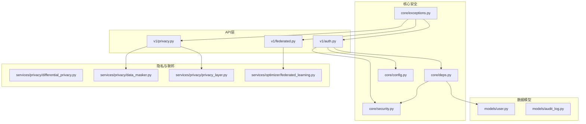
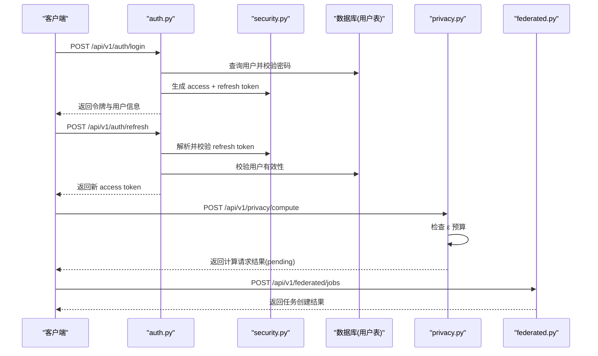
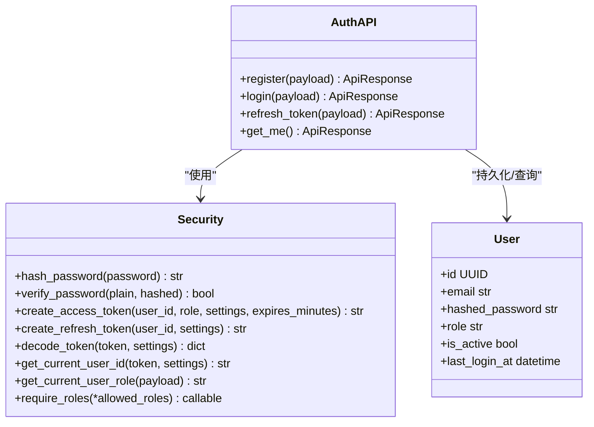
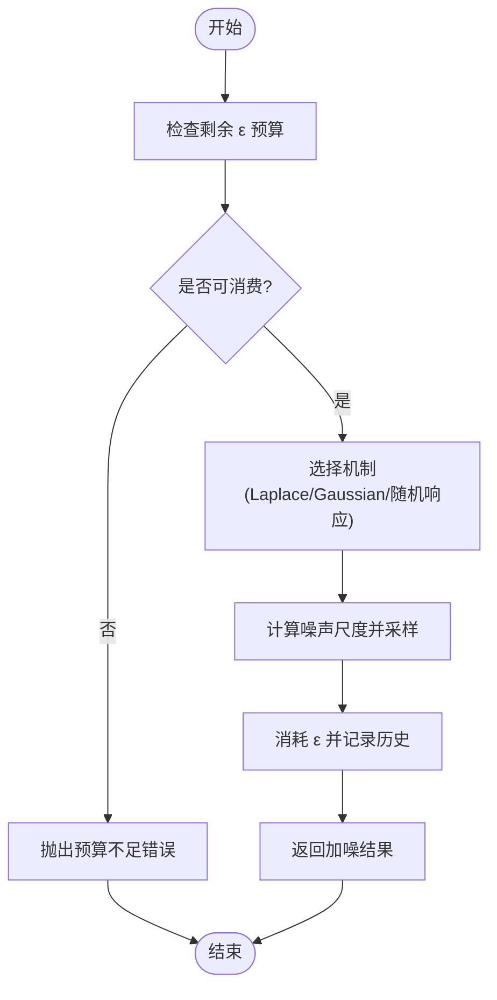
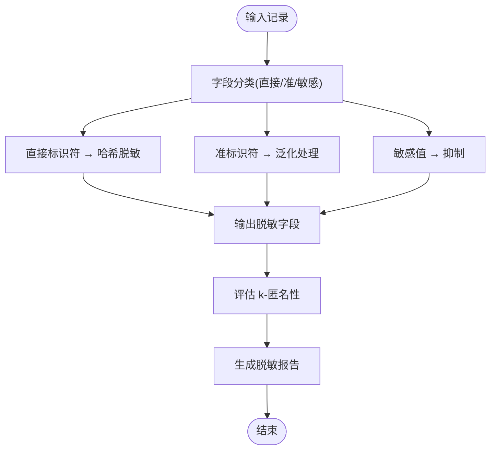
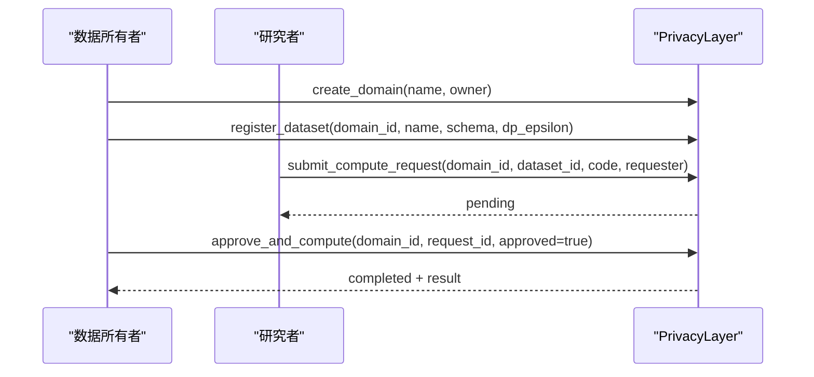
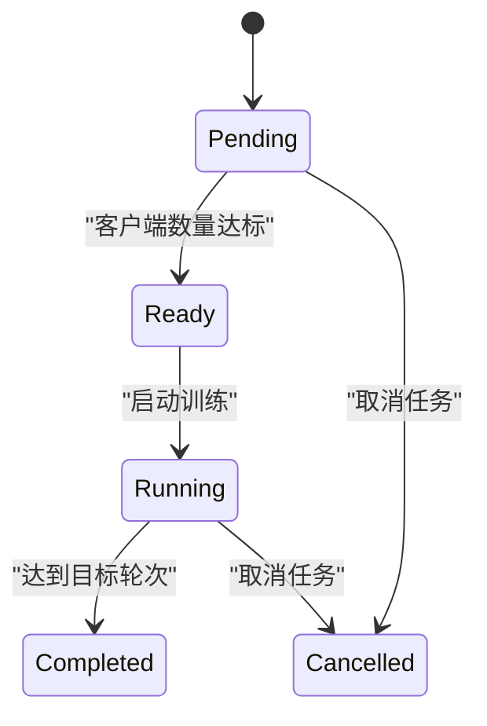
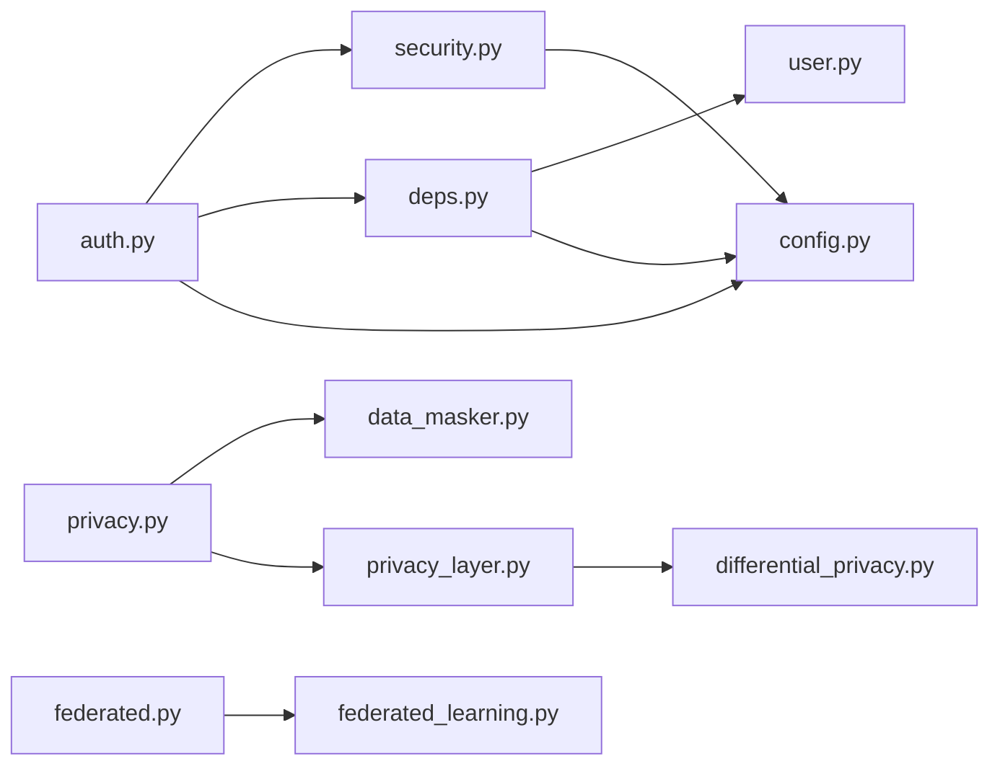

# 安全架构设计

<cite>
**本文引用的文件**   
- [backend/app/core/security.py](file://backend/app/core/security.py)
- [backend/app/api/v1/auth.py](file://backend/app/api/v1/auth.py)
- [backend/app/core/config.py](file://backend/app/core/config.py)
- [backend/app/core/exceptions.py](file://backend/app/core/exceptions.py)
- [backend/app/core/deps.py](file://backend/app/core/deps.py)
- [backend/app/models/user.py](file://backend/app/models/user.py)
- [backend/app/schemas/auth.py](file://backend/app/schemas/auth.py)
- [backend/app/services/privacy/differential_privacy.py](file://backend/app/services/privacy/differential_privacy.py)
- [backend/app/services/privacy/data_masker.py](file://backend/app/services/privacy/data_masker.py)
- [backend/app/services/privacy/privacy_layer.py](file://backend/app/services/privacy/privacy_layer.py)
- [backend/app/api/v1/privacy.py](file://backend/app/api/v1/privacy.py)
- [backend/app/api/v1/federated.py](file://backend/app/api/v1/federated.py)
- [backend/app/services/optimizer/federated_learning.py](file://backend/app/services/optimizer/federated_learning.py)
- [backend/app/models/audit_log.py](file://backend/app/models/audit_log.py)
</cite>

## 目录
1. [引言](#引言)
2. [项目结构](#项目结构)
3. [核心组件](#核心组件)
4. [架构总览](#架构总览)
5. [详细组件分析](#详细组件分析)
6. [依赖关系分析](#依赖关系分析)
7. [性能与安全权衡](#性能与安全权衡)
8. [故障排查指南](#故障排查指南)
9. [结论](#结论)
10. [附录：合规与最佳实践清单](#附录合规与最佳实践清单)

## 引言
本文件面向AI药物设计系统的安全架构，聚焦身份认证（JWT）、授权控制、数据加密与隐私保护、差分隐私、数据脱敏、安全多方计算集成、API安全防护、审计日志与监控告警、合规保障、配置最佳实践、漏洞扫描与应急响应。文档基于仓库现有实现进行系统化梳理，并提供可视化图示帮助理解。

## 项目结构
后端采用分层架构：API层路由到服务层，服务层调用领域模型与工具库；安全能力集中在 core/security、core/exceptions、core/deps 等模块，隐私与联邦学习在 services/privacy 与 services/optimizer 中实现。

图表来源
- [backend/app/api/v1/auth.py:1-147](file://backend/app/api/v1/auth.py#L1-L147)
- [backend/app/api/v1/privacy.py:1-177](file://backend/app/api/v1/privacy.py#L1-L177)
- [backend/app/api/v1/federated.py:1-133](file://backend/app/api/v1/federated.py#L1-L133)
- [backend/app/core/security.py:1-211](file://backend/app/core/security.py#L1-L211)
- [backend/app/core/exceptions.py:1-179](file://backend/app/core/exceptions.py#L1-L179)
- [backend/app/core/deps.py:1-129](file://backend/app/core/deps.py#L1-L129)
- [backend/app/core/config.py:1-144](file://backend/app/core/config.py#L1-L144)
- [backend/app/services/privacy/differential_privacy.py:1-151](file://backend/app/services/privacy/differential_privacy.py#L1-L151)
- [backend/app/services/privacy/data_masker.py:1-294](file://backend/app/services/privacy/data_masker.py#L1-L294)
- [backend/app/services/privacy/privacy_layer.py:1-199](file://backend/app/services/privacy/privacy_layer.py#L1-L199)
- [backend/app/services/optimizer/federated_learning.py:1-199](file://backend/app/services/optimizer/federated_learning.py#L1-L199)
- [backend/app/models/user.py:1-36](file://backend/app/models/user.py#L1-L36)
- [backend/app/models/audit_log.py:1-45](file://backend/app/models/audit_log.py#L1-L45)

章节来源
- [backend/app/api/v1/auth.py:1-147](file://backend/app/api/v1/auth.py#L1-L147)
- [backend/app/core/security.py:1-211](file://backend/app/core/security.py#L1-L211)
- [backend/app/core/config.py:1-144](file://backend/app/core/config.py#L1-L144)

## 核心组件
- 身份认证与令牌管理：bcrypt 密码哈希、JWT access/refresh token 生成与校验、FastAPI 依赖注入获取当前用户与角色。
- 授权控制：基于角色的访问控制（RBAC），通过 require_roles 工厂函数对端点进行角色守卫。
- 异常与错误响应：统一业务异常体系与全局处理器，确保敏感信息不泄露。
- 隐私预算与差分隐私：PrivacyBudget 追踪 ε 消耗，提供 Laplace/Gaussian/随机响应机制。
- 数据脱敏：直接标识符哈希、准标识符泛化、敏感值抑制，k-匿名性评估与报告。
- 隐私计算层：模拟 PySyft Domain 的创建域、注册数据集、提交计算请求与审批执行流程。
- 联邦学习：任务生命周期管理、客户端注册、轮次指标更新与状态机。
- 审计日志：不可变 append-only 记录，包含操作、资源、前后值、IP、UA 等。

章节来源
- [backend/app/core/security.py:1-211](file://backend/app/core/security.py#L1-L211)
- [backend/app/core/exceptions.py:1-179](file://backend/app/core/exceptions.py#L1-L179)
- [backend/app/services/privacy/differential_privacy.py:1-151](file://backend/app/services/privacy/differential_privacy.py#L1-L151)
- [backend/app/services/privacy/data_masker.py:1-294](file://backend/app/services/privacy/data_masker.py#L1-L294)
- [backend/app/services/privacy/privacy_layer.py:1-199](file://backend/app/services/privacy/privacy_layer.py#L1-L199)
- [backend/app/services/optimizer/federated_learning.py:1-199](file://backend/app/services/optimizer/federated_learning.py#L1-L199)
- [backend/app/models/audit_log.py:1-45](file://backend/app/models/audit_log.py#L1-L45)

## 架构总览
下图展示从客户端到后端的核心安全路径：登录鉴权、令牌刷新、受保护接口访问、隐私计算与联邦学习任务编排。

图表来源
- [backend/app/api/v1/auth.py:70-134](file://backend/app/api/v1/auth.py#L70-L134)
- [backend/app/core/security.py:96-149](file://backend/app/core/security.py#L96-L149)
- [backend/app/api/v1/privacy.py:94-132](file://backend/app/api/v1/privacy.py#L94-L132)
- [backend/app/api/v1/federated.py:35-61](file://backend/app/api/v1/federated.py#L35-L61)

## 详细组件分析

### 身份认证与授权（JWT + RBAC）
- 密码安全：使用 bcrypt 进行哈希与验证，避免明文存储与时序攻击风险。
- JWT 令牌：access token 短期有效，refresh token 长期有效；decode 时校验签名、过期与必要声明（sub）。
- 依赖注入：get_current_user_id 提取并校验 bearer token；get_current_user_role 读取角色；require_roles 提供角色守卫。
- 用户对象缓存：短 TTL 内存缓存减少数据库压力，同时保证禁用状态及时生效。

图表来源
- [backend/app/core/security.py:32-211](file://backend/app/core/security.py#L32-L211)
- [backend/app/api/v1/auth.py:41-147](file://backend/app/api/v1/auth.py#L41-L147)
- [backend/app/models/user.py:14-36](file://backend/app/models/user.py#L14-L36)

章节来源
- [backend/app/core/security.py:1-211](file://backend/app/core/security.py#L1-L211)
- [backend/app/api/v1/auth.py:1-147](file://backend/app/api/v1/auth.py#L1-L147)
- [backend/app/core/deps.py:101-124](file://backend/app/core/deps.py#L101-L124)
- [backend/app/models/user.py:1-36](file://backend/app/models/user.py#L1-L36)

### 数据加密与密钥管理
- 密码哈希：bcrypt 带盐与成本参数，抵抗彩虹表与暴力破解。
- JWT 签名：HS256 算法，secret key 由 Settings 集中管理，支持不同环境配置。
- 建议：生产环境应轮换 secret、启用强随机源、限制密钥长度与算法选择策略。

章节来源
- [backend/app/core/security.py:64-149](file://backend/app/core/security.py#L64-L149)
- [backend/app/core/config.py:78-83](file://backend/app/core/config.py#L78-L83)

### 差分隐私算法实现
- 隐私预算：PrivacyBudget 维护 total_epsilon、spent_epsilon、delta 与历史，提供 can_spend/spend/remaining 方法。
- 机制：
  - Laplace 机制：按敏感度与 ε 计算尺度，添加噪声。
  - Gaussian 机制：引入 δ，按公式计算 σ 并加噪。
  - 随机响应：用于布尔值，以概率翻转输出。
- 预算不足：抛出运行时错误，阻止超预算查询。

图表来源
- [backend/app/services/privacy/differential_privacy.py:16-151](file://backend/app/services/privacy/differential_privacy.py#L16-L151)

章节来源
- [backend/app/services/privacy/differential_privacy.py:1-151](file://backend/app/services/privacy/differential_privacy.py#L1-L151)

### 数据脱敏技术
- 字段分类：
  - 直接标识符：SHA-256 哈希脱敏（带盐），防止重识别。
  - 准标识符：年龄分段、邮编前缀保留、日期截断到月/年。
  - 敏感值：替换为占位符抑制。
- k-匿名性：按准标识符组合分组，评估最小同质组大小是否满足阈值 k。
- 报告：统计处理字段数、各类处理计数、违规项与最小组大小。

图表来源
- [backend/app/services/privacy/data_masker.py:126-294](file://backend/app/services/privacy/data_masker.py#L126-L294)

章节来源
- [backend/app/services/privacy/data_masker.py:1-294](file://backend/app/services/privacy/data_masker.py#L1-L294)
- [backend/app/api/v1/privacy.py:148-177](file://backend/app/api/v1/privacy.py#L148-L177)

### 安全多方计算集成（隐私计算层）
- 隐私域：创建域、列出域、获取域详情。
- 数据集注册：绑定 schema、描述与 ε 预算。
- 计算请求：提交代码与 ε 预算，进入待审批队列。
- 审批执行：所有者批准或拒绝，批准后执行并返回结果。

图表来源
- [backend/app/services/privacy/privacy_layer.py:54-199](file://backend/app/services/privacy/privacy_layer.py#L54-L199)
- [backend/app/api/v1/privacy.py:47-132](file://backend/app/api/v1/privacy.py#L47-L132)

章节来源
- [backend/app/services/privacy/privacy_layer.py:1-199](file://backend/app/services/privacy/privacy_layer.py#L1-L199)
- [backend/app/api/v1/privacy.py:1-177](file://backend/app/api/v1/privacy.py#L1-L177)

### 联邦学习安全编排
- 任务创建：指定模型架构、轮数、最少客户端数。
- 客户端注册：达到最小客户端后任务就绪并可启动。
- 轮次更新：记录每轮指标，完成时标记任务完成。
- 停止/取消：支持中途终止。

图表来源
- [backend/app/services/optimizer/federated_learning.py:53-199](file://backend/app/services/optimizer/federated_learning.py#L53-L199)
- [backend/app/api/v1/federated.py:35-133](file://backend/app/api/v1/federated.py#L35-L133)

章节来源
- [backend/app/services/optimizer/federated_learning.py:1-199](file://backend/app/services/optimizer/federated_learning.py#L1-L199)
- [backend/app/api/v1/federated.py:1-133](file://backend/app/api/v1/federated.py#L1-L133)

### API 安全防护与输入验证
- 统一异常封装：业务异常映射为标准错误信封，避免堆栈与内部细节泄露。
- 参数校验：Pydantic Schema 强制类型与约束（如邮箱格式、长度、枚举）。
- 请求追踪：X-Request-ID 注入，便于全链路审计与排障。
- 速率限制与护栏：预留 RateLimitedError 与 GuardrailBlockedError 扩展点。

章节来源
- [backend/app/core/exceptions.py:1-179](file://backend/app/core/exceptions.py#L1-L179)
- [backend/app/schemas/auth.py:13-61](file://backend/app/schemas/auth.py#L13-L61)
- [backend/app/core/deps.py:91-98](file://backend/app/core/deps.py#L91-L98)

### SQL 注入防护与 ORM 使用
- 使用 SQLAlchemy ORM 构建查询，避免拼接 SQL 字符串，降低注入风险。
- 所有查询通过 select 与 where 条件构造，参数化传递。

章节来源
- [backend/app/api/v1/auth.py:51-82](file://backend/app/api/v1/auth.py#L51-L82)
- [backend/app/core/deps.py:117-124](file://backend/app/core/deps.py#L117-L124)

### XSS 防护建议
- 前端渲染：建议使用安全的模板引擎与内容安全策略（CSP）。
- 后端输出：JSON 响应默认不包含 HTML，避免将用户输入直接嵌入 HTML。
- 输入清洗：对富文本输入进行白名单过滤与转义。

[本节为通用建议，未直接分析具体文件]

### 审计日志系统与监控告警
- 审计模型：append-only 记录，包含 action、resource_type、before/after 值、IP、UA 与时间戳。
- 索引优化：针对 action 与 created_at 建立复合索引，提升范围查询效率。
- 权限保护：应用层不提供 UPDATE/DELETE，数据库层通过 REVOKE 权限加固。
- 告警建议：结合日志聚合平台对高频失败、权限不足、预算不足等事件设置阈值告警。

章节来源
- [backend/app/models/audit_log.py:1-45](file://backend/app/models/audit_log.py#L1-L45)

## 依赖关系分析
- 认证依赖链：auth.py → security.py → deps.py → user.py。
- 隐私计算依赖链：privacy.py → data_masker.py / privacy_layer.py → differential_privacy.py。
- 联邦学习依赖链：federated.py → federated_learning.py。
- 配置依赖：security.py、auth.py、deps.py 均依赖 config.py 中的 Settings。

图表来源
- [backend/app/api/v1/auth.py:1-147](file://backend/app/api/v1/auth.py#L1-L147)
- [backend/app/core/security.py:1-211](file://backend/app/core/security.py#L1-L211)
- [backend/app/core/deps.py:1-129](file://backend/app/core/deps.py#L1-L129)
- [backend/app/models/user.py:1-36](file://backend/app/models/user.py#L1-L36)
- [backend/app/api/v1/privacy.py:1-177](file://backend/app/api/v1/privacy.py#L1-L177)
- [backend/app/services/privacy/data_masker.py:1-294](file://backend/app/services/privacy/data_masker.py#L1-L294)
- [backend/app/services/privacy/privacy_layer.py:1-199](file://backend/app/services/privacy/privacy_layer.py#L1-L199)
- [backend/app/services/privacy/differential_privacy.py:1-151](file://backend/app/services/privacy/differential_privacy.py#L1-L151)
- [backend/app/api/v1/federated.py:1-133](file://backend/app/api/v1/federated.py#L1-L133)
- [backend/app/services/optimizer/federated_learning.py:1-199](file://backend/app/services/optimizer/federated_learning.py#L1-L199)
- [backend/app/core/config.py:1-144](file://backend/app/core/config.py#L1-L144)

章节来源
- [backend/app/core/config.py:1-144](file://backend/app/core/config.py#L1-L144)
- [backend/app/core/deps.py:1-129](file://backend/app/core/deps.py#L1-L129)

## 性能与安全权衡
- 用户缓存：短 TTL 内存缓存降低数据库压力，但需确保禁用状态变更能及时失效。
- 差分隐私：ε 预算越紧，噪声越大，精度下降；需在隐私与效用间平衡。
- 脱敏粒度：泛化级别越高，可重用性越低；k-匿名阈值影响数据可用性。
- 联邦学习：客户端数量与轮次增加通信开销，需考虑带宽与延迟。

[本节为通用讨论，未直接分析具体文件]

## 故障排查指南
- 认证失败：检查 Authorization header 是否存在、token 类型是否为 access、用户是否被禁用。
- 预算不足：查看隐私预算剩余与请求 ε，确认是否超过 domain.budget_epsilon。
- 参数校验失败：根据 VALIDATION_ERROR 的 errors 列表定位字段问题。
- 上游错误：外部 API 调用失败时，检查网络与凭据，关注 UPSTREAM_ERROR。

章节来源
- [backend/app/core/exceptions.py:57-94](file://backend/app/core/exceptions.py#L57-L94)
- [backend/app/api/v1/privacy.py:105-117](file://backend/app/api/v1/privacy.py#L105-L117)

## 结论
本安全架构围绕“最小权限、可审计、可追溯”的原则，构建了从认证授权、隐私预算、数据脱敏到多方计算与联邦学习的完整闭环。通过统一的异常与校验机制，提升了系统的健壮性与安全性。后续可在密钥轮换、速率限制、CSP 与 WAF 等方面进一步增强。

[本节为总结，未直接分析具体文件]

## 附录：合规与最佳实践清单
- 配置最佳实践
  - 生产环境关闭调试模式，严格限定 CORS 源。
  - 使用强随机且足够长度的 JWT secret，定期轮换。
  - 数据库连接使用环境变量注入，禁止硬编码。
- 漏洞扫描策略
  - 依赖漏洞扫描（SCA）：定期运行，阻断高危漏洞合并。
  - 代码静态分析（SAST）：覆盖安全规则集，纳入 CI。
  - 容器镜像扫描：镜像入库前扫描，阻断已知 CVE。
- 应急响应预案
  - 事件分级：依据影响面与数据敏感性划分等级。
  - 处置流程：隔离、取证、修复、复盘、通知。
  - 演练与复盘：定期演练，完善预案与自动化脚本。

[本节为通用建议，未直接分析具体文件]