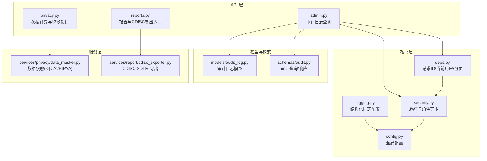
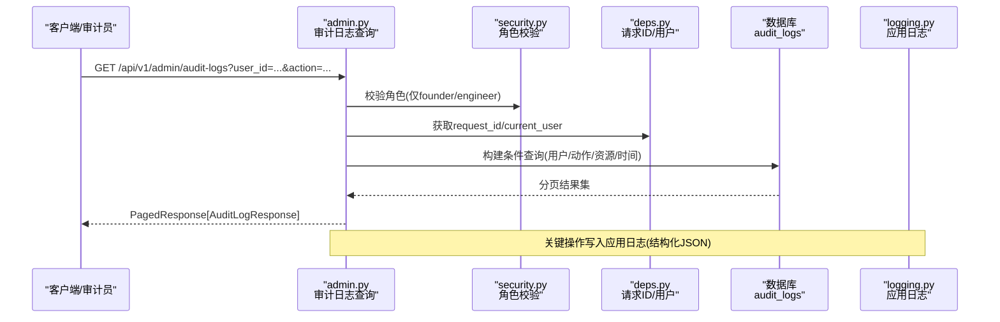
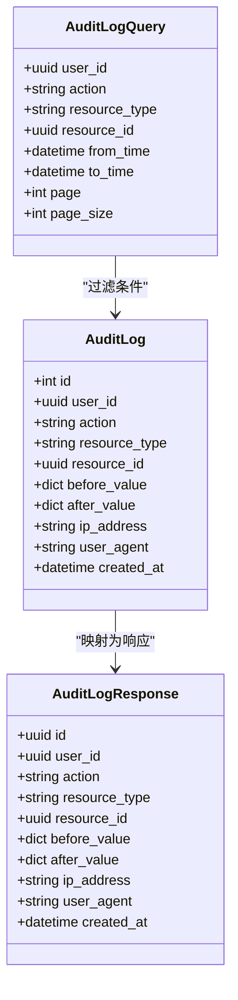
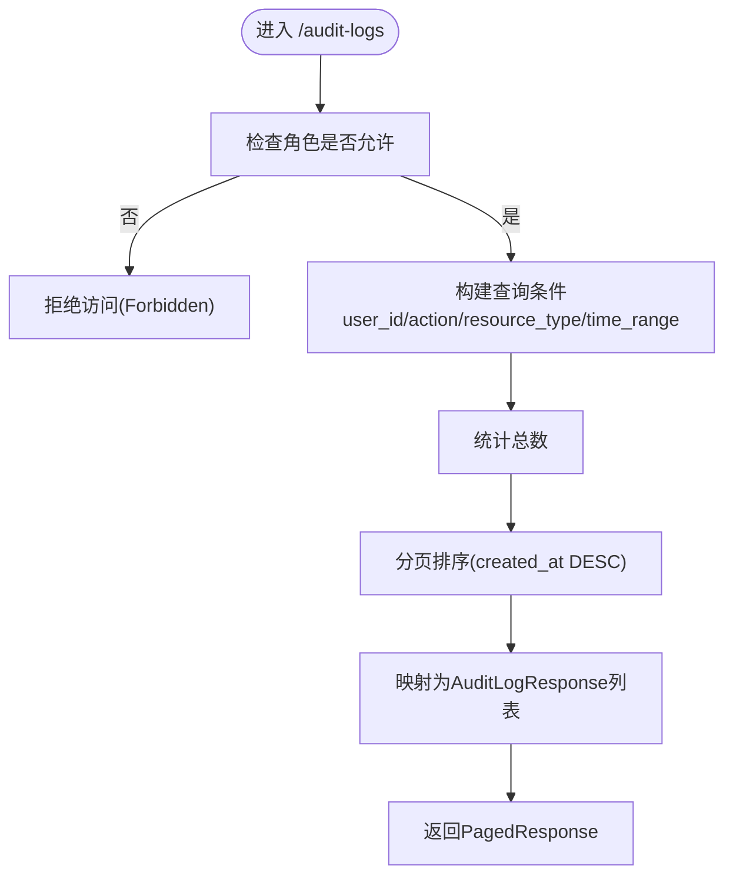
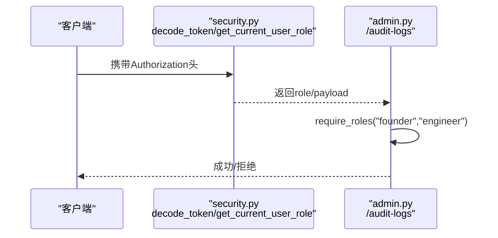
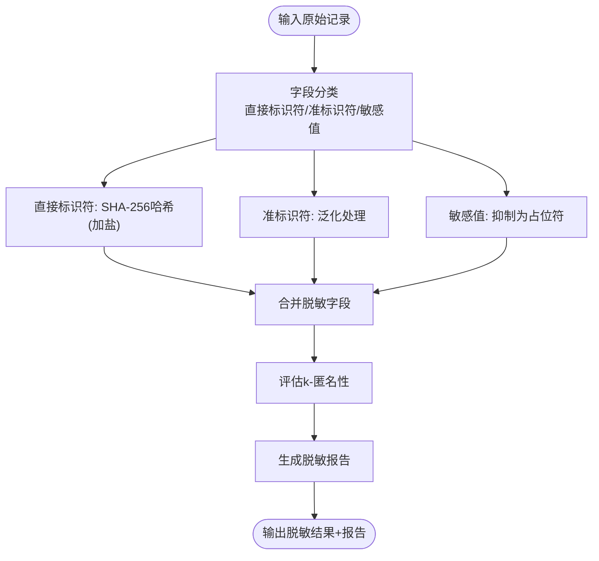
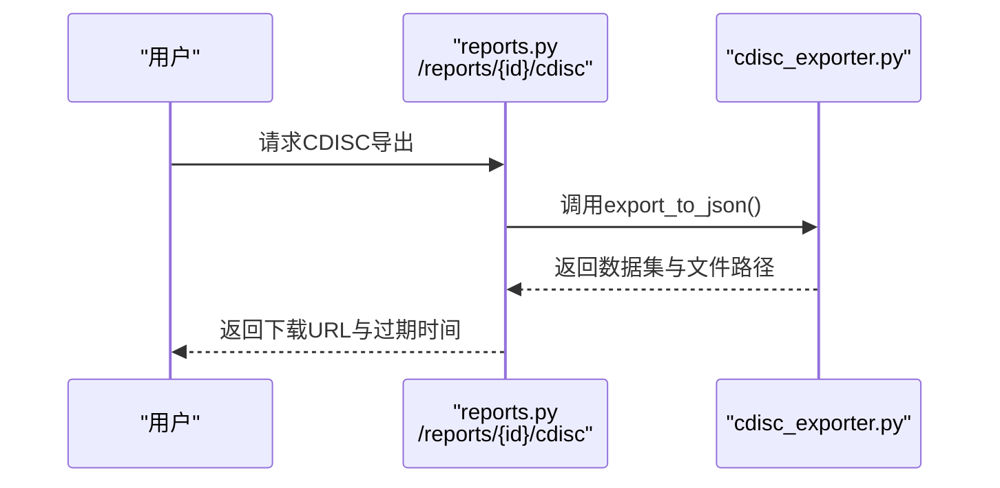
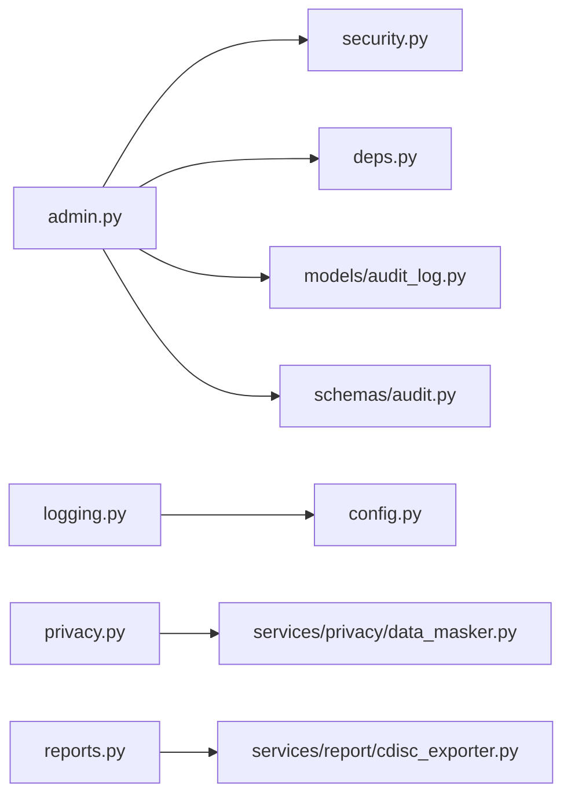

# 审计追踪与合规性

<cite>
**本文引用的文件**   
- [audit_log.py](file://backend/app/models/audit_log.py)
- [audit.py](file://backend/app/schemas/audit.py)
- [admin.py](file://backend/app/api/v1/admin.py)
- [logging.py](file://backend/app/core/logging.py)
- [security.py](file://backend/app/core/security.py)
- [deps.py](file://backend/app/core/deps.py)
- [privacy.py](file://backend/app/api/v1/privacy.py)
- [data_masker.py](file://backend/app/services/privacy/data_masker.py)
- [cdisc_exporter.py](file://backend/app/services/report/cdisc_exporter.py)
- [reports.py](file://backend/app/api/v1/reports.py)
- [config.py](file://backend/app/core/config.py)
- [test_logging.py](file://tests/test_logging.py)
- [test_security.py](file://tests/test_security.py)
</cite>

## 目录
1. [引言](#引言)
2. [项目结构](#项目结构)
3. [核心组件](#核心组件)
4. [架构总览](#架构总览)
5. [详细组件分析](#详细组件分析)
6. [依赖关系分析](#依赖关系分析)
7. [性能考量](#性能考量)
8. [故障排查指南](#故障排查指南)
9. [结论](#结论)
10. [附录](#附录)

## 引言
本文件面向AI药物设计系统的审计追踪与合规性需求，系统性说明：
- 审计日志系统的设计与实现（用户操作记录、数据访问追踪、系统事件监控）
- 日志数据结构、存储策略与检索机制
- 合规保障（GDPR、HIPAA等法规要求）的实现要点
- 数据保留策略、归档与清理机制
- 安全事件检测、异常行为分析与告警通知
- 合规报告生成、审计轨迹导出与第三方审计支持
- 数据主权、跨境数据传输与本地化存储要求

## 项目结构
围绕审计与合规的关键代码位于后端模块中，主要涉及：
- 模型层：审计日志不可变模型定义
- 模式层：审计查询与响应结构
- API层：审计日志查询与管理端点
- 核心层：结构化日志配置、认证与安全、通用依赖注入
- 服务层：隐私计算与数据脱敏、CDISC SDTM 导出
- 配置层：运行环境与输出路径等全局设置
- 测试层：日志与安全的单元测试



图表来源
- [admin.py:53-124](file://backend/app/api/v1/admin.py#L53-L124)
- [reports.py:123-153](file://backend/app/api/v1/reports.py#L123-L153)
- [privacy.py:148-177](file://backend/app/api/v1/privacy.py#L148-L177)
- [logging.py:20-74](file://backend/app/core/logging.py#L20-L74)
- [security.py:194-211](file://backend/app/core/security.py#L194-L211)
- [deps.py:91-124](file://backend/app/core/deps.py#L91-L124)
- [audit_log.py:15-45](file://backend/app/models/audit_log.py#L15-L45)
- [audit.py:14-39](file://backend/app/schemas/audit.py#L14-L39)
- [data_masker.py:126-173](file://backend/app/services/privacy/data_masker.py#L126-L173)
- [cdisc_exporter.py:22-88](file://backend/app/services/report/cdisc_exporter.py#L22-L88)
- [config.py:118-144](file://backend/app/core/config.py#L118-L144)

章节来源
- [admin.py:53-124](file://backend/app/api/v1/admin.py#L53-L124)
- [logging.py:20-74](file://backend/app/core/logging.py#L20-L74)
- [security.py:194-211](file://backend/app/core/security.py#L194-L211)
- [deps.py:91-124](file://backend/app/core/deps.py#L91-L124)
- [audit_log.py:15-45](file://backend/app/models/audit_log.py#L15-L45)
- [audit.py:14-39](file://backend/app/schemas/audit.py#L14-L39)
- [privacy.py:148-177](file://backend/app/api/v1/privacy.py#L148-L177)
- [data_masker.py:126-173](file://backend/app/services/privacy/data_masker.py#L126-L173)
- [cdisc_exporter.py:22-88](file://backend/app/services/report/cdisc_exporter.py#L22-L88)
- [reports.py:123-153](file://backend/app/api/v1/reports.py#L123-L153)
- [config.py:118-144](file://backend/app/core/config.py#L118-L144)

## 核心组件
- 审计日志模型与模式
  - 不可变审计日志表，使用自增主键便于时间范围扫描；包含用户、动作、资源类型/标识、变更前后值、客户端信息、时间戳等字段。
  - 提供查询参数与响应结构，支持按用户、动作、资源类型、时间范围过滤与分页。
- 管理端点
  - 审计日志查询仅对特定角色开放；返回分页结果并附带请求追踪ID。
- 结构化日志
  - 生产环境JSON输出、开发彩色控制台；按大小/时间轮转与保留期；错误日志单独归档。
- 认证与安全
  - JWT访问/刷新令牌、角色守卫；用于审计查询的权限控制。
- 通用依赖
  - 请求ID注入、当前用户解析与短TTL缓存、分页参数。
- 隐私与脱敏
  - HIPAA Safe Harbor 18项处理、k-匿名验证、直接标识符哈希、准标识符泛化、敏感值抑制。
- CDISC SDTM 导出
  - 将报告转换为SDTM JSON，支持TS/DM/AE/LB域，便于监管提交与第三方审计。

章节来源
- [audit_log.py:15-45](file://backend/app/models/audit_log.py#L15-L45)
- [audit.py:14-39](file://backend/app/schemas/audit.py#L14-L39)
- [admin.py:53-124](file://backend/app/api/v1/admin.py#L53-L124)
- [logging.py:20-74](file://backend/app/core/logging.py#L20-L74)
- [security.py:194-211](file://backend/app/core/security.py#L194-L211)
- [deps.py:91-124](file://backend/app/core/deps.py#L91-L124)
- [privacy.py:148-177](file://backend/app/api/v1/privacy.py#L148-L177)
- [data_masker.py:126-173](file://backend/app/services/privacy/data_masker.py#L126-L173)
- [cdisc_exporter.py:22-88](file://backend/app/services/report/cdisc_exporter.py#L22-L88)

## 架构总览
审计与合规相关的数据流与控制流如下：



图表来源
- [admin.py:53-124](file://backend/app/api/v1/admin.py#L53-L124)
- [security.py:194-211](file://backend/app/core/security.py#L194-L211)
- [deps.py:91-124](file://backend/app/core/deps.py#L91-L124)
- [audit_log.py:15-45](file://backend/app/models/audit_log.py#L15-L45)
- [logging.py:20-74](file://backend/app/core/logging.py#L20-L74)

## 详细组件分析

### 审计日志模型与查询
- 模型设计
  - 不可变append-only设计，禁止UPDATE/DELETE；使用BIGSERIAL主键提升时间范围扫描效率；为常用查询建立索引。
- 查询能力
  - 支持按用户、动作、资源类型、资源标识、起止时间过滤；分页返回；响应包含变更前后快照与客户端上下文。
- 典型用法
  - 管理端点通过SQLAlchemy构造动态WHERE子句，统计总数后分页返回。



图表来源
- [audit_log.py:15-45](file://backend/app/models/audit_log.py#L15-L45)
- [audit.py:14-39](file://backend/app/schemas/audit.py#L14-L39)

章节来源
- [audit_log.py:15-45](file://backend/app/models/audit_log.py#L15-L45)
- [audit.py:14-39](file://backend/app/schemas/audit.py#L14-L39)
- [admin.py:53-124](file://backend/app/api/v1/admin.py#L53-L124)

### 管理端点与权限控制
- 权限控制
  - 仅允许founder或engineer角色访问审计日志查询；其他角色抛出权限不足错误。
- 查询流程
  - 解析查询参数，动态拼接WHERE条件，执行count与分页查询，组装PagedResponse。
- 可观测性
  - 响应元数据包含request_id，便于跨链路追踪。



图表来源
- [admin.py:53-124](file://backend/app/api/v1/admin.py#L53-L124)
- [security.py:194-211](file://backend/app/core/security.py#L194-L211)

章节来源
- [admin.py:53-124](file://backend/app/api/v1/admin.py#L53-L124)
- [security.py:194-211](file://backend/app/core/security.py#L194-L211)

### 结构化日志与系统事件监控
- 日志策略
  - 生产环境JSON序列化输出；开发环境彩色可读格式；统一按大小/时间轮转与保留期；错误日志独立归档。
- 监控指标
  - 管理端点暴露Prometheus格式指标（HTTP请求总量、耗时、LLM成本、错误数），便于接入监控系统。
- 可观测性增强
  - 通过依赖注入获取request_id，贯穿请求链路；结合结构化日志进行问题定位。

```mermaid
sequenceDiagram
participant App as "应用启动"
participant LogCfg as "logging.py<br/>setup_logging()"
participant Settings as "config.py<br/>get_settings()"
App->>LogCfg : 初始化日志
LogCfg->>Settings : 读取app_env/log_level
LogCfg-->>App : 注册stdout/文件handler(轮转/保留)
Note over App,LogCfg : 生产JSON/开发彩色; 错误独立归档
```

图表来源
- [logging.py:20-74](file://backend/app/core/logging.py#L20-L74)
- [config.py:118-144](file://backend/app/core/config.py#L118-L144)

章节来源
- [logging.py:20-74](file://backend/app/core/logging.py#L20-L74)
- [admin.py:28-50](file://backend/app/api/v1/admin.py#L28-L50)
- [test_logging.py:1-67](file://tests/test_logging.py#L1-L67)

### 认证、授权与审计关联
- 认证
  - JWT access/refresh token签发与校验；token携带sub、role、type、jti等声明。
- 授权
  - 基于角色的访问控制工厂，限制敏感操作（如审计日志查询）。
- 审计关联
  - 通过依赖注入获取当前用户与请求ID，便于在业务操作中追加审计记录。



图表来源
- [security.py:125-192](file://backend/app/core/security.py#L125-L192)
- [security.py:194-211](file://backend/app/core/security.py#L194-L211)
- [admin.py:53-70](file://backend/app/api/v1/admin.py#L53-L70)
- [test_security.py:46-94](file://tests/test_security.py#L46-L94)

章节来源
- [security.py:125-192](file://backend/app/core/security.py#L125-L192)
- [security.py:194-211](file://backend/app/core/security.py#L194-L211)
- [admin.py:53-70](file://backend/app/api/v1/admin.py#L53-L70)
- [test_security.py:46-94](file://tests/test_security.py#L46-L94)

### 隐私计算与数据脱敏（HIPAA/GDPR）
- 脱敏策略
  - 直接标识符：SHA-256哈希脱敏（带盐）
  - 准标识符：年龄分段、邮编截断、日期精度降低
  - 敏感值：替换为占位符
  - k-匿名性评估与违规记录
- 合规要点
  - 遵循HIPAA Safe Harbor 18项标识符处理；满足最小必要原则与去标识化要求。
- 接口
  - 提供mask-data接口，输入记录与k值，返回脱敏结果与报告。



图表来源
- [data_masker.py:126-173](file://backend/app/services/privacy/data_masker.py#L126-L173)
- [data_masker.py:192-294](file://backend/app/services/privacy/data_masker.py#L192-L294)
- [privacy.py:148-177](file://backend/app/api/v1/privacy.py#L148-L177)

章节来源
- [privacy.py:148-177](file://backend/app/api/v1/privacy.py#L148-L177)
- [data_masker.py:126-173](file://backend/app/services/privacy/data_masker.py#L126-L173)
- [data_masker.py:192-294](file://backend/app/services/privacy/data_masker.py#L192-L294)

### 合规报告与CDISC SDTM导出
- 报告查看
  - 提供报告列表与详情接口，详情包含Markdown与结构化JSON及证据项。
- CDISC导出
  - 导出器支持TS/DM/AE/LB域，输出SDTM JSON；API返回下载链接与过期时间。
- 审计支持
  - 导出产物可作为第三方审计与监管提交的依据。



图表来源
- [reports.py:123-153](file://backend/app/api/v1/reports.py#L123-L153)
- [cdisc_exporter.py:22-88](file://backend/app/services/report/cdisc_exporter.py#L22-L88)

章节来源
- [reports.py:123-153](file://backend/app/api/v1/reports.py#L123-L153)
- [cdisc_exporter.py:22-88](file://backend/app/services/report/cdisc_exporter.py#L22-L88)

## 依赖关系分析
- 组件耦合
  - admin.py依赖security.py与deps.py完成鉴权与上下文注入；依赖models.audit_log与schemas.audit完成数据读写与响应建模。
  - logging.py依赖config.py决定输出格式与保留策略。
  - privacy.py依赖data_masker.py实现脱敏逻辑。
  - reports.py依赖cdisc_exporter.py完成SDTM导出。
- 外部依赖
  - SQLAlchemy异步会话、Pydantic模型、loguru日志库、bcrypt/JWT认证库。



图表来源
- [admin.py:53-124](file://backend/app/api/v1/admin.py#L53-L124)
- [security.py:194-211](file://backend/app/core/security.py#L194-L211)
- [deps.py:91-124](file://backend/app/core/deps.py#L91-L124)
- [audit_log.py:15-45](file://backend/app/models/audit_log.py#L15-L45)
- [audit.py:14-39](file://backend/app/schemas/audit.py#L14-L39)
- [logging.py:20-74](file://backend/app/core/logging.py#L20-L74)
- [config.py:118-144](file://backend/app/core/config.py#L118-L144)
- [privacy.py:148-177](file://backend/app/api/v1/privacy.py#L148-L177)
- [data_masker.py:126-173](file://backend/app/services/privacy/data_masker.py#L126-L173)
- [reports.py:123-153](file://backend/app/api/v1/reports.py#L123-L153)
- [cdisc_exporter.py:22-88](file://backend/app/services/report/cdisc_exporter.py#L22-L88)

章节来源
- [admin.py:53-124](file://backend/app/api/v1/admin.py#L53-L124)
- [security.py:194-211](file://backend/app/core/security.py#L194-L211)
- [deps.py:91-124](file://backend/app/core/deps.py#L91-L124)
- [audit_log.py:15-45](file://backend/app/models/audit_log.py#L15-L45)
- [audit.py:14-39](file://backend/app/schemas/audit.py#L14-L39)
- [logging.py:20-74](file://backend/app/core/logging.py#L20-L74)
- [config.py:118-144](file://backend/app/core/config.py#L118-L144)
- [privacy.py:148-177](file://backend/app/api/v1/privacy.py#L148-L177)
- [data_masker.py:126-173](file://backend/app/services/privacy/data_masker.py#L126-L173)
- [reports.py:123-153](file://backend/app/api/v1/reports.py#L123-L153)
- [cdisc_exporter.py:22-88](file://backend/app/services/report/cdisc_exporter.py#L22-L88)

## 性能考量
- 审计查询优化
  - 使用BIGSERIAL主键与复合索引（动作+时间）提升范围扫描与过滤性能。
  - 分页查询避免全表扫描，配合count语句统计总数。
- 日志I/O
  - 按大小/时间轮转与压缩，减少磁盘占用；错误日志独立归档，便于快速定位。
- 认证缓存
  - 用户对象短TTL内存缓存，降低频繁数据库查询开销。
- 导出性能
  - SDTM导出采用批量构建域记录，避免逐条IO；建议在生产环境使用对象存储持久化大文件。

[本节为通用指导，不直接分析具体文件]

## 故障排查指南
- 审计日志无法查询
  - 确认当前用户角色是否为founder/engineer；检查JWT是否有效且未过期。
  - 核对查询参数（user_id、action、resource_type、时间范围）是否正确。
- 日志缺失或不完整
  - 检查应用是否已调用日志初始化；确认生产/开发模式下输出目标与保留期配置。
- 脱敏失败或k-匿名不满足
  - 调整k值或增加样本量；检查准标识符组合是否过于稀疏导致分组过小。
- CDISC导出无文件
  - 确认输出目录存在且可写；检查报告是否存在以及导出器是否被正确调用。

章节来源
- [admin.py:53-124](file://backend/app/api/v1/admin.py#L53-L124)
- [logging.py:20-74](file://backend/app/core/logging.py#L20-L74)
- [data_masker.py:257-294](file://backend/app/services/privacy/data_masker.py#L257-L294)
- [reports.py:123-153](file://backend/app/api/v1/reports.py#L123-L153)

## 结论
本系统实现了面向审计与合规的核心能力：不可变审计日志、结构化日志与监控、严格的身份与角色控制、HIPAA/GDPR相关的去标识化与k-匿名保障、以及CDISC SDTM导出以支持监管与第三方审计。建议在后续迭代中完善：
- 审计事件自动采集（中间件/装饰器）
- 更完善的告警与异常行为分析
- 数据保留策略自动化（归档/清理）
- 数据主权与跨境传输策略落地（本地化存储与加密）

[本节为总结性内容，不直接分析具体文件]

## 附录

### 合规性保障机制（GDPR/HIPAA）
- GDPR要点
  - 数据最小化与目的限定：仅收集必要的审计与脱敏数据。
  - 数据主体权利：提供查询与导出能力（审计轨迹、报告）。
  - 数据保护：去标识化、访问控制、加密传输与存储。
- HIPAA要点
  - Safe Harbor 18项标识符处理：直接标识符哈希、准标识符泛化、敏感值抑制。
  - k-匿名性：确保同质组规模不低于阈值。
  - 访问与审计：严格角色控制与审计日志记录。

[本节为概念性说明，不直接分析具体文件]

### 数据保留策略、归档与清理
- 应用日志
  - 按大小/时间轮转，默认保留30天；错误日志保留90天。
- 审计日志
  - 建议数据库层实施REVOKE UPDATE/DELETE权限，结合定期归档到对象存储并设置生命周期策略。
- 脱敏与导出产物
  - 建议纳入统一的对象存储与保留策略，支持按项目/时间维度清理。

章节来源
- [logging.py:54-74](file://backend/app/core/logging.py#L54-L74)
- [audit_log.py:15-45](file://backend/app/models/audit_log.py#L15-L45)

### 安全事件检测、异常行为分析与告警
- 检测点
  - 登录失败、权限不足、审计查询异常、脱敏k-匿名不满足、导出失败等。
- 告警通道
  - 结合Prometheus指标与结构化日志，接入告警平台（邮件/IM/工单）。
- 行为分析
  - 基于审计日志聚合高频失败、异常时间段访问、越权尝试等行为特征。

章节来源
- [admin.py:28-50](file://backend/app/api/v1/admin.py#L28-L50)
- [logging.py:20-74](file://backend/app/core/logging.py#L20-L74)
- [data_masker.py:257-294](file://backend/app/services/privacy/data_masker.py#L257-L294)

### 数据主权、跨境数据传输与本地化存储
- 本地化存储
  - 通过配置指定对象存储端点与区域，确保数据驻留于指定地域。
- 跨境传输
  - 如需跨境，应启用端到端加密与访问审计，并在报告中记录数据来源与去向。
- 配置项
  - 对象存储端点、密钥、桶名与区域；CDISC输出目录等。

章节来源
- [config.py:44-50](file://backend/app/core/config.py#L44-L50)
- [config.py:95-98](file://backend/app/core/config.py#L95-L98)