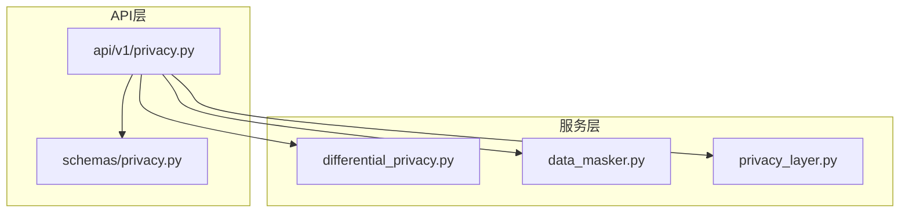
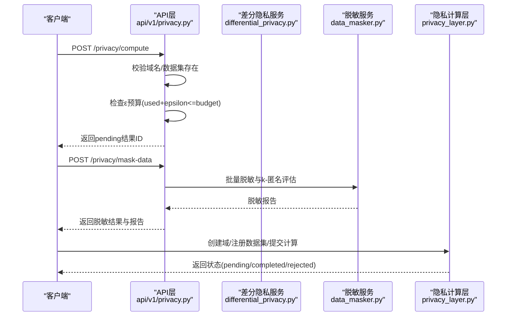
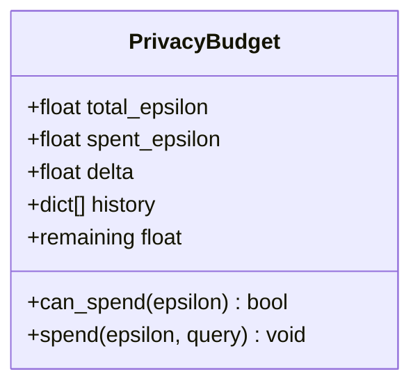
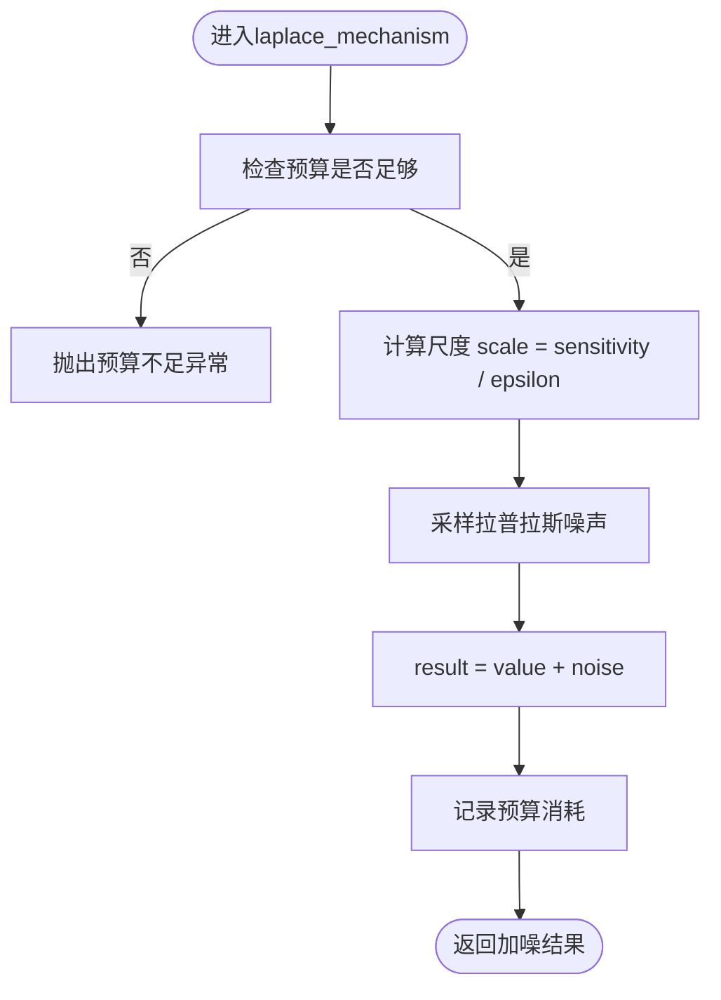
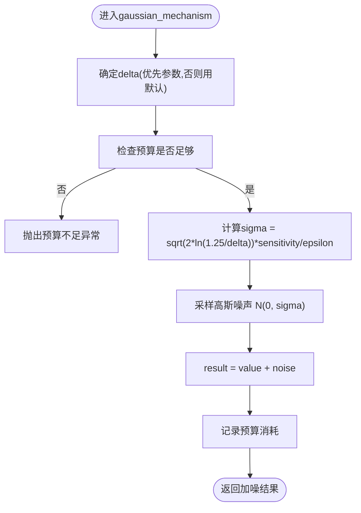
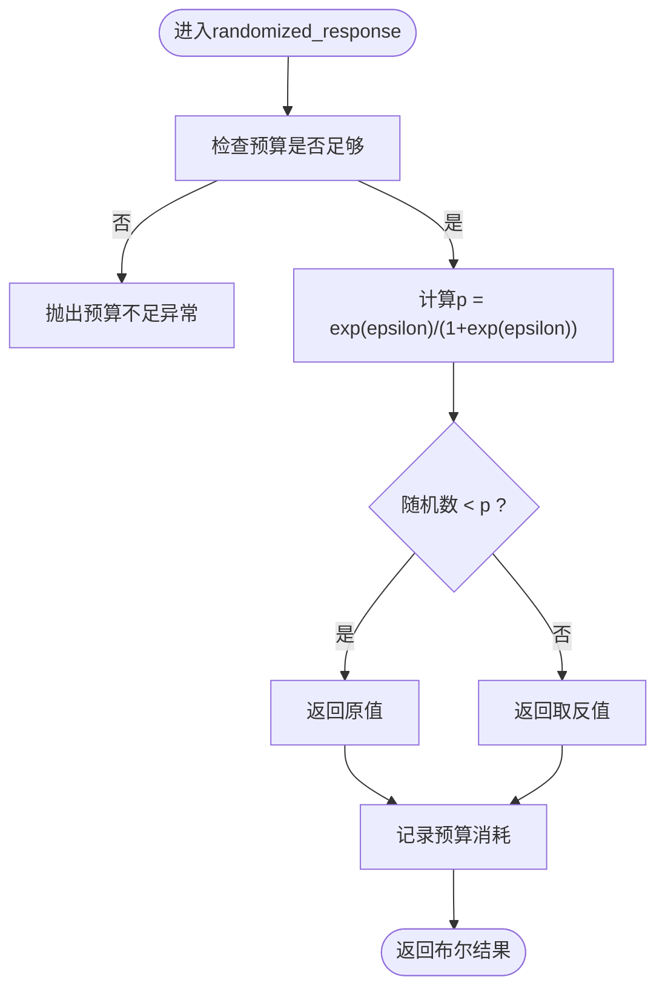
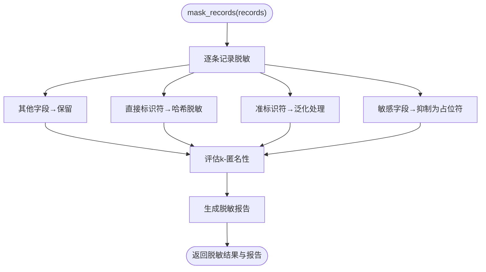
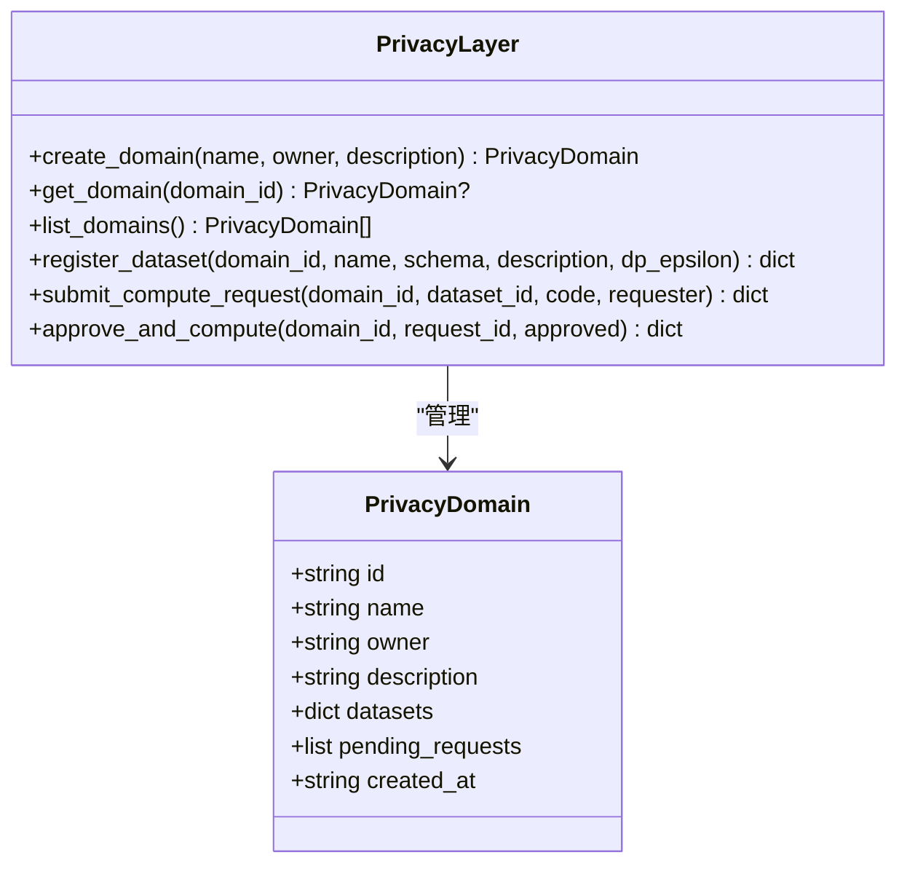
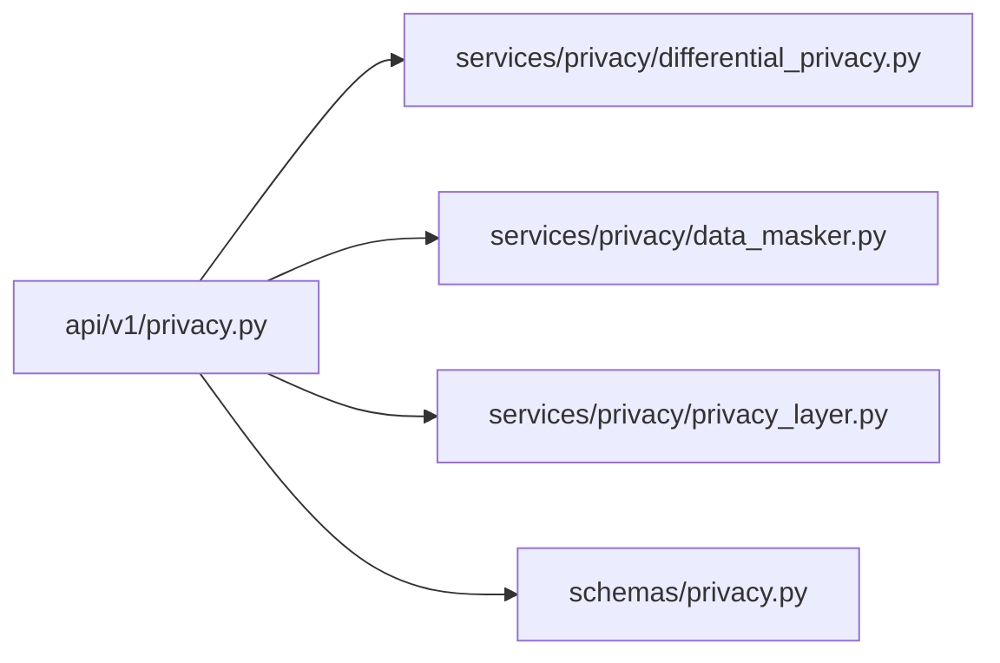

# 差分隐私算法

<cite>
**本文引用的文件**   
- [differential_privacy.py](file://backend/app/services/privacy/differential_privacy.py)
- [data_masker.py](file://backend/app/services/privacy/data_masker.py)
- [privacy_layer.py](file://backend/app/services/privacy/privacy_layer.py)
- [privacy.py](file://backend/app/api/v1/privacy.py)
- [privacy.py](file://backend/app/schemas/privacy.py)
- [test_differential_privacy.py](file://tests/test_differential_privacy.py)
- [test_privacy_layer.py](file://tests/test_privacy_layer.py)
</cite>

## 目录
1. [简介](#简介)
2. [项目结构](#项目结构)
3. [核心组件](#核心组件)
4. [架构总览](#架构总览)
5. [详细组件分析](#详细组件分析)
6. [依赖关系分析](#依赖关系分析)
7. [性能与精度权衡](#性能与精度权衡)
8. [故障排查指南](#故障排查指南)
9. [结论](#结论)
10. [附录：使用示例与参数调优](#附录使用示例与参数调优)

## 简介
本文件面向AI药物设计系统中的“差分隐私”能力，系统性阐述Laplace机制、高斯机制与随机响应机制的数学原理、实现细节与工程实践。重点覆盖：
- 噪声添加策略与敏感度计算
- 隐私预算管理机制（PrivacyBudget）
- ε 与 δ 参数配置与消耗追踪
- 布尔值数据的随机响应机制
- 隐私预算耗尽的处理与错误恢复策略
- 在敏感医疗数据保护中的具体用法与参数调优建议

## 项目结构
与差分隐私相关的代码主要位于后端服务层与API层：
- 服务层
  - services/privacy/differential_privacy.py：差分隐私机制与预算追踪
  - services/privacy/data_masker.py：脱敏与k-匿名性评估（辅助隐私保护）
  - services/privacy/privacy_layer.py：隐私计算域（模拟PySyft）与审批流程
- API层
  - api/v1/privacy.py：隐私相关REST端点（含预算检查与脱敏接口）
  - schemas/privacy.py：请求/响应模型定义

图表来源
- [privacy.py:1-177](file://backend/app/api/v1/privacy.py#L1-L177)
- [differential_privacy.py:1-151](file://backend/app/services/privacy/differential_privacy.py#L1-L151)
- [data_masker.py:1-294](file://backend/app/services/privacy/data_masker.py#L1-L294)
- [privacy_layer.py:1-199](file://backend/app/services/privacy/privacy_layer.py#L1-L199)
- [privacy.py:1-84](file://backend/app/schemas/privacy.py#L1-L84)

章节来源
- [privacy.py:1-177](file://backend/app/api/v1/privacy.py#L1-L177)
- [differential_privacy.py:1-151](file://backend/app/services/privacy/differential_privacy.py#L1-L151)
- [data_masker.py:1-294](file://backend/app/services/privacy/data_masker.py#L1-L294)
- [privacy_layer.py:1-199](file://backend/app/services/privacy/privacy_layer.py#L1-L199)
- [privacy.py:1-84](file://backend/app/schemas/privacy.py#L1-L84)

## 核心组件
- PrivacyBudget：负责ε预算的总量、已消耗量、δ参数与历史记录的维护；提供是否可消费与消费方法。
- DifferentialPrivacy：封装Laplace机制、高斯机制与随机响应机制，并在每次查询前进行预算校验与记录。
- DataMasker：对直接标识符、准标识符与敏感字段进行脱敏处理，并评估k-匿名性。
- PrivacyLayer：模拟多安全计算域（如PySyft），支持创建域、注册数据集、提交计算请求与审批执行。
- API层：对外暴露隐私域管理、数据集注册、远程计算与数据脱敏等接口，并在计算前进行ε预算检查。

章节来源
- [differential_privacy.py:15-151](file://backend/app/services/privacy/differential_privacy.py#L15-L151)
- [data_masker.py:126-294](file://backend/app/services/privacy/data_masker.py#L126-L294)
- [privacy_layer.py:43-199](file://backend/app/services/privacy/privacy_layer.py#L43-L199)
- [privacy.py:47-177](file://backend/app/api/v1/privacy.py#L47-L177)
- [privacy.py:14-84](file://backend/app/schemas/privacy.py#L14-L84)

## 架构总览
下图展示了从API到隐私服务的调用链路与预算控制点。

图表来源
- [privacy.py:94-177](file://backend/app/api/v1/privacy.py#L94-L177)
- [differential_privacy.py:51-151](file://backend/app/services/privacy/differential_privacy.py#L51-L151)
- [data_masker.py:144-294](file://backend/app/services/privacy/data_masker.py#L144-L294)
- [privacy_layer.py:54-199](file://backend/app/services/privacy/privacy_layer.py#L54-L199)

## 详细组件分析

### PrivacyBudget：预算管理机制
- 职责
  - 维护total_epsilon、spent_epsilon、delta与history
  - can_spend(epsilon)：判断剩余预算是否足够
  - spend(epsilon, query)：累计消耗并记录历史（含时间戳与查询描述）
  - remaining：只读属性，返回max(0, total-spent)
- 复杂度
  - 操作均为O(1)，history追加为O(1)
- 关键行为
  - 当can_spend为False时，上层应拒绝执行或抛出异常
  - history可用于审计与可视化展示

图表来源
- [differential_privacy.py:15-49](file://backend/app/services/privacy/differential_privacy.py#L15-L49)

章节来源
- [differential_privacy.py:15-49](file://backend/app/services/privacy/differential_privacy.py#L15-L49)

### Laplace机制：数学原理与实现要点
- 数学原理
  - 给定查询f的敏感度Δf（全局敏感度定义为相邻数据集上f输出差的L1范数上界）
  - 噪声b来自拉普拉斯分布Lap(0, b)，其中尺度参数b = Δf / ε
  - 输出y = f(x) + b满足(ε, 0)-差分隐私
- 实现要点
  - 通过预算检查后计算scale = sensitivity / epsilon
  - 采样噪声：采用标准拉普拉斯采样实现（等价于双指数分布）
  - 将噪声加到真实值上，并记录预算消耗
- 复杂度
  - 单次查询O(1)
- 适用场景
  - 计数、均值、总和等标量统计，且需严格(ε,0)-DP保证

图表来源
- [differential_privacy.py:63-90](file://backend/app/services/privacy/differential_privacy.py#L63-L90)

章节来源
- [differential_privacy.py:63-90](file://backend/app/services/privacy/differential_privacy.py#L63-L90)

### 高斯机制：数学原理与实现要点
- 数学原理
  - 在高斯机制中，噪声b来自正态分布N(0, σ^2)
  - 方差σ由敏感度Δf、ε与δ共同决定：σ = Δf * sqrt(2 ln(1.25/δ)) / ε
  - 输出y = f(x) + b满足(ε, δ)-差分隐私
- 实现要点
  - 若未显式传入delta，则使用PrivacyBudget.delta
  - 计算sigma后采样高斯噪声并累加
  - 同样需要预算检查与记录
- 复杂度
  - 单次查询O(1)
- 适用场景
  - 多维向量或连续值聚合，允许微小失败概率δ以换取更高精度

图表来源
- [differential_privacy.py:92-116](file://backend/app/services/privacy/differential_privacy.py#L92-L116)

章节来源
- [differential_privacy.py:92-116](file://backend/app/services/privacy/differential_privacy.py#L92-L116)

### 随机响应机制：布尔值数据处理
- 数学原理
  - 对布尔值x∈{0,1}，以概率p回答真实值，以概率1-p回答翻转值
  - p = e^ε / (1 + e^ε)，满足(ε,0)-DP
- 实现要点
  - 预算检查通过后按p采样
  - 返回布尔值，并记录预算消耗
- 复杂度
  - O(1)
- 适用场景
  - 用户敏感偏好、是否参与某项治疗等二元属性的调查

图表来源
- [differential_privacy.py:118-140](file://backend/app/services/privacy/differential_privacy.py#L118-L140)

章节来源
- [differential_privacy.py:118-140](file://backend/app/services/privacy/differential_privacy.py#L118-L140)

### 数据脱敏与k-匿名性（辅助隐私保护）
- 直接标识符：哈希脱敏（带盐值）
- 准标识符：泛化（年龄分段、邮编截断、日期截断）
- 敏感值：抑制为占位符
- k-匿名性评估：基于准标识符组合分组，最小组大小≥k即满足
- 用途：在发布或共享数据前降低重识别风险，常与差分隐私配合使用

图表来源
- [data_masker.py:156-294](file://backend/app/services/privacy/data_masker.py#L156-L294)

章节来源
- [data_masker.py:126-294](file://backend/app/services/privacy/data_masker.py#L126-L294)

### 隐私计算层（模拟多安全计算域）
- 功能
  - 创建隐私域、注册数据集、提交计算请求、审批并执行
- 作用
  - 在数据不出域的前提下，由所有者授权执行计算，结合差分隐私保障输出隐私
- 与差分隐私的关系
  - 可在域内执行计算时调用DifferentialPrivacy对中间或最终结果施加噪声

图表来源
- [privacy_layer.py:20-199](file://backend/app/services/privacy/privacy_layer.py#L20-L199)

章节来源
- [privacy_layer.py:43-199](file://backend/app/services/privacy/privacy_layer.py#L43-L199)

## 依赖关系分析
- 模块耦合
  - API层依赖服务层（差分隐私、脱敏、隐私层）
  - 差分隐私内部仅依赖Python标准库（math、random、datetime等）
  - 脱敏服务独立运行，不依赖差分隐私
- 外部依赖
  - PySyft：当前以内存模拟形式集成，后续可替换为真实域执行
- 潜在循环依赖
  - 当前无循环依赖迹象

图表来源
- [privacy.py:1-177](file://backend/app/api/v1/privacy.py#L1-L177)
- [differential_privacy.py:1-151](file://backend/app/services/privacy/differential_privacy.py#L1-L151)
- [data_masker.py:1-294](file://backend/app/services/privacy/data_masker.py#L1-L294)
- [privacy_layer.py:1-199](file://backend/app/services/privacy/privacy_layer.py#L1-L199)
- [privacy.py:1-84](file://backend/app/schemas/privacy.py#L1-L84)

章节来源
- [privacy.py:1-177](file://backend/app/api/v1/privacy.py#L1-L177)
- [differential_privacy.py:1-151](file://backend/app/services/privacy/differential_privacy.py#L1-L151)
- [data_masker.py:1-294](file://backend/app/services/privacy/data_masker.py#L1-L294)
- [privacy_layer.py:1-199](file://backend/app/services/privacy/privacy_layer.py#L1-L199)
- [privacy.py:1-84](file://backend/app/schemas/privacy.py#L1-L84)

## 性能与精度权衡
- 噪声规模与敏感度
  - Laplace尺度b=Δf/ε；高斯σ∝Δf/ε
  - 敏感度Δf越小，噪声越小，精度越高；因此合理设计查询函数至关重要
- ε与δ的选择
  - ε越小，隐私越强但噪声越大；δ越小，高斯噪声越大
  - 通常根据业务容忍度与合规要求设定全局预算上限
- 多次查询的预算分配
  - 可采用均匀分配、自适应分配或基于查询重要性的动态分配
- 批处理与聚合
  - 先聚合再加噪可减少噪声次数，提高整体精度
- 随机响应
  - ε较大时更接近真实值；ε较小时噪声更大，适合高度敏感的二元属性

[本节为通用指导，无需特定文件引用]

## 故障排查指南
- 常见错误
  - 隐私预算不足：当can_spend为False时，差分隐私机制会抛出运行时异常；API层也会在执行远程计算前检查预算并返回验证错误
  - 参数非法：ε必须为正数；delta应为正小数
- 定位步骤
  - 查看预算汇总信息（total/spent/remaining/query_count）
  - 检查历史日志（query、timestamp、epsilon）
  - 确认敏感度设置是否合理（过大导致噪声过大，过小可能违反DP定义）
- 恢复策略
  - 调整ε分配策略，避免单次查询占用过多预算
  - 合并查询以减少调用次数
  - 适当放宽δ（在高斯机制下）以降低噪声，但需评估隐私影响

章节来源
- [differential_privacy.py:79-116](file://backend/app/services/privacy/differential_privacy.py#L79-L116)
- [privacy.py:105-117](file://backend/app/api/v1/privacy.py#L105-L117)

## 结论
本系统实现了完整的差分隐私基础能力：Laplace与高斯机制、随机响应机制以及严格的预算管理与审计。结合数据脱敏与隐私计算域，形成“去标识化—差分隐私—域内计算”的多层防护体系。建议在真实部署中：
- 明确敏感度计算方法与边界
- 制定全局预算与分配策略
- 建立预算监控与告警机制
- 在合规框架下选择合适ε/δ组合

[本节为总结性内容，无需特定文件引用]

## 附录：使用示例与参数调优

### 使用示例（路径指引）
- 初始化差分隐私实例并调用Laplace机制
  - 参考：[differential_privacy.py:51-90](file://backend/app/services/privacy/differential_privacy.py#L51-L90)
- 使用高斯机制进行连续值加噪
  - 参考：[differential_privacy.py:92-116](file://backend/app/services/privacy/differential_privacy.py#L92-L116)
- 对布尔值使用随机响应机制
  - 参考：[differential_privacy.py:118-140](file://backend/app/services/privacy/differential_privacy.py#L118-L140)
- 批量数据脱敏与k-匿名评估
  - 参考：[data_masker.py:156-294](file://backend/app/services/privacy/data_masker.py#L156-L294)
- 通过API提交远程计算并检查预算
  - 参考：[privacy.py:94-132](file://backend/app/api/v1/privacy.py#L94-L132)

### 参数调优建议
- 敏感度Δf
  - 对计数类查询，Δf通常为1；对均值类查询，Δf与数据范围有关，需保守估计
- ε与δ
  - 全局预算建议分阶段分配（探索期小ε，验证期逐步增加）
  - 高斯机制下，δ可设为1e-5至1e-6级别，视合规要求而定
- 随机响应
  - ε≥5时近似保真；ε≤1时噪声显著，适合极高敏感属性
- 预算耗尽处理
  - 在应用层捕获异常，提示用户减少查询频率或申请额外预算
  - 对关键查询预留预算，非关键查询降级或延迟

章节来源
- [differential_privacy.py:51-151](file://backend/app/services/privacy/differential_privacy.py#L51-L151)
- [data_masker.py:156-294](file://backend/app/services/privacy/data_masker.py#L156-L294)
- [privacy.py:94-132](file://backend/app/api/v1/privacy.py#L94-L132)