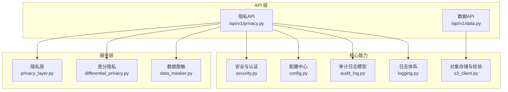
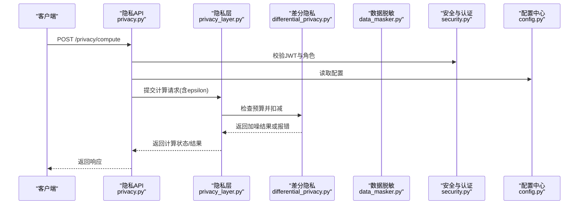
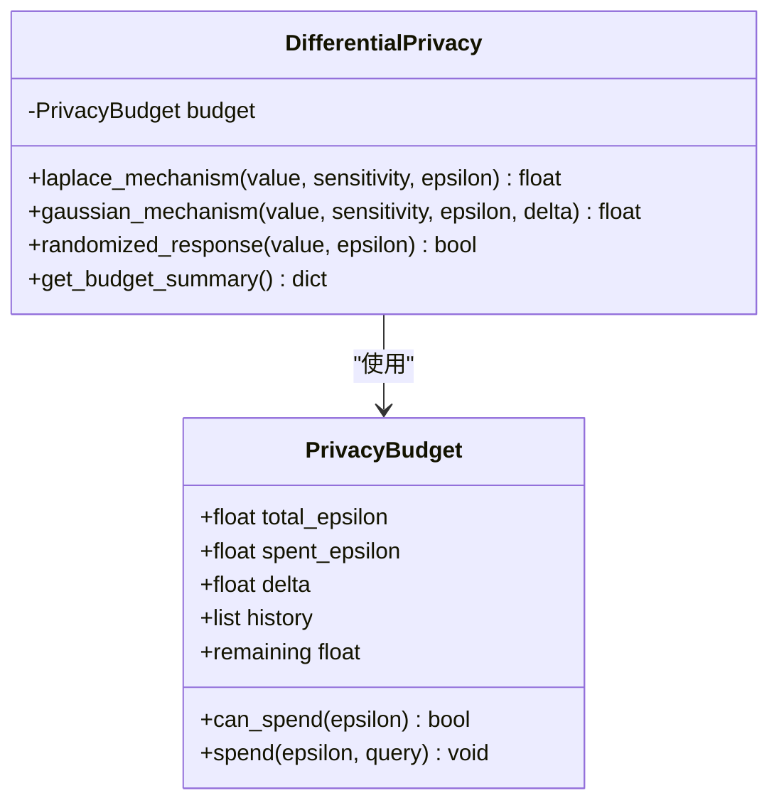
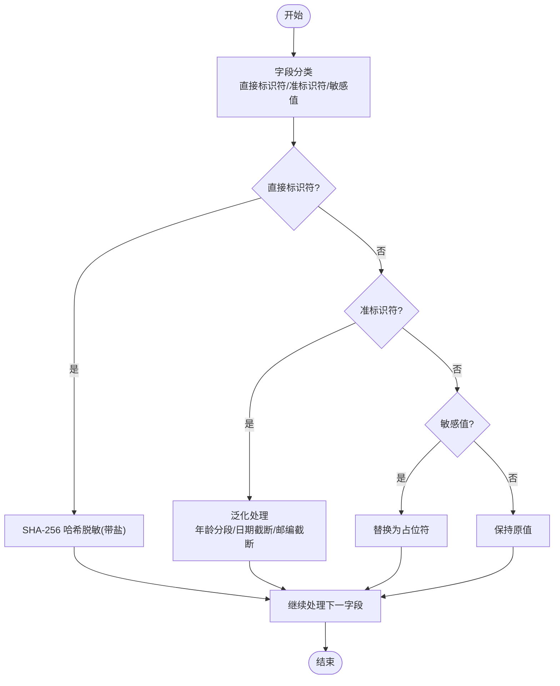
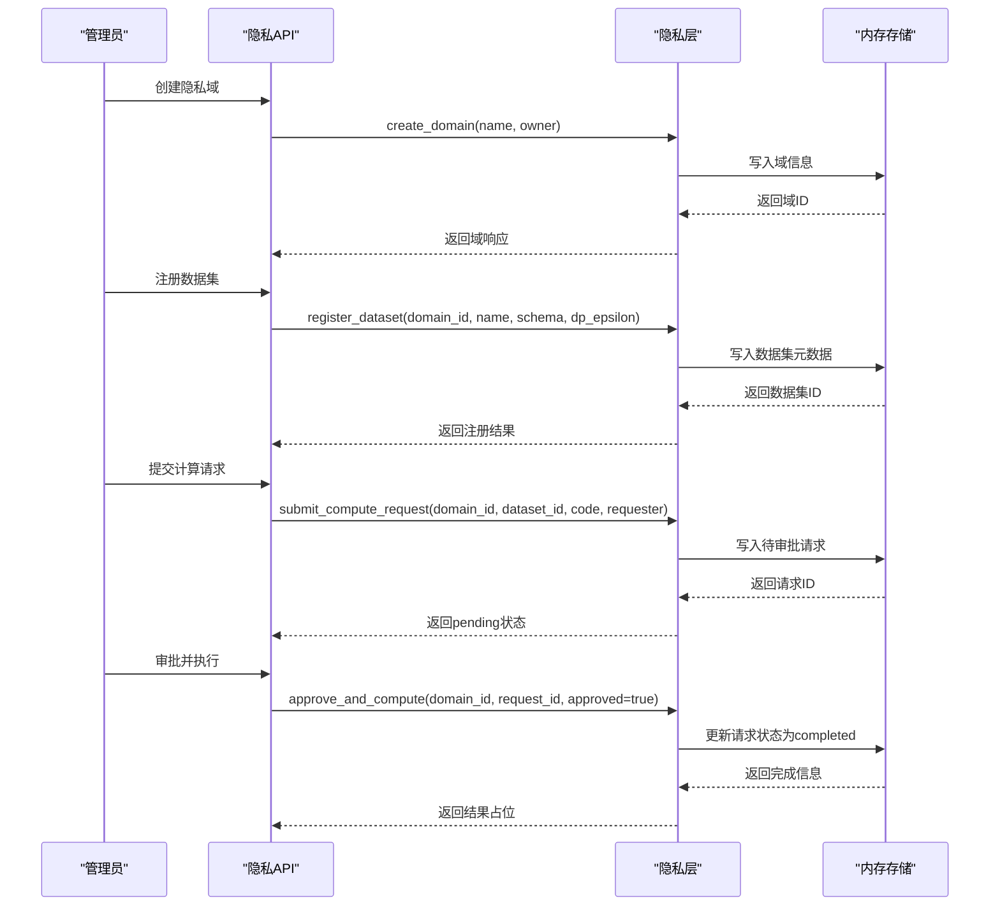
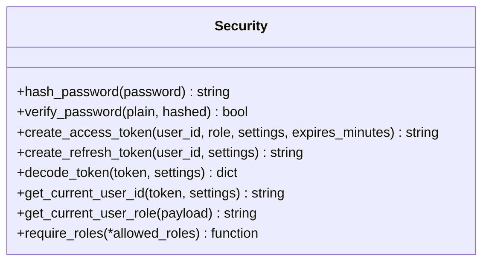
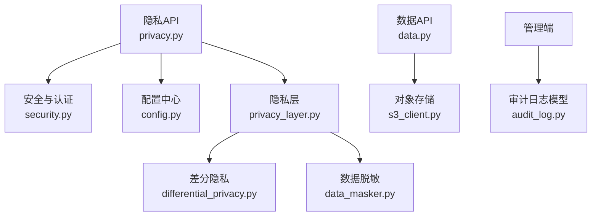

# 数据保护与安全传输

<cite>
**本文引用的文件**   
- [differential_privacy.py](file://backend/app/services/privacy/differential_privacy.py)
- [data_masker.py](file://backend/app/services/privacy/data_masker.py)
- [privacy_layer.py](file://backend/app/services/privacy/privacy_layer.py)
- [security.py](file://backend/app/core/security.py)
- [privacy.py](file://backend/app/api/v1/privacy.py)
- [config.py](file://backend/app/core/config.py)
- [audit_log.py](file://backend/app/models/audit_log.py)
- [privacy.py（schemas）](file://backend/app/schemas/privacy.py)
- [s3_client.py](file://backend/app/utils/s3_client.py)
- [data.py](file://backend/app/api/v1/data.py)
- [logging.py](file://backend/app/core/logging.py)
</cite>

## 目录
1. [简介](#简介)
2. [项目结构](#项目结构)
3. [核心组件](#核心组件)
4. [架构总览](#架构总览)
5. [详细组件分析](#详细组件分析)
6. [依赖关系分析](#依赖关系分析)
7. [性能与精度权衡](#性能与精度权衡)
8. [故障排查指南](#故障排查指南)
9. [结论](#结论)
10. [附录](#附录)

## 简介
本文件面向AI药物设计系统的数据保护与安全传输，围绕以下目标展开：
- 差分隐私算法实现原理与参数配置：噪声添加策略、隐私预算分配与精度平衡。
- 数据脱敏技术：敏感信息识别、掩码算法与数据替换策略。
- 隐私层架构：数据访问拦截、查询审批与结果返回流程。
- 数据传输加密方案：认证与令牌机制、密钥管理要点与轮换建议。
- 数据完整性验证、防篡改机制与备份加密思路。
- 数据分类分级策略、访问审计日志与合规性检查机制。

## 项目结构
与数据保护和安全传输相关的核心代码位于后端服务模块中，主要包含：
- 隐私计算与差分隐私：services/privacy 下的差分隐私、数据脱敏与隐私层。
- API 暴露：api/v1/privacy.py 提供隐私域、数据集注册、远程计算与脱敏接口。
- 安全与认证：core/security.py 提供密码哈希、JWT 生成与解析、角色守卫。
- 配置中心：core/config.py 集中管理环境变量与默认值。
- 审计日志：models/audit_log.py 定义不可变审计记录模型。
- 对象存储与完整性：utils/s3_client.py 提供统一存储抽象与校验和计算。
- 数据上传与校验：api/v1/data.py 在上传时计算并持久化校验和。
- 日志体系：core/logging.py 提供结构化日志输出与轮转策略。

图表来源
- [privacy.py:1-177](file://backend/app/api/v1/privacy.py#L1-L177)
- [privacy_layer.py:1-199](file://backend/app/services/privacy/privacy_layer.py#L1-L199)
- [differential_privacy.py:1-151](file://backend/app/services/privacy/differential_privacy.py#L1-L151)
- [data_masker.py:1-294](file://backend/app/services/privacy/data_masker.py#L1-L294)
- [security.py:1-211](file://backend/app/core/security.py#L1-L211)
- [config.py:1-144](file://backend/app/core/config.py#L1-L144)
- [audit_log.py:1-45](file://backend/app/models/audit_log.py#L1-L45)
- [s3_client.py:1-79](file://backend/app/utils/s3_client.py#L1-L79)
- [data.py:1-369](file://backend/app/api/v1/data.py#L1-L369)
- [logging.py:1-93](file://backend/app/core/logging.py#L1-L93)

章节来源
- [privacy.py:1-177](file://backend/app/api/v1/privacy.py#L1-L177)
- [privacy_layer.py:1-199](file://backend/app/services/privacy/privacy_layer.py#L1-L199)
- [differential_privacy.py:1-151](file://backend/app/services/privacy/differential_privacy.py#L1-L151)
- [data_masker.py:1-294](file://backend/app/services/privacy/data_masker.py#L1-L294)
- [security.py:1-211](file://backend/app/core/security.py#L1-L211)
- [config.py:1-144](file://backend/app/core/config.py#L1-L144)
- [audit_log.py:1-45](file://backend/app/models/audit_log.py#L1-L45)
- [s3_client.py:1-79](file://backend/app/utils/s3_client.py#L1-L79)
- [data.py:1-369](file://backend/app/api/v1/data.py#L1-L369)
- [logging.py:1-93](file://backend/app/core/logging.py#L1-L93)

## 核心组件
- 差分隐私引擎：提供 Laplace 与高斯机制、随机响应机制，内置隐私预算追踪与消耗记录。
- 数据脱敏器：支持直接标识符哈希、准标识符泛化、敏感字段抑制，并提供 k-匿名评估报告。
- 隐私计算层：模拟 PySyft 域行为，支持创建域、注册数据集、提交计算请求与审批执行。
- 安全与认证：bcrypt 密码哈希、JWT access/refresh token 生成与解析、基于角色的访问控制。
- 配置中心：集中读取环境变量，提供 JWT、CORS、PySyft 等关键配置项。
- 审计日志模型：不可变审计记录，便于事后追溯与合规审查。
- 对象存储客户端：统一存储抽象，提供本地回退与校验和计算。
- 数据上传与完整性：上传时计算 SHA256 校验和并持久化，用于完整性验证。
- 日志体系：结构化日志输出、按大小/时间轮转、错误独立归档。

章节来源
- [differential_privacy.py:1-151](file://backend/app/services/privacy/differential_privacy.py#L1-L151)
- [data_masker.py:1-294](file://backend/app/services/privacy/data_masker.py#L1-L294)
- [privacy_layer.py:1-199](file://backend/app/services/privacy/privacy_layer.py#L1-L199)
- [security.py:1-211](file://backend/app/core/security.py#L1-L211)
- [config.py:1-144](file://backend/app/core/config.py#L1-L144)
- [audit_log.py:1-45](file://backend/app/models/audit_log.py#L1-L45)
- [s3_client.py:1-79](file://backend/app/utils/s3_client.py#L1-L79)
- [data.py:1-369](file://backend/app/api/v1/data.py#L1-L369)
- [logging.py:1-93](file://backend/app/core/logging.py#L1-L93)

## 架构总览
隐私计算与数据脱敏通过 API 层暴露，内部由隐私层协调差分隐私与脱敏逻辑；安全与认证贯穿所有受保护端点；配置中心提供全局参数；审计日志与日志体系保障可观测性与合规性；对象存储与数据上传提供完整性校验基础。

图表来源
- [privacy.py:94-132](file://backend/app/api/v1/privacy.py#L94-L132)
- [privacy_layer.py:124-198](file://backend/app/services/privacy/privacy_layer.py#L124-L198)
- [differential_privacy.py:51-151](file://backend/app/services/privacy/differential_privacy.py#L51-L151)
- [security.py:155-211](file://backend/app/core/security.py#L155-L211)
- [config.py:78-94](file://backend/app/core/config.py#L78-L94)

## 详细组件分析

### 差分隐私组件
- 隐私预算追踪：维护总预算、已消耗预算、delta 与历史明细，提供剩余预算查询与消费记录。
- Laplace 机制：根据敏感度与 epsilon 计算尺度，生成拉普拉斯噪声并扣减预算。
- 高斯机制：依据 delta 与 epsilon 计算 sigma，生成高斯噪声并扣减预算。
- 随机响应：针对布尔值的加噪策略，按概率翻转结果并扣减预算。
- 预算不足处理：当请求 epsilon 超过剩余预算时抛出异常，阻止继续泄露。

图表来源
- [differential_privacy.py:15-151](file://backend/app/services/privacy/differential_privacy.py#L15-L151)

章节来源
- [differential_privacy.py:15-151](file://backend/app/services/privacy/differential_privacy.py#L15-L151)

### 数据脱敏组件
- 敏感信息识别：
  - 直接标识符集合：姓名、身份证号、社保号、医疗记录号、电话、邮箱、地址、IP、设备ID等。
  - 准标识符集合：年龄、出生日期、邮编、种族、性别等。
  - 敏感值集合：诊断、ICD编码、疾病、用药剂量、实验室结果、基因结果、HIV状态、心理健康等。
- 掩码算法：
  - 直接标识符：带盐的 SHA-256 哈希脱敏。
  - 准标识符：泛化处理（年龄分段、日期截断到月、邮编前N位保留）。
  - 敏感值：替换为占位符（如 [REDACTED]）。
- k-匿名评估：按准标识符组合分组统计最小组大小，判断是否满足阈值 k。
- 报告输出：汇总处理记录数、字段数、各类处理计数、k-匿名满足情况与违规项。

图表来源
- [data_masker.py:22-98](file://backend/app/services/privacy/data_masker.py#L22-L98)
- [data_masker.py:174-212](file://backend/app/services/privacy/data_masker.py#L174-L212)
- [data_masker.py:257-289](file://backend/app/services/privacy/data_masker.py#L257-L289)

章节来源
- [data_masker.py:1-294](file://backend/app/services/privacy/data_masker.py#L1-L294)

### 隐私层组件
- 隐私域管理：创建域、列出域、获取域详情。
- 数据集注册：将数据集元数据与 schema 注册到域，支持关联差分隐私预算。
- 计算请求：提交代码与 epsilon 预算，进入待审批队列。
- 审批与执行：所有者审批后执行计算（当前为简化实现），返回完成状态与结果占位。

图表来源
- [privacy_layer.py:54-198](file://backend/app/services/privacy/privacy_layer.py#L54-L198)
- [privacy.py:47-132](file://backend/app/api/v1/privacy.py#L47-L132)

章节来源
- [privacy_layer.py:1-199](file://backend/app/services/privacy/privacy_layer.py#L1-L199)
- [privacy.py:1-177](file://backend/app/api/v1/privacy.py#L1-L177)

### 安全与认证组件
- 密码哈希：bcrypt 生成盐并哈希，校验使用恒定时间比较。
- JWT 令牌：access token（短期）与 refresh token（长期）生成与解码，携带用户ID与角色声明。
- 依赖注入：从请求头提取 bearer token，校验类型与过期，返回当前用户ID与角色。
- 角色守卫：工厂函数 require_roles 限制特定角色访问。

图表来源
- [security.py:32-211](file://backend/app/core/security.py#L32-L211)

章节来源
- [security.py:1-211](file://backend/app/core/security.py#L1-L211)

### 配置中心
- 环境变量加载：pydantic-settings 自动校验与默认值填充。
- 关键配置项：JWT 密钥与算法、令牌过期时间、CORS 源列表、PySyft 域名与端口等。
- 环境属性：is_production 判断生产环境，影响日志输出格式。

章节来源
- [config.py:1-144](file://backend/app/core/config.py#L1-L144)

### 审计日志模型
- 不可变记录：应用层不提供 UPDATE/DELETE 接口，数据库层通过权限保护。
- 字段设计：用户ID、动作、资源类型与ID、前后值快照、IP地址、User-Agent、时间戳。
- 索引优化：按动作与时间建立复合索引，便于范围扫描。

章节来源
- [audit_log.py:1-45](file://backend/app/models/audit_log.py#L1-L45)

### 对象存储与完整性
- 统一抽象：StorageClient 提供 upload/download/delete/presigned_url 方法，开发模式回退到文件系统。
- 校验和计算：compute_checksum 返回 sha256 前缀的校验字符串，用于完整性验证。
- 上传完整性：数据上传端点在保存前计算 SHA256 并持久化至数据库，便于后续比对。

章节来源
- [s3_client.py:1-79](file://backend/app/utils/s3_client.py#L1-L79)
- [data.py:78-121](file://backend/app/api/v1/data.py#L78-L121)

### 日志体系
- 结构化输出：生产环境 JSON 序列化，开发环境彩色控制台。
- 轮转与归档：按大小/时间轮转，错误日志独立归档，压缩与保留策略。
- 上下文绑定：支持绑定 request_id、user_id 等上下文信息。

章节来源
- [logging.py:1-93](file://backend/app/core/logging.py#L1-L93)

## 依赖关系分析
- API 层依赖安全与认证、配置中心、隐私层与脱敏器。
- 隐私层依赖差分隐私与脱敏器进行数据处理。
- 数据上传依赖对象存储客户端进行文件持久化与校验。
- 审计日志模型为独立数据实体，供管理端查询。

图表来源
- [privacy.py:1-177](file://backend/app/api/v1/privacy.py#L1-L177)
- [privacy_layer.py:1-199](file://backend/app/services/privacy/privacy_layer.py#L1-L199)
- [differential_privacy.py:1-151](file://backend/app/services/privacy/differential_privacy.py#L1-L151)
- [data_masker.py:1-294](file://backend/app/services/privacy/data_masker.py#L1-L294)
- [security.py:1-211](file://backend/app/core/security.py#L1-L211)
- [config.py:1-144](file://backend/app/core/config.py#L1-L144)
- [audit_log.py:1-45](file://backend/app/models/audit_log.py#L1-L45)
- [s3_client.py:1-79](file://backend/app/utils/s3_client.py#L1-L79)
- [data.py:1-369](file://backend/app/api/v1/data.py#L1-L369)

章节来源
- [privacy.py:1-177](file://backend/app/api/v1/privacy.py#L1-L177)
- [privacy_layer.py:1-199](file://backend/app/services/privacy/privacy_layer.py#L1-L199)
- [differential_privacy.py:1-151](file://backend/app/services/privacy/differential_privacy.py#L1-L151)
- [data_masker.py:1-294](file://backend/app/services/privacy/data_masker.py#L1-L294)
- [security.py:1-211](file://backend/app/core/security.py#L1-L211)
- [config.py:1-144](file://backend/app/core/config.py#L1-L144)
- [audit_log.py:1-45](file://backend/app/models/audit_log.py#L1-L45)
- [s3_client.py:1-79](file://backend/app/utils/s3_client.py#L1-L79)
- [data.py:1-369](file://backend/app/api/v1/data.py#L1-L369)

## 性能与精度权衡
- 差分隐私预算分配：
  - 合理设置总 epsilon 与 delta，避免单次查询消耗过大导致整体预算快速耗尽。
  - 对高频查询采用较小 epsilon，低频高精度查询可采用较大 epsilon。
- 噪声添加策略：
  - Laplace 机制适用于数值型查询，敏感度越高噪声越大，需结合业务容忍度调整。
  - 高斯机制引入 delta，适合需要更平滑噪声的场景，但需关注 delta 选择对隐私的影响。
- 数据脱敏效率：
  - 批量脱敏时优先进行字段分类与规则匹配，减少重复判断开销。
  - k-匿名评估可在批处理后一次性进行，避免逐条评估带来的性能损耗。
- 对象存储与完整性：
  - 大文件上传时流式计算校验和，避免全量加载到内存。
  - 生产环境切换至 MinIO/S3 时，利用服务端分片与并发提升吞吐。

[本节为通用指导，不直接分析具体文件]

## 故障排查指南
- 隐私预算不足：
  - 现象：提交计算请求时报错“隐私预算不足”。
  - 排查：检查域预算与已用预算，确认本次请求 epsilon 是否超出剩余预算。
  - 参考路径：[privacy.py:105-117](file://backend/app/api/v1/privacy.py#L105-L117)
- 脱敏未满足 k-匿名：
  - 现象：脱敏报告提示最小组大小小于 k。
  - 排查：检查准标识符分布，适当放宽泛化粒度或增加样本量。
  - 参考路径：[data_masker.py:257-289](file://backend/app/services/privacy/data_masker.py#L257-L289)
- JWT 解析失败：
  - 现象：请求被拒绝，提示无效或过期 token。
  - 排查：确认客户端传递的 Authorization header 是否正确，检查服务器 JWT 密钥与算法配置。
  - 参考路径：[security.py:125-149](file://backend/app/core/security.py#L125-L149)
- 对象存储未实现：
  - 现象：S3 模式调用抛出“待实现”异常。
  - 排查：确认 use_s3 配置与后端实现是否就绪，开发阶段可使用本地回退。
  - 参考路径：[s3_client.py:35-37](file://backend/app/utils/s3_client.py#L35-L37)

章节来源
- [privacy.py:105-117](file://backend/app/api/v1/privacy.py#L105-L117)
- [data_masker.py:257-289](file://backend/app/services/privacy/data_masker.py#L257-L289)
- [security.py:125-149](file://backend/app/core/security.py#L125-L149)
- [s3_client.py:35-37](file://backend/app/utils/s3_client.py#L35-L37)

## 结论
本系统通过差分隐私、数据脱敏与隐私层协同，构建了较为完善的数据保护体系。安全与认证、配置中心、审计日志与对象存储共同支撑了端到端的安全与合规能力。建议在后续迭代中完善生产环境的对象存储实现、强化 TLS 证书管理与密钥轮换策略，并扩展数据分类分级与自动化合规检查机制。

[本节为总结性内容，不直接分析具体文件]

## 附录

### 隐私预算与参数配置清单
- 总预算 epsilon：建议根据业务风险与数据敏感性设定，避免过高导致隐私泄露风险。
- Delta 参数：在高斯机制中使用，通常设置为较小值以增强隐私保证。
- 敏感度：不同查询的敏感度差异较大，需结合业务场景评估。
- 脱敏配置：
  - 盐值：防止彩虹表攻击，建议定期更换。
  - 年龄分段边界：根据人群分布调整，避免过细导致重识别风险。
  - 邮编前缀长度：保留位数越多，隐私风险越高。
  - 日期粒度：year/month/day 三档，按需求选择。
  - k-匿名阈值：建议至少 5，视数据规模与分布调整。

章节来源
- [differential_privacy.py:51-151](file://backend/app/services/privacy/differential_privacy.py#L51-L151)
- [data_masker.py:80-98](file://backend/app/services/privacy/data_masker.py#L80-L98)

### 数据分类分级策略建议
- 直接标识符：严格脱敏或禁止外发。
- 准标识符：泛化处理，确保 k-匿名满足。
- 敏感值：抑制或泛化，避免直接暴露。
- 非敏感数据：可按需开放，但仍需审计与限流。

[本节为通用指导，不直接分析具体文件]

### 访问审计与合规检查机制
- 审计日志：记录关键操作的前后值、用户与来源信息，便于追溯。
- 合规检查：在数据导出与共享前进行脱敏与 k-匿名评估，未达标则拒绝。
- 日志留存：按策略归档与压缩，确保可审计性与可恢复性。

章节来源
- [audit_log.py:1-45](file://backend/app/models/audit_log.py#L1-L45)
- [logging.py:1-93](file://backend/app/core/logging.py#L1-L93)