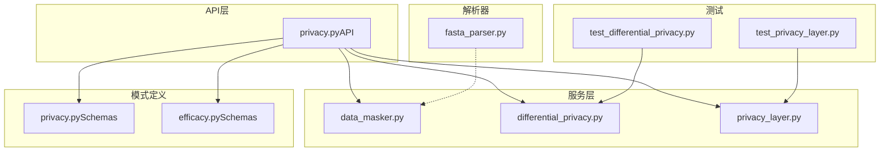
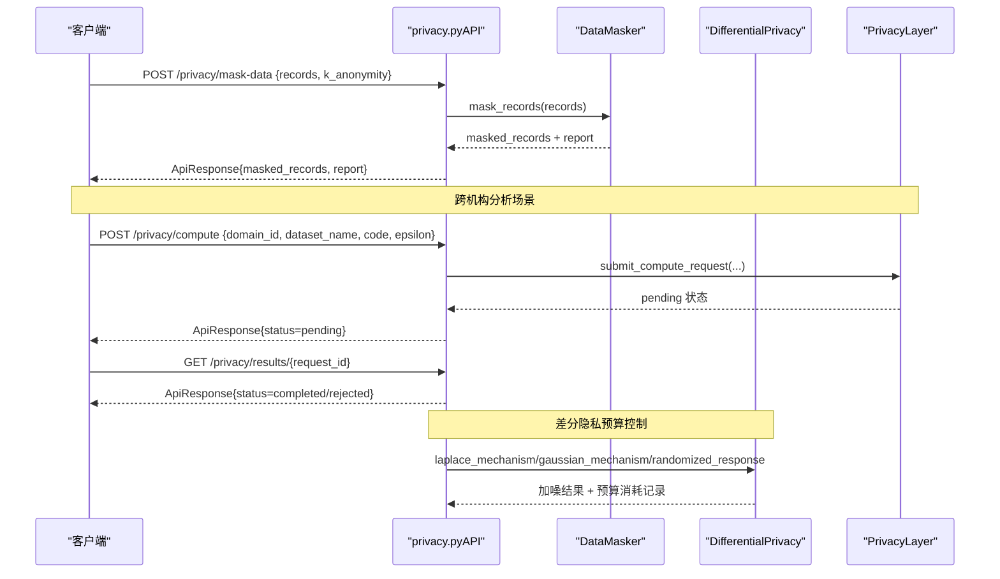
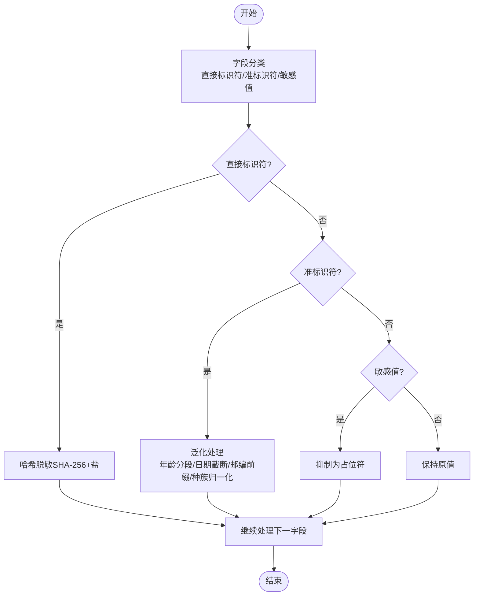
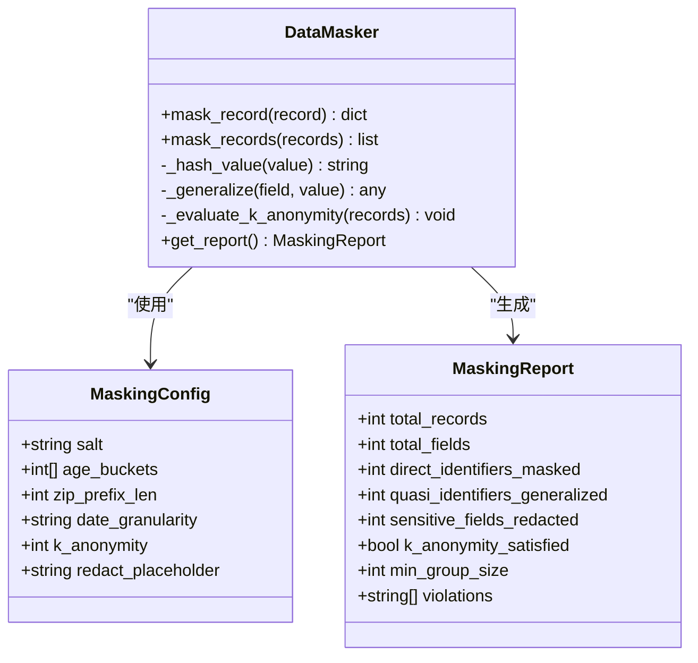
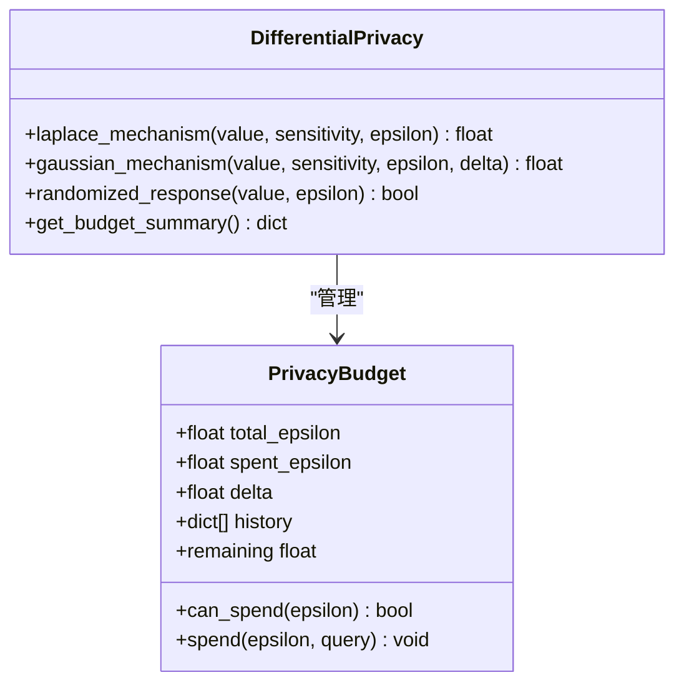
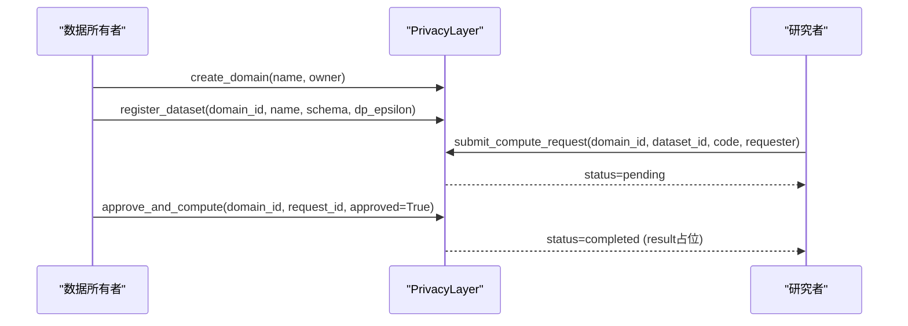
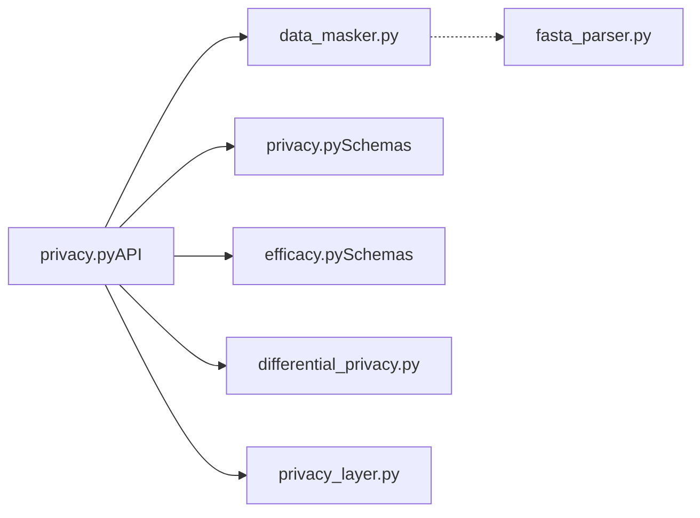

# 数据脱敏技术

<cite>
**本文引用的文件**   
- [data_masker.py](file://backend/app/services/privacy/data_masker.py)
- [differential_privacy.py](file://backend/app/services/privacy/differential_privacy.py)
- [privacy_layer.py](file://backend/app/services/privacy/privacy_layer.py)
- [privacy.py（API）](file://backend/app/api/v1/privacy.py)
- [privacy.py（Schemas）](file://backend/app/schemas/privacy.py)
- [efficacy.py（Schemas）](file://backend/app/schemas/efficacy.py)
- [fasta_parser.py](file://backend/app/services/parser/fasta_parser.py)
- [test_differential_privacy.py](file://tests/test_differential_privacy.py)
- [test_privacy_layer.py](file://tests/test_privacy_layer.py)
</cite>

## 目录
1. [引言](#引言)
2. [项目结构](#项目结构)
3. [核心组件](#核心组件)
4. [架构总览](#架构总览)
5. [详细组件分析](#详细组件分析)
6. [依赖关系分析](#依赖关系分析)
7. [性能与可扩展性](#性能与可扩展性)
8. [故障排查指南](#故障排查指南)
9. [结论](#结论)
10. [附录：配置示例与最佳实践](#附录配置示例与最佳实践)

## 引言
本技术文档面向AI药物设计系统中的“数据脱敏”能力，聚焦以下目标：
- 敏感信息识别：个人身份信息(PII)、医疗记录标识符、基因序列数据的自动检测机制
- 掩码算法：字符替换、哈希加密、泛化处理、数据扰动
- 数据替换策略：真实值保持、合成数据生成、分布保持方法
- 多数据类型脱敏配置：文本、数值、时间戳
- 效果评估指标与质量保证：k-匿名、差分隐私预算、审计与报告
- 合规性检查工具与最佳实践：HIPAA Safe Harbor 18项、可操作建议

## 项目结构
与数据脱敏相关的代码主要位于后端服务的 privacy 子模块与 API 层：
- 服务层
  - data_masker.py：直接标识符、准标识符、敏感值的去标识化；k-匿名验证
  - differential_privacy.py：Laplace/高斯/随机响应等差分隐私机制与预算追踪
  - privacy_layer.py：模拟 PySyft 域的数据不出域计算流程
- API 层
  - api/v1/privacy.py：提供隐私域、数据集注册、远程计算与数据脱敏接口
- Schemas
  - schemas/privacy.py：隐私域/数据集/计算请求的Pydantic模型
  - schemas/efficacy.py：数据脱敏请求/响应模型
- 解析器
  - services/parser/fasta_parser.py：FASTA 序列解析（为基因序列数据处理提供基础）
- 测试
  - tests/test_differential_privacy.py、tests/test_privacy_layer.py：覆盖差分隐私与隐私层行为

图表来源
- [privacy.py（API）:1-177](file://backend/app/api/v1/privacy.py#L1-L177)
- [data_masker.py:1-294](file://backend/app/services/privacy/data_masker.py#L1-L294)
- [differential_privacy.py:1-151](file://backend/app/services/privacy/differential_privacy.py#L1-L151)
- [privacy_layer.py:1-199](file://backend/app/services/privacy/privacy_layer.py#L1-L199)
- [privacy.py（Schemas）:1-84](file://backend/app/schemas/privacy.py#L1-L84)
- [efficacy.py（Schemas）:1-170](file://backend/app/schemas/efficacy.py#L1-L170)
- [fasta_parser.py:1-100](file://backend/app/services/parser/fasta_parser.py#L1-L100)
- [test_differential_privacy.py:1-126](file://tests/test_differential_privacy.py#L1-L126)
- [test_privacy_layer.py:1-145](file://tests/test_privacy_layer.py#L1-L145)

章节来源
- [privacy.py（API）:1-177](file://backend/app/api/v1/privacy.py#L1-L177)
- [data_masker.py:1-294](file://backend/app/services/privacy/data_masker.py#L1-L294)
- [differential_privacy.py:1-151](file://backend/app/services/privacy/differential_privacy.py#L1-L151)
- [privacy_layer.py:1-199](file://backend/app/services/privacy/privacy_layer.py#L1-L199)
- [privacy.py（Schemas）:1-84](file://backend/app/schemas/privacy.py#L1-L84)
- [efficacy.py（Schemas）:1-170](file://backend/app/schemas/efficacy.py#L1-L170)
- [fasta_parser.py:1-100](file://backend/app/services/parser/fasta_parser.py#L1-L100)
- [test_differential_privacy.py:1-126](file://tests/test_differential_privacy.py#L1-L126)
- [test_privacy_layer.py:1-145](file://tests/test_privacy_layer.py#L1-L145)

## 核心组件
- DataMasker：实现三类字段处理
  - 直接标识符：SHA-256 哈希脱敏（带盐），用于姓名、身份证号、医保号等
  - 准标识符：泛化（年龄分段、邮编前N位、日期截断到月/年）
  - 敏感值：抑制为占位符（如 [REDACTED]）
  - k-匿名评估：按准标识符组合分组，统计最小同质组大小并判断是否满足阈值
- DifferentialPrivacy：提供差分隐私机制
  - Laplace 机制（连续值加噪）
  - 高斯机制（ε-δ 差分隐私）
  - 随机响应（布尔值）
  - PrivacyBudget：ε 预算管理与历史审计
- PrivacyLayer：模拟 PySyft 域
  - 创建域、注册数据集、提交计算请求、审批执行
  - 支持在域内保留数据所有权，研究者仅提交代码进行安全计算
- FASTA 解析器：读取蛋白质/核酸序列，便于后续对基因序列数据进行识别与脱敏预处理

章节来源
- [data_masker.py:1-294](file://backend/app/services/privacy/data_masker.py#L1-L294)
- [differential_privacy.py:1-151](file://backend/app/services/privacy/differential_privacy.py#L1-L151)
- [privacy_layer.py:1-199](file://backend/app/services/privacy/privacy_layer.py#L1-L199)
- [fasta_parser.py:1-100](file://backend/app/services/parser/fasta_parser.py#L1-L100)

## 架构总览
系统通过 API 暴露数据脱敏与隐私计算能力。客户端调用 /privacy/mask-data 触发脱敏流程，内部由 DataMasker 完成字段分类与变换，并输出脱敏报告。同时，隐私域与差分隐私预算贯穿跨机构分析与查询过程，确保数据不出域且结果受 ε 预算约束。

图表来源
- [privacy.py（API）:148-177](file://backend/app/api/v1/privacy.py#L148-L177)
- [data_masker.py:156-172](file://backend/app/services/privacy/data_masker.py#L156-L172)
- [differential_privacy.py:63-140](file://backend/app/services/privacy/differential_privacy.py#L63-L140)
- [privacy_layer.py:124-199](file://backend/app/services/privacy/privacy_layer.py#L124-L199)

## 详细组件分析

### 数据脱敏器（DataMasker）
- 字段分类与处理
  - 直接标识符集合：包含姓名、身份证、社保号、MRN、手机号、邮箱、地址、IP、许可证号、设备ID等
  - 准标识符集合：年龄、出生日期、邮编、入院/出院日期、种族/民族、性别/性征
  - 敏感值集合：诊断、ICD编码、疾病、用药、剂量、检验结果、基因结果、HIV状态、心理健康等
- 掩码算法
  - 哈希脱敏：对直接标识符使用 SHA-256 并附加盐值，输出固定长度摘要
  - 泛化处理：
    - 年龄分段：基于配置的 age_buckets 将具体年龄映射到区间
    - 日期精度：根据 date_granularity 截断到年或月
    - 邮编前缀：保留前 N 位，其余用 x 填充
    - 种族归一化：将多种表述归一到标准类别
  - 抑制：敏感值统一替换为 redact_placeholder
- k-匿名评估
  - 以准标识符组合为键分组，统计每组大小
  - 若最小组大小小于 k，则标记不满足并记录违规项（最多记录前3个）

图表来源
- [data_masker.py:174-212](file://backend/app/services/privacy/data_masker.py#L174-L212)

图表来源
- [data_masker.py:80-124](file://backend/app/services/privacy/data_masker.py#L80-L124)
- [data_masker.py:126-294](file://backend/app/services/privacy/data_masker.py#L126-L294)

章节来源
- [data_masker.py:1-294](file://backend/app/services/privacy/data_masker.py#L1-L294)

### 差分隐私（DifferentialPrivacy）
- 隐私预算（PrivacyBudget）
  - 维护 total_epsilon、spent_epsilon、delta 与历史列表
  - can_spend/spend/remaining 提供预算校验与记录
- 噪声机制
  - Laplace 机制：scale = sensitivity / epsilon，添加拉普拉斯噪声
  - 高斯机制：sigma = sqrt(2 * ln(1.25 / delta)) * sensitivity / epsilon，添加高斯噪声
  - 随机响应：对布尔值以概率 p = exp(ε)/(1+exp(ε)) 返回原值或翻转
- 预算审计
  - get_budget_summary 汇总已用/剩余 ε 与查询次数

图表来源
- [differential_privacy.py:15-49](file://backend/app/services/privacy/differential_privacy.py#L15-L49)
- [differential_privacy.py:51-151](file://backend/app/services/privacy/differential_privacy.py#L51-L151)

章节来源
- [differential_privacy.py:1-151](file://backend/app/services/privacy/differential_privacy.py#L1-L151)
- [test_differential_privacy.py:1-126](file://tests/test_differential_privacy.py#L1-L126)

### 隐私计算层（PrivacyLayer）
- 功能要点
  - create_domain/get_domain/list_domains：域的创建与检索
  - register_dataset：注册数据集（含 schema、描述、dp_epsilon）
  - submit_compute_request：提交计算请求（Python 代码），进入待审批队列
  - approve_and_compute：所有者审批后执行（当前为占位结果）
- 与差分隐私集成
  - 数据集注册时可指定 dp_epsilon，作为该域/数据集的预算上限参考
  - 计算请求携带 epsilon，API 层会检查域级预算是否足够

图表来源
- [privacy_layer.py:54-199](file://backend/app/services/privacy/privacy_layer.py#L54-L199)

章节来源
- [privacy_layer.py:1-199](file://backend/app/services/privacy/privacy_layer.py#L1-L199)
- [test_privacy_layer.py:1-145](file://tests/test_privacy_layer.py#L1-L145)

### 基因序列数据处理与脱敏衔接
- FASTA 解析器负责读取序列文件，提取 id、name、description、sequence、length 等元数据
- 结合 DataMasker 的敏感值集合（如 genetic_result），可对包含基因结果的记录进行抑制或泛化
- 对于原始序列本身，可在上游进行采样/截断/扰动策略（例如只保留片段长度、打乱非关键区域），以避免泄露个体特异性序列

章节来源
- [fasta_parser.py:1-100](file://backend/app/services/parser/fasta_parser.py#L1-L100)
- [data_masker.py:66-77](file://backend/app/services/privacy/data_masker.py#L66-L77)

## 依赖关系分析
- API 层依赖
  - privacy.py（API）导入 DataMasker、MaskingConfig 以及隐私相关 Schemas
  - 数据脱敏端点 /privacy/mask-data 接收 records 与 k_anonymity，调用 DataMasker 批量处理并返回报告
- 服务层依赖
  - DataMasker 使用 hashlib、re 与日志库；无外部复杂依赖
  - DifferentialPrivacy 使用 math、random、datetime；无外部复杂依赖
  - PrivacyLayer 使用 uuid、loguru；内存存储域/数据集/请求
- 模式定义
  - schemas/privacy.py 定义隐私域/数据集/计算请求的输入输出
  - schemas/efficacy.py 定义数据脱敏请求/响应模型

图表来源
- [privacy.py（API）:1-177](file://backend/app/api/v1/privacy.py#L1-L177)
- [data_masker.py:1-294](file://backend/app/services/privacy/data_masker.py#L1-L294)
- [differential_privacy.py:1-151](file://backend/app/services/privacy/differential_privacy.py#L1-L151)
- [privacy_layer.py:1-199](file://backend/app/services/privacy/privacy_layer.py#L1-L199)
- [privacy.py（Schemas）:1-84](file://backend/app/schemas/privacy.py#L1-L84)
- [efficacy.py（Schemas）:1-170](file://backend/app/schemas/efficacy.py#L1-L170)
- [fasta_parser.py:1-100](file://backend/app/services/parser/fasta_parser.py#L1-L100)

章节来源
- [privacy.py（API）:1-177](file://backend/app/api/v1/privacy.py#L1-L177)
- [privacy.py（Schemas）:1-84](file://backend/app/schemas/privacy.py#L1-L84)
- [efficacy.py（Schemas）:1-170](file://backend/app/schemas/efficacy.py#L1-L170)

## 性能与可扩展性
- 时间复杂度
  - DataMasker.mask_records：O(N×M)，N 为记录数，M 为字段数；k-匿名评估 O(N×K)，K 为准标识符数量
  - DifferentialPrivacy：每次机制调用 O(1)
- 空间复杂度
  - DataMasker：输出新记录集；k-匿名分组字典 O(G)，G 为不同准标识符组合数
  - DifferentialPrivacy：预算历史列表随查询次数线性增长
- 扩展建议
  - 将 DataMasker 的字段集合与泛化规则外置为配置文件，支持动态加载
  - 引入并行批处理（如分片）提升大规模记录吞吐
  - 差分隐私预算持久化与跨进程共享（Redis/数据库）

[本节为通用指导，无需特定文件引用]

## 故障排查指南
- 隐私预算不足
  - 现象：调用 Laplace/高斯/随机响应时抛出“隐私预算不足”异常
  - 排查：检查 PrivacyBudget.total_epsilon 与 spent_epsilon；确认请求 epsilon 未超过剩余预算
  - 参考：[differential_privacy.py:79-90](file://backend/app/services/privacy/differential_privacy.py#L79-L90), [test_differential_privacy.py:73-77](file://tests/test_differential_privacy.py#L73-L77)
- k-匿名未满足
  - 现象：报告 k_anonymity_satisfied=False，min_group_size < k，存在 violations
  - 排查：调整 age_buckets/date_granularity/zip_prefix_len 增强泛化；扩大样本量
  - 参考：[data_masker.py:257-289](file://backend/app/services/privacy/data_masker.py#L257-L289)
- 隐私域/数据集不存在
  - 现象：submit_compute_request/register_dataset 返回错误
  - 排查：确认 domain_id/dataset_id 有效；查看 PrivacyLayer 内存存储
  - 参考：[privacy_layer.py:109-122](file://backend/app/services/privacy/privacy_layer.py#L109-L122), [privacy_layer.py:142-161](file://backend/app/services/privacy/privacy_layer.py#L142-L161)
- FASTA 解析失败
  - 现象：文件不存在或为空
  - 排查：检查路径与权限；确认文件格式正确
  - 参考：[fasta_parser.py:44-72](file://backend/app/services/parser/fasta_parser.py#L44-L72)

章节来源
- [differential_privacy.py:79-90](file://backend/app/services/privacy/differential_privacy.py#L79-L90)
- [test_differential_privacy.py:73-77](file://tests/test_differential_privacy.py#L73-L77)
- [data_masker.py:257-289](file://backend/app/services/privacy/data_masker.py#L257-L289)
- [privacy_layer.py:109-161](file://backend/app/services/privacy/privacy_layer.py#L109-L161)
- [fasta_parser.py:44-72](file://backend/app/services/parser/fasta_parser.py#L44-L72)

## 结论
本系统在数据脱敏方面提供了完整的流水线：从敏感信息识别（直接标识符、准标识符、敏感值）、掩码算法（哈希、泛化、抑制）、到 k-匿名评估与差分隐私预算控制。配合隐私计算层，可实现“数据不出域”的安全协作。建议在工程实践中进一步将规则配置化、引入并行与持久化预算，以满足更大规模与更严格的合规要求。

[本节为总结性内容，无需特定文件引用]

## 附录：配置示例与最佳实践

### 敏感信息识别算法说明
- PII 与医疗标识符
  - 直接标识符：姓名、身份证号、社保号、MRN、手机号、邮箱、地址、IP、许可证号、设备ID等
  - 准标识符：年龄、出生日期、邮编、入院/出院日期、种族/民族、性别/性征
  - 敏感值：诊断、ICD编码、疾病、用药、剂量、检验结果、基因结果、HIV状态、心理健康等
- 基因序列数据
  - 通过 FASTA 解析器获取序列元数据；结合敏感值集合对 genetic_result 等字段进行抑制或泛化
  - 对原始序列可采用片段化/长度限制/打乱策略以降低重识别风险

章节来源
- [data_masker.py:22-77](file://backend/app/services/privacy/data_masker.py#L22-L77)
- [fasta_parser.py:29-58](file://backend/app/services/parser/fasta_parser.py#L29-L58)

### 掩码算法实现要点
- 字符替换：敏感值替换为占位符（如 [REDACTED]）
- 哈希加密：直接标识符使用 SHA-256 并附加盐值，输出固定长度摘要
- 泛化处理：年龄分段、邮编前缀、日期截断到月/年、种族归一化
- 数据扰动：差分隐私（Laplace/高斯/随机响应）在数值/布尔值上添加噪声

章节来源
- [data_masker.py:192-255](file://backend/app/services/privacy/data_masker.py#L192-L255)
- [differential_privacy.py:63-140](file://backend/app/services/privacy/differential_privacy.py#L63-L140)

### 数据替换策略
- 真实值保持：非敏感字段保持原值
- 合成数据生成：在隐私域中可使用 mock_data 预览与验证（注册数据集时提供）
- 分布保持：差分隐私在统计意义上尽量保持总体分布，通过敏感度与 ε 控制噪声强度

章节来源
- [privacy_layer.py:89-122](file://backend/app/services/privacy/privacy_layer.py#L89-L122)
- [differential_privacy.py:63-116](file://backend/app/services/privacy/differential_privacy.py#L63-L116)

### 多数据类型脱敏配置示例
- 文本类型（姓名、邮箱、地址等）
  - 策略：哈希脱敏或直接抑制
  - 配置项：salt、redact_placeholder
- 数值类型（年龄、剂量、检验结果等）
  - 策略：年龄分段；其他数值可通过差分隐私加噪
  - 配置项：age_buckets、sensitivity、epsilon
- 时间戳类型（出生日期、入院/出院日期）
  - 策略：截断到年或月
  - 配置项：date_granularity

章节来源
- [data_masker.py:80-98](file://backend/app/services/privacy/data_masker.py#L80-L98)
- [data_masker.py:197-233](file://backend/app/services/privacy/data_masker.py#L197-L233)
- [differential_privacy.py:63-116](file://backend/app/services/privacy/differential_privacy.py#L63-L116)

### 脱敏效果评估指标与质量保证
- k-匿名：最小同质组大小 ≥ k；报告 violations 明细
- 差分隐私预算：total_epsilon、spent_epsilon、remaining、query_count
- 脱敏报告：处理记录数、字段数、各类别处理计数、是否满足 k-匿名

章节来源
- [data_masker.py:101-124](file://backend/app/services/privacy/data_masker.py#L101-L124)
- [data_masker.py:257-289](file://backend/app/services/privacy/data_masker.py#L257-L289)
- [differential_privacy.py:142-151](file://backend/app/services/privacy/differential_privacy.py#L142-L151)

### 合规性检查工具与最佳实践
- HIPAA Safe Harbor 18 项标识符处理
  - 直接标识符与准标识符集合覆盖关键项；敏感值抑制降低再识别风险
- 最佳实践
  - 合理设置 k 值与泛化粒度，避免过度泛化导致可用性下降
  - 差分隐私预算分配需考虑多次查询累积效应
  - 在隐私域内进行跨机构分析，数据不出域，仅共享结果
  - 对基因序列数据采用片段化/长度限制/打乱等策略，并结合敏感值抑制

章节来源
- [data_masker.py:1-11](file://backend/app/services/privacy/data_masker.py#L1-L11)
- [privacy_layer.py:1-8](file://backend/app/services/privacy/privacy_layer.py#L1-L8)