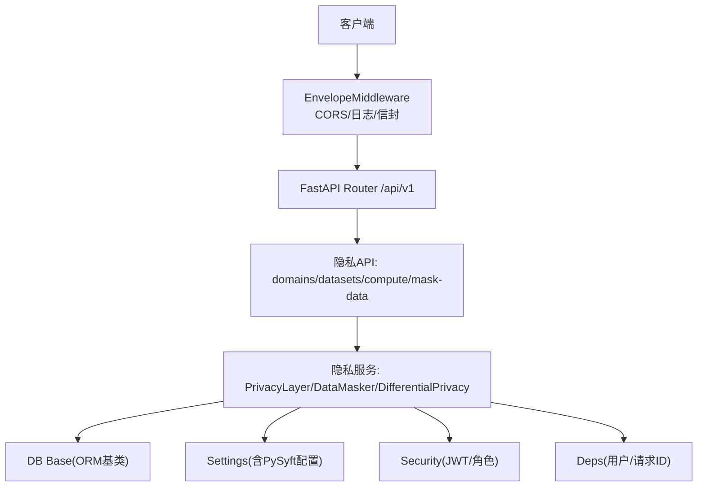
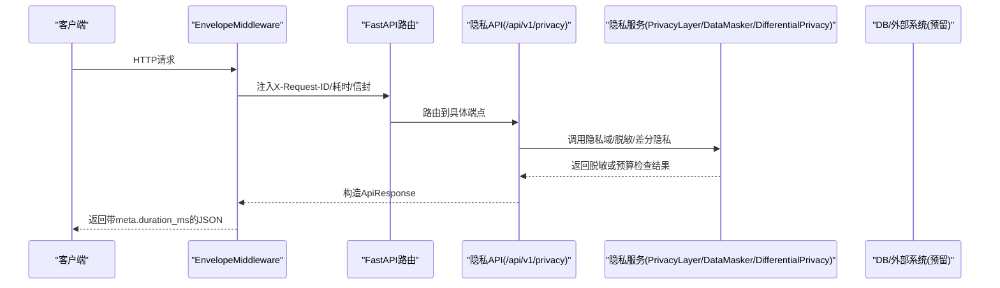
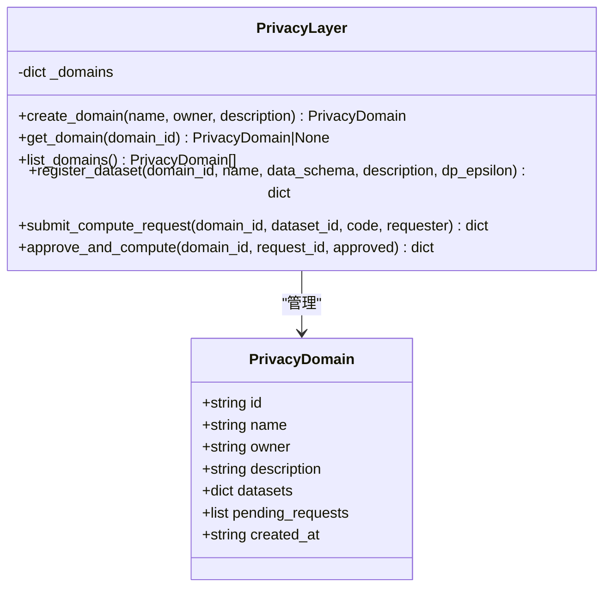
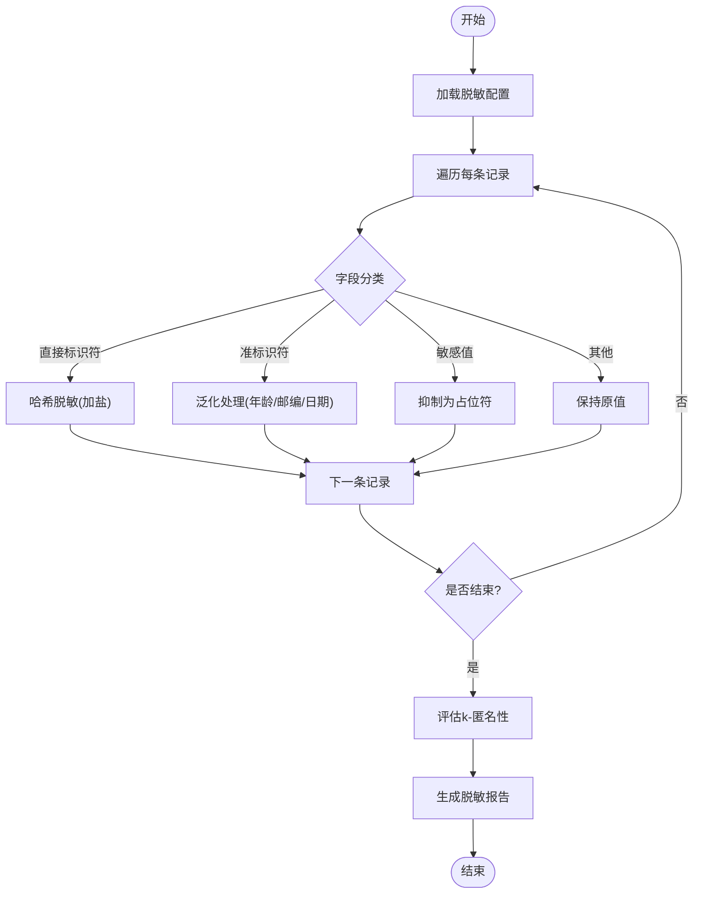
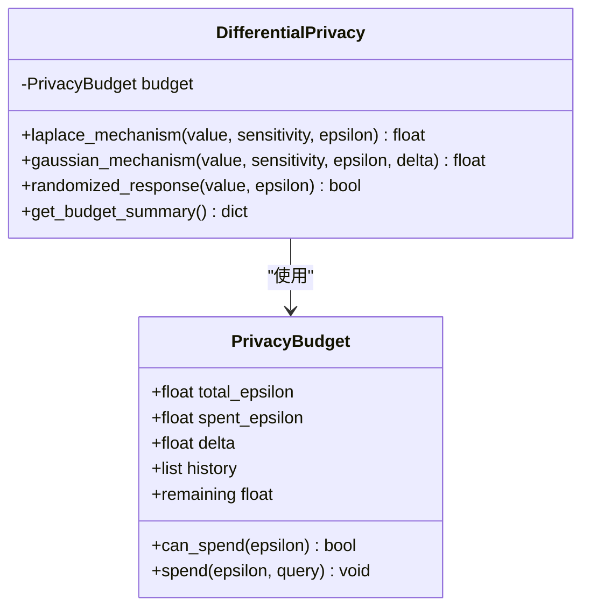
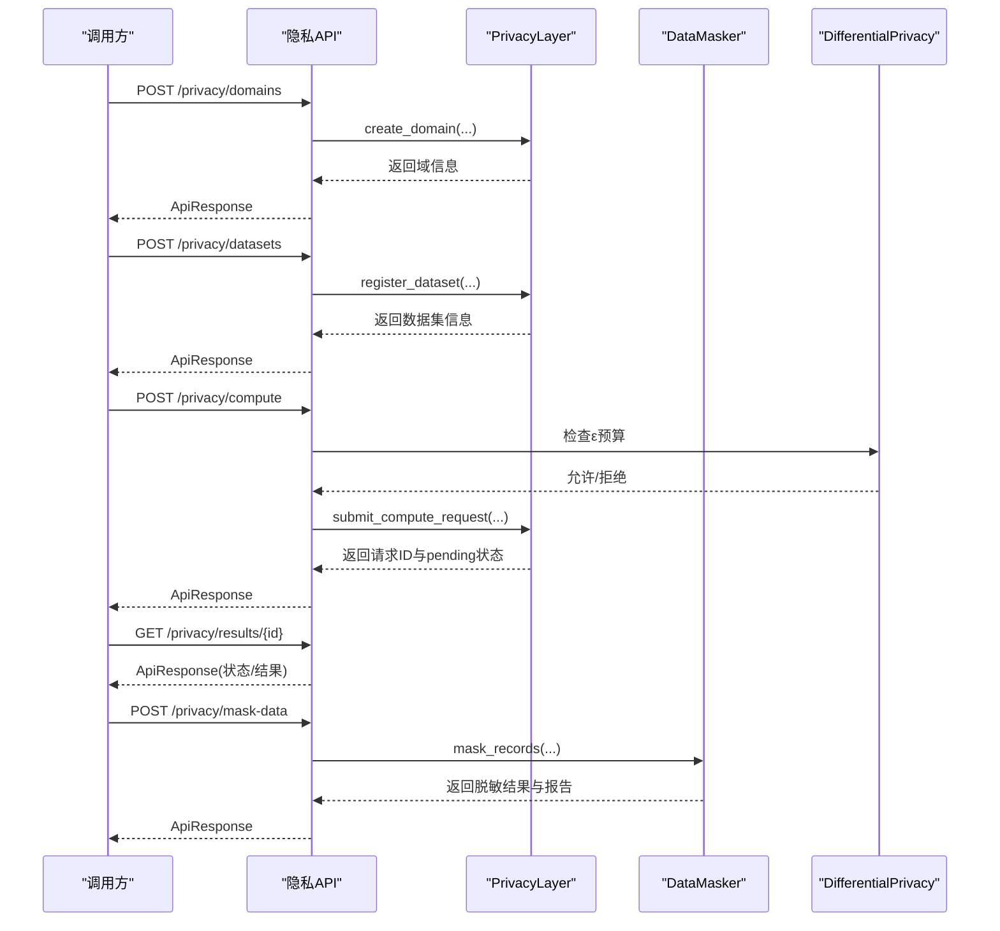
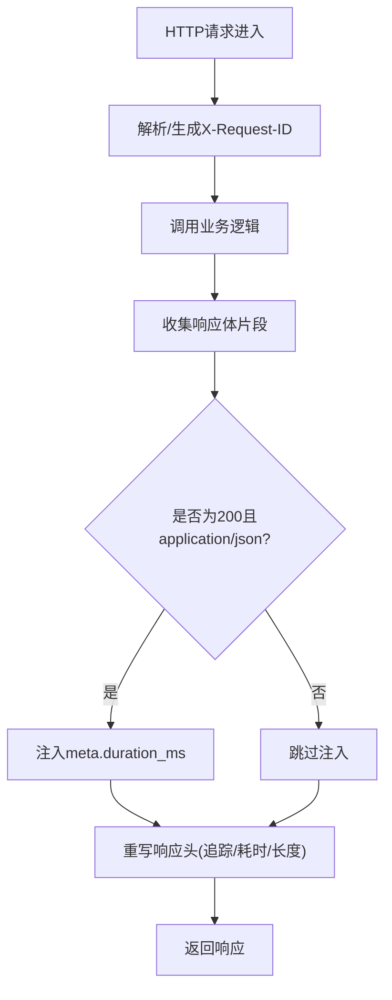
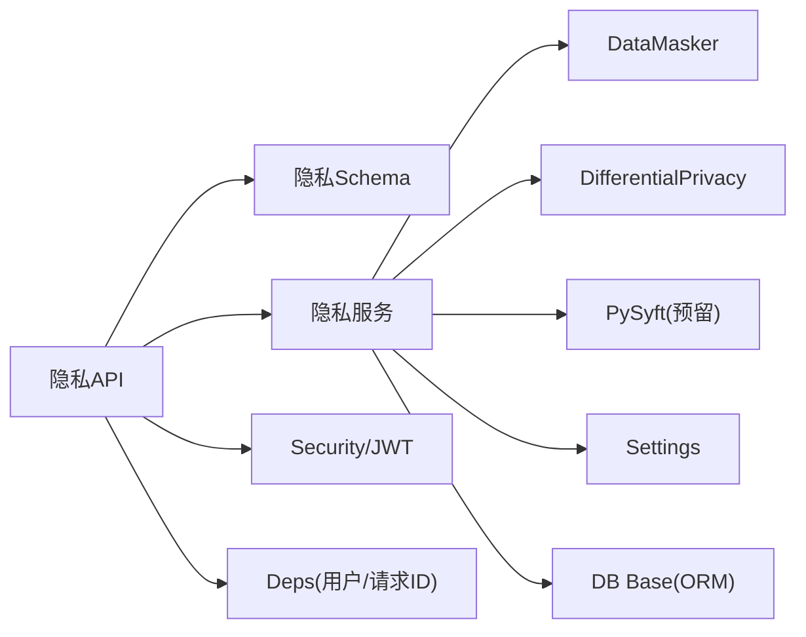

# 隐私计算层架构

<cite>
**本文引用的文件**   
- [privacy_layer.py](file://backend/app/services/privacy/privacy_layer.py)
- [data_masker.py](file://backend/app/services/privacy/data_masker.py)
- [differential_privacy.py](file://backend/app/services/privacy/differential_privacy.py)
- [privacy.py](file://backend/app/api/v1/privacy.py)
- [privacy.py](file://backend/app/schemas/privacy.py)
- [main.py](file://backend/app/main.py)
- [deps.py](file://backend/app/core/deps.py)
- [security.py](file://backend/app/core/security.py)
- [config.py](file://backend/app/core/config.py)
- [base.py](file://backend/app/db/base.py)
</cite>

## 目录
1. [引言](#引言)
2. [项目结构](#项目结构)
3. [核心组件](#核心组件)
4. [架构总览](#架构总览)
5. [详细组件分析](#详细组件分析)
6. [依赖关系分析](#依赖关系分析)
7. [性能考虑](#性能考虑)
8. [故障与降级处理](#故障与降级处理)
9. [监控与告警](#监控与告警)
10. [结论](#结论)

## 引言
本文件为AI药物设计系统的“隐私计算层”提供架构文档。该层围绕“数据不出域、最小可用、可审计、可度量”的隐私保护目标，构建分层能力：
- 数据访问拦截器：在API入口统一注入请求追踪、鉴权与权限校验，并对敏感字段进行脱敏与差分隐私预算控制。
- 查询重写引擎：面向未来数据库层的SQL拦截与重写（当前以内存模拟为主），确保只返回策略允许的最小结果集。
- 结果过滤机制：对输出进行二次过滤与噪声注入，保障k-匿名与ε-预算约束。
- 中间件模式：贯穿请求预处理、响应后处理与异常处理的横切关注点。
- 与数据库层集成：预留SQL拦截、存储过程保护与外部API调用监控接口。
- 隐私策略配置管理：规则定义、优先级排序与动态更新。
- 性能优化：缓存、批量处理与异步执行。
- 可靠性：故障隔离、降级与监控告警。

## 项目结构
隐私计算相关代码主要分布在以下模块：
- API层：v1路由暴露隐私域、数据集注册、远程计算与数据脱敏等端点。
- 服务层：隐私域与审批流、数据脱敏、差分隐私预算与噪声机制。
- 安全与依赖：JWT鉴权、用户获取、请求ID注入。
- 应用入口：全局中间件（信封响应、CORS、日志）与异常处理器注册。
- 配置：集中式环境变量加载，包含PySyft域端口等隐私相关配置项。
- 数据库基类：ORM基础模型与时间戳混入，为后续持久化隐私域/数据集/审计日志做准备。

图表来源
- [main.py:187-248](file://backend/app/main.py#L187-L248)
- [privacy.py:1-177](file://backend/app/api/v1/privacy.py#L1-L177)
- [privacy_layer.py:43-199](file://backend/app/services/privacy/privacy_layer.py#L43-L199)
- [data_masker.py:126-294](file://backend/app/services/privacy/data_masker.py#L126-L294)
- [differential_privacy.py:51-151](file://backend/app/services/privacy/differential_privacy.py#L51-L151)
- [security.py:155-211](file://backend/app/core/security.py#L155-L211)
- [deps.py:91-129](file://backend/app/core/deps.py#L91-L129)
- [config.py:91-98](file://backend/app/core/config.py#L91-L98)
- [base.py:13-48](file://backend/app/db/base.py#L13-L48)

章节来源
- [main.py:187-248](file://backend/app/main.py#L187-L248)
- [privacy.py:1-177](file://backend/app/api/v1/privacy.py#L1-L177)
- [privacy_layer.py:43-199](file://backend/app/services/privacy/privacy_layer.py#L43-L199)
- [data_masker.py:126-294](file://backend/app/services/privacy/data_masker.py#L126-L294)
- [differential_privacy.py:51-151](file://backend/app/services/privacy/differential_privacy.py#L51-L151)
- [security.py:155-211](file://backend/app/core/security.py#L155-L211)
- [deps.py:91-129](file://backend/app/core/deps.py#L91-L129)
- [config.py:91-98](file://backend/app/core/config.py#L91-L98)
- [base.py:13-48](file://backend/app/db/base.py#L13-L48)

## 核心组件
- 隐私域与计算审批（PrivacyLayer）
  - 负责创建隐私域、注册数据集、提交计算请求、审批并执行（当前为内存模拟）。
  - 关键方法：create_domain、register_dataset、submit_compute_request、approve_and_compute。
- 数据脱敏（DataMasker）
  - 直接标识符哈希、准标识符泛化、敏感值抑制；支持k-匿名评估与报告。
  - 关键方法：mask_record、mask_records、get_report。
- 差分隐私（DifferentialPrivacy）
  - 实现Laplace与高斯机制、随机响应；维护ε-预算与使用历史。
  - 关键方法：laplace_mechanism、gaussian_mechanism、randomized_response、get_budget_summary。
- 隐私API（/api/v1/privacy）
  - 提供隐私域、数据集、计算与脱敏的REST接口；内置ε预算检查与状态流转。
- 安全与依赖
  - JWT鉴权、角色守卫、用户对象缓存、请求ID注入。
- 应用中间件
  - 信封响应中间件统一注入X-Request-ID、耗时统计与meta.duration_ms。

章节来源
- [privacy_layer.py:43-199](file://backend/app/services/privacy/privacy_layer.py#L43-L199)
- [data_masker.py:126-294](file://backend/app/services/privacy/data_masker.py#L126-L294)
- [differential_privacy.py:51-151](file://backend/app/services/privacy/differential_privacy.py#L51-L151)
- [privacy.py:1-177](file://backend/app/api/v1/privacy.py#L1-L177)
- [security.py:155-211](file://backend/app/core/security.py#L155-L211)
- [deps.py:91-129](file://backend/app/core/deps.py#L91-L129)
- [main.py:29-185](file://backend/app/main.py#L29-L185)

## 架构总览
隐私计算层采用“API网关 + 中间件 + 服务层 + 策略/工具”的分层设计：
- 请求进入后，先经中间件完成请求ID注入、CORS与信封包装；随后由路由分发到隐私API。
- 隐私API通过依赖注入获取当前用户与请求上下文，调用服务层进行隐私域与数据集操作、计算审批与结果查询。
- 数据脱敏与差分隐私作为通用工具被API或服务层复用，形成“策略即代码”的可组合能力。
- 数据库层目前未接入真实SQL拦截，但已具备ORM基类与配置项，便于后续扩展SQL重写与审计。

图表来源
- [main.py:29-185](file://backend/app/main.py#L29-L185)
- [privacy.py:47-177](file://backend/app/api/v1/privacy.py#L47-L177)
- [privacy_layer.py:124-199](file://backend/app/services/privacy/privacy_layer.py#L124-L199)
- [data_masker.py:144-173](file://backend/app/services/privacy/data_masker.py#L144-L173)
- [differential_privacy.py:63-151](file://backend/app/services/privacy/differential_privacy.py#L63-L151)

## 详细组件分析

### 隐私域与计算审批（PrivacyLayer）
- 职责
  - 管理隐私域生命周期（创建、列举、查询）。
  - 注册数据集（保留所有权，仅元数据与schema进入系统）。
  - 提交计算请求（代码沙箱化，等待所有者审批）。
  - 审批并执行（批准则执行，拒绝则记录状态）。
- 数据结构
  - PrivacyDomain：域ID、名称、所有者、描述、数据集集合、待审批请求列表、创建时间。
- 复杂度
  - 列表/查找均为O(1)/O(n)，n为域内数据集或待审批请求数量。
- 错误处理
  - 域不存在、数据集不存在、请求不存在时返回错误信息。
- 可扩展性
  - 当前内存存储，可替换为持久化后端；审批流程可对接工作流引擎。

图表来源
- [privacy_layer.py:20-199](file://backend/app/services/privacy/privacy_layer.py#L20-L199)

章节来源
- [privacy_layer.py:43-199](file://backend/app/services/privacy/privacy_layer.py#L43-L199)

### 数据脱敏（DataMasker）
- 职责
  - 直接标识符：SHA-256哈希脱敏（带盐）。
  - 准标识符：年龄分段、邮编前缀、日期截断到月/年。
  - 敏感值：替换为占位符。
  - k-匿名评估：按准标识符分组，统计最小同质组大小。
- 配置
  - MaskingConfig：盐值、年龄分段边界、邮编前缀长度、日期粒度、k值、占位符。
- 报告
  - MaskingReport：记录处理记录数、字段数、各类脱敏计数、k-匿名是否满足、违规明细。
- 复杂度
  - mask_records为O(N×F)，N为记录数，F为字段数；k-匿名评估为O(N)。
- 合规参考
  - HIPAA Safe Harbor 18项标识符处理思路。

图表来源
- [data_masker.py:126-294](file://backend/app/services/privacy/data_masker.py#L126-L294)

章节来源
- [data_masker.py:80-294](file://backend/app/services/privacy/data_masker.py#L80-L294)

### 差分隐私（DifferentialPrivacy）
- 职责
  - 维护ε-预算与δ参数，记录每次消耗的历史。
  - 提供Laplace与高斯机制添加噪声，以及布尔值的随机响应。
- 预算控制
  - can_spend/spend/remaining属性，防止超预算。
- 复杂度
  - 单次机制调用为O(1)，预算检查与历史记录追加为O(1)。
- 适用场景
  - 聚合统计、指标上报、对外共享摘要结果。

图表来源
- [differential_privacy.py:15-151](file://backend/app/services/privacy/differential_privacy.py#L15-L151)

章节来源
- [differential_privacy.py:51-151](file://backend/app/services/privacy/differential_privacy.py#L51-L151)

### 隐私API（/api/v1/privacy）
- 端点
  - POST /privacy/domains：创建隐私域（含ε预算）。
  - POST /privacy/datasets：注册数据集（带mock数据用于预览）。
  - POST /privacy/compute：提交远程计算请求（检查ε预算）。
  - GET /privacy/results/{request_id}：查询计算结果。
  - POST /privacy/mask-data：批量数据脱敏（HIPAA Safe Harbor）。
- 鉴权与追踪
  - 通过依赖注入获取当前用户与请求ID。
- 状态机
  - 计算结果状态：pending → completed/rejected。

图表来源
- [privacy.py:47-177](file://backend/app/api/v1/privacy.py#L47-L177)
- [privacy_layer.py:124-199](file://backend/app/services/privacy/privacy_layer.py#L124-L199)
- [data_masker.py:156-173](file://backend/app/services/privacy/data_masker.py#L156-L173)
- [differential_privacy.py:31-49](file://backend/app/services/privacy/differential_privacy.py#L31-L49)

章节来源
- [privacy.py:1-177](file://backend/app/api/v1/privacy.py#L1-L177)
- [privacy.py:14-84](file://backend/app/schemas/privacy.py#L14-L84)

### 中间件与横切关注点
- EnvelopeMiddleware
  - 解析或生成X-Request-ID，回写scope headers供下游依赖读取。
  - 计算请求耗时，写入响应头X-Response-Time-ms，并在成功JSON信封中注入meta.duration_ms。
  - 正确处理流式响应与非JSON响应，避免重写失败。
- CORS与异常处理器
  - 基于配置动态设置允许的源，暴露追踪头。
  - 统一异常映射，保证错误响应格式一致。

图表来源
- [main.py:29-185](file://backend/app/main.py#L29-L185)

章节来源
- [main.py:29-185](file://backend/app/main.py#L29-L185)

### 安全与依赖注入
- 认证与授权
  - JWT access/refresh token生成与解析；从Authorization头提取token并校验。
  - 角色守卫工厂require_roles，限制敏感操作。
- 用户对象缓存
  - 短TTL内存缓存减少数据库压力，过期自动失效。
- 请求ID
  - 优先使用客户端传入的X-Request-ID，否则生成UUID。

章节来源
- [security.py:64-211](file://backend/app/core/security.py#L64-L211)
- [deps.py:26-129](file://backend/app/core/deps.py#L26-L129)

### 配置与环境
- Settings集中管理所有配置项，包括PySyft域端口与名称等隐私相关配置。
- 支持.env与真实环境变量覆盖，类型校验与默认值填充。

章节来源
- [config.py:21-144](file://backend/app/core/config.py#L21-L144)

### 数据库层集成（预留）
- ORM基类与时间戳混入已就绪，便于后续持久化隐私域、数据集、计算请求与审计日志。
- 建议后续扩展：
  - SQL拦截器：在ORM事件钩子中拦截SELECT/UPDATE/DELETE，附加WHERE条件与列投影。
  - 存储过程保护：白名单校验与参数清洗。
  - API调用监控：对第三方知识库/联邦学习节点调用进行采样与限流。

章节来源
- [base.py:13-48](file://backend/app/db/base.py#L13-L48)

## 依赖关系分析
- 低耦合
  - API层仅依赖服务层接口与公共Schema，不直接操作存储。
  - 服务层之间通过独立工具类组合（脱敏、差分隐私），无循环依赖。
- 外部依赖
  - FastAPI、SQLAlchemy、Pydantic、loguru、bcrypt、jose等。
- 潜在风险
  - 当前隐私域与数据集为内存存储，重启丢失；需迁移至持久化。
  - ε预算仅在API层做简单累加，未跨进程持久化，多实例部署需引入分布式锁或共享存储。

图表来源
- [privacy.py:1-177](file://backend/app/api/v1/privacy.py#L1-L177)
- [privacy.py:14-84](file://backend/app/schemas/privacy.py#L14-L84)
- [privacy_layer.py:43-199](file://backend/app/services/privacy/privacy_layer.py#L43-L199)
- [data_masker.py:126-294](file://backend/app/services/privacy/data_masker.py#L126-L294)
- [differential_privacy.py:51-151](file://backend/app/services/privacy/differential_privacy.py#L51-L151)
- [security.py:155-211](file://backend/app/core/security.py#L155-L211)
- [deps.py:91-129](file://backend/app/core/deps.py#L91-L129)
- [config.py:91-98](file://backend/app/core/config.py#L91-L98)
- [base.py:13-48](file://backend/app/db/base.py#L13-L48)

## 性能考虑
- 缓存
  - 用户对象短TTL内存缓存，降低鉴权路径的DB压力。
- 批量处理
  - DataMasker.mask_records支持批量脱敏，减少Python层循环开销。
- 异步
  - 依赖注入使用AsyncSession，API与服务层可结合异步任务队列（如Celery/RQ）执行耗时计算与审批流程。
- 预算与噪声
  - 差分隐私机制为O(1)，适合高频统计；注意ε预算分配策略，避免热点查询耗尽预算。

[本节为通用指导，无需特定文件引用]

## 故障与降级处理
- 预算不足
  - 当ε预算不足时抛出验证错误，返回详细信息以便客户端重试或调整策略。
- 资源不可用
  - 健康检查端点聚合各依赖状态，任一unhealthy则整体标记degraded，便于负载均衡与健康探针。
- 降级策略
  - 若PySyft域不可达，可退回“本地脱敏+差分隐私”模式，仅返回脱敏与加噪后的摘要结果。
- 幂等与重试
  - 计算请求使用唯一request_id，支持幂等查询；网络抖动时可安全重试GET结果端点。

章节来源
- [privacy.py:94-146](file://backend/app/api/v1/privacy.py#L94-L146)
- [differential_privacy.py:79-116](file://backend/app/services/privacy/differential_privacy.py#L79-L116)

## 监控与告警
- 请求追踪
  - X-Request-ID贯穿全链路，EnvelopeMiddleware在响应头与meta中注入duration_ms。
- 日志
  - loguru统一日志，中间件记录方法、路径、状态码与耗时。
- 预算审计
  - DifferentialPrivacy记录每次消耗历史，便于导出审计报表与阈值告警。
- 健康检查
  - 聚合Postgres、Redis、Chroma等依赖状态，支持Kubernetes探针。

章节来源
- [main.py:29-185](file://backend/app/main.py#L29-L185)
- [differential_privacy.py:142-151](file://backend/app/services/privacy/differential_privacy.py#L142-L151)

## 结论
隐私计算层以“域隔离、最小可用、可审计、可度量”为核心，通过API中间件、服务层工具与差分隐私预算控制，构建了端到端的隐私保护闭环。当前阶段以内存模拟为主，下一步应推进：
- 将隐私域、数据集、计算请求与审计日志持久化。
- 引入SQL拦截与查询重写引擎，实现列级与行级访问控制。
- 建立分布式ε预算与k-匿名一致性校验。
- 完善工作流审批与可观测性（指标、链路追踪、告警）。