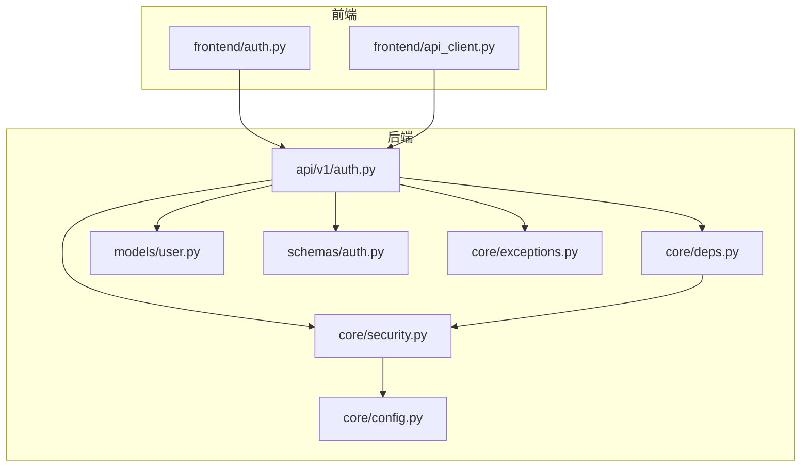
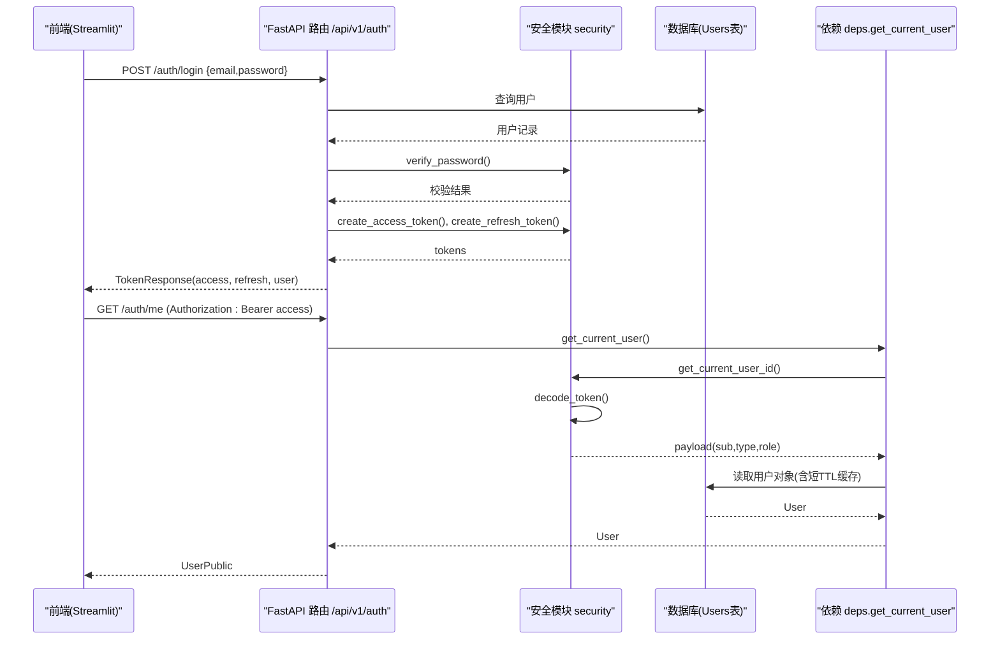
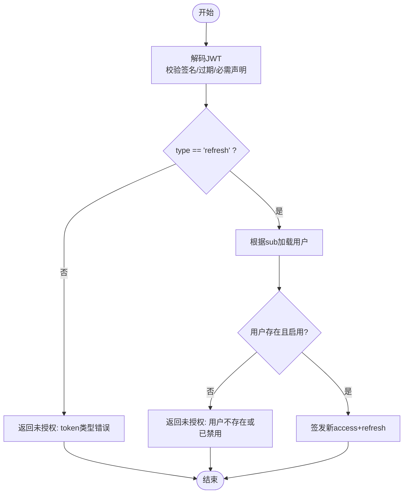
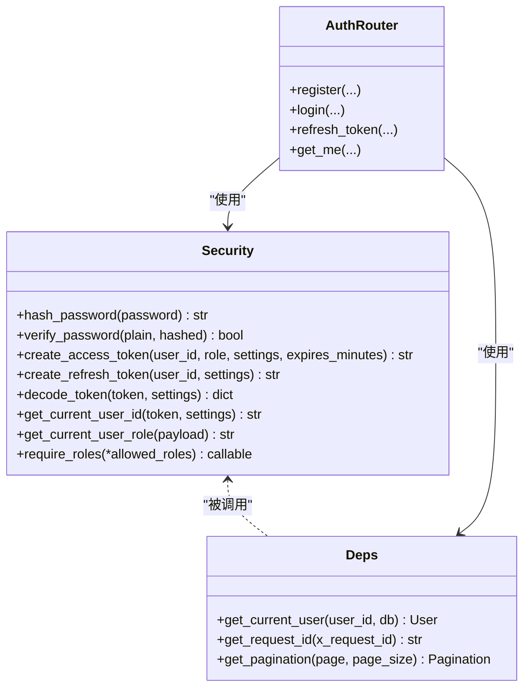
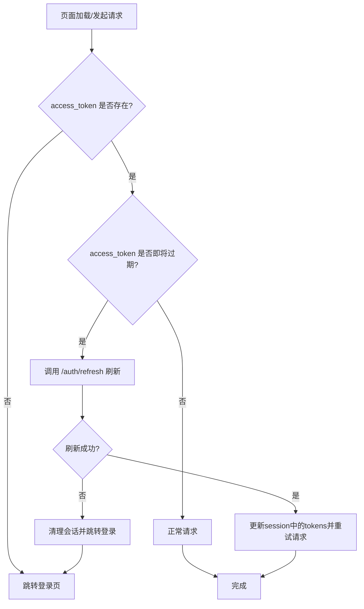
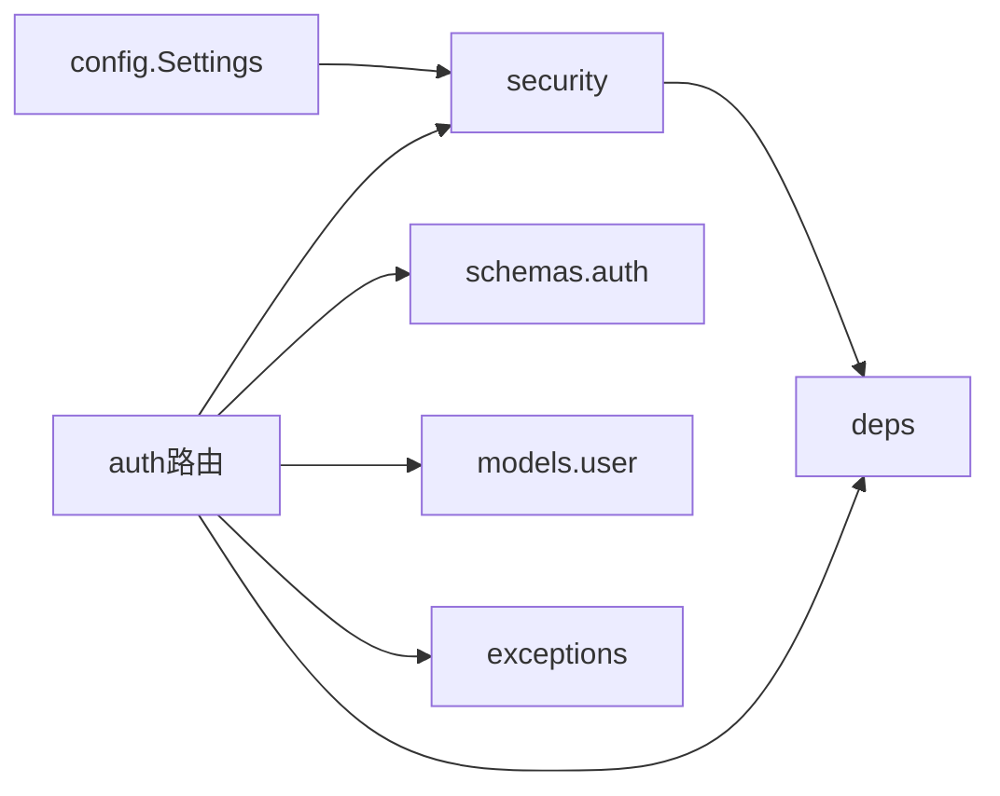

# 身份认证与授权

<cite>
**本文引用的文件**   
- [backend/app/core/security.py](file://backend/app/core/security.py)
- [backend/app/api/v1/auth.py](file://backend/app/api/v1/auth.py)
- [backend/app/core/deps.py](file://backend/app/core/deps.py)
- [backend/app/schemas/auth.py](file://backend/app/schemas/auth.py)
- [backend/app/models/user.py](file://backend/app/models/user.py)
- [backend/app/core/config.py](file://backend/app/core/config.py)
- [backend/app/core/exceptions.py](file://backend/app/core/exceptions.py)
- [frontend/auth.py](file://frontend/auth.py)
- [frontend/api_client.py](file://frontend/api_client.py)
</cite>

## 目录
1. [简介](#简介)
2. [项目结构](#项目结构)
3. [核心组件](#核心组件)
4. [架构总览](#架构总览)
5. [详细组件分析](#详细组件分析)
6. [依赖关系分析](#依赖关系分析)
7. [性能与安全考量](#性能与安全考量)
8. [故障排查指南](#故障排查指南)
9. [结论](#结论)
10. [附录](#附录)

## 简介
本文件面向AI药物设计系统的身份认证与授权实现，系统性阐述以下要点：
- JWT access token 与 refresh token 的生成、校验与刷新流程
- bcrypt 密码哈希的安全实践（盐值、成本因子）
- FastAPI 依赖注入的角色权限控制（require_roles 装饰器与多角色验证）
- OAuth2PasswordBearer 的配置与使用模式
- 用户会话管理、令牌安全存储、跨域认证配置
- 前端认证状态管理、自动令牌刷新策略、登出处理

## 项目结构
后端采用分层架构：
- core：安全、配置、异常、通用依赖
- api/v1：REST 路由与控制器
- models：ORM 模型
- schemas：请求/响应数据模型
- db：数据库会话与初始化
- services：业务服务层（与本主题关联较少）

前端基于 Streamlit，提供登录/注册 UI、API 客户端封装、会话状态管理。

图表来源
- [backend/app/core/security.py:1-211](file://backend/app/core/security.py#L1-L211)
- [backend/app/api/v1/auth.py:1-147](file://backend/app/api/v1/auth.py#L1-L147)
- [backend/app/core/deps.py:1-129](file://backend/app/core/deps.py#L1-L129)
- [backend/app/core/config.py:1-144](file://backend/app/core/config.py#L1-L144)
- [backend/app/models/user.py:1-36](file://backend/app/models/user.py#L1-L36)
- [backend/app/schemas/auth.py:1-61](file://backend/app/schemas/auth.py#L1-L61)
- [backend/app/core/exceptions.py:1-179](file://backend/app/core/exceptions.py#L1-L179)
- [frontend/auth.py:1-137](file://frontend/auth.py#L1-L137)
- [frontend/api_client.py:1-251](file://frontend/api_client.py#L1-L251)

章节来源
- [backend/app/core/security.py:1-211](file://backend/app/core/security.py#L1-L211)
- [backend/app/api/v1/auth.py:1-147](file://backend/app/api/v1/auth.py#L1-L147)
- [backend/app/core/deps.py:1-129](file://backend/app/core/deps.py#L1-L129)
- [backend/app/core/config.py:1-144](file://backend/app/core/config.py#L1-L144)
- [backend/app/models/user.py:1-36](file://backend/app/models/user.py#L1-L36)
- [backend/app/schemas/auth.py:1-61](file://backend/app/schemas/auth.py#L1-L61)
- [backend/app/core/exceptions.py:1-179](file://backend/app/core/exceptions.py#L1-L179)
- [frontend/auth.py:1-137](file://frontend/auth.py#L1-L137)
- [frontend/api_client.py:1-251](file://frontend/api_client.py#L1-L251)

## 核心组件
- 安全模块（security.py）
  - bcrypt 密码哈希与校验
  - JWT access/refresh token 生成与解析
  - FastAPI 依赖：当前用户ID、角色提取、角色守卫 require_roles
- 认证路由（auth.py）
  - 注册、登录、刷新、获取当前用户信息
- 通用依赖（deps.py）
  - get_current_user：从 token 解析用户并带短 TTL 内存缓存
- 配置（config.py）
  - JWT 密钥、算法、过期时间；CORS 源列表
- 数据模型与Schema
  - User 模型字段与角色说明
  - 认证相关请求/响应 Schema
- 异常体系（exceptions.py）
  - 统一错误信封与全局处理器
- 前端（frontend）
  - 登录/注册表单、会话状态管理、API 客户端自动注入 Authorization 头

章节来源
- [backend/app/core/security.py:1-211](file://backend/app/core/security.py#L1-L211)
- [backend/app/api/v1/auth.py:1-147](file://backend/app/api/v1/auth.py#L1-L147)
- [backend/app/core/deps.py:1-129](file://backend/app/core/deps.py#L1-L129)
- [backend/app/core/config.py:1-144](file://backend/app/core/config.py#L1-L144)
- [backend/app/models/user.py:1-36](file://backend/app/models/user.py#L1-L36)
- [backend/app/schemas/auth.py:1-61](file://backend/app/schemas/auth.py#L1-L61)
- [backend/app/core/exceptions.py:1-179](file://backend/app/core/exceptions.py#L1-L179)
- [frontend/auth.py:1-137](file://frontend/auth.py#L1-L137)
- [frontend/api_client.py:1-251](file://frontend/api_client.py#L1-L251)

## 架构总览
下图展示了认证与授权在前后端的交互路径与关键依赖。

图表来源
- [backend/app/api/v1/auth.py:70-101](file://backend/app/api/v1/auth.py#L70-L101)
- [backend/app/api/v1/auth.py:137-146](file://backend/app/api/v1/auth.py#L137-L146)
- [backend/app/core/security.py:155-191](file://backend/app/core/security.py#L155-L191)
- [backend/app/core/deps.py:101-124](file://backend/app/core/deps.py#L101-L124)

## 详细组件分析

### 1. JWT 令牌机制（access 与 refresh）
- 生成
  - access token：短期有效，携带 sub、type=access、role、iat/exp/jti
  - refresh token：长期有效，携带 sub、type=refresh、iat/exp/jti
- 校验
  - 解码时校验签名、过期时间、必需声明 sub
  - 区分 type 字段，确保接口只接受对应类型
- 刷新
  - 使用 refresh token 换取新的 access + refresh token
  - 同时校验用户存在且未被禁用

图表来源
- [backend/app/core/security.py:125-149](file://backend/app/core/security.py#L125-L149)
- [backend/app/api/v1/auth.py:104-134](file://backend/app/api/v1/auth.py#L104-L134)

章节来源
- [backend/app/core/security.py:64-149](file://backend/app/core/security.py#L64-L149)
- [backend/app/api/v1/auth.py:104-134](file://backend/app/api/v1/auth.py#L104-L134)

### 2. bcrypt 密码哈希与校验
- 哈希
  - 使用 bcrypt.gensalt() 自动生成随机盐
  - bcrypt.hashpw() 生成最终哈希字符串（包含版本、cost、salt）
- 校验
  - bcrypt.checkpw() 进行恒定时间比较，避免时序攻击
  - 对异常捕获后返回 False，防止泄露内部错误

最佳实践建议
- 在生产环境适当提高 bcrypt cost factor（通过 gensalt(rounds=...)），以平衡安全性与性能
- 禁止明文存储密码，仅保存哈希值
- 定期轮换系统密钥（用于JWT），并对历史用户强制重置密码

章节来源
- [backend/app/core/security.py:32-58](file://backend/app/core/security.py#L32-L58)

### 3. FastAPI 依赖注入与角色权限控制
- OAuth2PasswordBearer
  - 配置 tokenUrl 指向登录端点，便于 OpenAPI 文档展示
  - auto_error=False 允许可选鉴权场景
- 依赖链
  - get_current_user_id：从 Authorization header 提取并校验 access token，返回用户ID
  - _get_current_payload：返回完整 payload
  - get_current_user_role：从 payload 提取 role
  - require_roles(*roles)：工厂函数，返回依赖检查器，支持多角色白名单
- 使用方式
  - 在路由中通过 dependencies=[Depends(require_roles("founder","pi"))] 限制访问

图表来源
- [backend/app/core/security.py:155-211](file://backend/app/core/security.py#L155-L211)
- [backend/app/core/deps.py:101-124](file://backend/app/core/deps.py#L101-L124)
- [backend/app/api/v1/auth.py:1-147](file://backend/app/api/v1/auth.py#L1-L147)

章节来源
- [backend/app/core/security.py:24-26](file://backend/app/core/security.py#L24-L26)
- [backend/app/core/security.py:155-211](file://backend/app/core/security.py#L155-L211)
- [backend/app/core/deps.py:101-124](file://backend/app/core/deps.py#L101-L124)
- [backend/app/api/v1/auth.py:1-147](file://backend/app/api/v1/auth.py#L1-L147)

### 4. 用户与会话管理
- 用户模型
  - 字段包括邮箱、哈希密码、姓名、角色、是否激活、最后登录时间
  - 角色集合由公共枚举约束
- 会话与缓存
  - get_current_user 在解析 token 后加载用户对象，并使用短 TTL 内存缓存减少数据库压力
  - 提供 invalidate_user_cache 用于主动失效缓存
- 前端会话
  - Streamlit session_state 存储 access_token、refresh_token、user_email
  - 登出时清理上述键

章节来源
- [backend/app/models/user.py:14-36](file://backend/app/models/user.py#L14-L36)
- [backend/app/core/deps.py:26-65](file://backend/app/core/deps.py#L26-L65)
- [backend/app/core/deps.py:101-124](file://backend/app/core/deps.py#L101-L124)
- [frontend/auth.py:116-127](file://frontend/auth.py#L116-L127)

### 5. 令牌安全存储与传输
- 后端
  - JWT 使用 HS256 算法与可配置密钥，密钥来自环境变量
  - 所有敏感操作均要求 Authorization: Bearer <token>
- 前端
  - ApiClient 自动为每个请求附加 Authorization 头
  - 登录成功后将 tokens 写入 session_state
  - 上传接口使用独立 httpx.Client 以避免影响连接池

注意
- 当前前端将 tokens 保存在进程内会话中，适合演示与本地开发
- 生产部署建议结合服务端会话或更安全的存储策略，并考虑刷新逻辑的前置化

章节来源
- [backend/app/core/config.py:78-82](file://backend/app/core/config.py#L78-L82)
- [frontend/api_client.py:61-66](file://frontend/api_client.py#L61-L66)
- [frontend/auth.py:54-62](file://frontend/auth.py#L54-L62)
- [frontend/api_client.py:136-162](file://frontend/api_client.py#L136-L162)

### 6. 跨域认证（CORS）
- 配置项
  - cors_origins：逗号分隔的允许源列表，支持去除空白与规范化
  - 提供 cors_origin_list 属性供中间件使用
- 使用建议
  - 生产环境严格限定允许的域名
  - 如需携带凭证（cookies），需配合服务端 CORS 设置 allow_credentials=True（当前代码未直接暴露该开关）

章节来源
- [backend/app/core/config.py:84-121](file://backend/app/core/config.py#L84-L121)

### 7. 前端认证状态管理与自动刷新
- 登录流程
  - 提交邮箱与密码至 /auth/login，成功后将 access_token、refresh_token、user_email 写入 session_state
- 登出流程
  - 清除 access_token、refresh_token、user_email
- 自动刷新策略（建议）
  - 在 ApiClient 发起请求前检测 access_token 是否即将过期
  - 若过期则先调用 /auth/refresh 获取新 token，再重试原请求
  - 失败时清理会话并重定向到登录页

[此图为概念性流程图，不直接映射具体源码文件，故无图表来源]

章节来源
- [frontend/auth.py:28-66](file://frontend/auth.py#L28-L66)
- [frontend/auth.py:116-127](file://frontend/auth.py#L116-L127)
- [frontend/api_client.py:42-66](file://frontend/api_client.py#L42-L66)

## 依赖关系分析
- 模块耦合
  - auth 路由依赖 security 与 deps，二者分别负责令牌与用户解析
  - deps 依赖 security 的 get_current_user_id 与数据库会话
  - config 提供 JWT 与 CORS 等全局配置
- 外部依赖
  - bcrypt：密码哈希
  - python-jose：JWT 编解码
  - fastapi.security.OAuth2PasswordBearer：Bearer 令牌提取
  - sqlalchemy：用户数据存取

图表来源
- [backend/app/core/config.py:136-143](file://backend/app/core/config.py#L136-L143)
- [backend/app/core/security.py:1-211](file://backend/app/core/security.py#L1-L211)
- [backend/app/core/deps.py:1-129](file://backend/app/core/deps.py#L1-L129)
- [backend/app/api/v1/auth.py:1-147](file://backend/app/api/v1/auth.py#L1-L147)
- [backend/app/schemas/auth.py:1-61](file://backend/app/schemas/auth.py#L1-L61)
- [backend/app/models/user.py:1-36](file://backend/app/models/user.py#L1-L36)
- [backend/app/core/exceptions.py:1-179](file://backend/app/core/exceptions.py#L1-L179)

章节来源
- [backend/app/core/config.py:1-144](file://backend/app/core/config.py#L1-L144)
- [backend/app/core/security.py:1-211](file://backend/app/core/security.py#L1-L211)
- [backend/app/core/deps.py:1-129](file://backend/app/core/deps.py#L1-L129)
- [backend/app/api/v1/auth.py:1-147](file://backend/app/api/v1/auth.py#L1-L147)
- [backend/app/schemas/auth.py:1-61](file://backend/app/schemas/auth.py#L1-L61)
- [backend/app/models/user.py:1-36](file://backend/app/models/user.py#L1-L36)
- [backend/app/core/exceptions.py:1-179](file://backend/app/core/exceptions.py#L1-L179)

## 性能与安全考量
- 性能
  - 用户对象短 TTL 内存缓存降低频繁数据库查询
  - 前端共享 httpx.Client 复用连接池，提升并发能力
- 安全
  - bcrypt 默认成本因子适中，生产环境建议调高
  - JWT 密钥应使用强随机长串，并在不同环境隔离
  - 建议引入 refresh token 黑名单或短期滚动刷新策略，增强抗重放能力
  - 严格配置 CORS，仅允许可信来源

[本节为通用指导，不直接分析具体文件]

## 故障排查指南
- 常见错误码与含义
  - UNAUTHORIZED：缺少 Authorization header、token 无效或过期、token 类型错误、用户不存在或被禁用
  - FORBIDDEN：角色不足，需要特定角色之一
  - VALIDATION_ERROR：请求参数校验失败
  - INTERNAL_ERROR：服务器内部错误
- 定位步骤
  - 确认 Authorization 头格式正确（Bearer <token>）
  - 检查 JWT 密钥与算法配置一致
  - 查看日志中的警告与异常信息（loguru）
  - 使用 request_id 追踪请求链路

章节来源
- [backend/app/core/exceptions.py:57-74](file://backend/app/core/exceptions.py#L57-L74)
- [backend/app/core/exceptions.py:131-179](file://backend/app/core/exceptions.py#L131-L179)
- [backend/app/core/security.py:169-174](file://backend/app/core/security.py#L169-L174)
- [backend/app/core/security.py:187-191](file://backend/app/core/security.py#L187-L191)

## 结论
本系统在后端实现了基于 JWT 的无状态认证与基于角色的细粒度授权，在前端提供了简洁的登录/注册与会话管理。通过依赖注入与统一异常处理，整体架构清晰、可扩展性强。建议在后续迭代中完善前端自动刷新策略、引入 refresh token 黑名单与更严格的 CORS 策略，以提升安全性与用户体验。

## 附录
- 关键配置项（节选）
  - jwt_secret_key：JWT 签名密钥
  - jwt_algorithm：JWT 算法（HS256）
  - jwt_access_token_expire_minutes：access token 有效期（分钟）
  - jwt_refresh_token_expire_days：refresh token 有效期（天）
  - cors_origins：允许的跨域源列表

章节来源
- [backend/app/core/config.py:78-86](file://backend/app/core/config.py#L78-L86)