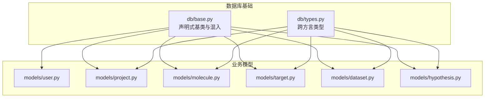
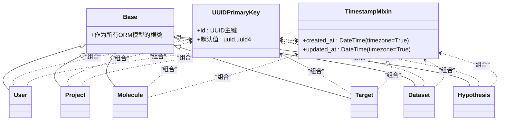
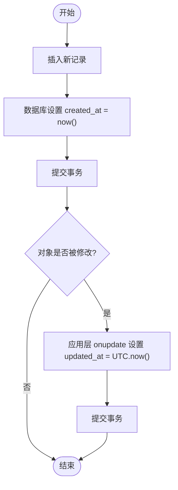
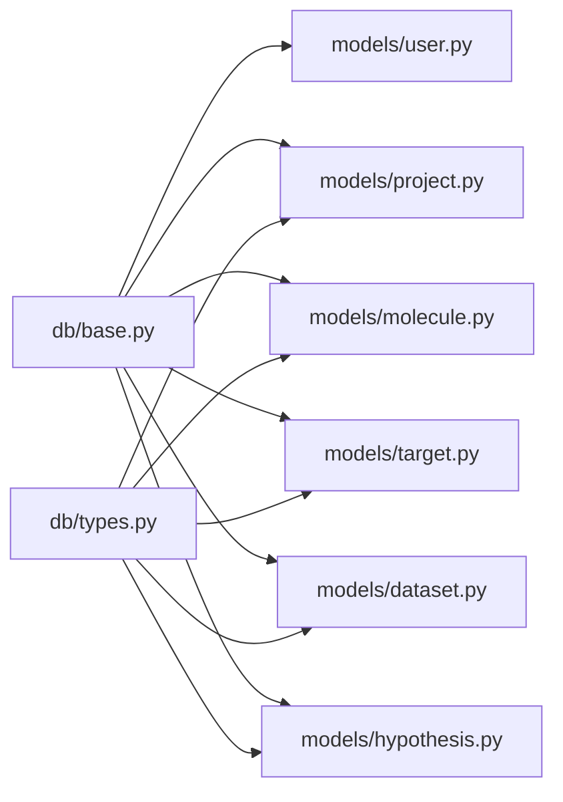

# ORM基类与混入设计

<cite>
**本文引用的文件**
- [backend/app/db/base.py](file://backend/app/db/base.py)
- [backend/app/db/types.py](file://backend/app/db/types.py)
- [backend/app/models/user.py](file://backend/app/models/user.py)
- [backend/app/models/project.py](file://backend/app/models/project.py)
- [backend/app/models/molecule.py](file://backend/app/models/molecule.py)
- [backend/app/models/target.py](file://backend/app/models/target.py)
- [backend/app/models/dataset.py](file://backend/app/models/dataset.py)
- [backend/app/models/hypothesis.py](file://backend/app/models/hypothesis.py)
</cite>

## 目录
1. [简介](#简介)
2. [项目结构](#项目结构)
3. [核心组件](#核心组件)
4. [架构总览](#架构总览)
5. [详细组件分析](#详细组件分析)
6. [依赖关系分析](#依赖关系分析)
7. [性能考量](#性能考量)
8. [故障排查指南](#故障排查指南)
9. [结论](#结论)
10. [附录](#附录)

## 简介
本文件面向AI药物设计系统的ORM层，聚焦于声明式基类与混入类的设计与使用。重点包括：
- DeclarativeBase（声明式基类）的配置与扩展机制
- UUIDPrimaryKey混入类的设计原理与优势
- TimestampMixin混入类的实现细节与时区策略
- 模型继承组合示例与最佳实践
- 常见陷阱与规避方法

## 项目结构
ORM相关代码集中在后端应用模块的数据库与模型目录中：
- db/base.py：定义DeclarativeBase、UUIDPrimaryKey、TimestampMixin
- db/types.py：提供跨方言兼容类型（JSONB/INET等）
- models/*：业务模型统一继承自Base并组合混入类

图表来源
- [backend/app/db/base.py:13-47](file://backend/app/db/base.py#L13-L47)
- [backend/app/db/types.py:13-41](file://backend/app/db/types.py#L13-L41)
- [backend/app/models/user.py:14-36](file://backend/app/models/user.py#L14-L36)
- [backend/app/models/project.py:14-42](file://backend/app/models/project.py#L14-L42)
- [backend/app/models/molecule.py:14-61](file://backend/app/models/molecule.py#L14-L61)
- [backend/app/models/target.py:14-52](file://backend/app/models/target.py#L14-L52)
- [backend/app/models/dataset.py:15-70](file://backend/app/models/dataset.py#L15-L70)
- [backend/app/models/hypothesis.py:15-66](file://backend/app/models/hypothesis.py#L15-L66)

章节来源
- [backend/app/db/base.py:13-47](file://backend/app/db/base.py#L13-L47)
- [backend/app/db/types.py:13-41](file://backend/app/db/types.py#L13-L41)
- [backend/app/models/user.py:14-36](file://backend/app/models/user.py#L14-L36)
- [backend/app/models/project.py:14-42](file://backend/app/models/project.py#L14-L42)
- [backend/app/models/molecule.py:14-61](file://backend/app/models/molecule.py#L14-L61)
- [backend/app/models/target.py:14-52](file://backend/app/models/target.py#L14-L52)
- [backend/app/models/dataset.py:15-70](file://backend/app/models/dataset.py#L15-L70)
- [backend/app/models/hypothesis.py:15-66](file://backend/app/models/hypothesis.py#L15-L66)

## 核心组件
本节深入解析ORM基类与混入类的设计要点。

### 声明式基类 Base（DeclarativeBase）
- 作用：作为所有SQLAlchemy模型的根类，集中管理元数据、映射配置与扩展点。
- 扩展机制：通过继承Base，模型可复用统一的表名约定、列定义风格、关系与事件钩子；可在Base上注册全局事件或自定义ColumnProperty以增强通用能力。
- 建议：在Base中放置与“模型共性”相关的配置，避免在业务模型中重复定义。

章节来源
- [backend/app/db/base.py:13-15](file://backend/app/db/base.py#L13-L15)

### UUIDPrimaryKey 混入类
- 主键类型：PostgreSQL原生UUID类型，Python侧为uuid.UUID对象，as_uuid=True确保自动转换。
- 默认值策略：使用uuid.uuid4生成随机唯一ID，具备分布式友好特性，无需中心序列服务，便于水平拆分与合并。
- 字段语义：id为主键，不可为空，索引由主键约束隐式创建。
- 迁移与兼容性：当从整数主键迁移至UUID时，需考虑外键级联与查询性能；建议在索引与查询计划层面评估影响。

章节来源
- [backend/app/db/base.py:17-27](file://backend/app/db/base.py#L17-L27)

### TimestampMixin 混入类
- created_at：
  - 类型：带时区的DateTime
  - 默认值：server_default=func.now()，由数据库在插入时填充
  - 用途：记录首次创建时间，保证一致性与时区正确性
- updated_at：
  - 类型：带时区的DateTime
  - 默认值：server_default=func.now()，onupdate=lambda: datetime.now(UTC)
  - 更新时机：SQLAlchemy在检测到对象变更并执行flush/commit时触发更新
  - 时区处理：使用UTC时间，避免本地时区差异导致的不一致
- 注意事项：
  - onupdate仅在对象被标记为dirty且提交时生效；若直接执行UPDATE SQL可能不会触发
  - 如需严格数据库级更新，可配合触发器或数据库特性（如PostgreSQL的BEFORE UPDATE触发器）

章节来源
- [backend/app/db/base.py:30-47](file://backend/app/db/base.py#L30-L47)

## 架构总览
下图展示了声明式基类与混入类如何被业务模型组合使用，以及跨方言类型在模型中的引入位置。

图表来源
- [backend/app/db/base.py:13-47](file://backend/app/db/base.py#L13-L47)
- [backend/app/models/user.py:14-36](file://backend/app/models/user.py#L14-L36)
- [backend/app/models/project.py:14-42](file://backend/app/models/project.py#L14-L42)
- [backend/app/models/molecule.py:14-61](file://backend/app/models/molecule.py#L14-L61)
- [backend/app/models/target.py:14-52](file://backend/app/models/target.py#L14-L52)
- [backend/app/models/dataset.py:15-70](file://backend/app/models/dataset.py#L15-L70)
- [backend/app/models/hypothesis.py:15-66](file://backend/app/models/hypothesis.py#L15-L66)

## 详细组件分析

### 声明式基类 Base 的配置与扩展机制
- 配置要点：
  - 作为DeclarativeBase实例，承载所有模型的元信息
  - 可通过Base.metadata统一管理表集合，用于DDL生成与迁移
- 扩展方式：
  - 在Base上添加公共列属性或事件监听器，供所有模型共享
  - 结合SQLAlchemy事件系统实现审计、软删除、缓存失效等横切逻辑
- 适用场景：
  - 统一命名规范、默认约束、索引策略
  - 全局安全校验、权限过滤、多租户隔离

章节来源
- [backend/app/db/base.py:13-15](file://backend/app/db/base.py#L13-L15)

### UUIDPrimaryKey 混入类设计原理
- 分布式生成优势：
  - 无需中心化序列服务，降低单点瓶颈
  - 天然适合分库分表与数据合并，冲突概率极低
- PostgreSQL UUID类型映射：
  - as_uuid=True使Python端直接使用uuid.UUID对象，减少序列化/反序列化开销
- 默认值设置策略：
  - 使用uuid.uuid4在应用层生成，避免数据库函数调用带来的额外开销
  - 若需要数据库侧生成，可改用server_default=func.gen_random_uuid()（PostgreSQL）

章节来源
- [backend/app/db/base.py:17-27](file://backend/app/db/base.py#L17-L27)

### TimestampMixin 混入类实现细节
- 数据库级时间戳管理：
  - created_at使用server_default=func.now()，确保插入时由数据库提供时间
  - updated_at同时设置server_default与onupdate，兼顾首次写入与后续更新
- 时区处理：
  - 使用DateTime(timezone=True)，统一采用UTC存储，避免客户端时区不一致问题
- 自动更新机制：
  - SQLAlchemy在对象变更并提交时触发onupdate；对于批量更新或原生SQL，需借助触发器或显式赋值

图表来源
- [backend/app/db/base.py:30-47](file://backend/app/db/base.py#L30-L47)

章节来源
- [backend/app/db/base.py:30-47](file://backend/app/db/base.py#L30-L47)

### 模型继承与混入组合示例
以下模型均遵循统一模式：继承Base，组合UUIDPrimaryKey与TimestampMixin，再定义业务字段与关系。

- 用户模型（User）
  - 主键：UUID
  - 时间戳：created_at、updated_at
  - 业务字段：邮箱、密码哈希、姓名、角色、活跃状态、最后登录时间
  - 参考路径：[backend/app/models/user.py:14-36](file://backend/app/models/user.py#L14-L36)

- 项目模型（Project）
  - 主键：UUID
  - 时间戳：created_at、updated_at
  - 业务字段：名称、描述、所有者、状态、癌症类型、患者伪名、元数据（JSONB）
  - 关系：数据集、假设
  - 参考路径：[backend/app/models/project.py:14-42](file://backend/app/models/project.py#L14-L42)

- 分子模型（Molecule）
  - 主键：UUID
  - 时间戳：created_at、updated_at
  - 业务字段：SMILES、InChI Key、ChEMBL ID、批准状态、药物相似性、预测属性、来源
  - 关系：靶点、对接结果
  - 参考路径：[backend/app/models/molecule.py:14-61](file://backend/app/models/molecule.py#L14-L61)

- 靶点模型（Target）
  - 主键：UUID
  - 时间戳：created_at、updated_at
  - 业务字段：基因符号、Entrez ID、证据等级、置信度、机制、来源、元数据
  - 关系：证据项、分子
  - 参考路径：[backend/app/models/target.py:14-52](file://backend/app/models/target.py#L14-L52)

- 数据集模型（Dataset）
  - 主键：UUID
  - 时间戳：created_at、updated_at
  - 业务字段：项目名称、数据类型、文件路径、大小、格式、状态、校验和、质量分数、上传者、处理时间
  - 关系：项目、质量报告
  - 参考路径：[backend/app/models/dataset.py:15-70](file://backend/app/models/dataset.py#L15-L70)

- 假设模型（Hypothesis）与分析记录（HypothesisAnalysis）
  - 主键：UUID
  - 时间戳：created_at、updated_at
  - 业务字段：名称、描述、状态、优先级、强制分析标识与原因、目标列表（JSONB）
  - 关系：项目、分析记录
  - 参考路径：[backend/app/models/hypothesis.py:15-66](file://backend/app/models/hypothesis.py#L15-L66)

章节来源
- [backend/app/models/user.py:14-36](file://backend/app/models/user.py#L14-L36)
- [backend/app/models/project.py:14-42](file://backend/app/models/project.py#L14-L42)
- [backend/app/models/molecule.py:14-61](file://backend/app/models/molecule.py#L14-L61)
- [backend/app/models/target.py:14-52](file://backend/app/models/target.py#L14-L52)
- [backend/app/models/dataset.py:15-70](file://backend/app/models/dataset.py#L15-L70)
- [backend/app/models/hypothesis.py:15-66](file://backend/app/models/hypothesis.py#L15-L66)

## 依赖关系分析
- 内聚性与耦合性：
  - Base与混入类高度内聚，职责单一；业务模型仅组合混入，保持低耦合
- 外部依赖：
  - SQLAlchemy ORM与PostgreSQL方言类型（UUID、JSONB、INET）
  - 跨方言类型封装（JSONBCompat、INETCompat）提升开发体验与迁移灵活性
- 潜在循环依赖：
  - 模型间存在双向关系（如Project-Dataset、Molecule-Target），但通过字符串延迟引用避免导入循环

图表来源
- [backend/app/db/base.py:13-47](file://backend/app/db/base.py#L13-L47)
- [backend/app/db/types.py:13-41](file://backend/app/db/types.py#L13-L41)
- [backend/app/models/user.py:14-36](file://backend/app/models/user.py#L14-L36)
- [backend/app/models/project.py:14-42](file://backend/app/models/project.py#L14-L42)
- [backend/app/models/molecule.py:14-61](file://backend/app/models/molecule.py#L14-L61)
- [backend/app/models/target.py:14-52](file://backend/app/models/target.py#L14-L52)
- [backend/app/models/dataset.py:15-70](file://backend/app/models/dataset.py#L15-L70)
- [backend/app/models/hypothesis.py:15-66](file://backend/app/models/hypothesis.py#L15-L66)

章节来源
- [backend/app/db/base.py:13-47](file://backend/app/db/base.py#L13-L47)
- [backend/app/db/types.py:13-41](file://backend/app/db/types.py#L13-L41)
- [backend/app/models/user.py:14-36](file://backend/app/models/user.py#L14-L36)
- [backend/app/models/project.py:14-42](file://backend/app/models/project.py#L14-L42)
- [backend/app/models/molecule.py:14-61](file://backend/app/models/molecule.py#L14-L61)
- [backend/app/models/target.py:14-52](file://backend/app/models/target.py#L14-L52)
- [backend/app/models/dataset.py:15-70](file://backend/app/models/dataset.py#L15-L70)
- [backend/app/models/hypothesis.py:15-66](file://backend/app/models/hypothesis.py#L15-L66)

## 性能考量
- UUID主键：
  - 优点：分布式友好、无锁竞争、易于分片
  - 缺点：相比自增整数，索引页分裂更频繁；在高并发写入场景下需关注索引维护成本
- 时间戳字段：
  - server_default与onupdate的组合可减少应用层计算，但需注意onupdate的触发条件
  - 使用UTC时区避免跨时区比较与排序的性能损耗
- JSONB字段：
  - 在PostgreSQL上使用JSONB可获得高效查询与索引支持；跨方言降级为JSON时，性能会下降
- 建议：
  - 对高频查询字段建立合适索引（如外键、状态、时间范围）
  - 批量操作时尽量使用bulk insert/update以减少往返开销
  - 监控慢查询与索引命中率，定期优化

## 故障排查指南
- updated_at未更新：
  - 现象：对象变更后updated_at不变
  - 排查：确认对象是否被标记为dirty；检查是否通过原生SQL或批量更新绕过onupdate
  - 解决：在应用层显式赋值或使用数据库触发器
- 时区不一致：
  - 现象：前端显示时间与预期不符
  - 排查：确认数据库与应用的时区配置；确保使用UTC存储与展示
- UUID冲突：
  - 现象：插入失败提示唯一约束冲突
  - 排查：检查是否手动指定了id；确认uuid.uuid4的随机性
- JSONB兼容性问题：
  - 现象：在非PostgreSQL环境报错
  - 排查：确认JSONBCompat是否正确降级为JSON；检查字段类型与默认值

章节来源
- [backend/app/db/base.py:30-47](file://backend/app/db/base.py#L30-L47)
- [backend/app/db/types.py:13-41](file://backend/app/db/types.py#L13-L41)

## 结论
通过声明式基类与混入类的设计，系统在ORM层实现了高内聚、低耦合的模型组织方式。UUID主键与UTC时间戳的统一策略提升了分布式部署与跨时区处理的可靠性。结合跨方言类型封装，项目在开发与生产环境中具备良好的兼容性与可维护性。遵循本文的最佳实践与避坑指南，可进一步保障系统的稳定性与性能。

## 附录
- 最佳实践建议：
  - 在Base中集中管理通用列与事件，避免在业务模型中重复定义
  - 优先使用server_default与onupdate组合，减少应用层负担
  - 对外键与常用查询字段建立索引，提升查询性能
  - 使用JSONB时注意索引策略与查询模式，避免全表扫描
- 常见陷阱避免：
  - 不要在业务模型中覆盖Base或混入类的核心行为
  - 谨慎使用原生SQL进行更新，以免绕过onupdate
  - 在跨方言环境下测试JSONB/INET的降级行为