# ORM架构设计

<cite>
**本文引用的文件**   
- [backend/app/db/base.py](file://backend/app/db/base.py)
- [backend/app/db/session.py](file://backend/app/db/session.py)
- [backend/app/db/types.py](file://backend/app/db/types.py)
- [backend/app/db/init_db.py](file://backend/app/db/init_db.py)
- [backend/app/core/config.py](file://backend/app/core/config.py)
- [backend/app/core/deps.py](file://backend/app/core/deps.py)
- [backend/app/models/user.py](file://backend/app/models/user.py)
- [backend/app/models/project.py](file://backend/app/models/project.py)
- [backend/app/models/molecule.py](file://backend/app/models/molecule.py)
- [backend/app/api/v1/projects.py](file://backend/app/api/v1/projects.py)
- [backend/app/api/v1/hypotheses.py](file://backend/app/api/v1/hypotheses.py)
</cite>

## 目录
1. [简介](#简介)
2. [项目结构](#项目结构)
3. [核心组件](#核心组件)
4. [架构总览](#架构总览)
5. [详细组件分析](#详细组件分析)
6. [依赖关系分析](#依赖关系分析)
7. [性能考量](#性能考量)
8. [故障排查指南](#故障排查指南)
9. [结论](#结论)
10. [附录](#附录)

## 简介
本文件面向AI药物设计系统的ORM层，系统性阐述基于SQLAlchemy 2.0的声明式基类与混入设计、会话与连接池管理、事务处理机制、依赖注入模式在数据库访问层的应用、异步操作支持、批量操作优化策略，并给出ORM最佳实践、N+1查询问题解决方案以及复杂查询构建模式。文档以代码级事实为依据，辅以可视化图示帮助理解。

## 项目结构
本项目将ORM相关能力集中在db包中，并通过models定义领域模型，API路由通过FastAPI依赖注入获取会话与当前用户，服务层按需组合查询与业务逻辑。

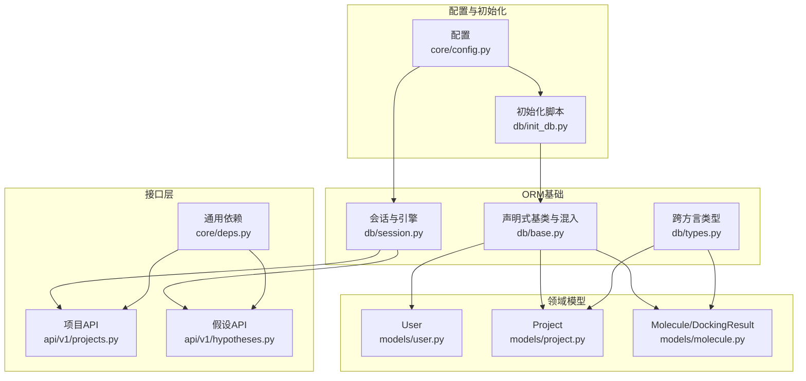

图表来源
- [backend/app/db/base.py:1-48](file://backend/app/db/base.py#L1-L48)
- [backend/app/db/session.py:1-128](file://backend/app/db/session.py#L1-L128)
- [backend/app/db/types.py:1-42](file://backend/app/db/types.py#L1-L42)
- [backend/app/db/init_db.py:1-88](file://backend/app/db/init_db.py#L1-L88)
- [backend/app/core/config.py:1-144](file://backend/app/core/config.py#L1-L144)
- [backend/app/core/deps.py:1-129](file://backend/app/core/deps.py#L1-L129)
- [backend/app/models/user.py:1-36](file://backend/app/models/user.py#L1-L36)
- [backend/app/models/project.py:1-42](file://backend/app/models/project.py#L1-L42)
- [backend/app/models/molecule.py:1-61](file://backend/app/models/molecule.py#L1-L61)
- [backend/app/api/v1/projects.py:1-169](file://backend/app/api/v1/projects.py#L1-L169)
- [backend/app/api/v1/hypotheses.py:1-200](file://backend/app/api/v1/hypotheses.py#L1-L200)

章节来源
- [backend/app/db/base.py:1-48](file://backend/app/db/base.py#L1-L48)
- [backend/app/db/session.py:1-128](file://backend/app/db/session.py#L1-L128)
- [backend/app/db/types.py:1-42](file://backend/app/db/types.py#L1-L42)
- [backend/app/db/init_db.py:1-88](file://backend/app/db/init_db.py#L1-L88)
- [backend/app/core/config.py:1-144](file://backend/app/core/config.py#L1-L144)
- [backend/app/core/deps.py:1-129](file://backend/app/core/deps.py#L1-L129)
- [backend/app/models/user.py:1-36](file://backend/app/models/user.py#L1-L36)
- [backend/app/models/project.py:1-42](file://backend/app/models/project.py#L1-L42)
- [backend/app/models/molecule.py:1-61](file://backend/app/models/molecule.py#L1-L61)
- [backend/app/api/v1/projects.py:1-169](file://backend/app/api/v1/projects.py#L1-L169)
- [backend/app/api/v1/hypotheses.py:1-200](file://backend/app/api/v1/hypotheses.py#L1-L200)

## 核心组件
- 声明式基类与混入：提供统一的Base、UUIDPrimaryKey主键策略与TimestampMixin时间戳字段，确保所有模型具备一致的主键与时序字段语义。
- 跨方言类型：JSONBCompat/INETCompat在PostgreSQL使用原生高效类型，在其他方言（如SQLite）自动降级为兼容类型，兼顾开发与生产一致性。
- 会话与引擎：同时暴露同步与异步Engine及Session工厂；根据是否SQLite差异化配置连接池参数；提供FastAPI依赖get_async_db/get_sync_db，统一生命周期与异常回滚。
- 初始化脚本：导入全部模型注册到Base.metadata，创建表并插入初始数据。
- 配置中心：集中化环境变量加载，包含数据库URL、回显开关等，供引擎与会话工厂消费。
- 依赖注入：封装get_current_user（含短TTL内存缓存）、分页参数、请求ID等通用依赖，降低路由耦合度。

章节来源
- [backend/app/db/base.py:1-48](file://backend/app/db/base.py#L1-L48)
- [backend/app/db/types.py:1-42](file://backend/app/db/types.py#L1-L42)
- [backend/app/db/session.py:1-128](file://backend/app/db/session.py#L1-L128)
- [backend/app/db/init_db.py:1-88](file://backend/app/db/init_db.py#L1-L88)
- [backend/app/core/config.py:1-144](file://backend/app/core/config.py#L1-L144)
- [backend/app/core/deps.py:1-129](file://backend/app/core/deps.py#L1-L129)

## 架构总览
下图展示从配置到模型、会话、API层的整体交互关系，强调异步优先、依赖注入与跨方言类型适配。

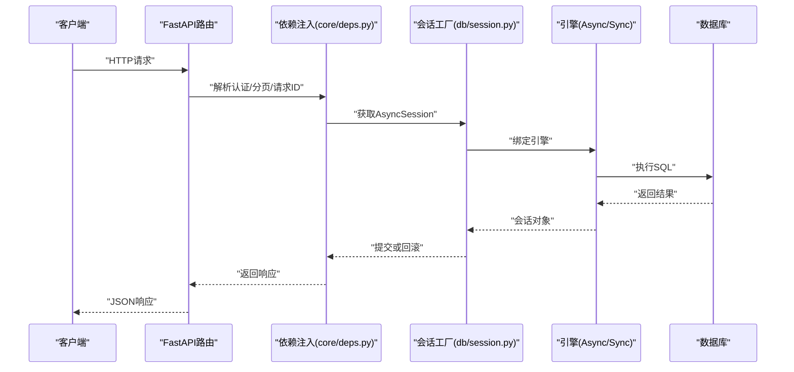

图表来源
- [backend/app/core/deps.py:1-129](file://backend/app/core/deps.py#L1-L129)
- [backend/app/db/session.py:1-128](file://backend/app/db/session.py#L1-L128)
- [backend/app/core/config.py:1-144](file://backend/app/core/config.py#L1-L144)

## 详细组件分析

### SQLAlchemy 2.0 声明式基类与混入
- Base：继承自DeclarativeBase，作为所有模型的根。
- UUIDPrimaryKey：以UUID4作为主键，避免自增ID在分布式场景下的冲突，提升迁移与分片友好性。
- TimestampMixin：维护created_at与updated_at，前者由数据库默认值填充，后者在应用层更新时设置，保证审计可追溯。

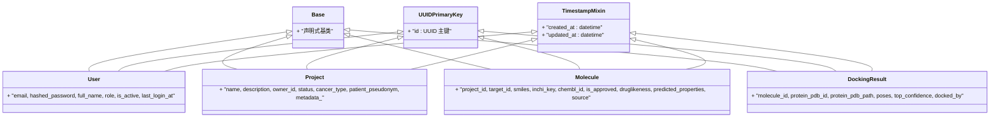

图表来源
- [backend/app/db/base.py:13-47](file://backend/app/db/base.py#L13-L47)
- [backend/app/models/user.py:14-36](file://backend/app/models/user.py#L14-L36)
- [backend/app/models/project.py:14-42](file://backend/app/models/project.py#L14-L42)
- [backend/app/models/molecule.py:14-61](file://backend/app/models/molecule.py#L14-L61)

章节来源
- [backend/app/db/base.py:1-48](file://backend/app/db/base.py#L1-L48)
- [backend/app/models/user.py:1-36](file://backend/app/models/user.py#L1-L36)
- [backend/app/models/project.py:1-42](file://backend/app/models/project.py#L1-L42)
- [backend/app/models/molecule.py:1-61](file://backend/app/models/molecule.py#L1-L61)

### 跨方言类型适配
- JSONBCompat：在PostgreSQL使用JSONB以获得索引与高效查询，其他方言降级为JSON。
- INETCompat：在PostgreSQL使用原生INET，其他方言使用String(45)容纳IPv6地址。

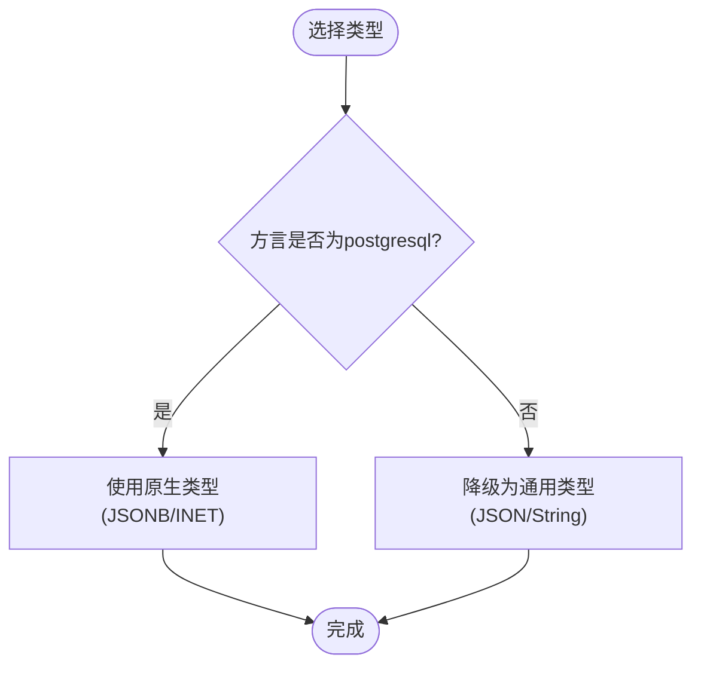

图表来源
- [backend/app/db/types.py:13-41](file://backend/app/db/types.py#L13-L41)

章节来源
- [backend/app/db/types.py:1-42](file://backend/app/db/types.py#L1-L42)

### 会话管理与连接池配置
- 双引擎：同时创建异步与同步Engine，分别服务于FastAPI路由与脚本/工具路径。
- URL转换：将psycopg2/psycopg转为asyncpg驱动，sqlite转为aiosqlite，保持调用端透明。
- 连接池：非SQLite启用pool_pre_ping、pool_size、max_overflow；SQLite跳过池参数以避免不支持错误。
- 会话工厂：expire_on_commit=False减少重复加载开销，autoflush=False便于显式控制刷新时机。
- 依赖注入：get_async_db与get_sync_db提供上下文管理器式生命周期，异常自动回滚，成功则提交。

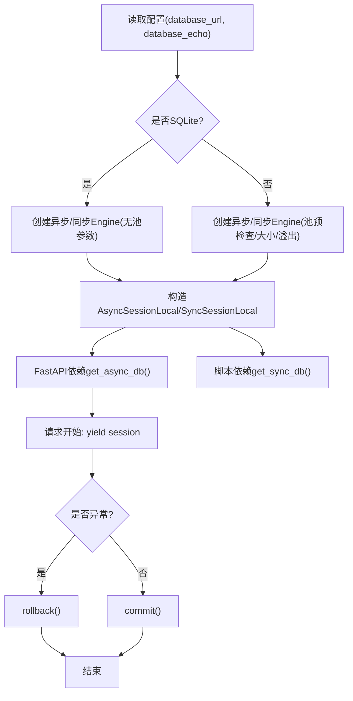

图表来源
- [backend/app/db/session.py:25-91](file://backend/app/db/session.py#L25-L91)
- [backend/app/core/config.py:37-39](file://backend/app/core/config.py#L37-L39)

章节来源
- [backend/app/db/session.py:1-128](file://backend/app/db/session.py#L1-L128)
- [backend/app/core/config.py:1-144](file://backend/app/core/config.py#L1-L144)

### 事务处理机制
- 异步路径：get_async_db在yield后尝试commit，异常分支执行rollback并重新抛出，确保失败不污染状态。
- 同步路径：get_sync_db遵循相同语义，finally确保close释放资源。
- 路由内写操作：在需要细粒度控制的场景，路由可直接db.add/await db.commit/await db.refresh，但需自行处理异常与回滚。

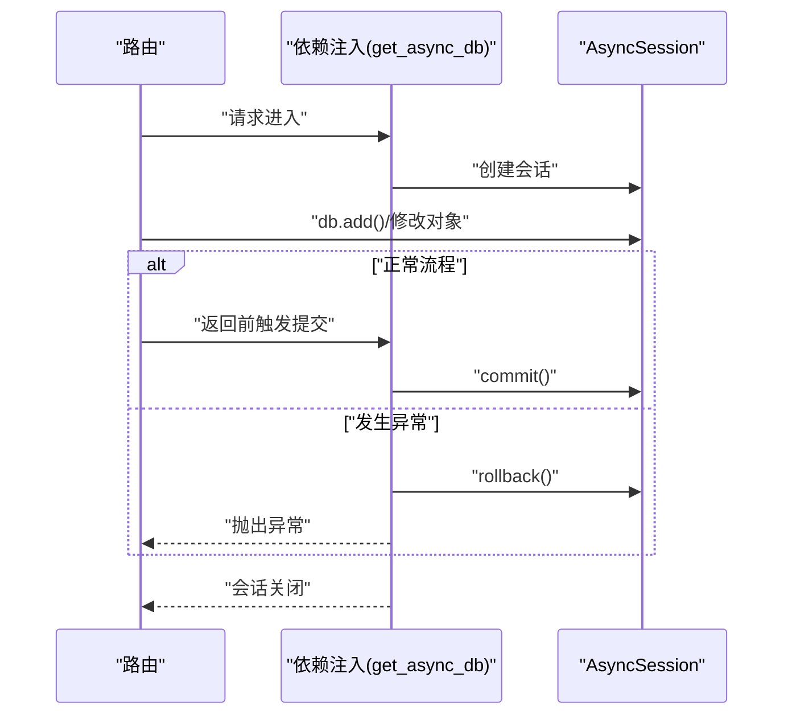

图表来源
- [backend/app/db/session.py:94-123](file://backend/app/db/session.py#L94-L123)
- [backend/app/api/v1/projects.py:87-110](file://backend/app/api/v1/projects.py#L87-L110)

章节来源
- [backend/app/db/session.py:94-123](file://backend/app/db/session.py#L94-L123)
- [backend/app/api/v1/projects.py:87-110](file://backend/app/api/v1/projects.py#L87-L110)

### 依赖注入模式在数据库访问层的应用
- get_current_user：结合JWT校验与短TTL内存缓存，减少频繁查库；禁用用户直接拒绝访问。
- get_pagination：标准化分页参数，统一offset/limit计算。
- get_request_id：透传或生成请求追踪ID，便于日志关联。
- get_db别名：在路由与服务层统一使用get_db名称，简化依赖声明。

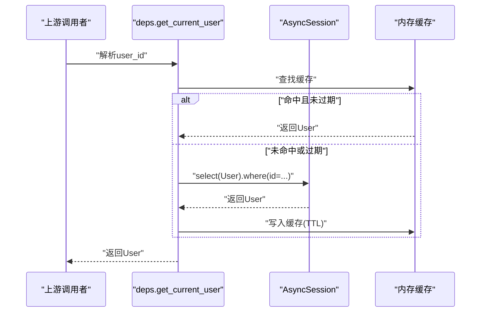

图表来源
- [backend/app/core/deps.py:101-124](file://backend/app/core/deps.py#L101-L124)

章节来源
- [backend/app/core/deps.py:1-129](file://backend/app/core/deps.py#L1-L129)

### 异步操作支持与批量操作优化
- 异步优先：FastAPI路由使用AsyncSession与await db.execute，充分利用事件循环并发优势。
- 批量外部查询：目标发现器对第三方知识库进行分批查询（每批50），降低单次负载与超时风险。
- 批量入库建议：在需要大量写入时，可使用session.bulk_insert_mappings或executemany风格批量语句，减少往返与对象跟踪开销。

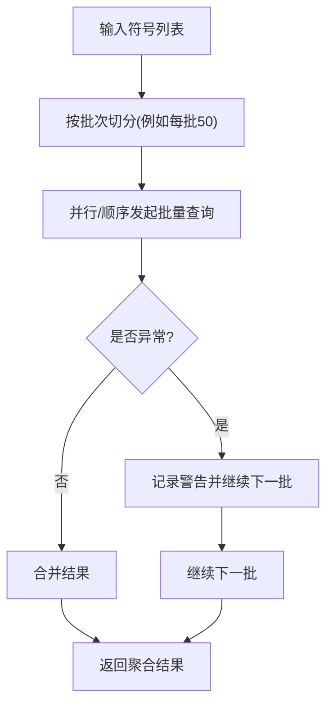

图表来源
- [backend/app/services/analyzer/target_discoverer.py:150-165](file://backend/app/services/analyzer/target_discoverer.py#L150-L165)

章节来源
- [backend/app/services/analyzer/target_discoverer.py:150-165](file://backend/app/services/analyzer/target_discoverer.py#L150-L165)

### N+1查询问题解决方案
- selectinload：在需要加载一对多/多对多关联时使用，一次性拉取关联集合，避免逐条触发子查询。
- 典型用法：在对比多个假设的分析结果时，使用selectinload(Hypothesis.analyses)批量加载分析条目。

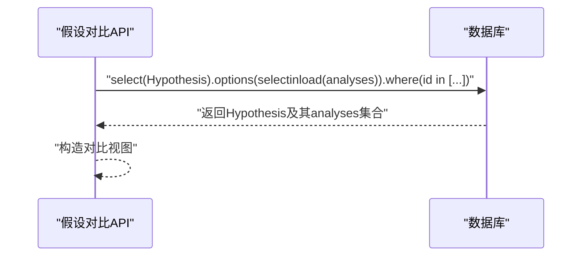

图表来源
- [backend/app/api/v1/hypotheses.py:119-124](file://backend/app/api/v1/hypotheses.py#L119-L124)

章节来源
- [backend/app/api/v1/hypotheses.py:119-124](file://backend/app/api/v1/hypotheses.py#L119-L124)

### 复杂查询构建模式
- 动态过滤：根据角色与状态条件拼接where子句，同时维护count语句用于分页元信息。
- 软删除：通过status字段实现归档而非物理删除，保留历史数据。
- 权限控制：founder可访问全部，普通用户仅能访问own的项目。

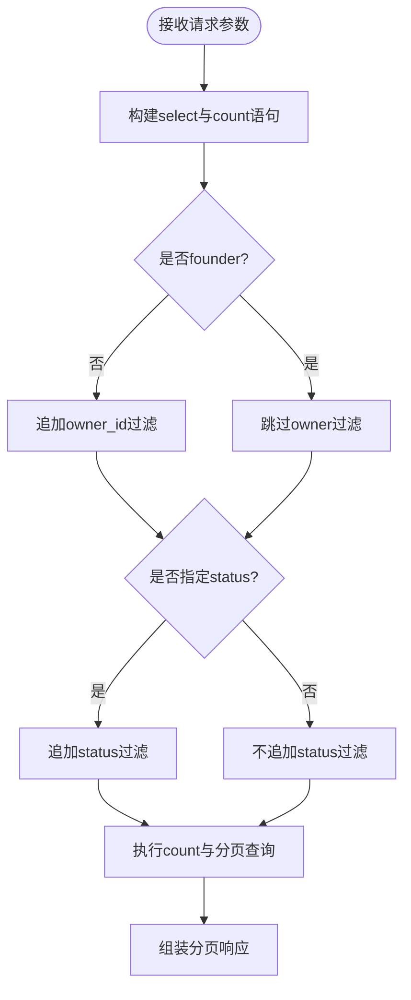

图表来源
- [backend/app/api/v1/projects.py:47-84](file://backend/app/api/v1/projects.py#L47-L84)

章节来源
- [backend/app/api/v1/projects.py:47-84](file://backend/app/api/v1/projects.py#L47-L84)

## 依赖关系分析
- 配置依赖：session与init_db均依赖config提供的database_url与echo开关。
- 模型依赖：所有模型依赖base中的Base与混入；部分模型依赖types中的JSONBCompat。
- 路由依赖：API路由依赖deps中的get_db、get_current_user、get_pagination、get_request_id。
- 初始化依赖：init_db导入所有模型以注册到Base.metadata，并使用async_engine.begin创建表。

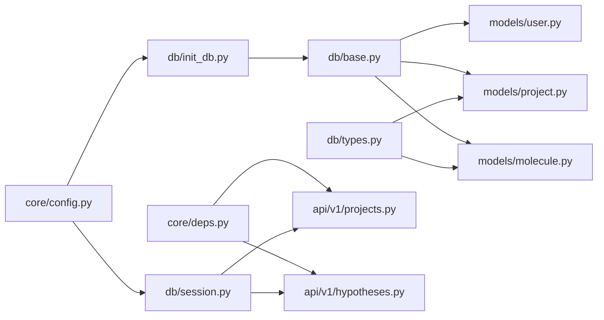

图表来源
- [backend/app/core/config.py:1-144](file://backend/app/core/config.py#L1-L144)
- [backend/app/db/session.py:1-128](file://backend/app/db/session.py#L1-L128)
- [backend/app/db/init_db.py:1-88](file://backend/app/db/init_db.py#L1-L88)
- [backend/app/db/base.py:1-48](file://backend/app/db/base.py#L1-L48)
- [backend/app/db/types.py:1-42](file://backend/app/db/types.py#L1-L42)
- [backend/app/models/user.py:1-36](file://backend/app/models/user.py#L1-L36)
- [backend/app/models/project.py:1-42](file://backend/app/models/project.py#L1-L42)
- [backend/app/models/molecule.py:1-61](file://backend/app/models/molecule.py#L1-L61)
- [backend/app/core/deps.py:1-129](file://backend/app/core/deps.py#L1-L129)
- [backend/app/api/v1/projects.py:1-169](file://backend/app/api/v1/projects.py#L1-L169)
- [backend/app/api/v1/hypotheses.py:1-200](file://backend/app/api/v1/hypotheses.py#L1-L200)

章节来源
- [backend/app/core/config.py:1-144](file://backend/app/core/config.py#L1-L144)
- [backend/app/db/session.py:1-128](file://backend/app/db/session.py#L1-L128)
- [backend/app/db/init_db.py:1-88](file://backend/app/db/init_db.py#L1-L88)
- [backend/app/db/base.py:1-48](file://backend/app/db/base.py#L1-L48)
- [backend/app/db/types.py:1-42](file://backend/app/db/types.py#L1-L42)
- [backend/app/models/user.py:1-36](file://backend/app/models/user.py#L1-L36)
- [backend/app/models/project.py:1-42](file://backend/app/models/project.py#L1-L42)
- [backend/app/models/molecule.py:1-61](file://backend/app/models/molecule.py#L1-L61)
- [backend/app/core/deps.py:1-129](file://backend/app/core/deps.py#L1-L129)
- [backend/app/api/v1/projects.py:1-169](file://backend/app/api/v1/projects.py#L1-L169)
- [backend/app/api/v1/hypotheses.py:1-200](file://backend/app/api/v1/hypotheses.py#L1-L200)

## 性能考量
- 连接池调优：在非SQLite环境下启用pool_pre_ping、合理设置pool_size与max_overflow，避免连接耗尽与空闲连接失效。
- 会话策略：expire_on_commit=False可减少二次加载成本；autoflush=False便于显式控制刷新时机，避免意外中间查询。
- 懒加载与预加载：对高频访问的关联集合使用selectinload预加载，避免N+1；对大对象或低频字段考虑延迟加载。
- 批量写入：大批量插入建议使用bulk操作或executemany风格，减少对象跟踪与往返开销。
- 外部I/O批量化：对外部知识库的批量查询采用分批策略，平衡吞吐与稳定性。

[本节为通用指导，无需特定文件引用]

## 故障排查指南
- 连接失败或超时：检查database_url是否正确、驱动是否匹配（psycopg2/psycopg→asyncpg，sqlite→aiosqlite），确认网络与端口可达。
- SQLite池参数报错：确认已走SQLite分支，避免传入不支持的池参数。
- 会话未提交或回滚：确认依赖注入的生命周期是否被覆盖；若手动提交，请确保异常分支执行rollback。
- 用户鉴权失败：检查JWT配置与用户状态（is_active），关注依赖注入中的缓存失效与过期行为。
- 初始化失败：确认已导入所有模型以注册到Base.metadata；检查数据库权限与schema创建日志。

章节来源
- [backend/app/db/session.py:25-91](file://backend/app/db/session.py#L25-L91)
- [backend/app/db/init_db.py:35-61](file://backend/app/db/init_db.py#L35-L61)
- [backend/app/core/deps.py:101-124](file://backend/app/core/deps.py#L101-L124)

## 结论
本ORM架构以SQLAlchemy 2.0为核心，通过声明式基类与混入统一主键与时间戳语义，借助跨方言类型适配保障开发/生产一致性；会话与连接池管理兼顾异步优先与脚本兼容，配合FastAPI依赖注入形成清晰的数据访问边界。实践中应重视N+1问题的预防、批量操作的优化与事务边界的明确，从而在AI药物设计的复杂查询与高并发场景下获得稳定与高性能表现。

[本节为总结性内容，无需特定文件引用]

## 附录
- 初始化命令参考：运行初始化脚本以创建表与初始用户。
- 配置项说明：database_url、database_echo等关键配置项位于配置模块。

章节来源
- [backend/app/db/init_db.py:64-87](file://backend/app/db/init_db.py#L64-L87)
- [backend/app/core/config.py:37-39](file://backend/app/core/config.py#L37-L39)