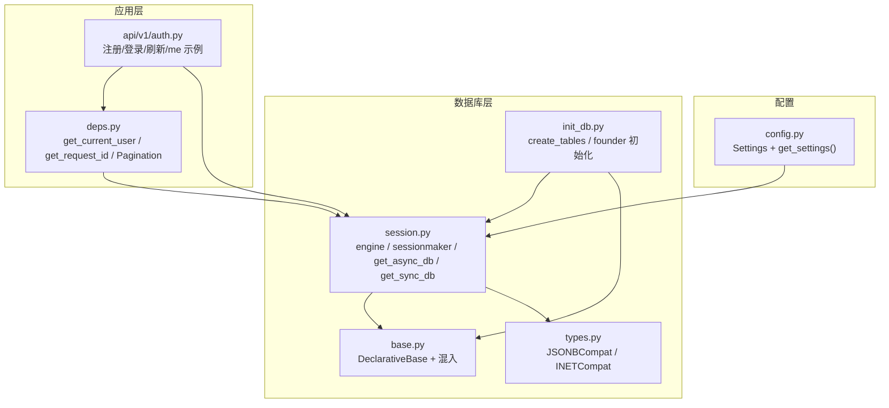
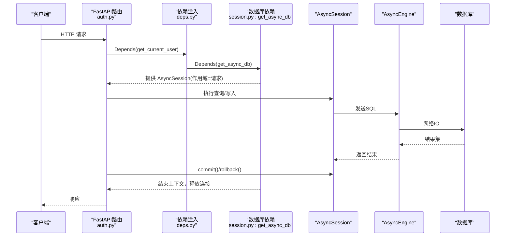
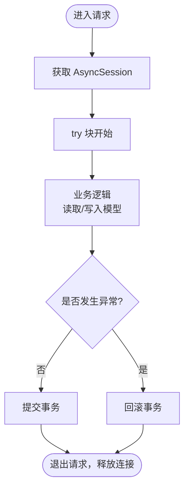
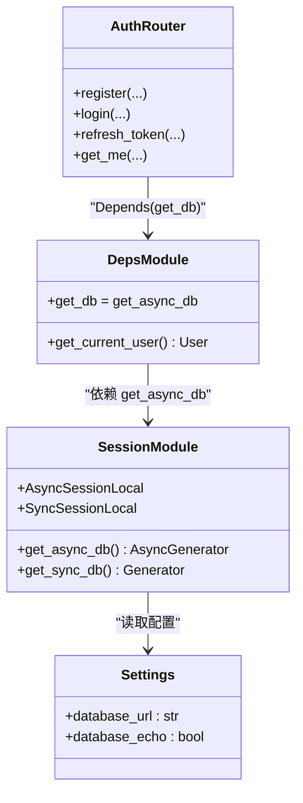
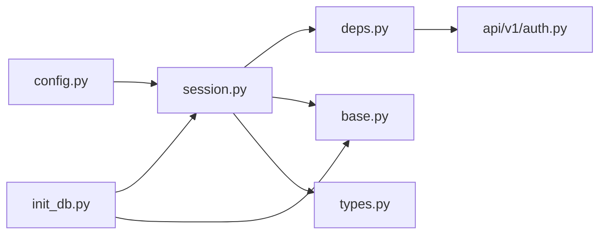

# 会话管理与连接池

<cite>
**本文引用的文件**   
- [session.py](file://backend/app/db/session.py)
- [deps.py](file://backend/app/core/deps.py)
- [config.py](file://backend/app/core/config.py)
- [init_db.py](file://backend/app/db/init_db.py)
- [base.py](file://backend/app/db/base.py)
- [types.py](file://backend/app/db/types.py)
- [auth.py](file://backend/app/api/v1/auth.py)
</cite>

## 目录
1. [简介](#简介)
2. [项目结构](#项目结构)
3. [核心组件](#核心组件)
4. [架构总览](#架构总览)
5. [详细组件分析](#详细组件分析)
6. [依赖关系分析](#依赖关系分析)
7. [性能与连接池配置](#性能与连接池配置)
8. [故障排查指南](#故障排查指南)
9. [结论](#结论)
10. [附录：最佳实践与示例路径](#附录最佳实践与示例路径)

## 简介
本文件面向AI药物设计系统的数据库层，系统性阐述SQLAlchemy会话的生命周期管理、连接池参数与策略、依赖注入模式（get_db）、事务边界控制、异步支持、批量优化、查询监控、泄漏防护与异常处理等主题。文档以仓库实际实现为依据，提供可视化图示与可追溯的源码路径，帮助读者在生产环境中正确、安全、高效地使用数据库会话。

## 项目结构
与数据库会话管理直接相关的代码主要分布在以下模块：
- 会话与引擎：backend/app/db/session.py
- 通用依赖注入：backend/app/core/deps.py
- 应用配置（含数据库URL与开关）：backend/app/core/config.py
- 初始化脚本（建表/种子数据）：backend/app/db/init_db.py
- ORM基类与混入：backend/app/db/base.py
- 跨方言类型兼容：backend/app/db/types.py
- API使用示例（认证路由）：backend/app/api/v1/auth.py

图表来源
- [config.py:21-144](file://backend/app/core/config.py#L21-L144)
- [session.py:1-128](file://backend/app/db/session.py#L1-L128)
- [base.py:1-48](file://backend/app/db/base.py#L1-L48)
- [types.py:1-42](file://backend/app/db/types.py#L1-L42)
- [init_db.py:1-88](file://backend/app/db/init_db.py#L1-L88)
- [deps.py:1-129](file://backend/app/core/deps.py#L1-L129)
- [auth.py:1-147](file://backend/app/api/v1/auth.py#L1-L147)

章节来源
- [config.py:21-144](file://backend/app/core/config.py#L21-L144)
- [session.py:1-128](file://backend/app/db/session.py#L1-L128)
- [deps.py:1-129](file://backend/app/core/deps.py#L1-L129)
- [init_db.py:1-88](file://backend/app/db/init_db.py#L1-L88)
- [base.py:1-48](file://backend/app/db/base.py#L1-L48)
- [types.py:1-42](file://backend/app/db/types.py#L1-L42)
- [auth.py:1-147](file://backend/app/api/v1/auth.py#L1-L147)

## 核心组件
- 引擎与会话工厂
  - 同步/异步双引擎：根据数据库URL自动选择驱动；非SQLite启用连接池参数；SQLite走最小化配置。
  - 会话工厂：AsyncSessionLocal/SyncSessionLocal，关闭自动过期与自动刷新，便于在请求范围内复用对象。
- 依赖注入
  - get_async_db/get_sync_db：生成器型依赖，确保请求结束时提交或回滚并释放资源。
  - deps.get_db别名：统一对外暴露“get_db”名称，简化路由声明。
- 配置
  - Settings集中管理database_url、database_echo等；通过lru_cache保证单例。
- 初始化
  - init_db使用async_engine.begin创建所有表，并使用SyncSessionLocal插入初始用户。

章节来源
- [session.py:25-91](file://backend/app/db/session.py#L25-L91)
- [session.py:94-128](file://backend/app/db/session.py#L94-L128)
- [config.py:21-144](file://backend/app/core/config.py#L21-L144)
- [init_db.py:35-88](file://backend/app/db/init_db.py#L35-L88)

## 架构总览
下图展示了FastAPI请求从路由到数据库的完整调用链，以及会话生命周期与事务边界。

图表来源
- [auth.py:41-147](file://backend/app/api/v1/auth.py#L41-L147)
- [deps.py:101-124](file://backend/app/core/deps.py#L101-L124)
- [session.py:94-128](file://backend/app/db/session.py#L94-L128)

## 详细组件分析

### 会话生命周期与事务边界
- 异步会话（FastAPI）
  - 通过生成器依赖 get_async_db 提供会话，使用 async with 管理作用域。
  - 正常路径：yield 后执行 commit；异常路径：rollback 并重新抛出异常。
  - 会话工厂设置 expire_on_commit=False、autoflush=False，避免不必要的刷新与延迟加载开销。
- 同步会话（脚本/CLI）
  - get_sync_db 提供同步会话，finally 中显式 close，确保连接回收。
- 作用域
  - FastAPI 将每个HTTP请求视为一个会话作用域，请求结束即释放连接。
- 事务边界
  - 默认在每个请求内开启隐式事务；commit/rollback由依赖函数统一处理。

图表来源
- [session.py:94-128](file://backend/app/db/session.py#L94-L128)

章节来源
- [session.py:82-128](file://backend/app/db/session.py#L82-L128)

### 依赖注入模式与 get_db 原理
- 依赖注入入口
  - deps.py 暴露 get_db 别名指向 get_async_db，供路由与上层依赖使用。
- 当前用户依赖
  - get_current_user 依赖 get_async_db 获取会话，结合短TTL内存缓存减少重复查询。
- 使用方式
  - 路由函数通过 Depends(get_db) 或 Depends(get_current_user) 注入会话。

图表来源
- [deps.py:1-129](file://backend/app/core/deps.py#L1-L129)
- [session.py:1-128](file://backend/app/db/session.py#L1-L128)
- [config.py:21-144](file://backend/app/core/config.py#L21-L144)
- [auth.py:1-147](file://backend/app/api/v1/auth.py#L1-L147)

章节来源
- [deps.py:1-129](file://backend/app/core/deps.py#L1-L129)
- [auth.py:1-147](file://backend/app/api/v1/auth.py#L1-L147)

### 异步操作支持与并发模型
- 异步引擎与异步会话：FastAPI路由全部基于异步IO，避免阻塞事件循环。
- URL转换：_to_async_url 将 psycopg2/psycopg 转为 asyncpg，sqlite 转为 aiosqlite。
- 并发建议：在高并发场景下，合理设置 pool_size 与 max_overflow，并结合连接池探测（pool_pre_ping）提升健壮性。

章节来源
- [session.py:25-80](file://backend/app/db/session.py#L25-L80)

### 批量操作与查询优化
- 批量写入
  - 使用 session.add_all([...]) 配合一次 commit 可减少往返次数。
  - 对于大数量导入，可分批次提交，避免长事务锁竞争。
- 查询优化
  - 使用 select(...).options(load_only(...)) 仅加载必要字段。
  - 对高频过滤字段建立索引（如 users.email）。
- 对象状态
  - expire_on_commit=False 允许在提交后继续访问已加载对象的属性，减少额外查询。

章节来源
- [session.py:82-91](file://backend/app/db/session.py#L82-L91)
- [user.py:1-36](file://backend/app/models/user.py#L1-L36)

### 查询性能监控
- SQL日志
  - database_echo=True 可在开发环境打印SQL语句，便于定位慢查询。
- 指标采集（建议）
  - 在中间件或服务层记录每次请求的SQL耗时、连接等待时间、事务时长。
  - 结合数据库侧慢查询日志与连接池统计进行综合诊断。

章节来源
- [config.py:37-39](file://backend/app/core/config.py#L37-L39)
- [session.py:53-80](file://backend/app/db/session.py#L53-L80)

### 连接泄漏防护与清理机制
- 泄漏防护
  - 依赖函数使用 try/except 确保异常时 rollback，并在 finally 中关闭连接（同步）或退出上下文（异步）。
  - SQLite 不使用连接池参数，避免不兼容导致的资源问题。
- 清理机制
  - 同步：finally db.close()
  - 异步：async with 自动释放连接至池
- 建议
  - 避免在会话外持有ORM对象引用；必要时使用 make_transient 解除绑定后再缓存。

章节来源
- [session.py:94-128](file://backend/app/db/session.py#L94-L128)
- [deps.py:32-40](file://backend/app/core/deps.py#L32-L40)

### 异常处理策略
- 统一回滚：任何未捕获异常都会触发 rollback，防止脏数据。
- 错误传播：依赖函数重新抛出异常，交由上层异常处理器转换为HTTP响应。
- 业务异常：如 UnauthorizedError、ConflictError 等在路由层明确抛出，保持语义清晰。

章节来源
- [session.py:104-121](file://backend/app/db/session.py#L104-L121)
- [auth.py:41-147](file://backend/app/api/v1/auth.py#L41-L147)

## 依赖关系分析
- 模块耦合
  - session.py 依赖 config.py 获取数据库URL与echo开关。
  - deps.py 依赖 session.py 的 get_async_db，并提供更高层的 get_current_user。
  - auth.py 作为典型消费者，演示如何在路由中使用 get_db 与 get_current_user。
  - init_db.py 使用 async_engine 和 SyncSessionLocal 完成建表与种子数据。
- 外部依赖
  - SQLAlchemy（同步/异步）、pydantic-settings、FastAPI。

图表来源
- [config.py:21-144](file://backend/app/core/config.py#L21-L144)
- [session.py:1-128](file://backend/app/db/session.py#L1-L128)
- [deps.py:1-129](file://backend/app/core/deps.py#L1-L129)
- [auth.py:1-147](file://backend/app/api/v1/auth.py#L1-L147)
- [init_db.py:1-88](file://backend/app/db/init_db.py#L1-L88)
- [base.py:1-48](file://backend/app/db/base.py#L1-L48)
- [types.py:1-42](file://backend/app/db/types.py#L1-L42)

章节来源
- [config.py:21-144](file://backend/app/core/config.py#L21-L144)
- [session.py:1-128](file://backend/app/db/session.py#L1-L128)
- [deps.py:1-129](file://backend/app/core/deps.py#L1-L129)
- [auth.py:1-147](file://backend/app/api/v1/auth.py#L1-L147)
- [init_db.py:1-88](file://backend/app/db/init_db.py#L1-L88)
- [base.py:1-48](file://backend/app/db/base.py#L1-L48)
- [types.py:1-42](file://backend/app/db/types.py#L1-L42)

## 性能与连接池配置
- 连接池参数（非SQLite）
  - pool_pre_ping=True：在每次获取连接前探测连接有效性，降低死连接风险。
  - pool_size=10：常驻连接数，适合中等并发。
  - max_overflow=20：峰值时可临时扩展的连接上限。
- SQLite差异
  - 不支持连接池参数，采用最小化配置以避免不兼容。
- 调优建议
  - 生产环境根据QPS与平均响应时间调整 pool_size 与 max_overflow。
  - 针对长事务与批处理任务，适当提高 max_overflow，但需关注数据库端最大连接限制。
  - 开启 database_echo 仅在开发/测试环境用于诊断。

章节来源
- [session.py:64-80](file://backend/app/db/session.py#L64-L80)
- [config.py:37-39](file://backend/app/core/config.py#L37-L39)

## 故障排查指南
- 症状：连接耗尽或频繁超时
  - 检查 pool_size/max_overflow 是否过小；确认是否存在长事务或未释放连接。
  - 查看数据库端最大连接数与当前活跃连接。
- 症状：偶发“连接已关闭”
  - 确认 pool_pre_ping=True 已启用；检查网络抖动与数据库重启。
- 症状：对象属性为None或延迟加载失败
  - 确认 expire_on_commit=False 的配置；避免在会话外访问未加载属性。
- 症状：SQLite无法使用连接池参数
  - 确认代码分支对SQLite做了差异化处理。

章节来源
- [session.py:51-80](file://backend/app/db/session.py#L51-L80)
- [session.py:82-91](file://backend/app/db/session.py#L82-L91)

## 结论
本系统通过统一的会话工厂与依赖注入，实现了请求级会话作用域、自动事务边界与资源回收。连接池参数在非SQLite环境下启用，兼顾稳定性与吞吐。建议在开发与生产分别启用不同的监控与日志策略，并根据负载特征持续优化连接池与查询策略。

## 附录：最佳实践与示例路径
- 在路由中注入会话
  - 参考：[auth.py:41-147](file://backend/app/api/v1/auth.py#L41-L147)
- 使用 get_current_user 获取当前用户（含缓存）
  - 参考：[deps.py:101-124](file://backend/app/core/deps.py#L101-L124)
- 同步脚本中的会话使用
  - 参考：[init_db.py:42-61](file://backend/app/db/init_db.py#L42-L61)
- 跨方言类型定义
  - 参考：[types.py:13-41](file://backend/app/db/types.py#L13-L41)
- ORM基类与混入
  - 参考：[base.py:13-47](file://backend/app/db/base.py#L13-L47)