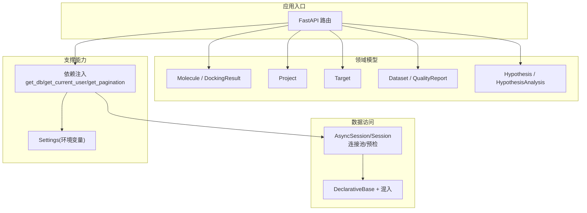
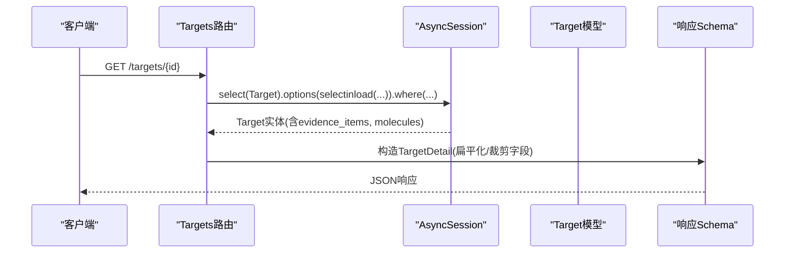
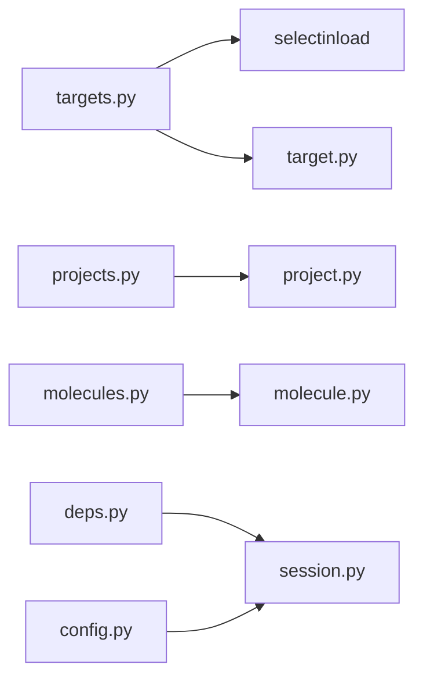
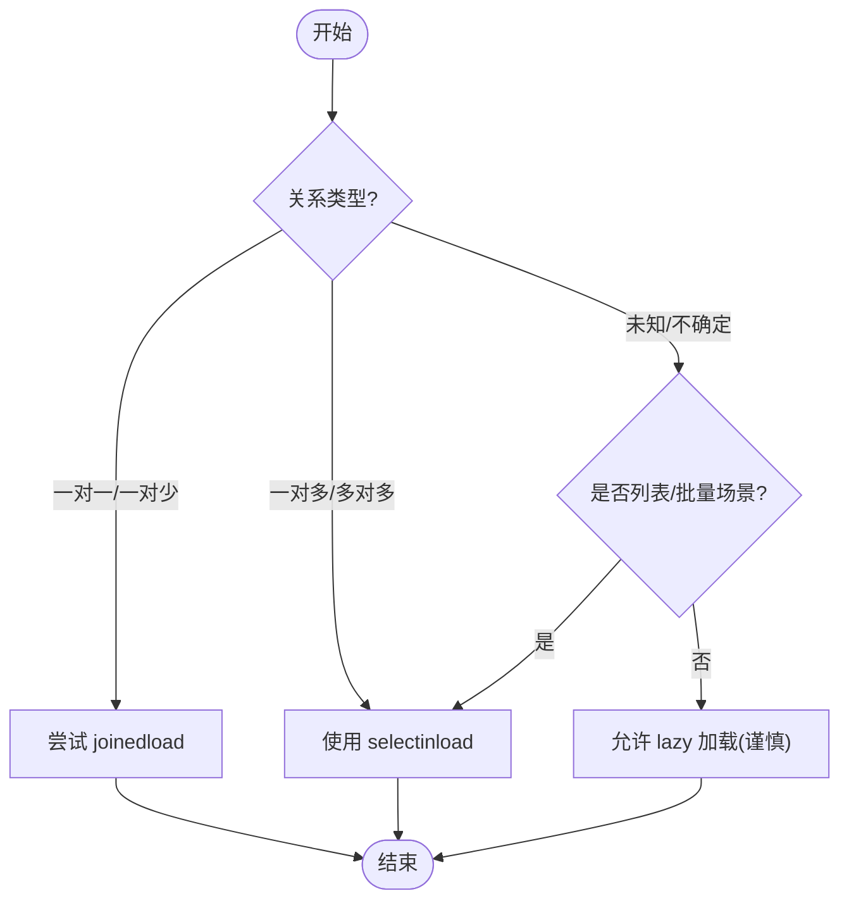
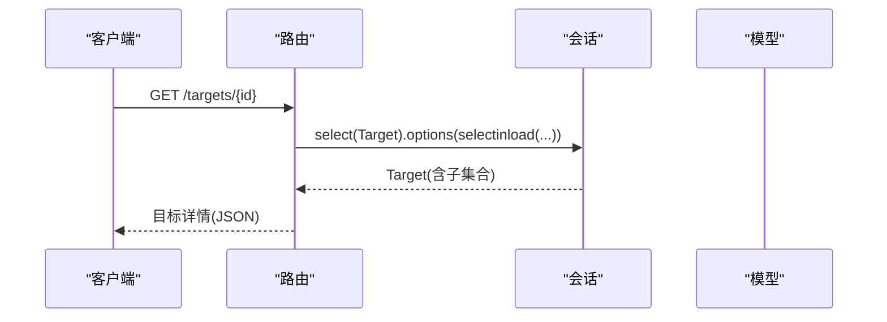

# 查询优化与性能调优

<cite>
**本文引用的文件**
- [backend/app/db/base.py](file://backend/app/db/base.py)
- [backend/app/db/session.py](file://backend/app/db/session.py)
- [backend/app/core/deps.py](file://backend/app/core/deps.py)
- [backend/app/core/config.py](file://backend/app/core/config.py)
- [backend/app/models/molecule.py](file://backend/app/models/molecule.py)
- [backend/app/models/project.py](file://backend/app/models/project.py)
- [backend/app/models/target.py](file://backend/app/models/target.py)
- [backend/app/models/dataset.py](file://backend/app/models/dataset.py)
- [backend/app/models/hypothesis.py](file://backend/app/models/hypothesis.py)
- [backend/app/api/v1/molecules.py](file://backend/app/api/v1/molecules.py)
- [backend/app/api/v1/projects.py](file://backend/app/api/v1/projects.py)
- [backend/app/api/v1/targets.py](file://backend/app/api/v1/targets.py)
- [tests/perf_baseline.py](file://tests/perf_baseline.py)
</cite>

## 目录
1. [引言](#引言)
2. [项目结构](#项目结构)
3. [核心组件](#核心组件)
4. [架构总览](#架构总览)
5. [详细组件分析](#详细组件分析)
6. [依赖关系分析](#依赖关系分析)
7. [性能考量](#性能考量)
8. [故障排查指南](#故障排查指南)
9. [结论](#结论)
10. [附录](#附录)

## 引言
本文件面向AI药物设计系统的ORM层，聚焦于SQLAlchemy在异步FastAPI服务中的查询优化实践。内容涵盖：
- N+1查询问题的识别与解决方案（selectinload、joinedload等）
- 复杂查询构建模式、子查询优化与索引利用策略
- 批量操作最佳实践、分页查询优化
- 缓存策略集成（内存/Redis）
- 查询性能分析工具使用、慢查询日志记录、执行计划解读
- 实际优化案例与基准测试方法

## 项目结构
后端采用分层架构：API路由层 → 领域模型层 → ORM会话与引擎配置。关键路径包括：
- 数据库会话与引擎初始化（同步/异步双栈）
- 通用依赖注入（用户对象短TTL缓存、分页参数、请求ID）
- 各业务模块的列表/详情接口实现

图表来源
- [backend/app/db/session.py:50-91](file://backend/app/db/session.py#L50-L91)
- [backend/app/db/base.py:13-47](file://backend/app/db/base.py#L13-L47)
- [backend/app/core/deps.py:67-128](file://backend/app/core/deps.py#L67-L128)
- [backend/app/core/config.py:21-48](file://backend/app/core/config.py#L21-L48)

章节来源
- [backend/app/db/session.py:1-128](file://backend/app/db/session.py#L1-L128)
- [backend/app/db/base.py:1-48](file://backend/app/db/base.py#L1-L48)
- [backend/app/core/deps.py:1-129](file://backend/app/core/deps.py#L1-L129)
- [backend/app/core/config.py:1-144](file://backend/app/core/config.py#L1-L144)

## 核心组件
- 数据库会话与引擎
  - 提供异步/同步engine与sessionmaker；非SQLite场景启用pool_pre_ping、pool_size、max_overflow；SQLite走aiosqlite驱动适配。
  - 会话默认expire_on_commit=False，减少重复加载开销。
- 声明式基类与混入
  - Base为所有模型的DeclarativeBase；UUIDPrimaryKey与TimestampMixin统一主键与时间戳字段。
- 依赖注入
  - get_async_db用于FastAPI路由；get_current_user对User对象进行短TTL内存缓存；get_pagination提供offset/limit计算。
- 模型与关系
  - Project、Target、Molecule、Dataset、Hypothesis及其关联关系定义清晰，部分外键列已建索引。

章节来源
- [backend/app/db/session.py:50-91](file://backend/app/db/session.py#L50-L91)
- [backend/app/db/base.py:13-47](file://backend/app/db/base.py#L13-L47)
- [backend/app/core/deps.py:67-128](file://backend/app/core/deps.py#L67-L128)
- [backend/app/models/project.py:14-41](file://backend/app/models/project.py#L14-L41)
- [backend/app/models/target.py:14-51](file://backend/app/models/target.py#L14-L51)
- [backend/app/models/molecule.py:14-61](file://backend/app/models/molecule.py#L14-L61)
- [backend/app/models/dataset.py:15-70](file://backend/app/models/dataset.py#L15-L70)
- [backend/app/models/hypothesis.py:15-66](file://backend/app/models/hypothesis.py#L15-L66)

## 架构总览
下图展示一次“靶点详情”请求的典型调用链，重点体现N+1规避与预加载策略的使用位置。

图表来源
- [backend/app/api/v1/targets.py:182-225](file://backend/app/api/v1/targets.py#L182-L225)
- [backend/app/models/target.py:43-48](file://backend/app/models/target.py#L43-L48)

## 详细组件分析

### 1) 会话与连接池配置（影响并发与稳定性）
- 关键点
  - 非SQLite：开启pool_pre_ping，设置pool_size与max_overflow，避免长连接失效导致的异常。
  - SQLite：自动切换至aiosqlite驱动URL，禁用连接池参数。
  - expire_on_commit=False：提交后仍可使用已加载属性，减少二次加载。
- 建议
  - 生产环境根据QPS调整pool_size/max_overflow；监控连接等待与超时。
  - 在压测中观察p95延迟变化，评估连接池上限是否合理。

章节来源
- [backend/app/db/session.py:50-91](file://backend/app/db/session.py#L50-L91)
- [backend/app/db/session.py:82-91](file://backend/app/db/session.py#L82-L91)

### 2) 依赖注入与用户缓存（降低认证链路开销）
- 关键点
  - get_current_user优先从内存缓存读取User对象，过期再查库；使用make_transient使对象脱离会话后可安全缓存。
  - get_pagination提供page/page_size到offset/limit转换，限制最大页大小防止大结果集。
- 建议
  - 将短TTL缓存迁移至Redis以支持多实例共享；注意缓存穿透/击穿防护。
  - 对高频只读用户信息可结合ETag或Last-Modified做HTTP缓存。

章节来源
- [backend/app/core/deps.py:26-65](file://backend/app/core/deps.py#L26-L65)
- [backend/app/core/deps.py:67-88](file://backend/app/core/deps.py#L67-L88)
- [backend/app/core/deps.py:101-124](file://backend/app/core/deps.py#L101-L124)

### 3) 模型与索引（提升过滤/排序/关联效率）
- 关键点
  - 常用过滤字段已加索引：project_id、target_id、gene_symbol、owner_id等。
  - UUID主键利于分布式生成，但需确保外键索引完善。
- 建议
  - 针对复合条件（如project_id + status）考虑复合索引。
  - 对JSONB字段频繁查询的键值建立GIN索引（PostgreSQL）。

章节来源
- [backend/app/models/molecule.py:23-30](file://backend/app/models/molecule.py#L23-L30)
- [backend/app/models/project.py:24-30](file://backend/app/models/project.py#L24-L30)
- [backend/app/models/target.py:29-36](file://backend/app/models/target.py#L29-L36)
- [backend/app/models/dataset.py:27-30](file://backend/app/models/dataset.py#L27-L30)

### 4) 列表接口与分页（避免全表扫描与大结果集）
- 现状
  - 列表接口普遍采用count() + limit/offset分页，按created_at或评分排序。
- 风险与建议
  - count(*)在大表上可能较慢，可引入近似计数或物化统计视图。
  - offset深分页性能退化明显，建议基于游标（keyset）分页：记录上一页最后一条的排序键，下一页用WHERE > last_key LIMIT N。
  - 对高频过滤字段建立合适索引，避免回表。

章节来源
- [backend/app/api/v1/molecules.py:146-191](file://backend/app/api/v1/molecules.py#L146-L191)
- [backend/app/api/v1/projects.py:47-84](file://backend/app/api/v1/projects.py#L47-L84)
- [backend/app/api/v1/targets.py:133-179](file://backend/app/api/v1/targets.py#L133-L179)

### 5) 详情接口与N+1问题（预加载策略）
- 现状
  - 靶点详情使用selectinload一次性加载证据项与相关分子，有效避免N+1。
- 对比与选择
  - joinedload：适合一对一/一对少且需要JOIN合并行数的场景，可减少往返次数，但可能导致笛卡尔积放大。
  - selectinload：适合一对多/多对多，拆分为两条SQL，通常更可控。
  - lazy loading：默认懒加载，易引发N+1，应尽量避免在列表/批量场景使用。
- 建议
  - 仅按需加载必要字段，必要时使用with_entities/select仅取列，减少序列化成本。
  - 对超大集合（如molecules）考虑分页或摘要返回。

章节来源
- [backend/app/api/v1/targets.py:182-225](file://backend/app/api/v1/targets.py#L182-L225)
- [backend/app/models/target.py:43-48](file://backend/app/models/target.py#L43-L48)

### 6) 复杂查询构建模式与子查询优化
- 模式
  - 动态条件拼接：通过if分支逐步追加where子句，保持可读性与可扩展性。
  - 子查询：当需要聚合/存在性判断时，使用子查询或窗口函数，避免多次往返。
- 建议
  - 尽量让数据库完成聚合与过滤，减少Python侧循环处理。
  - 对复杂统计，考虑物化视图或定时任务预计算。

章节来源
- [backend/app/api/v1/molecules.py:157-175](file://backend/app/api/v1/molecules.py#L157-L175)
- [backend/app/api/v1/projects.py:56-71](file://backend/app/api/v1/projects.py#L56-L71)
- [backend/app/api/v1/targets.py:144-162](file://backend/app/api/v1/targets.py#L144-L162)

### 7) 批量操作最佳实践
- 写入
  - 使用bulk_insert_mappings/bulk_update_mappings减少ORM开销。
  - 事务内分批提交，控制单事务大小，避免长事务锁竞争。
- 更新
  - 对大批量字段更新，优先使用原生UPDATE语句或exec_driver_sql。
- 删除
  - 级联删除需谨慎，必要时分批次软删除并清理关联。

[本节为通用指导，不直接分析具体文件]

### 8) 缓存策略集成
- 内存缓存
  - 当前get_current_user使用进程内短TTL缓存，适合单机部署。
- Redis缓存
  - 推荐将热点数据（用户、字典、统计摘要）放入Redis，设置合理TTL与失效策略。
- HTTP缓存
  - 对静态或低频变更资源，使用ETag/Cache-Control减少重复请求。

章节来源
- [backend/app/core/deps.py:26-65](file://backend/app/core/deps.py#L26-L65)

### 9) 查询性能分析与慢查询日志
- SQL日志
  - 通过database_echo开启SQL输出（开发环境），生产环境建议关闭或采样。
- 数据库层慢查询
  - PostgreSQL启用log_min_duration_statement，收集慢查询样本。
- 执行计划
  - 使用EXPLAIN/EXPLAIN ANALYZE分析关键查询，关注Seq Scan、Index Scan、Nested Loop vs Hash Join、Sort/Filter成本。
- 指标采集
  - 结合APM/日志系统，记录每个接口的P95/P99耗时与错误率。

章节来源
- [backend/app/core/config.py:37-39](file://backend/app/core/config.py#L37-L39)
- [backend/app/db/session.py:53-80](file://backend/app/db/session.py#L53-L80)

### 10) 实际优化案例与基准测试
- 案例一：靶点详情N+1修复
  - 现象：未预加载时，遍历evidence_items/molecules触发大量额外查询。
  - 方案：使用selectinload一次性加载，显著降低RT与DB压力。
  - 验证：前后端基准脚本对比平均/分位耗时。
- 案例二：列表分页优化
  - 现象：deep offset导致排序与扫描变慢。
  - 方案：改为keyset分页，避免大偏移量。
- 基准测试
  - 后端：tests/perf_baseline.py覆盖健康检查、认证、CRUD、列表、并发等场景，输出perf_baseline.json。
  - 前端：tests/perf_quick.py测量页面首屏与二次加载，输出perf_after_optimization.json。

章节来源
- [backend/app/api/v1/targets.py:182-225](file://backend/app/api/v1/targets.py#L182-L225)
- [tests/perf_baseline.py:140-353](file://tests/perf_baseline.py#L140-L353)
- [tests/perf_quick.py:26-118](file://tests/perf_quick.py#L26-L118)

## 依赖关系分析
- 组件耦合
  - API路由依赖deps提供的db/user/pagination；models之间通过relationship定义关联。
- 外部依赖
  - SQLAlchemy异步驱动（asyncpg/aiosqlite）、Pydantic Settings、FastAPI。
- 潜在环依赖
  - 模型间双向引用通过字符串前向引用解决，避免导入环。

图表来源
- [backend/app/api/v1/targets.py:182-225](file://backend/app/api/v1/targets.py#L182-L225)
- [backend/app/api/v1/projects.py:47-84](file://backend/app/api/v1/projects.py#L47-L84)
- [backend/app/api/v1/molecules.py:146-191](file://backend/app/api/v1/molecules.py#L146-L191)
- [backend/app/core/deps.py:101-128](file://backend/app/core/deps.py#L101-L128)
- [backend/app/db/session.py:50-91](file://backend/app/db/session.py#L50-L91)
- [backend/app/core/config.py:37-39](file://backend/app/core/config.py#L37-L39)

章节来源
- [backend/app/api/v1/targets.py:133-225](file://backend/app/api/v1/targets.py#L133-L225)
- [backend/app/api/v1/projects.py:47-84](file://backend/app/api/v1/projects.py#L47-L84)
- [backend/app/api/v1/molecules.py:146-191](file://backend/app/api/v1/molecules.py#L146-L191)
- [backend/app/core/deps.py:67-128](file://backend/app/core/deps.py#L67-L128)
- [backend/app/db/session.py:50-91](file://backend/app/db/session.py#L50-L91)
- [backend/app/core/config.py:37-39](file://backend/app/core/config.py#L37-L39)

## 性能考量
- 连接池与并发
  - 根据峰值QPS与平均RT估算pool_size与max_overflow；监控连接等待队列长度。
- 预加载策略
  - 列表接口避免加载大集合；详情接口按需selectinload/joinedload。
- 索引与统计
  - 为高频过滤/排序/关联字段建立索引；定期ANALYZE更新统计信息。
- 分页与排序
  - 优先使用keyset分页；避免在大数据集上使用OFFSET深翻页。
- 序列化与传输
  - 仅返回必要字段；对大对象（JSONB）谨慎返回。
- 缓存
  - 热点数据多级缓存（内存→Redis→CDN/HTTP）；注意一致性。

[本节为通用指导，不直接分析具体文件]

## 故障排查指南
- 常见问题
  - N+1查询：列表接口出现大量额外SELECT；使用selectinload/joinedload修复。
  - 连接泄漏/超时：确认会话生命周期与commit/rollback路径；检查pool_pre_ping。
  - 深分页卡顿：改用keyset分页或限制最大页大小。
  - 慢查询：开启数据库慢查询日志，配合EXPLAIN定位。
- 诊断步骤
  - 打开database_echo（仅开发）查看SQL；或使用数据库审计插件。
  - 抓取慢查询样本，分析执行计划，补充缺失索引。
  - 压测回归：运行基准脚本，对比优化前后P95/P99。

章节来源
- [backend/app/db/session.py:50-91](file://backend/app/db/session.py#L50-L91)
- [backend/app/core/config.py:37-39](file://backend/app/core/config.py#L37-L39)
- [tests/perf_baseline.py:140-353](file://tests/perf_baseline.py#L140-L353)

## 结论
通过合理的预加载策略、索引设计与分页优化，并结合连接池与缓存机制，可显著提升AI药物设计系统的查询性能与稳定性。建议在持续集成中加入基准测试，形成“优化—度量—回归”的闭环。

[本节为总结，不直接分析具体文件]

## 附录

### A. 预加载策略选择流程图

[此图为概念流程，不映射具体源码]

### B. 关键API调用序列（示例）

图表来源
- [backend/app/api/v1/targets.py:182-225](file://backend/app/api/v1/targets.py#L182-L225)