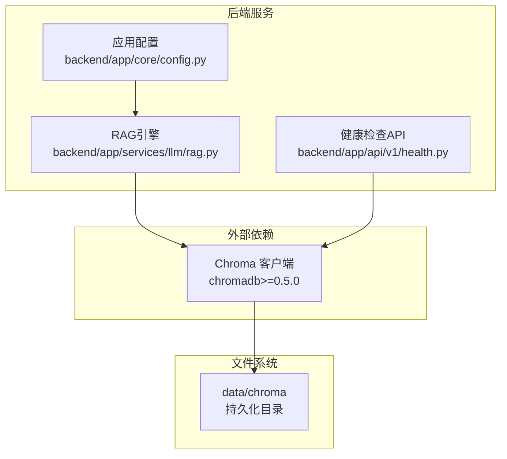
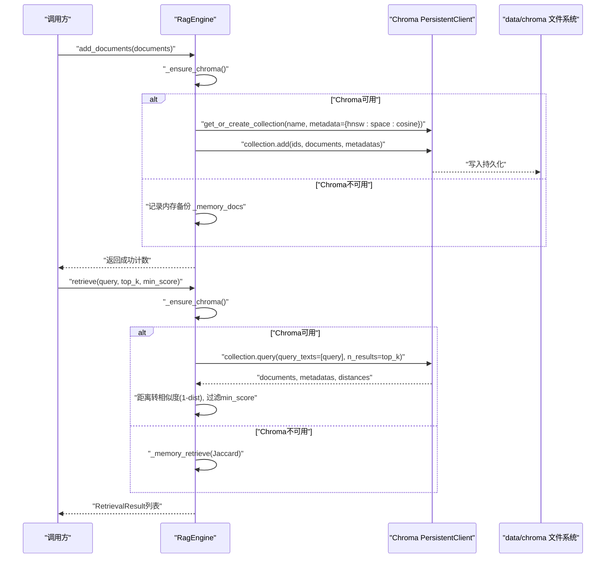
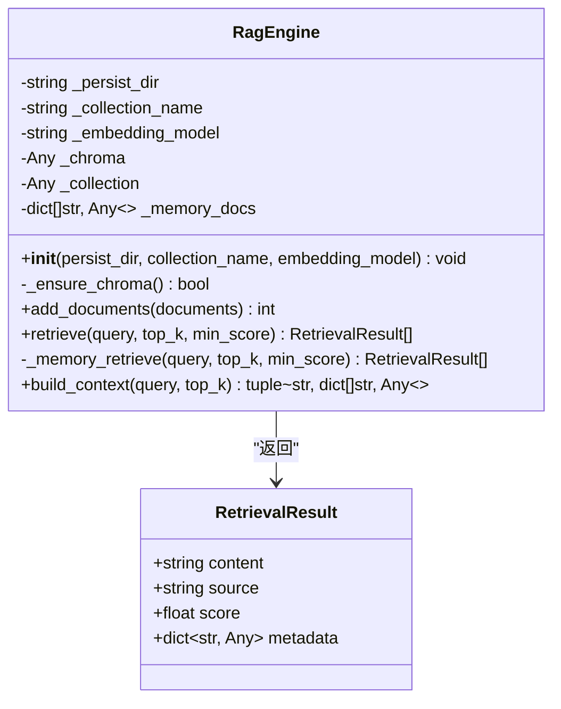
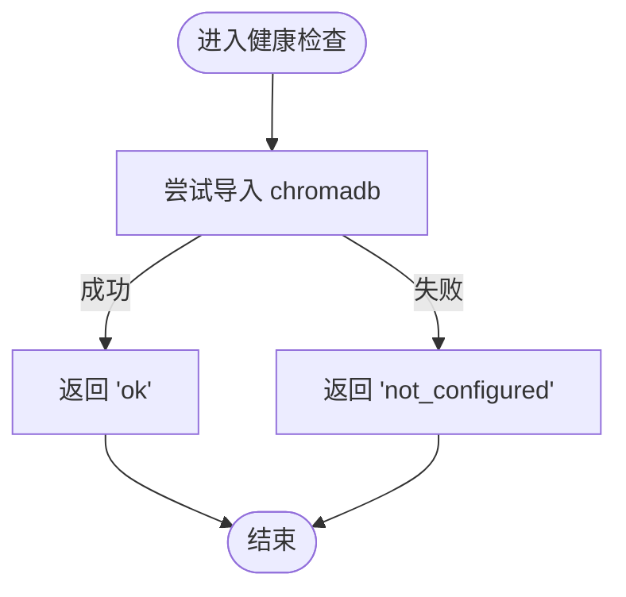
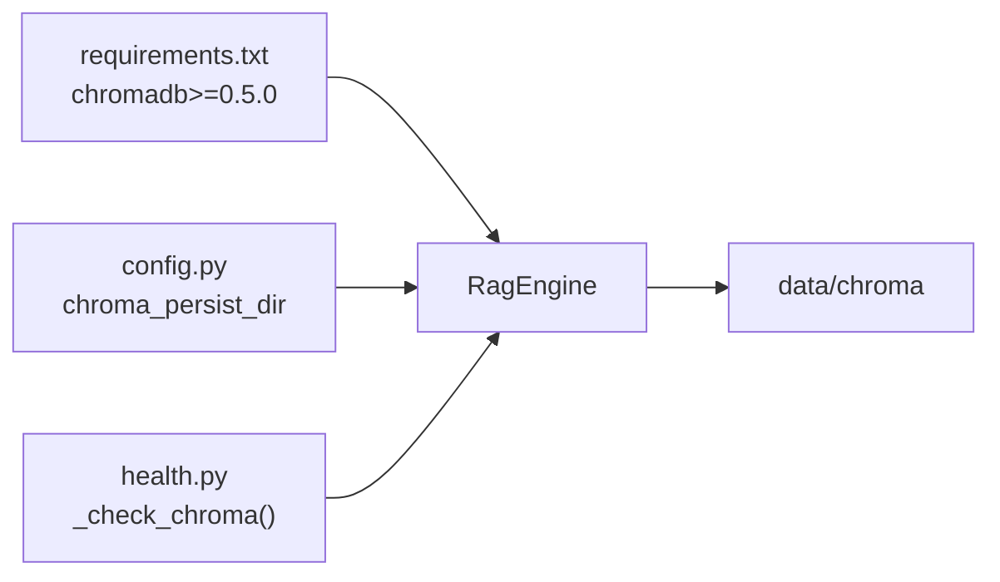

# Chroma向量数据库

<cite>
**本文引用的文件**
- [rag.py](file://backend/app/services/llm/rag.py)
- [config.py](file://backend/app/core/config.py)
- [health.py](file://backend/app/api/v1/health.py)
- [test_rag.py](file://tests/test_rag.py)
- [requirements.txt](file://backend/requirements.txt)
- [03-database.md](file://docs/design/03-database.md)
</cite>

## 目录
1. [简介](#简介)
2. [项目结构](#项目结构)
3. [核心组件](#核心组件)
4. [架构总览](#架构总览)
5. [详细组件分析](#详细组件分析)
6. [依赖关系分析](#依赖关系分析)
7. [性能与扩展性](#性能与扩展性)
8. [故障排查指南](#故障排查指南)
9. [结论](#结论)
10. [附录](#附录)

## 简介
本文件面向AI药物设计系统中的Chroma向量数据库集成，围绕以下目标展开：
- 向量嵌入生成、相似度搜索、集合管理
- RAG检索增强生成的实现原理、文档分块策略、向量索引优化
- 生物医学知识库的向量化处理、语义搜索算法、检索质量评估
- 向量数据持久化、增量更新、批量导入导出
- 性能调优参数、内存管理、扩展性考虑

系统采用Chroma作为本地持久化向量库，默认使用余弦空间（cosine）进行相似度检索；当Chroma不可用时，自动降级为内存关键词检索，确保服务可用性。

## 项目结构
与Chroma集成相关的代码主要位于后端服务的LLM子模块中，并通过配置中心注入持久化路径等参数；健康检查端点提供Chroma可用性的快速探测。

图示来源
- [rag.py:35-88](file://backend/app/services/llm/rag.py#L35-L88)
- [config.py:51-53](file://backend/app/core/config.py#LL51-L53)
- [health.py:44-50](file://backend/app/api/v1/health.py#L44-L50)
- [requirements.txt:48-49](file://backend/requirements.txt#L48-L49)

章节来源
- [rag.py:1-88](file://backend/app/services/llm/rag.py#L1-L88)
- [config.py:21-53](file://backend/app/core/config.py#L21-L53)
- [health.py:1-50](file://backend/app/api/v1/health.py#L1-L50)
- [requirements.txt:48-49](file://backend/requirements.txt#L48-L49)

## 核心组件
- RagEngine：RAG检索增强生成引擎，封装Chroma客户端初始化、集合创建、文档添加、相似度检索、上下文构建；在Chroma不可用时回退到内存关键词检索。
- RetrievalResult：单条检索结果的数据类，包含内容、来源、相似度分数与元数据。
- Settings：全局配置，提供Chroma持久化目录等环境变量加载。
- HealthCheck：健康检查端点，探测Chroma是否可导入并返回状态。

章节来源
- [rag.py:18-88](file://backend/app/services/llm/rag.py#L18-L88)
- [config.py:21-53](file://backend/app/core/config.py#L21-L53)
- [health.py:44-50](file://backend/app/api/v1/health.py#L44-L50)

## 架构总览
RAG引擎通过惰性初始化连接Chroma持久化客户端，获取或创建集合（默认名称pdd_knowledge），并使用余弦空间进行相似度检索。健康检查端点用于快速判断Chroma是否可用。

图示来源
- [rag.py:62-88](file://backend/app/services/llm/rag.py#L62-L88)
- [rag.py:90-124](file://backend/app/services/llm/rag.py#L90-L124)
- [rag.py:126-169](file://backend/app/services/llm/rag.py#L126-L169)
- [rag.py:171-209](file://backend/app/services/llm/rag.py#L171-L209)

## 详细组件分析

### 组件A：RagEngine 类图

图示来源
- [rag.py:18-33](file://backend/app/services/llm/rag.py#L18-L33)
- [rag.py:35-88](file://backend/app/services/llm/rag.py#L35-L88)
- [rag.py:90-124](file://backend/app/services/llm/rag.py#L90-L124)
- [rag.py:126-169](file://backend/app/services/llm/rag.py#L126-L169)
- [rag.py:171-209](file://backend/app/services/llm/rag.py#L171-L209)
- [rag.py:211-238](file://backend/app/services/llm/rag.py#L211-L238)

章节来源
- [rag.py:18-238](file://backend/app/services/llm/rag.py#L18-L238)

### 组件B：健康检查与Chroma可用性
健康检查端点通过尝试导入chromadb来判断Chroma是否已安装并可被使用，若未安装则返回“not_configured”。该能力便于运维监控与快速定位问题。

图示来源
- [health.py:44-50](file://backend/app/api/v1/health.py#L44-L50)

章节来源
- [health.py:1-50](file://backend/app/api/v1/health.py#L1-L50)

### 组件C：配置项与环境变量
Settings提供chroma_persist_dir等配置项，默认值为./data/chroma，支持从.env或环境变量覆盖。

章节来源
- [config.py:51-53](file://backend/app/core/config.py#L51-L53)

### 组件D：测试用例与行为验证
测试覆盖了RagEngine的初始化、Chroma不可用时的降级逻辑、内存检索的top_k与min_score过滤、排序以及上下文构建等关键行为。

章节来源
- [test_rag.py:1-207](file://tests/test_rag.py#L1-L207)

## 依赖关系分析
- 运行时依赖：chromadb>=0.5.0（requirements.txt声明）
- 配置依赖：Settings.chroma_persist_dir控制持久化路径
- 健康检查：health.py对chromadb进行存在性检测

图示来源
- [requirements.txt:48-49](file://backend/requirements.txt#L48-L49)
- [config.py:51-53](file://backend/app/core/config.py#L51-L53)
- [health.py:44-50](file://backend/app/api/v1/health.py#L44-L50)
- [rag.py:77-84](file://backend/app/services/llm/rag.py#L77-L84)

章节来源
- [requirements.txt:48-49](file://backend/requirements.txt#L48-L49)
- [config.py:51-53](file://backend/app/core/config.py#L51-L53)
- [health.py:44-50](file://backend/app/api/v1/health.py#L44-L50)
- [rag.py:77-84](file://backend/app/services/llm/rag.py#L77-L84)

## 性能与扩展性

### 向量索引与相似度
- 集合元数据设置hnsw:space=cosine，表示使用HNSW索引与余弦相似度。
- 检索时Chroma返回距离值，引擎将其转换为相似度score=1-dist，并按min_score阈值过滤后按降序返回。

章节来源
- [rag.py:81-84](file://backend/app/services/llm/rag.py#L81-L84)
- [rag.py:144-165](file://backend/app/services/llm/rag.py#L144-L165)

### 文档分块策略
- 当前RagEngine以“文档”为单位入库，未内置分块逻辑。建议在上层数据处理阶段将长文本切分为固定长度或语义边界的小块，并为每个块附加source与metadata（如pmid、year、journal等）。
- 设计文档中建议的集合划分包括pubmed_abstracts、drug_labels、internal_reports、cdisc_domains等，便于按领域组织与检索。

章节来源
- [03-database.md:260-268](file://docs/design/03-database.md#L260-L268)

### 向量嵌入生成
- 注释中标注使用OpenAI text-embedding-3-small模型；当前实现由Chroma内部完成嵌入计算，无需显式调用外部SDK。
- 可通过配置embedding_model字段预留切换能力（当前未直接传入Chroma集合创建参数）。

章节来源
- [rag.py:44-56](file://backend/app/services/llm/rag.py#L44-L56)
- [03-database.md:267-268](file://docs/design/03-database.md#L267-L268)

### 检索质量评估
- 相似度阈值min_score用于过滤低相关结果。
- 内存模式下使用Jaccard相似度作为降级方案，便于在无向量库环境下进行基础检索与回归测试。

章节来源
- [rag.py:126-169](file://backend/app/services/llm/rag.py#L126-L169)
- [rag.py:171-209](file://backend/app/services/llm/rag.py#L171-L209)
- [test_rag.py:145-164](file://tests/test_rag.py#L145-L164)

### 持久化与增量更新
- 使用PersistentClient将向量数据持久化至data/chroma目录。
- add_documents支持批量插入，每次调用会同步到内存备份，保证降级可用性。
- 建议结合上层任务调度实现增量更新（仅新增或变更的文档块）。

章节来源
- [rag.py:77-84](file://backend/app/services/llm/rag.py#L77-L84)
- [rag.py:90-124](file://backend/app/services/llm/rag.py#L90-L124)

### 批量导入导出
- 导入：add_documents接受文档列表，适合批处理。
- 导出：当前未暴露导出接口。可在上层基于Chroma API实现全量导出（查询所有ID与文档），并结合S3对象存储归档。

章节来源
- [rag.py:90-124](file://backend/app/services/llm/rag.py#L90-L124)

### 性能调优参数
- 集合元数据hnsw:space=cosine（已启用）。
- 检索参数top_k与min_score可调，平衡召回率与精确度。
- 持久化目录建议使用SSD以提升I/O性能。

章节来源
- [rag.py:81-84](file://backend/app/services/llm/rag.py#L81-L84)
- [rag.py:126-169](file://backend/app/services/llm/rag.py#L126-L169)

### 内存管理与扩展性
- 内存模式仅在Chroma不可用时启用，避免主流程阻塞。
- 可扩展方向：
  - 多集合按领域隔离（参考设计文档中的集合规划）。
  - 引入外部嵌入服务或本地轻量模型（如all-MiniLM-L6-v2）以降低对外部API依赖。
  - 增加去重与版本化机制，支持幂等入库与回溯。

章节来源
- [rag.py:62-88](file://backend/app/services/llm/rag.py#L62-L88)
- [03-database.md:260-268](file://docs/design/03-database.md#L260-L268)

## 故障排查指南
- 症状：检索返回空或异常
  - 检查Chroma是否安装与可导入（健康检查端点返回not_configured）。
  - 确认持久化目录权限与磁盘空间。
  - 查看日志中的降级提示与异常信息。
- 症状：相似度分数异常
  - 确认集合元数据是否为cosine空间。
  - 检查min_score阈值是否过高导致过滤过多结果。
- 症状：性能退化
  - 调整top_k与min_score。
  - 评估文档块大小与数量，必要时引入更细粒度分块。
  - 升级硬件或使用更快的存储介质。

章节来源
- [health.py:44-50](file://backend/app/api/v1/health.py#L44-L50)
- [rag.py:81-84](file://backend/app/services/llm/rag.py#L81-L84)
- [rag.py:126-169](file://backend/app/services/llm/rag.py#L126-L169)

## 结论
本集成以RagEngine为核心，结合Chroma持久化与余弦相似度检索，实现了健壮的RAG检索增强生成链路。系统在Chroma不可用时具备完善的降级策略，保障可用性。通过合理的文档分块、集合规划与参数调优，可在生物医学知识库场景下获得良好的检索质量与性能表现。后续可进一步扩展多集合管理、外部嵌入服务与导出能力，以满足更大规模与更高吞吐的需求。

## 附录
- 依赖清单：chromadb>=0.5.0
- 配置项：chroma_persist_dir（默认./data/chroma）
- 集合规划：pubmed_abstracts、drug_labels、internal_reports、cdisc_domains
- 嵌入模型：text-embedding-3-small（默认）或本地all-MiniLM-L6-v2

章节来源
- [requirements.txt:48-49](file://backend/requirements.txt#L48-L49)
- [config.py:51-53](file://backend/app/core/config.py#L51-L53)
- [03-database.md:260-268](file://docs/design/03-database.md#L260-L268)