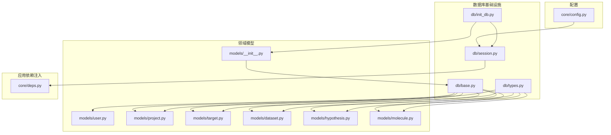
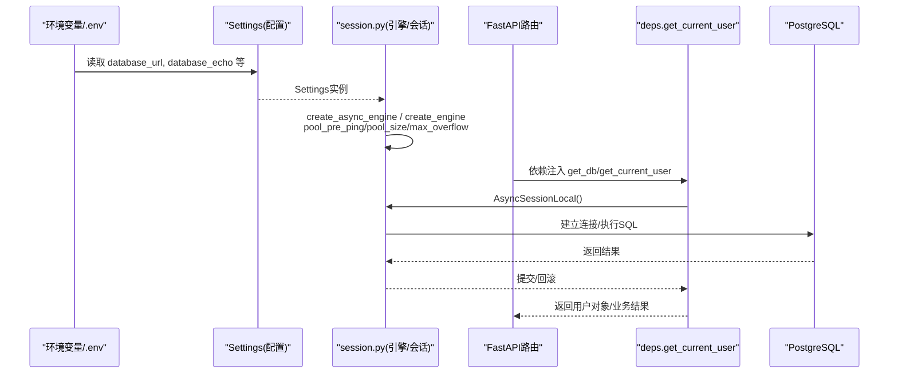
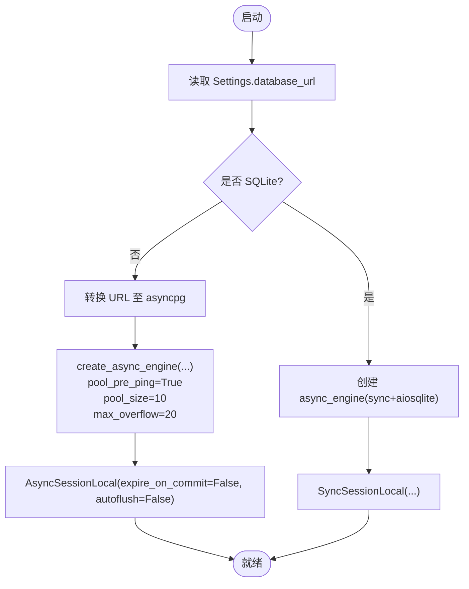
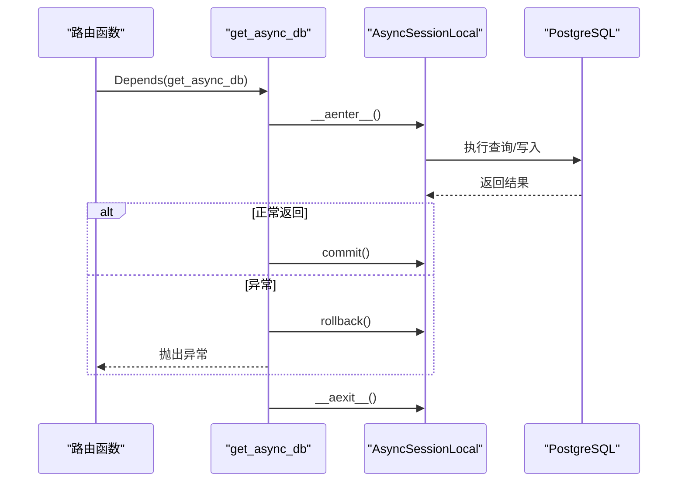
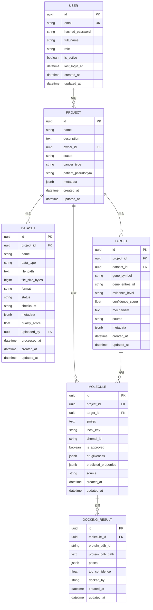
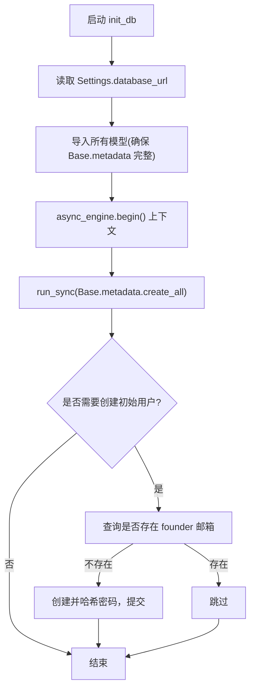
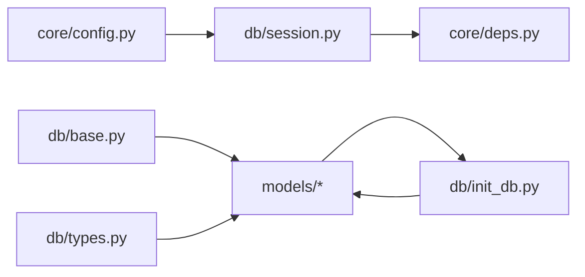

# PostgreSQL集成

<cite>
**本文引用的文件**   
- [backend/app/db/base.py](file://backend/app/db/base.py)
- [backend/app/db/session.py](file://backend/app/db/session.py)
- [backend/app/db/init_db.py](file://backend/app/db/init_db.py)
- [backend/app/db/types.py](file://backend/app/db/types.py)
- [backend/app/core/config.py](file://backend/app/core/config.py)
- [backend/app/models/user.py](file://backend/app/models/user.py)
- [backend/app/models/project.py](file://backend/app/models/project.py)
- [backend/app/models/molecule.py](file://backend/app/models/molecule.py)
- [backend/app/models/target.py](file://backend/app/models/target.py)
- [backend/app/models/dataset.py](file://backend/app/models/dataset.py)
- [backend/app/models/hypothesis.py](file://backend/app/models/hypothesis.py)
- [backend/app/models/__init__.py](file://backend/app/models/__init__.py)
- [backend/app/core/deps.py](file://backend/app/core/deps.py)
</cite>

## 目录
1. [简介](#简介)
2. [项目结构](#项目结构)
3. [核心组件](#核心组件)
4. [架构总览](#架构总览)
5. [详细组件分析](#详细组件分析)
6. [依赖关系分析](#依赖关系分析)
7. [性能与连接池优化](#性能与连接池优化)
8. [故障排查指南](#故障排查指南)
9. [结论](#结论)
10. [附录](#附录)

## 简介
本文件面向AI药物设计系统的PostgreSQL数据库集成，聚焦于SQLAlchemy 2.0的异步引擎配置、连接池管理、会话生命周期控制；说明数据库连接字符串、SSL与安全连接、连接超时设置；给出ORM模型定义规范、关系映射与查询优化策略；阐述事务处理机制、并发控制与锁策略；并提供数据库初始化流程、表结构创建与索引优化建议。文档以仓库现有实现为依据，确保可落地与可维护性。

## 项目结构
后端采用分层组织：配置集中于core.config，数据库基础设施位于db（基础类、类型兼容、会话与初始化），业务实体在models下，API层通过core.deps注入数据库会话。

图表来源
- [backend/app/core/config.py:1-144](file://backend/app/core/config.py#L1-L144)
- [backend/app/db/session.py:1-128](file://backend/app/db/session.py#L1-L128)
- [backend/app/db/base.py:1-48](file://backend/app/db/base.py#L1-L48)
- [backend/app/db/types.py:1-42](file://backend/app/db/types.py#L1-L42)
- [backend/app/models/__init__.py:1-29](file://backend/app/models/__init__.py#L1-L29)
- [backend/app/core/deps.py:1-129](file://backend/app/core/deps.py#L1-L129)

章节来源
- [backend/app/core/config.py:1-144](file://backend/app/core/config.py#L1-L144)
- [backend/app/db/session.py:1-128](file://backend/app/db/session.py#L1-L128)
- [backend/app/db/base.py:1-48](file://backend/app/db/base.py#L1-L48)
- [backend/app/db/types.py:1-42](file://backend/app/db/types.py#L1-L42)
- [backend/app/models/__init__.py:1-29](file://backend/app/models/__init__.py#L1-L29)
- [backend/app/core/deps.py:1-129](file://backend/app/core/deps.py#L1-L129)

## 核心组件
- 配置中心：基于pydantic-settings的环境变量加载，提供database_url、database_echo等键，支持从.env或环境变量覆盖默认值。
- 会话与引擎：同时暴露同步与异步engine，自动将psycopg/psycopg2转为asyncpg驱动URL；为SQLite与非SQLite分别配置连接池参数；提供AsyncSessionLocal与SyncSessionLocal工厂。
- 依赖注入：FastAPI路由通过get_async_db获取请求级会话，异常时自动回滚，成功提交；服务层也可复用get_db别名。
- ORM基类与混入：DeclarativeBase统一基类；UUIDPrimaryKey提供分布式友好的主键；TimestampMixin提供created_at/updated_at时间戳。
- 跨方言类型：JSONBCompat与INETCompat在PostgreSQL使用原生JSONB/INET，在其他方言降级为通用类型，便于本地开发。
- 初始化脚本：导入所有模型后，使用Base.metadata.create_all创建表，并可选创建初始用户。

章节来源
- [backend/app/core/config.py:1-144](file://backend/app/core/config.py#L1-L144)
- [backend/app/db/session.py:1-128](file://backend/app/db/session.py#L1-L128)
- [backend/app/db/base.py:1-48](file://backend/app/db/base.py#L1-L48)
- [backend/app/db/types.py:1-42](file://backend/app/db/types.py#L1-L42)
- [backend/app/db/init_db.py:1-88](file://backend/app/db/init_db.py#L1-L88)
- [backend/app/core/deps.py:1-129](file://backend/app/core/deps.py#L1-L129)

## 架构总览
下图展示从配置到引擎、会话、模型与API依赖注入的整体数据流与控制流。

图表来源
- [backend/app/core/config.py:1-144](file://backend/app/core/config.py#L1-L144)
- [backend/app/db/session.py:1-128](file://backend/app/db/session.py#L1-L128)
- [backend/app/core/deps.py:1-129](file://backend/app/core/deps.py#L1-L129)

## 详细组件分析

### 异步引擎与连接池管理
- 驱动转换：根据URL前缀自动将psycopg/psycopg2转换为asyncpg，sqlite则转为aiosqlite，保证同一配置在不同环境可用。
- SQLite分支：不启用连接池参数，仅开启echo与future模式。
- PostgreSQL分支：启用pool_pre_ping检测死连接，设置pool_size与max_overflow，避免连接耗尽。
- 会话工厂：expire_on_commit=False减少重复加载开销，autoflush=False显式控制刷新时机，降低意外写入风险。

图表来源
- [backend/app/db/session.py:25-91](file://backend/app/db/session.py#L25-L91)

章节来源
- [backend/app/db/session.py:25-91](file://backend/app/db/session.py#L25-L91)

### 会话生命周期与事务控制
- FastAPI异步依赖：每个请求创建一个AsyncSession，请求结束自动commit；发生异常自动rollback并抛出。
- 同步依赖：用于脚本/CLI，try/finally确保close。
- 推荐实践：在路由或服务层中显式调用flush/commit，避免隐式刷新导致N+1或意外写操作。

图表来源
- [backend/app/db/session.py:94-128](file://backend/app/db/session.py#L94-L128)

章节来源
- [backend/app/db/session.py:94-128](file://backend/app/db/session.py#L94-L128)

### 数据库连接字符串与安全连接
- 连接字符串：由Settings.database_url提供，默认使用postgresql+psycopg2；运行时会被转换为postgresql+asyncpg供异步路径使用。
- SSL安全连接：可在URL中附加sslmode等参数（例如require、verify-full）以启用SSL；生产环境建议强制SSL并校验证书。
- 连接超时：可通过URL参数或底层驱动参数设置connect_timeout、statement_timeout等，结合pool_pre_ping提升健壮性。
- 调试开关：database_echo控制SQL日志输出，便于开发与排障。

章节来源
- [backend/app/core/config.py:37-39](file://backend/app/core/config.py#L37-L39)
- [backend/app/db/session.py:25-41](file://backend/app/db/session.py#L25-L41)

### ORM模型定义规范与关系映射
- 基类与混入：
  - Base：DeclarativeBase统一基类。
  - UUIDPrimaryKey：主键使用UUID4，利于分布式与迁移。
  - TimestampMixin：created_at/updated_at带时区，server_default/onupdate维护。
- 常用字段与约束：
  - String/Text/Boolean/Float/BigInteger/DateTime等。
  - unique/index/ForeignKey(ondelete=CASCADE/RESTRICT/SET NULL)。
- JSONB兼容：
  - JSONBCompat在PostgreSQL使用JSONB，其他方言降级为JSON，便于本地开发。
- 典型关系：
  - Project 1..* Dataset/Hypothesis，ondelete CASCADE。
  - Target 1..* EvidenceItem/Molecule。
  - Molecule 1..* DockingResult。
  - User 1..* Project/Dataset上传者。

图表来源
- [backend/app/models/user.py:14-36](file://backend/app/models/user.py#L14-L36)
- [backend/app/models/project.py:14-42](file://backend/app/models/project.py#L14-L42)
- [backend/app/models/dataset.py:15-70](file://backend/app/models/dataset.py#L15-L70)
- [backend/app/models/target.py:14-52](file://backend/app/models/target.py#L14-L52)
- [backend/app/models/molecule.py:14-61](file://backend/app/models/molecule.py#L14-L61)

章节来源
- [backend/app/db/base.py:13-48](file://backend/app/db/base.py#L13-L48)
- [backend/app/db/types.py:13-42](file://backend/app/db/types.py#L13-L42)
- [backend/app/models/user.py:14-36](file://backend/app/models/user.py#L14-L36)
- [backend/app/models/project.py:14-42](file://backend/app/models/project.py#L14-L42)
- [backend/app/models/dataset.py:15-70](file://backend/app/models/dataset.py#L15-L70)
- [backend/app/models/target.py:14-52](file://backend/app/models/target.py#L14-L52)
- [backend/app/models/molecule.py:14-61](file://backend/app/models/molecule.py#L14-L61)

### 查询优化策略
- 索引建议：
  - users.email唯一索引已存在。
  - projects.owner_id、targets.gene_symbol、molecules.project_id/target_id/inchi_key、datasets.project_id等均有index=True，应保留并评估复合索引场景。
- JSONB高效查询：
  - 使用JSONB字段存储结构化元数据，配合GIN索引加速键值查询（建议在目标列上按需添加）。
- 外键与级联：
  - ondelete=CASCADE用于强从属关系（如Project→Dataset/Hypothesis/Molecule），避免孤儿记录。
  - RESTRICT用于敏感外键（如User→Project），防止误删。
- 分页与限流：
  - 通过core.deps.Pagination限制page_size上限，避免大结果集拖垮系统。

章节来源
- [backend/app/models/user.py:27](file://backend/app/models/user.py#L27)
- [backend/app/models/project.py:24-30](file://backend/app/models/project.py#L24-L30)
- [backend/app/models/target.py:29-41](file://backend/app/models/target.py#L29-L41)
- [backend/app/models/molecule.py:23-35](file://backend/app/models/molecule.py#L23-L35)
- [backend/app/models/dataset.py:27-42](file://backend/app/models/dataset.py#L27-L42)
- [backend/app/core/deps.py:83-88](file://backend/app/core/deps.py#L83-L88)

### 事务处理机制、并发控制与锁策略
- 事务边界：
  - 请求级事务：get_async_db在请求结束时commit/rollback，适合大多数CRUD。
  - 长事务/批量任务：建议使用显式事务上下文（如async_engine.begin）包裹，避免长时间持有连接。
- 并发与锁：
  - 读多写少：优先SELECT + 乐观锁（版本号字段）或无锁读。
  - 写冲突：对关键行使用FOR UPDATE/SHARE（需显式事务），或在应用层加分布式锁。
  - 幂等写入：利用唯一约束或UPSERT（INSERT ... ON CONFLICT）避免重复。
- 连接池与背压：
  - pool_pre_ping检测断链；合理设置pool_size与max_overflow，避免连接风暴。

章节来源
- [backend/app/db/session.py:94-128](file://backend/app/db/session.py#L94-L128)
- [backend/app/db/init_db.py:35-40](file://backend/app/db/init_db.py#L35-L40)

### 数据库初始化流程与表结构创建
- 初始化入口：运行初始化脚本，打印当前database_url，创建所有表，并可选择创建初始用户。
- 表创建：通过Base.metadata.create_all在异步引擎begin上下文中执行，确保DDL原子性与错误处理。
- 初始数据：检查是否存在创始人账号，不存在则插入并哈希密码。

图表来源
- [backend/app/db/init_db.py:35-88](file://backend/app/db/init_db.py#L35-L88)
- [backend/app/models/__init__.py:1-29](file://backend/app/models/__init__.py#L1-L29)

章节来源
- [backend/app/db/init_db.py:1-88](file://backend/app/db/init_db.py#L1-L88)
- [backend/app/models/__init__.py:1-29](file://backend/app/models/__init__.py#L1-L29)

## 依赖关系分析
- 模块耦合：
  - session.py依赖config.py获取database_url与echo开关。
  - models依赖base.py与types.py，统一主键、时间戳与JSONB兼容。
  - deps.py通过get_async_db注入会话，并在认证流程中查询User。
  - init_db.py依赖models集合与session中的同步/异步引擎。
- 外部依赖：
  - SQLAlchemy 2.0（异步）、asyncpg（PostgreSQL异步驱动）、pydantic-settings（配置）。

图表来源
- [backend/app/core/config.py:1-144](file://backend/app/core/config.py#L1-L144)
- [backend/app/db/session.py:1-128](file://backend/app/db/session.py#L1-L128)
- [backend/app/db/base.py:1-48](file://backend/app/db/base.py#L1-L48)
- [backend/app/db/types.py:1-42](file://backend/app/db/types.py#L1-L42)
- [backend/app/db/init_db.py:1-88](file://backend/app/db/init_db.py#L1-L88)
- [backend/app/core/deps.py:1-129](file://backend/app/core/deps.py#L1-L129)

章节来源
- [backend/app/core/config.py:1-144](file://backend/app/core/config.py#L1-L144)
- [backend/app/db/session.py:1-128](file://backend/app/db/session.py#L1-L128)
- [backend/app/db/base.py:1-48](file://backend/app/db/base.py#L1-L48)
- [backend/app/db/types.py:1-42](file://backend/app/db/types.py#L1-L42)
- [backend/app/db/init_db.py:1-88](file://backend/app/db/init_db.py#L1-L88)
- [backend/app/core/deps.py:1-129](file://backend/app/core/deps.py#L1-L129)

## 性能与连接池优化
- 连接池参数：
  - pool_pre_ping=True：每次使用前探测连接健康，避免“僵尸连接”。
  - pool_size=10、max_overflow=20：根据并发QPS与PG最大连接数调优，避免连接耗尽。
- 会话行为：
  - expire_on_commit=False：减少重复加载开销。
  - autoflush=False：显式控制刷新，避免隐式写入。
- SQL日志：
  - database_echo：仅在开发环境开启，生产关闭。
- 索引与查询：
  - 针对高频过滤/排序/JOIN列建立合适索引；JSONB列按需建GIN索引。
  - 使用selectinload/joinedload避免N+1。
- 超时与重试：
  - 在URL或驱动层设置connect_timeout/statement_timeout；对网络抖动增加重试与退避。

章节来源
- [backend/app/db/session.py:65-80](file://backend/app/db/session.py#L65-L80)
- [backend/app/db/session.py:83-91](file://backend/app/db/session.py#L83-L91)
- [backend/app/core/config.py:37-39](file://backend/app/core/config.py#L37-L39)

## 故障排查指南
- 无法连接数据库：
  - 检查database_url格式与驱动后缀是否正确（postgresql+asyncpg）。
  - 确认网络可达、端口开放、用户名/密码正确。
- 连接被拒绝或频繁断开：
  - 开启pool_pre_ping；调整pool_size/max_overflow；检查PG max_connections。
- 慢查询：
  - 开启database_echo定位SQL；查看EXPLAIN ANALYZE；补充缺失索引。
- 事务未提交或回滚：
  - 确认路由依赖get_async_db且未提前关闭会话；复杂逻辑使用显式事务上下文。
- 初始化失败：
  - 检查导入模型是否完整（models/__init__.py）；确认Base.metadata包含全部表。

章节来源
- [backend/app/db/session.py:25-91](file://backend/app/db/session.py#L25-L91)
- [backend/app/db/init_db.py:35-88](file://backend/app/db/init_db.py#L35-L88)
- [backend/app/core/deps.py:101-128](file://backend/app/core/deps.py#L101-L128)

## 结论
本项目基于SQLAlchemy 2.0实现了健壮的PostgreSQL集成：统一的配置加载、异步/同步双引擎、严格的会话生命周期与事务控制、跨方言的类型兼容以及完善的ORM模型与关系映射。通过合理的连接池参数、索引设计与查询优化，可满足AI药物设计系统的高并发与高可靠需求。生产部署建议启用SSL、严格超时与监控告警，并结合业务特征持续优化索引与SQL。

## 附录
- 环境变量键名参考（来自配置）：
  - database_url：数据库连接字符串（含驱动与认证信息）。
  - database_echo：是否输出SQL日志。
- 常见URL片段示例（概念性说明）：
  - 启用SSL：在URL末尾追加?sslmode=require或?sslmode=verify-full。
  - 连接超时：connect_timeout=10；语句超时：statement_timeout=30s。
- 初始化命令：
  - 运行初始化脚本以创建表与初始用户。

章节来源
- [backend/app/core/config.py:37-39](file://backend/app/core/config.py#L37-L39)
- [backend/app/db/init_db.py:64-88](file://backend/app/db/init_db.py#L64-L88)