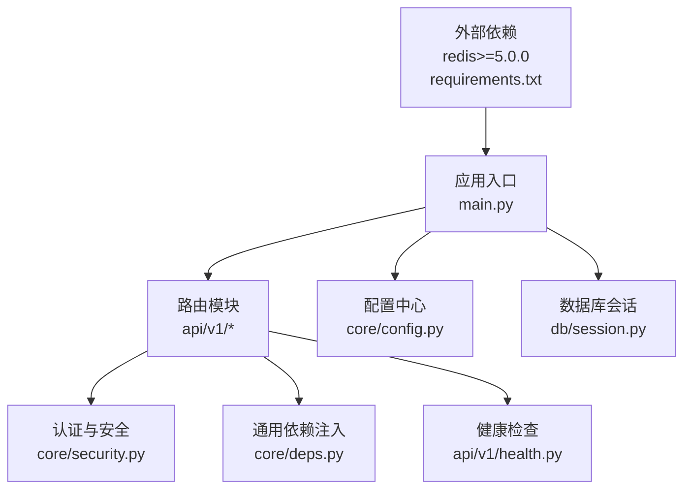
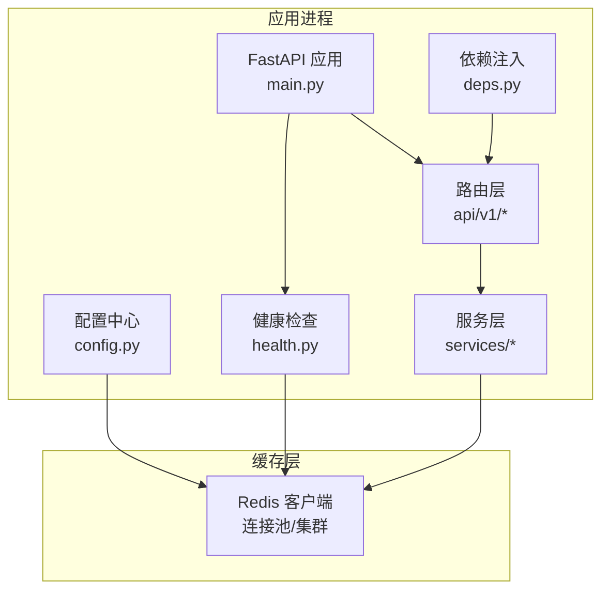
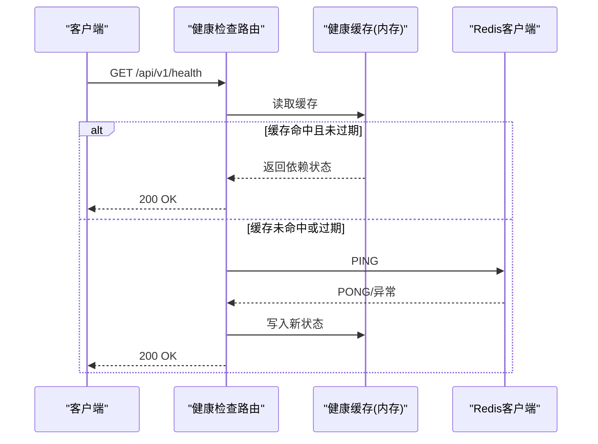
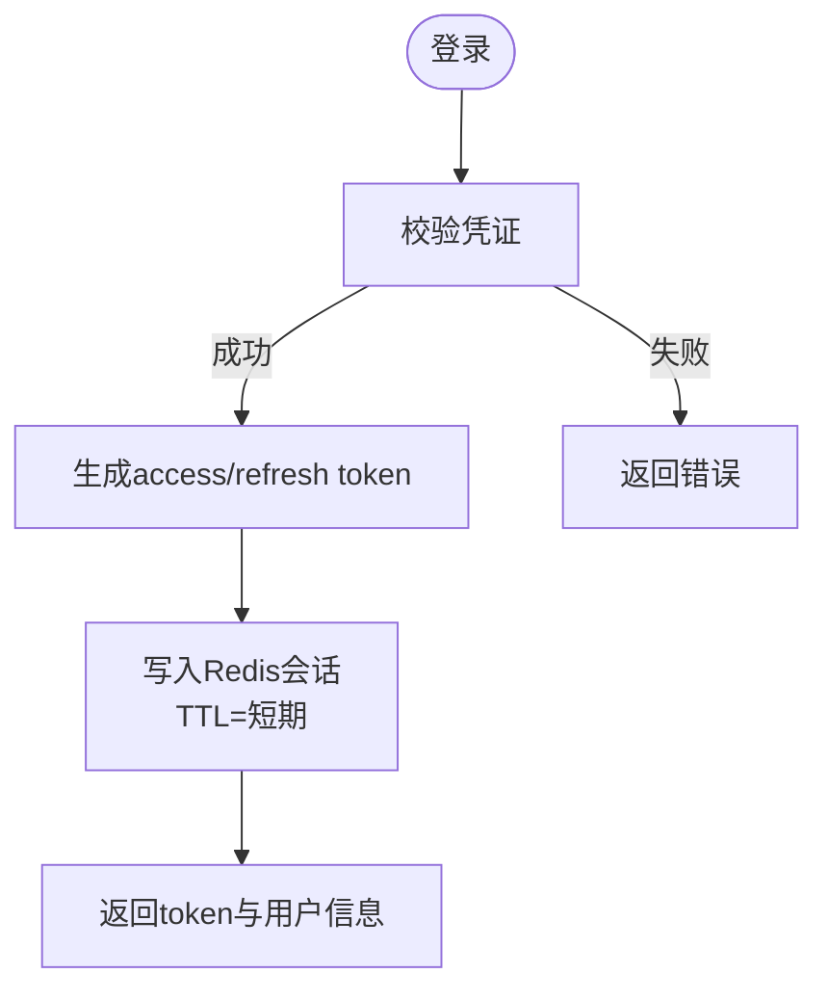
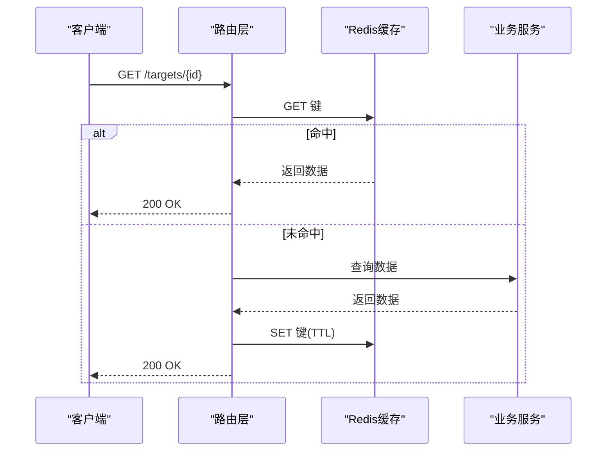
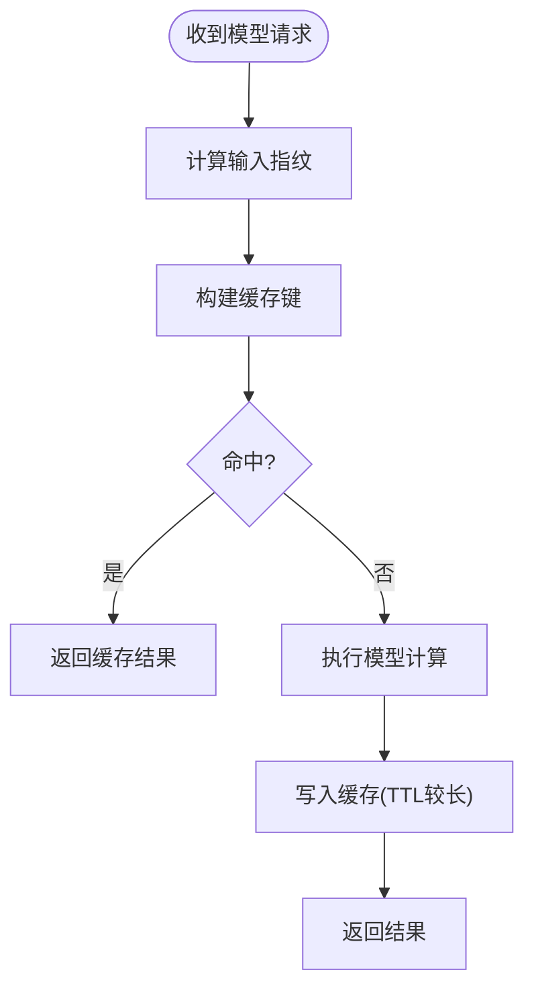
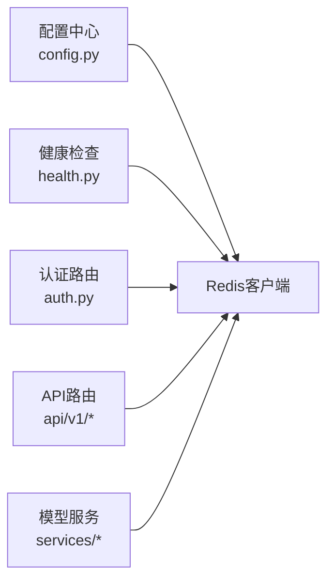

# Redis缓存集成

<cite>
**本文引用的文件**   
- [backend/requirements.txt](file://backend/requirements.txt)
- [backend/app/core/config.py](file://backend/app/core/config.py)
- [backend/app/api/v1/health.py](file://backend/app/api/v1/health.py)
- [backend/app/core/deps.py](file://backend/app/core/deps.py)
- [backend/app/db/session.py](file://backend/app/db/session.py)
- [backend/app/main.py](file://backend/app/main.py)
- [backend/app/core/security.py](file://backend/app/core/security.py)
- [backend/app/api/v1/auth.py](file://backend/app/api/v1/auth.py)
</cite>

## 目录
1. [简介](#简介)
2. [项目结构](#项目结构)
3. [核心组件](#核心组件)
4. [架构总览](#架构总览)
5. [详细组件分析](#详细组件分析)
6. [依赖关系分析](#依赖关系分析)
7. [性能考量](#性能考量)
8. [故障排查指南](#故障排查指南)
9. [结论](#结论)
10. [附录](#附录)

## 简介
本文件为AI药物设计系统提供Redis缓存集成的完整设计与实现指导，覆盖连接配置、连接池与集群模式、缓存策略（会话存储、API响应缓存、模型结果缓存）、序列化格式、过期时间管理、失效机制、穿透防护、雪崩预防、监控指标、内存优化与故障恢复。文档同时结合现有代码现状给出落地路径与演进建议。

## 项目结构
当前后端基于FastAPI，已引入redis依赖并在健康检查中预留了Redis可用性探测入口；配置中心通过pydantic-settings集中管理环境变量，包含redis_url字段。数据库层提供了异步引擎与会话工厂示例，可作为Redis客户端初始化与生命周期管理的参考。

图表来源
- [backend/app/main.py:187-243](file://backend/app/main.py#L187-L243)
- [backend/app/api/v1/health.py:1-102](file://backend/app/api/v1/health.py#L1-L102)
- [backend/app/core/config.py:21-43](file://backend/app/core/config.py#L21-L43)
- [backend/app/db/session.py:48-91](file://backend/app/db/session.py#L48-L91)
- [backend/requirements.txt:46](file://backend/requirements.txt#L46)

章节来源
- [backend/app/main.py:187-243](file://backend/app/main.py#L187-L243)
- [backend/app/core/config.py:21-43](file://backend/app/core/config.py#L21-L43)
- [backend/app/api/v1/health.py:1-102](file://backend/app/api/v1/health.py#L1-L102)
- [backend/app/db/session.py:48-91](file://backend/app/db/session.py#L48-L91)
- [backend/requirements.txt:46](file://backend/requirements.txt#L46)

## 核心组件
- 配置中心：集中管理Redis连接URL等参数，支持多环境切换。
- 健康检查：已内置对Redis的导入检测，可升级为真实连通性探测。
- 依赖注入：提供用户对象短TTL内存缓存示例，可作为迁移到Redis缓存的过渡方案。
- 数据库会话：展示连接池与异步会话工厂的最佳实践，便于复用至Redis客户端初始化。

章节来源
- [backend/app/core/config.py:21-43](file://backend/app/core/config.py#L21-L43)
- [backend/app/api/v1/health.py:34-42](file://backend/app/api/v1/health.py#L34-L42)
- [backend/app/core/deps.py:26-65](file://backend/app/core/deps.py#L26-L65)
- [backend/app/db/session.py:64-91](file://backend/app/db/session.py#L64-L91)

## 架构总览
下图展示了Redis在系统中的位置与交互方式：配置驱动初始化、健康检查探测、服务层读写缓存、中间件统一响应封装与追踪。

图表来源
- [backend/app/main.py:187-243](file://backend/app/main.py#L187-L243)
- [backend/app/api/v1/health.py:34-42](file://backend/app/api/v1/health.py#L34-L42)
- [backend/app/core/config.py:21-43](file://backend/app/core/config.py#L21-L43)

## 详细组件分析

### 1. Redis连接配置与连接池
- 配置项
  - redis_url：从环境变量或.env加载，默认指向本地实例。
  - 建议扩展：redis_pool_size、redis_max_overflow、redis_connect_timeout、redis_socket_timeout、redis_retry_on_timeout、redis_db_index、redis_cluster_nodes（集群模式）。
- 连接池与超时
  - 参考数据库会话的连接池设置，为Redis客户端设置合理的连接池大小、最大溢出、连接与读取超时，避免在高并发下资源耗尽。
- 集群模式
  - 使用Redis Cluster URL或节点列表初始化客户端；注意键哈希槽分布与跨槽操作限制。
- 安全与鉴权
  - 若启用密码或TLS，需在URL中携带凭据或使用客户端参数配置。

章节来源
- [backend/app/core/config.py:41-43](file://backend/app/core/config.py#L41-L43)
- [backend/app/db/session.py:64-80](file://backend/app/db/session.py#L64-L80)

### 2. 健康检查与可用性探测
- 现状
  - health端点已包含对redis.asyncio的导入检测，返回“ok”或“not_configured”。
- 升级建议
  - 在服务启动时执行一次PING探测并缓存结果；在健康接口中直接返回缓存状态，降低开销。
  - 增加失败计数与退避重试，避免误报。

图表来源
- [backend/app/api/v1/health.py:34-42](file://backend/app/api/v1/health.py#L34-L42)
- [backend/app/api/v1/health.py:53-102](file://backend/app/api/v1/health.py#L53-L102)

章节来源
- [backend/app/api/v1/health.py:34-42](file://backend/app/api/v1/health.py#L34-L42)
- [backend/app/api/v1/health.py:53-102](file://backend/app/api/v1/health.py#L53-L102)

### 3. 缓存策略设计

#### 3.1 命名空间与键设计
- 命名空间前缀
  - 按功能域划分：session:*、cache:api:*、cache:model:*、lock:*、metrics:*。
- 键粒度
  - API响应缓存：以请求方法+路径+规范化查询参数+认证主体标识作为键。
  - 模型结果缓存：以输入指纹（如分子SMILES哈希、靶点ID、模型版本）作为键。
  - 会话存储：以用户ID或会话ID为键，值包含会话元数据与权限信息。

#### 3.2 数据序列化格式
- 推荐orjson
  - 高性能JSON编解码，适合大体积响应与高频读写。
  - 需确保所有可序列化对象为原生类型（dict/list/str/int/float/bool/None），复杂对象先转换为Pydantic模型再序列化为dict。
- 备选方案
  - pickle仅用于同进程可信场景，跨进程/跨语言不推荐。
  - msgpack可用于二进制高效传输，但需要两端一致协议。

章节来源
- [backend/requirements.txt:61](file://backend/requirements.txt#L61)

#### 3.3 过期时间管理
- 分级TTL
  - 会话：短期（如15-30分钟），配合刷新令牌机制。
  - API响应：根据数据新鲜度设定（秒级到分钟级）。
  - 模型结果：较长（小时级），结合版本号与输入指纹变更触发失效。
- 随机抖动
  - 为相同TTL添加小范围随机抖动，缓解雪崩。

#### 3.4 缓存失效机制
- 主动失效
  - 写后删除（Write-Through/Write-Behind）：更新数据后删除对应缓存键。
  - 事件驱动：通过消息队列广播失效指令。
- 被动失效
  - TTL到期自动清理。
- 一致性保障
  - 热点键加分布式锁，避免缓存击穿时的并发回源风暴。

#### 3.5 缓存穿透防护
- 布隆过滤器
  - 针对不存在的数据快速拒绝，减少回源压力。
- 空值缓存
  - 对缺失数据缓存短TTL空值，防止重复计算。

#### 3.6 缓存雪崩预防
- 随机抖动TTL
- 多级缓存
  - 进程内短TTL + Redis长TTL，降低Redis压力。
- 限流与降级
  - 对热点接口进行限流，必要时返回兜底数据。

### 4. 具体实现方案

#### 4.1 会话存储（Session）
- 目标
  - 将登录态与会话元数据持久化到Redis，支持多进程共享与水平扩展。
- 键设计
  - session:{user_id} -> JSON（含角色、权限、创建时间、最后活跃时间）。
- 行为
  - 登录成功写入会话，每次访问刷新活跃时间；登出或删除用户时主动失效。
- 与JWT协同
  - access token短期有效，refresh token长期有效；会话用于黑名单与在线状态统计。

图表来源
- [backend/app/api/v1/auth.py:70-101](file://backend/app/api/v1/auth.py#L70-L101)
- [backend/app/core/security.py:96-122](file://backend/app/core/security.py#L96-L122)

章节来源
- [backend/app/api/v1/auth.py:70-101](file://backend/app/api/v1/auth.py#L70-L101)
- [backend/app/core/security.py:96-122](file://backend/app/core/security.py#L96-L122)

#### 4.2 API响应缓存
- 适用场景
  - 读多写少、幂等GET接口，如项目列表、靶点详情、报告摘要。
- 键设计
  - cache:api:{method}:{path}:{query_hash}:{user_scope}
- 流程
  - 请求进入→构造键→查缓存→命中则返回→未命中则执行业务逻辑→写入缓存→返回。
- 失效
  - 相关资源更新时主动删除对应键集合。

图表来源
- [backend/app/main.py:187-243](file://backend/app/main.py#L187-L243)

章节来源
- [backend/app/main.py:187-243](file://backend/app/main.py#L187-L243)

#### 4.3 模型结果缓存
- 适用场景
  - 分子对接、药效预测、通路分析等耗时计算。
- 键设计
  - cache:model:{model_version}:{input_fingerprint}
- 行为
  - 首次计算后落盘缓存；模型版本或输入变化导致键不同，天然隔离。
- 失效
  - 模型版本升级或输入规则变更时批量失效。

图表来源
- [backend/app/main.py:187-243](file://backend/app/main.py#L187-L243)

### 5. 依赖关系分析
- 配置依赖
  - 所有Redis客户端初始化均依赖配置中心的redis_url及相关参数。
- 健康检查依赖
  - health端点依赖Redis客户端可用性探测。
- 业务依赖
  - 认证与会话、API响应缓存、模型结果缓存均依赖统一的Redis客户端。

图表来源
- [backend/app/core/config.py:21-43](file://backend/app/core/config.py#L21-L43)
- [backend/app/api/v1/health.py:34-42](file://backend/app/api/v1/health.py#L34-L42)
- [backend/app/api/v1/auth.py:70-101](file://backend/app/api/v1/auth.py#L70-L101)

章节来源
- [backend/app/core/config.py:21-43](file://backend/app/core/config.py#L21-L43)
- [backend/app/api/v1/health.py:34-42](file://backend/app/api/v1/health.py#L34-L42)
- [backend/app/api/v1/auth.py:70-101](file://backend/app/api/v1/auth.py#L70-L101)

## 性能考量
- 连接池与超时
  - 合理设置连接池大小与溢出上限，避免高并发下阻塞；设置连接与读取超时，快速失败。
- 序列化性能
  - 优先orjson，减少CPU占用与延迟。
- 多级缓存
  - 进程内短TTL + Redis长TTL，降低Redis压力与网络开销。
- 热点保护
  - 分布式锁防击穿；限流与熔断防雪崩。
- 监控指标
  - 命中率、延迟分位、错误率、内存使用、连接数、慢查询。

[本节为通用指导，无需特定文件引用]

## 故障排查指南
- 健康检查
  - 确认redis_url正确、网络可达、防火墙放行；查看健康端点返回的依赖状态。
- 连接问题
  - 检查连接池是否耗尽、超时是否过短、是否有大量慢查询。
- 序列化异常
  - 确保orjson可序列化所有对象；复杂对象先转dict或Pydantic模型。
- 一致性冲突
  - 检查写后删除是否生效；热点键是否加锁；TTL是否合理。
- 雪崩与击穿
  - 观察命中率骤降与延迟尖峰；启用随机抖动与多级缓存。

章节来源
- [backend/app/api/v1/health.py:34-42](file://backend/app/api/v1/health.py#L34-L42)

## 结论
通过在配置中心统一管理Redis连接、完善健康检查、引入多级缓存与完善的失效与防护策略，AI药物设计系统可在保证一致性的前提下显著提升吞吐与稳定性。建议优先落地会话存储与关键API响应缓存，逐步扩展到模型结果缓存，并配套监控与告警体系。

[本节为总结，无需特定文件引用]

## 附录

### A. 环境变量与配置清单（建议）
- redis_url：Redis连接URL（单节点或集群）
- redis_pool_size：连接池大小
- redis_max_overflow：最大溢出连接数
- redis_connect_timeout：连接超时（秒）
- redis_socket_timeout：套接字超时（秒）
- redis_retry_on_timeout：超时重试
- redis_db_index：数据库索引
- redis_cluster_nodes：集群节点列表（逗号分隔）

章节来源
- [backend/app/core/config.py:41-43](file://backend/app/core/config.py#L41-L43)

### B. 健康检查端点参考
- 当前实现包含Redis导入检测，建议升级为实际PING探测并缓存结果。

章节来源
- [backend/app/api/v1/health.py:34-42](file://backend/app/api/v1/health.py#L34-L42)
- [backend/app/api/v1/health.py:53-102](file://backend/app/api/v1/health.py#L53-L102)

### C. 认证与会话流程参考
- 登录生成access/refresh token，后续可将会话元数据写入Redis以实现跨进程共享与在线状态管理。

章节来源
- [backend/app/api/v1/auth.py:70-101](file://backend/app/api/v1/auth.py#L70-L101)
- [backend/app/core/security.py:96-122](file://backend/app/core/security.py#L96-L122)