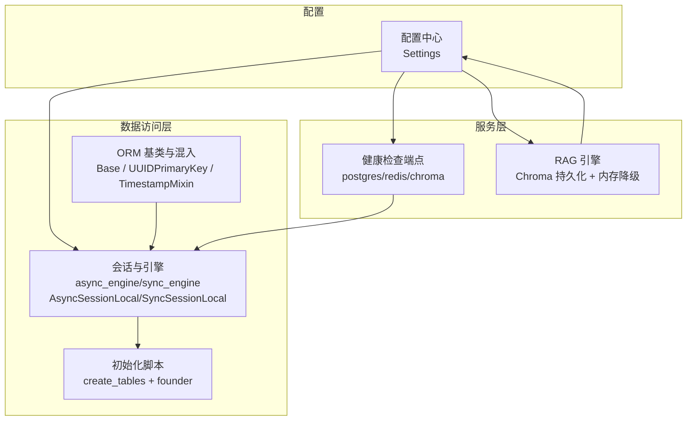
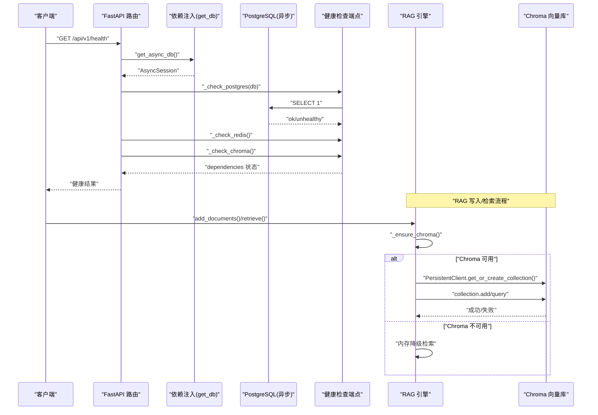
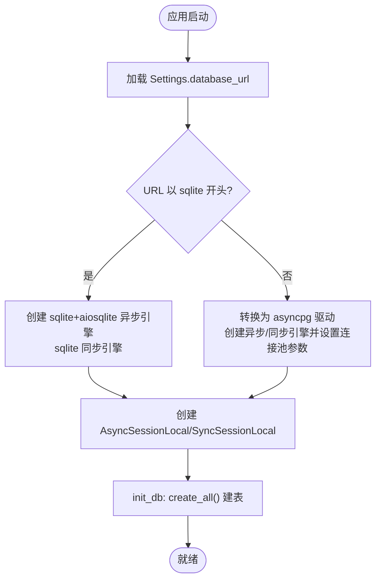
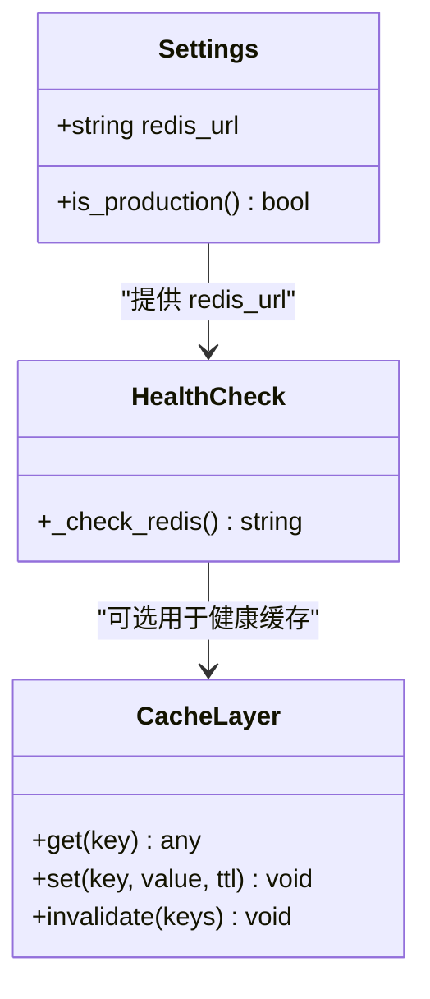
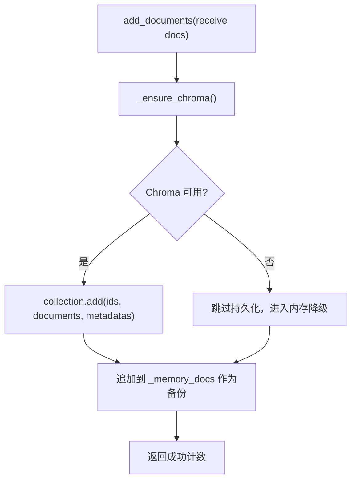
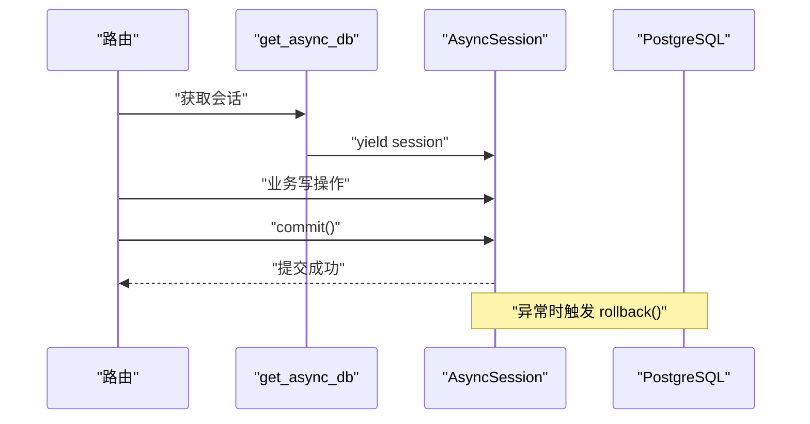
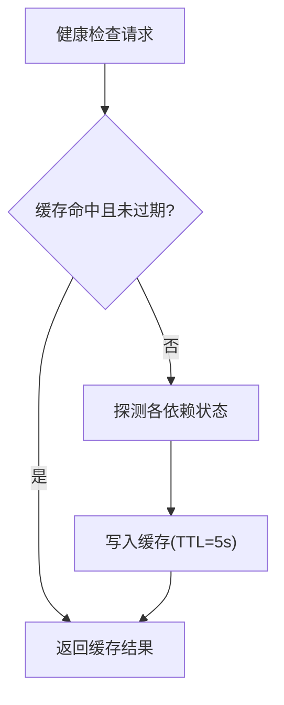
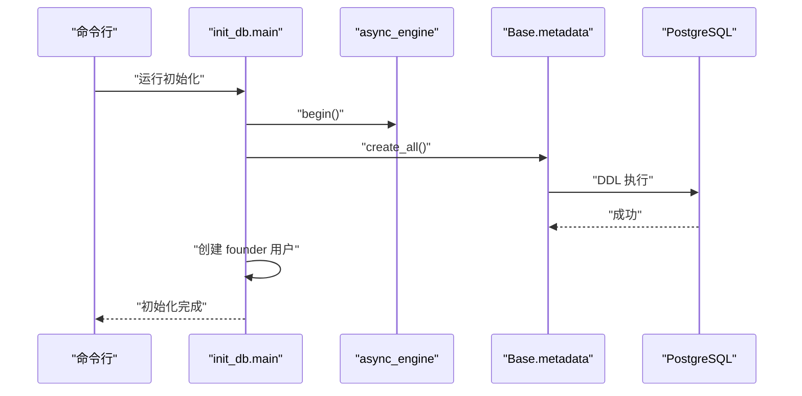
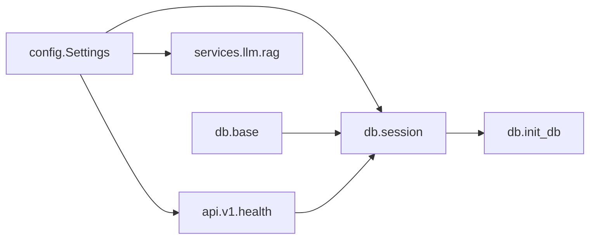

# 多数据库集成

<cite>
**本文引用的文件列表**
- [backend/app/core/config.py](file://precision-drug-design/backend/app/core/config.py)
- [backend/app/db/base.py](file://precision-drug-design/backend/app/db/base.py)
- [backend/app/db/session.py](file://precision-drug-design/backend/app/db/session.py)
- [backend/app/db/init_db.py](file://precision-drug-design/backend/app/db/init_db.py)
- [backend/app/api/v1/health.py](file://precision-drug-design/backend/app/api/v1/health.py)
- [backend/app/services/llm/rag.py](file://precision-drug-design/backend/app/services/llm/rag.py)
- [docs/design/03-database.md](file://precision-drug-design/docs/design/03-database.md)
</cite>

## 目录
1. [简介](#简介)
2. [项目结构](#项目结构)
3. [核心组件](#核心组件)
4. [架构总览](#架构总览)
5. [详细组件分析](#详细组件分析)
6. [依赖关系分析](#依赖关系分析)
7. [性能考量](#性能考量)
8. [故障排查指南](#故障排查指南)
9. [结论](#结论)
10. [附录](#附录)

## 简介
本文件面向 AI 药物设计系统的多数据库集成，聚焦 PostgreSQL、Redis、Chroma 向量库的接入方案与工程化实践。内容涵盖连接配置管理、数据一致性保证机制、读写分离策略、缓存失效机制、初始化流程、迁移管理、备份恢复策略，以及跨数据库事务处理、分布式 ID 生成和数据同步机制的设计建议。文档同时给出代码级架构图与流程图，帮助读者快速理解系统的数据层设计与扩展点。

## 项目结构
后端采用分层组织：配置集中管理、数据库会话统一封装、健康检查暴露依赖状态、RAG 服务对接 Chroma。关键路径如下：
- 配置中心：Settings 提供数据库、Redis、Chroma 等环境变量加载与校验
- 数据访问层：SQLAlchemy 异步/同步引擎与会话工厂，FastAPI 依赖注入
- 初始化脚本：建表与初始用户创建
- 健康检查：Postgres/Redis/Chroma 可用性探测
- RAG 引擎：基于 Chroma 的持久化集合与内存降级检索

图表来源
- [backend/app/core/config.py:21-144](file://precision-drug-design/backend/app/core/config.py#L21-L144)
- [backend/app/db/base.py:13-48](file://precision-drug-design/backend/app/db/base.py#L13-L48)
- [backend/app/db/session.py:48-91](file://precision-drug-design/backend/app/db/session.py#L48-L91)
- [backend/app/db/init_db.py:35-88](file://precision-drug-design/backend/app/db/init_db.py#L35-L88)
- [backend/app/api/v1/health.py:27-51](file://precision-drug-design/backend/app/api/v1/health.py#L27-L51)
- [backend/app/services/llm/rag.py:62-88](file://precision-drug-design/backend/app/services/llm/rag.py#L62-L88)

章节来源
- [backend/app/core/config.py:21-144](file://precision-drug-design/backend/app/core/config.py#L21-L144)
- [backend/app/db/base.py:13-48](file://precision-drug-design/backend/app/db/base.py#L13-L48)
- [backend/app/db/session.py:48-91](file://precision-drug-design/backend/app/db/session.py#L48-L91)
- [backend/app/db/init_db.py:35-88](file://precision-drug-design/backend/app/db/init_db.py#L35-L88)
- [backend/app/api/v1/health.py:27-51](file://precision-drug-design/backend/app/api/v1/health.py#L27-L51)
- [backend/app/services/llm/rag.py:62-88](file://precision-drug-design/backend/app/services/llm/rag.py#L62-L88)

## 核心组件
- 配置中心（Settings）
  - 集中定义数据库 URL、Redis URL、Chroma 持久化目录等键值，支持 .env 与环境变量覆盖
  - 提供 is_production 等便捷属性，便于环境差异化行为
- 数据库会话（session.py）
  - 根据 database_url 自动选择 SQLite 或 Postgres 驱动，并构造 async_engine/sync_engine
  - 提供 FastAPI 依赖 get_async_db/get_sync_db，异常时自动回滚
- ORM 基类与混入（base.py）
  - Base 作为 DeclarativeBase
  - UUIDPrimaryKey 使用 UUID4 主键，利于分布式场景
  - TimestampMixin 维护 created_at/updated_at 时间戳
- 初始化脚本（init_db.py）
  - 通过 async_engine.begin 调用 Base.metadata.create_all 创建所有表
  - 创建默认创始人用户（founder），幂等保护
- 健康检查（health.py）
  - 探测 postgres/redis/chroma 可用性，返回整体健康状态
- RAG 引擎（rag.py）
  - 惰性初始化 Chroma PersistentClient，失败则降级为内存关键词检索
  - 提供 add_documents/retrieve/build_context 接口

章节来源
- [backend/app/core/config.py:21-144](file://precision-drug-design/backend/app/core/config.py#L21-L144)
- [backend/app/db/session.py:48-91](file://precision-drug-design/backend/app/db/session.py#L48-L91)
- [backend/app/db/base.py:13-48](file://precision-drug-design/backend/app/db/base.py#L13-L48)
- [backend/app/db/init_db.py:35-88](file://precision-drug-design/backend/app/db/init_db.py#L35-L88)
- [backend/app/api/v1/health.py:27-51](file://precision-drug-design/backend/app/api/v1/health.py#L27-L51)
- [backend/app/services/llm/rag.py:62-88](file://precision-drug-design/backend/app/services/llm/rag.py#L62-L88)

## 架构总览
下图展示应用启动到请求处理的典型数据流，包括配置加载、数据库会话、健康检查与 RAG 检索。

图表来源
- [backend/app/api/v1/health.py:27-51](file://precision-drug-design/backend/app/api/v1/health.py#L27-L51)
- [backend/app/db/session.py:94-128](file://precision-drug-design/backend/app/db/session.py#L94-L128)
- [backend/app/services/llm/rag.py:62-88](file://precision-drug-design/backend/app/services/llm/rag.py#L62-L88)

## 详细组件分析

### PostgreSQL 集成与连接配置
- 连接字符串由 Settings.database_url 提供，默认指向本地 Postgres；可通过环境变量覆盖
- session.py 根据 URL 前缀判断是否 SQLite，否则使用 asyncpg 驱动构建异步引擎，并启用连接池参数（pool_pre_ping、pool_size、max_overflow）
- 提供 get_async_db 依赖注入，在请求结束时 commit，异常时 rollback
- init_db.py 使用 async_engine.begin 执行 create_all，确保所有模型表存在

图表来源
- [backend/app/core/config.py:37-40](file://precision-drug-design/backend/app/core/config.py#L37-L40)
- [backend/app/db/session.py:48-80](file://precision-drug-design/backend/app/db/session.py#L48-L80)
- [backend/app/db/init_db.py:35-40](file://precision-drug-design/backend/app/db/init_db.py#L35-L40)

章节来源
- [backend/app/core/config.py:37-40](file://precision-drug-design/backend/app/core/config.py#L37-L40)
- [backend/app/db/session.py:48-80](file://precision-drug-design/backend/app/db/session.py#L48-L80)
- [backend/app/db/init_db.py:35-40](file://precision-drug-design/backend/app/db/init_db.py#L35-L40)

### Redis 集成与缓存策略
- 配置项 redis_url 已预留，当前健康检查仅做导入检测，实际连接与使用可在服务层初始化阶段完成
- 健康检查端点将 Redis 状态纳入依赖矩阵，未安装 redis 客户端时返回 not_configured
- 建议在服务启动时建立 Redis 连接池，并在需要处注入客户端实例

图表来源
- [backend/app/core/config.py:41-43](file://precision-drug-design/backend/app/core/config.py#L41-L43)
- [backend/app/api/v1/health.py:35-41](file://precision-drug-design/backend/app/api/v1/health.py#L35-L41)

章节来源
- [backend/app/core/config.py:41-43](file://precision-drug-design/backend/app/core/config.py#L41-L43)
- [backend/app/api/v1/health.py:35-41](file://precision-drug-design/backend/app/api/v1/health.py#L35-L41)

### Chroma 向量库集成与降级策略
- RAG 引擎惰性初始化 Chroma PersistentClient，失败则降级为内存关键词检索
- 集合元数据指定 HNSW cosine 空间，适合语义相似度检索
- 添加文档时若 Chroma 失败仍会记录到内存，保障基本可用性

图表来源
- [backend/app/services/llm/rag.py:62-88](file://precision-drug-design/backend/app/services/llm/rag.py#L62-L88)
- [backend/app/services/llm/rag.py:90-124](file://precision-drug-design/backend/app/services/llm/rag.py#L90-L124)

章节来源
- [backend/app/services/llm/rag.py:62-88](file://precision-drug-design/backend/app/services/llm/rag.py#L62-L88)
- [backend/app/services/llm/rag.py:90-124](file://precision-drug-design/backend/app/services/llm/rag.py#L90-L124)

### 数据一致性保证机制
- 数据库事务：get_async_db 在请求上下文内自动 commit，异常时 rollback，保证单请求原子性
- 对象标识：UUIDPrimaryKey 使用 UUID4，避免自增主键在多节点冲突
- 审计字段：TimestampMixin 维护 created_at/updated_at，便于追踪变更
- 健康检查：对依赖进行周期性探测，降低不一致风险

图表来源
- [backend/app/db/session.py:94-128](file://precision-drug-design/backend/app/db/session.py#L94-L128)
- [backend/app/db/base.py:17-48](file://precision-drug-design/backend/app/db/base.py#L17-L48)

章节来源
- [backend/app/db/session.py:94-128](file://precision-drug-design/backend/app/db/session.py#L94-L128)
- [backend/app/db/base.py:17-48](file://precision-drug-design/backend/app/db/base.py#L17-L48)

### 读写分离策略
- 当前实现未显式区分读写副本，但可通过以下方式扩展：
  - 在 Settings 中增加 database_read_url/database_write_url
  - 在 session.py 中创建只读引擎与读写引擎，按路由或方法选择不同会话
  - 在依赖注入层根据上下文决定使用哪个引擎

[本节为概念性扩展建议，不直接分析具体文件]

### 缓存失效机制
- 健康检查端点使用进程内字典缓存，TTL 为 5 秒，过期后重新探测
- 生产环境可替换为 Redis 缓存，并提供按 key 的失效策略（如命名空间 + 版本号）

图表来源
- [backend/app/api/v1/health.py:22-25](file://precision-drug-design/backend/app/api/v1/health.py#L22-L25)
- [backend/app/api/v1/health.py:63-89](file://precision-drug-design/backend/app/api/v1/health.py#L63-L89)

章节来源
- [backend/app/api/v1/health.py:22-25](file://precision-drug-design/backend/app/api/v1/health.py#L22-L25)
- [backend/app/api/v1/health.py:63-89](file://precision-drug-design/backend/app/api/v1/health.py#L63-L89)

### 数据库初始化流程
- 入口：python -m backend.app.db.init_db
- 步骤：
  - 读取 Settings.database_url
  - 使用 async_engine.begin 执行 Base.metadata.create_all
  - 创建 founder 用户（幂等）

图表来源
- [backend/app/db/init_db.py:64-88](file://precision-drug-design/backend/app/db/init_db.py#L64-L88)
- [backend/app/db/init_db.py:35-40](file://precision-drug-design/backend/app/db/init_db.py#L35-L40)

章节来源
- [backend/app/db/init_db.py:64-88](file://precision-drug-design/backend/app/db/init_db.py#L64-L88)
- [backend/app/db/init_db.py:35-40](file://precision-drug-design/backend/app/db/init_db.py#L35-L40)

### 迁移管理
- 设计文档建议使用 Alembic 进行版本化管理，包含生成、升级、回滚命令
- 迁移文件位于 migrations/versions 目录，初始迁移创建全部表与索引

章节来源
- [docs/design/03-database.md:309-322](file://precision-drug-design/docs/design/03-database.md#L309-L322)

### 备份恢复策略
- 设计文档建议：
  - PostgreSQL 每日全量 + WAL 持续归档
  - 对象存储（S3）跨区域复制
  - 静态加密与传输加密

章节来源
- [docs/design/03-database.md:298-306](file://precision-drug-design/docs/design/03-database.md#L298-L306)

### 跨数据库事务处理
- 当前实现未提供跨数据库（Postgres + Redis/Chroma）的事务协调器
- 建议模式：
  - 使用 Saga 或补偿事务：先写主库，再写缓存/向量库；失败时执行反向补偿
  - 引入消息队列作为最终一致性的缓冲层
  - 对关键路径增加幂等与重试机制

[本节为概念性扩展建议，不直接分析具体文件]

### 分布式 ID 生成
- 模型层使用 UUID4 作为主键，天然具备分布式唯一性
- 如需更高吞吐或有序 ID，可考虑 Snowflake 或 ULID，但需权衡排序性与兼容性

章节来源
- [backend/app/db/base.py:17-27](file://precision-drug-design/backend/app/db/base.py#L17-L27)

### 数据同步机制
- 当前 RAG 引擎在 Chroma 不可用时降级为内存检索，并始终同步到内存作为备份
- 对于多源数据（Postgres 业务数据 → Chroma 知识向量），建议：
  - 增量同步：监听业务库变更事件（如 CDC）或定时任务拉取差异
  - 去重与幂等：基于 source 与 content hash 避免重复插入
  - 批量写入：减少网络往返，提升吞吐

章节来源
- [backend/app/services/llm/rag.py:117-124](file://precision-drug-design/backend/app/services/llm/rag.py#L117-L124)

## 依赖关系分析
- 配置中心被数据访问层与服务层共同依赖
- 会话层依赖配置中心提供的 database_url
- 健康检查依赖会话层与外部库导入检测
- RAG 引擎依赖配置中心的 chroma_persist_dir

图表来源
- [backend/app/core/config.py:21-144](file://precision-drug-design/backend/app/core/config.py#L21-L144)
- [backend/app/db/session.py:48-91](file://precision-drug-design/backend/app/db/session.py#L48-L91)
- [backend/app/db/base.py:13-48](file://precision-drug-design/backend/app/db/base.py#L13-L48)
- [backend/app/db/init_db.py:35-88](file://precision-drug-design/backend/app/db/init_db.py#L35-L88)
- [backend/app/api/v1/health.py:27-51](file://precision-drug-design/backend/app/api/v1/health.py#L27-L51)
- [backend/app/services/llm/rag.py:62-88](file://precision-drug-design/backend/app/services/llm/rag.py#L62-L88)

章节来源
- [backend/app/core/config.py:21-144](file://precision-drug-design/backend/app/core/config.py#L21-L144)
- [backend/app/db/session.py:48-91](file://precision-drug-design/backend/app/db/session.py#L48-L91)
- [backend/app/db/base.py:13-48](file://precision-drug-design/backend/app/db/base.py#L13-L48)
- [backend/app/db/init_db.py:35-88](file://precision-drug-design/backend/app/db/init_db.py#L35-L88)
- [backend/app/api/v1/health.py:27-51](file://precision-drug-design/backend/app/api/v1/health.py#L27-L51)
- [backend/app/services/llm/rag.py:62-88](file://precision-drug-design/backend/app/services/llm/rag.py#L62-L88)

## 性能考量
- 连接池：非 SQLite 场景下启用 pool_pre_ping、pool_size、max_overflow，有助于在高并发下稳定连接
- 健康检查缓存：5 秒 TTL 降低频繁探测带来的额外开销
- RAG 降级：Chroma 不可用时内存检索保障基本功能，但需注意内存占用与检索精度
- 建议：
  - 在生产环境启用 Redis 缓存层，替代进程内缓存
  - 对高频查询增加二级缓存与分页限制
  - 对大对象（如分子结构文件）使用对象存储，数据库仅存引用

[本节为通用指导，不直接分析具体文件]

## 故障排查指南
- 健康检查返回 unhealthy/not_configured：
  - 确认数据库 URL、Redis URL、Chroma 持久化目录配置正确
  - 检查依赖库是否安装（redis.asyncio、chromadb）
- 初始化失败：
  - 检查数据库权限与 schema 是否存在
  - 查看日志输出中的错误堆栈
- RAG 检索异常：
  - 确认 chroma_persist_dir 可写
  - 观察降级逻辑是否生效

章节来源
- [backend/app/api/v1/health.py:27-51](file://precision-drug-design/backend/app/api/v1/health.py#L27-L51)
- [backend/app/db/init_db.py:64-88](file://precision-drug-design/backend/app/db/init_db.py#L64-L88)
- [backend/app/services/llm/rag.py:62-88](file://precision-drug-design/backend/app/services/llm/rag.py#L62-L88)

## 结论
本项目在多数据库集成方面提供了清晰的配置管理与会话封装，结合健康检查与 RAG 降级策略，具备良好的可扩展性与容错能力。后续可在以下方向增强：
- 引入 Redis 缓存层与健壮的失效策略
- 实现读写分离与跨库事务协调（Saga/CDC）
- 完善迁移与备份恢复自动化流程
- 优化向量库同步与去重机制

[本节为总结性内容，不直接分析具体文件]

## 附录
- 文件系统布局与数据安全参考设计文档
- 迁移管理命令与目录约定

章节来源
- [docs/design/03-database.md:272-325](file://precision-drug-design/docs/design/03-database.md#L272-L325)