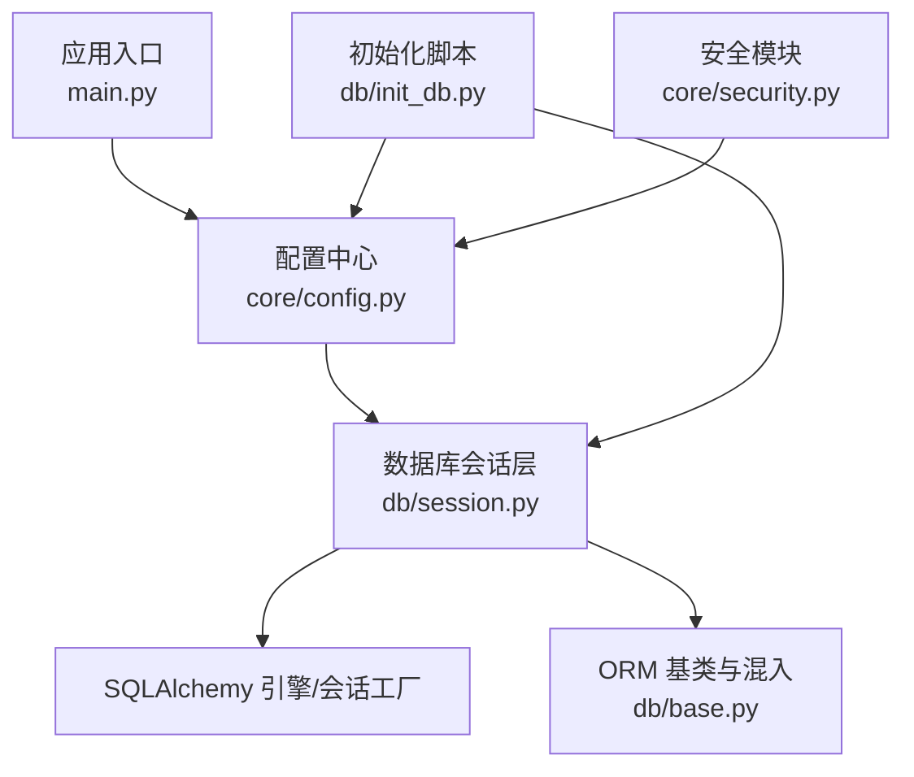
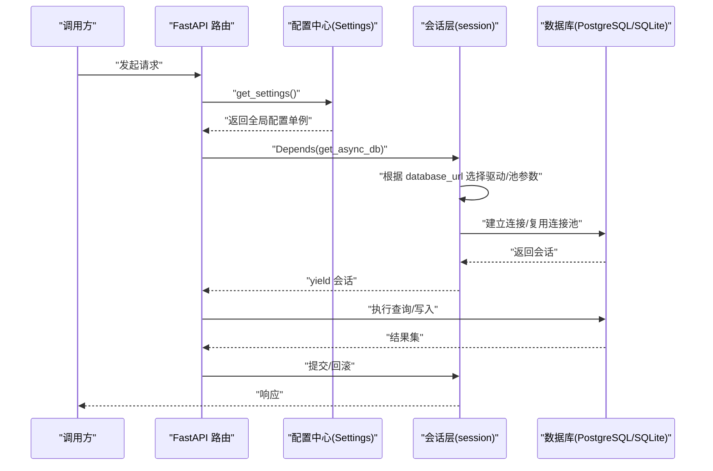
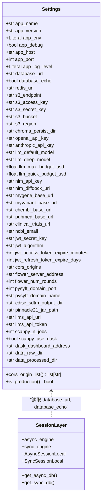
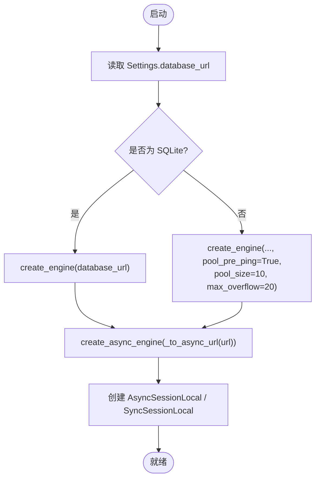
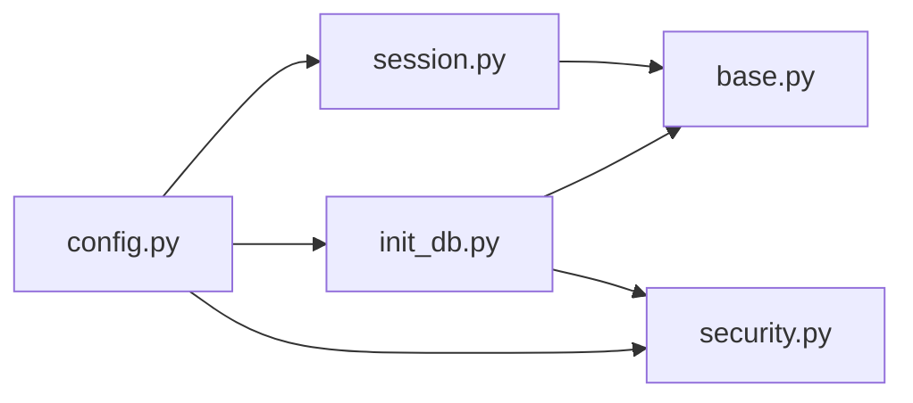

# 数据库配置管理

<cite>
**本文引用的文件**   
- [backend/app/core/config.py](file://backend/app/core/config.py)
- [backend/app/db/session.py](file://backend/app/db/session.py)
- [backend/app/db/base.py](file://backend/app/db/base.py)
- [backend/app/db/init_db.py](file://backend/app/db/init_db.py)
- [backend/app/core/security.py](file://backend/app/core/security.py)
- [README.md](file://README.md)
- [docs/DEPLOYMENT.md](file://docs/DEPLOYMENT.md)
- [scripts/verify_env.py](file://scripts/verify_env.py)
- [tests/conftest.py](file://tests/conftest.py)
</cite>

## 目录
1. [简介](#简介)
2. [项目结构](#项目结构)
3. [核心组件](#核心组件)
4. [架构总览](#架构总览)
5. [详细组件分析](#详细组件分析)
6. [依赖关系分析](#依赖关系分析)
7. [性能与连接池](#性能与连接池)
8. [多环境与差异化配置](#多环境与差异化配置)
9. [敏感信息与密码安全](#敏感信息与密码安全)
10. [容器化与云原生集成](#容器化与云原生集成)
11. [配置验证与热重载](#配置验证与热重载)
12. [故障排查](#故障排查)
13. [结论](#结论)

## 简介
本文件聚焦于 AI 药物设计系统的数据库配置管理，覆盖以下主题：
- 多环境配置管理与环境变量优先级
- 配置文件组织结构与加载机制
- 数据库连接参数动态配置（含方言切换、异步/同步引擎）
- 密码加密存储与敏感信息管理
- 开发、测试、生产环境的差异化配置建议
- 配置验证机制与热重载策略
- 容器化部署中的配置注入、Kubernetes ConfigMap 集成与云原生最佳实践

## 项目结构
围绕数据库配置的关键代码位于后端模块中：
- 配置中心：基于 pydantic-settings 的全局 Settings 单例
- 会话与引擎：SQLAlchemy 异步/同步引擎与会话工厂
- 初始化脚本：建表与初始用户创建
- 安全模块：密码哈希与 JWT 密钥使用
- 文档与示例：README 与部署指南提供环境变量清单与环境样例说明

图表来源
- [backend/app/core/config.py:1-144](file://backend/app/core/config.py#L1-L144)
- [backend/app/db/session.py:1-128](file://backend/app/db/session.py#L1-L128)
- [backend/app/db/base.py:1-48](file://backend/app/db/base.py#L1-L48)
- [backend/app/db/init_db.py:1-88](file://backend/app/db/init_db.py#L1-L88)
- [backend/app/core/security.py:1-211](file://backend/app/core/security.py#L1-L211)

章节来源
- [README.md:139-187](file://README.md#L139-L187)
- [docs/DEPLOYMENT.md:252-277](file://docs/DEPLOYMENT.md#L252-L277)

## 核心组件
- 配置中心（Settings）
  - 通过 pydantic-settings 从 .env 或真实环境变量加载，支持类型校验与默认值填充。
  - 提供 app_env、database_url、database_echo 等字段；暴露 is_production 属性用于环境判断。
  - 使用 lru_cache 缓存 get_settings() 返回的单例，避免重复读取。
- 数据库会话层（session）
  - 根据 database_url 自动选择 SQLite 或非 SQLite 的引擎构造路径。
  - 提供异步引擎（FastAPI 路由）、同步引擎（脚本/工具），并定义 AsyncSessionLocal/SyncSessionLocal。
  - 提供 FastAPI 依赖 get_async_db/get_sync_db，自动提交/回滚与资源释放。
- ORM 基类（base）
  - 提供 Base、UUIDPrimaryKey、TimestampMixin 等公共能力。
- 初始化脚本（init_db）
  - 导入所有模型以注册到 Base.metadata，创建表，并可选创建初始 founder 用户。
- 安全模块（security）
  - 提供 bcrypt 密码哈希与校验，JWT 生成与解析，依赖 Settings 中的 jwt_secret_key 等。

章节来源
- [backend/app/core/config.py:21-144](file://backend/app/core/config.py#L21-L144)
- [backend/app/db/session.py:25-128](file://backend/app/db/session.py#L25-L128)
- [backend/app/db/base.py:13-48](file://backend/app/db/base.py#L13-L48)
- [backend/app/db/init_db.py:35-88](file://backend/app/db/init_db.py#L35-L88)
- [backend/app/core/security.py:32-58](file://backend/app/core/security.py#L32-L58)

## 架构总览
下图展示了配置加载、引擎构建、会话获取与请求处理的端到端流程。

图表来源
- [backend/app/core/config.py:136-144](file://backend/app/core/config.py#L136-L144)
- [backend/app/db/session.py:48-128](file://backend/app/db/session.py#L48-L128)

## 详细组件分析

### 配置中心（Settings）
- 环境变量优先级（高→低）：真实环境变量 > .env 文件 > 代码默认值。
- 关键数据库相关字段：
  - database_url：完整连接字符串，支持 PostgreSQL 与 SQLite 方言。
  - database_echo：是否打印 SQL 日志。
- 其他与安全相关的字段：
  - jwt_secret_key、jwt_algorithm、jwt_access_token_expire_minutes、jwt_refresh_token_expire_days。
- 特性：
  - case_sensitive=False，大小写不敏感。
  - extra="ignore"，忽略未知变量。
  - field_validator 对 CORS_ORIGINS 进行规范化处理。
  - is_production 属性便于按环境分支逻辑。

图表来源
- [backend/app/core/config.py:21-144](file://backend/app/core/config.py#L21-L144)
- [backend/app/db/session.py:48-91](file://backend/app/db/session.py#L48-L91)

章节来源
- [backend/app/core/config.py:1-144](file://backend/app/core/config.py#L1-L144)

### 数据库会话层（session）
- URL 转换：
  - 将 psycopg2/psycopg 转换为 asyncpg；sqlite 转为 sqlite+aiosqlite。
- 引擎构造：
  - SQLite：不使用连接池参数。
  - 非 SQLite：启用 pool_pre_ping、pool_size=10、max_overflow=20。
- 会话工厂：
  - AsyncSessionLocal：expire_on_commit=False，autoflush=False。
  - SyncSessionLocal：用于脚本/CLI。
- 依赖注入：
  - get_async_db / get_sync_db：自动提交/回滚与关闭。

图表来源
- [backend/app/db/session.py:25-91](file://backend/app/db/session.py#L25-L91)

章节来源
- [backend/app/db/session.py:1-128](file://backend/app/db/session.py#L1-L128)

### ORM 基类与混入（base）
- Base：DeclarativeBase 基类。
- UUIDPrimaryKey：UUID 主键，适合分布式场景。
- TimestampMixin：created_at/updated_at 时间戳，服务器默认与更新触发。

章节来源
- [backend/app/db/base.py:13-48](file://backend/app/db/base.py#L13-L48)

### 初始化脚本（init_db）
- 功能：
  - 导入所有模型以注册到 Base.metadata。
  - 使用 async_engine.begin 创建所有表。
  - 使用 SyncSessionLocal 插入初始 founder 用户（密码经 bcrypt 哈希）。
- 运行方式：
  - python -m backend.app.db.init_db [email] [password]

章节来源
- [backend/app/db/init_db.py:1-88](file://backend/app/db/init_db.py#L1-L88)
- [backend/app/core/security.py:32-58](file://backend/app/core/security.py#L32-L58)

## 依赖关系分析
- 配置中心被会话层、初始化脚本、安全模块广泛引用。
- 会话层依赖配置中心的 database_url、database_echo。
- 初始化脚本依赖会话层的引擎与会话工厂，以及安全模块的密码哈希。
- 安全模块依赖配置中心的 JWT 相关字段。

图表来源
- [backend/app/core/config.py:136-144](file://backend/app/core/config.py#L136-L144)
- [backend/app/db/session.py:22-91](file://backend/app/db/session.py#L22-L91)
- [backend/app/db/init_db.py:16-32](file://backend/app/db/init_db.py#L16-L32)
- [backend/app/core/security.py:21-22](file://backend/app/core/security.py#L21-L22)

## 性能与连接池
- 连接池参数（非 SQLite）：
  - pool_pre_ping=True：在每次使用前探测连接有效性，降低断连风险。
  - pool_size=10：基础连接数。
  - max_overflow=20：最大溢出连接数。
- 建议：
  - 根据并发量与数据库实例规格调整 pool_size 与 max_overflow。
  - 生产环境建议使用 PostgreSQL 并开启连接池；本地开发可使用 SQLite 快速验证。

章节来源
- [backend/app/db/session.py:64-80](file://backend/app/db/session.py#L64-L80)

## 多环境与差异化配置
- 环境变量优先级：
  - 真实环境变量 > .env 文件 > 代码默认值。
- 环境标识：
  - app_env 支持 development/staging/production；is_production 可用于条件逻辑。
- 典型差异：
  - 开发：SQLite，DEBUG=True，CORS 允许本地前端地址。
  - 测试：独立 test_db，可重置数据。
  - 生产：PostgreSQL，禁用 DEBUG，严格 CORS，强密码策略与审计。
- 参考清单：
  - README 与部署文档提供了 DATABASE_URL、REDIS_URL、S3_*、LLM_*、JWT_* 等关键字段说明。

章节来源
- [backend/app/core/config.py:28-36](file://backend/app/core/config.py#L28-L36)
- [backend/app/core/config.py:124-127](file://backend/app/core/config.py#L124-L127)
- [README.md:139-187](file://README.md#L139-L187)
- [docs/DEPLOYMENT.md:252-277](file://docs/DEPLOYMENT.md#L252-L277)

## 敏感信息与密码安全
- 密码存储：
  - 使用 bcrypt 进行哈希，避免明文存储。
  - verify_password 使用恒定时间比较，抵御时序攻击。
- JWT 密钥：
  - jwt_secret_key、jwt_algorithm 由配置中心提供，不应硬编码。
- 敏感信息建议：
  - 数据库凭据、API Key、对象存储密钥等一律通过环境变量注入。
  - 不在代码与仓库中保留 .env 实际内容。

章节来源
- [backend/app/core/security.py:32-58](file://backend/app/core/security.py#L32-L58)
- [backend/app/core/config.py:78-82](file://backend/app/core/config.py#L78-L82)

## 容器化与云原生集成
- Docker 注入：
  - 使用 --env-file .env 将配置注入容器进程。
- Kubernetes ConfigMap/Secret：
  - 将非敏感配置放入 ConfigMap，敏感配置（如数据库密码、JWT 密钥）放入 Secret。
  - 通过环境变量挂载至 Pod，确保运行时覆盖 .env 默认值。
- 云原生最佳实践：
  - 使用只读根文件系统，仅挂载必要数据卷。
  - 使用健康检查探针（/api/v1/health）保障可用性。
  - 结合滚动更新与蓝绿发布，实现零停机配置变更。
  - 使用外部密钥管理服务（如 KMS/Cloud KMS）解密后注入 Secret。

章节来源
- [README.md:395-403](file://README.md#L395-L403)
- [docs/DEPLOYMENT.md:172-202](file://docs/DEPLOYMENT.md#L172-L202)

## 配置验证与热重载
- 配置验证：
  - pydantic-settings 在加载时进行类型校验与默认值填充。
  - 可通过自定义 field_validator 增强校验（例如 CORS_ORIGINS 规范化）。
  - 建议在启动阶段增加显式校验（如必填项、端口范围、URL 格式），失败则快速失败。
- 热重载：
  - 开发环境 uvicorn --reload 可实现代码热重载，但配置单例由 lru_cache 缓存，需重启服务以生效。
  - 若需运行时热重载配置，可在 get_settings 中引入缓存失效策略或监听文件/配置中心事件后 cache_clear。
- 测试环境：
  - 通过 pytest 的 conftest 设置 DATABASE_URL 指向测试库，保证隔离。

章节来源
- [backend/app/core/config.py:112-144](file://backend/app/core/config.py#L112-L144)
- [tests/conftest.py:17](file://tests/conftest.py#L17)

## 故障排查
- 常见问题与建议：
  - 数据库锁定（SQLite）：确保无其他进程占用数据文件。
  - 端口冲突：检查 8000/8501 端口占用情况并终止冲突进程。
  - 模块导入失败：确认在项目根目录执行命令或设置 PYTHONPATH。
  - 连接失败：核对 DATABASE_URL 格式与网络可达性。
- 诊断手段：
  - 启用 database_echo 输出 SQL 语句定位问题。
  - 使用 health 端点验证服务状态。

章节来源
- [docs/DEPLOYMENT.md:280-322](file://docs/DEPLOYMENT.md#L280-L322)
- [backend/app/db/session.py:64-80](file://backend/app/db/session.py#L64-L80)

## 结论
本项目采用集中式配置中心与 SQLAlchemy 会话层解耦的方式，实现了灵活的数据库配置管理。通过环境变量优先级、类型校验与默认值填充，保证了多环境的一致性与可维护性。在生产环境中，应结合容器编排与密钥管理，遵循最小权限与可观测性原则，持续优化连接池与监控告警，确保系统稳定高效运行。